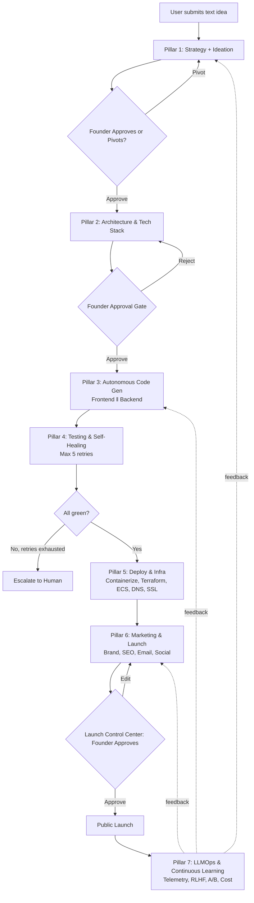
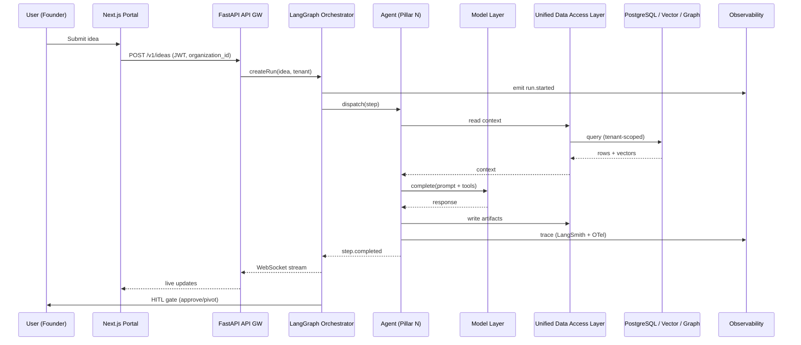
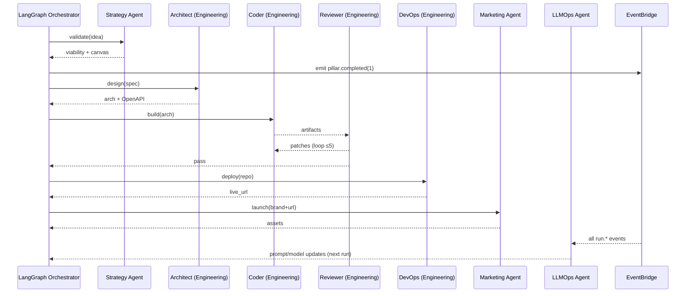

# CLAUDE.md — AutoFounder AI

> This file provides project context, architecture guidance, and conventions for Claude Code agents working on the AutoFounder AI platform. Read this before writing any code, modifying any agent, or making infrastructure changes.

## 1. Executive Summary

AutoFounder AI is a **multi-tenant, agentic AI SaaS platform** that converts a single text idea into a fully validated, designed, built, tested, deployed, marketed, and continuously-improved software business — autonomously.

It is delivered as a **10-layer reference architecture** (Input → Orchestration → Agents → Models → Data & Knowledge → Output → Services → Guardrails → Compliance → Observability) running on **AWS (ECS Fargate, multi-AZ VPC)**, orchestrated via **LangGraph**, governed by a **6-stage guardrails pipeline**, and observed via a full **OpenTelemetry + ELK + Prometheus + LangSmith** MLOps stack.


---

## 2. System Overview

- **Product**: AutoFounder AI — Next-Generation Autonomous Startup Creation System.
- **Type**: Multi-tenant AI SaaS, agentic system powered by LLMs + Generative AI.
- **Org**: Euron AutoFounder AI, Bengaluru, Karnataka, India — `product@euron.one`.
- **Tagline**: "A true AI co-founder that gets things done."
- **Four pillars of differentiation**: Multi-Agent Collaboration · Persistent Memory · Secure & Scalable · Multi-Tenant SaaS.
- **Core loop (every agent)**: `Understand → Plan → Execute → Verify → Learn`.

---

## 3. Business Objective

Solve the four canonical founder failures:

| Failure | Cost in traditional path | AutoFounder AI |
|---|---|---|
| 90% of startups build things nobody wants | 3+ weeks, $5K+ on validation | 30 minutes |
| Wrong stack chosen | 1+ week debating | Architect Agent in minutes |
| MVP costs $15K–$50K and takes 3–6 months | 3–6 months | 7 days |
| Launch fizzles (zero traffic) | 2–3 extra weeks of GTM | 2 hours |
| **Total** | **4–7 months, $20K–$60K** | **~7 days, $200–$700** |

Targets: **99% faster, 99% cheaper, production-grade output**.

---

## 4. High-Level Architecture (10 Layers)

```
┌──────────────────────────────────────────────────────────────────────────┐
│  1. INPUT LAYER  (multi-modal, multi-source)                              │
│     IoT/Wearables · APIs/Webhooks/Streams · Docs/PDFs · Images · Videos   │
│     · Voice/Audio · User Feedback · Third-party Market Data               │
└──────────────────────────────────────────────────────────────────────────┘
                                   │
┌──────────────────────────────────────────────────────────────────────────┐
│  2. AGENT ORCHESTRATION LAYER  (LangGraph)                                │
│     Dynamic Task Allocation · Inter-Agent Comms (event bus) · Workflow & │
│     Plan Mgmt (DAGs, checkpoints) · Monitoring & Observability · HITL    │
└──────────────────────────────────────────────────────────────────────────┘
                                   │
┌──────────────────────────────────────────────────────────────────────────┐
│  3. AI AGENTS LAYER  (specialized & collaborative)                        │
│     Strategy & Ideation · Product Planner · Research · Engineering ·     │
│     Marketing · Finance · Ops & Risk                                     │
│     Capabilities: Planning · Reasoning · Tool Use · Memory · Self-Learn  │
└──────────────────────────────────────────────────────────────────────────┘
                                   │
┌──────────────────────────────────────────────────────────────────────────┐
│  4. MODEL & CAPABILITY LAYER                                              │
│     LLM (foundational + instruction-tuned) · Embeddings · Vision ·       │
│     Speech/Audio · RAG & Retrieval · RLHF / Alignment                    │
└──────────────────────────────────────────────────────────────────────────┘
                                   │
┌──────────────────────────────────────────────────────────────────────────┐
│  5. DATA & KNOWLEDGE LAYER                                                │
│     Raw Data Lake (S3) · Relational + Vector (Supabase — PostgreSQL +    │
│     pgvector + Storage) · Graph (Neo4j / Neptune) · Object Store ·       │
│     Cache & Session (Redis / DynamoDB)                                   │
│     ⇣ Unified Data Access Layer (APIs) ⇣                                 │
└──────────────────────────────────────────────────────────────────────────┘
                                   │
                ┌──────────────────┴──────────────────┐
                ▼                                     ▼
┌──────────────────────────────┐  ┌───────────────────────────────────────┐
│ 6. OUTPUT & EXPERIENCE LAYER │  │ 7. SERVICE & INTEGRATION LAYER         │
│   Customisation Output       │  │   Multi-Channel Delivery (Web/Mobile/  │
│   Knowledge Updates          │  │   Email/Slack/Teams/APIs)              │
│   Enriched Synthetic Data    │  │   3rd-party (CRM/ERP/DevTools/Pay)    │
│   Actionable Automations     │  │   Automation (Zapier/n8n/Airflow/SF)   │
│   Real-time Notifications    │  │   API Gateway (REST/GraphQL/gRPC)      │
└──────────────────────────────┘  └───────────────────────────────────────┘
                                   │
┌──────────────────────────────────────────────────────────────────────────┐
│  8. GUARDRAILS & GOVERNANCE LAYER                                         │
│     Policy & Rules · Input Guardrails · Instruction Guardrails ·         │
│     Execution Guardrails · Output Guardrails · Monitoring Guardrails ·   │
│     Audit & Lineage                                                      │
└──────────────────────────────────────────────────────────────────────────┘
                                   │
┌──────────────────────────────────────────────────────────────────────────┐
│  9. COMPLIANCE & SECURITY LAYER                                           │
│     Ethics & Responsible AI · Regulatory (GDPR/SOC2/ISO/HIPAA) ·         │
│     Data Privacy · Interoperability/Explainability · Model Versioning · │
│     Human-AI Collaboration                                               │
└──────────────────────────────────────────────────────────────────────────┘
                                   │
┌──────────────────────────────────────────────────────────────────────────┐
│ 10. OBSERVABILITY & MLOPS FOUNDATION                                      │
│     Logging (ELK/OpenSearch) · Metrics (Prom/Grafana) · Tracing (OTel) · │
│     Model Monitoring · CI/CD (GitHub Actions) · Feature Store             │
│     (Feast/Tecton) · Cost & FinOps · Env Management                      │
└──────────────────────────────────────────────────────────────────────────┘
```

---

## 5. End-to-End Workflow

The 7 product pillars map onto a single linear workflow with checkpoints and human-approval gates.



ROI baseline (must remain truthful in generated marketing copy):

| Stage | Traditional | AutoFounder AI |
|---|---|---|
| Idea → Validated | 3 weeks | 30 minutes |
| Validated → Built MVP | 3–6 months | 7 days |
| MVP → Deployed | 1 week | 10 minutes |
| Deployed → Marketed | 2–3 weeks | 2 hours |
| **Total** | **4–7 months** | **~7 days** |
| **Total cost** | **$20K–$60K** | **$200–$700** |

---

## 6. Component Breakdown

| # | Layer | Responsibility | Primary Tech |
|---|---|---|---|
| 1 | Input | Ingest multi-modal idea inputs | FastAPI API GW, Supabase Storage uploads, Whisper (audio), Tesseract/Vision |
| 2 | Orchestration | Schedule, route, coordinate agents | LangGraph + AutoGen fallback, Confluent Kafka, EventBridge, SQS/SNS |
| 3 | Agents | Specialized autonomous workers | LangGraph nodes, FastAPI workers |
| 4 | Models | Generate, embed, classify, vision | Gemini 3.5 Flash + gemini-embedding-2 (primary), Claude Sonnet (fallback), Whisper, DALL-E 3/Midjourney |
| 5 | Data & Knowledge | Persist all state and memory | Supabase (PostgreSQL + pgvector + Storage), Neo4j, S3, Redis |
| 6 | Output & Experience | Deliver artifacts to founder | Next.js 14 Founder Portal, Monaco editor, WebSocket streams |
| 7 | Service & Integration | Talk to 3rd parties | REST/GraphQL/gRPC, Zapier, n8n, Step Functions |
| 8 | Guardrails | Filter inputs, outputs, actions | OPA, Llama Guard, Prompt Armor, custom validators |
| 9 | Compliance | Enforce regulatory posture | AWS Config, Model Registry, Audit logs (7yr) |
| 10 | Observability/MLOps | See everything, learn from it | OpenTelemetry, ELK, Prometheus, Grafana, LangSmith, Feast |

---

## 7. Agent Architecture

### 7.1 Roster (canonical 7 specialized agents + sub-agents)

| Agent (Lead) | Pillar | Role | Key Sub-Agents |
|---|---|---|---|
| **Strategy & Ideation Agent** | 1 | Owns end-to-end idea validation | Competitor Tracker, Trend Analyst, Persona Builder, Canvas Composer |
| **Product Planner Agent** | 1.5 | PRDs, roadmaps, requirements, user stories | — |
| **Research Agent** | 1 | Market/user/competitor/tech research | — |
| **Engineering Agent (Architect + Coder + Reviewer + DevOps composite domain)** | 2–5 | Code, architecture, APIs, infra | Architect, Schema Designer, API Contract Agent, Stack Advisor, Cost Estimator, Frontend Specialist, Backend Specialist, Integration Agent, Repo Manager, QA & Test Agent, Reviewer, Self-Healer, Sandbox Manager, Quality Gate Agent, DevOps, Infra Provisioner, Deployment Orchestrator, DNS & SSL Agent, Observability Agent, Security & Compliance Agent |
| **Marketing Agent** | 6 | GTM, content, campaigns | SEO Writer, Visual Designer, Social Scheduler, Email Marketer, Launch Coordinator, Analytics Agent |
| **Finance Agent** | (cross) | Financial models, unit economics, projections | — |
| **Ops & Risk Agent** | (cross) | Risk assessment, compliance, operations | — |
| **LLMOps Agent (Analytics Agent lead)** | 7 | Continuous learning | Feedback Loop Agent, Prompt Optimizer, Model Router, Drift Monitor, Experimentation Agent |

### 7.2 Standard agent capabilities (every agent exposes)

- **Planning** — goal → DAG of atomic steps.
- **Reasoning & Reflection** — chain-of-thought + self-critique pass.
- **Tool / API Use** — typed tool calls via MCP and internal gRPC.
- **Memory & Context Use** — short-term (Redis), long-term (Vector + Graph).
- **Self-Learning Loop** — feeds traces into LLMOps Agent.
- **Goal Decomposition & Execution** — recursive breakdown until atomic.

### 7.3 Agent contract (Python)

```python
from abc import ABC, abstractmethod
from typing import AsyncIterable

class Agent(ABC):
    id: str              # e.g. "strategist.v3"
    organization_id: str
    capabilities: list[str]
    tools: list[ToolSpec]

    @abstractmethod
    async def understand(self, input: AgentInput) -> Intent: ...

    @abstractmethod
    async def plan(self, intent: Intent) -> Plan: ...        # DAG of Steps

    @abstractmethod
    async def execute(self, plan: Plan) -> AsyncIterable[StepEvent]: ...

    @abstractmethod
    async def verify(self, output: AgentOutput) -> VerifyResult: ...

    @abstractmethod
    async def learn(self, trace: ExecutionTrace) -> None: ...  # emits to LLMOps
```

### 7.4 Pillar 1 — Strategy & Ideation (detail)

- **Inputs**: raw text idea (and optionally PDFs, voice notes, URLs).
- **Sub-workflows**: Market Sizing (TAM/SAM/SOM), Competitor Discovery, Keyword & Intent Mining, Persona Generation, Lean Canvas, Viability Scoring (0–100), Bias Audit, Pivot Suggestions.
- **Tools**: Tavily, SerpAPI, Crunchbase, ProductHunt, G2, Capterra, SimilarWeb, Reddit, Hacker News, LinkedIn, Google Trends.
- **Outputs**: 5-page Market Analysis, Lean Canvas, ICPs (3–5), viability score, bias audit, 3 pivot options.
- **SLA**: < 30 min total.

### 7.5 Pillar 2 — Architecture & Tech Stack

- **Sub-workflows**: Requirements Extraction (FRs/NFRs/use cases), DB Schema Design (ERD + indexes), API Contract (OpenAPI), Tech Stack Selection, Microservice Boundary Analysis, Auth Strategy, Scaling Plan & Cost Forecast.
- **Tools**: GitHub, Mermaid, draw.io, Postman, Swagger Hub, AWS Pricing API, dbdiagram.io, Confluence.
- **Architecture principles enforced**: Security by Design, Scalable by Default, Cost Optimized, Observable & Reliable, Modular & Evolvable.
- **Gate**: Founder Approval Gate (HITL).

### 7.6 Pillar 3 — Autonomous Code Generation

- **Sub-workflows**: Repo Scaffolding, parallel Frontend (Next.js 14 + Tailwind + shadcn/ui) + Backend (FastAPI) generation, Database layer (SQLAlchemy + Supabase migrations + seeds), Auth (OAuth/JWT/RBAC via Supabase Auth), Stripe integration, Admin Panel auto-gen, Code Style Enforcement (Prettier + ESLint + Black + Ruff).
- **Output deliverables**: Source Code, CI/CD Pipeline, Documentation, Deployed Preview, PR with Checks.
- **Targets**: zero linting errors, TypeScript strict, mypy clean.

### 7.7 Pillar 4 — Testing & Self-Healing

- **Sub-workflows**: Static Analysis → Unit Test Generation → Integration Tests → Security Scanning (Trivy/Semgrep/Snyk/OWASP ZAP/Gitleaks) → Sandbox Execution (ephemeral Docker, isolated network) → Self-Correction Loop → AST-Aware Refactoring → LLM-as-Judge Review.
- **Retry policy**: max 5 self-heal cycles; on failure escalate to human.
- **Targets**: ≥ 80% coverage, ≥ 90% auto-fix rate, OWASP Top 10 clean.
- **Sandbox SLA**: < 10 s spin-up (Docker + Firecracker + gVisor + Testcontainers).

### 7.8 Pillar 5 — Deployment & Infrastructure

- **Sub-workflows**: Containerization (multi-stage Dockerfile + compose), IaC (Terraform/CloudFormation/Pulumi/CDK), Cluster Provisioning (**ECS Fargate** + Supabase + ElastiCache + S3), Domain & SSL (Route53 + ACM + Let's Encrypt), Secrets Management (AWS Secrets Manager + SSM Parameter Store), Monitoring Setup (CloudWatch + Prometheus + Grafana + Sentry + Datadog), CI/CD Pipeline, Rollback Plan (blue/green or canary, 1-click revert).
- **Deploy SLA**: < 10 min code → live.
- **Uptime target**: 99.9%+.

> ⚠️ **Architecture correction**: prior internal docs mentioned EKS. The authoritative deployment target is **Amazon ECS on Fargate** (see §18). Migrate any references.

### 7.9 Pillar 6 — Marketing & Launch Automation

- **Sub-workflows**: Brand Generation (name/logo/palette/voice), Landing Page Build (SEO hero/features/pricing/social proof/CTA), SEO Content Engine (10 blog drafts targeting target keywords + internal linking), Email Drip Sequences (welcome/onboarding/value/retention/re-engagement), Product Hunt Kit, Hacker News post, X/Twitter launch thread (8–10 tweets), LinkedIn + Reddit cross-posts.
- **Tools**: ProductHunt, X, LinkedIn, Reddit, Hacker News, Mailchimp, Resend, Typefully, Webflow, Framer, Ahrefs, DALL-E 3, Midjourney.
- **Hallucination check**: every claim must be cross-referenced against the Architect Agent's feature list.
- **Approval gate**: Launch Control Center — nothing posts publicly without founder sign-off.

### 7.10 Pillar 7 — Growth, LLMOps & Continuous Learning

- **Sub-workflows**: User Feedback Capture → Trace Analysis (LangSmith) → Prompt Optimization (DSPy/Promptfoo) → Model Routing → Hallucination Tracking → Drift Detection → A/B & Canary Experimentation → Cost Telemetry (per-user, per-MVP token + compute).
- **Cadence**: weekly fine-tune / prompt-opt cycle.
- **Tools**: LangSmith, TruLens, Promptfoo, DSPy, PostHog, Mixpanel, Amplitude, AWS Step Functions, S3, Prometheus, Grafana, AWS Cost Explorer.

---

## 8. LLM Orchestration Layer

### 8.1 Orchestrator

- **Primary**: LangGraph (stateful, graph-based, deterministic checkpoints).
- **Fallback**: AutoGen for free-form multi-agent chat patterns.
- **State**: every node persists checkpoint to PostgreSQL (`orchestrator.checkpoints`) and Redis (hot cache).
- **Plans**: each run produces a DAG serialized as JSON in `orchestrator.runs`.

### 8.2 Dynamic task allocation

- Tasks pulled from a priority queue (Redis Streams + SQS).
- Router weights: tenant tier (Enterprise > Startup > Solo), pillar, SLA deadline, current model COGS, agent health.

### 8.3 Inter-agent communication

- **Synchronous**: gRPC (Protocol Buffers) for low-latency request/response.
- **Asynchronous**: AWS EventBridge + SQS/SNS for fan-out events (`run.started`, `agent.completed`, `gate.required`, `human.approved`).
- **Streaming**: Supabase Realtime for live log + token streaming to the Founder Portal.

### 8.4 Workflow & plan management

- Plans are DAGs with: nodes (steps), edges (deps), checkpoints, retry policies, HITL gates, time budgets.
- Engine: LangGraph + AWS Step Functions for long-running multi-day pipelines (Pillar 7 weekly cycle).

### 8.5 HITL (Human-in-the-Loop) gates

| Gate | Pillar | Default policy |
|---|---|---|
| Validation Approve/Pivot | 1 | Required |
| Architecture Approval | 2 | Required |
| Infrastructure Spend > $X | 5 | Required (configurable) |
| Launch Control (public post) | 6 | Required |
| Production Rollout (canary → 100%) | 7 | Auto if metrics pass |

---

## 9. Memory Architecture

| Layer | Store | Purpose | TTL |
|---|---|---|---|
| Working / Scratch | In-process | Current step buffer | step |
| Short-term (Session) | Redis Cluster | Active build state, agent message bus | 24 h sliding |
| Episodic | Supabase PostgreSQL (`memory.episodes`) | Per-run trace, gates, decisions | 90 d default |
| Semantic (Long-term) | Supabase pgvector | Embeddings of patterns, prior MVPs, user prefs | unbounded (tenant-scoped) |
| Procedural | Prompt + Tool Registry (Postgres) + Feature Store | Reusable agent skills/playbooks | versioned |
| Relational Knowledge | Neo4j / Amazon Neptune | Entity graphs (competitors ↔ markets ↔ personas) | unbounded |
| Cold Archive | S3 (Raw Data Lake) | Compressed traces, RLHF datasets | 7 y (audit) |

Memory is always **tenant-partitioned** (key prefix `organization_id/`, row-level security in Postgres, namespace per tenant in vector store).

---

## 10. Knowledge Base / Vector DB Design

### 10.1 Collections (per-tenant namespaces)

| Collection | Embedding model | Used by |
|---|---|---|
| `market_intelligence` | `gemini-embedding-2` | Strategy, Research |
| `competitor_features` | `gemini-embedding-2` | Strategy, Marketing |
| `code_patterns` | `gemini-embedding-2` | Engineering |
| `architecture_decisions` | `gemini-embedding-2` | Engineering, LLMOps |
| `brand_voice_examples` | `gemini-embedding-2` | Marketing |
| `prompt_library` | `gemini-embedding-2` | LLMOps |
| `user_preferences` | `gemini-embedding-2` | All |

### 10.2 RAG pipeline

```
Query → Query Rewriting (LLM) → Hybrid Retrieval (BM25 + ANN) →
Cross-encoder Re-ranking → Context Compression → LLM Answer →
Citation Check (Output Guardrail) → Response
```

Implementation: LlamaIndex / LangChain Retrievers; reranker via Cohere Rerank or BGE-reranker-large.

---

## 11. Data Flow



---

## 12. API Layer

### 12.1 Style

- **External**: REST (primary) + GraphQL (for the Founder Portal aggregated reads).
- **Internal**: gRPC between agents and core services.
- **Streaming**: WebSocket (`/v1/runs/{id}/stream`) for tokens, logs, and step events.

### 12.2 Core endpoints (excerpt)

| Method | Path | Purpose |
|---|---|---|
| `POST` | `/v1/ideas` | Submit a new idea, returns `run_id` |
| `GET`  | `/v1/runs/{id}` | Run state, gates, artifacts |
| `POST` | `/v1/runs/{id}/gates/{gate_id}` | Approve / reject HITL gate |
| `GET`  | `/v1/runs/{id}/artifacts` | List artifacts (canvas, repo URL, live URL, etc.) |
| `POST` | `/v1/tenants/{id}/keys` | Rotate tenant API keys |
| `GET`  | `/v1/llmops/cost?organization_id=...` | Per-tenant cost telemetry |
| `POST` | `/v1/feedback` | Capture accept/reject signal (LLMOps) |

### 12.3 Contracts

- Every new endpoint **must** have an OpenAPI 3.1 entry checked into `AUTOFOUNDER-BACKEND/openapi.yaml`.
- Breaking changes follow `v2/` namespacing; never break v1.

---

## 13. Backend Services

| Service | Lang | Responsibility |
|---|---|---|
| `AUTOFOUNDER-BACKEND` | FastAPI (Python 3.12) | **Consolidated backend** — API gateway, auth, tenancy, rate-limits + LangGraph orchestrator + agent workers. Internal modules: `app/api`, `app/orchestrator`, `app/agents`, `app/workers`, `app/services` |
| Supabase Realtime | Managed | WebSocket fan-out (agent log streaming, DB change events) |
| `AUTOFOUNDER-ADMIN` | Next.js | Super-admin dashboard |
| `AUTOFOUNDER-FRONTEND-WEB` | Next.js 14 | Founder Portal |

> The API gateway, orchestrator, and agent workers were three separate services in the original
> design (`apps/api`, `apps/orchestrator`, `apps/ai-services`). Phase 1 consolidates them into one
> deployable **modular monolith** (`AUTOFOUNDER-BACKEND`), to be split back into separate ECS
> services in Phase 4 if scale requires.

---

## 14. Frontend / UI Layer

- **Framework**: Next.js 14 (App Router) + React 18.
- **Styling**: Tailwind CSS + shadcn/ui.
- **State**: Zustand (client) + React Query (server cache).
- **Editor**: Monaco (Code Review Studio + diff viewer).
- **Real-time**: native WebSocket client → orchestrator log stream.
- **Surfaces**:
  - Idea Intake
  - Validation Studio (Lean Canvas, viability gauge, pivot picker)
  - Architecture Studio (ERD, OpenAPI viewer, cost forecast)
  - Code Review Studio (PR diff + Reviewer comments)
  - Deploy Console (live status, rollback)
  - **Launch Control Center** (Pillar 6 approval gate)
  - LLMOps Dashboard (cost, drift, eval scores)

---

## 15. Authentication & Authorization

- **AuthN**: OAuth 2.0 + SAML 2.0 (Supabase Auth). MFA enforced on all human accounts.
- **AuthZ**: RBAC + ABAC fine-grained; policy-as-code via OPA.
- **Tokens**: short-lived JWTs (15 min) + refresh tokens; `organization_id`, `role`, `scopes` claims mandatory.
- **Service-to-service**: mTLS + signed JWTs (SPIFFE-style identity).
- **Tenant isolation**: every DB query is mediated by the Unified Data Access Layer which enforces `organization_id` from the verified JWT — no raw DB access from agents.

---

## 16. Security Architecture

- **Encryption**: AES-256 at rest (KMS), TLS 1.3 in transit, end-to-end on WebSocket.
- **Secrets**: AWS Secrets Manager + Parameter Store; **never** `.env` in repo. KMS-encrypted.
- **Network**: VPC multi-AZ; private subnets for app + data tiers; only the ALB sits public-facing behind WAF + Shield + CloudFront.
- **Egress**: agent sandboxes have **strict egress allow-lists** (no arbitrary outbound).
- **Prompt injection defense**: all user-supplied text → Input Guardrail (PII redaction + injection classifier) before reaching any LLM.
- **PII**: masked before storage; minimization enforced.
- **Vuln scanning**: Trivy (containers), Semgrep + Bandit (SAST), Snyk (deps), Gitleaks (secrets), OWASP ZAP (DAST), ECR image scan.
- **Audit logs**: 7-year retention (CloudTrail + app audit log → S3 Object Lock).
- **Compliance**: GDPR, CCPA, SOC 2 Type II, ISO 27001, HIPAA-ready posture.
- **Pen-testing**: quarterly third-party.

---

## 17. Infrastructure & Deployment

### 17.1 Authoritative target

**Amazon ECS on Fargate** (multi-AZ, private subnets). Kubernetes/EKS is **not** in scope for v1.0; Helm/ArgoCD/kubectl tooling references in older docs must be migrated to ECS-native equivalents (ECS Services, AWS CodeDeploy blue/green, Fargate task defs).

### 17.2 Environments

| Env | Purpose | Lifetime |
|---|---|---|
| `sandbox` | Ephemeral Docker (Firecracker/gVisor) inside Fargate task for build/test of generated MVPs | minutes |
| `staging` | Mirrors prod config | persistent |
| `production` | ECS Fargate, multi-AZ, blue/green | persistent |

### 17.3 IaC

- Terraform (primary) + CloudFormation (legacy) + Pulumi/CDK (Architect-Agent generated stacks).
- All infra changes via PR + `terraform plan` review.

### 17.4 Deploy pipeline (zero-downtime)

`GitHub → GitHub Actions (build, test, scan, push to ECR) → AWS CodeDeploy (blue/green on ECS) → smoke test → mark live → notify founder`.

---

## 18. Cloud Services (AWS)

| Concern | Service |
|---|---|
| DNS | Amazon Route 53 |
| Edge / CDN | Amazon CloudFront |
| WAF / DDoS | AWS WAF + AWS Shield |
| Load Balancing | Application Load Balancer (L7) |
| Compute | **Amazon ECS on Fargate** (Next.js :3000, FastAPI :8000, Worker/Agent services) |
| Relational + Vector | **Supabase** (PostgreSQL + pgvector + RLS; hosted, multi-AZ via Supabase platform) |
| Cache | Amazon ElastiCache for Redis |
| Object Storage | **Supabase Storage** (app artifacts, assets, generated files) + Amazon S3 (raw data lake, audit logs, RLHF datasets — 7-yr retention) |
| Vector | **Supabase pgvector** (semantic memory, RAG) |
| Container Registry | Amazon ECR (image scanning on) |
| Secrets | AWS Secrets Manager + SSM Parameter Store |
| IAM | AWS IAM (least-privilege, no `*:*`) |
| Encryption | AWS KMS |
| Backups | AWS Backup |
| Compliance | AWS Config |
| Workflows | AWS Step Functions |
| Async Bus | Amazon SQS, SNS, EventBridge |
| Build (optional) | AWS CodeBuild |
| Logs | Amazon CloudWatch + CloudTrail |
| Tracing | AWS X-Ray (+ OTel exporters) |
| Networking | VPC, NAT Gateway, Bastion Host, VPC Endpoints (private connectivity) |
| LLM (external) | Google AI API (Gemini 3.5 Flash, gemini-embedding-2) |

---

## 19. Database Design

### 19.1 Stores

| Role | Store | Notes |
|---|---|---|
| Relational + Vector | **Supabase** (PostgreSQL + pgvector) | **Schema-per-tenant** isolation; RLS enforced; pgvector extension for semantic search |
| Graph | Neo4j / Amazon Neptune | Competitor ↔ market ↔ persona graph |
| Cache | Redis (ElastiCache) / DynamoDB (session catalog) | Hot session state |
| Object | S3 | Tenant-prefixed paths (`s3://bucket/{organization_id}/...`) |
| Raw Data Lake | S3 (+ optional ADLS/GCS for multi-cloud research) | RLHF datasets, trace dumps |

### 19.2 Unified Data Access Layer (UDAL)

A thin internal library (`AUTOFOUNDER-BACKEND/app/db`) that:

- Resolves the calling identity → `organization_id`.
- Routes the call to the correct store.
- Enforces tenant scoping (cannot be bypassed).
- Emits lineage events to the Audit & Lineage guardrail.
- Surfaces a single SDK: `udal.relational(...) / udal.vector(...) / udal.graph(...) / udal.object(...)`.

Direct DB drivers are forbidden in agent code; agents must use UDAL.

### 19.3 Schemas (illustrative)

```sql
-- per-organization schema "org_<organization_id>"
CREATE TABLE runs (
  id UUID PRIMARY KEY,
  pillar TEXT NOT NULL,
  status TEXT NOT NULL,
  plan JSONB NOT NULL,
  created_at TIMESTAMPTZ DEFAULT now()
);

CREATE TABLE artifacts (
  id UUID PRIMARY KEY,
  run_id UUID REFERENCES runs(id),
  kind TEXT NOT NULL,           -- 'lean_canvas' | 'erd' | 'repo' | 'live_url' | ...
  uri TEXT NOT NULL,
  metadata JSONB
);

CREATE TABLE gates (
  id UUID PRIMARY KEY,
  run_id UUID REFERENCES runs(id),
  kind TEXT NOT NULL,
  state TEXT NOT NULL,          -- 'pending' | 'approved' | 'rejected'
  decided_by TEXT,
  decided_at TIMESTAMPTZ
);
```

---

## 20. Async Processing / Queues

- **Primary message bus**: **Confluent Kafka** — all inter-agent events, pillar completions, and LLMOps telemetry.
- **Event routing**: Amazon EventBridge (schema registry, cross-service routing).
- **Work queues**: SQS (per-pillar queues, DLQs configured).
- **Pub/sub**: SNS for fan-out (notifications, webhooks).
- **Long-running orchestration**: AWS Step Functions (e.g., the weekly LLMOps optimization cycle).
- **Retry/backoff**: exponential with jitter, capped at agent SLA; failed messages → DLQ → on-call alert.

---

## 21. Observability & Monitoring

- **Metrics**: Prometheus + Grafana (RED + USE method dashboards).
- **Logging**: CloudWatch + Fluent Bit (structured JSON, `trace_id`, `organization_id`, `run_id`, `agent_id`).
- **Tracing**: OpenTelemetry → LangSmith (LLM call spans).
- **Model monitoring**: LangSmith evals (quality, hallucination tracking).
- **Errors**: Sentry (frontend + backend).
- **Cost & FinOps**: AWS Cost Explorer + custom per-tenant attribution dashboard.

Mandatory tags on every emitted signal: `organization_id`, `pillar`, `agent_id`, `model`, `run_id`, `env`.

---

## 22. Logging & Tracing

### 22.1 Trace propagation

- W3C `traceparent` header end-to-end (Web → API → Orchestrator → Agent → LLM call → DB).
- LangSmith captures per-step LLM I/O; cross-referenced with X-Ray spans via shared `trace_id`.

### 22.2 Log levels

`DEBUG` (dev only) · `INFO` (default) · `WARN` (recoverable) · `ERROR` (page on-call) · `AUDIT` (compliance, immutable to S3 Object Lock).

---

## 23. Error Handling & Retry Strategy

| Failure | Strategy |
|---|---|
| Transient LLM error (429/5xx) | Exponential backoff, jitter, max 5 retries |
| Tool failure | Retry once; if still failing, re-plan via reflection |
| Test failure (Pillar 4) | Self-heal loop, max 5 cycles, then HITL escalate |
| Deploy failure (Pillar 5) | Auto-rollback (blue/green), alert founder |
| Quota / cost cap exceeded | Pause run, notify founder, queue for next window |
| Guardrail violation (output) | Reject output, ask agent to revise; 3 strikes → escalate |
| Tenant data isolation breach (UDAL refuses) | Hard fail, fire SEV-1, page security on-call |

Circuit breakers (Hystrix-style) on every external integration. All failures emit `agent.failed` events for LLMOps drift detection.

---

## 24. Scalability Considerations

- **Stateless services** behind ALB; scale via ECS Service Auto Scaling (target tracking on CPU/RPS/SQS depth).
- **Concurrent builds target**: 500 (per tenant tier caps).
- **Database**: Supabase read replicas, connection pooling (Supabase built-in / PgBouncer), partitioning per tenant.
- **Vector store**: sharded by tenant; index warm-up on cold reads.
- **Hot-path caching**: Redis for plan checkpoints, prompt cache, embedding cache.
- **Load test baseline**: simulate Product Hunt spike (sudden burst traffic) before any SLA is signed off.

---

## 25. Performance Targets (Non-Negotiable)

| Metric | Target |
|---|---|
| UI response time (P95) | < 100 ms |
| Sandbox spin-up | < 10 s |
| Idea → Validated | < 30 min |
| Code gen (Pillar 3) latency | < 15 min |
| End-to-end (idea → live) | ≤ 7 days |
| Deploy SLA | < 10 min |
| Self-heal auto-fix rate | ≥ 90% |
| First-run deploy success | ≥ 85% |
| Test coverage on generated code | ≥ 80% |
| Uptime | 99.9% |
| Concurrent builds | 500 |
| COGS per MVP | < ₹500 |
| CSAT | > 4.5 / 5 |
| Day-90 user retention | Primary KPI |

---

## 26. Configuration Management

- **Per-env config**: SSM Parameter Store (non-secret) + Secrets Manager (secret).
- **Feature flags**: Statsig / GrowthBook / LaunchDarkly (LLMOps Agent toggles A/B variants).
- **Prompt versions**: stored in `prompt_registry` table + S3, immutable, semver-tagged.
- **Model registry**: model id, provider, version, eval scores, cost/token, rollback pointer.
- **No hard-coded values**: enforced by `semgrep` rule.

---

## 27. CI/CD Pipeline

```
PR → GitHub Actions
  ├── lint (eslint, ruff, black)
  ├── typecheck (tsc strict, mypy)
  ├── unit tests (jest, pytest)
  ├── integration tests (Playwright, testcontainers)
  ├── security scan (Trivy, Semgrep, Snyk, Gitleaks)
  ├── LLM-as-judge eval (LangSmith)
  ├── build images → push to ECR
  └── deploy: CodeDeploy (blue/green) to ECS Fargate
              → smoke test
              → 10% canary
              → ramp to 100%
              → mark live
```

PR gates that **must pass**: lint, typecheck, unit, integration, security, LLM-judge ≥ threshold. No direct push to `main`.

---

## 28. Environment Separation

(see §17.2; reiterated for emphasis) — `sandbox` is ephemeral, isolated network, zero shared state with prod. `staging` mirrors prod. `production` is the only target for tenant-visible deploys.

---

## 29. Multi-Agent Communication Flow



---

## 30. Prompt Management Strategy

- **Storage**: versioned in `prompt_registry` (Postgres) + S3 (immutable artifacts).
- **Lifecycle**: draft → eval (Promptfoo + LangSmith golden sets) → canary (5% traffic) → promote.
- **A/B testing**: LLMOps Agent assigns variant by user/tenant bucket; Promptfoo regression suite gates promotion.
- **Optimization**: weekly DSPy pipeline auto-tunes prompts using captured RLHF data.
- **Templating**: Jinja2 with strict variable validation; no string-concat prompts.

---

## 31. Model Selection / Routing Logic

Use the **cheapest capable model** that meets the per-task quality SLO. The LLMOps Model Router (LangChain Router / LiteLLM) decides:

| Task class | Default model |
|---|---|
| Complex reasoning, architecture, self-healing, LLM-as-judge | Gemini 3.5 Flash |
| Standard code gen, marketing copy | Gemini 3.5 Flash |
| Simple CRUD, formatting, classification, intent parsing | Gemini 3.5 Flash |
| Embeddings | `gemini-embedding-2` |
| Vision (diagram extraction, screenshot QA) | Gemini 3.5 Flash (vision) |
| Speech / transcription | Whisper |
| Image generation (brand, OG, hero) | DALL-E 3, Midjourney, Stable Diffusion |
| Alignment / safety classifier | Llama Guard 3 |

COGS regressions trigger a router rule audit.

---

## 32. Tool Calling / MCP Integration

- All tools registered in `tool_registry` with JSON-schema args + auth scope + cost class.
- Agents call tools via MCP-style typed handles; the Execution Guardrail validates each call (schema, allow-list, rate-limit, cost-cap).
- Tool execution is sandboxed (ephemeral Fargate task with strict egress policy).
- Failures are typed (`ToolError.RateLimit`, `ToolError.Auth`, `ToolError.Schema`) and feed the self-heal planner.

---

## 33. RAG Pipeline

See §10.2. Mandatory components: query rewriting, hybrid retrieval (BM25 + dense), reranking, context compression, citation/groundedness check on output. Every RAG response logs retrieved doc IDs + scores to LangSmith for groundedness audits.

---

## 34. Guardrails & Governance Layer

A **6-stage guardrails pipeline** wraps every agent invocation, plus a cross-cutting audit/lineage layer.

| # | Stage | Enforces | Tooling |
|---|---|---|---|
| 1 | **Policy & Rules** | Permission, usage, access control | OPA / Cedar |
| 2 | **Input Guardrails** | Content filters, PII redaction, injection detection | Llama Guard, Prompt Armor, Presidio |
| 3 | **Instruction Guardrails** | System prompts, constraints | Static prompt validators |
| 4 | **Execution Guardrails** | Safety checks, tool constraints, cost caps | Custom middleware on tool router |
| 5 | **Output Guardrails** | Hallucination check, quality, toxicity | TruLens, Llama Guard, citation-check |
| 6 | **Monitoring Guardrails** | Anomaly, drift, abuse detection | Evidently AI, PostHog, custom rules |
| ⌀ | **Audit & Lineage** | Traceability, logs, version history | Immutable audit log → S3 Object Lock |

Output Guardrail mandatory checks for the Marketing Agent: feature-claim cross-reference against Architect's feature list.

---

## 35. Compliance & Security Layer

- **Ethics & Responsible AI**: bias diversification in system prompts (anti-Western-centric, etc.); fairness audits.
- **Regulatory**: GDPR (right-to-erasure), CCPA, SOC 2 Type II, ISO 27001, HIPAA-ready, industry-specific.
- **Data Privacy & Protection**: encryption, masking, data minimization.
- **Interoperability & Explainability**: model cards (per registered model), decision lineage, data lineage.
- **Model Versioning & Registry**: model registry, experiment tracking (MLflow), rollback pointers.
- **Human-AI Collaboration**: explicit co-pilot mode, HITL escalation paths, feedback loops feeding RLHF.

---

## 36. Observability & MLOps Foundation (Layer 10 detail)

| Pillar | Stack |
|---|---|
| Metrics | **Prometheus + Grafana** (primary) |
| Logging | CloudWatch + Fluent Bit |
| Tracing | OpenTelemetry → LangSmith (LLM call spans) |
| Model Monitoring | LangSmith evals |
| CI/CD & Automation | **GitHub Actions** (primary) + AWS CodeDeploy (ECS blue/green for prod deploys) |
| Feature Store | Feast / Tecton |
| Cost & FinOps | AWS Cost Explorer + per-tenant attribution dashboard |
| Environment Mgmt | dev / staging / prod (parity enforced) |

Feature Store usage: Pillar 7 maintains user/tenant features (engagement, COGS, accept-rate) consumed by the Model Router and Experimentation Agent.

---

## 37. Output & Experience Layer (Layer 6 detail)

Outputs delivered to founders across channels:

- **Customisation Output**: reports, plans, dashboards, documents, generated code.
- **Knowledge Updates**: insights, recommendations, learnings (delivered via portal + email digest).
- **Enriched Synthetic Data**: simulations, mock data for testing.
- **Actionable Automations**: auto-tasks, workflows, execution outputs.
- **Real-time Notifications**: alerts, updates, reminders (in-app + email + Slack/Teams + SMS).

Delivery channels (Layer 7): Web App, Mobile, Email, Slack, MS Teams, public APIs.

---

## 38. Cost Optimization

- Cheapest-capable-model routing (§31).
- Aggressive prompt + response caching (semantic cache for retrieved contexts).
- Spot Fargate where workload tolerates.
- Per-tenant cost caps with circuit breakers.
- Weekly FinOps review by LLMOps Agent; regressions auto-paged.
- Target COGS per MVP: **$200–$700** (≈ < ₹50K).

---

## 39. Multi-Tenancy Rules

- **Database**: schema-per-tenant in PostgreSQL; never share schemas; RLS as defense-in-depth.
- **Vector store**: namespace per tenant.
- **Storage**: S3 paths prefixed `s3://{bucket}/{organization_id}/...`.
- **Compute**: agent worker tasks tenant-scoped; no shared in-memory state.
- **Auth**: every API call validates `organization_id` from JWT before any UDAL query.
- **Right to Erasure (GDPR)**: full tenant wipe across all stores (Postgres, vector, graph, S3, caches, audit excluded by law).

---

## 40. Repository Structure (canonical)

```
autofounder-ai/
├── AUTOFOUNDER-BACKEND/          # FastAPI — consolidated backend (Python; uv)
│   ├── app/
│   │   ├── api/v1/               # REST routes (health, ideas, runs)
│   │   ├── core/                # config, logging, security
│   │   ├── db/                  # UDAL + SQLAlchemy session/base
│   │   ├── models/  schemas/  services/
│   │   ├── agents/              # strategy, research, product_planner (+ base contract)
│   │   ├── orchestrator/        # LangGraph engine
│   │   ├── guardrails/          # 6-stage pipeline
│   │   └── workers/             # queue consumers
│   ├── alembic/                 # database migrations
│   └── tests/
├── AUTOFOUNDER-FRONTEND-WEB/     # Next.js 14 — Founder Portal
├── AUTOFOUNDER-ADMIN/            # Next.js — Super-admin dashboard
├── AUTOFOUNDER-MOBILE-APP/       # Expo (React Native)
├── AUTOFOUNDER-INFRA/            # Terraform + CodeDeploy (AWS ECS Fargate)
│   ├── terraform/
│   └── codedeploy/
├── packages/
│   ├── shared/                  # Shared TypeScript types
│   └── api-client/              # Typed backend client (OpenAPI-generated Phase 2)
├── scripts/                     # setup-dev, deploy-backend-dev (.ps1 + .sh)
├── .github/workflows/           # CI/CD (backend-ci, lint, deploy-frontend)
└── CLAUDE.md                    # ← you are here
```

> **Structure note:** All Python agent / guardrail / tool / prompt / eval code lives under
> `AUTOFOUNDER-BACKEND/app/`. `packages/` is **TypeScript-only** (`shared`, `api-client`).
> The original `apps/` + per-domain `packages/*` (agents, guardrails, prompts, tools, db, eval)
> layout is retired — see [stack.md](specs/stack.md) and PROJECT-3 convention.

---

## 41. Development Conventions

### Git

- Branches: `feat/<pillar>/<short-description>` (e.g. `feat/engineering/stripe-integration`).
- All changes via PR; no direct push to `main`.
- Conventional Commits.

### Code Quality

- **Frontend (TypeScript)**: strict mode (`"strict": true`); ESLint + Prettier.
- **Backend (Python)**: type hints on all public functions; `mypy` must pass; `ruff` for lint + format.
- All new API routes: matching OpenAPI 3.1 entry (FastAPI auto-generates `/openapi.json`).
- Generated MVPs always include: Dockerfile, docker-compose.yml, GitHub Actions workflow, README, OpenAPI spec.

### Testing

- Unit: Jest (TS), pytest (Python).
- Integration: Playwright (E2E), testcontainers.
- AI evals: LLM-as-judge via LangSmith on every agent output; Promptfoo regression on prompt changes.
- Load: simulate Product Hunt spike before SLA sign-off.

---

## 42. Common Commands

```bash
# Install
pnpm install                                        # JS workspaces
cd AUTOFOUNDER-BACKEND && uv sync                   # Python backend deps

# Local Supabase (postgres + pgvector + auth + storage + realtime)
supabase start

# Run services locally
pnpm --filter @autofounder-ai/frontend-web dev      # Next.js Founder Portal
cd AUTOFOUNDER-BACKEND && uv run uvicorn app.main:app --reload --port 8000

# Docker (ancillary services: Redis)
docker compose up -d

# Quality gates
make quality                                        # backend ruff+mypy+pytest, then JS lint
cd AUTOFOUNDER-BACKEND && uv run pytest              # backend tests only

# Infra
cd AUTOFOUNDER-INFRA/terraform && terraform plan -var-file=env/staging.tfvars

# Evals (Phase 2+) — golden sets live under AUTOFOUNDER-BACKEND once implemented
```

---

## 43. Key Integrations Reference

| Category | Service | Used By |
|---|---|---|
| Search / Research | Tavily, SerpAPI, Crunchbase, G2, Capterra, SimilarWeb, ProductHunt, Reddit, Hacker News, LinkedIn, Google Trends, Owler | Strategy / Research |
| Design / Diagrams | Mermaid, draw.io, dbdiagram.io, Figma API | Architect |
| API Tools | Swagger Hub, Postman | Architect |
| Code Hosting | GitHub, GitLab, Bitbucket | Engineering |
| Packages | npm, PyPI, Docker Hub | Engineering |
| Payments | Stripe | Engineering, Finance |
| Auth (gen code) | Supabase | Engineering |
| Email | Resend, SendGrid, Mailchimp | Marketing, Engineering |
| Comms | Twilio | Engineering |
| Social | X, LinkedIn, Reddit APIs, Typefully, Buffer | Marketing |
| Launch | ProductHunt API, Hacker News | Marketing |
| Image gen | DALL-E 3, Midjourney, Stable Diffusion | Marketing |
| Landing pages | Webflow, Framer | Marketing |
| SEO | Ahrefs, Semrush, SurferSEO | Marketing |
| Hosting (gen apps) | AWS, Vercel, Netlify, Cloudflare | DevOps |
| IaC | Terraform, Pulumi, AWS CDK | DevOps |
| Deploy | GitHub Actions, AWS CodeDeploy (ECS blue/green), Docker | DevOps |
| DNS / SSL | Route53, Cloudflare, Let's Encrypt, ACM | DevOps |
| Secrets | AWS Secrets Manager, SSM | All |
| Tracing | LangSmith, OpenTelemetry, X-Ray | LLMOps |
| Metrics | Prometheus, Grafana, Datadog | LLMOps, DevOps |
| Logs | ELK / OpenSearch, CloudWatch | All |
| Errors | Sentry | All |
| Eval | TruLens, Promptfoo, DSPy, EvalKit | LLMOps |
| Analytics | PostHog, Mixpanel, Amplitude, GA4, Plausible, BigQuery | LLMOps, Marketing |
| Cost | AWS Cost Explorer, custom dashboard | LLMOps |
| Feature Store | Feast, Tecton | LLMOps |
| Sandboxing | Docker, Firecracker, gVisor, Testcontainers | Reviewer |
| Quality | Jest, pytest, Playwright, SonarQube, CodeQL, Trivy, Semgrep, Snyk, OWASP ZAP, Gitleaks | Reviewer |

---

## 44. Pricing Tiers (for billing logic + generated copy)

| Tier | Price | Builds | Notes |
|---|---|---|---|
| AI Deep Researcher / Solopreneur | ₹10,000/mo | 1/month | Sandbox only |
| Startup Founder / Product Manager | ₹50,000/mo | 5/month | 1-click AWS/Azure deploy |
| Enterprise / Agency | Custom | Unlimited | Dedicated VPC, on-prem LLM, white-labeling |

**Revenue target**: ₹50 Lakhs MRR within 12 months.

---

## 45. Phases / What's In Scope Now

| Phase | Status | Scope | Milestone |
|---|---|---|---|
| Phase 1 — Validation Engine | **Active** | Strategy + Research + Product Planner agents; Lean Canvas; viability scoring | 10 pilot clients |
| Phase 2 — MVP Builder | Upcoming | Engineering agents (Architect → Coder → Reviewer); sandbox | 50 clients |
| Phase 3 — Launch & GTM | Planned | Marketing agent; social integrations; Launch Control Center | 150 clients |
| Phase 4 — Enterprise Scale | Planned | LLMOps CT pipelines; full AWS deploy automation; Finance & Ops/Risk agents | 300 clients |
| Phase 5 — Global Expansion | Planned | Multi-region, localization, marketplace | 1,000 clients |

### Phase 1 Sprint Plan

| Sprint | Weeks | Theme | Deliverables |
|---|---|---|---|
| Sprint 1 | 1–2 | "The Researcher Release" | Core Agents + Trace Logs |
| Sprint 2 | 3–4 | "The Founder Release" | One-click AWS + Managed UI |
| Sprint 3 | 5–6 | "The Agency Release" | Multi-tenancy + White-labeling |

**Out of scope (all phases)**: native mobile apps, hardware integrations, high-frequency trading, regulated medical software.

---

## 45b. Market Opportunity

| Segment | 2026 Value | 2030 Projection | CAGR |
|---|---|---|---|
| AI Coding Assistants | $2.1B | $12.5B | 24.5% |
| Low-Code / No-Code Platforms | $28B | $187B | 31.1% |
| Automated Marketing AI | $3.5B | $18.2B | 19.8% |

---

## 46. Open Questions / Assumptions

1. **AWS account ownership transfer** on eject — automation approach unresolved.
2. **Multi-cloud** (GCP / Azure) support — explicitly required by some AI Researcher cohorts; not yet designed. Reference architecture's S3/ADLS/GCS triad hints at it.
3. **Differentiation moat** as commoditization sets in — strategy pending.
4. **Pillar 8 (Mobile App Generation)** — Phase 2 scope, not designed.
5. **On-prem LLM** option for Enterprise tier — model registry supports it; ops playbook pending.
6. **Graph DB choice**: Neo4j vs Amazon Neptune — pending benchmark.
7. **Vector store**: **Resolved** — Supabase pgvector is the primary vector store (consolidates relational + vector into one platform).

---

## 47. Risks & Mitigations

| Risk | Mitigation |
|---|---|
| LLM hallucination in generated code or marketing | Output Guardrail + LLM-as-judge + feature-list cross-ref + ≥80% test coverage gate |
| Prompt injection via user idea text | Input Guardrail (Llama Guard + injection classifier + PII redaction) |
| Tenant data leakage | UDAL-enforced tenant scoping + schema-per-tenant + RLS + namespace-per-tenant vectors |
| Runaway LLM cost | Per-tenant cost caps, circuit breakers, cheapest-capable router, semantic cache |
| Deploy regression | Blue/green + smoke tests + 1-click rollback + canary ramp |
| Sandbox escape | Firecracker/gVisor isolation + strict egress allow-list + ephemeral lifetimes |
| Model drift | Drift Monitor (TruLens/Evidently) + weekly eval suite + rollback to last-good version |
| Vendor lock-in (single LLM) | Model registry + LiteLLM router + Bedrock multi-provider |
| Compliance breach | Audit & Lineage layer (immutable S3 Object Lock), quarterly pen-tests, AWS Config rules |
| Bias in market analysis | Bias Audit sub-workflow + diversified system prompts + human review on Strategy gate |

---

## 48. Reconciliations vs Prior Document

The following architectural inconsistencies in the earlier `CLAUDE.md` are corrected here to match the blueprint:

| Topic | Prior `CLAUDE.md` | Corrected (this doc) |
|---|---|---|
| Compute platform | AWS EKS (Kubernetes), Helm, ArgoCD | **Amazon ECS on Fargate**, AWS CodeDeploy blue/green |
| Vector store | Qdrant → MongoDB Atlas | **Supabase pgvector** (consolidates relational DB + vector search into one platform) |
| Embedding model | `text-embedding-3-large` / `voyage-code-2` | **`gemini-embedding-2`** (aligns with Gemini primary LLM) |
| Message queue | Kafka (MSK, secondary) | **Confluent Kafka** (primary bus for all inter-agent events) |
| Object storage | S3 only | **Supabase Storage** (app tier) + S3 (data lake / audit, 7-yr retention) |
| LLM primary | Claude Sonnet / GPT-4o | **Gemini 3.5 Flash** |
| CI/CD | GitHub Actions + ArgoCD | **GitHub Actions** (primary); CodeDeploy retained for prod blue/green |
| COGS per MVP | $200–$700 (≈ ₹50K) | **< ₹500** (per README KPI) |
| Deployment infra (Pillar 5 README) | Noted as EKS in README pillar table | Kept as **ECS Fargate** — README pillar row is stale; §17 correction stands |
| API Gateway service | NestJS (Node 20) | **FastAPI (Python 3.12)** — all backend now Python |
| Realtime fan-out service | Go WebSocket service (`apps/realtime`) | **Supabase Realtime** (managed, no separate service) |
| Agent contract language | TypeScript | **Python** |
| ORM | Prisma | **SQLAlchemy + Supabase migrations** |
| Observability primary | ELK + Datadog + TruLens + Evidently | **Prometheus + Grafana** (per README); LangSmith for LLM tracing |
| Agent roster | 7 named agents (Strategist, Architect, Coder, Reviewer, DevOps, Marketer, LLMOps) | **7 specialized agents per blueprint** (Strategy & Ideation, Product Planner, Research, Engineering [composite], Marketing, Finance, Ops & Risk) + LLMOps as Layer-10 concern; sub-agents mapped explicitly |
| Layers | Implicit | **Explicit 10-layer reference architecture** |
| Memory | Redis + Qdrant | **6-tier memory model** (working, session, episodic, semantic, procedural, relational/graph, cold archive) |
| Graph DB | Missing | **Neo4j / Amazon Neptune** added |
| Feature store | Missing | **Feast / Tecton** added |
| Multi-modal input | Implicit text | **Explicit multi-modal Input Layer** (text/PDF/image/video/audio/streams/IoT/3rd-party) |
| Guardrails | Scattered | **Explicit 6-stage Guardrails & Governance Layer** + audit/lineage |
| Async bus | Kafka only | **EventBridge + SQS/SNS + Step Functions** (+ Kafka/MSK for high-throughput telemetry) |
| Unified data access | Missing | **UDAL** introduced — agents may not touch DBs directly |
| SLAs (MVP time) | "< 15 min" | **≤ 7 days** (per blueprint ROI table) |
| Pricing currency notes | INR only | INR maintained; COGS dual-noted as $200–$700 / < ₹50K |

---

## 49. Future Enhancements

- **Pillar 8**: Mobile App Generation (React Native / Expo).
- **Pillar 9**: Compliance Automation (auto-generated SOC 2 evidence packs).
- **Multi-cloud agent runtime** (GCP Vertex / Azure AI Foundry) for AI Researcher tier.
- **On-prem LLM** packs for regulated Enterprise customers.
- **Marketplace** of community-contributed agents and templates plugged into the LangGraph orchestrator.
- **Synthetic data generation pipeline** (Layer 6 deliverable expansion).

> The blueprint's **Master Pattern** holds: every new pillar = new agents + new templates + new connectors **plugged into the existing LangGraph orchestrator**. The platform itself does not need to be rebuilt to scale horizontally across pillars.

---