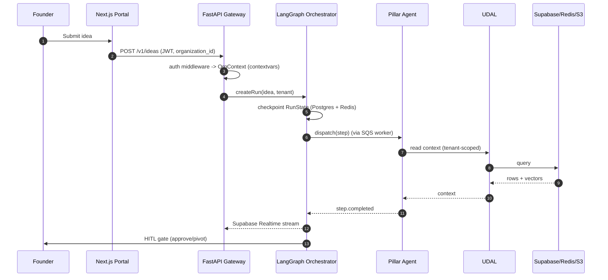

# Platform Foundation — Technical Implementation Plan

> **Owner**: Asit Piri (Project Lead)
> **Task IDs**: AF-012 → AF-036, AF-047 (~26 tasks)
> **Branches**: `feature/terraform-*`, `feature/udal-core`, `feature/fastapi-app-setup`, `feature/langgraph-graph`, `feature/base-agent`, `feature/tool-registry`
> **Status**: 🟢 Now (Phase 2 infra) — **the critical path; Asit's speed = the team's speed**
> **Date**: 2026-06-04 · **Version**: 1.0.0
> **Depends on**: Phase 1 monorepo (✅ done)
> **SLA / North Star**: `AF-027 UDAL → AF-036 BaseAgent → AF-028 FastAPI → AF-030 REST contracts` flips **7 pillar owners** from 🟡 to 🟢
> **Ground truth**: [CLAUDE.md](../CLAUDE.md) §8/§13/§19/§20/§27/§40 · [specs/database.md](../specs/database.md) · [specs/api-design.md](../specs/api-design.md) · [specs/deployment.md](../specs/deployment.md) · [specs/stack.md](../specs/stack.md)

---

## Table of Contents

1. [Objective](#1-objective)
2. [Dependencies](#2-dependencies)
3. [Component Architecture](#3-component-architecture)
4. [Workflow Design](#4-workflow-design)
5. [Sub-Component Recommendations](#5-sub-component-recommendations)
6. [Tools & Integrations](#6-tools--integrations)
7. [Data Models](#7-data-models)
8. [Development Roadmap](#8-development-roadmap)
9. [Testing Strategy](#9-testing-strategy)
10. [Deliverables](#10-deliverables)

---

## 1. Objective

### 1.1 What This Achieves

The Platform Foundation is the **wiring of the house** — the shared infrastructure, data access, orchestration engine, and agent contract that every one of the 7 pillar agents plugs into. Nothing the team builds can *run* until this lands. It delivers: AWS infrastructure (Terraform → ECS Fargate, Supabase, ElastiCache, S3, messaging), the **Unified Data Access Layer (UDAL)** that enforces tenant isolation, the FastAPI gateway + REST contracts, the **LangGraph orchestrator** that calls Pillar 1 → 2 → 3 … in order, the **BaseAgent ABC** that every agent subclasses, and the Tool Registry shell.

**Core mission**: Publish frozen contracts (Pydantic I/O schemas + OpenAPI + BaseAgent ABC) early so 9 people build against a fixed target, then land UDAL → BaseAgent → FastAPI → REST so every agent owner can wire a *running* agent.

### 1.2 Specific Outputs Produced

| Output Category | Deliverable | Volume |
|---|---|---|
| **Infrastructure** | Terraform modules: networking, ecs, elasticache, s3, messaging, alb, iam, secrets, ecr | 9 modules |
| **CI/CD** | GitHub Actions: `ci.yml`, `deploy-staging.yml`, `deploy-prod.yml` (canary) + CodeDeploy blue/green | 3 workflows |
| **Observability baseline** | OTel SDK + structured JSON logs + Fluent Bit → CloudWatch; Prometheus + Grafana dashboards | 1 stack |
| **Data layer** | Alembic migrations (platform + per-tenant schemas) + **UDAL** client | 2 migration sets + 1 SDK |
| **API gateway** | FastAPI app bootstrap, auth middleware, REST endpoints, OpenAPI 3.1 spec | 6 endpoints |
| **Realtime + cache** | Supabase Realtime subscription + Redis integration | 2 integrations |
| **Orchestrator** | `RunState` + `StateGraph` factory + HITL gate state machine + SQS worker loop | 3 components |
| **Agent contract** | `BaseAgent` ABC + typed error hierarchy + circuit breakers | 1 ABC |
| **Tool Registry** | `ToolRegistry` singleton shell | 1 registry |

### 1.3 Inputs Received from Upstream

| Source | Data Consumed | Required / Optional | Used For |
|---|---|---|---|
| **Phase 1 monorepo** (done) | `backend/` scaffold, `docker-compose.yml`, lint config, `pnpm-workspace.yaml` | **Required** | Everything builds on this scaffold |
| **CLAUDE.md / specs** | Architecture decisions (ECS Fargate, Supabase, Gemini, schema-per-tenant) | **Required** | Authoritative tech choices — no contradictions allowed |
| **Pillar owners** | Agent I/O schema needs (per pillar) | Optional | Freeze the per-agent Pydantic contracts in `RunState` |

### 1.4 Outputs Produced for Downstream Consumers

| Consumer | Data Emitted | Format |
|---|---|---|
| **All 7 pillar owners** (Somesh, Kaushlendra, Kartik, Vishal, Prasenjit, Pallavi, Purnima) | `BaseAgent` ABC + UDAL client + Tool Registry + Prompt Registry hooks | Python imports |
| **Orchestrator → each agent** | `RunState` (passes each agent's output as the next agent's input) | TypedDict |
| **Raunak (Web)** | REST endpoints (AF-030) + Supabase Realtime (AF-031) | OpenAPI 3.1 + Realtime channel |
| **Yogesh (Mobile)** | Same REST + SNS push topic | OpenAPI + SNS |
| **Everyone** | AWS infra (ECS, Supabase, Redis, S3, Kafka/EventBridge/SQS) | Terraform-provisioned |

---

## 2. Dependencies

### 2.1 Mandatory Dependencies (Hard Blockers)

| Dependency | Task ID | Owner | Why It's Mandatory | Status |
|---|---|---|---|---|
| Monorepo scaffold | AF-001→011 | Team | All code/infra builds on it | ✅ Done |
| Networking | AF-012 | Asit | VPC/subnets gate every other AWS module | 🟢 Now |
| Supabase project | AF-014 | Asit | DB/pgvector/Auth/Storage source of truth | 🟢 Now |
| Migrations | AF-025/026 | Somesh | UDAL needs the schemas to exist | ✅ Done |
| ElastiCache | AF-015 | Asit | Redis gates orchestrator checkpoints (AF-032/033) | 🟢 Now |
| Messaging | AF-017 | Asit | Kafka/SQS/SNS/EventBridge gate orchestrator + HITL | 🟢 Now |

### 2.2 Soft Dependencies (Optional but Beneficial)

| Dependency | Task ID | Owner | Fallback If Unavailable |
|---|---|---|---|
| Purnima support on observability | AF-023/024 | Purnima | Asit ships OTel/Prom baseline solo; Purnima layers LLM metrics later |
| Pillar I/O schema agreement | — | Pillar owners | Freeze a v1 `RunState` from CLAUDE.md; add optional fields per §35-api-contracts |
| OPA policy sidecar | AF-046 | Unassigned | Inline RBAC checks in auth middleware until Guardrails lands |

### 2.3 Fallback Behavior Matrix

```
+----------------------------------+----------------------------------------------+
| Missing Input / Failure          | Fallback Strategy                            |
+----------------------------------+----------------------------------------------+
| Supabase migration not ready     | UDAL ships against a local supabase start;   |
|                                  | swap connection string for hosted later      |
+----------------------------------+----------------------------------------------+
| Redis unavailable                | LangGraph uses Postgres-only checkpoints;    |
|                                  | degrade hot cache to DB reads                |
+----------------------------------+----------------------------------------------+
| Kafka not provisioned            | EventBridge + SQS carry inter-agent events;  |
|                                  | Kafka added for high-throughput telemetry    |
+----------------------------------+----------------------------------------------+
| Tenant isolation breach (UDAL)   | HARD FAIL -- SEV-1, page security on-call,   |
|                                  | block the query; never silently widen scope  |
+----------------------------------+----------------------------------------------+
| Auth middleware not ready        | REST endpoints behind a dev API key;         |
|                                  | swap to Supabase JWT validation when ready   |
+----------------------------------+----------------------------------------------+
| Orchestrator overloaded on lead  | Delegate AF-033-035 or AF-036 to an early-   |
|                                  | finishing pillar owner (bus-factor mitigation)|
+----------------------------------+----------------------------------------------+
```

### 2.4 Dependency Chain Visualization

```
Phase 1 (done)
   |
   v
AF-012 networking --> AF-013 ECS --> AF-018 ALB
       |                                  |
       +--> AF-014 Supabase --> AF-025/026 migrations --> AF-027 UDAL
       +--> AF-015 ElastiCache ----------------------------+   |
       +--> AF-016 S3                                      v   v
       +--> AF-017 messaging               AF-028 FastAPI --> AF-029 auth --> AF-030 REST
       +--> AF-019 IAM / AF-020 secrets / AF-021 ECR        |        |
       +--> AF-022 CI/CD                                    v        v
                                          AF-031 Realtime  AF-032 Redis
                                                    |
                          AF-033 StateGraph --> AF-034 HITL gate --> AF-035 SQS worker
                                                    |
                                          AF-036 BaseAgent  +  AF-047 Tool Registry
                                                    |
                              =====> UNBLOCKS ALL 7 PILLAR OWNERS =====
```

---

## 3. Component Architecture

### 3.1 Design Philosophy

The Platform is **five components**, not one agent: (A) Infrastructure, (B) Core API & Data Layer, (C) Orchestrator, (D) BaseAgent ABC, (E) Tool Registry. Principles: **contract-first** (publish schemas day 1), **tenant isolation cannot be bypassed** (all DB access via UDAL), **stateless services** (scale on ECS), **checkpoint everything** (LangGraph → Postgres + Redis after every node).

### 3.2 Core Module — BaseAgent ABC (the contract every pillar subclasses)

```python
# backend/app/agents/base.py
from abc import ABC, abstractmethod
from typing import Generic, TypeVar

TIn = TypeVar("TIn"); TOut = TypeVar("TOut")

class BaseAgent(ABC, Generic[TIn, TOut]):
    PILLAR: int
    AGENT_ID: str
    SLA_SECONDS: int

    def __init__(self, udal, checkpointer, tool_registry, prompt_registry, llm_router):
        self.udal = udal                  # tenant-scoped data access
        self.checkpointer = checkpointer  # Postgres + Redis
        self.tools = tool_registry
        self.prompts = prompt_registry
        self.llm = llm_router

    @abstractmethod
    async def understand(self, input: TIn) -> dict: ...
    @abstractmethod
    async def plan(self, intent: dict) -> dict: ...
    @abstractmethod
    async def execute(self, plan: dict) -> TOut: ...
    @abstractmethod
    async def verify(self, output: TOut) -> dict: ...
    @abstractmethod
    async def learn(self, trace: dict) -> None: ...  # emits to LLMOps
```

### 3.3 Internal Component Architecture

```
+--------------------------------------------------------------------------+
|                       PLATFORM FOUNDATION                                 |
|                                                                          |
|  (A) INFRASTRUCTURE (Terraform)                                          |
|   networking -> ecs -> alb ;  supabase ; elasticache ; s3 ; messaging   |
|   iam ; secrets ; ecr ; CI/CD (GitHub Actions + CodeDeploy)             |
|                                                                          |
|  (B) CORE API & DATA LAYER                                              |
|   FastAPI app  -> auth middleware -> REST /v1/* -> OpenAPI 3.1          |
|        |                                                                 |
|        v                                                                 |
|   UDAL: relational() / vector() / graph() / object()                    |
|        | (contextvars tenant propagation, cross-tenant guard)           |
|        v                                                                 |
|   Supabase (Postgres + pgvector) | Redis | S3 | Neo4j                   |
|                                                                          |
|  (C) ORCHESTRATOR (LangGraph)                                           |
|   RunState TypedDict -> StateGraph factory (node per pillar step)       |
|        -> checkpoint (Postgres + Redis) after every node                |
|        -> HITL gate state machine (pending/approved/rejected/timed_out) |
|        -> SQS worker loop (poll per-pillar queues, dispatch, DLQ)       |
|                                                                          |
|  (D) BaseAgent ABC  (understand/plan/execute/verify/learn)              |
|        + typed error hierarchy + circuit breakers                       |
|                                                                          |
|  (E) Tool Registry singleton (JSON-schema args + auth scope + cost)     |
+--------------------------------------------------------------------------+
```

### 3.4 Component Responsibilities

| # | Component | Responsibility | Key Tech | Target SLA |
|---|---|---|---|---|
| A | Infrastructure | Provision multi-AZ AWS via Terraform; CI/CD; observability | Terraform, ECS Fargate, GitHub Actions | Plan/apply < 10 min |
| B1 | FastAPI gateway | HTTP concerns, DI, global exception handler, CORS | FastAPI 3.12 | P95 < 100 ms |
| B2 | Auth middleware | Supabase JWT validation, `OrgContext` via contextvars, mTLS | Supabase Auth, OPA | < 5 ms overhead |
| B3 | UDAL | Tenant-scoped data access; cross-tenant guard; lineage emit | SQLAlchemy async, pgvector | per-query |
| C1 | StateGraph | Nodes per pillar, conditional edges, checkpointing | LangGraph | checkpoint < 50 ms |
| C2 | HITL gate manager | `pending → approved/rejected/timed_out`; EventBridge emit | EventBridge, SQS | event < 1 s |
| C3 | SQS worker | Poll queues, dispatch to agent runner, backoff, DLQ | SQS, asyncio | — |
| D | BaseAgent ABC | Lifecycle contract + error hierarchy + circuit breakers | Python ABC | — |
| E | Tool Registry | Typed tool handles, allow-list, cost class | Pydantic | — |

---

## 4. Workflow Design

### 4.1 End-to-End Workflow (platform bring-up order)

```
Step 1: INFRA -- terraform apply networking -> ecs -> supabase -> elasticache -> s3 -> messaging
Step 2: DATA  -- alembic upgrade head (platform schema + per-tenant template)
Step 3: UDAL  -- wire relational/vector/graph/object with contextvars tenant guard
Step 4: API   -- FastAPI bootstrap -> auth middleware -> REST /v1/* -> OpenAPI 3.1 published
Step 5: RT/$  -- Supabase Realtime subscribe(step_events) ; Redis checkpoints + cost accumulator
Step 6: ORCH  -- RunState + StateGraph factory -> HITL gate manager -> SQS worker loop
Step 7: AGENT -- BaseAgent ABC + Tool Registry shell published
Step 8: HANDOFF -- 7 pillar owners subclass BaseAgent, register tools, read/write via UDAL
```

### 4.2 Orchestration Sequence (Mermaid)



### 4.3 Data Passed Between Components

```
FastAPI (JWT) --> auth middleware --> OrgContext{organization_id, role, scopes}
   --> UDAL (every call scoped by OrgContext) --> Supabase/Redis/S3
Orchestrator --> RunState{run_id, pillar, status, plan(JSONB), artifacts}
   --> checkpoint(Postgres orchestrator.checkpoints + Redis hot cache)
   --> per-pillar SQS queue --> agent runner --> RunState mutation --> next node
```

---

## 5. Sub-Component Recommendations

### 5.1 Evaluation Matrix

| Proposed Piece | Recommendation | Rationale |
|---|---|---|
| Separate API / Orchestrator / Worker services | ❌ **Consolidated `backend` modular monolith** (Phase 1) | CLAUDE.md §13 — split into ECS services in Phase 4 only if scale requires |
| UDAL as a library vs a service | ✅ **Library** (`backend/app/db`) | In-process; cannot be bypassed; no network hop |
| Orchestrator delegation | ✅ **Recommend delegate AF-033-035 or AF-036** | Bus-factor 1 risk — one person gates 9 |
| Guardrails pipeline | 🔶 **AF-046 shared/Purnima** | Wraps every agent call; not Asit's solo load |
| Tool Registry entries | ✅ **Shell by Asit, entries by pillars** | Each pillar adds its own tools |

### 5.2 Final Component Architecture

**Phase 2 (Infra):** networking, ecs, supabase, elasticache, s3, messaging, alb, iam, secrets, ecr, CI/CD, observability baseline.
**Phase 3a-b (Core + Orchestrator):** migrations, UDAL, FastAPI, auth, REST, Realtime, Redis, StateGraph, HITL gate, SQS worker, BaseAgent, Tool Registry shell.
**Phase 4 additions:** split services if scale requires; read replicas; OPA sidecar hardening.

---

## 6. Tools & Integrations

### 6.1 Per-Component Tool / Service Registry

| Component | Tool / Service | Purpose | Env Variable |
|---|---|---|---|
| Infra | Terraform | IaC for all AWS modules | `AWS_*` (via OIDC) |
| Data | Supabase | Postgres + pgvector + Auth + Storage | `SUPABASE_URL`, `SUPABASE_SERVICE_ROLE_KEY`, `DATABASE_URL` |
| Auth | Supabase JWT | Token validation | `SUPABASE_JWT_SECRET` |
| Cache | Redis (ElastiCache) | Checkpoints, prompt cache, cost accumulator | `REDIS_URL` |
| Object | S3 | Data lake, audit (7-yr Object Lock) | `AWS_S3_ARTIFACTS_BUCKET` |
| Bus | Kafka / EventBridge / SQS / SNS | Inter-agent events, gates, fan-out | `KAFKA_*`, `EVENTBRIDGE_BUS` |
| CI/CD | GitHub Actions + CodeDeploy | Build/test/scan/deploy blue/green | `ECR_REGISTRY` |
| Tracing | OpenTelemetry → LangSmith | Spans + LLM call tracing | `LANGSMITH_API_KEY` |
| Metrics | Prometheus + Grafana | RED/USE dashboards | — |

### 6.2 Core Libraries

| Library | Purpose |
|---|---|
| `fastapi` / `uvicorn[standard]` | Async API + ASGI server |
| `sqlalchemy[asyncio]` / `asyncpg` | ORM + async Postgres driver |
| `pgvector` | Vector types |
| `langgraph` | Stateful DAG orchestration + checkpoints |
| `confluent-kafka` | Kafka producer/consumer |
| `prometheus-client` / `opentelemetry-sdk` | Metrics + tracing |

### 6.3 External Service Rate Limits & Fallbacks

| Service | Limit | Timeout | Retry | Fallback |
|---|---|---|---|---|
| Supabase | connection pool (PgBouncer) | 30 s | 3 | Read replica / queue |
| Redis | — | 5 s | 2 | Postgres-only checkpoints |
| Kafka | partition throughput | 10 s | 3 | EventBridge + SQS |
| AWS APIs | service quotas | 30 s | 3 + jitter | Backoff, DLQ |
| GitHub Actions | 5,000 req/hr | — | retry | Re-run job |

### 6.4 Database & Storage Requirements

| Store | Usage | Path / Key Pattern |
|---|---|---|
| PostgreSQL (platform schema) | tenants, model_registry, prompt_registry, tool_registry, audit_log | `platform.*` |
| PostgreSQL (per-tenant) | runs, artifacts, gates, step_events, memory_episodes, cost_ledger | `org_<organization_id>.*` |
| PostgreSQL (orchestrator) | checkpoints | `orchestrator.checkpoints` |
| Redis | checkpoints hot cache, prompt cache, cost accumulator | `llm:prompt_cache:{sha256}`, `cost:{org}` |
| S3 | data lake, RLHF, audit (Object Lock 7 yr) | `s3://{bucket}/{organization_id}/...` |

---

## 7. Data Models

### 7.1 RunState (the orchestrator contract)

```python
# backend/app/orchestrator/state.py
from typing import TypedDict, Any
from uuid import UUID

class RunState(TypedDict, total=False):
    run_id: UUID
    organization_id: str
    pillar: int                     # 1..7 current pillar
    status: str                     # queued | running | gate_pending | done | failed
    plan: dict[str, Any]            # serialized DAG (JSONB)
    artifacts: list[dict]           # cross-pillar outputs (canvas, erd, repo, live_url...)
    gates: list[dict]               # HITL gate decisions
    cost_tokens: int
    error: str | None
```

### 7.2 Platform Schemas (Alembic)

```sql
-- platform schema (AF-025)
CREATE TABLE platform.tenants (id UUID PRIMARY KEY, name TEXT, tier TEXT,
    created_at TIMESTAMPTZ DEFAULT now(), updated_at TIMESTAMPTZ DEFAULT now());
CREATE TABLE platform.model_registry (id UUID PRIMARY KEY, provider TEXT, model_id TEXT,
    version TEXT, eval_score FLOAT, cost_per_1k FLOAT, rollback_pointer UUID);
CREATE TABLE platform.prompt_registry (id UUID PRIMARY KEY, name TEXT, version TEXT,
    template TEXT, status TEXT, created_at TIMESTAMPTZ DEFAULT now());
CREATE TABLE platform.tool_registry (id UUID PRIMARY KEY, name TEXT, args_schema JSONB,
    auth_scope TEXT, cost_class TEXT);
CREATE TABLE platform.audit_log (id UUID PRIMARY KEY, organization_id TEXT, action TEXT,
    actor TEXT, payload JSONB, created_at TIMESTAMPTZ DEFAULT now());
```

### 7.3 UDAL Interface

```python
# backend/app/db/udal.py
class UDALClient:
    def relational(self): ...   # tenant-scoped SQLAlchemy session
    def vector(self): ...       # pgvector namespace per tenant
    def graph(self): ...        # Neo4j/Neptune
    def object(self): ...       # S3 tenant-prefixed paths
    # Every call resolves organization_id from contextvars and refuses cross-tenant access.
```

---

## 8. Development Roadmap

### Phase 2 — Infrastructure (Weeks 1–2)

| Week | Task | Deliverable | Status |
|---|---|---|---|
| 1 | AF-012 networking, AF-019 IAM, AF-020 secrets, AF-021 ECR | VPC + least-priv roles + KMS + registries | 🟢 Now |
| 1 | AF-014 Supabase, AF-015 ElastiCache, AF-016 S3, AF-017 messaging | Managed data + cache + bus | 🟢 Now |
| 2 | AF-013 ECS, AF-018 ALB, AF-022 CI/CD | Fargate cluster + L7 LB + pipelines | 🟡 |
| 2 | AF-023 OTel, AF-024 Prometheus/Grafana | Observability baseline | 🟡 |

### Phase 3a-b — Core API, Data & Orchestrator (Weeks 3–5)

| Week | Task | Deliverable | Status |
|---|---|---|---|
| 3 | AF-025/026 migrations, **AF-027 UDAL** | Schemas + tenant-safe data access | ✅ Done |
| 3 | **AF-028 FastAPI**, AF-029 auth, **AF-030 REST** | Gateway + JWT + endpoints + OpenAPI | ✅ Done |
| 4 | AF-031 Realtime, AF-032 Redis | Live stream + checkpoints/cache | 🔴 (AF-031 Done, AF-032 Pending) |
| 4 | **AF-036 BaseAgent**, AF-047 Tool Registry shell | Agent contract published — **unblocks 7 owners** | 🔴→🟢 |
| 5 | AF-033 StateGraph, AF-034 HITL gate, AF-035 SQS worker | Full orchestrator (consider delegating) | 🔴 |

### Phase 4 — Scale (Weeks 6+)

| Task | Deliverable |
|---|---|
| Service split | Separate API/Orchestrator/Worker ECS services if load requires |
| Read replicas + PgBouncer | DB scaling |
| OPA policy sidecar | Hardened ABAC |

---

## 9. Testing Strategy

### 9.1 Testing Without the Full Platform

Local `supabase start` (Postgres + pgvector + Auth + Storage + Realtime) + `docker compose up` (Redis) gives a full local stack. Terraform validated with `terraform plan` against `env/staging.tfvars`. UDAL unit-tested with a throwaway local schema.

### 9.2 Test Architecture

```
tests/
├── unit/
│   ├── test_udal_tenant_guard.py     # cross-tenant access refused (SEV-1)
│   ├── test_auth_middleware.py       # JWT validation -> OrgContext
│   ├── test_runstate_checkpoint.py   # checkpoint round-trip
│   └── test_tool_registry.py         # schema validation + cost class
├── integration/
│   ├── test_rest_endpoints.py        # POST /v1/ideas -> GET /v1/runs/{id}
│   ├── test_hitl_gate_flow.py        # pending -> approved via SQS
│   ├── test_sqs_worker_dispatch.py   # poll -> dispatch -> DLQ on failure
│   └── test_realtime_step_events.py  # pg_notify -> Realtime channel
└── infra/
    └── terraform_plan.sh             # plan must succeed, no *:* IAM
```

### 9.3 Sample Data / Fixtures

| Fixture | Purpose |
|---|---|
| `two_tenants.sql` | Seed two orgs to prove isolation (no cross-tenant leakage) |
| `sample_run.json` | A RunState with 3 pillar steps for orchestrator tests |
| `staging.tfvars` | Terraform plan inputs for CI validation |

### 9.4 Test Execution Commands

```bash
cd backend && uv run pytest tests/unit/ -v
cd backend && uv run pytest tests/integration/ -v        # needs local supabase + redis
cd infra/terraform && terraform plan -var-file=env/staging.tfvars
make quality                                             # ruff + mypy + js lint (PR gate)
```

### 9.5 Key Test Scenarios

| # | Scenario | Type | Pass Criteria |
|---|---|---|---|
| T1 | Tenant A cannot read Tenant B data via UDAL | Unit | `CrossTenantError` raised; SEV-1 logged |
| T2 | Invalid JWT rejected | Unit | 401; no OrgContext set |
| T3 | RunState checkpoints to Postgres + Redis | Integration | resume after crash continues mid-run |
| T4 | HITL gate pending → approved | Integration | EventBridge `gate.required` emitted; SQS consumes decision |
| T5 | SQS worker DLQ escalation | Integration | failed step → DLQ → alert after max retries |
| T6 | OpenAPI 3.1 spec generated | Integration | `/openapi.json` valid; all 6 endpoints present |
| T7 | Terraform plan no wildcard IAM | Infra | no `*:*` policies |
| T8 | BaseAgent subclass contract | Unit | missing abstract method fails at import |

---

## 10. Deliverables

### 10.1 File Structure

```
infra/terraform/                # networking, ecs, elasticache, s3, messaging, alb, iam, secrets, ecr
infra/codedeploy/               # blue/green appspec
backend/app/
├── main.py                     # FastAPI factory + /health
├── api/v1/                     # ideas, runs, gates, artifacts, feedback, llmops routers
├── core/                       # config, logging, security
├── db/                         # UDAL + async SQLAlchemy session/base
├── orchestrator/               # state.py (RunState), graph.py (StateGraph), gates.py, worker.py
├── agents/base.py              # BaseAgent ABC + error hierarchy
└── tools/registry.py           # ToolRegistry singleton
backend/alembic/                # platform + per-tenant migrations
.github/workflows/              # ci.yml, deploy-staging.yml, deploy-prod.yml
```

### 10.2 Environment Variables (`.env.example`)

```bash
# Already core (Phase 1): SUPABASE_URL, SUPABASE_ANON_KEY, SUPABASE_SERVICE_ROLE_KEY,
#                         SUPABASE_JWT_SECRET, DATABASE_URL, GEMINI_API_KEY
# Platform additions:
REDIS_URL=
AWS_S3_ARTIFACTS_BUCKET=
KAFKA_BOOTSTRAP_SERVERS=
EVENTBRIDGE_BUS=
LANGSMITH_API_KEY=
ECR_REGISTRY=
```

### 10.3 REST Endpoint Inventory (AF-030, OpenAPI 3.1)

| Method | Path | Purpose |
|---|---|---|
| POST | `/v1/ideas` | Submit idea → `run_id` |
| GET | `/v1/runs/{id}` | Run state, gates, artifacts |
| POST | `/v1/runs/{id}/gates/{gate_id}` | Approve/reject HITL gate |
| GET | `/v1/runs/{id}/artifacts` | List artifacts |
| POST | `/v1/feedback` | Accept/reject signal (LLMOps) |
| GET | `/v1/llmops/cost` | Per-tenant cost telemetry |

### 10.4 Tool Registry Shell (AF-047)

| Element | Detail |
|---|---|
| `ToolRegistry` singleton | `register(name, fn, args_schema, auth_scope, cost_class)` + `get(name)` |
| Validation | Execution Guardrail checks schema + allow-list + rate-limit + cost-cap per call |
| Pillar entries | Each pillar registers its own tools into the shared registry |

### 10.5 Prometheus Metrics

| Metric | Type | Labels | Description |
|---|---|---|---|
| `http_request_duration_seconds` | Histogram | route, status | API latency (P95 < 100 ms) |
| `udal_query_duration_seconds` | Histogram | store, tenant | Data access latency |
| `orchestrator_checkpoint_total` | Counter | pillar | Checkpoints written |
| `hitl_gate_pending_total` | Gauge | gate_type | Open gates awaiting humans |
| `sqs_dlq_messages_total` | Counter | queue | Dead-lettered steps |
| `cross_tenant_block_total` | Counter | — | SEV-1 isolation blocks (must stay 0) |

### 10.6 Kafka / EventBridge Events Emitted

| Event | Bus | Payload |
|---|---|---|
| `run.started` | EventBridge | `{ run_id, organization_id, pillar: 1 }` |
| `pillar.completed{N}` | EventBridge | `{ run_id, pillar, next_pillar }` |
| `gate.required` | EventBridge → SQS → UI | `{ run_id, gate_type }` |
| `human.approved` | EventBridge | `{ run_id, gate_id, decided_by }` |
| `agent.failed` | EventBridge → Slack | `{ run_id, agent, error }` |

### 10.7 Contract (BaseAgent ABC + RunState)

The platform's "output contract" is the **BaseAgent ABC** (§3.2) plus the **RunState** TypedDict (§7.1). Every pillar agent must: subclass `BaseAgent`, implement the 5 lifecycle methods, read/write only via `self.udal`, register tools via the Tool Registry, and accept/emit `RunState`. Breaking changes follow `v2/` namespacing per CLAUDE.md §12.3.

### 10.8 Immediate Action Items (🟢 Start Today)

| # | Task | Priority | Est. | Output |
|---|---|---|---|---|
| 1 | **Publish frozen Pydantic I/O schemas + OpenAPI 3.1 contract** (so 9 people build against it) | P0 | 6 hrs | `backend/openapi.yaml` + `schemas/` |
| 2 | AF-012 networking Terraform | P0 | 6 hrs | `infra/terraform/networking` |
| 3 | AF-014 Supabase + AF-025/026 migrations | P0 | 6 hrs | `backend/alembic/` |
| 4 | **AF-027 UDAL** with cross-tenant guard | P0 | 8 hrs | `backend/app/db/udal.py` |
| 5 | **AF-036 BaseAgent ABC** | P0 | 4 hrs | `backend/app/agents/base.py` |
| 6 | AF-028 FastAPI bootstrap + AF-030 REST | P0 | 8 hrs | `backend/app/main.py`, `api/v1/` |
| 7 | AF-047 Tool Registry shell | P1 | 3 hrs | `backend/app/tools/registry.py` |
| 8 | CI/CD `ci.yml` (lint/typecheck/test/scan) | P1 | 4 hrs | `.github/workflows/ci.yml` |

**The single highest-leverage move: publish the contracts (item #1) on day one, then land UDAL → BaseAgent → FastAPI → REST. That sequence flips 7 pillar owners from 🟡 to 🟢.**

---

## Appendix A: Key Decisions Log

| # | Decision | Choice | Rationale |
|---|---|---|---|
| D1 | Compute platform | ECS Fargate (not EKS) | CLAUDE.md §17 authoritative; simpler ops |
| D2 | Backend topology | Consolidated modular monolith (`backend`) | Split to services in Phase 4 only if needed |
| D3 | Data access | UDAL library (not service) | In-process, un-bypassable tenant guard |
| D4 | Vector store | Supabase pgvector | Consolidates relational + vector |
| D5 | Orchestrator state | LangGraph + Postgres + Redis checkpoints | Deterministic, resumable |
| D6 | Contracts first | Publish schemas/OpenAPI/BaseAgent day 1 | Unblocks 9 people building in parallel |
| D7 | Tenant isolation | Schema-per-tenant + RLS + UDAL guard | Defense in depth; breach = SEV-1 |

## Appendix B: Risk Register

| Risk | Probability | Impact | Mitigation |
|---|---|---|---|
| **Bus-factor 1 — one lead gates 9** | High | Critical | Delegate AF-033-035 or AF-036 to an early-finishing pillar owner; publish contracts early |
| Tenant data leakage | Low | Critical | UDAL guard + schema-per-tenant + RLS + namespace-per-tenant vectors; SEV-1 on breach |
| Infra drift / manual changes | Medium | High | All infra via PR + `terraform plan` review; no console edits |
| Wildcard IAM | Low | High | CI check rejects `*:*`; least-privilege task roles |
| Orchestrator complexity slips schedule | Medium | High | Ship REST contracts + BaseAgent first; orchestrator can follow |
| Runaway LLM cost | Medium | Medium | Per-tenant cost caps + circuit breakers + semantic cache |

## Appendix C: Coordination Checklist

| Who | What | When | Status |
|---|---|---|---|
| **All pillar owners** | Agree per-agent Pydantic I/O schemas to freeze into RunState | Immediately | ⬜ Pending |
| **Purnima** | Co-own observability content (AF-023/024) + Prompt Registry/Router (AF-048/049) | When AF-028 lands | ⬜ Pending |
| **Prasenjit** | Share Terraform modules (platform AF-012-021 ↔ product DevOps AF-043) | Phase 2 | ⬜ Pending |
| **Raunak / Yogesh** | Hand over REST (AF-030) + Realtime (AF-031) + SNS contracts | When AF-030 lands | ⬜ Pending |
| **An early-finishing pillar owner** | Accept delegation of orchestrator (AF-033-035) or BaseAgent (AF-036) | ASAP (bus-factor) | ⬜ Pending |

---

*Auto-Founder AI — Platform Foundation Technical Plan v1.0.0 | June 2026*
*Owner: Asit Piri | Ground truth: CLAUDE.md §8/§13/§19/§20 + .claude/specs/* | Reviewed by: [Pending team review]*
