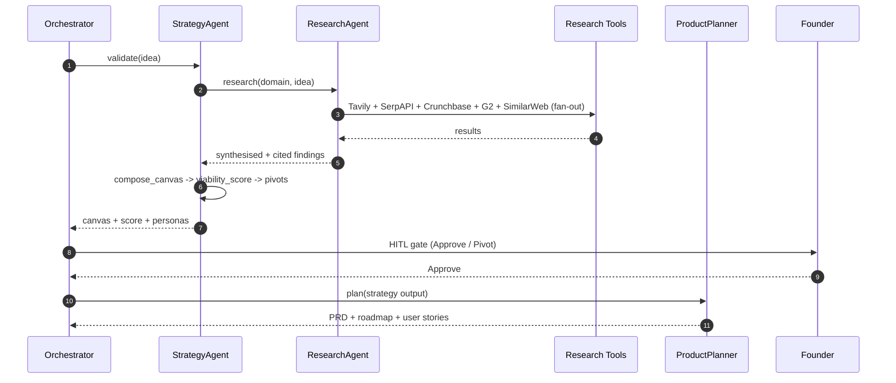

# Pillar 1 — Idea Validation & Market Research: Technical Implementation Plan

> **Owner**: Somesh Chitranshi
> **Task IDs**: AF-037 (Strategy & Ideation), AF-038 (Research), AF-039 (Product Planner) — **heaviest single load: 3 agents**
> **Branches**: `feature/strategy-agent`, `feature/research-agent`, `feature/product-planner-agent`
> **Status**: 🟡 Partially startable (offline work)
> **Date**: 2026-06-04 · **Version**: 1.0.0
> **Depends on**: AF-036 (BaseAgent), AF-027 (UDAL), AF-048 (Prompt Registry), AF-049 (LLM Router)
> **SLA**: Strategy < 30 min end-to-end
> **Ground truth**: [CLAUDE.md](../CLAUDE.md) §7.4 · [strategist-agent.md](../../docs/architecture/Agents-Architecture/strategist-agent.md)

---

## Table of Contents

1. [Pillar Objective](#1-pillar-objective)
2. [Dependencies](#2-dependencies)
3. [Agent Architecture](#3-agent-architecture)
4. [Workflow Design](#4-workflow-design)
5. [Sub-Agent Recommendations](#5-sub-agent-recommendations)
6. [Tools & Integrations](#6-tools--integrations)
7. [Data Models](#7-data-models)
8. [Development Roadmap](#8-development-roadmap)
9. [Testing Strategy](#9-testing-strategy)
10. [Deliverables](#10-deliverables)

---

## 1. Pillar Objective

### 1.1 What Pillar 1 Achieves

Pillar 1 is the **validation engine** — the very first thing the platform does with a founder's raw idea. It owns **three collaborating agents**: the **Strategy & Ideation Agent** (the lead), the **Research Agent** (deep market/competitor/tech research), and the **Product Planner Agent** (turns validated strategy into a PRD + roadmap). Together they answer the single most important question in the whole pipeline: *should this idea be built at all, and if so, for whom?*

**Core mission**: Convert one text idea into a fact-grounded, bias-audited validation package — market sizing, competitor map, personas, a Lean Canvas, a 0–100 viability score, and 3 pivot options — in **under 30 minutes**, versus the 3 weeks / $5K+ a founder would otherwise spend.

### 1.2 Specific Outputs Produced

| Output Category | Deliverable | Volume |
|---|---|---|
| **Market Analysis** | 5-page report: TAM/SAM/SOM, trends, timing | 1 report |
| **Competitor Map** | Discovered competitors + feature comparison | 5–15 competitors |
| **Personas (ICPs)** | Ideal Customer Profiles with pains + triggers | 3–5 ICPs |
| **Lean Canvas** | 9-block canvas (problem, solution, UVP, channels, revenue…) | 1 canvas |
| **Viability Score** | 0–100 with band + rationale | 1 score |
| **Bias Audit** | Diversification/fairness check on the analysis | 1 audit |
| **Pivot Options** | Alternative directions if viability is low | 3 pivots |
| **PRD + Roadmap** (Product Planner) | Requirements, user stories, milestones | 1 PRD |

### 1.3 Inputs Received from Upstream

| Source | Data Consumed | Required / Optional | Used For |
|---|---|---|---|
| **Input Layer** (AF-030 `/v1/ideas`) | Raw text idea, `organization_id` | **Required** | The thing being validated |
| **Input Layer** | Optional PDFs, voice notes, URLs | Optional | Richer context; multi-modal grounding |
| **Pillar 7** (AF-045) | Prompt tuning feedback (post-run) | Optional (loop) | Improve validation prompts over time |

### 1.4 Outputs Produced for Downstream Consumers

| Consumer | Data Emitted | Format |
|---|---|---|
| **Kaushlendra (Pillar 2)** | `lean_canvas_json`, personas, PRD, `idea_normalised`, `viability_band` | JSON via UDAL / RunState |
| **Pallavi (Pillar 6)** | personas + competitor names (positioning, audience) | JSON |
| **Raunak (Validation Studio AF-055)** | canvas + viability gauge + ICP cards + pivot picker | REST + Realtime |
| **Purnima (Pillar 7)** | run traces + citation groundedness | LangSmith spans |

---

## 2. Dependencies

### 2.1 Mandatory Dependencies (Hard Blockers)

| Dependency | Task ID | Owner | Why It's Mandatory | Status |
|---|---|---|---|---|
| BaseAgent ABC | AF-036 | Asit | All 3 agents subclass it | 🔴 Blocked |
| UDAL | AF-027 | Asit | Read/write market intel + canvas via UDAL | 🔴 Blocked |
| Prompt Registry | AF-048 | Purnima | Versioned Jinja2 templates | 🟡 |
| LLM Router | AF-049 | Purnima | Route to Gemini 3.5 Flash + RAG | 🟡 |
| Tool Registry | AF-047 | Asit | Research tools registered | 🟡 |

### 2.2 Soft Dependencies (Optional but Beneficial)

| Dependency | Task ID | Owner | Fallback If Unavailable |
|---|---|---|---|
| Architect schema agreement | AF-040 | Kaushlendra | Define canvas/persona schema now; agree with Kaushlendra |
| Guardrails (input) | AF-046 | Unassigned | Local PII redaction + injection regex on idea text |
| Graph DB (Neo4j) | — | Deferred | Store competitor↔market links in Postgres JSONB until graph lands |

### 2.3 Fallback Behavior Matrix

```
+----------------------------------+----------------------------------------------+
| Missing Input / Failure          | Fallback Strategy                            |
+----------------------------------+----------------------------------------------+
| idea text empty / too short      | Ask founder for a 1-line clarification;      |
|                                  | do not fabricate a market                    |
+----------------------------------+----------------------------------------------+
| Tavily / SerpAPI rate-limited    | Fall back to the other; reduce result count; |
|                                  | LLM uses training knowledge, flag lower conf |
+----------------------------------+----------------------------------------------+
| Crunchbase/G2/SimilarWeb down    | Skip that source; mark competitor data as    |
|                                  | partial; lower groundedness score            |
+----------------------------------+----------------------------------------------+
| Viability band = low             | Generate 3 pivots; surface to founder gate   |
+----------------------------------+----------------------------------------------+
| Citation groundedness < threshold| Re-run retrieval; if still low, flag report  |
|                                  | as "low confidence" for human review         |
+----------------------------------+----------------------------------------------+
```

### 2.4 Dependency Chain Visualization

```
Input Layer (/v1/ideas)
   |
   v
Asit AF-036 BaseAgent + AF-027 UDAL  +  Purnima AF-048/049 (Prompt Reg / Router)
   |                                          |
   +------------------------------------------+
                          v
        +--------------------------------------------+
        |  SOMESH -- Pillar 1 (3 agents)             |
        |  AF-037 Strategy (lead) -> AF-039 Product  |
        |  AF-038 Research (fan-out tools)           |
        +--------------------------------------------+
                          |
        +-----------------+------------------+
        v                                    v
   Kaushlendra (Pillar 2)            Pallavi (Pillar 6)
   (canvas + personas + PRD)        (personas + competitors)
```

---

## 3. Agent Architecture

### 3.1 Design Philosophy

Pillar 1 is **three agents**, not one: the Strategy Agent is a LangGraph `StateGraph` with parallel research sub-workflows; the Research Agent is a tool-fan-out specialist it can call; the Product Planner runs after strategy is approved. Strategy parallelizes its independent sub-workflows (market sizing, competitor discovery, persona gen) then composes them into a Lean Canvas + viability score.

### 3.2 StrategyAgent Class

```python
# backend/app/agents/strategy/agent.py
from app.agents.base import BaseAgent
from app.agents.strategy.schema import StrategyState

class StrategyAgent(BaseAgent[StrategyState, StrategyState]):
    PILLAR = 1
    AGENT_ID = "strategy"
    SLA_SECONDS = 1800  # 30 minutes

    async def understand(self, input_state): ...   # normalise idea, detect domain
    async def plan(self, intent): ...              # DAG: research fan-out -> canvas -> score
    async def execute(self, plan): ...             # run StateGraph
    async def verify(self, output): ...            # canvas complete, viability computed, citations present
    async def learn(self, trace): ...              # emit to LLMOps
```

### 3.3 Internal Node Architecture

```
+--------------------------------------------------------------------------+
|                    StrategyAgent (LangGraph StateGraph)                   |
|                                                                          |
|  +--------------+    +-----------------+                                 |
|  | normalise_   |--->| domain_classify |                                 |
|  | idea         |    +--------+--------+                                  |
|  +--------------+             |                                          |
|              +---------------+-------------------+----------------+      |
|              v               v                   v                v      |
|  +----------------+ +---------------+ +----------------+ +-------------+ |
|  | market_sizing  | | competitor_   | | persona_       | | keyword_    | |
|  | (TAM/SAM/SOM)  | | discovery     | | generation     | | intent_mine | |
|  +-------+--------+ +-------+-------+ +-------+--------+ +------+------+  |
|          |                 |                 |                 |          |
|          +-----------------+--------+--------+-----------------+          |
|                                     v                                    |
|                          +--------------------+                          |
|                          |  research_join     | (barrier)                |
|                          +---------+----------+                          |
|                                    v                                     |
|                          +------------------+                            |
|                          | compose_canvas   |  (Lean Canvas)            |
|                          +--------+---------+                            |
|                                   v                                      |
|                          +------------------+                            |
|                          | viability_score  |  (0-100 + bias audit)    |
|                          +--------+---------+                            |
|                                   v                                      |
|                          +------------------+                            |
|                          | pivot_suggest    |  (3 pivots if low)       |
|                          +--------+---------+                            |
|                                   v                                      |
|                          [HITL: Approve / Pivot] --> Product Planner    |
+--------------------------------------------------------------------------+
```

### 3.4 Node Responsibilities

| # | Node | Responsibility | Model | SLA |
|---|---|---|---|---|
| 1 | `normalise_idea` | Clean + summarise the raw idea; PII redaction | Gemini 3.5 Flash | < 30 s |
| 2 | `domain_classify` | Classify domain → research strategy | Gemini 3.5 Flash | < 20 s |
| 3 | `market_sizing` | TAM/SAM/SOM via research tools | Gemini 3.5 Flash | < 5 min |
| 4 | `competitor_discovery` | Find + compare competitors | Gemini 3.5 Flash | < 5 min |
| 5 | `persona_generation` | 3–5 ICPs with pains/triggers | Gemini 3.5 Flash | < 3 min |
| 6 | `keyword_intent_mine` | SEO/intent keywords | Gemini 3.5 Flash | < 3 min |
| 7 | `research_join` | Barrier — merge research | — | — |
| 8 | `compose_canvas` | 9-block Lean Canvas | Gemini 3.5 Flash | < 2 min |
| 9 | `viability_score` | 0–100 + bias audit | Gemini 3.5 Flash | < 1 min |
| 10 | `pivot_suggest` | 3 pivots if band low | Gemini 3.5 Flash | < 2 min |

---

## 4. Workflow Design

### 4.1 End-to-End Workflow

```
Step 1: INGEST -- normalise idea, redact PII, classify domain
Step 2: RESEARCH FAN-OUT (parallel) -- market_sizing || competitor_discovery
        || persona_generation || keyword_intent_mine  (each calls Research Agent tools)
Step 3: JOIN -- merge all research into one grounded context
Step 4: COMPOSE -- build the Lean Canvas from the merged context
Step 5: SCORE -- compute 0-100 viability + run bias audit
Step 6: PIVOTS -- if band is low, generate 3 pivot options
Step 7: HITL GATE -- Founder Approves or Pivots (Validation Studio)
        Pivot -> loop back to Step 1 with the chosen pivot
        Approve -> hand off to Product Planner (PRD + roadmap)
Step 8: EMIT -- store canvas/score/personas in UDAL; emit pillar.completed{1}
```

### 4.2 Orchestration Sequence (Mermaid)



### 4.3 Data Passed Between Nodes

```
normalise_idea -> idea_normalised, domain
   -> [fan-out] market_sizing -> tam_sam_som
                competitor_discovery -> competitors[]
                persona_generation -> icps[]
                keyword_intent_mine -> keywords[]
   -> research_join -> grounded_context + sources[]
   -> compose_canvas -> lean_canvas_json
   -> viability_score -> viability_score (0-100), viability_band, bias_audit
   -> pivot_suggest -> pivots[3]
   -> [HITL Approve] -> ProductPlanner -> prd, roadmap, user_stories
```

---

## 5. Sub-Agent Recommendations

### 5.1 Evaluation Matrix

| Proposed Sub-Agent | Recommendation | Rationale |
|---|---|---|
| Competitor Tracker | ✅ **Node** → `competitor_discovery` | A research sub-workflow, not a standalone agent |
| Trend Analyst | ✅ **Node** → `market_sizing` / `keyword_intent_mine` | Single LLM + tool calls |
| Persona Builder | ✅ **Node** → `persona_generation` | One LLM call over merged research |
| Canvas Composer | ✅ **Node** → `compose_canvas` | Deterministic assembly |
| **Research Agent** | ✅ **Separate agent (AF-038)** | Reused by Strategy + future pillars; tool-fan-out specialist |
| **Product Planner** | ✅ **Separate agent (AF-039)** | Runs after the HITL gate; distinct lifecycle |
| Pricing Researcher | 🔶 **Phase 2** | Deeper unit-economics; overlaps Finance agent |

### 5.2 Final Agent Architecture

**Phase 1:** Strategy Agent (10 nodes) + Research Agent (tool fan-out) + Product Planner (PRD/roadmap).
**Phase 2:** competitor moat analysis, pricing research, deeper TAM modelling.
**Phase 3:** trend forecasting, automated re-validation on market shifts.

---

## 6. Tools & Integrations

### 6.1 Per-Node Tool Registry

| Node | Tool | Service | Purpose | Env Variable |
|---|---|---|---|---|
| market_sizing | Tavily, SerpAPI | search | Market size signals | `TAVILY_API_KEY`, `SERPAPI_KEY` |
| competitor_discovery | Crunchbase, G2, Capterra | data | Competitor + feature data | `CRUNCHBASE_API_KEY`, `G2_API_KEY` |
| market_sizing | SimilarWeb | traffic | Demand validation | `SIMILARWEB_API_KEY` |
| keyword_intent_mine | Google Trends, SerpAPI | search | Intent keywords | `SERPAPI_KEY` |
| competitor_discovery | ProductHunt, Reddit, HN | community | Sentiment + launches | `PRODUCTHUNT_TOKEN` |

### 6.2 LLM Requirements

| Node | Model | Reason | Est. Tokens/Call |
|---|---|---|---|
| compose_canvas | Gemini 3.5 Flash | Structured 9-block synthesis | ~4,000 in / ~2,000 out |
| viability_score | Gemini 3.5 Flash | Scoring + bias audit | ~3,000 in / ~800 out |
| persona_generation | Gemini 3.5 Flash | 3–5 ICPs | ~2,500 in / ~2,000 out |
| Research synthesis | Gemini 3.5 Flash | Multi-source synthesis + citations | ~6,000 in / ~2,500 out |

### 6.3 External Service Rate Limits & Fallbacks

| Service | Limit | Timeout | Retry | Fallback |
|---|---|---|---|---|
| Tavily | 60 req/min | 20 s | 3 (backoff) | SerpAPI |
| SerpAPI | plan-based | 20 s | 3 | Tavily |
| Crunchbase | plan-based | 20 s | 2 | Skip; partial competitor data |
| SimilarWeb | plan-based | 20 s | 2 | LLM estimate, lower confidence |
| Gemini 3.5 Flash | 1,000 RPM | 30 s | 3 (45 s) | Hard fail → error_handler |

### 6.4 Database & Storage Requirements

| Store | Usage | Path / Key |
|---|---|---|
| PostgreSQL (UDAL) | canvas, viability, personas, run artifacts | `tenant_uuid.artifacts` |
| pgvector | `market_intelligence`, `competitor_features` collections | 768-dim HNSW |
| Redis | research result cache, session | `strategy:cache:{sha256}` |
| S3 | 5-page market analysis PDF | `s3://.../{org}/{run}/market-analysis.pdf` |

---

## 7. Data Models

```python
class LeanCanvas(BaseModel):
    problem: list[str]; solution: list[str]
    unique_value_prop: str; unfair_advantage: str
    customer_segments: list[str]; channels: list[str]
    cost_structure: list[str]; revenue_streams: list[str]; key_metrics: list[str]

class ICP(BaseModel):
    name: str; description: str
    pain_points: list[str]; buying_triggers: list[str]
    preferred_channels: list[str]

class Competitor(BaseModel):
    name: str; url: str | None = None
    features: list[str] = []; pricing: str | None = None
    strengths: list[str] = []; weaknesses: list[str] = []

class StrategyOutput(BaseModel):
    run_id: UUID; organization_id: str
    idea_normalised: str; domain: str
    tam_sam_som: dict[str, float]
    competitors: list[Competitor]
    icps: list[ICP]
    lean_canvas: LeanCanvas
    viability_score: int = Field(..., ge=0, le=100)
    viability_band: str          # low | medium | medium-high | high
    bias_audit: dict
    pivots: list[str] = []
    sources: list[str] = []      # citations for groundedness
```

---

## 8. Development Roadmap

### Phase 1 — MVP (Weeks 1–3)

| Week | Task | Deliverable | Status |
|---|---|---|---|
| 1 | Schemas + Jinja2 prompts (sizing, competitor, persona, canvas, viability, bias, pivot, PRD) | `schema.py`, `prompts/*.j2` | 🟢 Start now |
| 1 | Research tool wrappers (Tavily, SerpAPI, Crunchbase, G2, SimilarWeb) | `tools/*.py` | 🟢 Start now |
| 2 | StateGraph + 10 nodes + routers | `graph.py`, `nodes/`, `routers.py` | 🟡 Needs BaseAgent |
| 2 | Research Agent fan-out + citation groundedness | `agents/research/` | 🟡 |
| 3 | Wire StrategyAgent + ProductPlanner to BaseAgent | `agent.py` | 🔴 Needs AF-036 |
| 3 | Golden evals + mocked unit tests | `tests/` | 🟢 Start now |

### Phase 2 (Weeks 4–6)
Real API integration; deeper TAM modelling; competitor moat analysis; pricing research; Validation Studio data contract (AF-055).

### Phase 3 (Weeks 7–10)
Trend forecasting; automated re-validation; graph-DB competitor↔market links; multi-modal idea inputs (PDF/voice).

---

## 9. Testing Strategy

### 9.1 Testing Without the Full Platform
Mock UDAL (in-memory), `FakeLLM` (pre-built canvas/score JSON), HTTP mocks for research tools (`respx`), mock BaseAgent stub, LangGraph `MemorySaver`.

### 9.2 Test Architecture

```
tests/
├── unit/agents/strategy/
│   ├── test_schema_validation.py     # viability bounds 0-100, canvas completeness
│   ├── test_viability_scoring.py     # banding logic
│   ├── test_bias_audit.py            # diversification checks
│   └── test_routers.py               # approve vs pivot routing
├── integration/agents/strategy/
│   ├── test_graph_happy_path.py      # high-viability idea -> approve
│   ├── test_graph_low_viability.py   # low -> 3 pivots
│   └── test_research_fanout.py       # 4 sources merge with citations
└── golden/strategy/
    ├── eval_canvas.yaml
    └── eval_viability.yaml
```

### 9.3 Sample Data / Fixtures

| Fixture | Domain | Expected band |
|---|---|---|
| `b2b_saas_devtool.json` | developer-tools | high |
| `crowded_todo_app.json` | productivity | low (→ pivots) |
| `niche_vertical_saas.json` | sustainability-fintech | medium |
| `wellness_platform.json` | health-wellness | medium-high |
| `vet_telehealth.json` | petcare-healthtech | medium-high |

### 9.4 Test Execution Commands

```bash
cd backend && uv run pytest tests/unit/agents/strategy/ -v
cd backend && uv run pytest tests/integration/agents/strategy/ -v
cd backend && npx promptfoo eval --config tests/golden/strategy/promptfoo.yaml
```

### 9.5 Key Test Scenarios

| # | Scenario | Type | Pass Criteria |
|---|---|---|---|
| T1 | High-viability idea → approve | Integration | `viability_band==high`; canvas complete |
| T2 | Low-viability → 3 pivots | Integration | `len(pivots)==3` |
| T3 | Research fan-out with citations | Integration | `sources` non-empty; groundedness ≥ threshold |
| T4 | Tavily down → SerpAPI fallback | Integration | research still completes |
| T5 | Empty/too-short idea | Unit | asks for clarification; no fabricated market |
| T6 | Bias audit flags Western-centric framing | Unit | audit returns diversification notes |
| T7 | Approve → Product Planner produces PRD | Integration | PRD + user stories present |

---

## 10. Deliverables

### 10.1 File Structure

```
backend/app/agents/strategy/
├── agent.py  graph.py  schema.py  routers.py
├── nodes/    (normalise_idea, domain_classify, market_sizing, competitor_discovery,
│              persona_generation, keyword_intent_mine, research_join, compose_canvas,
│              viability_score, pivot_suggest)
├── tools/    (tavily.py, serpapi.py, crunchbase.py, g2.py, similarweb.py)
└── prompts/  (*.j2)
backend/app/agents/research/      # Research Agent (fan-out + synthesis + citations)
backend/app/agents/product_planner/   # PRD + roadmap + user stories
```

### 10.2 Environment Variables (`.env.example`)

```bash
# --- Pillar 1 (Strategy / Research) -----------------------------------------
TAVILY_API_KEY=
SERPAPI_KEY=
CRUNCHBASE_API_KEY=
G2_API_KEY=
SIMILARWEB_API_KEY=
PRODUCTHUNT_TOKEN=
```

### 10.3 Prompt Registry Entries (AF-048)

| Template | Version | Model | Variables |
|---|---|---|---|
| `strategy/market_sizing` | 1.0.0 | Gemini 3.5 Flash | `idea_normalised`, `domain` |
| `strategy/competitor_discovery` | 1.0.0 | Gemini 3.5 Flash | `idea_normalised`, `competitors` |
| `strategy/persona_generation` | 1.0.0 | Gemini 3.5 Flash | `idea_normalised`, `merged_research` |
| `strategy/compose_canvas` | 1.0.0 | Gemini 3.5 Flash | all research |
| `strategy/viability_score` | 1.0.0 | Gemini 3.5 Flash | canvas + research |
| `strategy/pivot_suggest` | 1.0.0 | Gemini 3.5 Flash | canvas + score |
| `product_planner/generate_prd` | 1.0.0 | Gemini 3.5 Flash | strategy output |

### 10.4 Tool Registry Entries (AF-047)

| Tool | Scope | Auth | Cost | Rate Limit |
|---|---|---|---|---|
| `tavily_search` | Strategy + Research + Marketing | API Key | Low | 60/min |
| `serpapi_search` | Strategy + Research | API Key | Low | plan |
| `crunchbase_lookup` | Strategy | API Key | Medium | plan |
| `g2_lookup` | Strategy | API Key | Medium | plan |
| `similarweb_traffic` | Strategy | API Key | Medium | plan |

### 10.5 Prometheus Metrics

| Metric | Type | Labels | Description |
|---|---|---|---|
| `strategy_node_duration_seconds` | Histogram | node, tenant | Per-node duration |
| `strategy_viability_score` | Histogram | tenant | Distribution of scores |
| `strategy_pivot_rate` | Counter | band | How often pivots are generated |
| `strategy_citation_groundedness` | Gauge | tenant | Source-backed claim ratio |
| `strategy_tool_calls_total` | Counter | tool, status | Research tool usage |

### 10.6 Kafka / EventBridge Events Emitted

| Event | Bus | Payload |
|---|---|---|
| `pillar.started{1}` | EventBridge | `{ run_id, tenant_id, pillar: 1 }` |
| `pillar.completed{1}` | EventBridge | `{ run_id, viability_band, next_pillar: 2 }` |
| `gate.required{validation}` | EventBridge → UI | `{ run_id, gate_type: "validation" }` |
| `strategy.research_done` | Kafka (telemetry) | `{ run_id, sources, token_counts }` |

### 10.7 Output Contract (StrategyOutput protobuf)

```protobuf
syntax = "proto3";
package autofounder.strategy.v1;
message StrategyOutput {
  string run_id = 1; string organization_id = 2;
  string idea_normalised = 3; string domain = 4;
  int32  viability_score = 5; string viability_band = 6;
  string lean_canvas_json = 7;          // consumed by Pillar 2 + 6
  repeated string icp_json = 8;
  repeated string competitor_names = 9;
  repeated string pivots = 10;
  string prd_s3_uri = 11;
  int32  total_llm_tokens_used = 12;
}
```

### 10.8 Immediate Action Items (🟢 Start Today)

| # | Task | Priority | Est. | Output |
|---|---|---|---|---|
| 1 | Jinja2 prompts (sizing, competitor, persona, canvas, viability, bias, pivot, PRD) | P0 | 6 hrs | `prompts/*.j2` |
| 2 | Research tool wrappers | P0 | 4 hrs | `tools/*.py` |
| 3 | Pydantic schemas (canvas, ICP, competitor, StrategyOutput) | P0 | 4 hrs | `schema.py` |
| 4 | **Agree canvas/persona/PRD schema with Kaushlendra** | P0 | 1 hr | shared contract |
| 5 | Golden eval datasets + mocked unit tests | P1 | 5 hrs | `tests/` |
| 6 | Router functions (approve/pivot) | P1 | 2 hrs | `routers.py` |

**Total offline work ~22 hrs — all doable before BaseAgent lands.**

---

## Appendix A: Key Decisions Log

| # | Decision | Choice | Rationale |
|---|---|---|---|
| D1 | 3 agents vs 1 | Strategy (lead) + Research + Product Planner | Research is reusable; Planner runs post-gate |
| D2 | Research fan-out | Parallel multi-source + citation check | Groundedness over single-source |
| D3 | Viability as 0–100 | Banded score + bias audit | Founder-friendly + fairness |
| D4 | Pivots only when low | 3 options on low band | Avoid noise on strong ideas |
| D5 | Multi-modal inputs | Phase 3 | Text-first MVP |

## Appendix B: Risk Register

| Risk | Probability | Impact | Mitigation |
|---|---|---|---|
| **3-agent load slows the chain** (P2→P3 wait on P1) | High | High | Flag to Asit; move Research or Product Planner to a lighter owner |
| Hallucinated market sizing | Medium | High | Citation groundedness check; flag low-confidence reports |
| Western-centric bias | Medium | Medium | Bias audit sub-workflow + diversified prompts + human gate |
| Research API rate limits | Medium | Medium | Cross-source fallback + caching |
| Prompt injection via idea text | Medium | High | Input Guardrail (PII redaction + injection classifier) |

## Appendix C: Coordination Checklist

| Who | What | When | Status |
|---|---|---|---|
| **Kaushlendra (Pillar 2)** | Agree `lean_canvas_json` + persona + PRD schema (he consumes them) | Immediately | ⬜ Pending |
| **Pallavi (Pillar 6)** | Confirm persona + competitor format for positioning | Soon | ⬜ Pending |
| **Asit (Platform)** | BaseAgent + UDAL + Tool Registry; flag the 3-agent load | When AF-036 starts | ⬜ Pending |
| **Purnima (Pillar 7)** | Register strategy prompts (AF-048) + routing (AF-049) | When shells exist | ⬜ Pending |
| **Raunak (Frontend)** | Validation Studio data contract (AF-055) | When mock data ready | ⬜ Pending |

---

*Auto-Founder AI — Pillar 1: Idea Validation & Market Research Technical Plan v1.0.0 | June 2026*
*Owner: Somesh Chitranshi | Ground truth: CLAUDE.md §7.4 + strategist-agent.md | Reviewed by: [Pending team review]*
