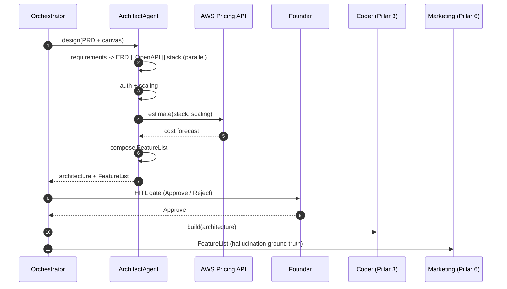

# Pillar 2 — Architecture & Tech Stack: Technical Implementation Plan

> **Owner**: Kaushlendra Kumar Gupta
> **Task ID**: AF-040 · **Branch**: `feature/architect-agent`
> **Status**: 🟡 Partially startable (offline work)
> **Date**: 2026-06-04 · **Version**: 1.0.0
> **Depends on**: AF-036 (BaseAgent), AF-039 (Product Planner output)
> **SLA**: Architecture design + HITL approval within the validation→build window
> **Ground truth**: [CLAUDE.md](../CLAUDE.md) §7.5 · [architect-agent.md](../../docs/architecture/Agents-Architecture/architect-agent.md)

---

## Table of Contents

1. [Pillar Objective](#1-pillar-objective)
2. [Dependencies](#2-dependencies)
3. [Agent Architecture](#3-agent-architecture)
4. [Workflow Design](#4-workflow-design)
5. [Sub-Agent Recommendations](#5-sub-agent-recommendations)
6. [Tools & Integrations](#6-tools--integrations)
7. [Data Models](#7-data-models)
8. [Development Roadmap](#8-development-roadmap)
9. [Testing Strategy](#9-testing-strategy)
10. [Deliverables](#10-deliverables)

---

## 1. Pillar Objective

### 1.1 What Pillar 2 Achieves

Pillar 2 is the **system architect**. It takes the validated idea (Lean Canvas + personas + PRD) and produces the complete technical blueprint a code generator can build from: functional + non-functional requirements, a database **ERD**, an **OpenAPI 3.1** contract, a chosen tech stack, microservice boundaries, an auth strategy, a scaling plan, and a cost forecast — gated behind a **Founder Approval** (HITL).

**Core mission**: Eliminate the "wrong stack chosen" failure (1+ week of debate) by producing, in minutes, an opinionated, cost-aware, security-by-design architecture — and the canonical **FeatureList** that becomes the ground truth for both the Coder (Pillar 3) and the Marketing hallucination guard (Pillar 6).

### 1.2 Specific Outputs Produced

| Output Category | Deliverable | Volume |
|---|---|---|
| **Requirements** | FRs + NFRs + use cases extracted from PRD | 1 spec |
| **Database design** | ERD (Mermaid) + indexes + constraints | 1 ERD |
| **API contract** | OpenAPI 3.1 spec | 1 spec |
| **Tech stack** | Selected stack + rationale | 1 decision doc |
| **Microservice boundaries** | Service decomposition / modular monolith plan | 1 boundary map |
| **Auth strategy** | OAuth/JWT/RBAC plan | 1 strategy |
| **Scaling + cost** | Scaling plan + AWS cost forecast | 1 forecast |
| **FeatureList** (critical) | `features[]`, `integrations[]`, `pricing_tiers[]` | 1 list |

### 1.3 Inputs Received from Upstream

| Source | Data Consumed | Required / Optional | Used For |
|---|---|---|---|
| **Somesh (Pillar 1)** | `lean_canvas_json`, personas, **PRD** | **Required** | Requirements extraction, stack fit |
| **Somesh (Pillar 1)** | `idea_normalised`, `viability_band`, competitors | Required | Scope + non-functional targets |
| **Pillar 7** | Architecture-decision feedback | Optional (loop) | Improve stack/cost prompts |

### 1.4 Outputs Produced for Downstream Consumers

| Consumer | Data Emitted | Format |
|---|---|---|
| **Kartik (Pillar 3)** | ERD + OpenAPI + **FeatureList** + stack selection | JSON via UDAL / RunState |
| **Pallavi (Pillar 6)** | **FeatureList** (hallucination cross-reference ground truth) | JSON |
| **Raunak (Architecture Studio AF-056)** | ERD render + Swagger UI + cost forecast + approve/reject | REST |
| **Prasenjit (Pillar 5)** | Stack + scaling plan (infra sizing) | JSON |

---

## 2. Dependencies

### 2.1 Mandatory Dependencies (Hard Blockers)

| Dependency | Task ID | Owner | Why It's Mandatory | Status |
|---|---|---|---|---|
| BaseAgent ABC | AF-036 | Asit | ArchitectAgent subclasses it | 🔴 Blocked |
| UDAL | AF-027 | Somesh | Read PRD, write ERD/OpenAPI artifacts | ✅ Done |
| Product Planner output | AF-039 | Somesh | The PRD is the input | 🟡 |
| Prompt Registry / Router | AF-048/049 | Purnima | Templated prompts + Gemini routing | 🟡 |

### 2.2 Soft Dependencies (Optional but Beneficial)

| Dependency | Task ID | Owner | Fallback If Unavailable |
|---|---|---|---|
| Pillar 1 schema agreement | AF-037/039 | Somesh | Define expected canvas/PRD shape; agree now |
| AWS Pricing API | AF-047 entry | Asit/self | Static price tables for cost forecast |
| Guardrails | AF-046 | Unassigned | Local validation of generated OpenAPI |

### 2.3 Fallback Behavior Matrix

```
+----------------------------------+----------------------------------------------+
| Missing Input / Failure          | Fallback Strategy                            |
+----------------------------------+----------------------------------------------+
| PRD missing                      | Derive requirements from Lean Canvas + idea; |
|                                  | log warning; lower confidence                |
+----------------------------------+----------------------------------------------+
| AWS Pricing API down             | Use cached static price tables;              |
|                                  | mark cost forecast as estimate               |
+----------------------------------+----------------------------------------------+
| OpenAPI fails schema validation  | Re-prompt with the validation errors (1x);   |
|                                  | if still invalid -> escalate                 |
+----------------------------------+----------------------------------------------+
| Founder rejects architecture     | Re-plan with the rejection comment;          |
|                                  | loop back to stack selection                 |
+----------------------------------+----------------------------------------------+
| FeatureList empty                | FATAL for downstream -- block; Pillar 6      |
|                                  | refuses to run without it                    |
+----------------------------------+----------------------------------------------+
```

### 2.4 Dependency Chain Visualization

```
Somesh (Pillar 1: canvas + personas + PRD)
   |
   v
Asit AF-036 BaseAgent + Somesh AF-027 UDAL  +  Purnima AF-048/049
   |
   v
+------------------------------------------+
|  KAUSHLENDRA -- AF-040 Architect Agent   |
|  FR/NFR -> ERD -> OpenAPI -> stack ->     |
|  microservices -> auth -> cost forecast   |
|  -> FeatureList  -> [Founder Approval]    |
+------------------------------------------+
   |
   +-----------------+------------------+
   v                 v                  v
Kartik (P3)     Pallavi (P6)      Prasenjit (P5)
(ERD+OpenAPI    (FeatureList      (stack+scaling)
 +FeatureList)   hallucination)
```

---

## 3. Agent Architecture

### 3.1 Design Philosophy

A single `ArchitectAgent` LangGraph `StateGraph`. Requirements extraction feeds parallel design sub-workflows (DB schema, API contract, stack selection), which converge before the cost forecast and the Founder Approval gate. **Architecture principles enforced**: Security by Design, Scalable by Default, Cost Optimized, Observable & Reliable, Modular & Evolvable.

### 3.2 ArchitectAgent Class

```python
# backend/app/agents/architect/agent.py
from app.agents.base import BaseAgent
from app.agents.architect.schema import ArchitectState

class ArchitectAgent(BaseAgent[ArchitectState, ArchitectState]):
    PILLAR = 2
    AGENT_ID = "architect"
    SLA_SECONDS = 900

    async def understand(self, input_state): ...   # parse PRD -> requirements
    async def plan(self, intent): ...              # DAG: parallel design -> cost -> gate
    async def execute(self, plan): ...
    async def verify(self, output): ...            # OpenAPI valid, ERD complete, FeatureList non-empty
    async def learn(self, trace): ...
```

### 3.3 Internal Node Architecture

```
+--------------------------------------------------------------------------+
|                   ArchitectAgent (LangGraph StateGraph)                   |
|                                                                          |
|  +------------------+                                                    |
|  | extract_         |                                                    |
|  | requirements     |  (FRs / NFRs / use cases from PRD)                 |
|  +--------+---------+                                                    |
|           |                                                              |
|     +-----+-----------------+--------------------+                       |
|     v                       v                    v                       |
|  +-----------+   +------------------+   +------------------+             |
|  | design_   |   | design_api_      |   | select_stack     |             |
|  | erd       |   | contract(OpenAPI)|   | + microservices  |             |
|  +-----+-----+   +--------+---------+   +--------+---------+             |
|        |                  |                      |                       |
|        +------------------+----------+-----------+                       |
|                                      v                                   |
|                          +----------------------+                        |
|                          | design_join (barrier)|                        |
|                          +----------+-----------+                        |
|                                     v                                    |
|                          +----------------------+                        |
|                          | auth_strategy +       |                       |
|                          | scaling_plan          |                       |
|                          +----------+-----------+                        |
|                                     v                                    |
|                          +----------------------+                        |
|                          | cost_forecast        |  (AWS Pricing API)     |
|                          +----------+-----------+                        |
|                                     v                                    |
|                          +----------------------+                        |
|                          | compose_featurelist  |  (CRITICAL output)    |
|                          +----------+-----------+                        |
|                                     v                                    |
|                          [HITL: Founder Approval] --> Pillar 3           |
+--------------------------------------------------------------------------+
```

### 3.4 Node Responsibilities

| # | Node | Responsibility | Model | SLA |
|---|---|---|---|---|
| 1 | `extract_requirements` | FRs/NFRs/use cases from PRD | Gemini 3.5 Flash | < 2 min |
| 2 | `design_erd` | Tables, relations, indexes (Mermaid) | Gemini 3.5 Flash | < 3 min |
| 3 | `design_api_contract` | OpenAPI 3.1 spec | Gemini 3.5 Flash | < 3 min |
| 4 | `select_stack` | Stack + microservice boundaries + rationale | Gemini 3.5 Flash | < 2 min |
| 5 | `design_join` | Barrier — merge design | — | — |
| 6 | `auth_strategy` | OAuth/JWT/RBAC plan | Gemini 3.5 Flash | < 1 min |
| 7 | `scaling_plan` | Scaling targets per NFR | Gemini 3.5 Flash | < 1 min |
| 8 | `cost_forecast` | AWS cost estimate | Gemini 3.5 Flash + Pricing API | < 2 min |
| 9 | `compose_featurelist` | `features[]`, `integrations[]`, `pricing_tiers[]` | Gemini 3.5 Flash | < 1 min |

---

## 4. Workflow Design

### 4.1 End-to-End Workflow

```
Step 1: REQUIREMENTS -- extract FRs / NFRs / use cases from the PRD
Step 2: DESIGN FAN-OUT (parallel) -- design_erd || design_api_contract || select_stack
Step 3: JOIN -- merge ERD + OpenAPI + stack into one architecture
Step 4: STRATEGY -- auth_strategy + scaling_plan (driven by NFRs)
Step 5: COST -- cost_forecast via AWS Pricing API
Step 6: FEATURELIST -- compose the canonical FeatureList (ground truth for P3 + P6)
Step 7: HITL GATE -- Founder Approval (Architecture Studio)
        Reject -> re-plan with comment -> loop to Step 4 (or stack selection)
        Approve -> hand off to Coder (Pillar 3)
Step 8: EMIT -- store ERD/OpenAPI/FeatureList in UDAL; emit pillar.completed{2}
```

### 4.2 Orchestration Sequence (Mermaid)



### 4.3 Data Passed Between Nodes

```
extract_requirements -> frs[], nfrs[], use_cases[]
   -> [fan-out] design_erd -> erd_mermaid, indexes[]
                design_api_contract -> openapi_3_1
                select_stack -> stack, microservice_boundaries
   -> design_join -> architecture
   -> auth_strategy -> auth_plan ; scaling_plan -> scaling_targets
   -> cost_forecast -> cost_estimate
   -> compose_featurelist -> feature_list{features[], integrations[], pricing_tiers[]}
   -> [HITL Approve] -> Pillar 3 (Kartik) + FeatureList -> Pillar 6 (Pallavi)
```

---

## 5. Sub-Agent Recommendations

### 5.1 Evaluation Matrix

| Proposed Sub-Agent | Recommendation | Rationale |
|---|---|---|
| Schema Designer | ✅ **Node** → `design_erd` | One LLM call producing Mermaid + indexes |
| API Contract Agent | ✅ **Node** → `design_api_contract` | OpenAPI generation; validated post-gen |
| Stack Advisor | ✅ **Node** → `select_stack` | Single decision node |
| Cost Estimator | ✅ **Node** → `cost_forecast` | LLM + AWS Pricing API |
| Security Architect | ✅ **Node** → `auth_strategy` | Auth plan inline |
| Microservice Boundary Agent | ✅ **Merged with `select_stack`** | Boundaries follow the stack decision |
| Migration Planner | 🔶 **Phase 2** | Schema evolution belongs with Coder/DevOps |

### 5.2 Final Agent Architecture

**Phase 1:** 9 nodes (requirements → ERD/OpenAPI/stack → auth/scaling → cost → FeatureList → gate).
**Phase 2:** ADR generation, migration planner, multi-cloud cost compare.
**Phase 3:** auto-benchmark stack options, data-residency/compliance-aware design.

---

## 6. Tools & Integrations

### 6.1 Per-Node Tool Registry

| Node | Tool | Service | Purpose | Env Variable |
|---|---|---|---|---|
| design_erd | dbdiagram.io / Mermaid | render | ERD generation | — |
| design_api_contract | Swagger Hub | validate | OpenAPI validation | `SWAGGERHUB_API_KEY` |
| cost_forecast | AWS Pricing API | pricing | Cost estimate | `AWS_PRICING_REGION` |
| select_stack | GitHub | search | Reference architectures | `GITHUB_TOKEN` |

### 6.2 LLM Requirements

| Node | Model | Reason | Est. Tokens/Call |
|---|---|---|---|
| design_api_contract | Gemini 3.5 Flash | Structured OpenAPI 3.1 | ~3,000 in / ~4,000 out |
| design_erd | Gemini 3.5 Flash | ERD + indexes | ~3,000 in / ~2,000 out |
| select_stack | Gemini 3.5 Flash | Reasoned stack decision | ~3,000 in / ~1,500 out |
| cost_forecast | Gemini 3.5 Flash | Cost reasoning over pricing data | ~2,500 in / ~800 out |

### 6.3 External Service Rate Limits & Fallbacks

| Service | Limit | Timeout | Retry | Fallback |
|---|---|---|---|---|
| AWS Pricing API | service quota | 20 s | 3 | Static price tables |
| Swagger Hub | plan | 15 s | 2 | Local `openapi-spec-validator` |
| GitHub | 5,000/hr | 10 s | 3 | LLM training knowledge |
| Gemini 3.5 Flash | 1,000 RPM | 30 s | 3 | Hard fail → error_handler |

### 6.4 Database & Storage Requirements

| Store | Usage | Path / Key |
|---|---|---|
| PostgreSQL (UDAL) | ERD/OpenAPI/FeatureList artifacts | `tenant_uuid.artifacts` |
| pgvector | `architecture_decisions` collection (reuse prior designs) | 768-dim HNSW |
| S3 | OpenAPI YAML + ERD image + cost forecast | `s3://.../{org}/{run}/architecture/` |

---

## 7. Data Models

```python
class FeatureList(BaseModel):
    """Canonical -- ground truth for Coder (P3) AND Marketing hallucination guard (P6)."""
    features: list[str]
    integrations: list[str] = []
    pricing_tiers: list[dict[str, Any]] = []

class Requirement(BaseModel):
    id: str; kind: str          # "FR" | "NFR"
    description: str; priority: str

class ArchitectOutput(BaseModel):
    run_id: UUID; organization_id: str
    requirements: list[Requirement]
    erd_mermaid: str
    openapi_3_1: dict
    stack: dict                 # {frontend, backend, db, infra}
    microservice_boundaries: list[str]
    auth_strategy: dict
    scaling_plan: dict
    cost_estimate: dict         # {monthly_usd, breakdown}
    feature_list: FeatureList   # consumed downstream
    approval_status: str        # pending | approved | rejected
```

---

## 8. Development Roadmap

### Phase 1 — MVP (Weeks 1–3)

| Week | Task | Deliverable | Status |
|---|---|---|---|
| 1 | Schemas + Jinja2 prompts (FR/NFR, ERD, OpenAPI, stack, auth, cost, FeatureList) | `schema.py`, `prompts/*.j2` | 🟢 Start now |
| 1 | ERD (Mermaid) + OpenAPI generators; AWS Pricing wrapper | `tools/*.py` | 🟢 Start now |
| 2 | StateGraph + 9 nodes + routers + Founder gate | `graph.py`, `nodes/` | 🟡 Needs BaseAgent |
| 3 | Wire ArchitectAgent to BaseAgent; OpenAPI validation | `agent.py` | 🔴 Needs AF-036 |
| 3 | Golden evals + mocked tests | `tests/` | 🟢 Start now |

### Phase 2 (Weeks 4–6)
Real Pricing API; ADR generation; migration planner; Architecture Studio data contract (AF-056).

### Phase 3 (Weeks 7–10)
Multi-cloud cost compare; auto-benchmark; compliance/data-residency-aware design.

---

## 9. Testing Strategy

### 9.1 Testing Without the Full Platform
Mock UDAL, `FakeLLM` (pre-built ERD/OpenAPI JSON), mock AWS Pricing, local OpenAPI validator, mock BaseAgent.

### 9.2 Test Architecture

```
tests/
├── unit/agents/architect/
│   ├── test_schema_validation.py     # FeatureList non-empty, OpenAPI shape
│   ├── test_openapi_validity.py      # generated spec passes openapi-spec-validator
│   ├── test_erd_completeness.py      # all entities have id + timestamps
│   └── test_cost_forecast.py         # forecast math
├── integration/agents/architect/
│   ├── test_graph_happy_path.py      # PRD -> full architecture -> approve
│   ├── test_graph_reject_loop.py     # reject -> re-plan
│   └── test_featurelist_handoff.py   # FeatureList shape matches P3+P6 contract
└── golden/architect/
    ├── eval_openapi.yaml
    └── eval_stack_selection.yaml
```

### 9.3 Sample Data / Fixtures

| Fixture | Input PRD domain | Expected stack |
|---|---|---|
| `saas_boilerplate_prd.json` | developer-tools | Next.js + FastAPI + Supabase + Stripe |
| `wellness_prd.json` | health-wellness | Next.js + FastAPI + Supabase + SSO |
| `carbon_accounting_prd.json` | sustainability-fintech | Next.js + FastAPI + integrations (QuickBooks/Xero) |
| `devex_prd.json` | developer-tools | Dashboards + GitHub/GitLab integrations |
| `vet_telehealth_prd.json` | petcare-healthtech | Video (Twilio) + Stripe + records |

### 9.4 Test Execution Commands

```bash
cd backend && uv run pytest tests/unit/agents/architect/ -v
cd backend && uv run pytest tests/integration/agents/architect/ -v
cd backend && npx promptfoo eval --config tests/golden/architect/promptfoo.yaml
```

### 9.5 Key Test Scenarios

| # | Scenario | Type | Pass Criteria |
|---|---|---|---|
| T1 | PRD → full architecture → approve | Integration | ERD + OpenAPI + FeatureList present; `approved` |
| T2 | Generated OpenAPI is valid 3.1 | Unit | passes `openapi-spec-validator` |
| T3 | Every entity has id + timestamps | Unit | ERD completeness check passes |
| T4 | FeatureList shape matches P3+P6 contract | Integration | `features[]`, `integrations[]`, `pricing_tiers[]` |
| T5 | Founder rejects → re-plan | Integration | loops with rejection comment |
| T6 | AWS Pricing down → static fallback | Integration | cost forecast marked "estimate" |
| T7 | Empty FeatureList blocks downstream | Unit | FATAL flag; P6 refuses |

---

## 10. Deliverables

### 10.1 File Structure

```
backend/app/agents/architect/
├── agent.py  graph.py  schema.py  routers.py
├── nodes/    (extract_requirements, design_erd, design_api_contract, select_stack,
│              design_join, auth_strategy, scaling_plan, cost_forecast, compose_featurelist)
├── tools/    (mermaid.py, openapi_validate.py, aws_pricing.py, github.py)
└── prompts/  (*.j2)
```

### 10.2 Environment Variables (`.env.example`)

```bash
# --- Pillar 2 (Architect) ---------------------------------------------------
SWAGGERHUB_API_KEY=
AWS_PRICING_REGION=us-east-1
# GITHUB_TOKEN already defined
```

### 10.3 Prompt Registry Entries (AF-048)

| Template | Version | Model | Variables |
|---|---|---|---|
| `architect/extract_requirements` | 1.0.0 | Gemini 3.5 Flash | `prd`, `lean_canvas` |
| `architect/design_erd` | 1.0.0 | Gemini 3.5 Flash | `requirements` |
| `architect/design_api_contract` | 1.0.0 | Gemini 3.5 Flash | `requirements`, `erd` |
| `architect/select_stack` | 1.0.0 | Gemini 3.5 Flash | `requirements`, `nfrs` |
| `architect/cost_forecast` | 1.0.0 | Gemini 3.5 Flash | `stack`, `scaling`, `pricing` |
| `architect/compose_featurelist` | 1.0.0 | Gemini 3.5 Flash | architecture + canvas |

### 10.4 Tool Registry Entries (AF-047)

| Tool | Scope | Auth | Cost | Rate Limit |
|---|---|---|---|---|
| `mermaid_render` | Architect | none | Free | — |
| `openapi_validate` | Architect | none | Free | — |
| `aws_pricing` | Architect + DevOps | IAM | Free | quota |
| `github_search` | Architect + Engineering | OAuth | Free | 5,000/hr |

### 10.5 Prometheus Metrics

| Metric | Type | Labels | Description |
|---|---|---|---|
| `architect_node_duration_seconds` | Histogram | node, tenant | Per-node duration |
| `architect_openapi_valid_total` | Counter | status | Valid vs invalid generated specs |
| `architect_cost_estimate_usd` | Histogram | tenant | Forecast distribution |
| `architect_approval_total` | Counter | status | Approve/reject distribution |
| `architect_featurelist_size` | Histogram | — | Features per design |

### 10.6 Kafka / EventBridge Events Emitted

| Event | Bus | Payload |
|---|---|---|
| `pillar.started{2}` | EventBridge | `{ run_id, tenant_id, pillar: 2 }` |
| `pillar.completed{2}` | EventBridge | `{ run_id, approval_status, next_pillar: 3 }` |
| `gate.required{architecture}` | EventBridge → UI | `{ run_id, gate_type: "architecture" }` |
| `architect.featurelist_ready` | Kafka | `{ run_id, feature_count }` (P6 listens) |

### 10.7 Output Contract (ArchitectOutput protobuf)

```protobuf
syntax = "proto3";
package autofounder.architect.v1;
message ArchitectOutput {
  string run_id = 1; string organization_id = 2;
  string erd_mermaid = 3;
  string openapi_s3_uri = 4;
  string stack_json = 5;
  string feature_list_json = 6;          // features[], integrations[], pricing_tiers[]
  string auth_strategy_json = 7;
  double monthly_cost_usd = 8;
  string approval_status = 9;            // approved | rejected
  int32  total_llm_tokens_used = 10;
}
```

### 10.8 Immediate Action Items (🟢 Start Today)

| # | Task | Priority | Est. | Output |
|---|---|---|---|---|
| 1 | Jinja2 prompts (FR/NFR, ERD, OpenAPI, stack, auth, cost, FeatureList) | P0 | 6 hrs | `prompts/*.j2` |
| 2 | ERD (Mermaid) + OpenAPI generators + validator | P0 | 4 hrs | `tools/*.py` |
| 3 | **FeatureList Pydantic schema** (two downstream consumers) | P0 | 2 hrs | `schema.py` |
| 4 | AWS Pricing wrapper | P1 | 3 hrs | `tools/aws_pricing.py` |
| 5 | **Agree FeatureList contract with Kartik + Pallavi** | P0 | 1 hr | shared contract |
| 6 | **Agree input schema with Somesh** | P0 | 1 hr | shared contract |
| 7 | Golden evals + mocked tests | P1 | 4 hrs | `tests/` |

**Total offline work ~21 hrs — all doable before BaseAgent lands.**

---

## Appendix A: Key Decisions Log

| # | Decision | Choice | Rationale |
|---|---|---|---|
| D1 | One agent, parallel design | ERD || OpenAPI || stack | Independent design tracks |
| D2 | FeatureList as canonical output | Single source for P3 + P6 | Prevents marketing hallucination |
| D3 | OpenAPI validated post-gen | `openapi-spec-validator` gate | No invalid contracts downstream |
| D4 | Cost via AWS Pricing API | Live pricing + static fallback | Truthful forecasts |
| D5 | Founder Approval gate | HITL required | Architecture is expensive to get wrong |

## Appendix B: Risk Register

| Risk | Probability | Impact | Mitigation |
|---|---|---|---|
| Empty/weak FeatureList breaks P6 | Medium | High | FATAL guard; validate non-empty before handoff |
| Invalid OpenAPI breaks P3 | Medium | High | Validate every generated spec; re-prompt on failure |
| Over-engineered stack (cost) | Medium | Medium | Cost-optimized principle + forecast in the gate |
| PRD missing/weak | Medium | Medium | Derive from canvas; flag low confidence |
| Stack contradicts CLAUDE.md | Low | Medium | Pin generated MVP stack to Next.js + FastAPI + Supabase defaults |

## Appendix C: Coordination Checklist

| Who | What | When | Status |
|---|---|---|---|
| **Somesh (Pillar 1)** | Agree input: `lean_canvas_json` + personas + PRD shape | Immediately | ⬜ Pending |
| **Kartik (Pillar 3)** | Agree the ERD + OpenAPI + FeatureList output contract | Immediately | ⬜ Pending |
| **Pallavi (Pillar 6)** | Agree the FeatureList shape (hallucination ground truth) | Immediately | ⬜ Pending |
| **Prasenjit (Pillar 5)** | Share stack + scaling plan for infra sizing | Soon | ⬜ Pending |
| **Asit (Platform)** | BaseAgent + UDAL + AWS Pricing tool registration | When AF-036 starts | ⬜ Pending |
| **Purnima (Pillar 7)** | Register architect prompts (AF-048) + routing | When shells exist | ⬜ Pending |

---

*Auto-Founder AI — Pillar 2: Architecture & Tech Stack Technical Plan v1.0.0 | June 2026*
*Owner: Kaushlendra Kumar Gupta | Ground truth: CLAUDE.md §7.5 + architect-agent.md | Reviewed by: [Pending team review]*
