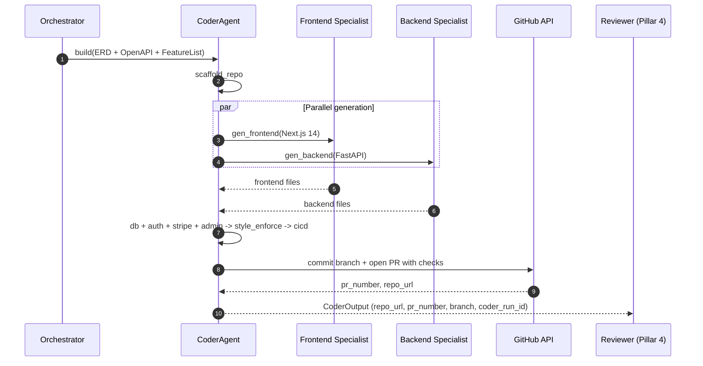

# Pillar 3 — Autonomous Code Generation: Technical Implementation Plan

> **Owner**: Kartik Mogalapalli
> **Task ID**: AF-041 · **Branch**: `feature/coder-agent`
> **Status**: 🟡 Partially startable (offline work)
> **Date**: 2026-06-04 · **Version**: 1.0.0
> **Depends on**: AF-036 (BaseAgent), AF-040 (Architect ERD + OpenAPI + FeatureList)
> **SLA**: Code generation < 15 min; zero lint errors; TypeScript strict; mypy clean
> **Ground truth**: [CLAUDE.md](../CLAUDE.md) §7.6 · [coder-agent.md](../../docs/architecture/Agents-Architecture/coder-agent.md)

---

## Table of Contents

1. [Pillar Objective](#1-pillar-objective)
2. [Dependencies](#2-dependencies)
3. [Agent Architecture](#3-agent-architecture)
4. [Workflow Design](#4-workflow-design)
5. [Sub-Agent Recommendations](#5-sub-agent-recommendations)
6. [Tools & Integrations](#6-tools--integrations)
7. [Data Models](#7-data-models)
8. [Development Roadmap](#8-development-roadmap)
9. [Testing Strategy](#9-testing-strategy)
10. [Deliverables](#10-deliverables)

---

## 1. Pillar Objective

### 1.1 What Pillar 3 Achieves

Pillar 3 is the **factory floor** — it turns the approved architecture (ERD + OpenAPI + FeatureList + stack) into a real, running, lint-clean code repository. It generates the **Frontend** (Next.js 14 + Tailwind + shadcn/ui) and **Backend** (FastAPI + SQLAlchemy + Supabase Auth + Stripe) **in parallel**, scaffolds the repo, writes DB migrations + seeds, an admin panel, and a CI/CD workflow, opens a PR with checks, and produces a deployed preview.

**Core mission**: Collapse the "$15K–$50K, 3–6 month MVP" into a production-grade repository generated in **under 15 minutes** — zero lint errors, TypeScript strict, mypy clean — ready for the Reviewer (Pillar 4) to test and self-heal.

### 1.2 Specific Outputs Produced

| Output Category | Deliverable | Volume |
|---|---|---|
| **Frontend** | Next.js 14 app (pages, components, design system) | 1 app |
| **Backend** | FastAPI app (routes, services, repositories, schemas) | 1 app |
| **Database layer** | SQLAlchemy models + Alembic migrations + seeds | 1 layer |
| **Auth** | Supabase Auth (OAuth/JWT/RBAC) | 1 integration |
| **Payments** | Stripe billing integration | 1 integration |
| **Admin panel** | Auto-generated CRUD admin | 1 panel |
| **CI/CD** | GitHub Actions workflow | 1 pipeline |
| **PR** | Open PR with checks + deployed preview | 1 PR |

### 1.3 Inputs Received from Upstream

| Source | Data Consumed | Required / Optional | Used For |
|---|---|---|---|
| **Kaushlendra (Pillar 2)** | ERD, OpenAPI 3.1, **FeatureList**, stack selection | **Required (critical)** | The blueprint to generate from |
| **Kaushlendra (Pillar 2)** | auth strategy, microservice boundaries | Required | Auth + module layout |
| **Somesh (Pillar 1)** | personas (UX context) | Optional | UI tone / flows |

### 1.4 Outputs Produced for Downstream Consumers

| Consumer | Data Emitted | Format |
|---|---|---|
| **Vishal (Pillar 4)** | `repo_url`, `pr_number`, `branch`, `coder_run_id`, stack manifest | gRPC `CoderOutput` |
| **Raunak (Code Review Studio AF-057)** | generated source for Monaco diff viewer | REST |
| **Prasenjit (Pillar 5)** | repo + Dockerfile (after Pillar 4 passes) | via RunState |
| **Purnima (Pillar 7)** | generation traces (prompt → code quality) | LangSmith |

---

## 2. Dependencies

### 2.1 Mandatory Dependencies (Hard Blockers)

| Dependency | Task ID | Owner | Why It's Mandatory | Status |
|---|---|---|---|---|
| BaseAgent ABC | AF-036 | Asit | CoderAgent subclasses it | 🔴 Blocked |
| UDAL | AF-027 | Somesh | Read architecture, write repo artifact refs | ✅ Done |
| Architect output | AF-040 | Kaushlendra | ERD + OpenAPI + FeatureList = the spec | 🟡 |
| Prompt Registry / Router | AF-048/049 | Purnima | Code-gen prompts + Gemini routing | 🟡 |
| Tool Registry | AF-047 | Asit | GitHub + Stripe tools | 🟡 |

### 2.2 Soft Dependencies (Optional but Beneficial)

| Dependency | Task ID | Owner | Fallback If Unavailable |
|---|---|---|---|
| Architect schema agreement | AF-040 | Kaushlendra | Define ERD/OpenAPI input shape; agree now |
| Reviewer input contract | AF-042 | Vishal | Agree `repo_url`/`pr_number`/`branch`/manifest |
| Sandbox/preview infra | AF-043 | Prasenjit | Generate preview config; mark `[PENDING_DEPLOY]` |

### 2.3 Fallback Behavior Matrix

```
+----------------------------------+----------------------------------------------+
| Missing Input / Failure          | Fallback Strategy                            |
+----------------------------------+----------------------------------------------+
| OpenAPI invalid / missing        | Block -- request Architect re-run; cannot    |
|                                  | generate routes without a contract           |
+----------------------------------+----------------------------------------------+
| ERD missing                      | Derive minimal schema from FeatureList;      |
|                                  | flag for Architect review                    |
+----------------------------------+----------------------------------------------+
| Lint errors in generated code    | Auto-run Prettier/ESLint/Black/Ruff --fix;   |
|                                  | regenerate the offending file once           |
+----------------------------------+----------------------------------------------+
| Stripe keys not configured       | Generate billing code behind a feature flag; |
|                                  | mark integration as stubbed                  |
+----------------------------------+----------------------------------------------+
| GitHub API failure (PR open)     | Commit to branch; retry PR open 3x;          |
|                                  | surface repo URL even without PR             |
+----------------------------------+----------------------------------------------+
```

### 2.4 Dependency Chain Visualization

```
Kaushlendra (Pillar 2: ERD + OpenAPI + FeatureList + stack)
   |
   v
Asit AF-036 BaseAgent + Somesh AF-027 UDAL  +  Purnima AF-048/049
   |
   v
+------------------------------------------+
|  KARTIK -- AF-041 Coder Agent            |
|  scaffold -> [Frontend || Backend] ->    |
|  db layer -> auth -> stripe -> admin ->  |
|  style enforce -> CI/CD -> PR            |
+------------------------------------------+
   |
   v
Vishal (Pillar 4) -- repo_url + pr_number + branch + coder_run_id
```

---

## 3. Agent Architecture

### 3.1 Design Philosophy

A single `CoderAgent` LangGraph `StateGraph` whose centerpiece is a **parallel Frontend || Backend fan-out** — the two specialists generate concurrently against the same ERD + OpenAPI, then converge for the shared layers (DB migrations, auth, Stripe, admin, style enforcement, CI/CD, PR). Targets are non-negotiable: zero lint errors, TypeScript strict, mypy clean.

### 3.2 CoderAgent Class

```python
# backend/app/agents/coder/agent.py
from app.agents.base import BaseAgent
from app.agents.coder.schema import CoderState

class CoderAgent(BaseAgent[CoderState, CoderState]):
    PILLAR = 3
    AGENT_ID = "coder"
    SLA_SECONDS = 900  # < 15 min

    async def understand(self, input_state): ...   # parse ERD + OpenAPI + FeatureList
    async def plan(self, intent): ...              # DAG: scaffold -> FE||BE -> shared -> PR
    async def execute(self, plan): ...
    async def verify(self, output): ...            # zero lint errors, repo+PR exist
    async def learn(self, trace): ...
```

### 3.3 Internal Node Architecture

```
+--------------------------------------------------------------------------+
|                    CoderAgent (LangGraph StateGraph)                      |
|                                                                          |
|  +------------------+                                                    |
|  | scaffold_repo    |  (monorepo structure, configs)                    |
|  +--------+---------+                                                    |
|           |                                                              |
|     +-----+--------------------+                                        |
|     v                          v                                        |
|  +------------------+   +------------------+                            |
|  | gen_frontend     |   | gen_backend      |   (PARALLEL specialists)   |
|  | (Next.js 14 +    |   | (FastAPI +        |                           |
|  |  Tailwind+shadcn)|   |  SQLAlchemy)      |                           |
|  +--------+---------+   +--------+---------+                            |
|           |                     |                                       |
|           +----------+----------+                                       |
|                      v                                                  |
|             +------------------+                                        |
|             | gen_join (barrier)|                                       |
|             +--------+---------+                                        |
|                      v                                                  |
|  +-------------------+-------------------+----------------+             |
|  v                   v                   v                v             |
| gen_db_layer    gen_auth(Supabase)  gen_stripe      gen_admin_panel    |
| (migrations)    (OAuth/JWT/RBAC)    (billing)       (CRUD)             |
|  +-------------------+-------------------+----------------+             |
|                      v                                                  |
|             +------------------+                                        |
|             | style_enforce    |  (Prettier/ESLint/Black/Ruff --fix)   |
|             +--------+---------+                                        |
|                      v                                                  |
|             +------------------+   +------------------+                 |
|             | gen_cicd         |-->| open_pr (GitHub) |--> Pillar 4    |
|             +------------------+   +------------------+                 |
+--------------------------------------------------------------------------+
```

### 3.4 Node Responsibilities

| # | Node | Responsibility | Model | SLA |
|---|---|---|---|---|
| 1 | `scaffold_repo` | Monorepo structure, configs, READMEs | Gemini 3.5 Flash | < 1 min |
| 2 | `gen_frontend` | Next.js 14 + Tailwind + shadcn/ui pages/components | Gemini 3.5 Flash | < 5 min |
| 3 | `gen_backend` | FastAPI routes/services/repos/schemas | Gemini 3.5 Flash | < 5 min |
| 4 | `gen_join` | Barrier — merge FE + BE | — | — |
| 5 | `gen_db_layer` | SQLAlchemy models + Alembic migrations + seeds | Gemini 3.5 Flash | < 2 min |
| 6 | `gen_auth` | Supabase Auth (OAuth/JWT/RBAC) | Gemini 3.5 Flash | < 1 min |
| 7 | `gen_stripe` | Stripe billing | Gemini 3.5 Flash | < 1 min |
| 8 | `gen_admin_panel` | Auto CRUD admin | Gemini 3.5 Flash | < 2 min |
| 9 | `style_enforce` | Prettier + ESLint + Black + Ruff `--fix` | — | < 1 min |
| 10 | `gen_cicd` | GitHub Actions workflow | Gemini 3.5 Flash | < 1 min |
| 11 | `open_pr` | Commit + open PR with checks | — (GitHub API) | < 1 min |

---

## 4. Workflow Design

### 4.1 End-to-End Workflow

```
Step 1: SCAFFOLD -- create monorepo structure + tooling configs
Step 2: PARALLEL GENERATION -- gen_frontend || gen_backend (against ERD + OpenAPI)
Step 3: JOIN -- merge FE + BE
Step 4: SHARED LAYERS (parallel) -- gen_db_layer || gen_auth || gen_stripe || gen_admin_panel
Step 5: STYLE ENFORCE -- run Prettier/ESLint/Black/Ruff --fix; regenerate offenders once
Step 6: CI/CD -- generate GitHub Actions workflow
Step 7: PR -- commit to feature branch, open PR with checks, produce deployed preview
Step 8: EMIT -- CoderOutput (repo_url, pr_number, branch, coder_run_id, manifest) -> Pillar 4
```

### 4.2 Orchestration Sequence (Mermaid)



### 4.3 Data Passed Between Nodes

```
scaffold_repo -> repo_skeleton, configs
   -> [fan-out] gen_frontend -> frontend_files[]
                gen_backend -> backend_files[]
   -> gen_join -> merged_repo
   -> [fan-out] gen_db_layer -> migrations[], models[]
                gen_auth -> auth_module ; gen_stripe -> billing_module
                gen_admin_panel -> admin_module
   -> style_enforce -> formatted_repo (zero lint errors)
   -> gen_cicd -> github_actions_workflow
   -> open_pr -> repo_url, pr_number, branch
   -> CoderOutput{repo_url, pr_number, branch, coder_run_id, stack_manifest} -> Pillar 4
```

---

## 5. Sub-Agent Recommendations

### 5.1 Evaluation Matrix

| Proposed Sub-Agent | Recommendation | Rationale |
|---|---|---|
| Frontend Specialist | ✅ **Node** → `gen_frontend` | Parallel branch; Next.js focus |
| Backend Specialist | ✅ **Node** → `gen_backend` | Parallel branch; FastAPI focus |
| Schema/Migration Agent | ✅ **Node** → `gen_db_layer` | SQLAlchemy + Alembic |
| Integration Agent | ✅ **Nodes** → `gen_auth`, `gen_stripe` | Auth + payments |
| Repo Manager | ✅ **Node** → `open_pr` | GitHub commit + PR |
| Admin Panel Generator | ✅ **Node** → `gen_admin_panel` | CRUD scaffolding |
| Docs Generator | 🔶 **Merged into scaffold/PR** | README in scaffold; expand Phase 2 |
| Mobile Code Gen | 🔶 **Phase 2 (Pillar 8)** | Out of scope for MVP |

### 5.2 Final Agent Architecture

**Phase 1:** 11 nodes (scaffold → FE||BE → db/auth/stripe/admin → style → CI/CD → PR).
**Phase 2:** docs generation, e2e test scaffolds, deployed-preview wiring, more integrations.
**Phase 3:** mobile code gen (Pillar 8), multi-language backends, design-token theming.

---

## 6. Tools & Integrations

### 6.1 Per-Node Tool Registry

| Node | Tool | Service | Purpose | Env Variable |
|---|---|---|---|---|
| open_pr | GitHub API | github.com | Commit + open PR | `GITHUB_TOKEN` |
| gen_stripe | Stripe | stripe.com | Billing scaffolding | `STRIPE_SECRET_KEY` |
| gen_frontend | npm | registry | Resolve FE deps | — |
| gen_backend | PyPI | index | Resolve BE deps | — |
| scaffold_repo | Docker Hub | registry | Base images for preview | — |

### 6.2 LLM Requirements

| Node | Model | Reason | Est. Tokens/Call |
|---|---|---|---|
| gen_frontend | Gemini 3.5 Flash | Multi-file Next.js generation | ~4,000 in / ~12,000 out |
| gen_backend | Gemini 3.5 Flash | Multi-file FastAPI generation | ~4,000 in / ~12,000 out |
| gen_db_layer | Gemini 3.5 Flash | Models + migrations from ERD | ~3,000 in / ~4,000 out |
| gen_admin_panel | Gemini 3.5 Flash | CRUD scaffolding | ~2,500 in / ~5,000 out |

### 6.3 External Service Rate Limits & Fallbacks

| Service | Limit | Timeout | Retry | Fallback |
|---|---|---|---|---|
| GitHub API | 5,000/hr | 15 s | 3 (60 s) | Commit to branch even if PR open fails |
| Stripe | per-account | 15 s | 3 | Feature-flag stub |
| Gemini 3.5 Flash | 1,000 RPM | 30 s | 3 (45 s) | Hard fail → error_handler |
| npm / PyPI | — | 60 s | 2 | Pin known-good versions |

### 6.4 Database & Storage Requirements

| Store | Usage | Path / Key |
|---|---|---|
| PostgreSQL (UDAL) | repo artifact refs, gen metadata | `tenant_uuid.artifacts` |
| pgvector | `code_patterns` collection (reuse good scaffolds) | 768-dim HNSW |
| S3 | generated repo tarball + preview build | `s3://.../{org}/{run}/repo/` |

---

## 7. Data Models

```python
class CodeArtifact(BaseModel):
    file_path: str; language: str; content: str; size_bytes: int

class CoderOutput(BaseModel):
    """Consumed by the Reviewer (Pillar 4)."""
    run_id: UUID; organization_id: str
    repo_url: str; pr_number: int; branch: str
    coder_run_id: UUID
    stack_manifest: dict          # {languages: ["typescript","python"], runners: [...]}
    frontend_files: int; backend_files: int
    lint_clean: bool              # zero errors
    typescript_strict: bool; mypy_clean: bool
    preview_url: str | None = None
    total_llm_tokens_used: int = 0
```

---

## 8. Development Roadmap

### Phase 1 — MVP (Weeks 1–3)

| Week | Task | Deliverable | Status |
|---|---|---|---|
| 1 | Code-gen prompt templates (Next.js, FastAPI, db, auth, stripe, admin, CI/CD) | `prompts/*.j2` | 🟢 Start now |
| 1 | Repo scaffolding templates + GitHub/Stripe tool wrappers | `templates/`, `tools/*.py` | 🟢 Start now |
| 2 | StateGraph + 11 nodes (FE||BE parallel) + routers | `graph.py`, `nodes/` | 🟡 Needs BaseAgent |
| 2 | Style-enforce pipeline (Prettier/ESLint/Black/Ruff) | `nodes/style_enforce.py` | 🟢 Start now |
| 3 | Wire CoderAgent to BaseAgent; CoderOutput contract | `agent.py` | 🔴 Needs AF-036 |
| 3 | Golden evals (compile-clean, lint-clean) + mocked tests | `tests/golden/` | 🟢 Start now |

### Phase 2 (Weeks 4–6)
Real GitHub PRs + deployed preview; e2e test scaffolds; docs generation; Code Review Studio contract (AF-057).

### Phase 3 (Weeks 7–10)
Mobile code gen (Pillar 8); design-token theming; multi-language backends; self-improving scaffolds via `code_patterns` RAG.

---

## 9. Testing Strategy

### 9.1 Testing Without the Full Platform
Mock UDAL, `FakeLLM` (deterministic file outputs), mock GitHub/Stripe (`respx`), mock BaseAgent. Generated output validated by actually running `tsc --noEmit`, `eslint`, `mypy`, `ruff` against the produced files.

### 9.2 Test Architecture

```
tests/
├── unit/agents/coder/
│   ├── test_schema_validation.py     # CoderOutput shape
│   ├── test_scaffold.py              # monorepo structure correct
│   └── test_style_enforce.py         # --fix removes violations
├── integration/agents/coder/
│   ├── test_graph_happy_path.py      # ERD+OpenAPI -> lint-clean repo + PR
│   ├── test_parallel_fe_be.py        # FE and BE generate concurrently
│   └── test_coderoutput_contract.py  # matches Reviewer (P4) input
└── golden/coder/
    ├── eval_compile_clean.yaml       # generated TS compiles
    └── eval_lint_clean.yaml          # zero lint errors
```

### 9.3 Sample Data / Fixtures (Architect outputs to build from)

| Fixture | ERD/OpenAPI domain | Expected output |
|---|---|---|
| `saas_boilerplate_arch.json` | developer-tools | FE+BE+auth+stripe, lint-clean |
| `wellness_arch.json` | health-wellness | FE+BE+SSO+surveys |
| `carbon_arch.json` | sustainability-fintech | FE+BE+QuickBooks/Xero stubs |
| `devex_arch.json` | developer-tools | dashboards + GitHub integration |
| `vet_arch.json` | petcare-healthtech | video + stripe + records |

### 9.4 Test Execution Commands

```bash
cd backend && uv run pytest tests/unit/agents/coder/ -v
cd backend && uv run pytest tests/integration/agents/coder/ -v
cd backend && npx promptfoo eval --config tests/golden/coder/promptfoo.yaml
# Validate generated output really is clean:
#   npx tsc --noEmit ; npx eslint . ; mypy . ; ruff check .
```

### 9.5 Key Test Scenarios

| # | Scenario | Type | Pass Criteria |
|---|---|---|---|
| T1 | ERD+OpenAPI → lint-clean repo + PR | Integration | zero lint errors; PR opened |
| T2 | FE and BE generate concurrently | Integration | both complete; merged at barrier |
| T3 | Generated TS compiles strict | Golden | `tsc --noEmit` passes |
| T4 | Generated Python mypy-clean | Golden | `mypy` passes |
| T5 | CoderOutput matches Reviewer input | Integration | `repo_url/pr_number/branch/manifest` present |
| T6 | Stripe keys absent → stubbed | Integration | billing behind feature flag |
| T7 | GitHub PR-open fails → branch still committed | Integration | repo_url returned |
| T8 | Lint violations auto-fixed | Unit | `style_enforce` yields zero errors |

---

## 10. Deliverables

### 10.1 File Structure

```
backend/app/agents/coder/
├── agent.py  graph.py  schema.py  routers.py
├── nodes/    (scaffold_repo, gen_frontend, gen_backend, gen_join, gen_db_layer,
│              gen_auth, gen_stripe, gen_admin_panel, style_enforce, gen_cicd, open_pr)
├── tools/    (github.py, stripe.py)
├── templates/ (nextjs/, fastapi/, cicd/)   # repo scaffolding templates
└── prompts/  (*.j2)
```

### 10.2 Environment Variables (`.env.example`)

```bash
# --- Pillar 3 (Coder) -------------------------------------------------------
STRIPE_SECRET_KEY=
# GITHUB_TOKEN already defined
```

### 10.3 Prompt Registry Entries (AF-048)

| Template | Version | Model | Variables |
|---|---|---|---|
| `coder/gen_frontend` | 1.0.0 | Gemini 3.5 Flash | `openapi`, `feature_list`, `stack` |
| `coder/gen_backend` | 1.0.0 | Gemini 3.5 Flash | `erd`, `openapi`, `auth_strategy` |
| `coder/gen_db_layer` | 1.0.0 | Gemini 3.5 Flash | `erd` |
| `coder/gen_auth` | 1.0.0 | Gemini 3.5 Flash | `auth_strategy` |
| `coder/gen_stripe` | 1.0.0 | Gemini 3.5 Flash | `pricing_tiers` |
| `coder/gen_admin_panel` | 1.0.0 | Gemini 3.5 Flash | `erd`, `feature_list` |

### 10.4 Tool Registry Entries (AF-047)

| Tool | Scope | Auth | Cost | Rate Limit |
|---|---|---|---|---|
| `github_commit` / `github_open_pr` | Coder + Engineering | OAuth | Free | 5,000/hr |
| `stripe_scaffold` | Coder + Finance | API Key | Low | per-account |

### 10.5 Prometheus Metrics

| Metric | Type | Labels | Description |
|---|---|---|---|
| `coder_node_duration_seconds` | Histogram | node, tenant | Per-node duration |
| `coder_files_generated_total` | Counter | side (fe/be) | Files generated |
| `coder_lint_errors_total` | Counter | tenant | Lint errors before --fix (target 0 after) |
| `coder_pr_open_total` | Counter | status | PR open success/failure |
| `coder_total_tokens` | Counter | direction | LLM tokens per run |

### 10.6 Kafka / EventBridge Events Emitted

| Event | Bus | Payload |
|---|---|---|
| `pillar.started{3}` | EventBridge | `{ run_id, tenant_id, pillar: 3 }` |
| `pillar.completed{3}` | EventBridge | `{ run_id, repo_url, pr_number, next_pillar: 4 }` |
| `coder.repo_ready` | Kafka | `{ run_id, files, lint_clean }` (P4 listens) |
| `agent.failed{coder}` | EventBridge → Slack | `{ run_id, error, node }` |

### 10.7 Output Contract (CoderOutput protobuf)

```protobuf
syntax = "proto3";
package autofounder.coder.v1;
message CoderOutput {
  string run_id = 1; string organization_id = 2;
  string repo_url = 3; int32 pr_number = 4; string branch = 5;
  string coder_run_id = 6;
  string stack_manifest_json = 7;       // {languages, runners}
  bool   lint_clean = 8; bool typescript_strict = 9; bool mypy_clean = 10;
  string preview_url = 11;
  int32  total_llm_tokens_used = 12;
}
```

### 10.8 Immediate Action Items (🟢 Start Today)

| # | Task | Priority | Est. | Output |
|---|---|---|---|---|
| 1 | Code-gen prompts (Next.js, FastAPI, db, auth, stripe, admin, CI/CD) | P0 | 7 hrs | `prompts/*.j2` |
| 2 | Repo scaffolding templates | P0 | 5 hrs | `templates/` |
| 3 | GitHub + Stripe tool wrappers | P0 | 4 hrs | `tools/*.py` |
| 4 | Style-enforce pipeline (Prettier/ESLint/Black/Ruff) | P0 | 3 hrs | `nodes/style_enforce.py` |
| 5 | **Agree ERD/OpenAPI/FeatureList input with Kaushlendra** | P0 | 1 hr | shared contract |
| 6 | **Agree CoderOutput contract with Vishal** | P0 | 1 hr | shared contract |
| 7 | Golden evals (compile-clean, lint-clean) + mocked tests | P1 | 5 hrs | `tests/golden/` |

**Total offline work ~26 hrs — all doable before BaseAgent lands.**

---

## Appendix A: Key Decisions Log

| # | Decision | Choice | Rationale |
|---|---|---|---|
| D1 | Parallel FE || BE | Two specialists, one barrier | Halves wall-clock; same ERD/OpenAPI |
| D2 | Style enforced in-agent | Prettier/ESLint/Black/Ruff `--fix` | Reviewer (P4) shouldn't fix cosmetics |
| D3 | Generated stack | Next.js 14 + FastAPI + Supabase + Stripe | CLAUDE.md §7.6 default |
| D4 | PR with checks | Open PR, not just push | Reviewer + humans get a diff surface |
| D5 | Mobile code gen | Phase 2/Pillar 8 | Out of MVP scope |

## Appendix B: Risk Register

| Risk | Probability | Impact | Mitigation |
|---|---|---|---|
| Generated code doesn't compile | Medium | High | Golden compile-clean evals; style-enforce; Reviewer self-heal catches the rest |
| Hallucinated APIs not in FeatureList | Medium | High | Generate strictly from OpenAPI + FeatureList |
| Invalid input architecture | Medium | High | Validate ERD/OpenAPI before generating; request Architect re-run |
| Secrets baked into generated code | Low | Critical | Env-var templates only; Gitleaks runs in Pillar 4 |
| Token budget on large apps | Medium | Medium | Per-module generation; context compression |

## Appendix C: Coordination Checklist

| Who | What | When | Status |
|---|---|---|---|
| **Kaushlendra (Pillar 2)** | Agree ERD + OpenAPI + FeatureList input shape | Immediately | ⬜ Pending |
| **Vishal (Pillar 4)** | Agree CoderOutput (`repo_url`/`pr_number`/`branch`/`coder_run_id`/manifest) | Immediately | ⬜ Pending |
| **Prasenjit (Pillar 5)** | Confirm Dockerfile + preview expectations | Soon | ⬜ Pending |
| **Asit (Platform)** | BaseAgent + UDAL + GitHub/Stripe tool registration | When AF-036 starts | ⬜ Pending |
| **Purnima (Pillar 7)** | Register coder prompts (AF-048) + routing | When shells exist | ⬜ Pending |
| **Raunak (Frontend)** | Code Review Studio source-diff contract (AF-057) | When mock data ready | ⬜ Pending |

---

*Auto-Founder AI — Pillar 3: Autonomous Code Generation Technical Plan v1.0.0 | June 2026*
*Owner: Kartik Mogalapalli | Ground truth: CLAUDE.md §7.6 + coder-agent.md | Reviewed by: [Pending team review]*
