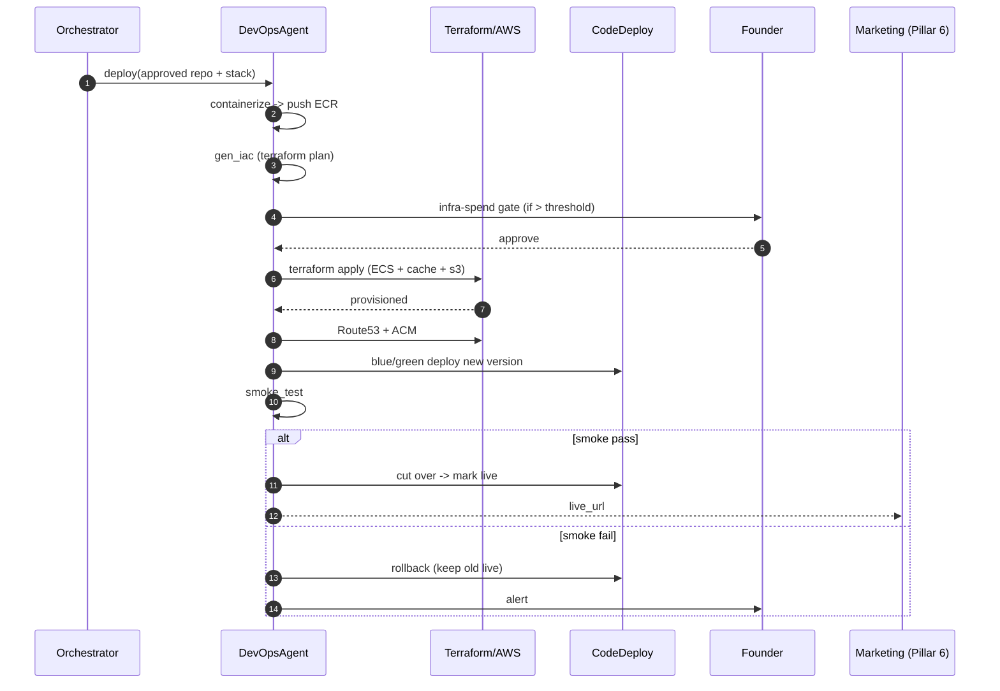

# Pillar 5 — Deployment & Infrastructure: Technical Implementation Plan

> **Owner**: Prasenjit Roy
> **Task ID**: AF-043 · **Branch**: `feature/devops-agent`
> **Status**: 🟡 Partially startable (offline work)
> **Date**: 2026-06-04 · **Version**: 1.0.0
> **Depends on**: AF-036 (BaseAgent), AF-042 (Reviewer green repo)
> **SLA**: < 10 min code → live · Uptime 99.9% · First-run deploy success ≥ 85%
> **Ground truth**: [CLAUDE.md](../CLAUDE.md) §7.8/§17/§18 · [devops-agent.md](../../docs/architecture/Agents-Architecture/devops-agent.md) · [specs/deployment.md](../specs/deployment.md)

---

## Table of Contents

1. [Pillar Objective](#1-pillar-objective)
2. [Dependencies](#2-dependencies)
3. [Agent Architecture](#3-agent-architecture)
4. [Workflow Design](#4-workflow-design)
5. [Sub-Agent Recommendations](#5-sub-agent-recommendations)
6. [Tools & Integrations](#6-tools--integrations)
7. [Data Models](#7-data-models)
8. [Development Roadmap](#8-development-roadmap)
9. [Testing Strategy](#9-testing-strategy)
10. [Deliverables](#10-deliverables)

---

## 1. Pillar Objective

### 1.1 What Pillar 5 Achieves

Pillar 5 is the **launch pad**. It takes the tested, green repository (approved by Pillar 4) and ships it to a live, public URL: containerize → provision infrastructure (Terraform) → deploy to **ECS Fargate** → wire DNS + SSL (Route 53 + ACM) → set up monitoring → run a smoke test → mark live — with a blue/green rollback ready and a one-click revert. An **infra-spend HITL gate** protects the founder from surprise bills.

**Core mission**: Collapse the "1 week to deploy" into **under 10 minutes, code → live**, at 99.9% uptime, with rollback-safe blue/green deploys and a live URL handed to Marketing (Pillar 6) and the dashboards.

### 1.2 Specific Outputs Produced

| Output Category | Deliverable | Volume |
|---|---|---|
| **Container** | Multi-stage Dockerfile + compose | 1 image |
| **IaC** | Terraform plan + apply for the product stack | 1 stack |
| **Cluster** | ECS Fargate service + Supabase + ElastiCache + S3 | 1 deployment |
| **DNS + SSL** | Route 53 records + ACM cert (+ Let's Encrypt fallback) | 1 domain |
| **Secrets** | AWS Secrets Manager + SSM entries | per-app |
| **Monitoring** | CloudWatch + Prometheus + Grafana + Sentry wiring | 1 stack |
| **CI/CD** | GitHub Actions deploy workflow + CodeDeploy blue/green | 1 pipeline |
| **Live URL** | Public, smoke-tested URL + deploy status | 1 URL |
| **Rollback plan** | Blue/green or canary, 1-click revert | 1 plan |

### 1.3 Inputs Received from Upstream

| Source | Data Consumed | Required / Optional | Used For |
|---|---|---|---|
| **Vishal (Pillar 4)** | `ReviewerOutput`: approved `repo_url`, `branch`, coverage, decision | **Required (critical)** | The green repo to deploy |
| **Kaushlendra (Pillar 2)** | stack selection, scaling plan, cost forecast | Required | Infra sizing + cost gate threshold |
| **Asit (Platform)** | shared Terraform modules (AF-012–021) | Required | Reuse networking/IAM/secrets patterns |

### 1.4 Outputs Produced for Downstream Consumers

| Consumer | Data Emitted | Format |
|---|---|---|
| **Pallavi (Pillar 6)** | `live_url`, DNS records, deploy status (CTA links) | JSON via RunState |
| **Raunak (Deploy Console AF-058)** | live deploy log stream, smoke result, rollback button | REST + Realtime |
| **Yogesh (Mobile)** | deploy status + live URL artifact | REST |
| **Purnima (Pillar 7)** | deploy telemetry, cost-per-deploy | Kafka / Cost Explorer |

---

## 2. Dependencies

### 2.1 Mandatory Dependencies (Hard Blockers)

| Dependency | Task ID | Owner | Why It's Mandatory | Status |
|---|---|---|---|---|
| BaseAgent ABC | AF-036 | Asit | DevOpsAgent subclasses it | 🔴 Blocked |
| UDAL | AF-027 | Asit | Read repo ref, write deploy artifacts | 🔴 Blocked |
| Reviewer output | AF-042 | Vishal | Only deploy a green repo | 🟡 |
| Tool Registry | AF-047 | Asit | Terraform/AWS/GitHub tools | 🟡 |
| AWS account + IAM | AF-019 | Asit | Deploy target | 🟢 |

### 2.2 Soft Dependencies (Optional but Beneficial)

| Dependency | Task ID | Owner | Fallback If Unavailable |
|---|---|---|---|
| Platform Terraform modules | AF-012–021 | Asit | Author product modules; share back |
| Architect scaling/cost | AF-040 | Kaushlendra | Default sizing per tier; estimate cost |
| LLM Router | AF-049 | Purnima | Templated Terraform without LLM tuning |
| Reviewer green repo | AF-042 | Vishal | Deploy a sample tested repo for dev |

### 2.3 Fallback Behavior Matrix

```
+----------------------------------+----------------------------------------------+
| Missing Input / Failure          | Fallback Strategy                            |
+----------------------------------+----------------------------------------------+
| Repo not approved by Pillar 4    | Block -- do not deploy unreviewed code       |
+----------------------------------+----------------------------------------------+
| terraform apply fails            | Auto-rollback; surface plan diff; retry once |
+----------------------------------+----------------------------------------------+
| Smoke test fails post-deploy     | Blue/green: keep old version live; do not    |
|                                  | cut over; alert founder                       |
+----------------------------------+----------------------------------------------+
| ACM cert pending validation      | Serve via Let's Encrypt; retry ACM async     |
+----------------------------------+----------------------------------------------+
| Infra spend > threshold          | HITL gate -- pause for founder approval      |
+----------------------------------+----------------------------------------------+
| Deploy exceeds 10 min SLA        | Continue but log SLA breach; alert           |
+----------------------------------+----------------------------------------------+
```

### 2.4 Dependency Chain Visualization

```
Vishal (Pillar 4: approved green repo)
   |
   v
Asit AF-036 BaseAgent + AF-027 UDAL + shared Terraform (AF-012-021)
   |
   v
+------------------------------------------+
|  PRASENJIT -- AF-043 DevOps Agent        |
|  containerize -> terraform plan/apply -> |
|  ECS provision -> DNS/SSL -> monitoring  |
|  -> [infra-spend gate] -> smoke -> live  |
+------------------------------------------+
   |
   +-----------------+------------------+
   v                 v                  v
Pallavi (P6)    Deploy Console     Mobile (Yogesh)
(live_url)      (Raunak AF-058)    (deploy status)
```

---

## 3. Agent Architecture

### 3.1 Design Philosophy

A single `DevOpsAgent` LangGraph `StateGraph`. Containerization and IaC generation run first; provisioning, DNS/SSL, and monitoring run as a coordinated sequence behind an **infra-spend HITL gate**; a smoke test gates the blue/green cutover. Everything is rollback-safe: the old version stays live until the new one passes its smoke test.

### 3.2 DevOpsAgent Class

```python
# backend/app/agents/devops/agent.py
from app.agents.base import BaseAgent
from app.agents.devops.schema import DevOpsState

class DevOpsAgent(BaseAgent[DevOpsState, DevOpsState]):
    PILLAR = 5
    AGENT_ID = "devops"
    SLA_SECONDS = 600  # < 10 min code -> live

    async def understand(self, input_state): ...   # validate approved repo + stack
    async def plan(self, intent): ...              # DAG: containerize -> IaC -> provision -> gate -> smoke -> cutover
    async def execute(self, plan): ...
    async def verify(self, output): ...            # smoke passed, live_url reachable, rollback ready
    async def learn(self, trace): ...
```

### 3.3 Internal Node Architecture

```
+--------------------------------------------------------------------------+
|                    DevOpsAgent (LangGraph StateGraph)                     |
|                                                                          |
|  +------------------+                                                    |
|  | containerize     |  (multi-stage Dockerfile + compose)               |
|  +--------+---------+                                                    |
|           v                                                              |
|  +------------------+                                                    |
|  | gen_iac          |  (Terraform plan for product stack)               |
|  +--------+---------+                                                    |
|           v                                                              |
|  +------------------+                                                    |
|  | cost_check       |--(spend > threshold)--> [HITL: infra-spend gate]  |
|  +--------+---------+                                                    |
|           v (approved / under threshold)                                 |
|  +------------------+                                                    |
|  | provision_cluster|  (terraform apply -> ECS Fargate + cache + s3)    |
|  +--------+---------+                                                    |
|           v                                                              |
|  +------------------+   +------------------+                             |
|  | dns_ssl          |   | monitoring_setup |   (Route53/ACM ; CW/Prom)  |
|  +--------+---------+   +--------+---------+                             |
|           +---------+---------+                                          |
|                     v                                                    |
|  +------------------+                                                    |
|  | deploy_bluegreen |  (CodeDeploy: new version stood up)               |
|  +--------+---------+                                                    |
|           v                                                              |
|  +------------------+                                                    |
|  | smoke_test       |--(fail)--> rollback (keep old live) -> error_handler|
|  +--------+---------+                                                    |
|           v (pass)                                                       |
|  +------------------+                                                    |
|  | cutover_mark_live|  -> live_url -> Pillar 6 + Deploy Console         |
|  +------------------+                                                    |
+--------------------------------------------------------------------------+
```

### 3.4 Node Responsibilities

| # | Node | Responsibility | Model | SLA |
|---|---|---|---|---|
| 1 | `containerize` | Multi-stage Dockerfile + compose | Gemini 3.5 Flash | < 1 min |
| 2 | `gen_iac` | Terraform plan for the product stack | Gemini 3.5 Flash | < 2 min |
| 3 | `cost_check` | Estimate spend vs threshold → gate? | — (Cost API) | < 30 s |
| 4 | `provision_cluster` | `terraform apply` → ECS + cache + S3 | — (Terraform) | < 3 min |
| 5 | `dns_ssl` | Route 53 records + ACM cert | — (AWS) | < 1 min |
| 6 | `monitoring_setup` | CloudWatch + Prometheus + Grafana + Sentry | — | < 1 min |
| 7 | `deploy_bluegreen` | CodeDeploy new version | — (CodeDeploy) | < 1 min |
| 8 | `smoke_test` | HTTP smoke against new version | — | < 30 s |
| 9 | `cutover_mark_live` | Shift traffic, emit live_url | — | < 30 s |

---

## 4. Workflow Design

### 4.1 End-to-End Workflow

```
Step 1: VALIDATE -- confirm Pillar 4 approved the repo (else block)
Step 2: CONTAINERIZE -- generate multi-stage Dockerfile + compose; build image -> ECR
Step 3: IaC -- generate terraform plan for the product stack (mirrors platform modules)
Step 4: COST CHECK -- estimate monthly spend; if > threshold -> infra-spend HITL gate
Step 5: PROVISION -- terraform apply -> ECS Fargate service + ElastiCache + S3
Step 6: DNS + SSL -- Route 53 records + ACM cert (Let's Encrypt fallback)
Step 7: MONITORING -- CloudWatch + Prometheus + Grafana + Sentry wiring
Step 8: BLUE/GREEN DEPLOY -- CodeDeploy stands up the new version (old stays live)
Step 9: SMOKE TEST -- if fail, do NOT cut over; rollback; alert founder
Step 10: CUTOVER -- shift traffic; mark live; emit live_url -> Pillar 6 + dashboards
```

### 4.2 Orchestration Sequence (Mermaid)



### 4.3 Data Passed Between Nodes

```
containerize -> dockerfile, image_tag (ECR)
   -> gen_iac -> terraform_plan
   -> cost_check -> monthly_cost_usd (gate if > threshold)
   -> provision_cluster -> ecs_service_arn, endpoints
   -> dns_ssl -> domain, cert_arn ; monitoring_setup -> dashboards
   -> deploy_bluegreen -> deployment_id
   -> smoke_test -> smoke_passed (bool)
   -> cutover_mark_live -> live_url, deploy_status -> Pillar 6 (Pallavi)
```

---

## 5. Sub-Agent Recommendations

### 5.1 Evaluation Matrix

| Proposed Sub-Agent | Recommendation | Rationale |
|---|---|---|
| Infra Provisioner | ✅ **Node** → `provision_cluster` | Terraform apply |
| Deployment Orchestrator | ✅ **Node** → `deploy_bluegreen` | CodeDeploy |
| DNS & SSL Agent | ✅ **Node** → `dns_ssl` | Route 53 + ACM |
| Observability Agent | ✅ **Node** → `monitoring_setup` | CW/Prom/Grafana/Sentry |
| Cost Estimator | ✅ **Node** → `cost_check` | Drives the spend gate |
| Security & Compliance | 🔶 **Shared with Pillar 4 + Guardrails** | Trivy IaC scan happens in P4 |
| Rollback Agent | ✅ **Merged into smoke_test/cutover** | Rollback is the failure path |

### 5.2 Final Agent Architecture

**Phase 1:** 9 nodes (containerize → IaC → cost gate → provision → DNS/SSL → monitoring → blue/green → smoke → cutover).
**Phase 2:** canary ramp (10% → 100%), multi-region, IaC drift detection.
**Phase 3:** spot Fargate optimization, auto-scaling tuning, eject/AWS-account transfer.

---

## 6. Tools & Integrations

### 6.1 Per-Node Tool Registry

| Node | Tool | Service | Purpose | Env Variable |
|---|---|---|---|---|
| containerize | Docker + ECR | AWS ECR | Build + push image | `ECR_REGISTRY` |
| gen_iac / provision | Terraform | AWS | Plan + apply | `AWS_*` (OIDC) |
| cost_check | AWS Cost/Pricing | AWS | Spend estimate | `AWS_PRICING_REGION` |
| dns_ssl | Route 53 + ACM | AWS | DNS + cert | `ROUTE53_ZONE_ID` |
| deploy_bluegreen | CodeDeploy | AWS | Blue/green | `CODEDEPLOY_APP` |
| monitoring_setup | CloudWatch + Sentry | AWS / Sentry | Logs + errors | `SENTRY_DSN` |

### 6.2 LLM Requirements

| Node | Model | Reason | Est. Tokens/Call |
|---|---|---|---|
| containerize | Gemini 3.5 Flash | Generate Dockerfile from stack | ~2,000 in / ~1,500 out |
| gen_iac | Gemini 3.5 Flash | Generate Terraform from scaling plan | ~3,000 in / ~4,000 out |

(Provisioning, DNS, deploy, smoke are deterministic — no LLM.)

### 6.3 External Service Rate Limits & Fallbacks

| Service | Limit | Timeout | Retry | Fallback |
|---|---|---|---|---|
| Terraform/AWS | service quotas | 300 s | 1 + plan review | Auto-rollback |
| ECR | — | 60 s | 3 | Re-push |
| ACM | validation async | — | poll | Let's Encrypt |
| CodeDeploy | — | 120 s | 1 | Rollback (old stays live) |
| AWS Cost API | quota | 20 s | 3 | Static estimate |
| Gemini 3.5 Flash | 1,000 RPM | 30 s | 3 | Hard fail → error_handler |

### 6.4 Database & Storage Requirements

| Store | Usage | Path / Key |
|---|---|---|
| PostgreSQL (UDAL) | deploy artifacts, live_url, status | `tenant_uuid.artifacts` |
| S3 | terraform state (or TF Cloud), deploy logs | `s3://.../{org}/{run}/deploy/` |
| Secrets Manager / SSM | generated-app secrets | per-app hierarchy |
| Redis | deploy progress, smoke status | `devops:deploy:{run_id}` |

---

## 7. Data Models

```python
class DevOpsOutput(BaseModel):
    run_id: UUID; organization_id: str; reviewer_run_id: UUID
    repo_url: str; image_tag: str
    live_url: str | None = None
    deploy_status: str          # provisioning | deployed | smoke_failed | rolled_back
    dns_records: list[dict] = []
    cert_arn: str | None = None
    monthly_cost_usd: float
    rollback_ready: bool = True
    smoke_passed: bool = False
    deployment_id: str | None = None
    total_llm_tokens_used: int = 0
```

---

## 8. Development Roadmap

### Phase 1 — MVP (Weeks 1–3)

| Week | Task | Deliverable | Status |
|---|---|---|---|
| 1 | Multi-stage Dockerfile templates + Terraform plan/apply templates | `templates/` | 🟢 Start now |
| 1 | ECS provisioning logic + Route 53/ACM flow + smoke-test runner | `nodes/`, `tools/` | 🟢 Start now |
| 2 | StateGraph + 9 nodes + infra-spend gate + routers | `graph.py`, `nodes/` | 🟡 Needs BaseAgent |
| 2 | **Share Terraform modules with Asit** (platform AF-012-021) | shared `infra/terraform/` | 🟢 Pair now |
| 3 | Wire DevOpsAgent to BaseAgent; DevOpsOutput contract | `agent.py` | 🔴 Needs AF-036 |
| 3 | Golden evals + mocked tests | `tests/` | 🟢 Start now |

### Phase 2 (Weeks 4–6)
Real terraform apply; canary ramp (10%→100%); IaC drift detection; Deploy Console contract (AF-058).

### Phase 3 (Weeks 7–10)
Multi-region; spot Fargate; auto-scaling tuning; AWS-account eject/transfer automation.

---

## 9. Testing Strategy

### 9.1 Testing Without the Full Platform
Mock UDAL, `FakeLLM` (Dockerfile/Terraform outputs), LocalStack or `terraform plan` against a sandbox, mock CodeDeploy/Route53, mock BaseAgent. Test the smoke-test runner against any local app.

### 9.2 Test Architecture

```
tests/
├── unit/agents/devops/
│   ├── test_schema_validation.py     # DevOpsOutput shape
│   ├── test_cost_gate.py             # spend > threshold -> gate
│   ├── test_dockerfile_gen.py        # multi-stage, non-root, healthcheck
│   └── test_rollback_logic.py        # smoke fail -> keep old live
├── integration/agents/devops/
│   ├── test_graph_happy_path.py      # green repo -> live URL
│   ├── test_smoke_fail_rollback.py   # smoke fail -> no cutover
│   └── test_spend_gate.py            # over threshold pauses for approval
└── golden/devops/
    ├── eval_dockerfile.yaml
    └── eval_terraform.yaml
```

### 9.3 Sample Data / Fixtures

| Fixture | Stack | Expected |
|---|---|---|
| `approved_nextjs_fastapi.json` | Next.js + FastAPI | live URL, smoke pass |
| `high_cost_stack.json` | many services | spend gate triggers |
| `smoke_failing_app.json` | broken healthcheck | rollback, old live |
| `python_only_api.json` | FastAPI only | single-service deploy |
| `static_frontend.json` | Next.js only | CDN/S3 deploy |

### 9.4 Test Execution Commands

```bash
cd backend && uv run pytest tests/unit/agents/devops/ -v
cd backend && uv run pytest tests/integration/agents/devops/ -v
cd infra/terraform && terraform plan -var-file=env/staging.tfvars   # validate generated IaC
```

### 9.5 Key Test Scenarios

| # | Scenario | Type | Pass Criteria |
|---|---|---|---|
| T1 | Green repo → live URL | Integration | `deploy_status==deployed`; smoke pass |
| T2 | Smoke fail → rollback | Integration | old version stays live; founder alerted |
| T3 | Spend > threshold → gate | Integration | run pauses for approval |
| T4 | Dockerfile multi-stage + non-root | Unit | healthcheck present; non-root user |
| T5 | terraform plan valid | Golden | plan succeeds; no `*:*` IAM |
| T6 | ACM pending → Let's Encrypt | Integration | serves over HTTPS |
| T7 | Unreviewed repo → blocked | Unit | refuses to deploy |
| T8 | Deploy < 10 min SLA | Integration | total duration under SLA or logged breach |

---

## 10. Deliverables

### 10.1 File Structure

```
backend/app/agents/devops/
├── agent.py  graph.py  schema.py  routers.py
├── nodes/    (containerize, gen_iac, cost_check, provision_cluster, dns_ssl,
│              monitoring_setup, deploy_bluegreen, smoke_test, cutover_mark_live, error_handler)
├── tools/    (docker_ecr.py, terraform.py, route53_acm.py, codedeploy.py, cloudwatch.py)
├── templates/ (Dockerfile.j2, terraform/, codedeploy/appspec.yaml)
└── prompts/  (containerize.j2, gen_iac.j2)
infra/terraform/    # shared modules with Asit (networking, ecs, iam, secrets)
```

### 10.2 Environment Variables (`.env.example`)

```bash
# --- Pillar 5 (DevOps) ------------------------------------------------------
ROUTE53_ZONE_ID=
CODEDEPLOY_APP=
SENTRY_DSN=
# ECR_REGISTRY, AWS_PRICING_REGION already defined; AWS creds via OIDC
```

### 10.3 Prompt Registry Entries (AF-048)

| Template | Version | Model | Variables |
|---|---|---|---|
| `devops/containerize` | 1.0.0 | Gemini 3.5 Flash | `stack`, `repo_structure` |
| `devops/gen_iac` | 1.0.0 | Gemini 3.5 Flash | `stack`, `scaling_plan`, `cost_forecast` |

### 10.4 Tool Registry Entries (AF-047)

| Tool | Scope | Auth | Cost | Rate Limit |
|---|---|---|---|---|
| `docker_build_push` | DevOps | IAM | Compute | quota |
| `terraform_apply` | DevOps | IAM | Compute | quota |
| `route53_acm` | DevOps | IAM | Free | quota |
| `codedeploy_bluegreen` | DevOps | IAM | Free | quota |
| `aws_cost_estimate` | DevOps + Architect | IAM | Free | quota |

### 10.5 Prometheus Metrics

| Metric | Type | Labels | Description |
|---|---|---|---|
| `devops_deploy_duration_seconds` | Histogram | tenant, status | Code → live duration (< 10 min) |
| `devops_first_run_success_total` | Counter | status | First-run deploy success (≥ 85%) |
| `devops_rollback_total` | Counter | reason | Rollbacks triggered |
| `devops_monthly_cost_usd` | Histogram | tenant | Per-deploy cost |
| `devops_spend_gate_total` | Counter | outcome | Infra-spend gate hits |
| `devops_smoke_test_total` | Counter | result | Smoke pass/fail |

### 10.6 Kafka / EventBridge Events Emitted

| Event | Bus | Payload |
|---|---|---|
| `pillar.started{5}` | EventBridge | `{ run_id, reviewer_run_id }` |
| `pillar.completed{5}` | EventBridge | `{ run_id, live_url, next_pillar: 6 }` |
| `gate.required{infra_spend}` | EventBridge → UI | `{ run_id, monthly_cost_usd }` |
| `devops.deployed` | Kafka | `{ run_id, live_url, duration_s }` |
| `devops.rolled_back` | EventBridge → Slack | `{ run_id, reason }` |

### 10.7 Output Contract (DevOpsOutput protobuf)

```protobuf
syntax = "proto3";
package autofounder.devops.v1;
message DevOpsOutput {
  string run_id = 1; string organization_id = 2; string reviewer_run_id = 3;
  string repo_url = 4; string image_tag = 5;
  string live_url = 6; string deploy_status = 7;
  string cert_arn = 8; double monthly_cost_usd = 9;
  bool   rollback_ready = 10; bool smoke_passed = 11;
  string deployment_id = 12; int32 total_llm_tokens_used = 13;
}
```

### 10.8 Immediate Action Items (🟢 Start Today)

| # | Task | Priority | Est. | Output |
|---|---|---|---|---|
| 1 | Multi-stage Dockerfile templates | P0 | 4 hrs | `templates/Dockerfile.j2` |
| 2 | Terraform plan/apply generation templates | P0 | 6 hrs | `templates/terraform/` |
| 3 | ECS provisioning + Route 53/ACM flow | P0 | 5 hrs | `nodes/`, `tools/` |
| 4 | Smoke-test runner | P0 | 3 hrs | `nodes/smoke_test.py` |
| 5 | **Pair with Asit on shared Terraform modules** | P0 | 2 hrs | `infra/terraform/` |
| 6 | Cost-gate logic + DevOpsOutput schema | P1 | 3 hrs | `schema.py`, `nodes/cost_check.py` |
| 7 | Golden evals + mocked tests | P1 | 4 hrs | `tests/` |

**Total offline work ~27 hrs — all doable before BaseAgent lands.**

---

## Appendix A: Key Decisions Log

| # | Decision | Choice | Rationale |
|---|---|---|---|
| D1 | Compute target | ECS Fargate (not EKS) | CLAUDE.md §17 authoritative |
| D2 | Deploy strategy | Blue/green (CodeDeploy) | Rollback-safe; old stays live until smoke pass |
| D3 | Infra-spend gate | HITL above threshold | Protect founder from surprise bills |
| D4 | DNS/SSL | Route 53 + ACM, Let's Encrypt fallback | Managed cert, fallback for pending validation |
| D5 | Shared Terraform with Asit | Reuse platform modules | DRY; consistent networking/IAM |

## Appendix B: Risk Register

| Risk | Probability | Impact | Mitigation |
|---|---|---|---|
| Deploy regression | Medium | High | Blue/green + smoke test + 1-click rollback + canary (Phase 2) |
| Surprise infra cost | Medium | High | Cost estimate + infra-spend HITL gate + per-tenant caps |
| Terraform drift | Medium | Medium | All infra via PR + plan review; drift detection Phase 2 |
| ACM cert delays | Medium | Low | Let's Encrypt fallback; async ACM retry |
| Deploying unreviewed code | Low | Critical | Hard gate on Pillar 4 approval |
| Wildcard IAM in generated stack | Low | High | Least-privilege templates; Trivy IaC scan in Pillar 4 |

## Appendix C: Coordination Checklist

| Who | What | When | Status |
|---|---|---|---|
| **Vishal (Pillar 4)** | Agree `ReviewerOutput` → DevOps input (approved repo) | Immediately | ⬜ Pending |
| **Pallavi (Pillar 6)** | Agree `live_url` + DNS output for CTAs | Immediately | ⬜ Pending |
| **Asit (Platform)** | Share Terraform modules (AF-012-021); BaseAgent + UDAL | Phase 2 | ⬜ Pending |
| **Kaushlendra (Pillar 2)** | Stack + scaling + cost forecast for sizing/gate threshold | Soon | ⬜ Pending |
| **Raunak (Frontend)** | Deploy Console data contract (AF-058) | When mock data ready | ⬜ Pending |
| **Purnima (Pillar 7)** | Register devops prompts (AF-048) + deploy cost telemetry | When shells exist | ⬜ Pending |

---

*Auto-Founder AI — Pillar 5: Deployment & Infrastructure Technical Plan v1.0.0 | June 2026*
*Owner: Prasenjit Roy | Ground truth: CLAUDE.md §7.8/§17/§18 + devops-agent.md + specs/deployment.md | Reviewed by: [Pending team review]*
