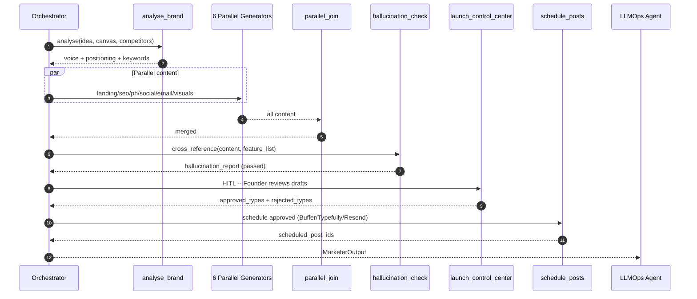

# Pillar 6 — Marketing & Launch Automation: Technical Implementation Plan

> **Owner**: Pallavi Anil Sindkar
> **Task ID**: AF-044 · **Branch**: `feature/marketing-agent`
> **Status**: 🟡 Platform unblocked (AF-036 BaseAgent · AF-027 UDAL · AF-028 FastAPI · AF-047 Tool Registry delivered) — but still **blocked on AF-040 Architect feature list** (Kaushlendra, hallucination ground truth) + AF-049 router (Purnima). Agent ❌ not built yet.
> **Date**: 2026-06-04 · **Version**: 1.0.0
> **Depends on**: AF-036 (BaseAgent) ✅, AF-040 (Architect feature list) ❌ pending
> **SLA**: < 45 minutes end-to-end (excluding async Founder Approval gate)
> **Ground truth**: [CLAUDE.md](../CLAUDE.md) §7.9/§34 · [marketer-agent.md](../../docs/architecture/Agents-Architecture/marketer-agent.md)

---

## Table of Contents

1. [Pillar Objective](#1-pillar-objective)
2. [Dependencies](#2-dependencies)
3. [Agent Architecture](#3-agent-architecture)
4. [Workflow Design](#4-workflow-design)
5. [Sub-Agent Recommendations](#5-sub-agent-recommendations)
6. [Tools & Integrations](#6-tools--integrations)
7. [Data Models](#7-data-models)
8. [Development Roadmap](#8-development-roadmap)
9. [Testing Strategy](#9-testing-strategy)
10. [Deliverables](#10-deliverables)

---

## 1. Pillar Objective

### 1.1 What Pillar 6 Achieves

Pillar 6 is the **Go-To-Market (GTM) automation engine**. It receives a deployed, live product (URL + brand config + validated feature list) and autonomously produces a complete launch package — brand visuals, landing page copy, SEO blogs, a Product Hunt kit, social posts, and email drips — then schedules it for publication **after explicit Founder approval**. Every claim is fact-checked against the actual product capabilities to prevent hallucinated marketing.

**Core mission**: Transform a deployed MVP into a market-ready product with professional collateral — all cross-referenced against the Architect's feature list — collapsing "2–3 weeks of GTM" into roughly **2 hours**.

### 1.2 Specific Outputs Produced

| Output Category | Deliverable | Volume |
|---|---|---|
| **Brand Identity** | Logo prompt + DALL-E 3 generation, OG image, social card, email banner | 4 visuals |
| **Landing Page** | Hero, features, social proof, pricing, FAQ, CTA + meta tags | 6 sections |
| **SEO Content** | Long-form keyword-targeted blog drafts (1,500–2,500 words) | 3–5 articles |
| **Product Hunt Kit** | Tagline, description, first comment, maker note, gallery captions | 1 kit |
| **Social Posts** | X thread (4–6 tweets), LinkedIn long-form, Show HN | 3 posts |
| **Email Sequences** | Onboarding (Day 0/1/3/7/14) + reactivation (3 emails) | 8 emails |
| **GTM Report** | Consolidated Markdown report + hallucination audit + scheduled IDs | 1 report |

### 1.3 Inputs Received from Upstream

| Source Pillar | Data Consumed | Required / Optional | Used For |
|---|---|---|---|
| **Pillar 2** (AF-040, Kaushlendra) | **FeatureList** (`features[]`, `integrations[]`, `pricing_tiers[]`) | **Required (critical)** | Hallucination cross-reference — every claim must be grounded here |
| **Pillar 1** (AF-037, Somesh) | `idea_normalised`, `lean_canvas_json`, personas, competitor names | **Required** | Positioning, audience, differentiation |
| **Pillar 5** (AF-043, Prasenjit) | `live_url`, deploy status, DNS records | **Required** | CTA links, landing URLs, social links |
| **Pillar 3** (AF-041, Kartik) | repo URL, README | Optional | Technical blog content, GitHub links |

### 1.4 Outputs Produced for Downstream Consumers

| Consumer | Data Emitted | Format |
|---|---|---|
| **LLMOps Agent** (Pillar 7) | `MarketerOutput`: S3 URIs, token counts, hallucination audit | gRPC / Protobuf |
| **Founder Portal** (Frontend AF-059 Raunak) | All draft content for Launch Control Center HITL review | JSON via REST + Realtime |
| **Mobile App** (AF-068 Yogesh) | Launch preview for mobile gate approval | REST |
| **UDAL** — Artifacts | All assets stored as run artifacts | `tenant_uuid.artifacts` + S3 |

---

## 2. Dependencies

### 2.1 Mandatory Dependencies (Hard Blockers)

| Dependency | Task ID | Owner | Why It's Mandatory | Status |
|---|---|---|---|---|
| BaseAgent ABC | AF-036 | Asit | MarketingAgent subclasses it | ✅ Done |
| UDAL | AF-027 | Somesh | Read inputs, write assets via UDAL | ✅ Done |
| FastAPI bootstrap | AF-028 | Somesh | HITL gate + artifact retrieval | ✅ Done |
| **Architect feature list** | AF-040 | Kaushlendra | Ground truth for hallucination check | ❌ Pending (Kaushlendra) — **the live blocker** |
| Tool Registry | AF-047 | Asit | DALL-E 3, Buffer, Typefully, Resend, Tavily, Ahrefs | ✅ Done (shell; add entries) |
| LLM Router | AF-049 | Purnima | Gemini 3.5 Flash routing | ❌ Pending (Purnima) |

### 2.2 Soft Dependencies (Optional but Beneficial)

| Dependency | Task ID | Owner | Fallback If Unavailable |
|---|---|---|---|
| Strategy output | AF-037 | Somesh | Derive positioning from `idea_normalised` + LLM |
| Live URL | AF-043 | Prasenjit | Placeholder URL; mark CTAs `[PENDING_DEPLOY]` |
| Prompt Registry | AF-048 | Purnima | Load Jinja2 from filesystem |
| Guardrails | AF-046 | Unassigned | Built-in hallucination node + PII regex |
| Redis | AF-032 | Somesh | In-memory TTL dict; Postgres-based approval polling |

### 2.3 Fallback Behavior Matrix

```
+----------------------------------+----------------------------------------------+
| Missing Input / Failure          | Fallback Strategy                            |
+----------------------------------+----------------------------------------------+
| live_url                        | Placeholder URL; mark "pre-deployment drafts" |
+----------------------------------+----------------------------------------------+
| feature_list                    | FATAL -- refuse to generate copy without the |
|                                  | feature list (hallucination risk)            |
+----------------------------------+----------------------------------------------+
| lean_canvas_json                | Derive positioning from idea + LLM; warn     |
+----------------------------------+----------------------------------------------+
| brand_config                    | Auto-generate brand identity; default tone   |
|                                  | = professional                               |
+----------------------------------+----------------------------------------------+
| DALL-E 3 unavailable            | Return prompts only (generated_url=null);    |
|                                  | non-fatal                                    |
+----------------------------------+----------------------------------------------+
| Buffer/Typefully down           | Cross-fallback; else mark posts "draft"      |
+----------------------------------+----------------------------------------------+
| Resend unavailable              | Queue emails; SendGrid fallback if configured|
+----------------------------------+----------------------------------------------+
| Founder approval timeout (30m)  | Slack + email alert; TIMED_OUT; preserve 24h |
+----------------------------------+----------------------------------------------+
```

### 2.4 Dependency Chain Visualization

```
Somesh (P1: canvas/personas)  Kaushlendra (P2: FEATURE LIST)  Prasenjit (P5: live_url)
        \                              |                              /
         \                             v                             /
          +----> Asit AF-036 BaseAgent + Somesh AF-027 UDAL + AF-028 FastAPI
                          |   Purnima AF-048/049 (Prompt Reg / Router)
                          v
        +------------------------------------------+
        |  PALLAVI -- AF-044 Marketing Agent       |
        |  analyse_brand -> 6 parallel generators  |
        |  -> hallucination_check -> [LCC gate] -> |
        |  schedule_posts -> GTM report            |
        +------------------------------------------+
                          |
        +-----------------+------------------+
        v                                    v
   Launch Control Center            Mobile Gate (Yogesh)
   (Raunak AF-059)                  (AF-068)
```

---

## 3. Agent Architecture

### 3.1 Design Philosophy

A **single** `MarketingAgent` LangGraph `StateGraph` with **13 nodes**. One agent (not many sub-agents) because: all content nodes share the same brand voice + positioning + feature list (single state avoids redundant passing); 6 content generators run in **parallel** for throughput; a centralized post-join `hallucination_check` cross-references ALL content against the feature list in one pass; and the Founder reviews everything in one Launch Control Center session.

### 3.2 MarketingAgent Class

```python
# backend/app/agents/marketing/agent.py
from app.agents.base import BaseAgent
from app.agents.marketing.graph import build_marketer_graph
from app.agents.marketing.schema import MarketerState

class MarketingAgent(BaseAgent[MarketerState, MarketerState]):
    PILLAR = 6
    AGENT_ID = "marketing"
    SLA_SECONDS = 2700  # 45 min excl. HITL

    async def understand(self, input_state): ...   # validate live_url, feature_list, brand_config
    async def plan(self, intent): ...              # brand -> parallel content -> hallucination -> gate
    async def execute(self, plan): ...
    async def verify(self, output): ...            # hallucination passed, >=1 content type approved
    async def learn(self, trace): ...              # telemetry to LLMOps
```

### 3.3 Internal Node Architecture

```
+--------------------------------------------------------------------------+
|                   MarketingAgent (LangGraph StateGraph)                   |
|                                                                          |
|  +--------------+   +---------------+                                    |
|  | ingest_input |-->| analyse_brand |                                    |
|  +--------------+   +-------+-------+                                     |
|                            |                                             |
|        +----------+--------+--------+----------+----------+              |
|        v          v        v        v          v          v             |
|  +----------+ +--------+ +-------+ +--------+ +--------+ +----------+    |
|  | landing_ | | seo_   | | ph_   | | social | | email_ | | visual_  |   |
|  | page     | | blogs  | | kit   | | _posts | | seqs   | | assets   |   |
|  +----+-----+ +---+----+ +---+---+ +---+----+ +---+----+ +----+-----+    |
|       +-----------+----------+---------+----------+---------+            |
|                            v                                            |
|                  +------------------+                                   |
|                  | parallel_join    |  (barrier -- waits 6)            |
|                  +--------+---------+                                    |
|                           v                                             |
|                  +------------------+                                    |
|                  | hallucination_   |  (max 2 auto-correct retries)    |
|                  | check            |                                   |
|                  +--------+---------+                                    |
|                           v                                             |
|              +-----------------------+                                  |
|              | launch_control_center |  (HITL, 30-min timeout)         |
|              +-----------+-----------+                                   |
|                          v                                              |
|                 +------------------+                                     |
|                 | schedule_posts   |  (Buffer/Typefully/Resend)        |
|                 +--------+---------+                                     |
|                          v                                              |
|                 +------------------+                                     |
|                 | render_gtm_report|  -> LLMOps (Pillar 7)             |
|                 +------------------+                                     |
|  +------------------+                                                    |
|  |  error_handler   |  (central sink -> Slack alerts)                   |
|  +------------------+                                                    |
+--------------------------------------------------------------------------+
```

### 3.4 Node Responsibilities

| # | Node | Responsibility | Model | SLA |
|---|---|---|---|---|
| 1 | `ingest_input` | Validate live_url, feature_list, brand_config (FATAL if feature_list empty) | — | < 15 s |
| 2 | `analyse_brand` | Brand voice, positioning, SEO keyword targets | Gemini 3.5 Flash | < 2 min |
| 3 | `generate_landing_page` | Full landing copy + meta | Gemini 3.5 Flash | < 5 min |
| 4 | `generate_seo_blogs` | 3–5 blog drafts | Gemini 3.5 Flash | < 8 min |
| 5 | `generate_product_hunt_kit` | PH copy (constraint-adherent) | Gemini 3.5 Flash | < 4 min |
| 6 | `generate_social_posts` | X / LinkedIn / HN | Gemini 3.5 Flash | < 4 min |
| 7 | `generate_email_sequences` | Onboarding + reactivation drips | Gemini 3.5 Flash | < 5 min |
| 8 | `generate_visual_assets` | DALL-E 3 brand visuals | DALL-E 3 | < 3 min |
| 9 | `parallel_join` | Barrier — wait for 6 generators | — | — |
| 10 | `hallucination_check` | Cross-reference ALL copy vs feature_list | Gemini 3.5 Flash | < 3 min |
| 11 | `launch_control_center` | HITL — poll for approval per content type | — | 30 min timeout |
| 12 | `schedule_posts` | Push approved content to schedulers | — | < 2 min |
| 13 | `render_gtm_report` | Assemble GTM report + LLMOps handoff | Gemini 3.5 Flash | < 2 min |

---

## 4. Workflow Design

### 4.1 End-to-End Workflow

```
Step 1: INGEST & VALIDATE -- live_url (or placeholder); feature_list non-empty (FATAL if empty);
        brand_config.product_name present
Step 2: BRAND ANALYSIS -- Tavily + Ahrefs + LLM -> brand_voice, positioning, seo_keywords
Step 3: PARALLEL CONTENT (fan-out 6) -- landing || seo_blogs || ph_kit || social || email || visuals
Step 4: PARALLEL JOIN (barrier) -- verify all 6 (or graceful soft-fail); merge
Step 5: HALLUCINATION CHECK (max 2 auto-correct) -- classify NONE/WARNING/CRITICAL vs feature_list;
        critical==0 -> pass; critical>0 and retry<2 -> re-prompt; retries exhausted -> error_handler
Step 6: LAUNCH CONTROL CENTER (HITL, 30-min) -- Founder APPROVE ALL / REJECT ALL / PARTIAL
        poll Redis approval:{run_id}; timeout -> Slack + email -> TIMED_OUT
Step 7: SCHEDULE -- approved content only: X->Typefully, LinkedIn->Buffer, email->Resend, PH->manual
Step 8: GTM REPORT -- Markdown + machine-readable LLMOps JSON; upload to S3
Step 9: EMIT -- store artifacts in UDAL; MarketerOutput -> LLMOps; pillar.completed{6}
```

### 4.2 Orchestration Sequence (Mermaid)



### 4.3 Data Passed Between Nodes

```
ingest_input -> live_url, idea_normalised, brand_config, feature_list, lean_canvas_json
   -> analyse_brand -> brand_voice_summary, positioning_statement, seo_keyword_targets[]
   -> [fan-out, all read voice+positioning+feature_list+live_url]
        landing_page / seo_blogs[] / product_hunt_kit / social_post_bundle /
        email_sequences[] / visual_asset_prompts[]
   -> parallel_join (merge)
   -> hallucination_check -> hallucination_report (passed, critical/warning)
   -> launch_control_center -> approval_status, approved_content_types[], rejected[]
   -> schedule_posts -> scheduled_post_ids{}
   -> render_gtm_report -> gtm_report_markdown
   -> MarketerOutput -> LLMOps (Pillar 7)
```

---

## 5. Sub-Agent Recommendations

### 5.1 Evaluation Matrix

| Proposed Sub-Agent | Recommendation | Rationale |
|---|---|---|
| Positioning & Messaging | ✅ **Node** → `analyse_brand` | Single LLM call; feeds all content |
| Landing Page Copy | ✅ **Node** → `generate_landing_page` | Parallel branch |
| SEO Content / Blog | ✅ **Node** → `generate_seo_blogs` | SEO + blog inseparable |
| Social Media | ✅ **Node** → `generate_social_posts` | Platform-native formats |
| Email Campaign | ✅ **Node** → `generate_email_sequences` | Drip sequences |
| Product Hunt Launch | ✅ **Node** → `generate_product_hunt_kit` | Constraint-adherent copy |
| Visual Designer | ✅ **Node** → `generate_visual_assets` | DALL-E 3 |
| ICP / Audience | ❌ **From Pillar 1** | Personas come from Strategy |
| Press Release | 🔶 **Phase 2** | Lower priority |
| Analytics & Tracking | 🔶 **Phase 3** | Needs live data |

### 5.2 Final Node Architecture

**Phase 1 (13 nodes):** ingest, analyse_brand, 6 generators, parallel_join, hallucination_check, launch_control_center, schedule_posts, render_gtm_report.
**Phase 2:** `generate_press_release`, `generate_reddit_posts`, pitch-deck copy.
**Phase 3:** analytics setup, A/B variants, engagement tracker.

---

## 6. Tools & Integrations

### 6.1 Per-Node Tool Registry

| Node | Tool | Service | Purpose | Env Variable |
|---|---|---|---|---|
| analyse_brand | Tavily | api.tavily.com | Competitor/positioning research | `TAVILY_API_KEY` |
| analyse_brand / seo_blogs | Ahrefs | apiv2.ahrefs.com | Keyword volume/difficulty | `AHREFS_API_KEY` |
| visual_assets | DALL-E 3 | api.openai.com | Brand visuals | `OPENAI_API_KEY` |
| schedule_posts | Buffer | bufferapp.com | LinkedIn scheduling | `BUFFER_ACCESS_TOKEN` |
| schedule_posts | Typefully | typefully.com | X thread scheduling | `TYPEFULLY_API_KEY` |
| schedule_posts | Resend | resend.com | Email delivery | `RESEND_API_KEY` |
| launch_control_center | Redis | ElastiCache | Approval polling | `REDIS_URL` |
| error_handler | Slack | Slack API | Alerts | `SLACK_WEBHOOK_MARKETER` |

### 6.2 LLM Requirements

| Node | Model | Reason | Est. Tokens/Call |
|---|---|---|---|
| analyse_brand | Gemini 3.5 Flash | Brand reasoning + structured output | ~2,000 in / ~800 out |
| generate_landing_page | Gemini 3.5 Flash | Long-form conversion copy | ~1,500 in / ~3,000 out |
| generate_seo_blogs | Gemini 3.5 Flash | 3 × 2,000-word articles | ~2,000 in / ~15,000 out |
| generate_email_sequences | Gemini 3.5 Flash | HTML + plain text | ~1,500 in / ~8,000 out |
| hallucination_check | Gemini 3.5 Flash | Strict factual cross-ref | ~5,000 in / ~500 out |

**~18k input + ~33k output + 4 DALL-E 3 images per run.**

### 6.3 External Service Rate Limits & Fallbacks

| Service | Limit | Timeout | Retry | Fallback |
|---|---|---|---|---|
| Tavily | 60/min | 20 s | 3 | LLM training knowledge |
| Ahrefs | 500/day | 20 s | 3 | Tavily keyword data |
| DALL-E 3 | 5 img/min | 60 s | 3 | Prompt only (non-fatal) |
| Buffer / Typefully | 10/s | 15 s | 3 | Cross-fallback; else draft |
| Resend | 10/s | 15 s | 3 | SendGrid |
| Gemini 3.5 Flash | 1,000 RPM | 30 s | 3 (45 s) | Hard fail → error_handler |

### 6.4 Database & Storage Requirements

| Store | Usage | Path / Key |
|---|---|---|
| PostgreSQL (UDAL) | run state, artifact metadata, gate decisions | `tenant_uuid.artifacts` |
| pgvector | `brand_voice_examples` (future RAG) | 768-dim HNSW |
| Redis | approval polling, prompt cache | `marketer:approval:{run_id}` |
| S3 | GTM report, all content JSON, visuals | `s3://.../{org}/{run}/` |

---

## 7. Data Models

```python
class FeatureList(BaseModel):
    features: list[str]; integrations: list[str] = []; pricing_tiers: list[dict] = []

class SocialPost(BaseModel):
    channel: str; content: str; hashtags: list[str] = []
    scheduled_at: datetime | None = None; status: str = "draft"

class SEOBlogDraft(BaseModel):
    title: str; target_keyword: str; secondary_keywords: list[str] = []
    body_markdown: str; meta_description: str; status: str = "draft"

class HallucinationReport(BaseModel):
    critical_count: int; warning_count: int; passed: bool
    findings: list[dict] = []

class MarketerOutput(BaseModel):
    run_id: UUID; organization_id: str; product_name: str; live_url: str
    gtm_report_s3_uri: str
    approved_content_types: list[str]; rejected_content_types: list[str]
    scheduled_post_ids: dict[str, str]
    hallucination_critical_count: int; hallucination_warning_count: int
    total_llm_tokens_used: int = 0; total_images_generated: int = 0
```

---

## 8. Development Roadmap

### Phase 1 — MVP (Weeks 1–3)

| Week | Task | Deliverable | Status |
|---|---|---|---|
| 1 | Schemas + 9 Jinja2 prompts (brand, landing, blogs, PH, social, email, visuals, hallucination, report) | `schema.py`, `prompts/*.j2` | 🟢 Start now |
| 1 | Tool wrappers (Tavily, Ahrefs, DALL-E 3, Buffer, Typefully, Resend) | `tools/*.py` | 🟢 Start now |
| 1 | **Hallucination cross-reference validator (standalone)** | `nodes/hallucination_check.py` | 🟢 Start now |
| 2 | StateGraph + 13 nodes (6 parallel) + routers | `graph.py`, `nodes/` | 🟢 Ready (AF-036 done) |
| 3 | Wire MarketingAgent to BaseAgent; partial approval | `agent.py` | 🟡 BaseAgent ready; needs AF-040 feature list |
| 3 | 5 mock product fixtures + golden evals | `tests/` | 🟢 Start now |

### Phase 2 (Weeks 4–6)
Real Tavily/Ahrefs/DALL-E 3/Buffer/Typefully/Resend; Launch Control Center contract (AF-059); approval polling; SLA + metrics.

### Phase 3 (Weeks 7–10)
Press release, Reddit posts; UTM/GA4; A/B variants; engagement tracker; LLMOps feedback loop.

---

## 9. Testing Strategy

### 9.1 Testing Without the Full Platform
Mock UDAL, `FakeLLM` (pre-built copy JSON), HTTP mocks for Tavily/Ahrefs/DALL-E/Buffer/Typefully/Resend (`respx`), mock BaseAgent, LangGraph `MemorySaver`.

### 9.2 Test Architecture

```
tests/
├── unit/agents/marketing/
│   ├── test_schema_validation.py
│   ├── test_hallucination_validator.py    # feature cross-reference
│   ├── test_routers.py
│   └── test_llm_parse_correction.py
├── integration/agents/marketing/
│   ├── test_graph_happy_path.py
│   ├── test_graph_hallucination_retry.py
│   ├── test_graph_partial_approval.py
│   ├── test_graph_timeout.py
│   └── test_graph_tool_failure.py         # DALL-E degrade
└── golden/marketing/ + fixtures/mock_products/
```

### 9.3 Five Mock Products

| Product | Domain | Tone |
|---|---|---|
| `shipfast` | developer-tools | technical |
| `calmhq` | health-wellness | inspirational |
| `devpulse` | developer-tools | technical |
| `greenledger` | sustainability-fintech | professional |
| `petconnect` | petcare-healthtech | casual |

### 9.4 Test Execution Commands

```bash
cd backend && uv run pytest tests/unit/agents/marketing/ -v
cd backend && uv run pytest tests/integration/agents/marketing/ -v
cd backend && npx promptfoo eval --config tests/golden/marketing/promptfoo.yaml
cd backend && uv run python -m app.agents.marketing.e2e_test --product fixtures/mock_products/shipfast.json --mock-approval
```

### 9.5 Key Test Scenarios

| # | Scenario | Type | Pass Criteria |
|---|---|---|---|
| T1 | Happy path → all content → approved → scheduled | Integration | 6 content types; passed; complete |
| T2 | Missing live_url → placeholder | Unit | CTA uses placeholder; warning |
| T3 | Empty feature_list → FATAL | Unit | `fatal_error`; no generation |
| T4 | DALL-E rate limit → degrade | Integration | prompts present; generated_url null |
| T5 | Hallucination detected → auto-correct | Integration | 2nd check passes; retry_count==1 |
| T6 | Retries exhausted → error_handler | Integration | Slack alert |
| T7 | Partial approval | Integration | only approved scheduled; rejected stored |
| T8 | Approval timeout (30m) | Integration | TIMED_OUT; Slack + email |
| T9 | Buffer + Typefully both fail | Integration | posts "draft"; non-fatal |
| T10 | Concurrent tenant isolation | Integration | no cross-tenant leakage |

---

## 10. Deliverables

### 10.1 File Structure

```
backend/app/agents/marketing/
├── agent.py  graph.py  schema.py  routers.py
├── nodes/    (ingest_input, analyse_brand, generate_landing_page, generate_seo_blogs,
│              generate_product_hunt_kit, generate_social_posts, generate_email_sequences,
│              generate_visual_assets, parallel_join, hallucination_check,
│              launch_control_center, schedule_posts, render_gtm_report, error_handler)
├── tools/    (tavily_search, ahrefs_keywords, dalle_generate, buffer_schedule,
│              typefully_schedule, resend_broadcast)
├── prompts/  (*.j2 -- 9 templates)
├── utils/    (retry.py, llm_parse.py, sla.py)
└── proto/    marketer_output.proto
tests/        unit/ integration/ golden/ fixtures/mock_products/
```

### 10.2 Environment Variables (`.env.example`)

```bash
# --- Marketing Agent (Pillar 6) ---------------------------------------------
AHREFS_API_KEY=
BUFFER_ACCESS_TOKEN=
TYPEFULLY_API_KEY=
SLACK_WEBHOOK_MARKETER=
# TAVILY_API_KEY, OPENAI_API_KEY, RESEND_API_KEY already defined
```

### 10.3 Prompt Registry Entries (AF-048)

| Template | Version | Model |
|---|---|---|
| `marketing/analyse_brand` | 1.0.0 | Gemini 3.5 Flash |
| `marketing/generate_landing_page` | 1.0.0 | Gemini 3.5 Flash |
| `marketing/generate_seo_blogs` | 1.0.0 | Gemini 3.5 Flash |
| `marketing/generate_product_hunt_kit` | 1.0.0 | Gemini 3.5 Flash |
| `marketing/generate_social_posts` | 1.0.0 | Gemini 3.5 Flash |
| `marketing/generate_email_sequences` | 1.0.0 | Gemini 3.5 Flash |
| `marketing/generate_visual_assets` | 1.0.0 | DALL-E 3 |
| `marketing/hallucination_check` | 1.0.0 | Gemini 3.5 Flash |
| `marketing/render_gtm_report` | 1.0.0 | Gemini 3.5 Flash |

### 10.4 Tool Registry Entries (AF-047)

| Tool | Scope | Auth | Cost | Rate Limit |
|---|---|---|---|---|
| `tavily_search` | Marketing + Research | API Key | Low | 60/min |
| `ahrefs_keywords` | Marketing | API Key | Medium | 500/day |
| `generate_image` | Marketing | API Key | High | 5 img/min |
| `buffer_schedule` | Marketing | OAuth | Free | 10/s |
| `typefully_schedule` | Marketing | API Key | Free | 10/s |
| `resend_broadcast` | Marketing | API Key | Low | 10/s |

### 10.5 Prometheus Metrics

| Metric | Type | Labels | Description |
|---|---|---|---|
| `marketer_node_duration_seconds` | Histogram | node, tenant | Per-node duration |
| `marketer_hallucination_findings_total` | Counter | severity | Critical/warning findings |
| `marketer_approval_status_total` | Counter | status | approve/reject/timeout/partial |
| `marketer_scheduled_posts_total` | Counter | channel | Scheduled posts |
| `marketer_images_generated_total` | Counter | status | DALL-E outcomes |

### 10.6 Kafka / EventBridge Events Emitted

| Event | Bus | Payload |
|---|---|---|
| `pillar.started{6}` | EventBridge | `{ run_id, tenant_id }` |
| `pillar.completed{6}` | EventBridge | `{ run_id, approval_status }` |
| `gate.required{launch_control}` | EventBridge → UI | `{ run_id, content_types }` |
| `marketer.content_generated` | Kafka | `{ run_id, content_types, token_counts }` |
| `marketer.hallucination_audit` | Kafka | `{ run_id, critical_count, passed }` |

### 10.7 Output Contract (MarketerOutput protobuf)

```protobuf
syntax = "proto3";
package autofounder.marketer.v1;
message MarketerOutput {
  string run_id = 1; string parent_run_id = 2; string tenant_id = 3;
  string product_name = 4; string live_url = 5;
  string gtm_report_s3_uri = 6;
  repeated string approved_content_types = 7;
  repeated string rejected_content_types = 8;
  map<string,string> scheduled_post_ids = 9;
  int32 hallucination_critical_count = 10; int32 hallucination_warning_count = 11;
  int32 total_llm_tokens_used = 12; int32 total_images_generated = 13;
}
```

### 10.8 Immediate Action Items (🟢 Start Today)

| # | Task | Priority | Est. | Output |
|---|---|---|---|---|
| 1 | Pydantic schemas | P0 | 4 hrs | `schema.py` |
| 2 | 9 Jinja2 prompt templates | P0 | 6 hrs | `prompts/*.j2` |
| 3 | **Hallucination cross-reference validator (standalone)** | P0 | 3 hrs | `nodes/hallucination_check.py` |
| 4 | Tool wrappers (DALL-E, Resend, Buffer, Typefully, Tavily, Ahrefs) | P0 | 4 hrs | `tools/*.py` |
| 5 | 5 mock product fixtures | P1 | 2 hrs | `fixtures/mock_products/` |
| 6 | Unit tests + golden evals | P1 | 7 hrs | `tests/` |
| 7 | **Coordinate FeatureList schema with Kaushlendra** | P0 | 1 hr | shared contract |

**Total offline work ~27 hrs — all doable before BaseAgent lands.**

---

## Appendix A: Key Decisions Log

| # | Decision | Choice | Rationale |
|---|---|---|---|
| D1 | One agent, 13 nodes | Single MarketingAgent graph | Shared state; parallel generators; atomic HITL |
| D2 | Models | Gemini 3.5 Flash text; DALL-E 3 images | Platform primary + only image option |
| D3 | Hallucination check | LLM cross-ref vs FeatureList | Catches semantic claims regex can't |
| D4 | Approval granularity | Per-content-type partial approval | Approve landing, revise blogs — better UX |
| D5 | Scheduling | Buffer (LinkedIn) + Typefully (X) + Resend (email) | Best-in-class per channel |
| D6 | FeatureList hard dependency | **FATAL if empty** | Marketing without ground truth = hallucination factory |
| D7 | Blog count | 3 MVP (configurable to 10) | Problem/solution/comparison coverage |
| D8 | Approval timeout | 30 min + Slack/email; 24h preservation | Urgency vs reasonable response |

## Appendix B: Risk Register

| Risk | Probability | Impact | Mitigation |
|---|---|---|---|
| Hallucination false negatives | Medium | High | Golden evals with known hallucinations; LLM-as-judge in CI; strict prompts |
| Gemini output not valid JSON | Medium | Medium | `parse_with_correction` 1 retry; schema enforcement |
| DALL-E rate limits | Medium | Low | Sequential generation; prompt-only fallback |
| Orphaned runs (no approval) | Low | Medium | 30-min timeout → alert → 24h preservation → expire |
| Prompt injection via brand_config | Medium | High | Input Guardrail before LLM |
| Token budget on big feature lists | Low | Medium | Context compression; cap to top 20 features |

## Appendix C: Coordination Checklist

| Who | What | When | Status |
|---|---|---|---|
| **Kaushlendra (Pillar 2)** | Agree `FeatureList` schema (hallucination ground truth) | Immediately | ⬜ Pending |
| **Somesh (Pillar 1)** | Confirm `lean_canvas_json` + persona format | Immediately | ⬜ Pending |
| **Prasenjit (Pillar 5)** | Agree `live_url` input for CTAs | Soon | ⬜ Pending |
| **Asit (Platform)** | BaseAgent + UDAL + tool registration | When AF-036 starts | ✅ BaseAgent + UDAL + Tool Registry shell delivered (add marketing entries) |
| **Purnima (Pillar 7)** | Register marketing prompts (AF-048) + routing | When shells exist | ⬜ Pending |
| **Raunak (Frontend)** | Launch Control Center data contract (AF-059) | When mock data ready | ⬜ Pending |
| **Yogesh (Mobile)** | Mobile gate preview (AF-068) | When mock data ready | ⬜ Pending |

---

*Auto-Founder AI — Pillar 6: Marketing & Launch Automation Technical Plan v1.0.0 | June 2026*
*Owner: Pallavi Anil Sindkar | Ground truth: CLAUDE.md §7.9/§34 + marketer-agent.md | Reviewed by: [Pending team review]*
