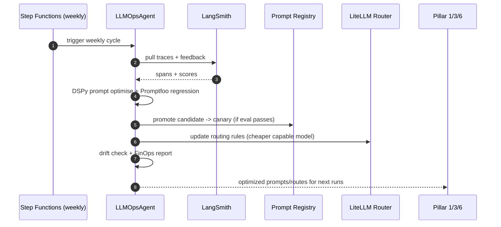

# Pillar 7 — LLMOps & Continuous Learning (+ Shared Platform): Technical Implementation Plan

> **Owner**: Purnima
> **Task IDs**: AF-045 (LLMOps Agent), AF-048 (Prompt Registry), AF-049 (LiteLLM Router + RAG), AF-050 (Eval harness)
> **Branches**: `feature/llmops-agent`, `feature/prompt-registry`, `feature/model-router-rag`, `feature/eval-harness`
> **Status**: 🟡 Shared plumbing startable now; the LLMOps agent itself runs **last**
> **Date**: 2026-06-04 · **Version**: 1.0.0
> **Depends on**: AF-036 (BaseAgent) + **all agents running** (for AF-045)
> **SLA / Cadence**: Weekly Step Functions optimization cycle; eval CI gate blocks prompt promotion on > 2% regression
> **Ground truth**: [CLAUDE.md](../CLAUDE.md) §7.10/§30/§31/§33/§36 · [llmops-agent.md](../../docs/architecture/Agents-Architecture/llmops-agent.md)

---

## Table of Contents

1. [Objective](#1-objective)
2. [Dependencies](#2-dependencies)
3. [Component Architecture](#3-component-architecture)
4. [Workflow Design](#4-workflow-design)
5. [Sub-Component Recommendations](#5-sub-component-recommendations)
6. [Tools & Integrations](#6-tools--integrations)
7. [Data Models](#7-data-models)
8. [Development Roadmap](#8-development-roadmap)
9. [Testing Strategy](#9-testing-strategy)
10. [Deliverables](#10-deliverables)

---

## 1. Objective

### 1.1 What Pillar 7 Achieves

Pillar 7 is the **learning loop** — and Purnima also owns the **shared LLM plumbing** every other pillar plugs into. It is **four components**: (1) the **LLMOps Agent** (trace analysis, prompt optimization, drift monitoring, A/B experiments, FinOps); (2) the **Prompt Registry** (versioned templates, canary split); (3) the **LiteLLM Router + RAG** (task-class → model routing, hybrid retrieval); (4) the **Eval harness** (golden sets, CI gate). The three shared components partially unblock *everyone*, so they ship first; the LLMOps agent ships last because it needs live agent traces to analyse.

**Core mission**: Make the whole platform get better every week — route to the cheapest capable model, optimize prompts from real RLHF data, catch drift before it ships, and keep COGS under control — closing the loop back into Pillars 1, 3, and 6.

### 1.2 Specific Outputs Produced

| Component | Deliverable | Volume |
|---|---|---|
| **LLMOps Agent** | Weekly prompt/model improvement report + applied updates | weekly |
| **Prompt Registry** | Versioned Jinja2 templates with active/canary resolution | per template |
| **LiteLLM Router** | Task-class → model routing rules + RAG pipeline | 1 router |
| **Eval harness** | Promptfoo golden sets + LangSmith batch runner + CI gate | per agent |
| **Drift / FinOps** | Drift scores (TruLens/Evidently) + per-tenant cost report | continuous |

### 1.3 Inputs Received from Upstream

| Source | Data Consumed | Required / Optional | Used For |
|---|---|---|---|
| **All agents (P1–P6)** | Run traces (LangSmith), accept/reject feedback, token counts | **Required (for AF-045)** | Trace analysis, A/B, FinOps |
| **All pillar owners** | Their prompts (AF-048) + golden sets (AF-050) | **Required** | Registry entries + eval coverage |
| **Asit (Platform)** | UDAL, pgvector, BaseAgent | **Required** | Data access + RAG store + agent contract |

### 1.4 Outputs Produced for Downstream Consumers

| Consumer | Data Emitted | Format |
|---|---|---|
| **Every pillar agent** | Resolved prompt (active/canary) + routed model + RAG context | Python API |
| **CI pipeline** | Eval pass/fail gate (blocks prompt promotion on regression) | GitHub Actions |
| **Raunak (LLMOps Dashboard AF-060)** | cost/drift/eval/prompt-version data | REST |
| **Pillars 1/3/6** | Optimized prompts (feedback loop) | Prompt Registry update |

---

## 2. Dependencies

### 2.1 Mandatory Dependencies (Hard Blockers)

| Dependency | Task ID | Owner | Why It's Mandatory | Status |
|---|---|---|---|---|
| BaseAgent ABC | AF-036 | Asit | LLMOps Agent subclasses it | 🔴 Blocked |
| UDAL | AF-027 | Somesh | Read/write registries + pgvector RAG | ✅ Done |
| Migrations (platform) | AF-025 | Somesh | `prompt_registry`, `model_registry` tables | ✅ Done |
| Supabase pgvector | AF-014 | Asit | RAG retrieval store | 🟡 |
| **All agents running** | AF-037–044 | Pillar owners | AF-045 needs live traces (so it runs LAST) | 🔴 |

### 2.2 Soft Dependencies (Optional but Beneficial)

| Dependency | Task ID | Owner | Fallback If Unavailable |
|---|---|---|---|
| LangSmith project | AF-024 | Asit | Local trace store; defer drift evals |
| Pillar golden sets | AF-050 | Pillar owners | Author starter golden sets per agent |
| Feature Store (Feast) | — | Deferred | Compute features ad-hoc from cost_ledger |

### 2.3 Fallback Behavior Matrix

```
+----------------------------------+----------------------------------------------+
| Missing Input / Failure          | Fallback Strategy                            |
+----------------------------------+----------------------------------------------+
| No live traces yet               | Ship Registry + Router + Eval first;         |
|                                  | run AF-045 agent only when agents are live   |
+----------------------------------+----------------------------------------------+
| LangSmith down                   | Buffer traces locally; retry export          |
+----------------------------------+----------------------------------------------+
| Eval regression > 2%             | BLOCK prompt promotion in CI; keep active     |
|                                  | version; alert prompt author                  |
+----------------------------------+----------------------------------------------+
| Cohere rerank unavailable        | Fall back to BGE-reranker-large (local)      |
+----------------------------------+----------------------------------------------+
| Router model unavailable         | Fall back to default Gemini 3.5 Flash;       |
|                                  | log COGS deviation                            |
+----------------------------------+----------------------------------------------+
| Cost cap exceeded (tenant)       | Circuit breaker pauses run; notify founder   |
+----------------------------------+----------------------------------------------+
```

### 2.4 Dependency Chain Visualization

```
Somesh AF-027 UDAL + AF-025 migrations + Asit AF-014 pgvector + AF-036 BaseAgent
   |
   v
+------------------------------------------------------+
|  PURNIMA -- shared plumbing (ship FIRST)             |
|  AF-048 Prompt Registry  -- everyone's templates     |
|  AF-049 LiteLLM Router + RAG -- everyone's LLM calls |
|  AF-050 Eval harness     -- everyone's golden sets   |
+------------------------------------------------------+
   |  (unblocks all 7 pillar agents)
   v
ALL AGENTS RUN (P1..P6) -> emit traces
   |
   v
+------------------------------------------------------+
|  PURNIMA -- AF-045 LLMOps Agent (ship LAST)          |
|  trace analysis -> prompt opt -> A/B -> drift ->     |
|  FinOps -> feedback into P1/P3/P6                    |
+------------------------------------------------------+
```

---

## 3. Component Architecture

### 3.1 Design Philosophy

Four components with a clear ordering: **Registry + Router + Eval are infrastructure** (built first, consumed by every agent); the **LLMOps Agent is a consumer of live data** (built last). The LLMOps Agent is a LangGraph `StateGraph` driven on a weekly Step Functions cadence, not per-request.

### 3.2 LLMOps Agent + Shared APIs

```python
# backend/app/agents/llmops/agent.py
from app.agents.base import BaseAgent
from app.agents.llmops.schema import LLMOpsState

class LLMOpsAgent(BaseAgent[LLMOpsState, LLMOpsState]):
    PILLAR = 7
    AGENT_ID = "llmops"
    SLA_SECONDS = 86400  # weekly cycle window

    async def understand(self, input_state): ...   # pull week's traces
    async def plan(self, intent): ...              # analyse -> optimise -> A/B -> drift -> FinOps
    async def execute(self, plan): ...
    async def verify(self, output): ...            # no eval regression before promote
    async def learn(self, trace): ...

# Shared APIs (used by ALL agents):
#   prompt_registry.get(name, tenant) -> resolves active/canary
#   llm_router.complete(task_class, messages) -> routes to model + applies RAG
#   eval_harness.run(agent, golden_set) -> score, gate on >2% regression
```

### 3.3 Internal Component Architecture

```
+--------------------------------------------------------------------------+
|                   PILLAR 7 -- LLMOps + Shared Plumbing                    |
|                                                                          |
|  (1) PROMPT REGISTRY (AF-048)                                           |
|      prompt_registry table + S3 ; get() resolves active/canary ;        |
|      deterministic split ; strict Jinja2 variable validation            |
|                                                                          |
|  (2) LiteLLM ROUTER + RAG (AF-049)                                      |
|      task_class -> model (Gemini 3.5 Flash) ;                           |
|      RAG: query rewrite -> hybrid BM25+ANN (pgvector) -> Cohere rerank  |
|           -> context compression -> citation check                      |
|      gemini-embedding-2 (768-dim) for all collections                   |
|                                                                          |
|  (3) EVAL HARNESS (AF-050)                                              |
|      Promptfoo golden sets per agent -> LangSmith batch runner ->       |
|      CI gate: block promotion on score regression > 2%                  |
|                                                                          |
|  (4) LLMOps AGENT (AF-045) -- weekly Step Functions cycle               |
|      +-> trace_analysis (LangSmith)                                     |
|      +-> prompt_optimise (DSPy + Promptfoo regression)                  |
|      +-> model_route_update (LiteLLM rules)                             |
|      +-> drift_monitor (TruLens / Evidently)                            |
|      +-> ab_experiment (canary buckets)                                 |
|      +-> finops_report (Cost Explorer, per-tenant)                      |
|      +-> feedback -> Pillars 1 / 3 / 6                                  |
+--------------------------------------------------------------------------+
```

### 3.4 Component Responsibilities

| # | Component | Responsibility | Key Tech | Order |
|---|---|---|---|---|
| 1 | Prompt Registry | Versioned templates, canary resolution | Postgres + S3 + Jinja2 | First |
| 2 | LiteLLM Router + RAG | Model routing + hybrid retrieval | LiteLLM, pgvector, Cohere | First |
| 3 | Eval harness | Golden sets + CI gate | Promptfoo, LangSmith | First |
| 4 | LLMOps Agent | Weekly optimization cycle | LangGraph, DSPy, TruLens, Step Functions | Last |

---

## 4. Workflow Design

### 4.1 End-to-End Workflow (weekly LLMOps cycle)

```
Step 1: COLLECT -- pull the week's traces (LangSmith) + accept/reject feedback + cost_ledger
Step 2: ANALYSE -- find low-quality / high-cost / hallucinating spans per agent
Step 3: OPTIMISE -- DSPy auto-tunes prompts; Promptfoo regression on golden sets
Step 4: EVAL GATE -- if a candidate prompt beats active by >0 and regresses <2% -> canary
Step 5: A/B -- assign canary by tenant/user bucket; measure
Step 6: DRIFT -- TruLens / Evidently drift scores; rollback to last-good if degraded
Step 7: ROUTE -- update LiteLLM routing rules if a cheaper model now meets the SLO
Step 8: FINOPS -- per-tenant cost report; flag COGS regressions
Step 9: FEEDBACK -- push optimized prompts/routes into Pillars 1 / 3 / 6 for next runs
```

### 4.2 Orchestration Sequence (Mermaid)



### 4.3 Data Passed Between Components

```
[all agents] -> traces(LangSmith) + feedback + cost_ledger
   -> trace_analysis -> weak_spans[], cost_hotspots[]
   -> prompt_optimise(DSPy) -> candidate_prompts[]
   -> eval_harness(Promptfoo) -> scores -> gate (>2% regression blocks)
   -> Prompt Registry: active -> canary -> promote
   -> LiteLLM Router: updated routing rules
   -> drift_monitor -> drift_scores -> rollback if degraded
   -> finops_report -> per_tenant_cost
   -> feedback -> Pillars 1/3/6
```

---

## 5. Sub-Component Recommendations

### 5.1 Evaluation Matrix

| Proposed Piece | Recommendation | Rationale |
|---|---|---|
| Feedback Loop Agent | ✅ **Node** → `trace_analysis` | Reads LangSmith spans |
| Prompt Optimizer | ✅ **Node** → `prompt_optimise` | DSPy + Promptfoo |
| Model Router | ✅ **Shared component (AF-049)** | Used by every agent, not just P7 |
| Drift Monitor | ✅ **Node** → `drift_monitor` | TruLens / Evidently |
| Experimentation Agent | ✅ **Node** → `ab_experiment` | Canary buckets |
| FinOps | ✅ **Node** → `finops_report` | Cost Explorer |
| Fine-tuning pipeline | 🔶 **Phase 4** | RLHF datasets accumulate first |

### 5.2 Final Component Architecture

**Phase 1 (shared, first):** Prompt Registry, LiteLLM Router + RAG, Eval harness.
**Phase 1 (agent, last):** LLMOps Agent weekly cycle (once agents are live).
**Phase 2:** drift dashboards, canary automation, FinOps alerts.
**Phase 4:** weekly fine-tune pipeline (RLHF), Feature Store (Feast).

---

## 6. Tools & Integrations

### 6.1 Per-Component Tool Registry

| Component | Tool | Service | Purpose | Env Variable |
|---|---|---|---|---|
| Router | LiteLLM | Google AI | Model routing | `GEMINI_API_KEY` |
| RAG | pgvector | Supabase | Hybrid retrieval | `DATABASE_URL` |
| RAG | Cohere Rerank | cohere.com | Cross-encoder rerank | `COHERE_API_KEY` |
| Eval | Promptfoo | local | Golden-set eval | — |
| Trace | LangSmith | smith.langchain.com | Trace + LLM eval | `LANGSMITH_API_KEY` |
| Optimize | DSPy | local | Prompt tuning | — |
| Drift | TruLens / Evidently | local | Drift scores | — |
| FinOps | AWS Cost Explorer | AWS | Cost telemetry | `AWS_*` |
| Experiments | Step Functions | AWS | Weekly cycle | — |

### 6.2 LLM Requirements

| Node | Model | Reason | Est. Tokens/Call |
|---|---|---|---|
| trace_analysis | Gemini 3.5 Flash | Summarise weak spans | ~6,000 in / ~1,500 out |
| prompt_optimise | Gemini 3.5 Flash (DSPy) | Candidate generation | ~4,000 in / ~3,000 out |
| Embeddings (RAG) | gemini-embedding-2 | 768-dim vectors | per chunk |

### 6.3 External Service Rate Limits & Fallbacks

| Service | Limit | Timeout | Retry | Fallback |
|---|---|---|---|---|
| LangSmith | plan | 30 s | 3 | Local trace buffer |
| Cohere Rerank | plan | 20 s | 3 | BGE-reranker-large (local) |
| Gemini 3.5 Flash | 1,000 RPM | 30 s | 3 (45 s) | Hard fail → error_handler |
| AWS Cost Explorer | quota | 30 s | 3 | Cached cost snapshot |

### 6.4 Database & Storage Requirements

| Store | Usage | Path / Key |
|---|---|---|
| PostgreSQL | `prompt_registry`, `model_registry`, eval results | `platform.*` |
| pgvector | `prompt_library`, all RAG collections | 768-dim HNSW |
| Redis | semantic prompt cache, embedding cache | `llm:prompt_cache:{sha256}` |
| S3 | immutable prompt artifacts, RLHF datasets | `s3://.../prompts/`, `s3://.../rlhf/` |

---

## 7. Data Models

```python
class PromptVersion(BaseModel):
    name: str; version: str            # semver
    template: str; status: str         # draft | canary | active | retired
    eval_score: float | None = None; canary_pct: int = 0

class RoutingRule(BaseModel):
    task_class: str; model: str; max_cost_per_1k: float
    quality_slo: float

class EvalResult(BaseModel):
    agent: str; golden_set: str
    score: float; baseline: float; regression_pct: float
    passed: bool                       # regression_pct <= 2.0

class LLMOpsOutput(BaseModel):
    cycle_id: UUID
    prompts_promoted: list[str]; prompts_blocked: list[str]
    routing_updates: list[RoutingRule]
    drift_alerts: list[dict]
    per_tenant_cost: dict[str, float]
    total_savings_usd: float = 0.0
```

---

## 8. Development Roadmap

### Phase 1 — Shared Plumbing First (Weeks 1–3), Agent Last

| Week | Task | Deliverable | Status |
|---|---|---|---|
| 1 | **AF-050 Eval harness** + Promptfoo golden-set runner scaffold | `eval/` | 🟢 Start now |
| 1 | **AF-049 LiteLLM Router rules** + RAG (hybrid BM25+ANN, rerank, citation) | `llm/router.py`, `rag/` | 🟢 Start now |
| 2 | **AF-048 Prompt Registry** loader + versioning + canary split | `prompts/registry.py` | 🟡 Needs AF-025 |
| 2 | Drift monitoring (TruLens/Evidently) + FinOps report logic | `llmops/drift.py`, `finops.py` | 🟢 Start now |
| 3 | **AF-045 LLMOps Agent** wired to BaseAgent (runs once agents are live) | `agent.py` | 🔴 Needs agents running |

### Phase 2 (Weeks 4–6)
LangSmith integration; canary automation; drift dashboards; LLMOps Dashboard contract (AF-060).

### Phase 3–4 (Weeks 7+)
A/B experimentation at scale; weekly fine-tune pipeline (RLHF); Feature Store (Feast); cost anomaly alerts.

---

## 9. Testing Strategy

### 9.1 Testing Without the Full Platform
Mock UDAL, `FakeLLM`, recorded trace fixtures (no live LangSmith needed), local pgvector for RAG, Promptfoo against static golden sets.

### 9.2 Test Architecture

```
tests/
├── unit/
│   ├── test_prompt_registry.py       # active/canary resolution, variable validation
│   ├── test_router_rules.py          # task_class -> model + cost cap
│   ├── test_rag_pipeline.py          # rewrite -> retrieve -> rerank -> citation
│   └── test_eval_gate.py             # regression > 2% blocks promotion
├── integration/
│   ├── test_weekly_cycle.py          # analyse -> optimise -> gate -> canary
│   └── test_drift_rollback.py        # degraded -> rollback to last-good
└── golden/
    └── eval_*.yaml                   # per-agent golden sets
```

### 9.3 Sample Data / Fixtures

| Fixture | Purpose |
|---|---|
| `week_traces.json` | Recorded LangSmith spans for analysis |
| `golden_strategy.yaml` | Strategy agent golden set |
| `golden_coder.yaml` | Coder agent golden set |
| `regressing_prompt.json` | A candidate that regresses > 2% (must be blocked) |
| `cost_ledger.json` | Per-tenant cost data for FinOps |

### 9.4 Test Execution Commands

```bash
cd backend && uv run pytest tests/unit/ -v
cd backend && uv run pytest tests/integration/ -v
cd backend && npx promptfoo eval --config tests/golden/promptfoo.yaml
```

### 9.5 Key Test Scenarios

| # | Scenario | Type | Pass Criteria |
|---|---|---|---|
| T1 | Registry resolves active/canary | Unit | correct version by bucket |
| T2 | Router picks cheapest capable model | Unit | meets SLO under cost cap |
| T3 | RAG returns cited context | Unit | citations present; reranked |
| T4 | Eval regression > 2% blocks promote | Unit | candidate stays canary; alert |
| T5 | Weekly cycle promotes a winner | Integration | better prompt → canary |
| T6 | Drift degraded → rollback | Integration | reverts to last-good version |
| T7 | Cohere down → BGE fallback | Unit | rerank still works |
| T8 | Cost cap exceeded → circuit breaker | Integration | run paused; founder notified |

---

## 10. Deliverables

### 10.1 File Structure

```
backend/app/
├── prompts/registry.py               # AF-048 Prompt Registry
├── llm/router.py                     # AF-049 LiteLLM Router
├── rag/                              # query rewrite, hybrid retrieve, rerank, compress, citation
├── eval/                             # AF-050 Promptfoo runner + CI gate
└── agents/llmops/
    ├── agent.py  graph.py  schema.py
    ├── nodes/ (trace_analysis, prompt_optimise, model_route_update, drift_monitor,
    │           ab_experiment, finops_report)
    └── prompts/ (*.j2)
```

### 10.2 Environment Variables (`.env.example`)

```bash
# --- Pillar 7 (LLMOps / shared) ---------------------------------------------
LANGSMITH_API_KEY=
COHERE_API_KEY=
# GEMINI_API_KEY, DATABASE_URL, REDIS_URL, AWS creds already defined
```

### 10.3 Prompt Registry Entries (AF-048) — Self-Managed

| Template | Version | Model | Note |
|---|---|---|---|
| `llmops/trace_analysis` | 1.0.0 | Gemini 3.5 Flash | Weak-span summarisation |
| `llmops/prompt_optimise` | 1.0.0 | Gemini 3.5 Flash (DSPy) | Candidate generation |
| (all other agents' prompts) | — | — | Registered by each pillar owner |

### 10.4 Tool Registry Entries (AF-047)

| Tool | Scope | Auth | Cost | Rate Limit |
|---|---|---|---|---|
| `litellm_complete` | All agents | API Key | Per-model | 1,000 RPM |
| `pgvector_search` | All agents | DB | Free | — |
| `cohere_rerank` | RAG | API Key | Low | plan |
| `langsmith_query` | LLMOps | API Key | Free | plan |
| `cost_explorer` | LLMOps | IAM | Free | quota |

### 10.5 Prometheus Metrics

| Metric | Type | Labels | Description |
|---|---|---|---|
| `llm_router_cost_per_run_usd` | Histogram | model, tenant | COGS per run |
| `llm_cache_hit_ratio` | Gauge | — | Semantic cache effectiveness |
| `eval_regression_pct` | Histogram | agent | Candidate vs baseline |
| `prompt_promotions_total` | Counter | result | Promote/block |
| `drift_score` | Gauge | agent | Drift over time |
| `finops_savings_usd` | Counter | tenant | Weekly savings |

### 10.6 Kafka / EventBridge Events Emitted

| Event | Bus | Payload |
|---|---|---|
| `llmops.cycle_complete` | Kafka | `{ cycle_id, promoted, blocked, savings_usd }` |
| `llmops.prompt_promoted` | EventBridge | `{ name, version, canary_pct }` |
| `llmops.drift_alert` | EventBridge → Slack | `{ agent, drift_score }` |
| `llmops.cost_regression` | EventBridge → Slack | `{ tenant, delta_usd }` |

### 10.7 Output Contract (LLMOpsOutput protobuf)

```protobuf
syntax = "proto3";
package autofounder.llmops.v1;
message LLMOpsOutput {
  string cycle_id = 1;
  repeated string prompts_promoted = 2;
  repeated string prompts_blocked = 3;
  map<string,double> per_tenant_cost = 4;
  double total_savings_usd = 5;
  repeated string drift_alerts = 6;
}
```

### 10.8 Immediate Action Items (🟢 Start Today — high leverage, everyone waits on these)

| # | Task | Priority | Est. | Output |
|---|---|---|---|---|
| 1 | **AF-050 Eval harness + Promptfoo golden-set runner scaffold** | P0 | 5 hrs | `eval/` |
| 2 | **AF-049 LiteLLM Router rules** (task-class → Gemini 3.5 Flash) | P0 | 5 hrs | `llm/router.py` |
| 3 | **AF-049 RAG pipeline** (hybrid BM25+ANN, rerank, citation) | P0 | 6 hrs | `rag/` |
| 4 | **AF-048 Prompt Registry loader + versioning** | P0 | 5 hrs | `prompts/registry.py` |
| 5 | Drift monitoring (TruLens/Evidently) + FinOps logic | P1 | 4 hrs | `llmops/drift.py`, `finops.py` |
| 6 | Coordinate golden sets + prompts with every pillar owner | P0 | 2 hrs | per-agent contributions |

**Total offline work ~27 hrs. The shared registry/router/eval come FIRST (they partially unblock everyone); the LLMOps agent comes LAST (needs live traces).**

---

## Appendix A: Key Decisions Log

| # | Decision | Choice | Rationale |
|---|---|---|---|
| D1 | Build order | Registry/Router/Eval first; Agent last | Shared plumbing unblocks others; agent needs live data |
| D2 | Model routing | Cheapest capable per SLO (LiteLLM) | COGS control |
| D3 | Embeddings | gemini-embedding-2 (768-dim) | Aligns with Gemini primary |
| D4 | Reranker | Cohere Rerank, BGE fallback | Quality + availability |
| D5 | Eval gate | Block promotion on > 2% regression | No silent quality loss |
| D6 | Prompt versions | Immutable, semver, S3 + Postgres | Reproducibility |

## Appendix B: Risk Register

| Risk | Probability | Impact | Mitigation |
|---|---|---|---|
| Model drift | Medium | High | Drift monitor + weekly evals + rollback to last-good |
| Runaway LLM cost | Medium | High | Cheapest-capable router + per-tenant caps + circuit breakers + semantic cache |
| Vendor lock-in (single LLM) | Medium | Medium | Model registry + LiteLLM (multi-provider ready) |
| Prompt regression ships | Low | High | Eval CI gate blocks promotion |
| AF-045 starved of traces | High | Medium | Ship Registry/Router/Eval first; run agent only when agents are live |

## Appendix C: Coordination Checklist

| Who | What | When | Status |
|---|---|---|---|
| **Every pillar owner** | Contribute prompts (AF-048) + golden sets (AF-050) | Ongoing | ⬜ Pending |
| **Somesh/Asit (Platform)** | UDAL + pgvector + `prompt_registry`/`model_registry` migrations + BaseAgent | When AF-025/036 land | ⬜ Pending |
| **Asit (Platform)** | Co-own observability content (AF-023/024) | When AF-028 lands | ⬜ Pending |
| **Raunak (Frontend)** | LLMOps Dashboard data contract (AF-060) | When mock data ready | ⬜ Pending |
| **All agents** | Emit traces to LangSmith so AF-045 can analyse | When agents run | ⬜ Pending |

---

*Auto-Founder AI — Pillar 7: LLMOps & Continuous Learning Technical Plan v1.0.0 | June 2026*
*Owner: Purnima | Ground truth: CLAUDE.md §7.10/§30/§31/§33/§36 + llmops-agent.md | Reviewed by: [Pending team review]*
