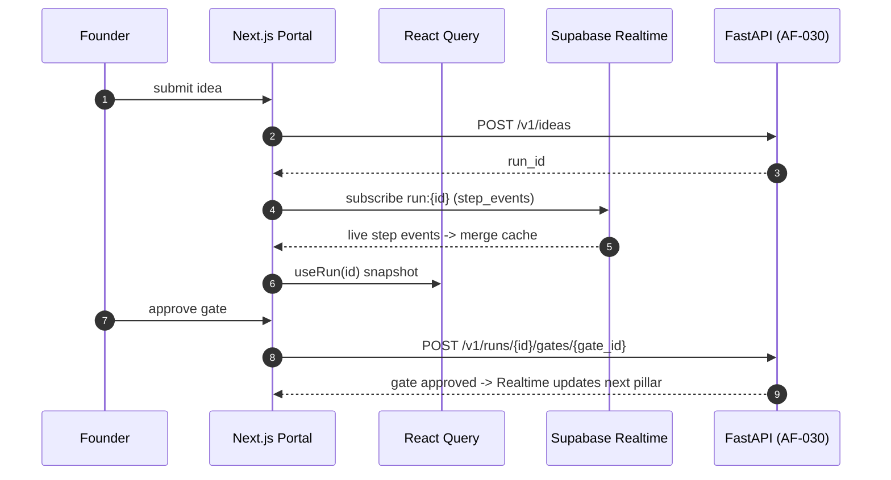

# Web Interface Design (Next.js 14 Founder Portal): Technical Implementation Plan

> **Owner**: Raunak Ravi
> **Task IDs**: AF-051 → AF-062 (12 tasks)
> **Branches**: `feature/nextjs-setup`, `feature/api-client-hooks`, `feature/state-management`, `feature/*-studio`, `feature/admin-dashboard`
> **Status**: 🟢 Start now (build every surface on mock data; swap real API after Phase 3)
> **Date**: 2026-06-04 · **Version**: 1.0.0
> **Depends on**: Phase 1 (done) for setup; AF-030 REST + AF-031 Realtime for live data
> **SLA / Targets**: UI response P95 < 100 ms · all loading/error/empty states explicit
> **Ground truth**: [CLAUDE.md](../CLAUDE.md) §12/§14 · [specs/api-design.md](../specs/api-design.md)

---

## Table of Contents

1. [Objective](#1-objective)
2. [Dependencies](#2-dependencies)
3. [Component Architecture](#3-component-architecture)
4. [Workflow Design](#4-workflow-design)
5. [Sub-Surface Recommendations](#5-sub-surface-recommendations)
6. [Libraries & Integrations](#6-libraries--integrations)
7. [Data Models & API Contracts](#7-data-models--api-contracts)
8. [Development Roadmap](#8-development-roadmap)
9. [Testing Strategy](#9-testing-strategy)
10. [Deliverables](#10-deliverables)

---

## 1. Objective

### 1.1 What the Web Interface Achieves

The Founder Portal is the **founder's window into the whole pipeline** — one Next.js 14 app with surfaces for every pillar: submit an idea, watch agents work in real time, approve/reject HITL gates, review generated code, watch deploys, sign off on launches, and monitor cost/drift. It also hosts the role-guarded super-admin `/admin` route group (not a separate app).

**Core mission**: Make an autonomous, multi-agent system feel **transparent and controllable** — live token/log streams, explicit gates, and one coherent dashboard — with every surface built on mock data first so design isn't blocked by the backend.

### 1.2 Specific Outputs Produced (12 surfaces)

| AF-ID | Surface | What it shows |
|---|---|---|
| AF-051 | App setup | Next.js 14 + Tailwind + shadcn/ui + Supabase Auth + error boundary + Sentry |
| AF-052 | API client + Realtime hooks | `useRun()`, `useGate()` (React Query + Supabase Realtime) |
| AF-053 | State + layout shell | Zustand stores + React Query config + live cost ticker |
| AF-054 | Idea Intake | Multi-modal form (text/PDF/voice/URL) |
| AF-055 | Validation Studio (P1) | Lean Canvas, viability gauge, ICP cards, pivot picker, approve/pivot |
| AF-056 | Architecture Studio (P2) | Mermaid ERD, Swagger UI, cost forecast, approve/reject |
| AF-057 | Code Review Studio (P3–4) | Monaco diff, reviewer comments, self-heal progress, scan table |
| AF-058 | Deploy Console (P5) | Live log stream, infra-spend gate, rollback |
| AF-059 | Launch Control Center (P6) | Brand kit, landing iframe, social drafts edit-in-place, email preview, approve/edit |
| AF-060 | LLMOps Dashboard (P7) | Cost charts, drift, eval history, prompt versions |
| AF-061 | Run List / Dashboard | All runs (status/pillar/cost/date), filter + search |
| AF-062 | Admin Dashboard | Tenant CRUD, registries, audit log, FinOps |

### 1.3 Inputs Received from Upstream

| Source | Data Consumed | Required / Optional | Used For |
|---|---|---|---|
| **Somesh (AF-030 REST)** | `/v1/ideas`, `/v1/runs`, gates, artifacts, feedback, cost | **Required** | All data fetching |
| **Somesh (AF-031 Realtime)** | `step_events` channel | **Required** | Live log/token streaming |
| **Each pillar agent** | Pillar-specific artifact shapes (canvas, ERD, review, deploy, launch) | **Required (per surface)** | Studio rendering |

### 1.4 Outputs Produced for Downstream Consumers

| Consumer | Data Emitted | Format |
|---|---|---|
| **Backend (AF-030)** | Idea submissions, gate decisions, feedback | REST POST |
| **Founder** | Rendered portal, approvals, edits | UI |
| **Yogesh (Mobile)** | Shared design system patterns + API contract conventions | reference |

---

## 2. Dependencies

### 2.1 Mandatory Dependencies (Hard Blockers)

| Dependency | Task ID | Owner | Why It's Mandatory | Status |
|---|---|---|---|---|
| Monorepo (frontend scaffold) | AF-005 | Team | The `frontend/` workspace | ✅ Done |
| REST endpoints | AF-030 | Somesh | Real data for AF-052 | ✅ Done |
| Realtime | AF-031 | Somesh | Live streaming | ✅ Done |
| Supabase Auth | AF-029 | Somesh | Login/session | ✅ Done |

### 2.2 Soft Dependencies (Optional but Beneficial)

| Dependency | Task ID | Owner | Fallback If Unavailable |
|---|---|---|---|
| Pillar artifact shapes | AF-037–045 | Pillar owners | Build studios on mock fixtures; swap later |
| OpenAPI client gen | AF-030 | Somesh | Hand-typed `lib/api-client.ts` until generated |
| `packages/shared` types | AF-005 | Team | Local TS interfaces; consolidate later |

### 2.3 Fallback Behavior Matrix

```
+----------------------------------+----------------------------------------------+
| Missing Input / Failure          | Fallback Strategy                            |
+----------------------------------+----------------------------------------------+
| AF-030 REST not ready            | Build every surface on MOCK fixtures;        |
|                                  | swap in typed client (AF-052) when live      |
+----------------------------------+----------------------------------------------+
| AF-031 Realtime not ready        | Poll via React Query; switch to Realtime     |
|                                  | channel when available                       |
+----------------------------------+----------------------------------------------+
| Pillar artifact shape unknown    | Use agreed mock shape; render empty state    |
|                                  | "No data yet" (never fake data)              |
+----------------------------------+----------------------------------------------+
| Auth not ready                   | Dev-only mock session; guard /admin by role  |
+----------------------------------+----------------------------------------------+
| API error / timeout              | Explicit error state + retry; Sentry capture |
+----------------------------------+----------------------------------------------+
```

### 2.4 Dependency Chain Visualization

```
Phase 1 frontend scaffold (done)
   |
   v
AF-051 Next.js setup + AF-053 state/layout  (no backend needed -- start now)
   |
   v
12 SURFACES built on MOCK DATA (AF-054..AF-062)
   |
   |  (AF-030 and AF-031 are ✅ completed by Somesh)
   v
AF-052 typed API client + Realtime hooks -> swap mock for real
   |
   v
Live Founder Portal (consumes every pillar's data)
```

---

## 3. Component Architecture

### 3.1 Design Philosophy

Next.js 14 **App Router** with feature-first folders. Presentation is separated from data fetching: surfaces are composed of small shadcn/ui components; all server access goes through a centralized typed API client + React Query hooks; Realtime is a single hook layered on top. Every surface handles **loading / error / empty** explicitly. No mock data ships to prod — empty states say "No data yet."

### 3.2 Core Hook (the data contract)

```typescript
// frontend/lib/hooks/useRun.ts
import { useQuery } from "@tanstack/react-query";
import { useRealtimeChannel } from "@/lib/realtime-client";

export function useRun(runId: string) {
  // React Query for the snapshot
  const query = useQuery({ queryKey: ["run", runId], queryFn: () => api.getRun(runId) });
  // Supabase Realtime for live step_events -> merge into the cache
  useRealtimeChannel(`run:${runId}`, (evt) => mergeStepEvent(runId, evt));
  return query; // { data: RunState, isLoading, isError }
}

// useGate(runId, gateId) -> { gate, approve(), reject() } (React Query mutation)
```

### 3.3 Internal Component Architecture (App Router)

```
+--------------------------------------------------------------------------+
|                  Next.js 14 Founder Portal (App Router)                   |
|                                                                          |
|  app/                                                                    |
|   (auth)/login                  -- Supabase Auth                         |
|   (portal)/layout.tsx           -- shell + live cost ticker (Zustand)    |
|     idea/                       -- AF-054 Idea Intake                    |
|     runs/                       -- AF-061 Run List                       |
|     runs/[id]/                  -- run detail shell (Realtime stream)    |
|       validation/               -- AF-055 Validation Studio (P1)         |
|       architecture/             -- AF-056 Architecture Studio (P2)       |
|       review/                   -- AF-057 Code Review Studio (P3-4)      |
|       deploy/                   -- AF-058 Deploy Console (P5)            |
|       launch/                   -- AF-059 Launch Control Center (P6)     |
|     llmops/                     -- AF-060 LLMOps Dashboard (P7)          |
|   admin/                        -- AF-062 (role-guarded route group)     |
|                                                                          |
|  components/  (shadcn/ui design system + shared widgets)                 |
|  lib/  api-client.ts | realtime-client.ts | hooks/ (useRun, useGate)     |
|  stores/  runStore | gateStore | uiStore (Zustand)                       |
+--------------------------------------------------------------------------+
```

### 3.4 Surface Responsibilities

| AF-ID | Surface | Key Components | Data Source | State |
|---|---|---|---|---|
| AF-053 | Layout shell | nav, cost ticker | `useCost()` | uiStore |
| AF-054 | Idea Intake | multi-modal form, locale | `POST /v1/ideas` | local form |
| AF-055 | Validation Studio | LeanCanvas, ViabilityGauge, ICPCards, PivotPicker | run artifacts (P1) | gateStore |
| AF-056 | Architecture Studio | MermaidERD, SwaggerUI, CostCard | run artifacts (P2) | gateStore |
| AF-057 | Code Review Studio | MonacoDiff, CommentsPanel, HealProgress, ScanTable | run artifacts (P4) | runStore |
| AF-058 | Deploy Console | LogStream, SpendGate, RollbackButton | Realtime (P5) | runStore |
| AF-059 | Launch Control Center | BrandKit, LandingIframe, SocialEditor, EmailPreview | run artifacts (P6) | gateStore |
| AF-060 | LLMOps Dashboard | CostChart, DriftChart, EvalHistory, PromptVersions | `/v1/llmops/cost` | React Query |
| AF-061 | Run List | RunTable, filters, skeletons | `/v1/runs` | React Query |
| AF-062 | Admin | TenantCRUD, RegistryViews, AuditLog, FinOps | admin REST | React Query |

---

## 4. Workflow Design

### 4.1 End-to-End User Flow

```
Step 1: LOGIN -- Supabase Auth (OAuth); role read from JWT claims
Step 2: SUBMIT IDEA -- AF-054 form -> POST /v1/ideas -> redirect to runs/[id]
Step 3: WATCH -- run detail shell subscribes to Realtime step_events -> live log/token stream
Step 4: GATE 1 (Validation) -- AF-055 renders canvas + viability; Approve or Pivot
Step 5: GATE 2 (Architecture) -- AF-056 ERD + OpenAPI + cost; Approve or Reject
Step 6: CODE REVIEW -- AF-057 Monaco diff + self-heal progress + scan table (read-only)
Step 7: DEPLOY -- AF-058 live log + infra-spend gate + rollback
Step 8: GATE 3 (Launch) -- AF-059 brand/landing/social/email; Approve / Edit
Step 9: MONITOR -- AF-060 cost/drift/eval; AF-061 all runs; AF-062 admin
```

### 4.2 Data Flow (Mermaid)



### 4.3 State Management

```
runStore   -- active run snapshot + merged step_events
gateStore  -- pending gates, optimistic approve/reject
uiStore    -- layout, theme, live cost ticker
React Query -- server cache (runs, artifacts, cost) with stale-while-revalidate
Realtime   -- single channel per run, merges into React Query cache
```

---

## 5. Sub-Surface Recommendations

### 5.1 Evaluation Matrix

| Proposed Surface | Recommendation | Rationale |
|---|---|---|
| Idea Intake | ✅ **Surface** (AF-054) | Entry point; multi-modal |
| Per-pillar Studios | ✅ **Surfaces** (AF-055–060) | One per pillar; distinct data |
| Run List / Dashboard | ✅ **Surface** (AF-061) | Overview |
| Admin Dashboard | ⚠️ **Surface but large** (AF-062) | Flag if too much for one person — consider splitting |
| Design system / component library | ✅ **Foundation** | Built once, used everywhere |
| Notifications center | 🔶 **Phase 2** | In-app alerts |
| Multi-language UI | 🔶 **Phase 3** | Locale selector now; full i18n later |

### 5.2 Final Surface Architecture

**Phase 1:** setup, state/layout, all 9 pillar/list surfaces on mock data, design system.
**Phase 2:** swap real API client (AF-052), notifications, admin split if needed.
**Phase 3:** full i18n, advanced charts, accessibility audit.

---

## 6. Libraries & Integrations

### 6.1 Core Stack

| Concern | Choice | Env Variable |
|---|---|---|
| Framework | Next.js 14 App Router + React 18 | — |
| Styling | Tailwind CSS + shadcn/ui | — |
| Client state | Zustand | — |
| Server cache | React Query (TanStack) | — |
| Auth | Supabase Auth (`@supabase/supabase-js` + `@supabase/ssr`) | `NEXT_PUBLIC_SUPABASE_URL`, `NEXT_PUBLIC_SUPABASE_ANON_KEY` |
| Realtime | Supabase Realtime channel | (same Supabase) |
| Editor | Monaco (diff viewer) | — |
| Diagrams | Mermaid (ERD), Swagger UI (OpenAPI) | — |
| Errors | Sentry | `NEXT_PUBLIC_SENTRY_DSN` |

### 6.2 Component Libraries

| Library | Purpose |
|---|---|
| shadcn/ui | Accessible primitives |
| lucide-react | Icons |
| recharts | Cost/drift charts (AF-060) |
| @monaco-editor/react | Code diff (AF-057) |
| mermaid | ERD render (AF-056) |

### 6.3 External Service Rate Limits & Fallbacks

| Service | Limit | Timeout | Retry | Fallback |
|---|---|---|---|---|
| FastAPI (AF-030) | per backend | 15 s | React Query retry | Error state + Sentry |
| Supabase Realtime | connection-based | — | auto-reconnect + replay | Poll via React Query |
| Supabase Auth | plan | — | refresh token | Re-login |

### 6.4 Data & Storage (client-side)

| Store | Usage |
|---|---|
| React Query cache | Server data (stale-while-revalidate) |
| Zustand (memory) | UI/run/gate state |
| Browser storage | Session token (via Supabase SSR), theme |

---

## 7. Data Models & API Contracts

```typescript
// frontend/types/run.ts
export interface RunState {
  runId: string; organizationId: string;
  pillar: 1|2|3|4|5|6|7; status: "queued"|"running"|"gate_pending"|"done"|"failed";
  artifacts: Artifact[]; gates: Gate[]; costTokens: number;
}
export interface Gate {
  id: string; runId: string;
  kind: "validation"|"architecture"|"infra_spend"|"launch_control";
  state: "pending"|"approved"|"rejected"; decidedBy?: string;
}
export interface Artifact {
  id: string; runId: string;
  kind: "lean_canvas"|"erd"|"openapi"|"review_report"|"live_url"|"brand_kit"|"social_posts";
  uri: string; metadata: Record<string, unknown>;
}
export interface StepEvent { runId: string; pillar: number; agentId: string; message: string; ts: string; }
```

(These mirror the backend REST/Realtime contract from AF-030/AF-031; generated from OpenAPI in Phase 2.)

---

## 8. Development Roadmap

### Phase 1 — MVP (Weeks 1–3, no backend needed)

| Week | Task | Deliverable | Status |
|---|---|---|---|
| 1 | AF-051 Next.js 14 + Tailwind + shadcn/ui + Supabase Auth + Sentry | `frontend/` app | 🟢 Start now |
| 1 | AF-053 Zustand + React Query + layout shell + cost ticker | `stores/`, layout | 🟢 Start now |
| 1 | Design system / component library | `components/` | 🟢 Start now |
| 2 | AF-054/055/056 Idea Intake + Validation + Architecture Studios (mock) | surfaces | 🟢 Start now |
| 2 | AF-057/058/059 Code Review + Deploy + Launch (mock) | surfaces | 🟢 Start now |
| 3 | AF-060/061/062 LLMOps + Run List + Admin (mock) | surfaces | 🟢 Start now |

### Phase 2 — Real Integration (Weeks 4–6)

| Task | Deliverable |
|---|---|
| AF-052 typed API client + Realtime hooks | swap mock → real |
| Wire each surface to live REST + Realtime | live data |
| Notifications center | in-app alerts |

### Phase 3 (Weeks 7–10)
Full i18n; accessibility audit (WCAG); advanced charts; admin split if AF-062 too large.

---

## 9. Testing Strategy

### 9.1 Testing Without the Backend
MSW (Mock Service Worker) for REST; mock Supabase Realtime channel; static fixtures per pillar artifact; every surface developed against mock data.

### 9.2 Test Architecture

```
frontend/tests/
├── unit/
│   ├── components.test.tsx           # design system pieces
│   ├── useRun.test.tsx               # React Query + Realtime merge
│   └── stores.test.ts                # Zustand reducers
├── integration/
│   ├── idea-intake.test.tsx          # form -> POST -> redirect
│   ├── validation-studio.test.tsx    # approve/pivot gate
│   └── code-review-studio.test.tsx   # diff + heal progress
└── e2e/ (Playwright)
    ├── full-run.spec.ts              # idea -> gates -> launch (mock backend)
    └── admin.spec.ts                 # role-guarded /admin
```

### 9.3 Sample Data / Fixtures

| Fixture | Surface |
|---|---|
| `mock_lean_canvas.json` | Validation Studio |
| `mock_erd_openapi.json` | Architecture Studio |
| `mock_review_report.json` | Code Review Studio |
| `mock_deploy_stream.json` | Deploy Console |
| `mock_launch_kit.json` | Launch Control Center |

### 9.4 Test Execution Commands

```bash
pnpm --filter @autofounder-ai/frontend dev      # run portal
pnpm --filter @autofounder-ai/frontend test     # Jest unit/integration
pnpm --filter @autofounder-ai/frontend test:e2e # Playwright
pnpm lint                                        # ESLint + Prettier
```

### 9.5 Key Test Scenarios

| # | Scenario | Type | Pass Criteria |
|---|---|---|---|
| T1 | Submit idea → redirect to run | Integration | POST fired; navigates to runs/[id] |
| T2 | Realtime step events stream | Unit | events merge into React Query cache |
| T3 | Approve validation gate | Integration | optimistic update; POST gate |
| T4 | Empty state renders "No data yet" | Unit | never shows fake data |
| T5 | API error → error state + Sentry | Unit | error UI + capture |
| T6 | Monaco diff renders generated code | Integration | diff viewer mounts |
| T7 | /admin guarded by role | E2E | non-admin redirected |
| T8 | Loading skeletons on every surface | Unit | skeleton before data |

---

## 10. Deliverables

### 10.1 File Structure

```
frontend/
├── app/  (auth)/ (portal)/idea runs runs/[id]/{validation,architecture,review,deploy,launch}
│         llmops/ admin/
├── components/   (ui/ shadcn primitives + shared widgets per surface)
├── lib/          api-client.ts realtime-client.ts hooks/ (useRun, useGate, useCost)
├── stores/       runStore.ts gateStore.ts uiStore.ts
├── types/        run.ts gate.ts artifact.ts
└── tests/        unit/ integration/ e2e/
```

### 10.2 Environment Variables (`.env.example`)

```bash
# --- Frontend (Founder Portal) ----------------------------------------------
NEXT_PUBLIC_SUPABASE_URL=
NEXT_PUBLIC_SUPABASE_ANON_KEY=
NEXT_PUBLIC_API_BASE_URL=
NEXT_PUBLIC_SENTRY_DSN=
```

### 10.3 Route / Surface Inventory

| Route | Surface | AF-ID |
|---|---|---|
| `/login` | Auth | AF-051 |
| `/idea` | Idea Intake | AF-054 |
| `/runs` | Run List | AF-061 |
| `/runs/[id]/validation` | Validation Studio | AF-055 |
| `/runs/[id]/architecture` | Architecture Studio | AF-056 |
| `/runs/[id]/review` | Code Review Studio | AF-057 |
| `/runs/[id]/deploy` | Deploy Console | AF-058 |
| `/runs/[id]/launch` | Launch Control Center | AF-059 |
| `/llmops` | LLMOps Dashboard | AF-060 |
| `/admin` | Admin (role-guarded) | AF-062 |

### 10.4 Shared Libraries / Hooks

| Element | Detail |
|---|---|
| `lib/api-client.ts` | Centralized typed REST client (AF-052) |
| `lib/realtime-client.ts` | Supabase Realtime channel hook |
| `hooks/useRun` / `useGate` / `useCost` | React Query + Realtime composition |
| `components/ui/*` | shadcn/ui design system |

### 10.5 Web Vitals / Analytics (not Prometheus)

| Signal | Tool | Description |
|---|---|---|
| LCP / FID / CLS | Vercel Speed Insights / Web Vitals | Core Web Vitals (P95 < 100 ms target on interactions) |
| Errors | Sentry | Client error capture |
| Usage | PostHog / Plausible | Surface engagement |
| API latency | React Query devtools | Fetch timing |

### 10.6 Events Consumed (from backend)

| Event | Source | Used By |
|---|---|---|
| `step_events` (Realtime) | AF-031 | Deploy Console, run detail log stream |
| `gate.required` | EventBridge → SQS → UI | Gate banners on every studio |
| `pillar.completed{N}` | EventBridge | Run progress indicator |

### 10.7 Data Contract Consumed (REST/Realtime)

The portal consumes the **AF-030 REST + AF-031 Realtime** contract (see §7). All types are generated from `backend/openapi.yaml` in Phase 2 (`packages/api-client`). Until then, hand-typed in `frontend/types/`.

### 10.8 Immediate Action Items (🟢 Start Today — zero backend needed)

| # | Task | Priority | Est. | Output |
|---|---|---|---|---|
| 1 | AF-051 Next.js 14 + Tailwind + shadcn/ui + Auth + Sentry | P0 | 5 hrs | `frontend/` |
| 2 | AF-053 Zustand + React Query + layout shell + cost ticker | P0 | 4 hrs | `stores/`, layout |
| 3 | Design system / component library | P0 | 8 hrs | `components/ui/` |
| 4 | All 9 pillar/list surfaces on mock data | P0 | 20 hrs | surfaces |
| 5 | Mock fixtures per pillar artifact | P1 | 4 hrs | `tests/fixtures/` |
| 6 | Playwright e2e on mock backend (MSW) | P1 | 5 hrs | `tests/e2e/` |
| 7 | **Agree REST + Realtime contract with Asit** | P0 | 1 hr | shared contract |

**Build every screen on mock data now → swap in the real API client (AF-052) since AF-030 + AF-031 are ✅ completed.**

---

## Appendix A: Key Decisions Log

| # | Decision | Choice | Rationale |
|---|---|---|---|
| D1 | Build strategy | Mock data first, real API later | Don't block design on backend |
| D2 | App Router | Next.js 14 App Router | CLAUDE.md §14 |
| D3 | State split | Zustand (UI) + React Query (server) + Realtime | Clear separation |
| D4 | Admin | Role-guarded `/admin` route group | Not a separate app (CLAUDE.md §13) |
| D5 | Empty states | "No data yet", never fake data | Cardinal rule |

## Appendix B: Risk Register

| Risk | Probability | Impact | Mitigation |
|---|---|---|---|
| **AF-062 Admin too large for one person** | High | Medium | Flag to Asit; consider splitting into sub-surfaces |
| Backend contract churn | Medium | Medium | Build on agreed mock shapes; generate from OpenAPI |
| Realtime reconnection gaps | Medium | Medium | Replay from `step_events` on reconnect |
| Over-fetching / perf | Medium | Medium | React Query stale-while-revalidate; skeletons |
| Auth edge cases | Medium | Medium | SSR session handling; role guards on /admin |

## Appendix C: Coordination Checklist

| Who | What | When | Status |
|---|---|---|---|
| **Somesh (Platform)** | Agree REST (AF-030) + Realtime (AF-031) contract; hand over typed client | When AF-030 lands | ✅ Done |
| **Somesh (P1)** | Validation Studio data shape (canvas/viability/ICP) | When mock ready | ⬜ Pending |
| **Kaushlendra (P2)** | Architecture Studio shape (ERD/OpenAPI/cost) | When mock ready | ⬜ Pending |
| **Vishal (P4)** | Code Review Studio shape (diff/comments/heal/scan) | When mock ready | ⬜ Pending |
| **Prasenjit (P5)** | Deploy Console shape (log stream/rollback) | When mock ready | ⬜ Pending |
| **Pallavi (P6)** | Launch Control Center shape (brand/social/email) | When mock ready | ⬜ Pending |
| **Purnima (P7)** | LLMOps Dashboard shape (cost/drift/eval) | When mock ready | ⬜ Pending |
| **Yogesh (Mobile)** | Share design system + API conventions | Ongoing | ⬜ Pending |

---

*Auto-Founder AI — Web Interface Design Technical Plan v1.0.0 | June 2026*
*Owner: Raunak Ravi | Ground truth: CLAUDE.md §12/§14 + specs/api-design.md | Reviewed by: [Pending team review]*
