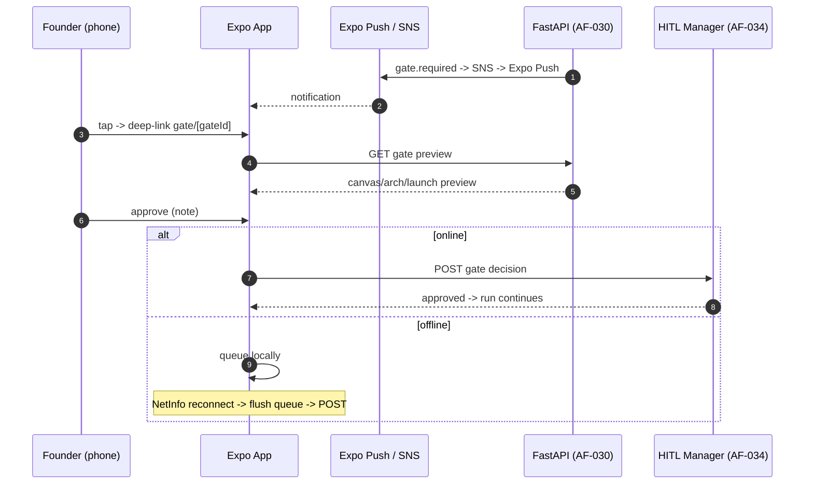

# Mobile Interface Design (Expo React Native): Technical Implementation Plan

> **Owner**: Yogesh Raut
> **Task IDs**: AF-063 → AF-071 (9 tasks)
> **Branches**: `feature/expo-setup`, `feature/push-notifications`, `feature/mobile-*`, `feature/eas-build-pipeline`
> **Status**: 🟢 Start now (build every screen on mock data; swap real API after Phase 3)
> **Date**: 2026-06-04 · **Version**: 1.0.0
> **Depends on**: Phase 1 (done) for setup; AF-030 REST + AF-031 Realtime + AF-017 SNS + AF-034 HITL for live data
> **SLA / Targets**: iOS 16+ / Android 13+ · offline-queued gate approvals · push deep-links
> **Ground truth**: [CLAUDE.md](../CLAUDE.md) §14 · [specs/mobile.md](../specs/mobile.md)

---

## Table of Contents

1. [Objective](#1-objective)
2. [Dependencies](#2-dependencies)
3. [Screen Architecture](#3-screen-architecture)
4. [Workflow Design](#4-workflow-design)
5. [Sub-Screen Recommendations](#5-sub-screen-recommendations)
6. [Libraries & Integrations](#6-libraries--integrations)
7. [Data Models & API Contracts](#7-data-models--api-contracts)
8. [Development Roadmap](#8-development-roadmap)
9. [Testing Strategy](#9-testing-strategy)
10. [Deliverables](#10-deliverables)

---

## 1. Objective

### 1.1 What the Mobile Interface Achieves

The mobile app is the **founder-on-the-go** companion — submit an idea, watch runs progress, and (most importantly) **approve HITL gates from a phone**, even offline. It mirrors the portal's pipeline transparency but optimized for quick approvals and notifications: a push fires when a gate needs the founder, a tap deep-links straight to the approval screen.

**Core mission**: Let a founder approve a Validation, Architecture, or Launch gate in 10 seconds from anywhere — with offline queueing so a tap on the subway syncs the moment connectivity returns.

### 1.2 Specific Outputs Produced (9 tasks)

| AF-ID | Screen / Capability | What it does |
|---|---|---|
| AF-063 | Expo Router scaffold | TS strict + Supabase Auth + secure token storage |
| AF-064 | Push notifications | Expo Push → SNS → realtime; deep-link to gate/run |
| AF-065 | Idea Intake | Text + voice (Expo AV) + file attach |
| AF-066 | Run Dashboard | Live run list, pull-to-refresh, realtime |
| AF-067 | Run Detail | Pillar progress, step log stream, gate banner |
| AF-068 | HITL Gate Approval | Lean Canvas / Architecture / Launch preview; approve/reject w/ note; **offline queue + sync** |
| AF-069 | Artifacts Viewer | Canvas, ERD image, live URL, brand kit, social posts |
| AF-070 | LLMOps Summary | Cost/eval/drift cards; dark/light |
| AF-071 | EAS Build + release | eas.json profiles; App Store + Play submit |

### 1.3 Inputs Received from Upstream

| Source | Data Consumed | Required / Optional | Used For |
|---|---|---|---|
| **Somesh (AF-030 REST)** | runs, gates, artifacts, ideas | **Required** | All data fetching |
| **Somesh (AF-031 Realtime)** | `step_events` channel | **Required** | Live run updates |
| **Asit (AF-017 SNS)** | push topic | **Required (AF-064)** | Gate notifications |
| **Asit (AF-034 HITL manager)** | gate state machine | **Required (AF-068)** | Approve/reject sync |

### 1.4 Outputs Produced for Downstream Consumers

| Consumer | Data Emitted | Format |
|---|---|---|
| **Backend (AF-030/034)** | Idea submissions, gate decisions (incl. offline-synced) | REST POST |
| **Founder** | Mobile portal, push-driven approvals | UI |
| **App stores** | Built binaries via EAS | iOS / Android |

---

## 2. Dependencies

### 2.1 Mandatory Dependencies (Hard Blockers)

| Dependency | Task ID | Owner | Why It's Mandatory | Status |
|---|---|---|---|---|
| Mobile scaffold | AF-006 | Team | `mobile-app/` workspace | ✅ Done |
| REST endpoints | AF-030 | Somesh | Real data | ✅ Done |
| Realtime | AF-031 | Somesh | Live run updates | ✅ Done |
| SNS topic | AF-017 | Asit | Push notifications (AF-064) | 🔴 |
| HITL gate manager | AF-034 | Asit | Gate approval (AF-068) | 🔴 |

### 2.2 Soft Dependencies (Optional but Beneficial)

| Dependency | Task ID | Owner | Fallback If Unavailable |
|---|---|---|---|
| `packages/api-client` | AF-052 | Raunak/shared | Local typed client until generated |
| Gate preview shapes | AF-037–044 | Pillar owners | Build on mock fixtures |
| Supabase Auth | AF-029 | Somesh | Dev mock session |

### 2.3 Fallback Behavior Matrix

```
+----------------------------------+----------------------------------------------+
| Missing Input / Failure          | Fallback Strategy                            |
+----------------------------------+----------------------------------------------+
| AF-030 REST not ready            | Build all screens on MOCK fixtures           |
+----------------------------------+----------------------------------------------+
| AF-031 Realtime not ready        | Poll via React Query; switch to Realtime later|
+----------------------------------+----------------------------------------------+
| AF-017 SNS / push not ready      | In-app polling for pending gates; add push    |
|                                  | when SNS lands                                |
+----------------------------------+----------------------------------------------+
| Offline (no connectivity)        | Queue gate decision locally (expo-secure-     |
|                                  | store / SQLite); sync on reconnect            |
+----------------------------------+----------------------------------------------+
| Auth not ready                   | Dev mock session; secure-store token later    |
+----------------------------------+----------------------------------------------+
```

### 2.4 Dependency Chain Visualization

```
Phase 1 mobile scaffold (done)
   |
   v
AF-063 Expo Router + secure-store Auth  (no backend -- start now)
   |
   v
ALL SCREENS on MOCK DATA (AF-065..AF-070)  +  AF-071 EAS profiles
   |
   |  (when Somesh ships AF-030 REST + AF-031 Realtime + AF-017 SNS + AF-034 HITL)
   v
AF-064 push + live screens + AF-068 offline gate sync
   |
   v
App Store + Google Play (eas submit)
```

---

## 3. Screen Architecture

### 3.1 Design Philosophy

Expo (managed) + **Expo Router** (file-based navigation), TypeScript strict. Shared API client from `packages/api-client`. Auth tokens in `expo-secure-store`. The defining feature is **offline-first gate approval**: a decision made offline is persisted locally and synced on reconnect, so the founder is never blocked by connectivity.

### 3.2 Core Hook (offline-aware gate)

```typescript
// mobile-app/src/hooks/useGate.ts
import { useMutation } from "@tanstack/react-query";
import { queueOffline, flushQueue } from "@/lib/offline-queue";

export function useGate(runId: string, gateId: string) {
  const decide = useMutation({
    mutationFn: (d: GateDecision) => api.decideGate(runId, gateId, d),
    onError: (_e, d) => queueOffline({ runId, gateId, decision: d }), // persist + retry on reconnect
  });
  return { approve: (note?: string) => decide.mutate({ state: "approved", note }),
           reject: (note?: string) => decide.mutate({ state: "rejected", note }) };
}
// NetInfo listener calls flushQueue() when connectivity returns.
```

### 3.3 Internal Screen Architecture (Expo Router)

```
+--------------------------------------------------------------------------+
|                  Expo React Native (Expo Router)                          |
|                                                                          |
|  app/                                                                    |
|   (auth)/login                  -- Supabase Auth + expo-secure-store     |
|   (tabs)/_layout.tsx            -- bottom tabs (Runs, Idea, LLMOps)      |
|     index (runs)                -- AF-066 Run Dashboard                  |
|     idea                        -- AF-065 Idea Intake (text/voice/file)  |
|     llmops                      -- AF-070 LLMOps Summary                 |
|   runs/[id]/                    -- AF-067 Run Detail (step log stream)   |
|   runs/[id]/gate/[gateId]       -- AF-068 Gate Approval (offline queue)  |
|   runs/[id]/artifacts           -- AF-069 Artifacts Viewer              |
|                                                                          |
|  src/  lib/ (api-client, realtime, offline-queue, push)                 |
|        hooks/ (useRun, useGate)  components/ (design system, dark/light) |
|  eas.json  -- AF-071 build profiles (development/preview/production)     |
+--------------------------------------------------------------------------+
```

### 3.4 Screen Responsibilities

| AF-ID | Screen | Key Components | Data Source | Notes |
|---|---|---|---|---|
| AF-063 | Scaffold | tab layout, auth flow | Supabase Auth | tokens in secure-store |
| AF-064 | Push | notification handler, deep-link | Expo Push ← SNS | tap → gate/run |
| AF-065 | Idea Intake | TextInput, VoiceRecorder (Expo AV), FileAttach | `POST /v1/ideas` | multi-modal |
| AF-066 | Run Dashboard | RunCard list, pull-to-refresh | `/v1/runs` + Realtime | status badges + cost |
| AF-067 | Run Detail | PillarProgress, LogStream, GateBanner | Realtime | live stream |
| AF-068 | Gate Approval | CanvasPreview / ArchSummary / LaunchPreview, ApproveReject + note | gate API | **offline queue + sync** |
| AF-069 | Artifacts Viewer | CanvasView, ERDImage, LiveURLBadge, BrandKit, SocialPosts | `/v1/runs/{id}/artifacts` | browse outputs |
| AF-070 | LLMOps Summary | CostCard, EvalCard, DriftCard | `/v1/llmops/cost` | dark/light |
| AF-071 | EAS Build | eas.json profiles | — | App Store + Play submit |

---

## 4. Workflow Design

### 4.1 End-to-End User Flow

```
Step 1: LOGIN -- Supabase Auth; token stored in expo-secure-store
Step 2: SUBMIT IDEA -- AF-065 text/voice/file -> POST /v1/ideas
Step 3: MONITOR -- AF-066 run list (pull-to-refresh + realtime); tap a run
Step 4: WATCH -- AF-067 run detail: pillar progress + live step log + gate banner
Step 5: PUSH -- gate.required -> SNS -> Expo Push -> notification
Step 6: TAP -- deep-link straight to AF-068 gate approval screen
Step 7: DECIDE -- approve/reject with note
        online  -> POST gate decision immediately
        offline -> queue locally (secure-store/SQLite) -> sync on reconnect
Step 8: ARTIFACTS -- AF-069 browse outputs (canvas, ERD, live URL, brand kit)
Step 9: MONITOR COST -- AF-070 LLMOps summary cards
```

### 4.2 Data Flow (Mermaid)



### 4.3 State Management

```
React Query   -- server cache (runs, gates, artifacts)
Realtime      -- step_events per run
offline-queue -- persisted gate decisions (expo-secure-store / SQLite)
NetInfo       -- connectivity listener -> flushQueue() on reconnect
secure-store  -- auth tokens (never AsyncStorage for secrets)
```

---

## 5. Sub-Screen Recommendations

### 5.1 Evaluation Matrix

| Proposed Screen | Recommendation | Rationale |
|---|---|---|
| Idea Intake | ✅ **Screen** (AF-065) | Entry point; voice + file |
| Run Dashboard / Detail | ✅ **Screens** (AF-066/067) | Core monitoring |
| Gate Approval | ✅ **Screen** (AF-068) | The killer mobile use case; offline-first |
| Artifacts Viewer | ✅ **Screen** (AF-069) | Browse outputs |
| LLMOps Summary | ✅ **Screen** (AF-070) | Cost glance |
| Push notifications | ✅ **Capability** (AF-064) | Deep-link to gates |
| Full code review on mobile | ❌ **Web only** | Monaco diff is desktop-grade |
| Admin dashboard on mobile | 🔶 **Phase 3** | Heavy; web-first |

### 5.2 Final Screen Architecture

**Phase 1:** scaffold + 6 screens on mock data + EAS profiles + design system + dark/light.
**Phase 2:** real API + push (AF-064) + offline gate sync (AF-068).
**Phase 3:** widgets, biometric unlock, richer artifact previews.

---

## 6. Libraries & Integrations

### 6.1 Core Stack

| Concern | Choice | Env Variable |
|---|---|---|
| Framework | Expo SDK (managed) + Expo Router | — |
| Language | TypeScript strict | — |
| Auth | Supabase Auth + `ExpoSecureStoreAdapter` | `EXPO_PUBLIC_SUPABASE_URL`, `EXPO_PUBLIC_SUPABASE_ANON_KEY` |
| Secure storage | `expo-secure-store` | — |
| Server cache | React Query | — |
| Realtime | `@supabase/supabase-js` channel | — |
| Push | `expo-notifications` ← SNS | `EXPO_PUBLIC_API_BASE_URL` |
| Audio | `expo-av` (voice record) | — |
| Connectivity | `@react-native-community/netinfo` | — |
| Build/Submit | EAS Build + Submit | — |

### 6.2 Core Libraries

| Library | Purpose |
|---|---|
| expo-router | File-based navigation |
| expo-secure-store | Auth token storage |
| expo-notifications | Push + deep-link |
| expo-av | Voice recording (idea intake) |
| @tanstack/react-query | Server cache |
| @react-native-community/netinfo | Offline detection |

### 6.3 External Service Rate Limits & Fallbacks

| Service | Limit | Timeout | Retry | Fallback |
|---|---|---|---|---|
| FastAPI (AF-030) | per backend | 15 s | React Query retry | Offline queue |
| Supabase Realtime | connection | — | auto-reconnect | Poll |
| Expo Push / SNS | plan | — | retry | In-app polling for gates |
| EAS Build | plan | — | re-run | Local build |

### 6.4 Data & Storage (device-side)

| Store | Usage |
|---|---|
| React Query cache | Server data |
| expo-secure-store | Auth tokens + offline gate queue (encrypted) |
| SQLite (optional) | Larger offline queue / cached artifacts |
| Realtime | step_events per run |

---

## 7. Data Models & API Contracts

```typescript
// mobile-app/src/types.ts  (shared from packages/api-client when generated)
export interface RunSummary { runId: string; pillar: number; status: string; costTokens: number; }
export interface Gate {
  id: string; runId: string;
  kind: "validation"|"architecture"|"infra_spend"|"launch_control";
  state: "pending"|"approved"|"rejected"; preview: GatePreview;
}
export interface GateDecision { state: "approved"|"rejected"; note?: string; }
export interface QueuedDecision { runId: string; gateId: string; decision: GateDecision; queuedAt: string; }
export interface PushPayload { type: "gate_required"|"run_complete"; runId: string; gateId?: string; }
```

(Mirrors the AF-030 REST + AF-034 HITL + AF-017 SNS contracts; consumed from `packages/api-client`.)

---

## 8. Development Roadmap

### Phase 1 — MVP (Weeks 1–3, no backend needed)

| Week | Task | Deliverable | Status |
|---|---|---|---|
| 1 | AF-063 Expo Router + Supabase Auth + secure-store | `mobile-app/` | 🟢 Start now |
| 1 | Design system + dark/light + navigation | `components/` | 🟢 Start now |
| 1 | AF-071 EAS build profiles (dev/preview/prod) | `eas.json` | 🟢 Start now |
| 2 | AF-065/066/067 Idea Intake + Run Dashboard + Detail (mock) | screens | 🟢 Start now |
| 2 | AF-068 Gate Approval UI + **offline queue logic** (mock) | screen + `offline-queue.ts` | 🟢 Start now |
| 3 | AF-069/070 Artifacts Viewer + LLMOps Summary (mock) | screens | 🟢 Start now |

### Phase 2 — Real Integration (Weeks 4–6)

| Task | Deliverable |
|---|---|
| Wire screens to AF-030 REST + AF-031 Realtime | live data |
| AF-064 push notifications (Expo Push ← SNS) + deep-link | gate alerts |
| AF-068 offline gate sync against AF-034 | reconnect flush |

### Phase 3 (Weeks 7–10)
Biometric unlock; home-screen widgets; richer artifact previews; mobile admin (light).

---

## 9. Testing Strategy

### 9.1 Testing Without the Backend
MSW for REST; mock Supabase Realtime; mock Expo Push payloads; mock NetInfo to simulate offline/online; static fixtures per gate preview.

### 9.2 Test Architecture

```
mobile-app/tests/
├── unit/
│   ├── useGate.test.ts               # online vs offline decision
│   ├── offline-queue.test.ts         # persist + flush on reconnect
│   └── components.test.tsx           # design system
├── integration/
│   ├── idea-intake.test.tsx          # text/voice/file -> POST
│   ├── gate-approval.test.tsx        # approve with note
│   └── run-detail.test.tsx           # realtime log stream
└── e2e/ (Maestro / Detox)
    ├── full-run.flow.yaml            # idea -> gate -> approve (mock)
    └── offline-gate.flow.yaml        # offline approve -> reconnect sync
```

### 9.3 Sample Data / Fixtures

| Fixture | Screen |
|---|---|
| `mock_runs.json` | Run Dashboard |
| `mock_gate_validation.json` | Gate Approval (canvas preview) |
| `mock_gate_launch.json` | Gate Approval (launch preview) |
| `mock_artifacts.json` | Artifacts Viewer |
| `mock_push_gate.json` | Push deep-link |

### 9.4 Test Execution Commands

```bash
pnpm --filter @autofounder-ai/mobile-app dev      # Expo dev server
pnpm --filter @autofounder-ai/mobile-app test     # Jest unit/integration
eas build --profile preview --platform all        # preview build
eas submit --platform ios                         # store submit (Phase 2+)
```

### 9.5 Key Test Scenarios

| # | Scenario | Type | Pass Criteria |
|---|---|---|---|
| T1 | Submit idea (text) → POST | Integration | request fired; navigates to run |
| T2 | Voice record → attach | Integration | audio captured; uploads |
| T3 | Gate approve online | Integration | POST decision; run continues |
| T4 | Gate approve **offline → sync** | Unit | queued; flushed on reconnect |
| T5 | Push tap → deep-link gate | Integration | opens correct gate screen |
| T6 | Run detail live log stream | Integration | step_events render |
| T7 | Empty state "No data yet" | Unit | no fake data |
| T8 | Dark/light follows system | Unit | theme switches |
| T9 | Token stored in secure-store | Unit | never AsyncStorage for secrets |

---

## 10. Deliverables

### 10.1 File Structure

```
mobile-app/
├── app/  (auth)/login (tabs)/{index,idea,llmops}
│         runs/[id]/index runs/[id]/gate/[gateId] runs/[id]/artifacts
├── src/
│   ├── lib/    api-client.ts realtime.ts offline-queue.ts push.ts
│   ├── hooks/  useRun.ts useGate.ts
│   ├── components/  (design system, dark/light)
│   └── types.ts
├── eas.json    # dev / preview / production profiles
├── app.json    # Expo config
└── tests/      unit/ integration/ e2e/
```

### 10.2 Environment Variables (`.env.example`)

```bash
# --- Mobile (Expo) ----------------------------------------------------------
EXPO_PUBLIC_SUPABASE_URL=
EXPO_PUBLIC_SUPABASE_ANON_KEY=
EXPO_PUBLIC_API_BASE_URL=
```

### 10.3 Screen Inventory

| Route | Screen | AF-ID |
|---|---|---|
| `/(auth)/login` | Login | AF-063 |
| `/(tabs)/idea` | Idea Intake | AF-065 |
| `/(tabs)/index` | Run Dashboard | AF-066 |
| `/runs/[id]` | Run Detail | AF-067 |
| `/runs/[id]/gate/[gateId]` | Gate Approval | AF-068 |
| `/runs/[id]/artifacts` | Artifacts Viewer | AF-069 |
| `/(tabs)/llmops` | LLMOps Summary | AF-070 |

### 10.4 Core Libraries / Modules

| Element | Detail |
|---|---|
| `lib/api-client.ts` | Shared typed REST client (from `packages/api-client`) |
| `lib/realtime.ts` | Supabase Realtime channel |
| `lib/offline-queue.ts` | Persisted gate decisions + flush on reconnect |
| `lib/push.ts` | Expo Push registration + deep-link handler |

### 10.5 Mobile Analytics / Crash Reporting (not Prometheus)

| Signal | Tool | Description |
|---|---|---|
| Crashes | Sentry (Expo) | Crash + error capture |
| Usage | PostHog / Amplitude | Screen + approval funnels |
| Push delivery | Expo Push receipts | Notification delivery rate |
| Performance | Expo dev tools | Render timing |

### 10.6 Events Consumed (from backend)

| Event | Source | Used By |
|---|---|---|
| `gate.required` | EventBridge → SNS → Expo Push | Push → AF-068 deep-link |
| `step_events` (Realtime) | AF-031 | Run Detail log stream |
| `pillar.completed{N}` | EventBridge | Run progress |

### 10.7 Data Contract Consumed (REST/Realtime/SNS)

The app consumes **AF-030 REST + AF-031 Realtime + AF-017 SNS + AF-034 HITL** (see §7), shared via `packages/api-client`. Offline gate decisions reconcile against the AF-034 gate state machine on sync.

### 10.8 Immediate Action Items (🟢 Start Today — zero backend needed)

| # | Task | Priority | Est. | Output |
|---|---|---|---|---|
| 1 | AF-063 Expo Router + Supabase Auth + secure-store | P0 | 5 hrs | `mobile-app/` |
| 2 | Design system + dark/light + navigation | P0 | 6 hrs | `components/` |
| 3 | AF-071 EAS build profiles | P0 | 2 hrs | `eas.json` |
| 4 | All 6 screens on mock data | P0 | 16 hrs | screens |
| 5 | **Offline gate queue logic** (persist + flush) | P0 | 4 hrs | `lib/offline-queue.ts` |
| 6 | Mock fixtures + Jest/Maestro tests | P1 | 5 hrs | `tests/` |
| 7 | **Agree REST + Realtime + SNS + HITL contract with Asit** | P0 | 1 hr | shared contract |

**Build every screen on mock data now → add push (AF-064) + offline sync (AF-068) when Somesh's AF-030/031 land and Asit's AF-017/034 land.**

---

## Appendix A: Key Decisions Log

| # | Decision | Choice | Rationale |
|---|---|---|---|
| D1 | Build strategy | Mock data first, real API later | Don't block on backend |
| D2 | Navigation | Expo Router (file-based) | CLAUDE.md / specs/mobile.md |
| D3 | Token storage | expo-secure-store, never AsyncStorage | Security |
| D4 | Gate approval | Offline-first queue + sync | Founder approves anywhere |
| D5 | Code review on mobile | Web only | Monaco diff is desktop-grade |

## Appendix B: Risk Register

| Risk | Probability | Impact | Mitigation |
|---|---|---|---|
| Offline sync conflicts | Medium | Medium | Reconcile against AF-034 gate state; last-writer with server authority |
| Push not delivered | Medium | Medium | In-app polling fallback; Expo receipts |
| Backend contract churn | Medium | Medium | Build on agreed mock shapes; `packages/api-client` |
| Secrets in insecure storage | Low | High | expo-secure-store only |
| EAS build/store rejection | Low | Medium | Preview profile testing; follow store guidelines |

## Appendix C: Coordination Checklist

| Who | What | When | Status |
|---|---|---|---|
| **Somesh/Asit (Platform)** | Agree REST (AF-030) + Realtime (AF-031) + SNS (AF-017) + HITL (AF-034) contracts | When they land | ⬜ Pending |
| **Raunak (Web)** | Share `packages/api-client` + design system patterns | Ongoing | ⬜ Pending |
| **Somesh / Kaushlendra / Pallavi** | Gate preview shapes (validation / architecture / launch) | When mock ready | ⬜ Pending |
| **Purnima (P7)** | LLMOps Summary data shape (AF-070) | When mock ready | ⬜ Pending |

---

*Auto-Founder AI — Mobile Interface Design Technical Plan v1.0.0 | June 2026*
*Owner: Yogesh Raut | Ground truth: CLAUDE.md §14 + specs/mobile.md | Reviewed by: [Pending team review]*
