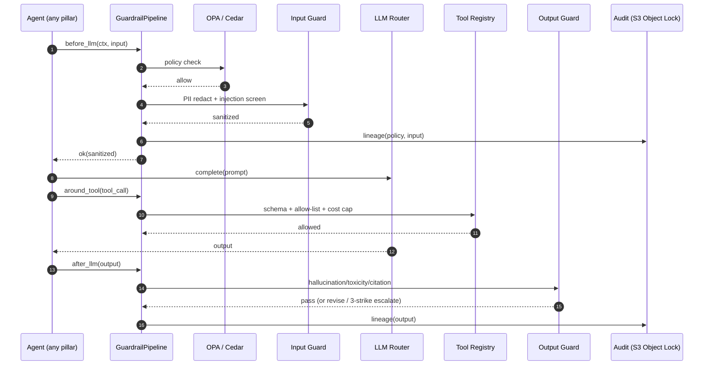

# Guardrails & Governance Pipeline (AF-046): Technical Implementation Plan

> **Owner**: Asit Piri (Purnima co-owns the Output + Monitoring stages)
> **Task ID**: AF-046 · **Branch**: `feat/platform/guardrails-tool-registry` (off `dev`)
> **Status**: ✅ **Delivered (MVP) 2026-06-09** by Vishal (exec for Asit) — all 6 stages + audit/lineage + pipeline wrapper built with the plan's graceful fallbacks (regex PII, heuristic injection, lexicon toxicity, inline OPA); additively wired into `BaseAgent` (opt-in). Verified green: ruff + mypy (210 files) + full pytest (369 passed, +127 new). **Phase-2 follow-up:** swap fallbacks for the real services (Presidio, Llama Guard, TruLens, Evidently, OPA sidecar) + deploy the S3 Object-Lock audit bucket.
> **Date**: 2026-06-04 · **Version**: 1.0.0
> **Depends on**: AF-028 (FastAPI), AF-027 (UDAL), AF-036 (BaseAgent)
> **Scope note**: Reassigned to Asit 2026-06-04 (was unassigned, Part D gap C). **Wraps every agent invocation.**
> **Ground truth**: [CLAUDE.md](../CLAUDE.md) §34 (6-stage pipeline) · §16 (security) · §35 (compliance)

---

## Table of Contents

1. [Objective](#1-objective)
2. [Dependencies](#2-dependencies)
3. [Component Architecture](#3-component-architecture)
4. [Workflow Design](#4-workflow-design)
5. [Sub-Component Recommendations](#5-sub-component-recommendations)
6. [Tools & Integrations](#6-tools--integrations)
7. [Data Models](#7-data-models)
8. [Development Roadmap](#8-development-roadmap)
9. [Testing Strategy](#9-testing-strategy)
10. [Deliverables](#10-deliverables)

---

## 1. Objective

### 1.1 What the Guardrails Pipeline Achieves

The Guardrails pipeline is the **safety membrane** that wraps **every** agent invocation across all 7 pillars. It is a **6-stage pipeline** plus a cross-cutting audit/lineage layer: Policy & Rules → Input → Instruction → Execution → Output → Monitoring, with an immutable Audit & Lineage trail. Nothing reaches an LLM or a tool without passing the relevant gates, and nothing leaves an agent without an output check.

**Core mission**: Make the autonomous system *safe by construction* — block prompt injection, redact PII, enforce policy/cost/tool allow-lists, catch hallucinations and toxicity, detect drift/abuse, and keep an immutable audit trail for compliance (GDPR / SOC 2 / ISO 27001 / HIPAA-ready).

### 1.2 Specific Outputs Produced

| Output Category | Deliverable | Volume |
|---|---|---|
| **Stage 1 — Policy** | OPA/Cedar policy decisions (allow/deny) | per call |
| **Stage 2 — Input** | PII-redacted, injection-screened input | per call |
| **Stage 3 — Instruction** | Validated system prompt / constraints | per call |
| **Stage 4 — Execution** | Tool-call allow-list + schema + cost-cap verdicts | per tool call |
| **Stage 5 — Output** | Hallucination/toxicity/citation verdict | per output |
| **Stage 6 — Monitoring** | Drift / anomaly / abuse signals | continuous |
| **Audit & Lineage** | Immutable audit record → S3 Object Lock | per call |

### 1.3 Inputs Received from Upstream

| Source | Data Consumed | Required / Optional | Used For |
|---|---|---|---|
| **Somesh (FastAPI AF-028)** | Request + `OrgContext` (JWT claims) | **Required** | Policy decisions, tenant scoping |
| **Every agent (P1–P7)** | Pre-LLM input, tool calls, outputs | **Required** | The thing being guarded |
| **Architect (P2)** | FeatureList | Optional | Output citation/feature cross-ref (Marketing) |

### 1.4 Outputs Produced for Downstream Consumers

| Consumer | Data Emitted | Format |
|---|---|---|
| **Every agent** | Pass/block verdict + sanitized payload | in-process middleware return |
| **Audit & Lineage** | Immutable record (who/what/when/decision) | S3 Object Lock |
| **LLMOps (P7)** | Drift / abuse signals for the weekly cycle | Kafka telemetry |
| **Security on-call** | SEV-1 on policy/isolation violations | PagerDuty / Slack |

---

## 2. Dependencies

### 2.1 Mandatory Dependencies (Hard Blockers)

| Dependency | Task ID | Owner | Why It's Mandatory | Status |
|---|---|---|---|---|
| FastAPI app | AF-028 | Somesh | Middleware mount point | ✅ Done |
| UDAL | AF-027 | Somesh | Tenant context + lineage emit | ✅ Done |
| BaseAgent | AF-036 | Asit | Wraps the agent lifecycle | ✅ Done |
| S3 Object Lock bucket | AF-016 | Asit | Immutable audit store | ✅ Terraform shipped (deploy + wire = Phase-2 follow-up) |

### 2.2 Soft Dependencies (Optional but Beneficial)

| Dependency | Task ID | Owner | Fallback If Unavailable |
|---|---|---|---|
| OPA sidecar | AF-029 | Somesh | Inline Python policy checks until OPA lands |
| Tool Registry | AF-047 | Asit | Execution guard reads static allow-list |
| LangSmith | AF-024 | Purnima | Local output-eval store |
| FeatureList | AF-040 | Kaushlendra | Skip Marketing feature cross-ref |

### 2.3 Fallback Behavior Matrix

```
+----------------------------------+----------------------------------------------+
| Failure / Missing                | Fallback Strategy                            |
+----------------------------------+----------------------------------------------+
| OPA sidecar unavailable          | Inline Python RBAC/ABAC checks; log degraded |
+----------------------------------+----------------------------------------------+
| Presidio / PII model down        | Regex PII redaction fallback; flag low-conf  |
+----------------------------------+----------------------------------------------+
| Llama Guard unavailable          | Heuristic injection classifier + block on    |
|                                  | high-risk patterns                           |
+----------------------------------+----------------------------------------------+
| Output check (TruLens) down      | Citation/groundedness check still runs;      |
|                                  | toxicity via lexicon fallback                |
+----------------------------------+----------------------------------------------+
| Tenant isolation breach detected | HARD FAIL -- SEV-1, page security, block      |
+----------------------------------+----------------------------------------------+
| 3 output-guardrail strikes       | Escalate run to human (per CLAUDE.md §23)     |
+----------------------------------+----------------------------------------------+
| Audit write fails                | Block the action -- no un-audited agent calls |
+----------------------------------+----------------------------------------------+
```

### 2.4 Dependency Chain Visualization

```
Somesh's AF-028 FastAPI + AF-027 UDAL + Asit's AF-036 BaseAgent + AF-016 S3 Object Lock
   |
   v
+------------------------------------------------+
|  AF-046 Guardrails Pipeline (Asit; Purnima     |
|  co-owns Output + Monitoring stages)           |
|  Policy -> Input -> Instruction -> Execution   |
|  -> Output -> Monitoring (+ Audit & Lineage)   |
+------------------------------------------------+
   |  wraps EVERY agent call
   v
ALL agents (P1..P7) + Tool Registry (AF-047)
```

---

## 3. Component Architecture

### 3.1 Design Philosophy

A **middleware chain** invoked around every agent step and every tool call — not an agent. Each stage is an independent, testable validator with a uniform `GuardResult` contract. The chain is composable: input stages run before the LLM, execution stages wrap tool calls, output stages run after generation, and audit runs on every decision. Stages fail **closed** (deny on error) for security-critical checks (Policy, Input injection, tenant isolation) and **open-with-flag** for quality checks where a hard block would be worse than a warning.

### 3.2 Pipeline Entry (the wrapper every agent gets)

```python
# backend/app/guardrails/pipeline.py
from app.guardrails.stages import (policy, input_guard, instruction_guard,
                                    execution_guard, output_guard, monitoring)
from app.guardrails.audit import emit_lineage

class GuardrailPipeline:
    """Wraps every BaseAgent invocation. Fail-closed on security stages."""

    async def before_llm(self, ctx, payload) -> "GuardResult":
        for stage in (policy.check, input_guard.check, instruction_guard.check):
            res = await stage(ctx, payload)
            await emit_lineage(ctx, stage.__name__, res)
            if res.blocked:
                return res        # fail closed
        return GuardResult.ok(payload)

    async def around_tool(self, ctx, tool_call) -> "GuardResult":
        res = await execution_guard.check(ctx, tool_call)   # schema + allow-list + cost cap
        await emit_lineage(ctx, "execution", res)
        return res

    async def after_llm(self, ctx, output) -> "GuardResult":
        res = await output_guard.check(ctx, output)          # hallucination/toxicity/citation
        await monitoring.observe(ctx, output, res)           # drift/anomaly
        await emit_lineage(ctx, "output", res)
        return res
```

### 3.3 Internal Component Architecture

```
+--------------------------------------------------------------------------+
|                  GUARDRAILS PIPELINE (wraps every agent call)            |
|                                                                          |
|  BEFORE LLM                                                              |
|   +-----------------+   +-----------------+   +--------------------+      |
|   | 1 Policy & Rules|-->| 2 Input Guard   |-->| 3 Instruction Guard|      |
|   | OPA / Cedar     |   | Presidio (PII) +|   | static prompt      |      |
|   | RBAC/ABAC       |   | Llama Guard +   |   | constraint         |      |
|   |                 |   | Prompt Armor    |   | validators         |      |
|   +-----------------+   +-----------------+   +--------------------+      |
|         (fail closed on policy / injection / tenant breach)             |
|                              |                                           |
|  AROUND TOOL CALLS           v                                           |
|   +--------------------------------------+                               |
|   | 4 Execution Guard                    |                               |
|   | tool schema + allow-list + cost cap  |  (Tool Registry AF-047)      |
|   +--------------------------------------+                               |
|                              |                                           |
|  AFTER LLM                   v                                           |
|   +-----------------+   +--------------------+                           |
|   | 5 Output Guard  |-->| 6 Monitoring Guard |   (Purnima co-owns 5+6)  |
|   | TruLens +       |   | Evidently + PostHog|                           |
|   | citation-check +|   | drift/anomaly/abuse|                           |
|   | Llama Guard tox |   |                    |                           |
|   +-----------------+   +--------------------+                           |
|                              |                                           |
|  CROSS-CUTTING               v                                           |
|   +--------------------------------------+                               |
|   | Audit & Lineage -> S3 Object Lock    |  (immutable, 7-yr)           |
|   +--------------------------------------+                               |
+--------------------------------------------------------------------------+
```

### 3.4 Stage Responsibilities

| # | Stage | Enforces | Tooling | Fail mode | Owner |
|---|---|---|---|---|---|
| 1 | Policy & Rules | Permission, usage, access control | OPA / Cedar | closed | Asit |
| 2 | Input Guard | PII redaction, injection detection, content filter | Presidio, Llama Guard, Prompt Armor | closed | Asit |
| 3 | Instruction Guard | System-prompt + constraint validation | static validators | closed | Asit |
| 4 | Execution Guard | Tool schema, allow-list, cost caps | custom middleware on Tool Registry | closed | Asit |
| 5 | Output Guard | Hallucination, toxicity, citation/groundedness | TruLens, Llama Guard, citation-check | open + flag (3 strikes → escalate) | Asit + **Purnima** |
| 6 | Monitoring Guard | Drift, anomaly, abuse | Evidently AI, PostHog | open + alert | Asit + **Purnima** |
| ⌀ | Audit & Lineage | Traceability, immutable history | S3 Object Lock | closed (no un-audited calls) | Asit |

---

## 4. Workflow Design

### 4.1 End-to-End Guard Flow (per agent step)

```
Step 1: REQUEST -- agent step starts; OrgContext resolved from JWT
Step 2: POLICY (stage 1) -- OPA decides allow/deny (RBAC/ABAC); deny -> block + SEV note
Step 3: INPUT (stage 2) -- redact PII, run injection classifier; high-risk -> block
Step 4: INSTRUCTION (stage 3) -- validate system prompt + constraints
Step 5: LLM CALL -- proceeds only if stages 1-3 pass
Step 6: TOOL CALL (stage 4, per call) -- schema + allow-list + cost cap; violation -> block
Step 7: OUTPUT (stage 5) -- hallucination/toxicity/citation; fail -> ask agent to revise
        (3 strikes -> escalate to human)
Step 8: MONITORING (stage 6) -- drift/anomaly/abuse signals -> LLMOps + alerts
Step 9: AUDIT -- every decision written immutably to S3 Object Lock (block if write fails)
```

### 4.2 Sequence (Mermaid)



### 4.3 Data Passed Between Stages

```
OrgContext{organization_id, role, scopes}
   -> stage1 policy -> PolicyDecision(allow/deny)
   -> stage2 input  -> SanitizedInput(pii_redacted, injection_score)
   -> stage3 instruction -> ValidatedPrompt
   -> [LLM]
   -> stage4 execution (per tool) -> ToolVerdict(schema_ok, allowed, within_cost_cap)
   -> stage5 output -> OutputVerdict(hallucination, toxicity, cited)
   -> stage6 monitoring -> DriftSignal, AnomalySignal
   -> audit -> immutable LineageRecord -> S3 Object Lock
```

---

## 5. Sub-Component Recommendations

### 5.1 Evaluation Matrix

| Proposed Piece | Recommendation | Rationale |
|---|---|---|
| Policy engine | ✅ **Stage 1** (OPA/Cedar) | Policy-as-code, externalized |
| PII redaction | ✅ **Stage 2** (Presidio) | Before any LLM sees the text |
| Injection classifier | ✅ **Stage 2** (Llama Guard / Prompt Armor) | Prompt-injection defense |
| Prompt validators | ✅ **Stage 3** (static) | Cheap, deterministic |
| Tool allow-list + cost cap | ✅ **Stage 4** | On the Tool Registry router |
| Hallucination/citation | ✅ **Stage 5** (Purnima co-owns) | Output groundedness |
| Drift/abuse | ✅ **Stage 6** (Purnima co-owns) | Feeds LLMOps |
| Audit/lineage | ✅ **Cross-cutting** | Immutable, compliance |
| Standalone "Guardrails Agent" | ❌ **Middleware, not an agent** | Must wrap calls, not be one |

### 5.2 Final Component Architecture

**Phase 1:** all 6 stages + audit as middleware; fail-closed on security stages.
**Phase 2:** OPA sidecar, Evidently drift dashboards, abuse-rate limiting.
**Phase 3:** policy authoring UI, per-tenant policy packs, red-team test suite.

---

## 6. Tools & Integrations

### 6.1 Per-Stage Tool Registry

| Stage | Tool | Service | Purpose | Env Variable |
|---|---|---|---|---|
| Policy | OPA / Cedar | sidecar | RBAC/ABAC decisions | `OPA_URL` |
| Input | Presidio | local | PII detection/redaction | — |
| Input | Llama Guard 3 | local/hosted | Injection + safety classifier | `LLAMA_GUARD_ENDPOINT` |
| Input | Prompt Armor | API | Injection defense | `PROMPT_ARMOR_KEY` |
| Execution | Tool Registry | in-process | Schema + allow-list + cost cap | — |
| Output | TruLens | local | Groundedness/quality | — |
| Output | citation-check | local | Source attribution | — |
| Monitoring | Evidently AI | local | Drift detection | — |
| Monitoring | PostHog | hosted | Abuse/anomaly analytics | `POSTHOG_KEY` |
| Audit | S3 Object Lock | AWS | Immutable audit trail | `AWS_S3_AUDIT_BUCKET` |

### 6.2 LLM Requirements

| Stage | Model | Reason | Est. Tokens/Call |
|---|---|---|---|
| Input (injection) | Llama Guard 3 | Safety classifier | ~1,000 in / ~50 out |
| Output (hallucination) | Gemini 3.5 Flash (LLM-as-judge) | Groundedness scoring | ~3,000 in / ~300 out |

### 6.3 External Service Rate Limits & Fallbacks

| Service | Limit | Timeout | Retry | Fallback |
|---|---|---|---|---|
| OPA | local | 100 ms | 1 | Inline Python policy |
| Presidio | local | 2 s | 1 | Regex PII redaction |
| Llama Guard | hosted | 5 s | 2 | Heuristic injection rules |
| Prompt Armor | API | 5 s | 2 | Llama Guard only |
| TruLens | local | 5 s | 1 | citation-check only |
| S3 Object Lock | quota | 10 s | 3 | **block action** (no un-audited calls) |

### 6.4 Database & Storage Requirements

| Store | Usage | Path / Key |
|---|---|---|
| S3 Object Lock | Immutable audit/lineage records (7-yr) | `s3://{audit-bucket}/{organization_id}/lineage/` |
| PostgreSQL | policy decisions cache, strike counters | `platform.guardrail_events` |
| Redis | per-tenant cost accumulator, abuse counters | `guard:cost:{org}`, `guard:strikes:{run}` |

---

## 7. Data Models

```python
from enum import StrEnum

class GuardStage(StrEnum):
    POLICY="policy"; INPUT="input"; INSTRUCTION="instruction"
    EXECUTION="execution"; OUTPUT="output"; MONITORING="monitoring"

class GuardResult(BaseModel):
    stage: GuardStage
    blocked: bool = False
    reason: str | None = None
    severity: str = "INFO"           # INFO | WARN | CRITICAL
    sanitized_payload: dict | None = None
    flags: list[str] = []

    @classmethod
    def ok(cls, payload): return cls(stage=GuardStage.INPUT, sanitized_payload=payload)

class LineageRecord(BaseModel):
    organization_id: str; run_id: str; agent_id: str
    stage: GuardStage; decision: str   # allow | deny | flag
    detail: dict; ts: str              # written immutably to S3 Object Lock
```

---

## 8. Development Roadmap

### Phase 1 — MVP (Weeks 1–3)

| Week | Task | Deliverable | Status |
|---|---|---|---|
| 1 | `GuardResult` contract + 6 stage stubs + audit emitter | `guardrails/` | 🟢 Start now |
| 1 | Input guard (Presidio + regex fallback + injection rules) | `stages/input_guard.py` | 🟢 Start now |
| 1 | Output guard (citation-check + toxicity lexicon) | `stages/output_guard.py` | 🟢 Start now (Purnima) |
| 2 | Pipeline wrapper wired into BaseAgent | `pipeline.py` | ✅ Done (additive opt-in wiring) |
| 2 | Execution guard on Tool Registry (schema + cost cap) | `stages/execution_guard.py` | 🟡 Needs AF-047 |
| 3 | Audit & Lineage → S3 Object Lock; policy stage (inline) | `audit.py`, `stages/policy.py` | 🟡 Needs AF-016 |

### Phase 2 (Weeks 4–6)
OPA sidecar; Evidently drift; abuse rate-limiting; LangSmith output eval; per-tenant cost caps with circuit breakers.

### Phase 3 (Weeks 7–10)
Per-tenant policy packs; policy authoring UI; automated red-team/jailbreak test suite; fairness audits.

---

## 9. Testing Strategy

### 9.1 Testing Without the Full Platform
Each stage is a pure function testable in isolation. Mock OPA (allow/deny fixtures), mock Presidio with known-PII strings, injection corpus, hallucination/grounded output pairs, mock S3.

### 9.2 Test Architecture

```
tests/unit/guardrails/
├── test_policy.py             # allow/deny RBAC/ABAC
├── test_input_pii.py          # PII redaction (emails, tokens, names)
├── test_input_injection.py    # known prompt-injection corpus blocked
├── test_execution_cost_cap.py # over-cap tool call blocked
├── test_output_citation.py    # uncited claim flagged
├── test_output_strikes.py     # 3 strikes -> escalate
└── test_audit_immutable.py    # audit-write failure blocks action
tests/integration/guardrails/
├── test_pipeline_before_llm.py
├── test_pipeline_around_tool.py
└── test_tenant_isolation_breach.py   # SEV-1 path
```

### 9.3 Sample Data / Fixtures

| Fixture | Purpose |
|---|---|
| `injection_corpus.json` | Known jailbreak/injection prompts (must block) |
| `pii_samples.json` | Emails/tokens/names (must redact) |
| `grounded_pairs.json` | Output + source (cited vs uncited) |
| `policy_cases.json` | Role × resource → allow/deny |

### 9.4 Test Execution Commands

```bash
cd backend && uv run pytest tests/unit/guardrails/ -v
cd backend && uv run pytest tests/integration/guardrails/ -v
```

### 9.5 Key Test Scenarios

| # | Scenario | Type | Pass Criteria |
|---|---|---|---|
| T1 | Prompt injection blocked | Unit | input guard blocks; audited |
| T2 | PII redacted before LLM | Unit | no raw PII reaches LLM |
| T3 | Policy deny | Unit | blocked + CRITICAL severity |
| T4 | Tool over cost cap | Unit | execution guard blocks |
| T5 | Uncited claim flagged | Unit | output flagged |
| T6 | 3 output strikes → escalate | Integration | run escalated to human |
| T7 | Tenant isolation breach | Integration | SEV-1; security paged; blocked |
| T8 | Audit write fails → block | Unit | no un-audited agent call proceeds |

---

## 10. Deliverables

### 10.1 File Structure

```
backend/app/guardrails/
├── __init__.py
├── pipeline.py                 # before_llm / around_tool / after_llm wrapper
├── schema.py                   # GuardResult, LineageRecord, GuardStage
├── audit.py                    # emit_lineage -> S3 Object Lock
├── stages/
│   ├── policy.py               # OPA/Cedar (inline fallback)
│   ├── input_guard.py          # Presidio + Llama Guard + Prompt Armor
│   ├── instruction_guard.py    # static prompt validators
│   ├── execution_guard.py      # tool schema + allow-list + cost cap
│   ├── output_guard.py         # TruLens + citation + toxicity (Purnima)
│   └── monitoring.py           # Evidently + PostHog (Purnima)
└── policies/                   # OPA rego / Cedar policy files
tests/ unit/guardrails/ integration/guardrails/ fixtures/
```

### 10.2 Environment Variables (`.env.example`)

```bash
# --- Guardrails (AF-046) ----------------------------------------------------
OPA_URL=
LLAMA_GUARD_ENDPOINT=
PROMPT_ARMOR_KEY=
POSTHOG_KEY=
AWS_S3_AUDIT_BUCKET=
```

### 10.3 Policy / Validator Inventory

| Element | Detail |
|---|---|
| `policies/*.rego` | OPA policies: per-tenant access, tool scopes, spend limits |
| Input validators | PII (Presidio), injection (Llama Guard), content filter |
| Output validators | citation-check, toxicity, feature cross-ref (Marketing) |

### 10.4 Tool Registry Entries (AF-047)

| Tool | Scope | Auth | Cost | Rate Limit |
|---|---|---|---|---|
| `opa_decide` | Guardrails | sidecar | Free | local |
| `presidio_redact` | Guardrails | none | Free | local |
| `llama_guard_classify` | Guardrails | API/local | Low | hosted |
| `trulens_eval` | Guardrails | none | Free | local |

### 10.5 Prometheus Metrics

| Metric | Type | Labels | Description |
|---|---|---|---|
| `guardrail_blocks_total` | Counter | stage, severity | Blocked calls per stage |
| `guardrail_pii_redactions_total` | Counter | tenant | PII redactions |
| `guardrail_injection_blocked_total` | Counter | tenant | Injection attempts blocked |
| `guardrail_output_strikes_total` | Counter | run | Output revisions |
| `guardrail_tenant_breach_total` | Counter | — | Isolation breaches (must stay 0) |
| `guardrail_audit_write_failures_total` | Counter | — | Audit failures (must stay 0) |

### 10.6 Kafka / EventBridge Events Emitted

| Event | Bus | Payload |
|---|---|---|
| `guardrail.blocked` | Kafka (telemetry) | `{ run_id, stage, reason, severity }` |
| `guardrail.tenant_breach` | EventBridge → PagerDuty | `{ run_id, organization_id }` (SEV-1) |
| `guardrail.output_escalate` | EventBridge → UI | `{ run_id, strikes }` |
| `guardrail.drift_signal` | Kafka → LLMOps | `{ agent, drift_score }` |

### 10.7 Output Contract (middleware return)

The pipeline's "contract" is the `GuardResult` returned to every agent at `before_llm` / `around_tool` / `after_llm` (§3.2, §7). Security stages **fail closed** (`blocked=True` on error); quality stages **fail open with flags**. Every decision produces an immutable `LineageRecord`.

### 10.8 Immediate Action Items (🟢 Start Today)

| # | Task | Priority | Est. | Output |
|---|---|---|---|---|
| 1 | `GuardResult` + `LineageRecord` schemas | P0 | 2 hrs | `schema.py` |
| 2 | Input guard (Presidio + regex + injection corpus) | P0 | 5 hrs | `stages/input_guard.py` |
| 3 | Output guard (citation + toxicity) — **Purnima** | P0 | 4 hrs | `stages/output_guard.py` |
| 4 | Execution guard (schema + cost cap, pure) | P1 | 3 hrs | `stages/execution_guard.py` |
| 5 | Injection + PII + policy fixtures | P1 | 3 hrs | `tests/fixtures/` |
| 6 | Unit tests per stage | P1 | 5 hrs | `tests/unit/guardrails/` |

**Total offline work ~22 hrs — stages are pure functions, testable before the pipeline wires into BaseAgent.**

---

## Appendix A: Key Decisions Log

| # | Decision | Choice | Rationale |
|---|---|---|---|
| D1 | Middleware vs agent | Middleware chain | Must wrap every call, not be one |
| D2 | Fail mode | Closed on security, open+flag on quality | Block injection; don't over-block quality |
| D3 | Audit | Immutable S3 Object Lock; block if write fails | No un-audited agent calls |
| D4 | Co-ownership | Purnima owns Output + Monitoring | Overlaps LLMOps drift/eval |
| D5 | Policy | OPA/Cedar externalized | Policy-as-code |

## Appendix B: Risk Register

| Risk | Probability | Impact | Mitigation |
|---|---|---|---|
| Prompt injection bypasses guard | Medium | Critical | Layered Llama Guard + Prompt Armor + heuristics; red-team suite (Phase 3) |
| PII leaks to LLM/logs | Medium | Critical | Presidio + regex fallback; never log raw payloads |
| Over-blocking hurts UX | Medium | Medium | Quality stages fail open with flags, not hard blocks |
| Tenant isolation breach | Low | Critical | UDAL guard + SEV-1 path; blocked + paged |
| **Asit overload (owns this + 33 other tasks)** | High | High | Purnima co-owns Output + Monitoring; consider delegating more |
| Audit store outage | Low | High | Block actions rather than proceed un-audited |

## Appendix C: Coordination Checklist

| Who | What | When | Status |
|---|---|---|---|
| **Purnima (P7)** | Co-own Output (TruLens/citation) + Monitoring (Evidently/drift) stages | Immediately | ⬜ Pending |
| **Asit (self)** | Mount pipeline into FastAPI (AF-028) + BaseAgent (AF-036) + Tool Registry (AF-047) | When those land | ⬜ Pending |
| **Kaushlendra (P2)** | FeatureList for Marketing output cross-ref | When available | ⬜ Pending |
| **All pillar owners** | Confirm their agents call the pipeline (no bypass) | When agents wire | ⬜ Pending |

---

*Auto-Founder AI — Guardrails & Governance Pipeline Technical Plan v1.0.0 | June 2026*
*Owner: Asit Piri (Purnima co-owns Output + Monitoring) | Ground truth: CLAUDE.md §34/§16/§35 | Reviewed by: [Pending team review]*
