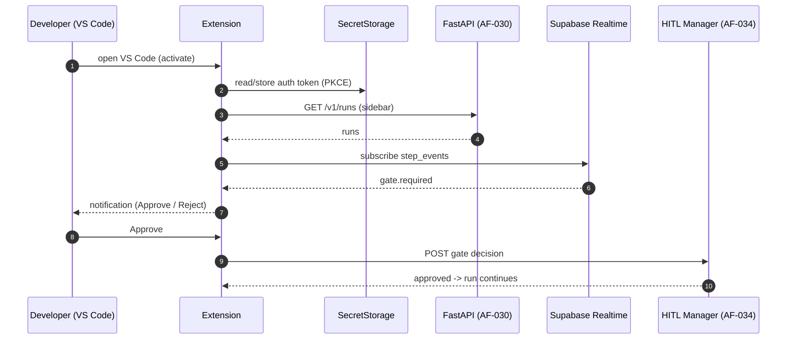

# VS Code Extension (In-IDE AI Co-Founder): Technical Implementation Plan

> **Owner**: Asit Piri (delegate to Raunak — TS/UI overlap — if overloaded)
> **Task IDs**: AF-072 → AF-078 (entire Phase 6, 7 tasks)
> **Branches**: `feature/vscode-extension-core`, `feature/vscode-sidebar`, `feature/vscode-gate-notifications`, `feature/vscode-code-gen`, `feature/vscode-streaming-panel`, `feature/vscode-artifact-viewer`, `feature/vscode-publish`
> **Status**: 🟢 AF-072 startable now; rest depend on Phase 3
> **Date**: 2026-06-04 · **Version**: 1.0.0
> **Depends on**: Phase 1 (done) for AF-072; AF-030 REST + AF-031 Realtime + AF-034 HITL + AF-041 Coder for the rest
> **Scope note**: Reassigned to Asit 2026-06-04 (was unassigned, Part D gap A).
> **Ground truth**: [CLAUDE.md](../CLAUDE.md) §12/§14 · [task_assigned.md](../task_assigned.md) Phase 6 · [specs/api-design.md](../specs/api-design.md)

---

## Table of Contents

1. [Objective](#1-objective)
2. [Dependencies](#2-dependencies)
3. [Component Architecture](#3-component-architecture)
4. [Workflow Design](#4-workflow-design)
5. [Sub-Component Recommendations](#5-sub-component-recommendations)
6. [Libraries & Integrations](#6-libraries--integrations)
7. [Data Models & API Contracts](#7-data-models--api-contracts)
8. [Development Roadmap](#8-development-roadmap)
9. [Testing Strategy](#9-testing-strategy)
10. [Deliverables](#10-deliverables)

---

## 1. Objective

### 1.1 What the VS Code Extension Achieves

The extension brings AutoFounder AI **into the developer's IDE** — monitor runs, approve HITL gates, generate code, and open artifacts without leaving VS Code. It's the third client surface (alongside Web and Mobile), aimed at the developer/AI-Researcher persona who lives in the editor.

**Core mission**: Let a founder-developer watch a run's live token stream, approve a gate from a notification, and run `AutoFounder: Generate Component` straight into a new editor tab — all in-IDE.

### 1.2 Specific Outputs Produced (7 tasks)

| AF-ID | Capability | What it does |
|---|---|---|
| AF-072 | Extension core | Activation, command palette, `ExtensionContext` lifecycle, Supabase Auth PKCE → `SecretStorage` |
| AF-073 | Sidebar tree view | Run list with status icons, pillar progress, live cost badge |
| AF-074 | Gate notifications | VS Code banner on `gate.required`; inline approve/reject |
| AF-075 | Code-gen commands | `Generate Component`, `Generate API Endpoint` → Coder Agent → editor tab |
| AF-076 | Streaming panel | `WebviewPanel` rendering live agent step log stream |
| AF-077 | Artifact quick-open | `Open Lean Canvas / ERD / OpenAPI spec` → preview in editor |
| AF-078 | Marketplace packaging | `vsce package` / `vsce publish` in GitHub Actions; auto-bump |

### 1.3 Inputs Received from Upstream

| Source | Data Consumed | Required / Optional | Used For |
|---|---|---|---|
| **Somesh (AF-030 REST)** | runs, gates, artifacts | **Required** | Sidebar, artifacts, code-gen |
| **Somesh (AF-031 Realtime)** | `step_events` channel | **Required** | Streaming panel, sidebar refresh |
| **Asit (AF-034 HITL)** | gate state machine | **Required (AF-074)** | Gate approve/reject |
| **Kartik (AF-041 Coder)** | Coder Agent endpoint | **Required (AF-075)** | Code-gen commands |

### 1.4 Outputs Produced for Downstream Consumers

| Consumer | Data Emitted | Format |
|---|---|---|
| **Backend (AF-030/034)** | Gate decisions, code-gen requests | REST POST |
| **Developer** | In-IDE run monitoring + generated code | VS Code UI |
| **VS Code Marketplace** | Published `.vsix` | extension package |

---

## 2. Dependencies

### 2.1 Mandatory Dependencies (Hard Blockers)

| Dependency | Task ID | Owner | Why It's Mandatory | Status |
|---|---|---|---|---|
| Extension scaffold | AF-007 | Team | `vscode-extension/` workspace | ✅ Done |
| REST endpoints | AF-030 | Somesh | Run/artifact/gate data | ✅ Done |
| Realtime | AF-031 | Somesh | Sidebar + streaming panel | ✅ Done |
| HITL gate manager | AF-034 | Asit | Gate notifications (AF-074) | 🔴 |
| Coder Agent | AF-041 | Kartik | Code-gen commands (AF-075) | 🔴 |

### 2.2 Soft Dependencies (Optional but Beneficial)

| Dependency | Task ID | Owner | Fallback If Unavailable |
|---|---|---|---|
| `packages/api-client` | AF-052 | Raunak/shared | Local typed client until generated |
| Web design conventions | AF-051+ | Raunak | Reuse Founder Portal UX patterns |
| Supabase Auth | AF-029 | Somesh | Dev mock token in SecretStorage |

### 2.3 Fallback Behavior Matrix

```
+----------------------------------+----------------------------------------------+
| Failure / Missing                | Fallback Strategy                            |
+----------------------------------+----------------------------------------------+
| AF-030 REST not ready            | Build core (AF-072) + UI shells on mock data |
+----------------------------------+----------------------------------------------+
| AF-031 Realtime not ready        | Poll REST on interval; switch to Realtime    |
+----------------------------------+----------------------------------------------+
| AF-034 HITL not ready            | Render gate banners from mock; POST later    |
+----------------------------------+----------------------------------------------+
| AF-041 Coder not ready           | Code-gen command stubs return a placeholder  |
+----------------------------------+----------------------------------------------+
| Auth (PKCE) not ready            | Dev mock token in SecretStorage              |
+----------------------------------+----------------------------------------------+
```

### 2.4 Dependency Chain Visualization

```
Phase 1 vscode-extension scaffold (done)
   |
   v
AF-072 Extension core (Auth PKCE + SecretStorage)  -- start now (no backend)
   |
   |  (needs Somesh's AF-030 REST + AF-031 Realtime + Asit's AF-034 HITL + Kartik's AF-041 Coder)
   v
AF-073 Sidebar -> AF-074 Gate notifications -> AF-075 Code-gen
AF-076 Streaming panel -> AF-077 Artifact quick-open
   |
   v
AF-078 Marketplace publish (vsce in GitHub Actions)
```

---

## 3. Component Architecture

### 3.1 Design Philosophy

A standard VS Code extension (TypeScript) using the VS Code API: a `TreeDataProvider` for the sidebar, `WebviewPanel` for the live stream, `window.showInformationMessage` for gate banners, and command palette commands for code-gen. Auth tokens live in `SecretStorage` (never settings). All backend access goes through one typed client; Realtime via a single Supabase channel manager.

### 3.2 Activation Core (AF-072)

```typescript
// vscode-extension/src/extension.ts
import * as vscode from "vscode";
import { AuthManager } from "./auth";          // Supabase PKCE -> SecretStorage
import { RunTreeProvider } from "./sidebar";    // AF-073
import { registerGateNotifications } from "./gates";   // AF-074
import { registerCodeGen } from "./codegen";    // AF-075
import { StreamPanel } from "./stream";         // AF-076
import { registerArtifacts } from "./artifacts";// AF-077

export async function activate(ctx: vscode.ExtensionContext) {
  const auth = new AuthManager(ctx.secrets);    // tokens in SecretStorage
  const api = createApiClient(auth);
  const tree = new RunTreeProvider(api);
  vscode.window.registerTreeDataProvider("autofounder.runs", tree);
  registerGateNotifications(ctx, api);
  registerCodeGen(ctx, api);
  registerArtifacts(ctx, api);
  ctx.subscriptions.push(
    vscode.commands.registerCommand("autofounder.openStream", (runId) =>
      StreamPanel.show(ctx, api, runId)),
  );
}
export function deactivate() {}
```

### 3.3 Internal Component Architecture

```
+--------------------------------------------------------------------------+
|                  VS Code Extension (TypeScript)                           |
|                                                                          |
|  activate() -- AF-072 core                                              |
|   +-----------------+                                                    |
|   | AuthManager     |  Supabase PKCE -> ctx.secrets (SecretStorage)     |
|   +--------+--------+                                                    |
|            v                                                            |
|   +-----------------+   +--------------------+                          |
|   | api-client      |   | realtime manager   |  (Supabase channel)     |
|   +--------+--------+   +---------+----------+                          |
|            |                      |                                     |
|   +--------+----------+----------+--------------------+                 |
|   v        v          v          v                    v                 |
| Sidebar  Gate       Code-gen   Streaming           Artifact            |
| TreeView Notif.     commands   WebviewPanel        quick-open          |
| (AF-073) (AF-074)   (AF-075)   (AF-076)            (AF-077)            |
|                                                                        |
|  AF-078 publish -- vsce package/publish in GitHub Actions             |
+--------------------------------------------------------------------------+
```

### 3.4 Component Responsibilities

| AF-ID | Component | VS Code API | Data Source | Notes |
|---|---|---|---|---|
| AF-072 | Activation core | `ExtensionContext`, commands | — | Auth PKCE → SecretStorage |
| AF-073 | Sidebar | `TreeDataProvider` | REST + Realtime | status icons, cost badge |
| AF-074 | Gate notifications | `window.showInformationMessage` | AF-034 | inline approve/reject buttons |
| AF-075 | Code-gen | command palette | AF-041 | streams into new editor tab |
| AF-076 | Streaming panel | `WebviewPanel` | Realtime | live step log |
| AF-077 | Artifact quick-open | `workspace.openTextDocument` | REST artifacts | canvas/ERD/OpenAPI preview |
| AF-078 | Publish | GitHub Actions + `vsce` | — | auto-bump version |

---

## 4. Workflow Design

### 4.1 End-to-End User Flow

```
Step 1: ACTIVATE -- extension loads; AuthManager runs Supabase PKCE; token -> SecretStorage
Step 2: SIDEBAR -- TreeView lists runs (status icons, pillar progress, cost badge); Realtime refresh
Step 3: STREAM -- click a run -> WebviewPanel opens live step_events log
Step 4: GATE -- gate.required -> VS Code banner with Approve / Reject buttons
Step 5: DECIDE -- click Approve -> POST gate decision (AF-034)
Step 6: CODE-GEN -- run "AutoFounder: Generate Component" -> Coder Agent -> tokens stream into new tab
Step 7: ARTIFACTS -- "AutoFounder: Open ERD" -> fetch artifact -> preview in editor
Step 8: PUBLISH -- merge to main -> GitHub Actions vsce publish (auto-bump)
```

### 4.2 Sequence (Mermaid)



### 4.3 Data Flow

```
AuthManager -> token (SecretStorage)
api-client -> GET /v1/runs, /v1/runs/{id}/artifacts ; POST gate decisions, code-gen
realtime manager -> step_events -> { sidebar refresh, WebviewPanel append }
gate.required event -> notification -> POST /v1/runs/{id}/gates/{gate_id}
```

---

## 5. Sub-Component Recommendations

### 5.1 Evaluation Matrix

| Proposed Piece | Recommendation | Rationale |
|---|---|---|
| Activation core | ✅ **AF-072** | Required foundation; no backend dep |
| Sidebar TreeView | ✅ **AF-073** | Native VS Code pattern |
| Gate notifications | ✅ **AF-074** | The killer in-IDE use case |
| Code-gen commands | ✅ **AF-075** | Developer value |
| Streaming panel | ✅ **AF-076** | WebviewPanel |
| Artifact quick-open | ✅ **AF-077** | Preview in editor |
| Full code review in-IDE | 🔶 **Reuse VS Code native diff** | Don't rebuild Monaco |
| Inline completions (Copilot-style) | 🔶 **Phase 3** | Heavy; separate effort |

### 5.2 Final Component Architecture

**Phase 1:** AF-072 core + UI shells (sidebar/stream/gate) on mock data.
**Phase 2:** wire AF-073–077 to real REST/Realtime/HITL/Coder; AF-078 publish.
**Phase 3:** inline completions, multi-root workspace support, settings sync.

---

## 6. Libraries & Integrations

### 6.1 Core Stack

| Concern | Choice | Notes |
|---|---|---|
| Language | TypeScript (strict) | `engines.vscode ^1.85.0` |
| Extension API | VS Code API | TreeView, WebviewPanel, commands, notifications |
| Auth | Supabase Auth PKCE | token in `SecretStorage` |
| Realtime | `@supabase/supabase-js` | step_events channel |
| Packaging | `@vscode/vsce` | package + publish |
| Tests | `@vscode/test-electron` / Mocha | extension host tests |

### 6.2 Core Modules

| Module | Purpose |
|---|---|
| `auth.ts` | Supabase PKCE flow + SecretStorage |
| `api-client.ts` | Typed REST client (shared from packages/api-client) |
| `realtime.ts` | Supabase channel manager |
| `sidebar.ts` | TreeDataProvider |
| `stream.ts` | WebviewPanel |

### 6.3 External Service Rate Limits & Fallbacks

| Service | Limit | Timeout | Retry | Fallback |
|---|---|---|---|---|
| FastAPI (AF-030) | per backend | 15 s | retry | Cached tree; error toast |
| Supabase Realtime | connection | — | reconnect | Poll on interval |
| Coder Agent (AF-041) | per backend | 60 s | 1 | Placeholder; surface error |
| vsce publish | Marketplace | — | re-run | Manual publish |

### 6.4 Data & Storage (extension-side)

| Store | Usage |
|---|---|
| `SecretStorage` | Auth token (never settings.json) |
| `workspaceState` / `globalState` | Last-viewed run, UI prefs |
| In-memory | Realtime stream buffer |

---

## 7. Data Models & API Contracts

```typescript
// vscode-extension/src/types.ts (shared from packages/api-client)
export interface RunSummary { runId: string; pillar: number; status: string; costTokens: number; }
export interface Gate { id: string; runId: string; kind: string; state: "pending"|"approved"|"rejected"; }
export interface Artifact { id: string; runId: string; kind: "lean_canvas"|"erd"|"openapi"|string; uri: string; }
export interface StepEvent { runId: string; pillar: number; agentId: string; message: string; ts: string; }
export interface CodeGenRequest { kind: "component"|"api_endpoint"; spec: string; runId?: string; }
```

(Mirrors the AF-030 REST + AF-031 Realtime + AF-034 HITL contracts.)

---

## 8. Development Roadmap

### Phase 1 — MVP (Weeks 1–3)

| Week | Task | Deliverable | Status |
|---|---|---|---|
| 1 | **AF-072 Extension core** + Auth PKCE + SecretStorage | `extension.ts`, `auth.ts` | 🟢 Start now |
| 1 | UI shells on mock data (sidebar, stream, gate banner) | `sidebar.ts`, `stream.ts` | 🟢 Start now |
| 1 | AF-078 publish pipeline scaffold (vsce in GitHub Actions) | `.github/workflows/vscode-publish.yml` | 🟢 Start now |
| 2 | AF-073 Sidebar + AF-076 Streaming (mock → real) | TreeView, WebviewPanel | 🟡 Needs AF-030/031 |
| 3 | AF-074 Gate notifications + AF-077 Artifact quick-open | gates, artifacts | 🔴 Needs AF-034/030 |
| 3 | AF-075 Code-gen commands | codegen | 🔴 Needs AF-041 |

### Phase 2 (Weeks 4–6)
Wire all to real REST/Realtime/HITL/Coder; AF-078 marketplace publish; error handling + reconnection.

### Phase 3 (Weeks 7–10)
Inline completions; multi-root workspaces; settings sync; richer artifact previews.

---

## 9. Testing Strategy

### 9.1 Testing Without the Backend
`@vscode/test-electron` extension-host tests with a mock API client + mock Realtime; fixtures for runs/gates/artifacts/step_events.

### 9.2 Test Architecture

```
vscode-extension/src/test/
├── unit/
│   ├── auth.test.ts           # PKCE token stored in SecretStorage
│   ├── api-client.test.ts     # request shapes
│   └── sidebar.test.ts        # TreeDataProvider rows
├── integration/
│   ├── gate-notification.test.ts   # gate.required -> banner -> POST
│   ├── stream-panel.test.ts        # step_events render in WebviewPanel
│   └── codegen.test.ts             # command -> editor tab
```

### 9.3 Sample Data / Fixtures

| Fixture | Purpose |
|---|---|
| `mock_runs.json` | Sidebar tree |
| `mock_gate.json` | Gate notification |
| `mock_artifacts.json` | Artifact quick-open |
| `mock_step_events.json` | Streaming panel |

### 9.4 Test Execution Commands

```bash
pnpm --filter @autofounder-ai/vscode-extension test     # extension-host tests
pnpm --filter @autofounder-ai/vscode-extension lint
vsce package                                             # build .vsix
```

### 9.5 Key Test Scenarios

| # | Scenario | Type | Pass Criteria |
|---|---|---|---|
| T1 | Activation registers commands + tree | Unit | commands present; tree shown |
| T2 | Token stored in SecretStorage | Unit | never in settings.json |
| T3 | Sidebar lists runs with status icons | Unit | rows match fixtures |
| T4 | gate.required → banner → POST | Integration | approve posts decision |
| T5 | step_events render in panel | Integration | WebviewPanel appends |
| T6 | Code-gen → new editor tab | Integration | tokens stream into tab |
| T7 | Artifact quick-open previews ERD | Integration | document opens |
| T8 | Realtime reconnect | Integration | resumes after drop |

---

## 10. Deliverables

### 10.1 File Structure

```
vscode-extension/
├── src/
│   ├── extension.ts            # AF-072 activate/deactivate
│   ├── auth.ts                 # Supabase PKCE -> SecretStorage
│   ├── api-client.ts           # typed REST client
│   ├── realtime.ts             # Supabase channel manager
│   ├── sidebar.ts              # AF-073 TreeDataProvider
│   ├── gates.ts                # AF-074 notifications
│   ├── codegen.ts              # AF-075 commands
│   ├── stream.ts               # AF-076 WebviewPanel
│   ├── artifacts.ts            # AF-077 quick-open
│   ├── types.ts
│   └── test/ unit/ integration/
├── package.json                # contributes: commands, views, menus
└── .github/workflows/vscode-publish.yml   # AF-078
```

### 10.2 Environment / Config

```jsonc
// package.json "contributes" (excerpt)
{ "commands": [
    { "command": "autofounder.generateComponent", "title": "AutoFounder: Generate Component" },
    { "command": "autofounder.openERD", "title": "AutoFounder: Open ERD" }
  ],
  "views": { "autofounder": [ { "id": "autofounder.runs", "name": "Runs" } ] }
}
// Settings: autofounder.apiBaseUrl ; token is in SecretStorage (not settings)
```

### 10.3 Command / View Inventory

| Element | AF-ID | Type |
|---|---|---|
| `autofounder.runs` view | AF-073 | TreeView |
| `AutoFounder: Generate Component` / `Generate API Endpoint` | AF-075 | command |
| `AutoFounder: Open Lean Canvas / ERD / OpenAPI spec` | AF-077 | command |
| `autofounder.openStream` | AF-076 | command → WebviewPanel |
| gate banner | AF-074 | notification |

### 10.4 Modules / Libraries

| Module | Detail |
|---|---|
| `auth.ts` | PKCE + SecretStorage |
| `api-client.ts` | from `packages/api-client` |
| `realtime.ts` | Supabase channel |

### 10.5 Telemetry / Quality (not Prometheus)

| Signal | Tool | Description |
|---|---|---|
| Errors | VS Code telemetry / Sentry | Extension errors |
| Usage | command invocation counts | Feature usage |
| Marketplace | install/rating | Adoption |

### 10.6 Events Consumed (from backend)

| Event | Source | Used By |
|---|---|---|
| `gate.required` | EventBridge → SQS → client | AF-074 banner |
| `step_events` (Realtime) | AF-031 | AF-076 stream, AF-073 sidebar |
| `pillar.completed{N}` | EventBridge | AF-073 progress |

### 10.7 Data Contract Consumed

Consumes the **AF-030 REST + AF-031 Realtime + AF-034 HITL** contract (§7), shared via `packages/api-client`. Code-gen calls the Coder Agent (AF-041) endpoint. (AF-030 and AF-031 are ✅ completed by Somesh.)

### 10.8 Immediate Action Items (🟢 Start Today)

| # | Task | Priority | Est. | Output |
|---|---|---|---|---|
| 1 | **AF-072 Extension core** + activation + commands | P0 | 5 hrs | `extension.ts` |
| 2 | Auth PKCE → SecretStorage | P0 | 4 hrs | `auth.ts` |
| 3 | Sidebar + Streaming UI shells on mock data | P0 | 6 hrs | `sidebar.ts`, `stream.ts` |
| 4 | AF-078 publish workflow scaffold | P1 | 2 hrs | `.github/workflows/vscode-publish.yml` |
| 5 | Mock fixtures + extension-host tests | P1 | 4 hrs | `src/test/` |
| 6 | **Agree REST/Realtime/HITL/Coder contracts with Asit + Kartik** | P0 | 1 hr | shared contract |

---

## Appendix A: Key Decisions Log

| # | Decision | Choice | Rationale |
|---|---|---|---|
| D1 | Token storage | SecretStorage, never settings | Security |
| D2 | UI primitives | Native VS Code (TreeView/WebviewPanel) | Don't rebuild Monaco |
| D3 | Build strategy | Core + UI shells on mock first | AF-072 needs no backend |
| D4 | Shared client | `packages/api-client` | DRY with Web/Mobile |
| D5 | Delegation | Raunak candidate (TS/UI overlap) | Asit overloaded |

## Appendix B: Risk Register

| Risk | Probability | Impact | Mitigation |
|---|---|---|---|
| **Asit overload (owns this + 33 other tasks)** | High | High | Delegate entire extension to Raunak (TS/UI overlap) |
| Backend contract churn | Medium | Medium | Build on mock; `packages/api-client` |
| Realtime reconnection in IDE | Medium | Medium | Reconnect + poll fallback |
| Token leakage | Low | High | SecretStorage only |
| Marketplace publish failures | Low | Low | CI re-run; manual publish |

## Appendix C: Coordination Checklist

| Who | What | When | Status |
|---|---|---|---|
| **Asit (self / delegate)** | Decide keep vs delegate to Raunak; provide REST/Realtime/HITL | Immediately | ⬜ Pending |
| **Kartik (P3)** | Coder Agent endpoint for code-gen (AF-075) | When AF-041 lands | ⬜ Pending |
| **Raunak (Web)** | Share `packages/api-client` + UX patterns | Ongoing | ⬜ Pending |

---

*Auto-Founder AI — VS Code Extension Technical Plan v1.0.0 | June 2026*
*Owner: Asit Piri (delegate candidate: Raunak) | Ground truth: CLAUDE.md §12/§14 + task_assigned.md Phase 6 | Reviewed by: [Pending team review]*
