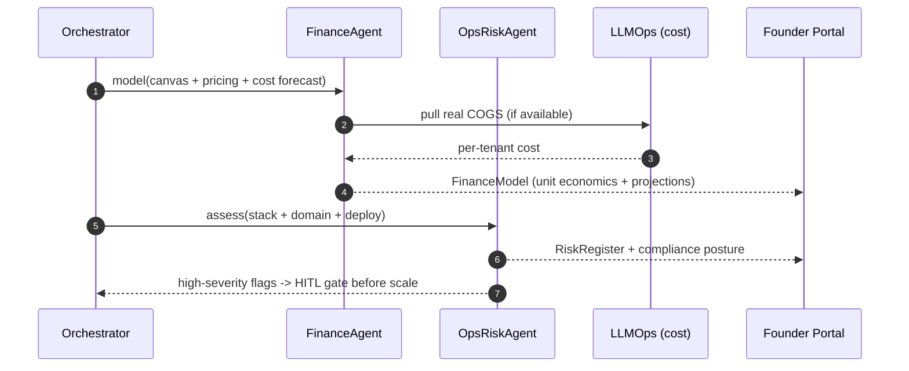

# Finance & Ops/Risk Agents (Cross-Cutting): Technical Implementation Plan

> **Owner**: Asit Piri (owner of record; design deferred to Phase 4)
> **Task IDs**: none yet (canonical roster CLAUDE.md §7.1 — to be AF-numbered when Phase 4 opens)
> **Branches**: `feature/finance-agent`, `feature/ops-risk-agent` (proposed)
> **Status**: 🔵 Deferred (Phase 4 — Enterprise Scale); owner recorded now per Part D gap E
> **Date**: 2026-06-04 · **Version**: 1.0.0 (forward-looking)
> **Depends on**: AF-036 (BaseAgent), AF-027 (UDAL), and Pillars 1–7 producing data to reason over
> **Scope note**: Reassigned to Asit 2026-06-04 (was unassigned, Part D gap E). This is a **design-ahead** plan, not Phase 1 work.
> **Ground truth**: [CLAUDE.md](../CLAUDE.md) §7.1 (roster) · §45 (Phase 4) · §38 (cost)

---

## Table of Contents

1. [Objective](#1-objective)
2. [Dependencies](#2-dependencies)
3. [Agent Architecture](#3-agent-architecture)
4. [Workflow Design](#4-workflow-design)
5. [Sub-Agent Recommendations](#5-sub-agent-recommendations)
6. [Tools & Integrations](#6-tools--integrations)
7. [Data Models](#7-data-models)
8. [Development Roadmap](#8-development-roadmap)
9. [Testing Strategy](#9-testing-strategy)
10. [Deliverables](#10-deliverables)

---

## 1. Objective

### 1.1 What These Agents Achieve

Two **cross-cutting** agents from the canonical roster (CLAUDE.md §7.1), needed at **Phase 4 (Enterprise Scale)**:

- **Finance Agent** — financial models, unit economics, projections (CAC/LTV, burn, runway, pricing sensitivity) for the generated startup.
- **Ops & Risk Agent** — risk assessment, compliance posture, operational readiness (regulatory flags, SLA risk, dependency risk).

They are **not** in the linear 7-pillar build path; they attach as advisory agents the orchestrator can invoke after validation (Pillar 1) and architecture (Pillar 2), and continuously during Pillar 7 (LLMOps/FinOps).

**Core mission**: Give the founder a financial and risk lens on the autonomously-built business — so the MVP isn't just buildable, but *viable and compliant*.

### 1.2 Specific Outputs Produced

| Agent | Deliverable |
|---|---|
| **Finance** | Unit economics model (CAC, LTV, payback), 12–36 mo projections, pricing sensitivity, burn/runway |
| **Finance** | Cost-of-goods estimate per generated MVP (ties to LLMOps FinOps) |
| **Ops & Risk** | Risk register (market, technical, regulatory, operational) with severity |
| **Ops & Risk** | Compliance posture flags (GDPR/CCPA/SOC2/HIPAA relevance per domain) |
| **Ops & Risk** | Operational readiness checklist (SLAs, on-call, dependency risk) |

### 1.3 Inputs Received from Upstream

| Source | Data Consumed | Required / Optional | Used For |
|---|---|---|---|
| **Somesh (Pillar 1)** | Lean Canvas, TAM/SAM/SOM, pricing, personas | **Required** | Financial model inputs |
| **Kaushlendra (Pillar 2)** | stack + cost forecast, FeatureList | **Required** | COGS, technical risk |
| **Purnima (Pillar 7)** | per-tenant cost telemetry, drift | **Required (Ops/FinOps)** | Real cost, operational risk |
| **Prasenjit (Pillar 5)** | deploy/uptime data | Optional | SLA risk |

### 1.4 Outputs Produced for Downstream Consumers

| Consumer | Data Emitted | Format |
|---|---|---|
| **Founder Portal** | Finance dashboard + risk register | REST |
| **LLMOps (Pillar 7)** | COGS reconciliation, cost anomalies | Kafka |
| **HITL gates** | Risk flags that may gate launch/scale | gate metadata |

---

## 2. Dependencies

### 2.1 Mandatory Dependencies (Hard Blockers)

| Dependency | Task ID | Owner | Why It's Mandatory | Status |
|---|---|---|---|---|
| BaseAgent ABC | AF-036 | Asit | Both agents subclass it | ✅ Done |
| UDAL | AF-027 | Somesh | Read pillar outputs + cost data | ✅ Done |
| Pillars 1–2 outputs | AF-037–040 | Somesh/Kaushlendra | Inputs to model | 🟡 Partial — AF-037/038/039 done; AF-040 pending |
| LLMOps cost telemetry | AF-045 | Purnima | Real COGS for finance/ops | ❌ Pending (Purnima) |

### 2.2 Soft Dependencies (Optional but Beneficial)

| Dependency | Task ID | Owner | Fallback If Unavailable |
|---|---|---|---|
| AWS Cost Explorer | AF-024 | Asit | Estimate from architecture cost forecast |
| Guardrails | AF-046 | Asit | Local validation of financial claims |
| Feature Store (Feast) | — | Deferred | Compute features ad-hoc |

### 2.3 Fallback Behavior Matrix

```
+----------------------------------+----------------------------------------------+
| Failure / Missing                | Fallback Strategy                            |
+----------------------------------+----------------------------------------------+
| No real cost telemetry (P7)      | Use Architect cost forecast as estimate;      |
|                                  | flag projections as "modeled, not actual"     |
+----------------------------------+----------------------------------------------+
| Pricing/TAM missing (P1)         | Derive from domain benchmarks; lower conf     |
+----------------------------------+----------------------------------------------+
| Regulatory domain unclear        | Conservative posture: flag all plausible      |
|                                  | regimes (GDPR/CCPA/HIPAA) for human review    |
+----------------------------------+----------------------------------------------+
| High risk detected               | Surface as a HITL gate flag before scale      |
+----------------------------------+----------------------------------------------+
```

### 2.4 Dependency Chain Visualization

```
Pillars 1-2 (canvas/pricing/stack/cost) + Pillar 7 (real COGS)
   |
   v
Asit AF-036 BaseAgent + AF-027 UDAL
   |
   v
+------------------------------------------+
|  Finance Agent  ||  Ops & Risk Agent     |  (Phase 4, cross-cutting)
|  unit economics    risk register +       |
|  + projections     compliance posture    |
+------------------------------------------+
   |
   v
Founder Portal (finance dashboard + risk register) ; LLMOps (COGS reconcile)
```

---

## 3. Agent Architecture

### 3.1 Design Philosophy

Two lightweight advisory agents (each a small LangGraph `StateGraph`), invoked by the orchestrator outside the linear pillar chain. They are **read-mostly**: they consume other pillars' outputs + cost telemetry and produce models/registers — they don't mutate the build. Both subclass `BaseAgent`.

### 3.2 Agent Classes

```python
# backend/app/agents/finance/agent.py
from app.agents.base import BaseAgent
from app.agents.finance.schema import FinanceState

class FinanceAgent(BaseAgent[FinanceState, FinanceState]):
    PILLAR = 0  # cross-cutting (not in the 1-7 linear chain)
    AGENT_ID = "finance"
    SLA_SECONDS = 300
    async def understand(self, s): ...   # pull canvas/pricing/cost
    async def plan(self, i): ...         # model -> project -> sensitivity
    async def execute(self, p): ...
    async def verify(self, o): ...       # numbers internally consistent
    async def learn(self, t): ...

# backend/app/agents/ops_risk/agent.py
class OpsRiskAgent(BaseAgent[OpsRiskState, OpsRiskState]):
    PILLAR = 0
    AGENT_ID = "ops_risk"
    SLA_SECONDS = 300
    # understand -> assess risk -> compliance posture -> readiness checklist
```

### 3.3 Internal Node Architecture

```
+--------------------------------------------------------------------------+
|  FINANCE AGENT                          OPS & RISK AGENT                 |
|                                                                          |
|  +-------------------+                  +-----------------------+         |
|  | ingest_inputs     |                  | ingest_inputs         |         |
|  | (canvas/pricing/  |                  | (stack/domain/deploy) |         |
|  |  cost)            |                  +-----------+-----------+         |
|  +---------+---------+                              v                     |
|            v                            +-----------------------+         |
|  +-------------------+                  | assess_risk           |         |
|  | unit_economics    |                  | (market/tech/         |         |
|  | (CAC/LTV/payback) |                  |  regulatory/ops)      |         |
|  +---------+---------+                  +-----------+-----------+         |
|            v                                        v                     |
|  +-------------------+                  +-----------------------+         |
|  | projections       |                  | compliance_posture    |         |
|  | (12-36 mo, burn,  |                  | (GDPR/CCPA/SOC2/HIPAA) |         |
|  |  runway)          |                  +-----------+-----------+         |
|  +---------+---------+                              v                     |
|            v                            +-----------------------+         |
|  +-------------------+                  | readiness_checklist   |         |
|  | sensitivity       |                  | (SLA/on-call/deps)    |         |
|  +---------+---------+                  +-----------+-----------+         |
|            v                                        v                     |
|   FinanceModel -> Portal                RiskRegister -> Portal + gates    |
+--------------------------------------------------------------------------+
```

### 3.4 Node Responsibilities

| Agent | Node | Responsibility | Model | SLA |
|---|---|---|---|---|
| Finance | `ingest_inputs` | Pull canvas/pricing/cost | — | < 15 s |
| Finance | `unit_economics` | CAC/LTV/payback | Gemini 3.5 Flash | < 1 min |
| Finance | `projections` | 12–36 mo, burn, runway | Gemini 3.5 Flash | < 2 min |
| Finance | `sensitivity` | Pricing/assumption sensitivity | Gemini 3.5 Flash | < 1 min |
| Ops/Risk | `assess_risk` | Market/tech/regulatory/ops risk | Gemini 3.5 Flash | < 2 min |
| Ops/Risk | `compliance_posture` | Regime relevance per domain | Gemini 3.5 Flash | < 1 min |
| Ops/Risk | `readiness_checklist` | SLA/on-call/dependency risk | Gemini 3.5 Flash | < 1 min |

---

## 4. Workflow Design

### 4.1 End-to-End Workflow

```
[Finance]
 1: INGEST canvas + pricing tiers + architecture cost forecast (+ real COGS from P7)
 2: UNIT ECONOMICS -- CAC, LTV, payback, contribution margin
 3: PROJECTIONS -- 12-36 month revenue/cost/burn/runway
 4: SENSITIVITY -- vary price/churn/CAC; show ranges
 5: EMIT -- FinanceModel -> Portal; COGS reconcile -> LLMOps

[Ops & Risk]
 1: INGEST stack + domain + deploy/uptime data
 2: ASSESS RISK -- market, technical, regulatory, operational (severity-scored)
 3: COMPLIANCE POSTURE -- flag GDPR/CCPA/SOC2/HIPAA relevance for the domain
 4: READINESS -- SLA targets, on-call, dependency/vendor risk
 5: EMIT -- RiskRegister -> Portal; high-severity -> HITL gate flag before scale
```

### 4.2 Sequence (Mermaid)



### 4.3 Data Passed

```
Finance: canvas + pricing + cost_forecast + real_cogs
   -> unit_economics{cac, ltv, payback, margin}
   -> projections{months[], revenue[], cost[], burn, runway}
   -> sensitivity{scenarios[]}
Ops/Risk: stack + domain + deploy
   -> risk_register[{category, severity, mitigation}]
   -> compliance_posture{regimes[], flags[]}
   -> readiness{sla, on_call, dependency_risk}
```

---

## 5. Sub-Agent Recommendations

### 5.1 Evaluation Matrix

| Proposed Piece | Recommendation | Rationale |
|---|---|---|
| Finance Agent | ✅ **Separate agent** | Distinct cross-cutting concern; reused across runs |
| Ops & Risk Agent | ✅ **Separate agent** | Risk/compliance distinct from finance |
| Pricing optimizer | 🔶 **Phase 4+** | Could merge with Finance sensitivity |
| Continuous FinOps | ✅ **Via Pillar 7** | LLMOps already owns weekly FinOps; Finance reconciles |
| Regulatory auto-evidence | 🔶 **Phase 5 (Pillar 9)** | SOC2 evidence automation is a future pillar |

### 5.2 Final Agent Architecture

**Phase 4:** Finance (4 nodes) + Ops/Risk (3 nodes), advisory, read-mostly.
**Phase 5:** pricing optimization, compliance evidence automation (Pillar 9), scenario simulation.

---

## 6. Tools & Integrations

### 6.1 Per-Node Tool Registry

| Node | Tool | Service | Purpose | Env Variable |
|---|---|---|---|---|
| unit_economics / projections | AWS Cost Explorer | AWS | Real cost basis | `AWS_*` |
| ingest (Finance) | UDAL relational | Supabase | Pull pricing/cost artifacts | `DATABASE_URL` |
| assess_risk | Tavily (optional) | search | Regulatory/market signals | `TAVILY_API_KEY` |
| compliance_posture | (LLM only) | — | Regime relevance reasoning | — |

### 6.2 LLM Requirements

| Node | Model | Reason | Est. Tokens/Call |
|---|---|---|---|
| unit_economics | Gemini 3.5 Flash | Modeling reasoning | ~2,000 in / ~1,000 out |
| projections | Gemini 3.5 Flash | Multi-period projection | ~2,500 in / ~2,000 out |
| assess_risk | Gemini 3.5 Flash | Risk classification | ~3,000 in / ~1,500 out |

### 6.3 External Service Rate Limits & Fallbacks

| Service | Limit | Timeout | Retry | Fallback |
|---|---|---|---|---|
| AWS Cost Explorer | quota | 30 s | 3 | Architect cost forecast |
| Tavily | 60/min | 20 s | 3 | LLM training knowledge |
| Gemini 3.5 Flash | 1,000 RPM | 30 s | 3 | Hard fail → error_handler |

### 6.4 Database & Storage Requirements

| Store | Usage | Path / Key |
|---|---|---|
| PostgreSQL (UDAL) | finance models, risk registers | `tenant_uuid.artifacts` |
| S3 | model spreadsheets / risk PDF | `s3://.../{org}/{run}/finance/`, `/risk/` |

---

## 7. Data Models

```python
class UnitEconomics(BaseModel):
    cac: float; ltv: float; payback_months: float; contribution_margin: float

class FinanceModel(BaseModel):
    run_id: UUID; organization_id: str
    unit_economics: UnitEconomics
    projection_months: list[int]
    revenue: list[float]; cost: list[float]
    burn_monthly: float; runway_months: float
    cogs_per_mvp_inr: float           # ties to CLAUDE.md COGS < Rs 500
    scenarios: list[dict] = []

class RiskItem(BaseModel):
    category: str                     # market | technical | regulatory | operational
    description: str
    severity: str                     # LOW | MEDIUM | HIGH | CRITICAL
    mitigation: str

class OpsRiskOutput(BaseModel):
    run_id: UUID; organization_id: str
    risk_register: list[RiskItem]
    compliance_regimes: list[str]     # GDPR | CCPA | SOC2 | HIPAA | ...
    readiness: dict                   # {sla, on_call, dependency_risk}
    blocks_scale: bool = False        # high-severity -> HITL gate
```

---

## 8. Development Roadmap

> **All Phase 4 — design-ahead only; no Phase 1 implementation.**

### Phase 4 — Build (when Enterprise Scale opens)

| Step | Task | Deliverable |
|---|---|---|
| 1 | AF-number the two agents; create branches | task_assigned.md update |
| 2 | Schemas + prompts (unit economics, projections, risk, compliance) | `schema.py`, `prompts/*.j2` |
| 3 | FinanceAgent + OpsRiskAgent graphs wired to BaseAgent | `agent.py`, `graph.py` |
| 4 | Wire to Pillar 1/2 outputs + Pillar 7 cost telemetry | UDAL reads |
| 5 | Founder Portal finance dashboard + risk register surfaces | (Raunak) |

### Phase 5 additions
Pricing optimization; compliance evidence automation (Pillar 9); scenario simulation; multi-currency.

### What can start today (offline, low effort)
- Draft the FinanceModel + OpsRiskOutput schemas.
- Draft prompt templates for unit economics + risk classification.
- Collect domain → regulatory-regime mapping reference.

---

## 9. Testing Strategy

### 9.1 Testing Without the Full Platform
Mock UDAL, `FakeLLM` (pre-built model/risk JSON), mock Cost Explorer, mock BaseAgent. Deterministic finance math is unit-testable.

### 9.2 Test Architecture

```
tests/
├── unit/agents/finance/
│   ├── test_unit_economics.py        # CAC/LTV/payback math
│   ├── test_projections.py           # burn/runway consistency
│   └── test_schema.py
├── unit/agents/ops_risk/
│   ├── test_risk_severity.py         # severity classification
│   └── test_compliance_mapping.py    # domain -> regimes
└── integration/
    └── test_finance_uses_real_cogs.py  # pulls P7 cost, falls back to forecast
```

### 9.3 Sample Data / Fixtures

| Fixture | Purpose |
|---|---|
| `saas_pricing.json` | Pricing tiers for unit economics |
| `healthcare_domain.json` | Should flag HIPAA |
| `eu_domain.json` | Should flag GDPR |
| `cost_telemetry.json` | Real COGS from P7 |

### 9.4 Test Execution Commands

```bash
cd backend && uv run pytest tests/unit/agents/finance/ tests/unit/agents/ops_risk/ -v
cd backend && uv run pytest tests/integration/ -v -k finance
```

### 9.5 Key Test Scenarios

| # | Scenario | Type | Pass Criteria |
|---|---|---|---|
| T1 | CAC/LTV/payback math | Unit | numbers internally consistent |
| T2 | Burn/runway consistency | Unit | runway = cash / burn |
| T3 | Healthcare domain → HIPAA flag | Unit | regime flagged |
| T4 | EU domain → GDPR flag | Unit | regime flagged |
| T5 | Finance uses real COGS when available | Integration | falls back to forecast otherwise |
| T6 | High-severity risk → blocks_scale | Unit | HITL gate flag set |

---

## 10. Deliverables

### 10.1 File Structure (Phase 4)

```
backend/app/agents/finance/
├── agent.py  graph.py  schema.py
├── nodes/ (ingest_inputs, unit_economics, projections, sensitivity)
└── prompts/ (*.j2)
backend/app/agents/ops_risk/
├── agent.py  graph.py  schema.py
├── nodes/ (ingest_inputs, assess_risk, compliance_posture, readiness_checklist)
└── prompts/ (*.j2)
```

### 10.2 Environment Variables (`.env.example`)

```bash
# --- Finance & Ops/Risk (Phase 4) -------------------------------------------
# AWS creds (Cost Explorer) + TAVILY_API_KEY already defined; no new secrets required.
```

### 10.3 Prompt Registry Entries (AF-048, Phase 4)

| Template | Version | Model |
|---|---|---|
| `finance/unit_economics` | 1.0.0 | Gemini 3.5 Flash |
| `finance/projections` | 1.0.0 | Gemini 3.5 Flash |
| `ops_risk/assess_risk` | 1.0.0 | Gemini 3.5 Flash |
| `ops_risk/compliance_posture` | 1.0.0 | Gemini 3.5 Flash |

### 10.4 Tool Registry Entries (AF-047)

| Tool | Scope | Auth | Cost | Rate Limit |
|---|---|---|---|---|
| `aws_cost_explorer` | Finance + LLMOps + DevOps | IAM | Free | quota |
| `tavily_search` | Ops/Risk (regulatory) | API Key | Low | 60/min |

### 10.5 Prometheus Metrics

| Metric | Type | Labels | Description |
|---|---|---|---|
| `finance_cogs_per_mvp_inr` | Histogram | tenant | COGS vs < Rs 500 target |
| `finance_projection_runway_months` | Histogram | tenant | Runway distribution |
| `ops_risk_findings_total` | Counter | category, severity | Risk findings |
| `ops_risk_blocks_scale_total` | Counter | — | High-severity scale blocks |

### 10.6 Kafka / EventBridge Events Emitted

| Event | Bus | Payload |
|---|---|---|
| `finance.model_ready` | Kafka | `{ run_id, cogs_per_mvp_inr, runway_months }` |
| `ops_risk.register_ready` | Kafka | `{ run_id, high_severity_count }` |
| `ops_risk.blocks_scale` | EventBridge → UI | `{ run_id, reasons }` |

### 10.7 Output Contracts (protobuf, Phase 4)

```protobuf
syntax = "proto3";
package autofounder.finance.v1;
message FinanceOutput {
  string run_id = 1; string organization_id = 2;
  double cac = 3; double ltv = 4; double payback_months = 5;
  double burn_monthly = 6; double runway_months = 7; double cogs_per_mvp_inr = 8;
}
message OpsRiskOutput {
  string run_id = 1; string organization_id = 2;
  int32 high_severity_count = 3; repeated string compliance_regimes = 4;
  bool blocks_scale = 5;
}
```

### 10.8 Immediate Action Items (🟢 Optional offline prep — Phase 4 is deferred)

| # | Task | Priority | Est. | Output |
|---|---|---|---|---|
| 1 | Draft FinanceModel + OpsRiskOutput schemas | P2 | 2 hrs | `schema.py` (draft) |
| 2 | Draft prompts (unit economics, risk, compliance) | P2 | 3 hrs | `prompts/*.j2` (draft) |
| 3 | Domain → regulatory-regime mapping reference | P2 | 2 hrs | `reference/regimes.md` |
| 4 | AF-number these agents when Phase 4 opens | P3 | 0.5 hr | task_assigned.md |

**Note: this is design-ahead. No Phase 1 build work — owner recorded so the gap is closed.**

---

## Appendix A: Key Decisions Log

| # | Decision | Choice | Rationale |
|---|---|---|---|
| D1 | Phase | Defer to Phase 4 | Not in linear 7-pillar MVP path |
| D2 | Two agents | Finance + Ops/Risk separate | Distinct concerns |
| D3 | Read-mostly | Advisory, don't mutate build | Safety; cross-cutting |
| D4 | FinOps overlap | LLMOps (P7) owns weekly FinOps; Finance reconciles | Avoid duplication |
| D5 | Owner | Asit (of record), design deferred | Closes Part D gap E |

## Appendix B: Risk Register

| Risk | Probability | Impact | Mitigation |
|---|---|---|---|
| Misleading financial projections | Medium | High | Flag "modeled, not actual"; sensitivity ranges; human review |
| Missed regulatory regime | Medium | High | Conservative posture — flag all plausible regimes for review |
| Scope creep into Pillar 9 (compliance automation) | Medium | Medium | Keep Phase 4 advisory; defer evidence automation to Phase 5 |
| **Asit overload (owner of record + 33 tasks)** | High | Medium | Design-ahead only; reassign at Phase 4 if needed |

## Appendix C: Coordination Checklist

| Who | What | When | Status |
|---|---|---|---|
| **Somesh (P1)** | Pricing + TAM + canvas inputs for finance model | Phase 4 | ⬜ Pending |
| **Kaushlendra (P2)** | Stack + cost forecast for COGS + technical risk | Phase 4 | ⬜ Pending |
| **Purnima (P7)** | Real cost telemetry for finance/ops reconciliation | Phase 4 | ⬜ Pending |
| **Raunak (Web)** | Finance dashboard + risk register surfaces | Phase 4 | ⬜ Pending |
| **Asit (self)** | AF-number agents + decide keep vs delegate at Phase 4 | Phase 4 kickoff | ⬜ Pending |

---

*Auto-Founder AI — Finance & Ops/Risk Agents Technical Plan v1.0.0 (forward-looking) | June 2026*
*Owner: Asit Piri (design deferred to Phase 4) | Ground truth: CLAUDE.md §7.1/§45/§38 | Reviewed by: [Pending team review]*
