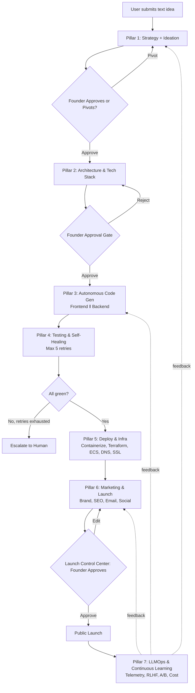
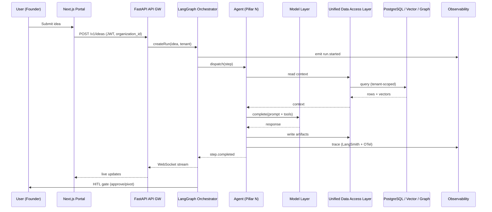
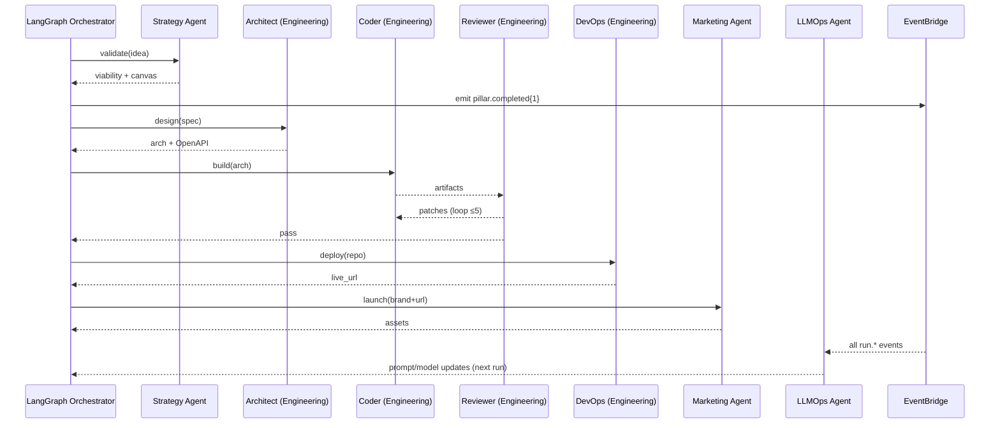

# Architecture Spec — AutoFounder AI

> Extracted from `CLAUDE.md` §4, §5, §6, §11, §29, §37 by `split_claude.py` (2026-06-04).
> `CLAUDE.md` is the lean index; this file holds the detail.
> Section numbers (`§N`) are preserved so cross-references stay valid.

---

## 4. High-Level Architecture (10 Layers)

```
┌──────────────────────────────────────────────────────────────────────────┐
│  1. INPUT LAYER  (multi-modal, multi-source)                              │
│     IoT/Wearables · APIs/Webhooks/Streams · Docs/PDFs · Images · Videos   │
│     · Voice/Audio · User Feedback · Third-party Market Data               │
└──────────────────────────────────────────────────────────────────────────┘
                                   │
┌──────────────────────────────────────────────────────────────────────────┐
│  2. AGENT ORCHESTRATION LAYER  (LangGraph)                                │
│     Dynamic Task Allocation · Inter-Agent Comms (event bus) · Workflow & │
│     Plan Mgmt (DAGs, checkpoints) · Monitoring & Observability · HITL    │
└──────────────────────────────────────────────────────────────────────────┘
                                   │
┌──────────────────────────────────────────────────────────────────────────┐
│  3. AI AGENTS LAYER  (specialized & collaborative)                        │
│     Strategy & Ideation · Product Planner · Research · Engineering ·     │
│     Marketing · Finance · Ops & Risk                                     │
│     Capabilities: Planning · Reasoning · Tool Use · Memory · Self-Learn  │
└──────────────────────────────────────────────────────────────────────────┘
                                   │
┌──────────────────────────────────────────────────────────────────────────┐
│  4. MODEL & CAPABILITY LAYER                                              │
│     LLM (foundational + instruction-tuned) · Embeddings · Vision ·       │
│     Speech/Audio · RAG & Retrieval · RLHF / Alignment                    │
└──────────────────────────────────────────────────────────────────────────┘
                                   │
┌──────────────────────────────────────────────────────────────────────────┐
│  5. DATA & KNOWLEDGE LAYER                                                │
│     Raw Data Lake (S3) · Relational + Vector (Supabase — PostgreSQL +    │
│     pgvector + Storage) · Graph (Neo4j / Neptune) · Object Store ·       │
│     Cache & Session (Redis / DynamoDB)                                   │
│     ⇣ Unified Data Access Layer (APIs) ⇣                                 │
└──────────────────────────────────────────────────────────────────────────┘
                                   │
                ┌──────────────────┴──────────────────┐
                ▼                                     ▼
┌──────────────────────────────┐  ┌───────────────────────────────────────┐
│ 6. OUTPUT & EXPERIENCE LAYER │  │ 7. SERVICE & INTEGRATION LAYER         │
│   Customisation Output       │  │   Multi-Channel Delivery (Web/Mobile/  │
│   Knowledge Updates          │  │   Email/Slack/Teams/APIs)              │
│   Enriched Synthetic Data    │  │   3rd-party (CRM/ERP/DevTools/Pay)    │
│   Actionable Automations     │  │   Automation (Zapier/n8n/Airflow/SF)   │
│   Real-time Notifications    │  │   API Gateway (REST/GraphQL/gRPC)      │
└──────────────────────────────┘  └───────────────────────────────────────┘
                                   │
┌──────────────────────────────────────────────────────────────────────────┐
│  8. GUARDRAILS & GOVERNANCE LAYER                                         │
│     Policy & Rules · Input Guardrails · Instruction Guardrails ·         │
│     Execution Guardrails · Output Guardrails · Monitoring Guardrails ·   │
│     Audit & Lineage                                                      │
└──────────────────────────────────────────────────────────────────────────┘
                                   │
┌──────────────────────────────────────────────────────────────────────────┐
│  9. COMPLIANCE & SECURITY LAYER                                           │
│     Ethics & Responsible AI · Regulatory (GDPR/SOC2/ISO/HIPAA) ·         │
│     Data Privacy · Interoperability/Explainability · Model Versioning · │
│     Human-AI Collaboration                                               │
└──────────────────────────────────────────────────────────────────────────┘
                                   │
┌──────────────────────────────────────────────────────────────────────────┐
│ 10. OBSERVABILITY & MLOPS FOUNDATION                                      │
│     Logging (ELK/OpenSearch) · Metrics (Prom/Grafana) · Tracing (OTel) · │
│     Model Monitoring · CI/CD (GitHub Actions) · Feature Store             │
│     (Feast/Tecton) · Cost & FinOps · Env Management                      │
└──────────────────────────────────────────────────────────────────────────┘
```

---

## 5. End-to-End Workflow

The 7 product pillars map onto a single linear workflow with checkpoints and human-approval gates.



ROI baseline (must remain truthful in generated marketing copy):

| Stage | Traditional | AutoFounder AI |
|---|---|---|
| Idea → Validated | 3 weeks | 30 minutes |
| Validated → Built MVP | 3–6 months | 7 days |
| MVP → Deployed | 1 week | 10 minutes |
| Deployed → Marketed | 2–3 weeks | 2 hours |
| **Total** | **4–7 months** | **~7 days** |
| **Total cost** | **$20K–$60K** | **$200–$700** |

---

## 6. Component Breakdown

| # | Layer | Responsibility | Primary Tech |
|---|---|---|---|
| 1 | Input | Ingest multi-modal idea inputs | FastAPI API GW, Supabase Storage uploads, Whisper (audio), Tesseract/Vision |
| 2 | Orchestration | Schedule, route, coordinate agents | LangGraph + AutoGen fallback, Confluent Kafka, EventBridge, SQS/SNS |
| 3 | Agents | Specialized autonomous workers | LangGraph nodes, FastAPI workers |
| 4 | Models | Generate, embed, classify, vision | Gemini 3.5 Flash + gemini-embedding-2 (primary), Claude Sonnet (fallback), Whisper, DALL-E 3/Midjourney |
| 5 | Data & Knowledge | Persist all state and memory | Supabase (PostgreSQL + pgvector + Storage), Neo4j, S3, Redis |
| 6 | Output & Experience | Deliver artifacts to founder | Next.js 14 Founder Portal, Monaco editor, WebSocket streams |
| 7 | Service & Integration | Talk to 3rd parties | REST/GraphQL/gRPC, Zapier, n8n, Step Functions |
| 8 | Guardrails | Filter inputs, outputs, actions | OPA, Llama Guard, Prompt Armor, custom validators |
| 9 | Compliance | Enforce regulatory posture | AWS Config, Model Registry, Audit logs (7yr) |
| 10 | Observability/MLOps | See everything, learn from it | OpenTelemetry, ELK, Prometheus, Grafana, LangSmith, Feast |

---

## 11. Data Flow



---

## 29. Multi-Agent Communication Flow



---

## 37. Output & Experience Layer (Layer 6 detail)

Outputs delivered to founders across channels:

- **Customisation Output**: reports, plans, dashboards, documents, generated code.
- **Knowledge Updates**: insights, recommendations, learnings (delivered via portal + email digest).
- **Enriched Synthetic Data**: simulations, mock data for testing.
- **Actionable Automations**: auto-tasks, workflows, execution outputs.
- **Real-time Notifications**: alerts, updates, reminders (in-app + email + Slack/Teams + SMS).

Delivery channels (Layer 7): Web App, Mobile, Email, Slack, MS Teams, public APIs.

---
