# High-Level Design — Auto-Founder AI

> **Version**: 1.0 | **Status**: Draft | **Date**: May 2026
> **Owner**: Euron Auto-Founder AI Platform Team | product@euron.one
> **Classification**: Internal — Engineering

---

## Table of Contents

1. [Document Purpose & Scope](#1-document-purpose--scope)
2. [System Architecture Overview](#2-system-architecture-overview)
3. [Technology Layer Breakdown](#3-technology-layer-breakdown)
4. [The 7-Agent Pipeline](#4-the-7-agent-pipeline)
5. [Component Interactions](#5-component-interactions)
6. [Data Flow Between Agents](#6-data-flow-between-agents)
7. [Multi-Tenant Architecture](#7-multi-tenant-architecture)
8. [AWS Infrastructure](#8-aws-infrastructure)
9. [Security Architecture](#9-security-architecture)
10. [Memory & State Architecture](#10-memory--state-architecture)
11. [Observability & LLMOps](#11-observability--llmops)
12. [CI/CD Pipeline](#12-cicd-pipeline)
13. [Performance Targets](#13-performance-targets)
14. [Phased Rollout](#14-phased-rollout)
15. [Open Design Questions](#15-open-design-questions)

---

## 1. Document Purpose & Scope

This High-Level Design covers the end-to-end system architecture of **Auto-Founder AI** — an autonomous, multi-agent SaaS platform that transforms a single text idea into a fully validated, production-ready, and marketed software business.

**In scope**: Platform architecture, the 7-agent pipeline, multi-tenancy model, AWS infrastructure, security boundaries, observability, and CI/CD.

**Not in scope**: Agent-level implementation details (covered in `docs/lld/`), individual prompt templates, Terraform module internals.

**Audience**: Engineering leads, platform architects, DevOps, security reviewers, and technical investors.

---

## 2. System Architecture Overview

Auto-Founder AI is structured as a **LangGraph-orchestrated multi-agent system** deployed on AWS EKS, surfaced to founders through a Next.js portal and streamed to them in real-time via a Go WebSocket server.

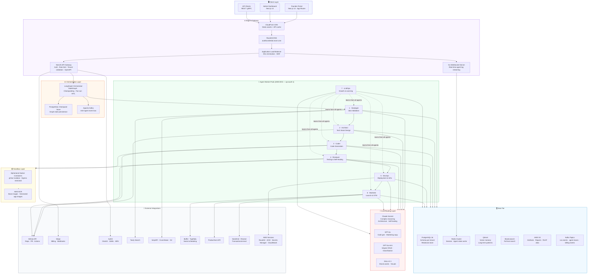

---

## 3. Technology Layer Breakdown

### 3.1 Layer summary

| Layer | Technology | Role |
|---|---|---|
| **Portal UI** | Next.js 14 (App Router), Tailwind CSS, shadcn/ui | Founder interaction, real-time build monitoring |
| **API Gateway** | NestJS (Node.js), TypeScript strict | Auth, rate limiting, tenant validation, REST + WebSocket |
| **Realtime** | Go + WebSocket | Agent log streaming (< 100ms latency) |
| **Orchestration** | LangGraph, Python | Stateful agent graphs, fan-out, checkpointing, HITL interrupts |
| **Agent Workers** | FastAPI + Python 3.11, EKS pods | 7 specialist agents, each independently scalable |
| **LLM Router** | Custom routing layer (LLMOps Agent) | Routes tasks to cheapest capable model |
| **Data — Relational** | PostgreSQL 16, Prisma | Schema-per-tenant, audit logs, 7-year retention |
| **Data — Cache** | Redis Cluster 7.x | Session state, approval signals, pub/sub |
| **Data — Vector** | Qdrant | Long-term memory, pattern retrieval |
| **Data — Search** | Elasticsearch | Full-text search across generated artefacts |
| **Data — Objects** | AWS S3 | Reports, code bundles, RLHF datasets |
| **Message Bus** | Apache Kafka | Async inter-agent events, billing events, trace logs |
| **Sandbox** | Docker + gVisor | Isolated code execution for Coder + Reviewer |
| **Container Registry** | AWS ECR | Base images + generated app images |
| **Infra** | AWS EKS, Terraform, Helm, ArgoCD | Kubernetes orchestration, GitOps CD |
| **Observability** | LangSmith, Prometheus, Grafana, CloudWatch | Tracing, metrics, cost telemetry |
| **Auth** | Auth0 | OAuth 2.0, SAML 2.0, MFA, RBAC |
| **Billing** | Stripe | Subscriptions, webhooks, billing portal |

### 3.2 LLM routing policy

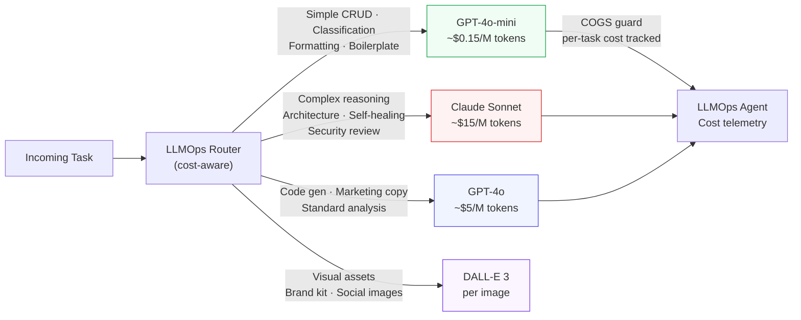

---

## 4. The 7-Agent Pipeline

### 4.1 Pipeline topology

Each agent follows the same **5-stage autonomous loop**: `Understand → Plan → Execute → Verify → Learn`. Agents communicate via gRPC (synchronous handoff) and Kafka (asynchronous events). Two **Human-in-the-Loop (HITL) gates** block forward progress until founder approval is received.

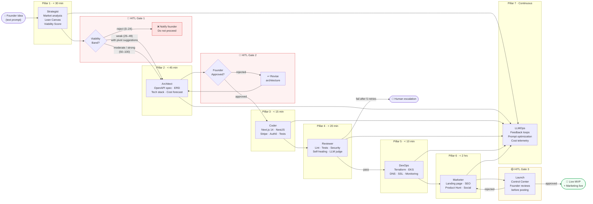

### 4.2 Agent SLA summary

| Agent | Input | Output | SLA | HITL? |
|---|---|---|---|---|
| **Strategist** | Raw text idea | Market report + Lean Canvas + Viability Score | < 30 min | After: viability gate |
| **Architect** | Strategist output | OpenAPI spec + ERD + Tech stack + Cost forecast | < 45 min | Before start: founder approval |
| **Coder** | Architect artefacts | GitHub PR with full-stack repo | < 15 min | — |
| **Reviewer** | GitHub PR | Passing test suite + security scan; patched code | < 20 min | Escalate after 5 retries |
| **DevOps** | Reviewed, containerised code | Live URL + SSL + DNS + CI/CD + Monitoring | < 10 min | Before: infra spend > ₹10K |
| **Marketer** | Live MVP + brand config | SEO page + social content + launch kit | < 2 hrs | Launch Control Centre |
| **LLMOps** | All agent traces + signals | Optimised prompts + cost report + routing rules | Weekly | — |

### 4.3 Self-healing loop (Reviewer Agent)

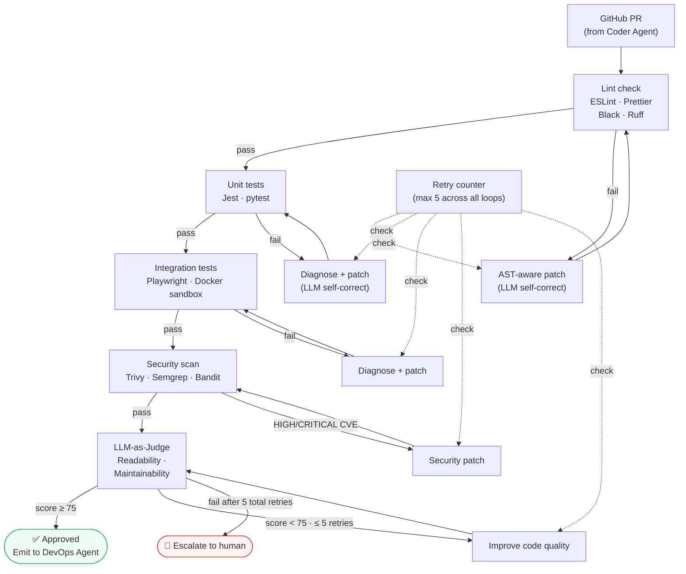

---

## 5. Component Interactions

### 5.1 NestJS API Gateway — request lifecycle

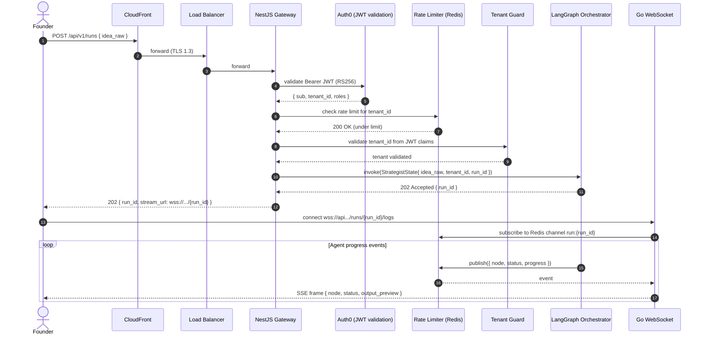

### 5.2 LangGraph Orchestrator — state machine

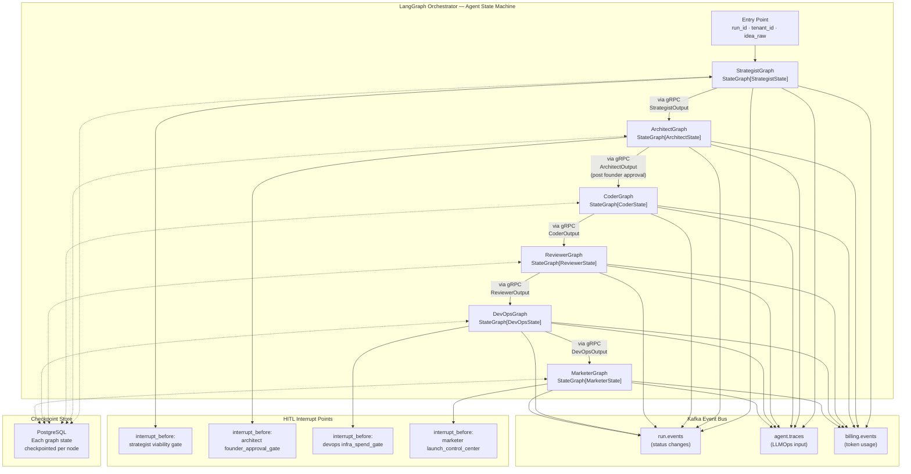

### 5.3 Sandbox execution — Coder + Reviewer

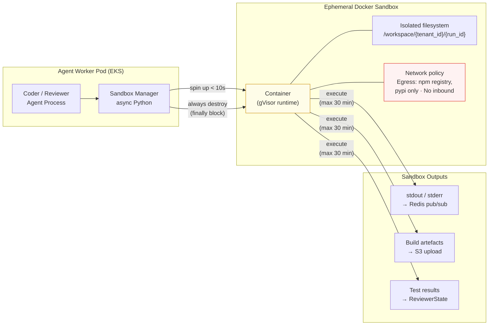

---

## 6. Data Flow Between Agents

### 6.1 End-to-end data flow — idea to live MVP

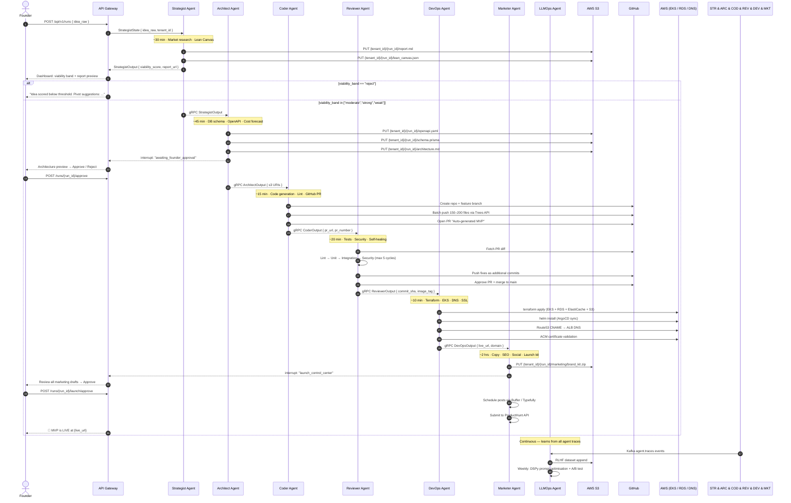

### 6.2 Inter-agent contract summary

| Handoff | Protocol | Key fields passed |
|---|---|---|
| Strategist → Architect | gRPC + Kafka | `run_id`, `viability_score`, `lean_canvas_json`, `report_s3_uri`, `bias_flags` |
| Architect → Coder | gRPC + Kafka | `run_id`, `openapi_yaml_s3_uri`, `prisma_schema_s3_uri`, `stack_json_s3_uri`, `overall_pattern` |
| Coder → Reviewer | gRPC + Kafka | `run_id`, `github_repo_full_name`, `pr_number`, `feature_branch`, `lint_all_passed` |
| Reviewer → DevOps | gRPC + Kafka | `run_id`, `commit_sha`, `ecr_image_tag`, `security_scan_passed`, `coverage_pct` |
| DevOps → Marketer | gRPC + Kafka | `run_id`, `live_url`, `domain`, `stack_summary`, `feature_list_s3_uri` |
| All agents → LLMOps | Kafka only (async) | `run_id`, `node_name`, `model_used`, `tokens_in`, `tokens_out`, `latency_ms`, `outcome` |

---

## 7. Multi-Tenant Architecture

### 7.1 Tenant isolation model

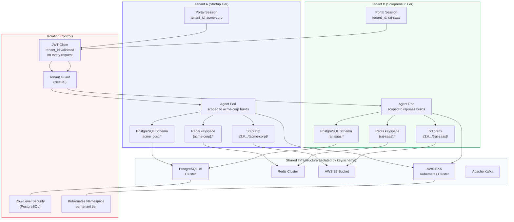

### 7.2 Database — schema-per-tenant pattern

Each tenant gets its own PostgreSQL **schema** within the shared cluster. No foreign keys cross schema boundaries. RLS is enabled as an additional defence layer.

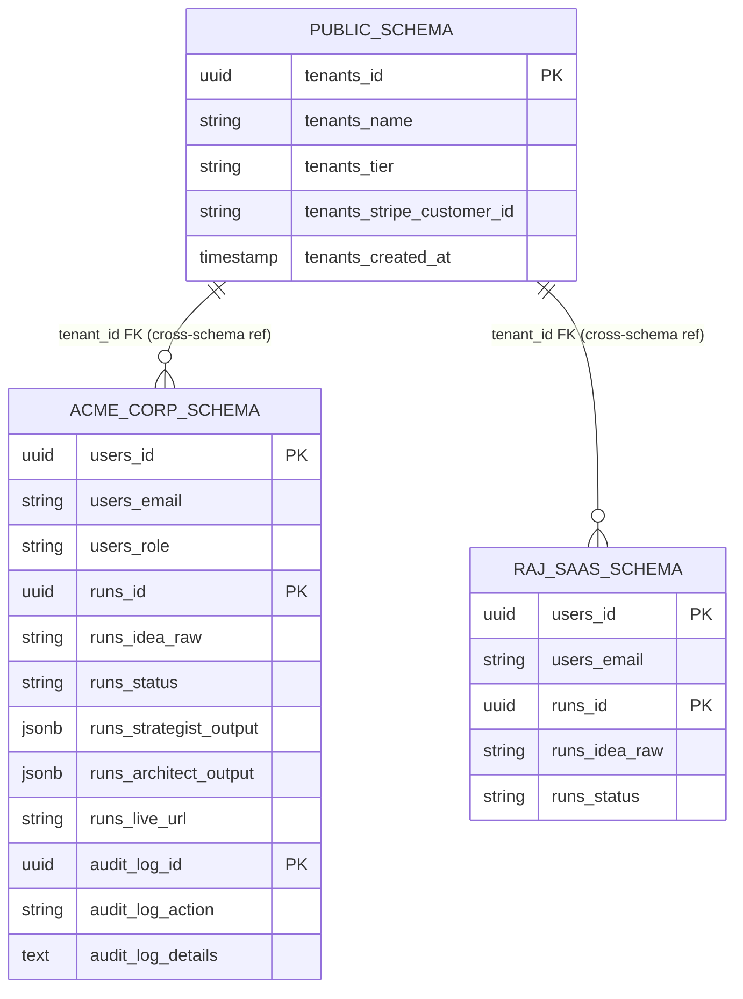

### 7.3 Storage isolation

| Resource | Isolation mechanism | Path pattern |
|---|---|---|
| S3 objects | Bucket policy + IAM condition key on `s3:prefix` | `s3://autofounder-artefacts/{tenant_id}/{run_id}/` |
| Redis keys | Key namespace prefix enforced in SDK wrapper | `{tenant_id}:{resource}:{id}` |
| Kafka topics | Topic-level ACLs scoped to service account | `run.events.{tenant_id}` |
| Qdrant collections | One collection per tenant | `memory-{tenant_id}` |
| Agent pods | Kubernetes labels + `NetworkPolicy` | `tenant: {tenant_id}` label selector |

---

## 8. AWS Infrastructure

### 8.1 Infrastructure overview

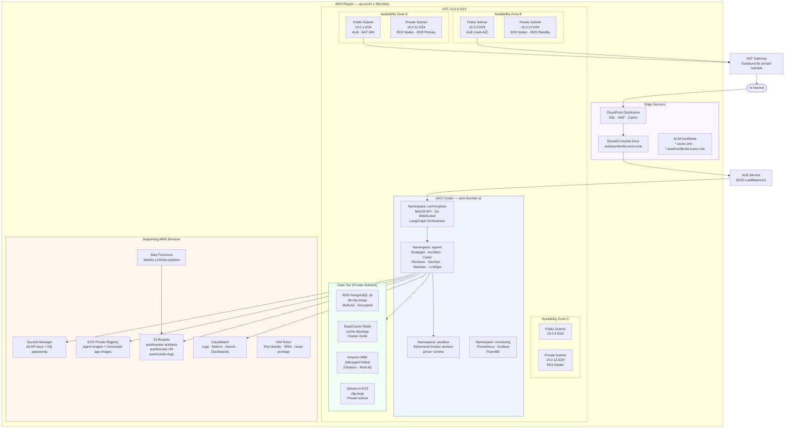

### 8.2 EKS workload layout

| Namespace | Deployments | HPA trigger | Base replicas | Max replicas |
|---|---|---|---|---|
| `control-plane` | NestJS API, Go WebSocket, LangGraph Orchestrator | CPU > 70% | 2 | 10 |
| `agents` | Strategist, Architect, Coder, Reviewer, DevOps, Marketer, LLMOps | Queue depth > 5 builds | 1 each | 20 each |
| `sandbox` | Docker worker pods | Per-build on demand | 0 | 500 (burst) |
| `monitoring` | Prometheus, Grafana, FluentBit | Fixed | 1 each | 1 each |

### 8.3 Networking rules

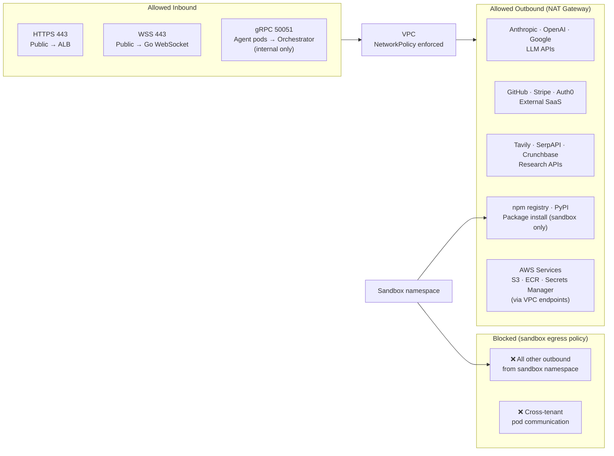

---

## 9. Security Architecture

### 9.1 Security boundary overview

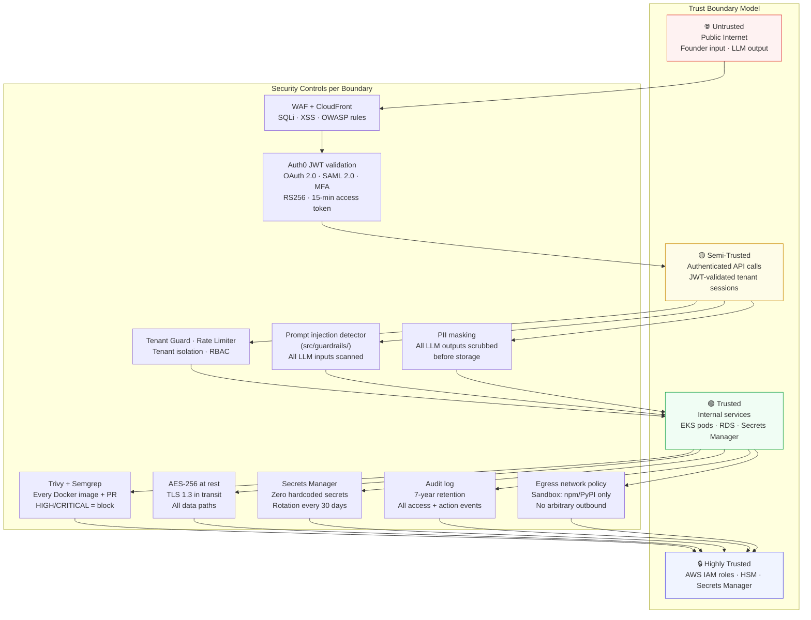

### 9.2 Auth flow

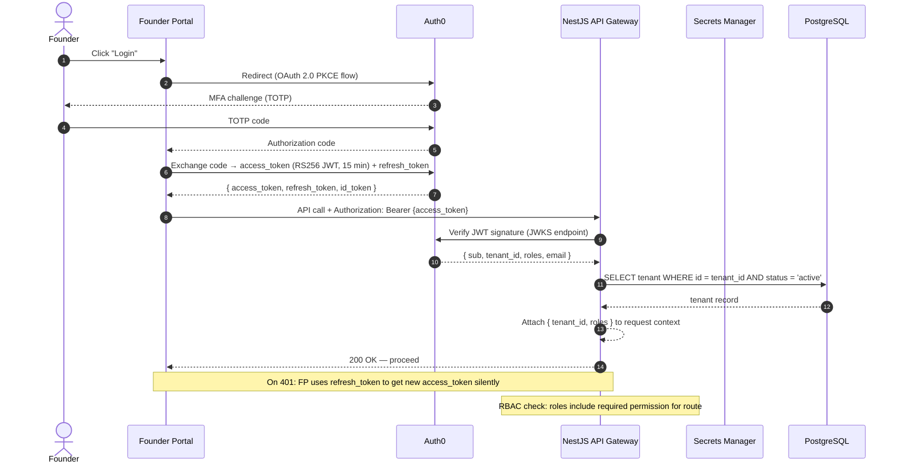

### 9.3 Compliance controls

| Requirement | Control |
|---|---|
| **GDPR Right to Erasure** | `/api/v1/tenants/{id}/erase` — wipes PostgreSQL schema, S3 prefix, Redis keys, Qdrant collection |
| **CCPA data export** | `/api/v1/tenants/{id}/export` — full S3 dump + DB export in 72 hrs |
| **SOC 2 Type II** | Quarterly pen tests + automated Trivy/Semgrep on every deploy |
| **ISO 27001** | Secrets rotation, audit logs 7yr, MFA enforcement, change management via PRs |
| **PII masking** | All generated code and LLM outputs pass through `src/guardrails/pii_mask.py` before storage |
| **Prompt injection** | All user-supplied text routed through `src/guardrails/injection_detect.py` before LLM call |
| **Content moderation** | Harmful/illegal output filter on all agent outputs (LLM-as-classifier) |

---

## 10. Memory & State Architecture

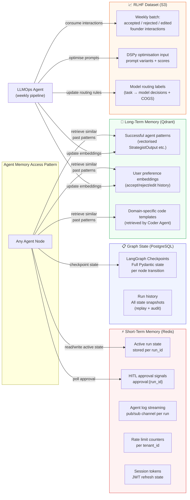

---

## 11. Observability & LLMOps

### 11.1 Observability stack

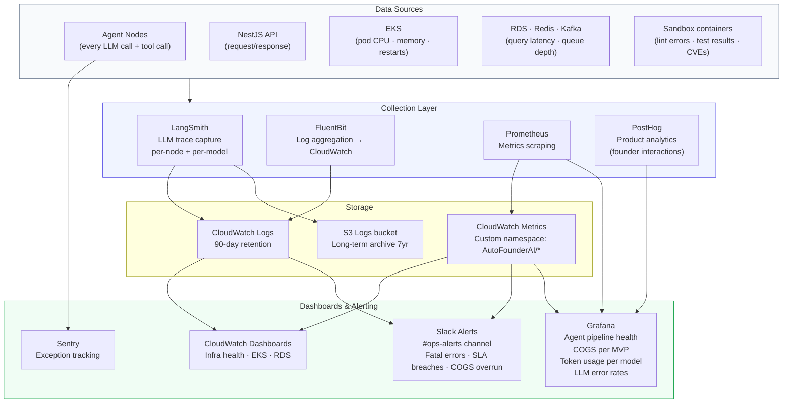

### 11.2 Key metrics tracked

| Metric | Owner | Alert threshold |
|---|---|---|
| End-to-end MVP generation latency | LangGraph | > 20 min → PagerDuty |
| COGS per MVP build (₹) | LLMOps | > ₹500 → Slack warning |
| First-run deployment success rate | DevOps | < 85% → Slack alert |
| Self-healing auto-fix rate | Reviewer | < 90% over 24h → investigation |
| LLM error rate (5xx) | All agents | > 1% → PagerDuty |
| API P99 latency | NestJS | > 100ms → Slack warning |
| Sandbox spin-up time | Coder/Reviewer | > 10s → Slack warning |
| Token cost per model per agent | LLMOps | Tracked weekly — no hard alert |
| Qdrant retrieval latency | Memory layer | > 200ms → investigation |

### 11.3 LLMOps weekly pipeline

```mermaid
flowchart LR
    SFN_TRIGGER["AWS Step Functions\nCron: Every Sunday 02:00 IST"]

    SFN_TRIGGER --> COLLECT["1. Collect\nPull RLHF interactions\nfrom S3 (past 7 days)"]
    COLLECT --> PREP["2. Prep dataset\nFilter accept/reject/edit signals\nDeduplicate · Quality filter"]
    PREP --> OPT["3. DSPy prompt optimisation\nGenerate candidate prompt variants\nfor each agent node"]
    OPT --> AB["4. A/B eval\nPromptfoo: score variants\nvs baseline on golden set"]
    AB --> PROMOTE["5. Promote winner\nUpdate prompt registry in DB\nDeploy to production agents"]
    PROMOTE --> ROUTING["6. Update model routing\nRecalibrate GPT-4o-mini\nvs Claude thresholds based\non COGS + quality data"]
    ROUTING --> REPORT["7. Weekly report\nSlack: COGS · quality trends\nModel distribution · top errors"]

    style SFN_TRIGGER fill:#fff7ed,stroke:#ea580c
    style PROMOTE     fill:#f0fdf4,stroke:#16a34a
```

---

## 12. CI/CD Pipeline

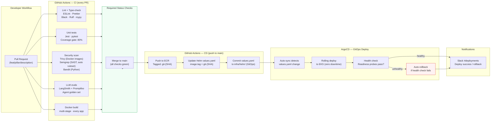

---

## 13. Performance Targets

| Metric | Target | Hard Cap | Measurement |
|---|---|---|---|
| API response time (P99) | < 100 ms | < 500 ms | Prometheus + CloudWatch |
| Sandbox spin-up time | < 10 s | < 30 s | Agent node trace |
| Strategist Agent end-to-end | < 30 min | 45 min | LangGraph run_id trace |
| Architect Agent end-to-end | < 45 min | 60 min (excl. HITL) | LangGraph run_id trace |
| Coder Agent end-to-end | < 15 min | 20 min | LangGraph run_id trace |
| Reviewer Agent end-to-end | < 20 min | 30 min | LangGraph run_id trace |
| DevOps Agent end-to-end | < 10 min | 15 min | Terraform apply duration |
| **Full pipeline (idea → live MVP)** | **≈ 7 days** | — | Wall-clock (incl. HITL waits) |
| COGS per MVP build | < ₹500 | — | LLMOps cost telemetry |
| Self-healing auto-fix rate | ≥ 90% | — | Reviewer retry outcome logs |
| First-run deploy success | ≥ 85% | — | DevOps outcome metric |
| Concurrent builds (horizontal scale) | 500 | — | Load test (Product Hunt spike) |
| System availability | 99.9% | — | CloudWatch alarms |

---

## 14. Phased Rollout

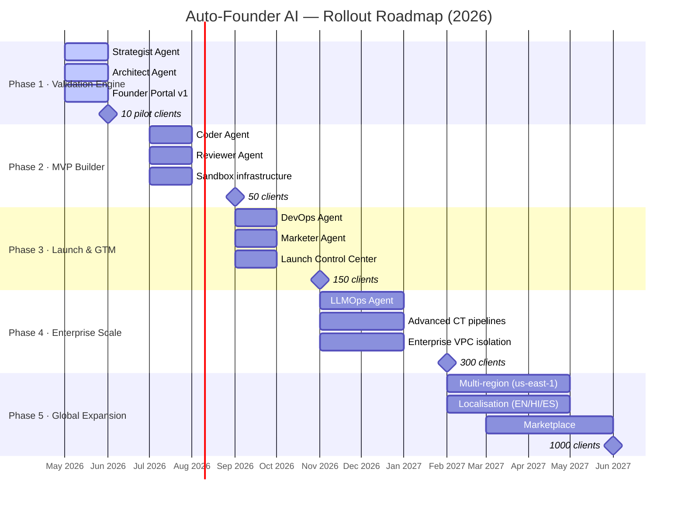

### Phase scope summary

| Phase | Status | Agents active | Key capabilities |
|---|---|---|---|
| **Phase 1** | **Active** | Strategist, Architect | Market analysis, Lean Canvas, tech architecture, Founder Portal |
| **Phase 2** | Upcoming | + Coder, Reviewer | Full-stack code gen, self-healing loop, GitHub PR |
| **Phase 3** | Planned | + DevOps, Marketer | One-click deploy, SEO + social launch, Launch Control Centre |
| **Phase 4** | Planned | + LLMOps | RLHF pipeline, prompt A/B testing, enterprise VPC, white-labeling |
| **Phase 5** | Planned | All 7 | Multi-region, localisation, marketplace, mobile gen (Phase 6 TBD) |

---

## 15. Open Design Questions

These are unresolved architectural decisions. Do not implement solutions without explicit product approval.

| # | Question | Impact | Owner |
|---|---|---|---|
| 1 | How to automate AWS account **Transfer of Ownership** when a founder ejects from the SaaS? | DevOps Agent · Billing | Product |
| 2 | **Multi-cloud support** (GCP / Azure) for AI Researcher persona benchmarking? | DevOps Agent · Infra | Engineering |
| 3 | Rate limit strategy for **X / LinkedIn APIs** at 1,000+ tenant scale without Buffer becoming a bottleneck? | Marketer Agent | Engineering |
| 4 | **Sustainable differentiation**: preventing commoditisation of core features within 12-month horizon? | Strategy | Product |
| 5 | **Phase 6 scope**: native mobile app generation — Flutter vs React Native, model selection, timeline? | Coder Agent · Roadmap | Product |
| 6 | Governance model for **on-prem LLM** deployment (Enterprise tier) — Llama 3? Mistral? Self-hosted Bedrock? | LLMOps · Infra | Engineering |

---

*Auto-Founder AI — High-Level Design v1.0 | May 2026*
*For questions: product@euron.one*
