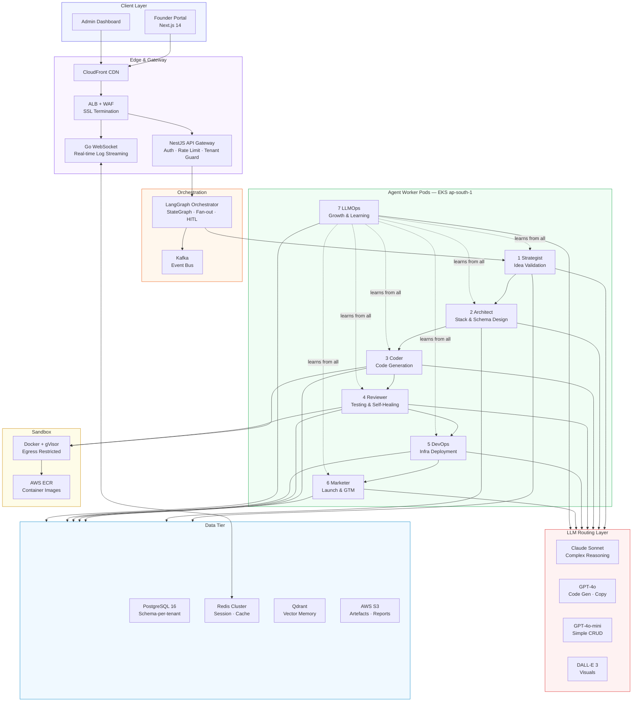
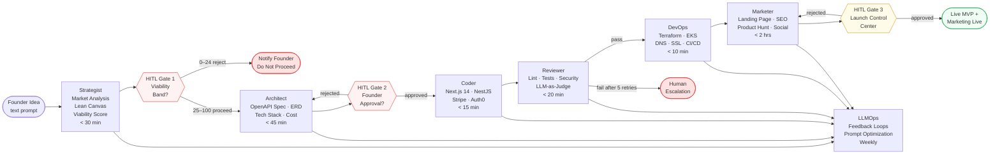
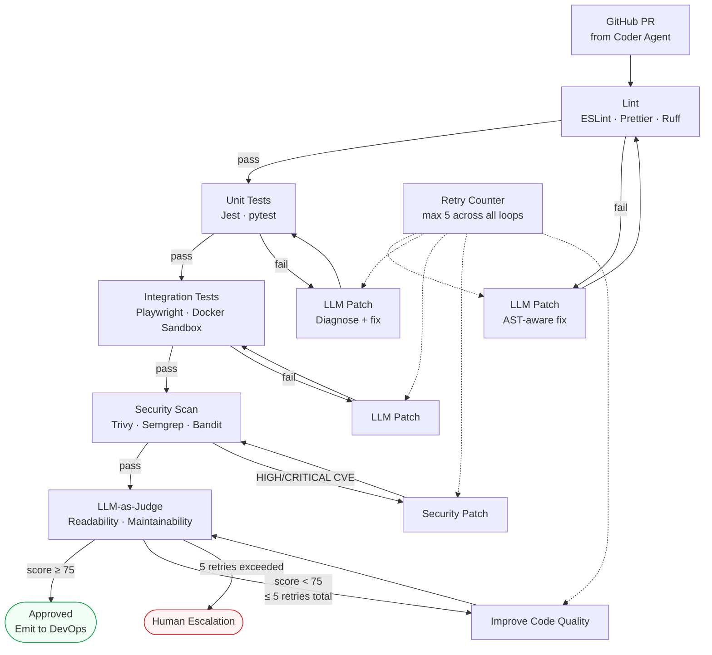
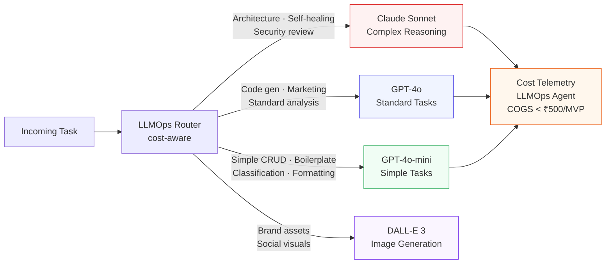
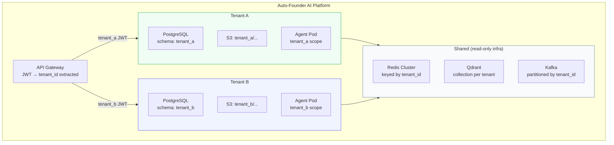
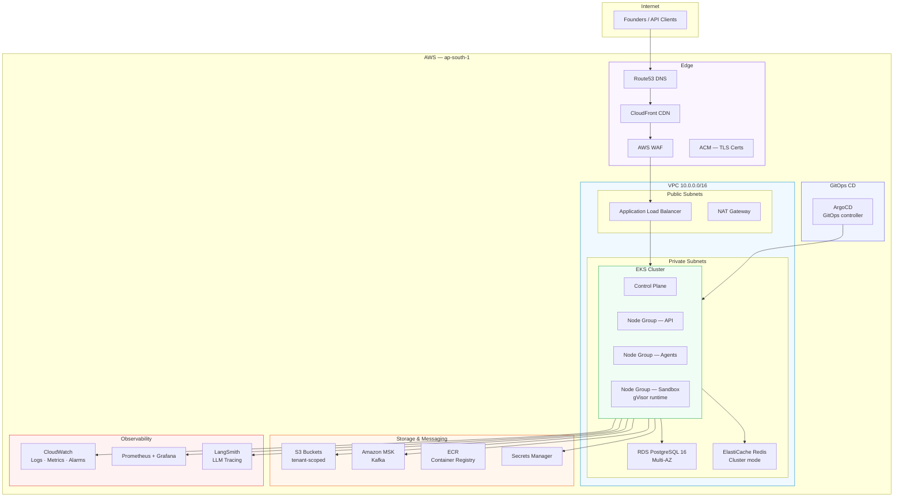

# Auto-Founder AI — Architecture Reference

> **Version**: 1.0 | **Date**: May 2026
> Condensed visual reference. Full narrative in [`HLD.md`](./HLD.md) and [`lld/`](./lld/).

---

## 1. System Overview

---

## 2. Agent Pipeline

---

## 3. Reviewer Self-Healing Loop

---

## 4. LLM Routing Policy

---

## 5. Multi-Tenant Isolation

---

## 6. AWS Infrastructure

---

## 7. CI/CD Pipeline

```mermaid
flowchart LR
    DEV["Developer\nPush / PR"]

    DEV --> GHA["GitHub Actions"]

    subgraph CI["CI — on every PR"]
        L["Lint\nESLint · Black · Ruff"]
        T["Unit Tests\nJest · pytest"]
        SEC["Security Scan\nTrivy · Semgrep · Bandit"]
        EV["LLM Eval\nLangSmith judge"]
    end

    subgraph CD["CD — on merge to main"]
        BLD["Docker Build\nMulti-stage"]
        PUSH["Push to ECR"]
        SM["Staging Deploy\nArgoCD sync"]
        SMOK["Smoke Tests\nPlaywright"]
        PROD["Production Deploy\nArgoCD rolling update"]
    end

    GHA --> L --> T --> SEC --> EV
    EV -->|"all checks pass"| BLD --> PUSH --> SM --> SMOK --> PROD

    PROD --> LIVE(["Live on EKS\nautofoundeai.euron.one"])

    style CI   fill:#f0f4ff,stroke:#4f46e5
    style CD   fill:#f0fdf4,stroke:#16a34a
    style LIVE fill:#f0fdf4,stroke:#16a34a
```

---

*For detailed component specs, see [`HLD.md`](./HLD.md). For agent-level implementation, see [`lld/`](./lld/).*
