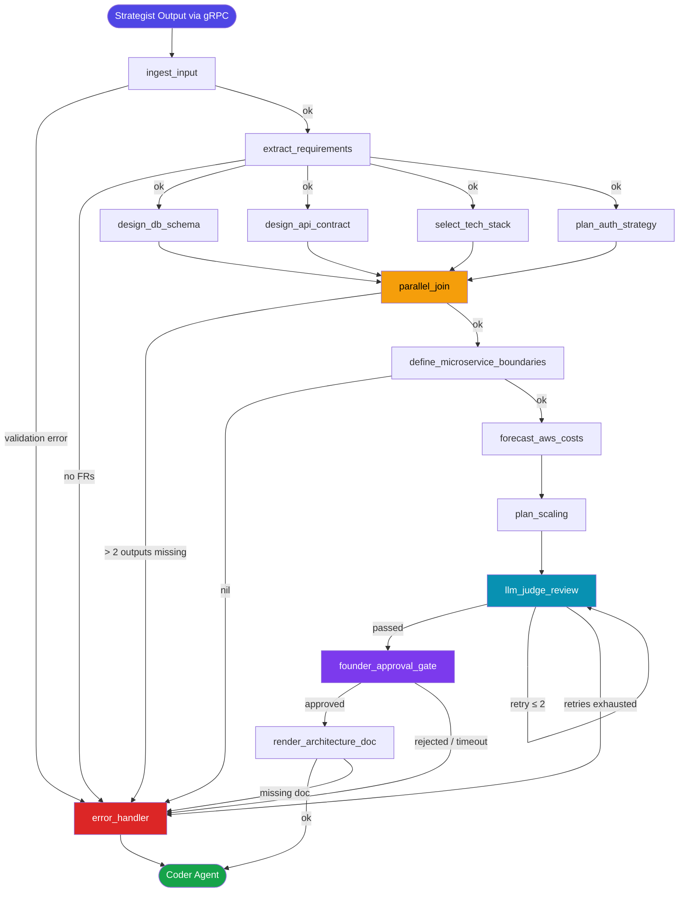
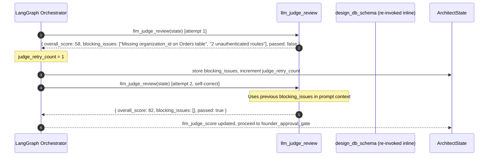
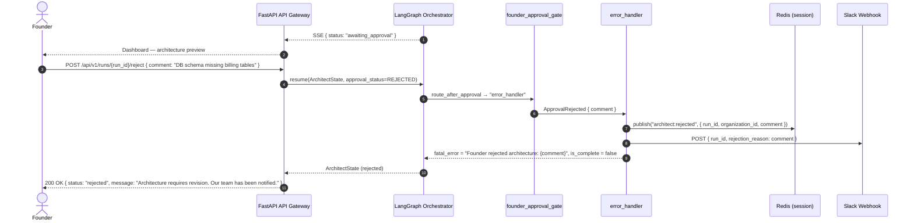
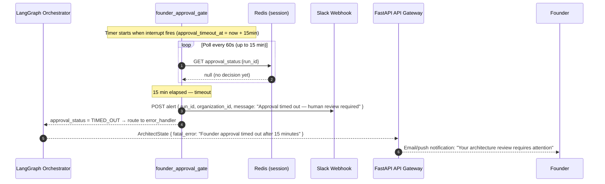

# Low-Level Design — Architect Agent

> **Phase**: Phase 1 — Validation Engine (Active) / Phase 2 — MVP Builder (Upcoming)
> **SLA**: < 45 minutes end-to-end (excluding async Founder Approval gate)
> **Owner**: Auto-Founder AI Platform Team | product@euron.one

---

## Table of Contents

1. [Overview](#1-overview)
2. [LangGraph State Schema (Pydantic V2)](#2-langgraph-state-schema-pydantic-v2)
3. [Node Graph Definition](#3-node-graph-definition)
4. [Tool Bindings](#4-tool-bindings)
5. [Prompt Templates](#5-prompt-templates)
6. [Sequence Diagrams](#6-sequence-diagrams)
7. [Error Handling Logic](#7-error-handling-logic)
8. [Output Contract](#8-output-contract)

---

## 1. Overview

The Architect Agent is the second stage of the Auto-Founder AI pipeline. It receives a validated `StrategistOutput` via gRPC and autonomously produces:

- An **OpenAPI 3.1 specification** (full REST + WebSocket contract)
- An **Entity-Relationship Diagram** (ERD) + SQLAlchemy models (+ Alembic migration)
- A **Tech Stack Recommendation** with rationale
- An **AWS Cost Forecast** (monthly + per-MVP COGS)
- An **Auth Strategy** (OAuth 2.0, SAML 2.0, JWT, MFA flows)
- A **Microservice Boundary Map** (service decomposition)
- A **Scaling Plan** (horizontal auto-scale rules, traffic projections)

The agent runs as a LangGraph stateful graph, parallelises independent design sub-tasks, enforces an **LLM-as-judge quality gate** on all design outputs, and blocks on a **Founder Approval gate** (HITL) before emitting architecture artefacts to the Coder Agent.

Ideas scored `reject` by the Strategist Agent are never forwarded here. Ideas scored `weak` arrive with `pivot_suggestions` pre-surfaced in the approval UI.

### Sub-tasks executed (with target SLA)

| Sub-task | Node | Target |
|---|---|---|
| Ingest + validate Strategist output | `ingest_input` | < 15 s |
| Functional + non-functional requirements extraction | `extract_requirements` | < 2 min |
| DB schema design (ERD + SQLAlchemy models + Alembic) | `design_db_schema` | < 8 min |
| API contract generation (OpenAPI 3.1) | `design_api_contract` | < 8 min |
| Tech stack selection + rationale | `select_tech_stack` | < 5 min |
| Auth strategy design | `plan_auth_strategy` | < 3 min |
| Microservice boundary analysis | `define_microservice_boundaries` | < 5 min |
| AWS cost forecasting | `forecast_aws_costs` | < 3 min |
| Scaling plan + capacity model | `plan_scaling` | < 3 min |
| LLM-as-judge quality review | `llm_judge_review` | < 3 min |
| Founder approval gate (HITL) | `founder_approval_gate` | async (15 min timeout) |
| Architecture document rendering | `render_architecture_doc` | < 2 min |

---

## 2. LangGraph State Schema (Pydantic V2)

```python
# backend/app/agents/architect/schema.py

from __future__ import annotations

from datetime import datetime
from enum import StrEnum
from typing import Annotated, Any
from uuid import UUID, uuid4

from pydantic import BaseModel, Field, field_validator, model_validator
from langgraph.graph.message import add_messages


# ---------------------------------------------------------------------------
# Enums
# ---------------------------------------------------------------------------

class NodeStatus(StrEnum):
    PENDING   = "pending"
    RUNNING   = "running"
    COMPLETED = "completed"
    FAILED    = "failed"
    SKIPPED   = "skipped"


class ApprovalStatus(StrEnum):
    PENDING   = "pending"
    APPROVED  = "approved"
    REJECTED  = "rejected"
    TIMED_OUT = "timed_out"


class StackTier(StrEnum):
    FRONTEND  = "frontend"
    BACKEND   = "backend"
    DATABASE  = "database"
    INFRA     = "infra"
    AI        = "ai"
    MESSAGING = "messaging"
    OBSERVABILITY = "observability"


class AuthFlowType(StrEnum):
    OAUTH2   = "oauth2"
    SAML2    = "saml2"
    JWT      = "jwt"
    MFA_TOTP = "mfa_totp"
    API_KEY  = "api_key"


class ServicePattern(StrEnum):
    MONOLITH         = "monolith"
    MODULAR_MONOLITH = "modular_monolith"
    MICROSERVICES    = "microservices"
    SERVERLESS       = "serverless"


# ---------------------------------------------------------------------------
# Sub-models: Requirements
# ---------------------------------------------------------------------------

class FunctionalRequirement(BaseModel):
    id: str = Field(..., description="e.g. FR-001")
    title: str
    description: str
    priority: str  # "must_have" | "should_have" | "nice_to_have" (MoSCoW)
    actor: str     # e.g. "Founder", "Admin", "End User"


class NFRSpec(BaseModel):
    max_api_latency_ms: int       = Field(100, description="P99 API response time target")
    availability_pct: float       = Field(99.9, ge=0, le=100)
    concurrent_users: int         = Field(500)
    data_residency_regions: list[str] = Field(default_factory=lambda: ["ap-south-1"])
    compliance: list[str]         = Field(default_factory=lambda: ["GDPR", "CCPA", "SOC2"])
    encryption_at_rest: bool      = True
    encryption_in_transit: bool   = True


# ---------------------------------------------------------------------------
# Sub-models: DB Schema
# ---------------------------------------------------------------------------

class DBEntity(BaseModel):
    name: str
    fields: list[dict[str, str]]   # [{"name": "id", "type": "UUID", "constraints": "PK"}]
    relationships: list[str]       = Field(default_factory=list)
    indexes: list[str]             = Field(default_factory=list)
    rls_enabled: bool              = False  # Row-level security for multi-tenancy


class DBSchema(BaseModel):
    entities: list[DBEntity]
    sqlalchemy_models: str         = Field(..., description="Full SQLAlchemy models module content")
    alembic_migration: str         = Field(..., description="Initial Alembic migration (upgrade/downgrade)")
    erd_mermaid: str               = Field(..., description="ERD as Mermaid erDiagram block")
    multi_tenancy_strategy: str    = "schema_per_tenant"  # always schema-per-tenant per CLAUDE.md


# ---------------------------------------------------------------------------
# Sub-models: API Contract
# ---------------------------------------------------------------------------

class APIEndpoint(BaseModel):
    method: str    # GET | POST | PUT | PATCH | DELETE
    path: str
    summary: str
    tags: list[str]
    auth_required: bool = True
    request_body_schema: str | None = None   # JSON Schema ref
    response_schema: str | None     = None
    rate_limit_rpm: int | None      = None


class APIContract(BaseModel):
    openapi_version: str = "3.1.0"
    endpoints: list[APIEndpoint]
    openapi_yaml: str    = Field(..., description="Full OpenAPI 3.1 YAML document")
    websocket_events: list[str] = Field(
        default_factory=list,
        description="List of WebSocket event names (for agent log streaming)"
    )


# ---------------------------------------------------------------------------
# Sub-models: Tech Stack
# ---------------------------------------------------------------------------

class StackChoice(BaseModel):
    tier: StackTier
    chosen: str
    rationale: str
    alternatives_considered: list[str] = Field(default_factory=list)


class TechStack(BaseModel):
    choices: list[StackChoice]
    overall_pattern: ServicePattern
    rationale_summary: str
    risk_flags: list[str] = Field(default_factory=list)


# ---------------------------------------------------------------------------
# Sub-models: Auth Strategy
# ---------------------------------------------------------------------------

class AuthFlow(BaseModel):
    flow_type: AuthFlowType
    description: str
    applies_to: str       # e.g. "Founder Portal", "Admin Dashboard", "API (M2M)"
    token_lifetime_s: int | None = None
    mfa_required: bool = False


class AuthStrategy(BaseModel):
    flows: list[AuthFlow]
    provider: str          = "Supabase Auth"
    rbac_roles: list[str]
    session_storage: str   = "Redis"
    jwt_algorithm: str     = "RS256"
    pii_fields_masked: list[str] = Field(default_factory=list)


# ---------------------------------------------------------------------------
# Sub-models: Microservice Boundaries
# ---------------------------------------------------------------------------

class Microservice(BaseModel):
    name: str
    responsibility: str
    owns_entities: list[str]         # DB entities this service owns
    exposes_apis: list[str]          # API path prefixes
    communicates_with: list[str]     # other service names
    communication_protocol: str      # "gRPC" | "REST" | "Kafka event"
    deployment_unit: str             # "ECS task" | "Lambda"
    scaling_trigger: str             # e.g. "CPU > 70%" | "queue depth > 100"


class MicroserviceMap(BaseModel):
    pattern: ServicePattern
    services: list[Microservice]
    dependency_mermaid: str          = Field(..., description="Mermaid graph of service dependencies")
    api_gateway: str                 = "FastAPI API Gateway"
    message_bus: str                 = "Confluent Kafka"


# ---------------------------------------------------------------------------
# Sub-models: AWS Cost Forecast
# ---------------------------------------------------------------------------

class AWSServiceCost(BaseModel):
    service: str        # e.g. "ECS Fargate", "Supabase (PostgreSQL)", "ElastiCache Redis"
    monthly_usd: float
    assumptions: str    # e.g. "2 × 0.5 vCPU/1GB Fargate tasks, Supabase Pro tier"


class AWSCostForecast(BaseModel):
    monthly_total_usd: float
    cogs_per_mvp_inr: float
    line_items: list[AWSServiceCost]
    cost_within_target: bool         # COGS target: < ₹500/MVP per CLAUDE.md

    @model_validator(mode="after")
    def check_cogs_target(self) -> AWSCostForecast:
        object.__setattr__(self, "cost_within_target", self.cogs_per_mvp_inr < 500)
        return self


# ---------------------------------------------------------------------------
# Sub-models: Scaling Plan
# ---------------------------------------------------------------------------

class ScalingRule(BaseModel):
    service: str
    metric: str          # "cpu_utilisation" | "requests_per_second" | "queue_depth"
    threshold: str       # e.g. "> 70% for 2 min"
    action: str          # e.g. "scale out +2 tasks"
    cooldown_s: int      = 120


class ScalingPlan(BaseModel):
    baseline_tasks: dict[str, int]   # service_name → initial ECS task count
    max_tasks: dict[str, int]
    rules: list[ScalingRule]
    load_test_target: str            = "Product Hunt spike (sudden burst 500 concurrent users)"
    cdn_strategy: str | None        = None


# ---------------------------------------------------------------------------
# Sub-models: LLM Judge
# ---------------------------------------------------------------------------

class LLMJudgeScore(BaseModel):
    readability_score: int   = Field(..., ge=0, le=100)
    maintainability_score: int = Field(..., ge=0, le=100)
    security_score: int      = Field(..., ge=0, le=100)
    completeness_score: int  = Field(..., ge=0, le=100)
    overall_score: int       = Field(..., ge=0, le=100)
    passed: bool             = False
    blocking_issues: list[str] = Field(default_factory=list)
    warnings: list[str]        = Field(default_factory=list)

    @model_validator(mode="after")
    def derive_pass(self) -> LLMJudgeScore:
        object.__setattr__(self, "passed", self.overall_score >= 75 and not self.blocking_issues)
        return self


# ---------------------------------------------------------------------------
# Execution metadata helpers
# ---------------------------------------------------------------------------

class NodeTrace(BaseModel):
    node: str
    status: NodeStatus
    started_at: datetime | None  = None
    completed_at: datetime | None = None
    error: str | None = None
    retry_count: int = 0


class RetryPolicy(BaseModel):
    max_retries: int = 3
    backoff_seconds: list[int] = Field(default_factory=lambda: [5, 15, 45])


# ---------------------------------------------------------------------------
# Root Graph State
# ---------------------------------------------------------------------------

class ArchitectState(BaseModel):
    """
    Single source of truth threaded through every node in the Architect graph.
    LangGraph merges updates via add_messages for the messages channel;
    all other fields are last-write-wins.
    """

    # Identity
    run_id: UUID            = Field(default_factory=uuid4)
    parent_run_id: UUID     = Field(..., description="Strategist Agent run_id")
    organization_id: str    = Field(..., description="Validated from Supabase JWT claims")

    # Input from Strategist Agent (deserialized from gRPC StrategistOutput)
    idea_normalised: str
    domain: str
    viability_score: int
    viability_band: str
    lean_canvas_json: str
    pivot_suggestions: list[str]            = Field(default_factory=list)
    bias_flags: list[str]                   = Field(default_factory=list)

    # Extracted requirements (sequential, pre-parallel)
    functional_requirements: list[FunctionalRequirement] = Field(default_factory=list)
    non_functional_requirements: NFRSpec | None          = None

    # Parallel design outputs
    db_schema: DBSchema | None              = None
    api_contract: APIContract | None        = None
    tech_stack: TechStack | None            = None
    auth_strategy: AuthStrategy | None      = None

    # Post-join sequential outputs
    microservice_map: MicroserviceMap | None   = None
    aws_cost_forecast: AWSCostForecast | None  = None
    scaling_plan: ScalingPlan | None           = None

    # Quality gate
    llm_judge_score: LLMJudgeScore | None   = None
    judge_retry_count: int                  = 0

    # Founder approval (HITL)
    approval_status: ApprovalStatus         = ApprovalStatus.PENDING
    approval_comment: str | None            = None
    approval_timeout_at: datetime | None    = None

    # Final output
    architecture_doc_markdown: str | None   = None

    # Execution metadata
    node_traces: list[NodeTrace]            = Field(default_factory=list)
    retry_policy: RetryPolicy               = Field(default_factory=RetryPolicy)
    total_llm_tokens_used: int              = 0
    total_tool_calls: int                   = 0
    error_count: int                        = 0

    # LangGraph message channel
    messages: Annotated[list[Any], add_messages] = Field(default_factory=list)

    # Terminal flags
    is_complete: bool   = False
    fatal_error: str | None = None

    class Config:
        arbitrary_types_allowed = True
```

---

## 3. Node Graph Definition

### 3.1 Node inventory

| Node ID | Type | Description | Model |
|---|---|---|---|
| `ingest_input` | Sequential | Deserialise + validate StrategistOutput from gRPC | — (validation only) |
| `extract_requirements` | Sequential | Derive FRs + NFRs from idea + Lean Canvas | Gemini 3.5 Flash |
| `design_db_schema` | Parallel branch | ERD + SQLAlchemy models + Alembic migration generation | Gemini 3.5 Flash |
| `design_api_contract` | Parallel branch | OpenAPI 3.1 YAML generation | Gemini 3.5 Flash |
| `select_tech_stack` | Parallel branch | Stack recommendation with rationale | Gemini 3.5 Flash |
| `plan_auth_strategy` | Parallel branch | Auth flows, RBAC, token policy | Gemini 3.5 Flash |
| `parallel_join` | Barrier | Waits for all 4 parallel design nodes | — |
| `define_microservice_boundaries` | Sequential | Service decomposition + dependency graph | Gemini 3.5 Flash |
| `forecast_aws_costs` | Sequential | Per-service AWS Pricing API lookup + COGS calc | Gemini 3.5 Flash |
| `plan_scaling` | Sequential | ECS auto-scaling rules, task baseline, load-test target | Gemini 3.5 Flash |
| `llm_judge_review` | Sequential | Second LLM scores all artefacts (0–100) | Gemini 3.5 Flash |
| `founder_approval_gate` | HITL / Async | Blocks until Founder approves or 15 min timeout | — |
| `render_architecture_doc` | Sequential | Assembles final Markdown architecture document | Gemini 3.5 Flash |
| `error_handler` | Error sink | Retries or escalates failed nodes | — |

### 3.2 Graph definition

```python
# backend/app/agents/architect/graph.py

from langgraph.graph import StateGraph, END
from langgraph.checkpoint.postgres import PostgresSaver

from .schema import ArchitectState
from .nodes import (
    ingest_input,
    extract_requirements,
    design_db_schema,
    design_api_contract,
    select_tech_stack,
    plan_auth_strategy,
    parallel_join,
    define_microservice_boundaries,
    forecast_aws_costs,
    plan_scaling,
    llm_judge_review,
    founder_approval_gate,
    render_architecture_doc,
    error_handler,
)
from .routers import (
    route_after_ingest,
    route_after_requirements,
    route_after_join,
    route_after_microservices,
    route_after_judge,
    route_after_approval,
    route_terminal,
)


def build_architect_graph(checkpointer: PostgresSaver) -> StateGraph:
    graph = StateGraph(ArchitectState)

    # -- Node registration --------------------------------------------------
    graph.add_node("ingest_input",                  ingest_input)
    graph.add_node("extract_requirements",          extract_requirements)
    graph.add_node("design_db_schema",              design_db_schema)
    graph.add_node("design_api_contract",           design_api_contract)
    graph.add_node("select_tech_stack",             select_tech_stack)
    graph.add_node("plan_auth_strategy",            plan_auth_strategy)
    graph.add_node("parallel_join",                 parallel_join)
    graph.add_node("define_microservice_boundaries", define_microservice_boundaries)
    graph.add_node("forecast_aws_costs",            forecast_aws_costs)
    graph.add_node("plan_scaling",                  plan_scaling)
    graph.add_node("llm_judge_review",              llm_judge_review)
    graph.add_node("founder_approval_gate",         founder_approval_gate)
    graph.add_node("render_architecture_doc",       render_architecture_doc)
    graph.add_node("error_handler",                 error_handler)

    # -- Entry point --------------------------------------------------------
    graph.set_entry_point("ingest_input")

    # -- Ingest → requirements (sequential) --------------------------------
    graph.add_conditional_edges(
        "ingest_input",
        route_after_ingest,
        {
            "extract_requirements": "extract_requirements",
            "error_handler":        "error_handler",
        },
    )

    # -- Requirements → fan-out to parallel design branches ----------------
    graph.add_conditional_edges(
        "extract_requirements",
        route_after_requirements,
        {
            "parallel":      ["design_db_schema", "design_api_contract",
                              "select_tech_stack", "plan_auth_strategy"],
            "error_handler": "error_handler",
        },
    )

    # -- All parallel branches converge at barrier -------------------------
    for node in ("design_db_schema", "design_api_contract",
                 "select_tech_stack", "plan_auth_strategy"):
        graph.add_edge(node, "parallel_join")

    # -- Post-join sequential chain ----------------------------------------
    graph.add_conditional_edges(
        "parallel_join",
        route_after_join,
        {
            "define_microservice_boundaries": "define_microservice_boundaries",
            "error_handler":                  "error_handler",
        },
    )

    graph.add_conditional_edges(
        "define_microservice_boundaries",
        route_after_microservices,
        {
            "forecast_aws_costs": "forecast_aws_costs",
            "error_handler":      "error_handler",
        },
    )

    graph.add_edge("forecast_aws_costs", "plan_scaling")

    # -- LLM judge quality gate --------------------------------------------
    graph.add_edge("plan_scaling", "llm_judge_review")

    graph.add_conditional_edges(
        "llm_judge_review",
        route_after_judge,
        {
            "founder_approval_gate": "founder_approval_gate",
            "llm_judge_review":      "llm_judge_review",   # re-enter after self-fix
            "error_handler":         "error_handler",
        },
    )

    # -- Founder approval gate (HITL) --------------------------------------
    graph.add_conditional_edges(
        "founder_approval_gate",
        route_after_approval,
        {
            "render_architecture_doc": "render_architecture_doc",
            "error_handler":           "error_handler",   # timed out or rejected
        },
    )

    # -- Terminal routing --------------------------------------------------
    graph.add_conditional_edges(
        "render_architecture_doc",
        route_terminal,
        {
            "end":           END,
            "error_handler": "error_handler",
        },
    )

    graph.add_edge("error_handler", END)

    return graph.compile(
        checkpointer=checkpointer,
        interrupt_before=["founder_approval_gate"],   # LangGraph HITL interrupt
    )


# ---------------------------------------------------------------------------
# Router implementations
# ---------------------------------------------------------------------------

# backend/app/agents/architect/routers.py

def route_after_ingest(state: ArchitectState) -> str:
    if state.fatal_error:
        return "error_handler"
    return "extract_requirements"


def route_after_requirements(state: ArchitectState) -> str | list[str]:
    if state.fatal_error or not state.functional_requirements:
        return "error_handler"
    return "parallel"


def route_after_join(state: ArchitectState) -> str:
    if state.error_count >= state.retry_policy.max_retries:
        return "error_handler"
    missing = [f for f in ("db_schema", "api_contract", "tech_stack", "auth_strategy")
               if getattr(state, f) is None]
    if len(missing) > 2:
        return "error_handler"
    return "define_microservice_boundaries"


def route_after_microservices(state: ArchitectState) -> str:
    if state.fatal_error or state.microservice_map is None:
        return "error_handler"
    return "forecast_aws_costs"


def route_after_judge(state: ArchitectState) -> str:
    score = state.llm_judge_score
    if score is None:
        return "error_handler"
    if score.passed:
        return "founder_approval_gate"
    if state.judge_retry_count >= 2:          # max 2 self-fix cycles
        return "error_handler"
    return "llm_judge_review"                 # re-enter for self-correction pass


def route_after_approval(state: ArchitectState) -> str:
    if state.approval_status == ApprovalStatus.APPROVED:
        return "render_architecture_doc"
    return "error_handler"


def route_terminal(state: ArchitectState) -> str:
    if state.fatal_error or not state.architecture_doc_markdown:
        return "error_handler"
    return "end"
```

### 3.3 Visual graph (Mermaid)



---

## 4. Tool Bindings

### 4.1 Tool definitions (LangChain-compatible)

```python
# backend/app/agents/architect/tools.py

import os
import httpx
from langchain.tools import StructuredTool
from langchain_community.tools.tavily_search import TavilySearchResults
from pydantic import BaseModel, Field
import yaml


# -- Tavily Search (tech stack research + best-practices lookup) -----------

tavily_search = TavilySearchResults(
    max_results=8,
    api_key=os.environ["TAVILY_API_KEY"],
    search_depth="advanced",
    include_answer=True,
    include_raw_content=False,
)


# -- AWS Pricing API (cost forecasting) ------------------------------------

class AWSPriceInput(BaseModel):
    service_code: str  = Field(..., description="e.g. 'AmazonEC2', 'AmazonECS', 'AmazonElastiCache'")
    filters: list[dict] = Field(
        ...,
        description="List of {'Field': str, 'Value': str, 'Type': 'TERM_MATCH'} filter dicts"
    )
    region: str = Field("ap-south-1", description="AWS region code")


async def _aws_pricing(service_code: str, filters: list[dict], region: str = "ap-south-1") -> dict:
    endpoint = f"https://pricing.us-east-1.amazonaws.com/offers/v1.0/aws/{service_code}/current/{region}/index.json"
    async with httpx.AsyncClient(timeout=20) as client:
        resp = await client.get(endpoint)
        resp.raise_for_status()
        data = resp.json()
    products = data.get("products", {})
    price_list = data.get("terms", {}).get("OnDemand", {})
    matching = []
    for sku, product in products.items():
        attrs = product.get("attributes", {})
        if all(attrs.get(f["Field"]) == f["Value"] for f in filters):
            on_demand = price_list.get(sku, {})
            for _, term in on_demand.items():
                for _, price_dim in term.get("priceDimensions", {}).items():
                    matching.append({
                        "description": price_dim.get("description"),
                        "unit":        price_dim.get("unit"),
                        "usd_per_unit": price_dim.get("pricePerUnit", {}).get("USD"),
                    })
    return {"service": service_code, "region": region, "prices": matching[:5]}


aws_pricing = StructuredTool.from_function(
    coroutine=_aws_pricing,
    name="aws_pricing",
    description="Fetch on-demand pricing for an AWS service in a given region.",
    args_schema=AWSPriceInput,
)


# -- OpenAPI Linter (validate generated spec) ------------------------------

class OpenAPILintInput(BaseModel):
    openapi_yaml: str = Field(..., description="Full OpenAPI 3.1 YAML document to validate")


def _lint_openapi(openapi_yaml: str) -> dict:
    try:
        import openapi_spec_validator
        parsed = yaml.safe_load(openapi_yaml)
        openapi_spec_validator.validate(parsed)
        return {"valid": True, "errors": []}
    except Exception as exc:
        return {"valid": False, "errors": [str(exc)]}


lint_openapi = StructuredTool.from_function(
    func=_lint_openapi,
    name="lint_openapi",
    description="Validate an OpenAPI 3.1 YAML spec. Returns errors if invalid.",
    args_schema=OpenAPILintInput,
)


# -- SQLAlchemy / Alembic Validator ----------------------------------------

class SQLAlchemyLintInput(BaseModel):
    models_content: str = Field(..., description="SQLAlchemy models module content")


def _lint_sqlalchemy(models_content: str) -> dict:
    import subprocess, tempfile, os
    with tempfile.NamedTemporaryFile(mode="w", suffix=".py", delete=False) as f:
        f.write(models_content)
        tmp_path = f.name
    try:
        # Compile-check the models module, then let Alembic confirm the metadata
        # is importable and migration-ready (alembic check / autogenerate dry-run).
        result = subprocess.run(
            ["python", "-c",
             f"import importlib.util, sys; "
             f"spec = importlib.util.spec_from_file_location('models', '{tmp_path}'); "
             f"mod = importlib.util.module_from_spec(spec); spec.loader.exec_module(mod); "
             f"assert hasattr(mod, 'Base'), 'models module must expose a SQLAlchemy declarative Base'"],
            capture_output=True, text=True, timeout=30,
        )
        return {
            "valid":  result.returncode == 0,
            "stdout": result.stdout[:1000],
            "stderr": result.stderr[:1000],
        }
    except subprocess.TimeoutExpired:
        return {"valid": False, "errors": ["SQLAlchemy/Alembic validation timed out"]}
    finally:
        os.unlink(tmp_path)


lint_sqlalchemy = StructuredTool.from_function(
    func=_lint_sqlalchemy,
    name="lint_sqlalchemy",
    description="Validate a SQLAlchemy models module (import + Alembic metadata check) and return errors.",
    args_schema=SQLAlchemyLintInput,
)


# -- Mermaid Render Check --------------------------------------------------

class MermaidInput(BaseModel):
    diagram: str = Field(..., description="Mermaid diagram source string")


def _validate_mermaid(diagram: str) -> dict:
    import subprocess
    result = subprocess.run(
        ["npx", "mmdc", "-i", "/dev/stdin", "-o", "/dev/null"],
        input=diagram, capture_output=True, text=True, timeout=15,
    )
    return {
        "valid":  result.returncode == 0,
        "stderr": result.stderr[:500],
    }


validate_mermaid = StructuredTool.from_function(
    func=_validate_mermaid,
    name="validate_mermaid",
    description="Validate a Mermaid diagram source string using mmdc CLI.",
    args_schema=MermaidInput,
)


# -- Tool registry (keyed by node) -----------------------------------------

TOOL_REGISTRY: dict[str, list] = {
    "ingest_input":                  [],                    # validation only
    "extract_requirements":          [tavily_search],        # FR/NFR research
    "design_db_schema":              [lint_sqlalchemy, validate_mermaid],
    "design_api_contract":           [lint_openapi],
    "select_tech_stack":             [tavily_search],
    "plan_auth_strategy":            [tavily_search],
    "define_microservice_boundaries": [validate_mermaid],
    "forecast_aws_costs":            [aws_pricing],
    "plan_scaling":                  [],
    "llm_judge_review":              [],
    "founder_approval_gate":         [],
    "render_architecture_doc":       [],
}
```

### 4.2 Tool timeout and rate-limit policy

| Tool | Timeout | Rate limit guard | Fallback |
|---|---|---|---|
| Tavily | 20 s | 60 req/min via token bucket | Skip (LLM uses prior knowledge) |
| AWS Pricing API | 20 s | Public, no auth required | Hardcoded tier estimates |
| `lint_openapi` | 10 s | Local process, unlimited | Skip lint, log warning |
| `lint_sqlalchemy` | 30 s | Local process, unlimited | Skip lint, log warning |
| `validate_mermaid` | 15 s | Local process, unlimited | Skip validation |

---

## 5. Prompt Templates

All prompts use **Gemini 3.5 Flash** (architecture reasoning, structured data, cost math, doc assembly) per the model routing policy; Claude Sonnet is available only as a fallback.

### 5.1 `extract_requirements` — Requirements Extraction

```jinja2
{# backend/app/agents/architect/prompts/extract_requirements.j2 #}

SYSTEM:
You are a senior software architect extracting requirements for a SaaS product.
Derive requirements from the validated idea and Lean Canvas only — do not invent features.
Use MoSCoW prioritisation (must_have / should_have / nice_to_have).

Rules:
- Return ONLY valid JSON, no markdown fences.
- Assign FR-001 through FR-NNN IDs sequentially.
- Identify the actor for each FR: "Founder", "End User", "Admin", or "System".
- NFRs must include: latency (< 100ms P99), availability (99.9%), concurrent users (500 baseline),
  data residency (ap-south-1 default), and compliance (GDPR, CCPA, SOC 2).

USER:
Idea: {{ idea_normalised }}
Domain: {{ domain }}
Viability band: {{ viability_band }}
Lean Canvas:
{{ lean_canvas_json }}
Pivot suggestions: {{ pivot_suggestions | join(', ') or 'none' }}

Return JSON with two keys:
{
  "functional_requirements": [
    {
      "id": "FR-001",
      "title": string,
      "description": string,
      "priority": "must_have" | "should_have" | "nice_to_have",
      "actor": string
    }
  ],
  "non_functional_requirements": {
    "max_api_latency_ms": 100,
    "availability_pct": 99.9,
    "concurrent_users": 500,
    "data_residency_regions": ["ap-south-1"],
    "compliance": ["GDPR", "CCPA", "SOC2"],
    "encryption_at_rest": true,
    "encryption_in_transit": true
  }
}

Produce 8–15 functional requirements covering: auth, core CRUD, reporting, integrations,
admin panel, billing, and any domain-specific features evident from the Lean Canvas.
```

### 5.2 `design_db_schema` — Database Schema Design

```jinja2
{# backend/app/agents/architect/prompts/design_db_schema.j2 #}

SYSTEM:
You are a principal database engineer designing a production Supabase (PostgreSQL) schema.
The platform is multi-tenant using schema-per-tenant isolation (never share schemas).
All tables must include: id (UUID PK), organization_id (FK), created_at, updated_at.
Enable Row Level Security (RLS) on all user-facing tables.
Every foreign key must have an index. Use snake_case for all names.

Rules:
- Return ONLY valid JSON, no markdown fences.
- Emit a complete SQLAlchemy models module (as a string) — valid syntax, declarative Base + table mappings.
- Emit an initial Alembic migration (as a string) — upgrade() + downgrade() reflecting the models.
- Emit an ERD as a Mermaid erDiagram block (as a string).
- Do NOT use relations that conflict with schema-per-tenant (avoid cross-schema FKs).

USER:
Idea: {{ idea_normalised }}
Domain: {{ domain }}
Functional requirements:
{{ functional_requirements | tojson }}

Return:
{
  "entities": [
    {
      "name": string,
      "fields": [{"name": str, "type": str, "constraints": str}],
      "relationships": [string],
      "indexes": [string],
      "rls_enabled": bool
    }
  ],
  "sqlalchemy_models": string,   // full SQLAlchemy models module content
  "alembic_migration": string,   // initial Alembic migration (upgrade/downgrade)
  "erd_mermaid": string,         // Mermaid erDiagram block
  "multi_tenancy_strategy": "schema_per_tenant"
}

Design constraints:
- Minimum 5 entities; include a Tenants and Users table in every schema.
- Add soft-delete (deleted_at timestamp) on all user-facing entities.
- Include an AuditLog entity for 7-year retention compliance.
```

### 5.3 `design_api_contract` — OpenAPI 3.1 Specification

```jinja2
{# backend/app/agents/architect/prompts/design_api_contract.j2 #}

SYSTEM:
You are a senior API designer. Generate a complete OpenAPI 3.1 specification for
a multi-tenant SaaS REST API served by FastAPI. Every route must:
- Require Bearer JWT auth (except /auth/* routes)
- Include x-organization-id header validation
- Have standardised error schemas (RFC 7807 Problem Details)
- Include rate limit headers (X-RateLimit-Limit, X-RateLimit-Remaining)

Rules:
- Return ONLY valid JSON with two keys: "endpoints" (array) and "openapi_yaml" (string).
- The openapi_yaml string must be a complete, valid OpenAPI 3.1 YAML document.
- Use semantic versioning: "1.0.0" for initial spec.
- Group endpoints by feature tag (auth, users, [domain-specific], admin, billing).
- Include WebSocket event names for agent log streaming (/ws/runs/{run_id}/logs).

USER:
Idea: {{ idea_normalised }}
Domain: {{ domain }}
Functional requirements:
{{ functional_requirements | tojson }}
DB entities: {{ db_schema.entities | map(attribute='name') | join(', ') }}

Design 15–25 REST endpoints covering:
- Auth: POST /auth/login, POST /auth/refresh, POST /auth/logout
- Users: CRUD + role management
- Core domain entities (derive from FRs and DB entities)
- Admin: tenant management, audit log export
- Billing: plan info, usage metrics
- Health: GET /health, GET /health/ready

Return:
{
  "endpoints": [...],
  "openapi_yaml": "...",
  "websocket_events": ["run.started", "run.node.completed", "run.completed", "run.failed"]
}
```

### 5.4 `select_tech_stack` — Technology Stack Selection

```jinja2
{# backend/app/agents/architect/prompts/select_tech_stack.j2 #}

SYSTEM:
You are a staff engineer selecting a production tech stack. Apply the model routing policy:
use the cheapest capable technology. Prefer open-source, battle-tested, and
team-scalable choices. Do not gold-plate: a startup does not need a sprawling
microservice fleet Day 1 if a modular monolith satisfies the SLA.

Mandatory constraints from platform architecture:
- Frontend: Next.js 14 (App Router) + Tailwind CSS + shadcn/ui
- Backend/API Gateway: FastAPI (Python 3.12)
- AI/Orchestration: LangGraph + Gemini 3.5 Flash
- Database (relational + vector): Supabase (PostgreSQL 16 + pgvector, schema-per-tenant)
- Cache: Redis Cluster
- Object storage: Supabase Storage (app tier) + AWS S3 (data lake / audit)
- Auth: Supabase Auth
- CI/CD: GitHub Actions → AWS CodeDeploy (blue/green) → ECS Fargate
- These are fixed — do not propose alternatives for them.

USER:
Idea: {{ idea_normalised }}
Domain: {{ domain }}
NFRs: {{ non_functional_requirements | tojson }}
Functional requirements (high priority only):
{{ functional_requirements | selectattr('priority', 'eq', 'must_have') | list | tojson }}

For each additional tech decision (messaging, search, CDN, email, monitoring, etc.)
propose the best choice, alternatives considered, and a rationale.

Return:
{
  "choices": [
    {
      "tier": "messaging" | "search" | "cdn" | "email" | "monitoring" | "error_tracking" | "queue",
      "chosen": string,
      "rationale": string,
      "alternatives_considered": [string]
    }
  ],
  "overall_pattern": "modular_monolith" | "microservices" | "monolith" | "serverless",
  "rationale_summary": string,
  "risk_flags": [string]
}
```

### 5.5 `plan_auth_strategy` — Authentication & Authorisation Strategy

```jinja2
{# backend/app/agents/architect/prompts/plan_auth_strategy.j2 #}

SYSTEM:
You are a security architect designing the auth system for a multi-tenant SaaS platform.
The platform uses Supabase Auth as the identity provider. All flows must satisfy:
- OAuth 2.0 + PKCE for browser-based flows
- SAML 2.0 for Enterprise SSO (Enterprise tier only)
- MFA enforcement for all users (TOTP via Authenticator apps)
- JWT (RS256) with short-lived access tokens (15 min) + refresh rotation
- RBAC with roles: super_admin, tenant_admin, founder, member, viewer
- PII masking: email, phone, and national ID fields must be masked at rest

Security requirements from CLAUDE.md:
- AES-256 at rest, TLS 1.3 in transit
- No role escalation without explicit policy
- Audit log all auth events (7-year retention)

USER:
Idea: {{ idea_normalised }}
Domain: {{ domain }}
Functional requirements (auth-related):
{{ functional_requirements | selectattr('title', 'search', 'auth|login|role|permission|user') | list | tojson }}

Return:
{
  "flows": [
    {
      "flow_type": "oauth2" | "saml2" | "jwt" | "mfa_totp" | "api_key",
      "description": string,
      "applies_to": string,
      "token_lifetime_s": int | null,
      "mfa_required": bool
    }
  ],
  "provider": "Supabase Auth",
  "rbac_roles": [string],
  "session_storage": "Redis",
  "jwt_algorithm": "RS256",
  "pii_fields_masked": [string]
}
```

### 5.6 `define_microservice_boundaries` — Service Decomposition

```jinja2
{# backend/app/agents/architect/prompts/define_microservice_boundaries.j2 #}

SYSTEM:
You are a distributed systems architect decomposing a SaaS app into services.
Apply the overall_pattern selected by the tech stack node. If it is "modular_monolith",
define logical modules within the FastAPI monolith — not separate deployments.
If "microservices", each service must have a single responsibility, own its data,
and communicate via gRPC (sync) or Kafka events (async).

Rules:
- Each service must own at least one DB entity exclusively.
- No direct DB access across service boundaries — use APIs or events.
- Emit a Mermaid graph showing service dependencies (left-to-right, TD layout).

USER:
Tech stack pattern: {{ tech_stack.overall_pattern }}
DB entities: {{ db_schema.entities | map(attribute='name') | join(', ') }}
API endpoint tags: {{ api_contract.endpoints | map(attribute='tags') | sum(start=[]) | unique | join(', ') }}
Auth strategy roles: {{ auth_strategy.rbac_roles | join(', ') }}

Return:
{
  "pattern": string,
  "services": [
    {
      "name": string,
      "responsibility": string,
      "owns_entities": [string],
      "exposes_apis": [string],
      "communicates_with": [string],
      "communication_protocol": "gRPC" | "REST" | "Kafka event",
      "deployment_unit": "ECS task" | "Lambda",
      "scaling_trigger": string
    }
  ],
  "dependency_mermaid": string,
  "api_gateway": "FastAPI API Gateway",
  "message_bus": "Confluent Kafka"
}
```

### 5.7 `forecast_aws_costs` — AWS Cost Forecasting

```jinja2
{# backend/app/agents/architect/prompts/forecast_aws_costs.j2 #}

SYSTEM:
You are a FinOps engineer estimating AWS costs for a seed-stage SaaS startup.
Use the AWS Pricing API tool to look up real on-demand pricing. Assume ap-south-1 region.
Apply the COGS target: < ₹500 per MVP build (≈ $6 USD at 1 USD = 83 INR).

Cost assumptions for baseline (adjust per services count):
- ECS Fargate: 2–3 tasks × 0.5 vCPU / 1 GB (shared across services)
- Supabase (PostgreSQL): Pro tier, 8 GB storage, multi-AZ via Supabase platform
- ElastiCache Redis: cache.t3.micro, 1 node
- S3: 50 GB storage + 10K GET requests/day
- ALB: 1 load balancer + 10 LCUs
- Route53: 1 hosted zone + 1M queries/month
- NAT Gateway: 10 GB data processed/month
- CloudWatch: 5 GB logs ingested/month

USER:
Tech stack choices: {{ tech_stack.choices | tojson }}
Services: {{ microservice_map.services | map(attribute='name') | join(', ') }}
Service count: {{ microservice_map.services | length }}
NFRs: {{ non_functional_requirements | tojson }}

Use the aws_pricing tool to fetch real pricing for each major service, then:

Return:
{
  "monthly_total_usd": float,
  "cogs_per_mvp_inr": float,    // assume 10 MVP builds/month → monthly_total / 10 * 83
  "line_items": [
    {
      "service": string,
      "monthly_usd": float,
      "assumptions": string
    }
  ],
  "cost_within_target": bool    // true if cogs_per_mvp_inr < 500
}

If cost_within_target is false, append a "cost_optimisation_suggestions" key with 3 actionable cuts.
```

### 5.8 `plan_scaling` — Scaling Plan

```jinja2
{# backend/app/agents/architect/prompts/plan_scaling.j2 #}

SYSTEM:
You are a platform engineer designing the auto-scaling configuration for a SaaS on Amazon ECS Fargate.
Use ECS Service Auto Scaling (target-tracking / step-scaling) rules. The load test baseline is a
Product Hunt spike: sudden burst to 500 concurrent users with P99 latency < 100ms.

Rules:
- Baseline task count should serve normal traffic (< 50 concurrent users) at minimum cost.
- Max task count must absorb the spike without SLA breach.
- Cooldown periods prevent flapping (min 120 s).

USER:
Services: {{ microservice_map.services | tojson }}
NFRs: {{ non_functional_requirements | tojson }}
AWS cost forecast: {{ aws_cost_forecast | tojson }}

Return:
{
  "baseline_tasks": { "<service_name>": int },
  "max_tasks": { "<service_name>": int },
  "rules": [
    {
      "service": string,
      "metric": "cpu_utilisation" | "requests_per_second" | "queue_depth",
      "threshold": string,
      "action": string,
      "cooldown_s": 120
    }
  ],
  "load_test_target": "Product Hunt spike (sudden burst 500 concurrent users)",
  "cdn_strategy": string | null
}
```

### 5.9 `llm_judge_review` — LLM-as-Judge Quality Gate

```jinja2
{# backend/app/agents/architect/prompts/llm_judge_review.j2 #}

SYSTEM:
You are an independent principal architect reviewing architecture artefacts for a SaaS platform.
Your role is to identify gaps, inconsistencies, and security risks — NOT to be encouraging.
Score each dimension 0–100. A score below 75 on ANY dimension is a blocking issue.

Scoring rubric:
- readability (0–100): Are diagrams, schemas, and specs clear to a mid-level engineer?
- maintainability (0–100): Can a new team member modify this without breaking other components?
- security (0–100): Does the design follow OWASP, GDPR, SOC 2, and multi-tenancy isolation rules?
- completeness (0–100): Does it cover all functional requirements? Any major gaps?

Deduct points for:
- Missing organization_id isolation in DB schema (-20)
- No audit log table (-15)
- HTTP routes missing auth (-20 each)
- Circular microservice dependencies (-10 each)
- COGS exceeding ₹500/MVP target (-15)
- Soft-delete missing on user-facing entities (-10)

USER:
DB schema entities: {{ db_schema.entities | map(attribute='name') | join(', ') }}
SQLAlchemy models excerpt (first 500 chars): {{ db_schema.sqlalchemy_models[:500] }}
API endpoint count: {{ api_contract.endpoints | length }}
Unauthenticated routes: {{ api_contract.endpoints | selectattr('auth_required', 'eq', false) | map(attribute='path') | join(', ') or 'none' }}
Tech stack pattern: {{ tech_stack.overall_pattern }}
Auth flows: {{ auth_strategy.flows | map(attribute='flow_type') | join(', ') }}
Service count: {{ microservice_map.services | length }}
COGS per MVP (INR): {{ aws_cost_forecast.cogs_per_mvp_inr }}
COGS within target: {{ aws_cost_forecast.cost_within_target }}
Functional requirements covered: {{ functional_requirements | length }}
Judge retry count: {{ judge_retry_count }}


Previous blocking issues (self-correct these):
{{ previous_blocking_issues | join('\n') }}


Return:
{
  "readability_score": int,
  "maintainability_score": int,
  "security_score": int,
  "completeness_score": int,
  "overall_score": int,             // weighted avg: security 40%, others 20% each
  "blocking_issues": [string],      // empty list if all dimensions >= 75
  "warnings": [string]
}
```

### 5.10 `render_architecture_doc` — Architecture Document

```jinja2
{# backend/app/agents/architect/prompts/render_architecture_doc.j2 #}

SYSTEM:
You are a technical writer assembling a complete architecture document in Markdown.
Every claim must reference data already computed — do not add new design decisions here.
Embed all Mermaid diagrams inline. Use H2 sections with clear anchors.
Target audience: Coder Agent (automated) and Founder (human review).

USER:
Tenant: {{ organization_id }}
Idea: {{ idea_normalised }}
Domain: {{ domain }}
Viability band: {{ viability_band }}
Functional requirements: {{ functional_requirements | length }} FRs
NFRs: {{ non_functional_requirements | tojson }}

DB schema (entities): {{ db_schema.entities | map(attribute='name') | join(', ') }}
ERD (Mermaid): {{ db_schema.erd_mermaid }}
SQLAlchemy models (full): {{ db_schema.sqlalchemy_models }}
Alembic migration (full): {{ db_schema.alembic_migration }}

API contract (endpoint count): {{ api_contract.endpoints | length }}
OpenAPI YAML: {{ api_contract.openapi_yaml }}
WebSocket events: {{ api_contract.websocket_events | join(', ') }}

Tech stack:
{{ tech_stack.choices | tojson }}
Overall pattern: {{ tech_stack.overall_pattern }}

Auth strategy:
{{ auth_strategy | tojson }}

Microservice map (Mermaid): {{ microservice_map.dependency_mermaid }}
Microservices: {{ microservice_map.services | tojson }}

AWS cost forecast:
{{ aws_cost_forecast | tojson }}

Scaling plan:
{{ scaling_plan | tojson }}

LLM judge scores:
{{ llm_judge_score | tojson }}
Founder approval comment: {{ approval_comment or 'None' }}

Structure the document with exactly these sections:
## 1. Executive Architecture Summary
## 2. Functional & Non-Functional Requirements
## 3. Data Model (ERD + SQLAlchemy Models + Alembic Migration)
## 4. API Contract (OpenAPI Summary + full YAML in code block)
## 5. Technology Stack
## 6. Authentication & Authorisation
## 7. Microservice Architecture
## 8. AWS Infrastructure & Cost Forecast
## 9. Scaling Plan
## 10. Quality Gate Results (LLM Judge Scores)

End with a machine-readable JSON block for the Coder Agent:
```json
{
  "coder_handoff": {
    "run_id": "{{ run_id }}",
    "parent_run_id": "{{ parent_run_id }}",
    "organization_id": "{{ organization_id }}",
    "sqlalchemy_models_s3_uri": "s3://autofounder-artefacts/{{ organization_id }}/{{ run_id }}/models.py",
    "alembic_migration_s3_uri": "s3://autofounder-artefacts/{{ organization_id }}/{{ run_id }}/migration.py",
    "openapi_yaml_s3_uri":  "s3://autofounder-artefacts/{{ organization_id }}/{{ run_id }}/openapi.yaml",
    "stack_summary_s3_uri": "s3://autofounder-artefacts/{{ organization_id }}/{{ run_id }}/stack.json"
  }
}
```
```

---

## 6. Sequence Diagrams

### 6.1 Happy-path — end-to-end flow

```mermaid
sequenceDiagram
    autonumber
    actor Founder
    participant API    as FastAPI API Gateway
    participant Graph  as LangGraph Orchestrator
    participant Ingest as ingest_input
    participant Req    as extract_requirements
    participant Par    as Parallel Design Nodes
    participant Tav    as Tavily
    participant AWS    as AWS Pricing API
    participant Lint   as Linters (OpenAPI / SQLAlchemy)
    participant Join   as parallel_join
    participant Micro  as define_microservice_boundaries
    participant Cost   as forecast_aws_costs
    participant Scale  as plan_scaling
    participant Judge  as llm_judge_review
    participant Gate   as founder_approval_gate
    participant Render as render_architecture_doc
    participant S3     as AWS S3
    participant Coder  as Coder Agent

    Coder ->> API: gRPC StrategistOutput { run_id, organization_id, idea_normalised, lean_canvas_json }
    API ->> Graph: invoke(ArchitectState)
    Graph ->> Ingest: validate StrategistOutput
    Ingest -->> Graph: { idea_normalised, domain, viability_band }

    Graph ->> Req: extract_requirements
    Req ->> Tav: search("SaaS {domain} feature requirements")
    Tav -->> Req: results
    Req -->> Graph: { functional_requirements[], non_functional_requirements }

    par Parallel design (fan-out)
        Graph ->> Par: design_db_schema
        Par ->> Lint: lint_sqlalchemy(generated_models)
        Lint -->> Par: { valid: true }
        Par -->> Join: db_schema

        Graph ->> Par: design_api_contract
        Par ->> Lint: lint_openapi(generated_yaml)
        Lint -->> Par: { valid: true }
        Par -->> Join: api_contract

        Graph ->> Par: select_tech_stack
        Par ->> Tav: search("best stack for {domain} SaaS 2025")
        Tav -->> Par: results
        Par -->> Join: tech_stack

        Graph ->> Par: plan_auth_strategy
        Par ->> Tav: search("Supabase Auth OAuth2 SAML multi-tenant best practice")
        Tav -->> Par: results
        Par -->> Join: auth_strategy
    end

    Join -->> Graph: all design outputs merged into state

    Graph ->> Micro: define_microservice_boundaries(state)
    Micro -->> Graph: microservice_map (incl. dependency_mermaid)

    Graph ->> Cost: forecast_aws_costs(state)
    Cost ->> AWS: pricing(AmazonECS, ap-south-1)
    AWS -->> Cost: on-demand prices
    Cost ->> AWS: pricing(AmazonElastiCache, ap-south-1)
    AWS -->> Cost: on-demand prices
    Cost -->> Graph: aws_cost_forecast

    Graph ->> Scale: plan_scaling(state)
    Scale -->> Graph: scaling_plan

    Graph ->> Judge: llm_judge_review(state)
    Judge -->> Graph: { overall_score: 88, blocking_issues: [], passed: true }

    Note over Graph,Gate: LangGraph interrupt_before="founder_approval_gate"
    Graph -->> API: SSE event { status: "awaiting_approval", run_id }
    API -->> Founder: Dashboard shows architecture preview + Approve / Reject buttons

    Founder ->> API: POST /api/v1/runs/{run_id}/approve { comment }
    API ->> Graph: resume(ArchitectState, approval_status=APPROVED)

    Graph ->> Render: render_architecture_doc(state)
    Render -->> Graph: architecture_doc_markdown

    Graph ->> S3: PUT {organization_id}/{run_id}/architecture.md
    Graph ->> S3: PUT {organization_id}/{run_id}/models.py
    Graph ->> S3: PUT {organization_id}/{run_id}/openapi.yaml
    S3 -->> Graph: upload confirmed

    Graph -->> API: ArchitectState (complete)
    API -->> Founder: 200 OK { run_id, architecture_doc_url, cogs_per_mvp_inr }
    API --)  Coder: emit(ArchitectOutput) via gRPC
```

### 6.2 LLM judge failure — self-correction loop



### 6.3 Founder rejection — escalation flow



### 6.4 Approval timeout — auto-escalation



---

## 7. Error Handling Logic

### 7.1 Error taxonomy

| Error class | Examples | Strategy |
|---|---|---|
| `ValidationError` | StrategistOutput missing required fields | Reject with `fatal_error`, do not process |
| `LintError` | SQLAlchemy models invalid, OpenAPI spec malformed | LLM self-corrects once; if still invalid, log warning and continue |
| `ToolTimeout` | AWS Pricing API 20 s exceeded | Fallback to hardcoded tier estimates |
| `ToolUnavailable` | Tavily 503 | LLM uses training knowledge, marks source as "estimate" |
| `ParseError` | LLM returns non-JSON | Re-prompt with format correction (max 1 retry) |
| `JudgeFailure` | LLM judge score < 75 after 2 self-fix cycles | Escalate to human (Slack alert), block pipeline |
| `ApprovalRejected` | Founder clicks Reject | Store rejection comment, escalate to Slack, end run |
| `ApprovalTimeout` | No founder action in 15 min | Slack + email alert, mark `fatal_error` |
| `FatalLLMError` | LLM API 5xx on any synthesis node | Retry 3× with 45 s gaps, then escalate |
| `SLABreach` | Node exceeds its SLA target | Mark partial, continue, emit SLA metric to CloudWatch |
| `COGSBreach` | `cogs_per_mvp_inr` >= 500 | Log warning, surface in UI, do NOT block pipeline |

### 7.2 Error handler node

```python
# backend/app/agents/architect/nodes/error_handler.py

import asyncio
import logging
import os
from datetime import datetime, timezone

import httpx

from ..schema import ArchitectState, NodeStatus, NodeTrace, ApprovalStatus

logger = logging.getLogger("architect.error_handler")

SLACK_WEBHOOK = "SLACK_WEBHOOK_ARCHITECT"


async def error_handler(state: ArchitectState) -> dict:
    """
    Central error sink. Classifies the failure, logs it, and alerts ops.
    Always terminates the graph (returns fatal_error).
    """
    failed_nodes = [
        t for t in state.node_traces
        if t.status == NodeStatus.FAILED and t.retry_count >= state.retry_policy.max_retries
    ]

    rejection = state.approval_status == ApprovalStatus.REJECTED
    timeout   = state.approval_status == ApprovalStatus.TIMED_OUT

    if rejection:
        reason = f"Founder rejected architecture: {state.approval_comment or 'no comment'}"
    elif timeout:
        reason = "Founder approval timed out after 15 minutes"
    elif failed_nodes:
        reason = "; ".join(f"{t.node}: {t.error}" for t in failed_nodes)
    else:
        reason = state.fatal_error or "Unknown error — check node_traces"

    logger.error("Architect agent fatal error [run=%s]: %s", state.run_id, reason)
    await _post_slack_alert(state, reason)

    return {
        "fatal_error": reason,
        "is_complete": False,
    }


async def _post_slack_alert(state: ArchitectState, reason: str) -> None:
    webhook_url = os.environ.get(SLACK_WEBHOOK)
    if not webhook_url:
        return

    payload = {
        "text": (
            f":large_orange_circle: *Architect Agent Error*\n"
            f"*Run ID*: `{state.run_id}`\n"
            f"*Parent Run*: `{state.parent_run_id}`\n"
            f"*Tenant*: `{state.organization_id}`\n"
            f"*Idea*: {state.idea_normalised[:80]}\n"
            f"*Reason*: {reason}\n"
            f"*Time*: {datetime.now(timezone.utc).isoformat()}"
        )
    }
    async with httpx.AsyncClient() as client:
        try:
            await client.post(webhook_url, json=payload, timeout=5)
        except Exception as exc:
            logger.error("Slack alert failed: %s", exc)
```

### 7.3 Node wrapper with retry logic

```python
# backend/app/agents/architect/utils/retry.py

import asyncio
import functools
import logging
from datetime import datetime, timezone
from typing import Callable

from ..schema import ArchitectState, NodeStatus, NodeTrace

logger = logging.getLogger("architect.retry")


def with_retry(node_name: str):
    """
    Decorator that wraps a node function with the graph's retry policy.
    Updates NodeTrace in state on each attempt.
    """
    def decorator(fn: Callable):
        @functools.wraps(fn)
        async def wrapper(state: ArchitectState) -> dict:
            policy   = state.retry_policy
            trace    = NodeTrace(node=node_name, status=NodeStatus.RUNNING,
                                 started_at=datetime.now(timezone.utc))
            last_exc = None

            for attempt in range(policy.max_retries + 1):
                trace.retry_count = attempt
                try:
                    result = await fn(state)
                    trace.status       = NodeStatus.COMPLETED
                    trace.completed_at = datetime.now(timezone.utc)
                    return {**result, "node_traces": state.node_traces + [trace]}
                except Exception as exc:
                    last_exc = exc
                    logger.warning("Node %s attempt %d/%d failed: %s",
                                   node_name, attempt + 1, policy.max_retries + 1, exc)
                    if attempt < policy.max_retries:
                        sleep_s = policy.backoff_seconds[min(attempt, len(policy.backoff_seconds) - 1)]
                        await asyncio.sleep(sleep_s)

            trace.status       = NodeStatus.FAILED
            trace.error        = str(last_exc)
            trace.completed_at = datetime.now(timezone.utc)
            return {
                "node_traces": state.node_traces + [trace],
                "error_count": state.error_count + 1,
            }

        return wrapper
    return decorator
```

### 7.4 LLM parse-error self-correction

```python
# backend/app/agents/architect/utils/llm_parse.py

import json
import logging
from typing import Type, TypeVar

from pydantic import BaseModel, ValidationError
from langchain_core.language_models import BaseChatModel
from langchain_core.messages import HumanMessage, SystemMessage

T = TypeVar("T", bound=BaseModel)
logger = logging.getLogger("architect.llm_parse")


async def parse_with_correction(
    llm: BaseChatModel,
    raw_output: str,
    schema: Type[T],
    original_prompt: str,
    max_corrections: int = 1,
) -> T:
    for attempt in range(max_corrections + 1):
        try:
            data = json.loads(raw_output)
            return schema.model_validate(data)
        except (json.JSONDecodeError, ValidationError) as exc:
            if attempt >= max_corrections:
                logger.error("LLM output failed validation after %d corrections: %s", attempt, exc)
                raise

            logger.warning("Parse error attempt %d, requesting self-correction: %s", attempt, exc)
            correction_prompt = (
                f"Your previous output failed JSON validation:\n"
                f"Error: {exc}\n"
                f"Previous output:\n{raw_output}\n\n"
                f"Return ONLY corrected JSON matching the required schema. No markdown, no explanation."
            )
            resp = await llm.ainvoke([
                SystemMessage(content=original_prompt),
                HumanMessage(content=correction_prompt),
            ])
            raw_output = resp.content
```

### 7.5 Founder approval gate with timeout

```python
# backend/app/agents/architect/nodes/founder_approval_gate.py

import asyncio
import logging
import os
from datetime import datetime, timedelta, timezone

import redis.asyncio as aioredis

from ..schema import ArchitectState, ApprovalStatus

logger = logging.getLogger("architect.approval_gate")

APPROVAL_POLL_INTERVAL_S = 60
APPROVAL_TIMEOUT_S       = 900   # 15 minutes


async def founder_approval_gate(state: ArchitectState) -> dict:
    """
    Polls Redis for founder approval decision. Times out after 15 minutes.
    LangGraph interrupt_before fires before this node — the API resumes the graph
    by writing the approval decision to Redis and calling graph.invoke(resume=True).
    """
    redis_url   = os.environ["REDIS_URL"]
    approval_key = f"architect:approval:{state.run_id}"
    timeout_at  = datetime.now(timezone.utc) + timedelta(seconds=APPROVAL_TIMEOUT_S)

    client = await aioredis.from_url(redis_url, decode_responses=True)
    try:
        while datetime.now(timezone.utc) < timeout_at:
            decision = await client.hgetall(approval_key)
            if decision:
                status  = ApprovalStatus(decision.get("status", "pending"))
                comment = decision.get("comment")
                logger.info("Approval decision for run %s: %s", state.run_id, status)
                return {"approval_status": status, "approval_comment": comment}

            await asyncio.sleep(APPROVAL_POLL_INTERVAL_S)

        logger.warning("Approval timed out for run %s", state.run_id)
        return {"approval_status": ApprovalStatus.TIMED_OUT}
    finally:
        await client.aclose()
```

### 7.6 SLA breach monitoring

```python
# backend/app/agents/architect/utils/sla.py

import asyncio
import logging

logger = logging.getLogger("architect.sla")

NODE_SLA_SECONDS: dict[str, int] = {
    "ingest_input":                  15,
    "extract_requirements":          120,
    "design_db_schema":              480,
    "design_api_contract":           480,
    "select_tech_stack":             300,
    "plan_auth_strategy":            180,
    "define_microservice_boundaries": 300,
    "forecast_aws_costs":            180,
    "plan_scaling":                  180,
    "llm_judge_review":              180,
    "render_architecture_doc":       120,
}

TOTAL_SLA_SECONDS = 2700   # 45 minutes (excludes async approval gate)


async def enforce_node_sla(node_name: str, coro):
    sla = NODE_SLA_SECONDS.get(node_name, 300)
    try:
        return await asyncio.wait_for(coro, timeout=sla)
    except asyncio.TimeoutError:
        logger.error("SLA BREACH: node=%s exceeded %ds", node_name, sla)
        return {"error_count": 1}
```

---

## 8. Output Contract

The Architect Agent emits the following to the Coder Agent via gRPC upon successful completion (Founder approved).

```protobuf
// proto/architect_output.proto

syntax = "proto3";
package autofounder.architect.v1;

message ArchitectOutput {
  string run_id                    = 1;
  string parent_run_id             = 2;   // Strategist run_id
  string organization_id                 = 3;
  string idea_normalised           = 4;
  string domain                    = 5;

  // S3 URIs for all artefacts
  string architecture_doc_s3_uri   = 6;   // s3://{bucket}/{organization_id}/{run_id}/architecture.md
  string sqlalchemy_models_s3_uri  = 7;   // s3://{bucket}/{organization_id}/{run_id}/models.py
  string openapi_yaml_s3_uri       = 8;   // s3://{bucket}/{organization_id}/{run_id}/openapi.yaml
  string stack_json_s3_uri         = 9;   // s3://{bucket}/{organization_id}/{run_id}/stack.json
  string erd_mermaid_s3_uri        = 10;  // s3://{bucket}/{organization_id}/{run_id}/erd.mmd

  // Stack summary (inline for Coder Agent bootstrap)
  string overall_pattern           = 11;  // "modular_monolith" | "microservices" etc.
  string api_gateway               = 12;  // always "FastAPI API Gateway"
  string message_bus               = 13;  // always "Confluent Kafka"
  string auth_provider             = 14;  // always "Supabase Auth"

  // Cost metadata
  float  monthly_total_usd         = 15;
  float  cogs_per_mvp_inr          = 16;
  bool   cost_within_target        = 17;

  // Quality gate results
  int32  judge_overall_score       = 18;
  repeated string judge_warnings   = 19;

  // Approval
  string founder_approval_comment  = 20;
  int64  completed_at_unix_ms      = 21;
  int32  total_llm_tokens_used     = 22;
}
```

**S3 path convention**: All artefact paths use `s3://autofounder-artefacts/{organization_id}/{run_id}/` prefix — never share paths between tenants.

**Routing rules after output**:
- `cost_within_target == false` → surface COGS warning in Coder Agent dashboard; do NOT block pipeline
- `judge_overall_score < 80` → surface `judge_warnings` as a yellow banner in the Founder Portal
- `overall_pattern == "microservices"` → Coder Agent generates separate service repos; if `"modular_monolith"`, generates a single FastAPI monorepo with logical module boundaries
- `domain in ("FinTech", "HealthTech")` → Coder Agent must enable additional security scan profiles (Semgrep finance/health ruleset)

---

*Auto-Founder AI — Architect Agent LLD v1.0 | May 2026*
