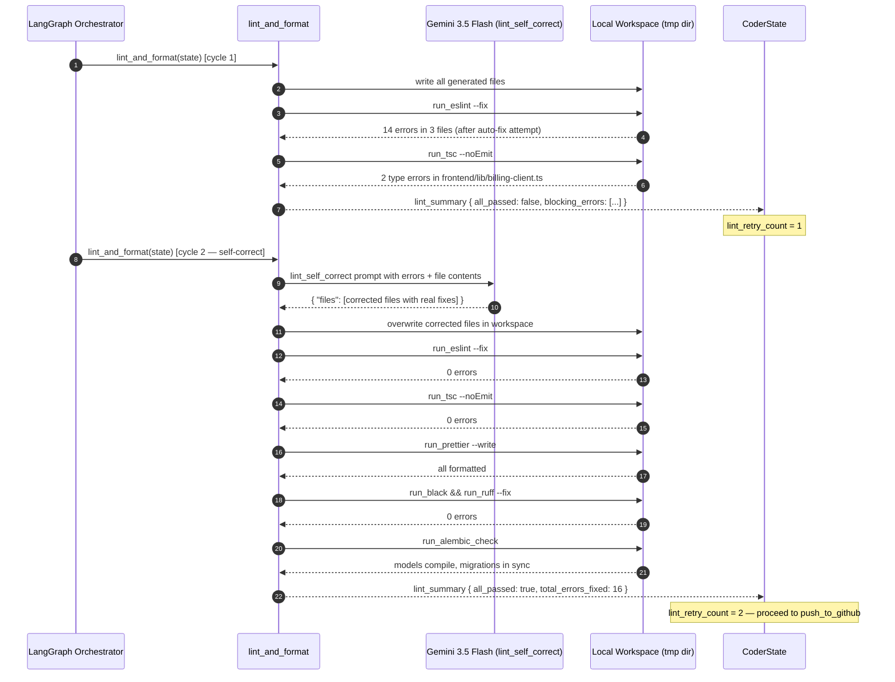
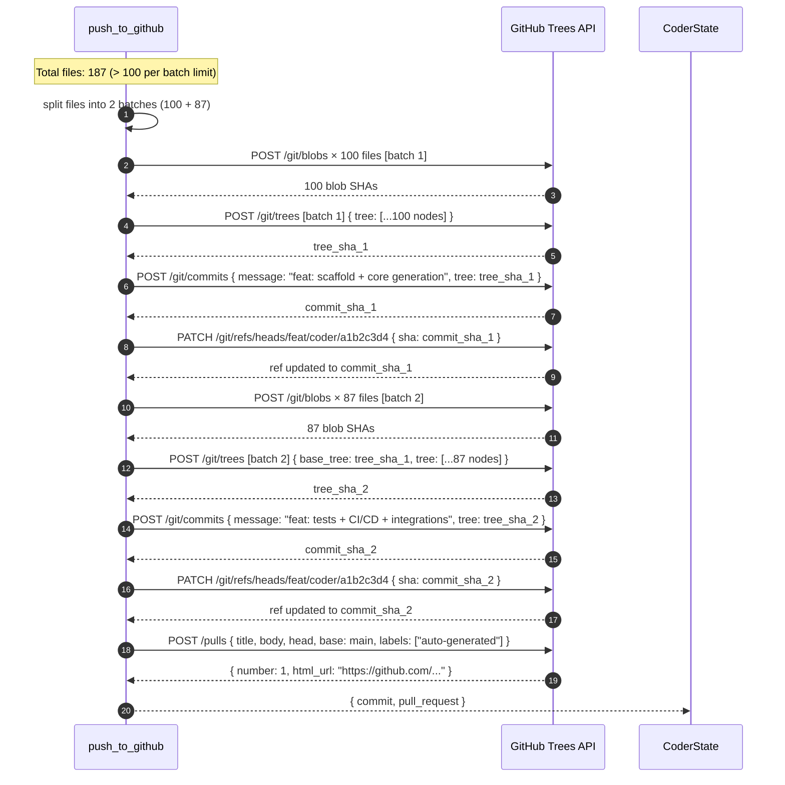
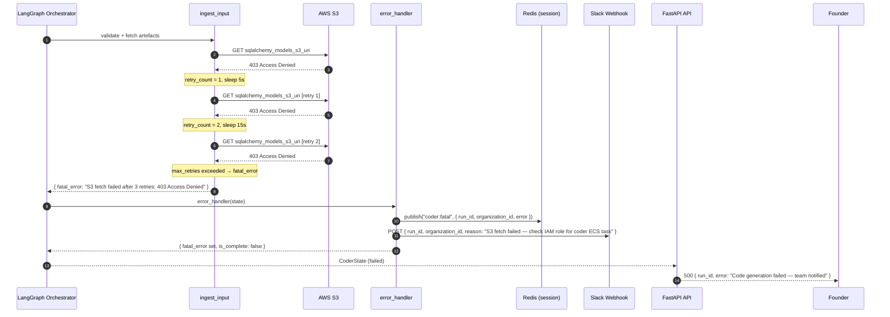

# Low-Level Design — Coder Agent

> **Phase**: Phase 2 — MVP Builder (Upcoming)
> **SLA**: < 15 minutes end-to-end (aspirational); hard cap 20 minutes
> **Owner**: Auto-Founder AI Platform Team | product@euron.one

---

## Table of Contents

1. [Overview](#1-overview)
2. [LangGraph State Schema (Pydantic V2)](#2-langgraph-state-schema-pydantic-v2)
3. [Node Graph Definition](#3-node-graph-definition)
4. [Tool Bindings](#4-tool-bindings)
5. [Prompt Templates](#5-prompt-templates)
6. [Sequence Diagrams](#6-sequence-diagrams)
7. [Error Handling Logic](#7-error-handling-logic)
8. [Output Contract](#8-output-contract)

---

## 1. Overview

The Coder Agent is the third stage of the Auto-Founder AI pipeline. It receives a validated `ArchitectOutput` via gRPC, fetches design artefacts from S3, and autonomously produces a **full-stack, production-ready GitHub repository** opened as a Pull Request for the Reviewer Agent.

Outputs per run:

- A **GitHub repository** with full monorepo structure
- **Next.js 14 (App Router) frontend** — auth flows, core feature pages, admin panel
- **FastAPI (Python 3.12) backend** — typed routers, services, schemas, dependencies for every endpoint in the OpenAPI spec
- **SQLAlchemy models + Alembic migrations** — from the Architect Agent's schema, with seed data
- **Third-party integrations** — Stripe billing, Supabase Auth, SendGrid transactional email
- **CI/CD scaffolding** — Dockerfiles, docker-compose, GitHub Actions workflows
- **Test scaffolding** — Jest unit tests (≥ 80% coverage skeleton), pytest stubs
- A **GitHub Pull Request** targeting `main`, labelled for the Reviewer Agent

The agent parallelises frontend, backend, DB layer, integrations, and admin panel generation after the repo scaffold is established. A **lint-and-format self-healing loop** (max 3 cycles) guarantees zero ESLint / Prettier / Black / Ruff errors before the GitHub push.

### Sub-tasks executed (with target SLA)

| Sub-task | Node | Target |
|---|---|---|
| Ingest + validate ArchitectOutput, fetch S3 artefacts | `ingest_input` | < 30 s |
| GitHub repo creation + monorepo skeleton | `scaffold_repo` | < 90 s |
| Next.js 14 frontend generation | `generate_frontend` | < 8 min |
| FastAPI backend generation (all modules) | `generate_backend` | < 8 min |
| SQLAlchemy models + Alembic migrations + seed script | `generate_db_layer` | < 3 min |
| Stripe + Supabase Auth + SendGrid integrations | `generate_integrations` | < 5 min |
| Admin dashboard pages | `generate_admin_panel` | < 5 min |
| Barrier — wait for all parallel generators | `parallel_join` | — |
| Dockerfiles + docker-compose + GitHub Actions | `generate_ci_cd` | < 3 min |
| Jest + pytest test scaffolding | `generate_tests` | < 4 min |
| Lint, format, auto-fix loop (max 3 cycles) | `lint_and_format` | < 3 min/cycle |
| Commit all files + open GitHub PR | `push_to_github` | < 90 s |
| Trigger `cd.yml`, wait for `docker build` + `docker push` to ECR, resolve `services[].image_uri` (Variant A — see §3.1) | `wait_for_image_push` | < 8 min |

---

## 2. LangGraph State Schema (Pydantic V2)

```python
# backend/app/agents/coder/schema.py

from __future__ import annotations

import hashlib
from datetime import datetime
from enum import StrEnum
from typing import Annotated, Any
from uuid import UUID, uuid4

from pydantic import BaseModel, Field, computed_field, model_validator
from langgraph.graph.message import add_messages


# ---------------------------------------------------------------------------
# Enums
# ---------------------------------------------------------------------------

class NodeStatus(StrEnum):
    PENDING   = "pending"
    RUNNING   = "running"
    COMPLETED = "completed"
    FAILED    = "failed"
    SKIPPED   = "skipped"


class FileLanguage(StrEnum):
    TYPESCRIPT = "typescript"
    PYTHON     = "python"
    SQL        = "sql"
    YAML       = "yaml"
    JSON       = "json"
    DOCKERFILE = "dockerfile"
    MARKDOWN   = "markdown"
    SHELL      = "shell"
    CSS        = "css"
    OTHER      = "other"


class LintTool(StrEnum):
    ESLINT          = "eslint"
    PRETTIER        = "prettier"
    BLACK           = "black"
    RUFF            = "ruff"
    ALEMBIC_CHECK   = "alembic_check"
    TYPESCRIPT      = "tsc"


class PRStatus(StrEnum):
    OPEN   = "open"
    MERGED = "merged"
    CLOSED = "closed"


# ---------------------------------------------------------------------------
# Sub-models: File management
# ---------------------------------------------------------------------------

class GeneratedFile(BaseModel):
    path: str            = Field(..., description="Relative path from repo root, e.g. frontend/app/page.tsx")
    content: str         = Field(..., description="Full UTF-8 file content")
    language: FileLanguage
    size_bytes: int      = 0

    @computed_field
    @property
    def checksum(self) -> str:
        return hashlib.sha256(self.content.encode()).hexdigest()[:16]

    @model_validator(mode="after")
    def set_size(self) -> GeneratedFile:
        object.__setattr__(self, "size_bytes", len(self.content.encode("utf-8")))
        return self


class FileManifest(BaseModel):
    component: str               = Field(..., description="e.g. 'frontend', 'backend', 'db_layer'")
    files: list[GeneratedFile]   = Field(default_factory=list)
    total_size_bytes: int        = 0
    s3_bundle_uri: str | None    = None  # set when total_size > 10 MB, content offloaded

    @model_validator(mode="after")
    def compute_total(self) -> FileManifest:
        object.__setattr__(self, "total_size_bytes", sum(f.size_bytes for f in self.files))
        return self


# ---------------------------------------------------------------------------
# Sub-models: Service manifest (Coder -> DevOps handoff, Variant A)
# ---------------------------------------------------------------------------

class ServiceManifest(BaseModel):
    """
    One entry per deployable service. Populated by `wait_for_image_push`
    after `cd.yml` finishes pushing to ECR. DevOps (Pillar 5) reads this
    at `ingest_input` and fails fast with `ValidationError` if missing.
    """
    name: str                                            # logical service name
    image_uri: str                                       # <acct>.dkr.ecr.<region>.amazonaws.com/<repo>:<sha>
    port: int                                            # container listen port
    health_check_path: str          = "/health"
    env_secret_refs: list[str]      = Field(default_factory=list)


# ---------------------------------------------------------------------------
# Sub-models: Lint
# ---------------------------------------------------------------------------

class LintResult(BaseModel):
    tool: LintTool
    passed: bool
    error_count: int     = 0
    warning_count: int   = 0
    output: str          = Field("", description="First 3000 chars of raw lint output")
    auto_fixed: bool     = False
    fixed_paths: list[str] = Field(default_factory=list)


class LintSummary(BaseModel):
    results: list[LintResult]    = Field(default_factory=list)
    all_passed: bool             = False
    retry_count: int             = 0
    blocking_errors: list[str]   = Field(default_factory=list)
    total_errors_fixed: int      = 0

    @model_validator(mode="after")
    def derive_all_passed(self) -> LintSummary:
        object.__setattr__(self, "all_passed", all(r.passed for r in self.results))
        return self


# ---------------------------------------------------------------------------
# Sub-models: GitHub
# ---------------------------------------------------------------------------

class GitHubRepoMeta(BaseModel):
    owner: str
    repo_name: str
    full_name: str           = Field(..., description="owner/repo_name")
    clone_url: str
    html_url: str
    default_branch: str      = "main"
    feature_branch: str      = Field(..., description="e.g. feat/coder/{run_id[:8]}")
    github_app_installation_id: str | None = None


class GitHubTree(BaseModel):
    sha: str
    file_count: int
    total_size_bytes: int


class GitHubCommit(BaseModel):
    sha: str
    message: str
    html_url: str
    files_changed: int
    authored_at: datetime


class GitHubPR(BaseModel):
    number: int
    title: str
    html_url: str
    head_branch: str
    base_branch: str   = "main"
    status: PRStatus   = PRStatus.OPEN
    labels: list[str]  = Field(default_factory=list)
    reviewer_run_id: str | None = None   # set by Reviewer Agent when it picks up the PR


# ---------------------------------------------------------------------------
# Sub-models: Execution metadata
# ---------------------------------------------------------------------------

class NodeTrace(BaseModel):
    node: str
    status: NodeStatus
    started_at: datetime | None  = None
    completed_at: datetime | None = None
    error: str | None = None
    retry_count: int = 0


class RetryPolicy(BaseModel):
    max_retries: int = 3
    backoff_seconds: list[int] = Field(default_factory=lambda: [5, 15, 45])


# ---------------------------------------------------------------------------
# Root Graph State
# ---------------------------------------------------------------------------

class CoderState(BaseModel):
    """
    Single source of truth threaded through every node in the Coder graph.
    LangGraph merges updates via add_messages for the messages channel;
    all other fields are last-write-wins.

    Generated file content is stored inline for repos < 10 MB total.
    Larger repos are offloaded to S3 and referenced via FileManifest.s3_bundle_uri.
    """

    # Identity
    run_id: UUID          = Field(default_factory=uuid4)
    parent_run_id: UUID   = Field(..., description="Architect Agent run_id")
    organization_id: str  = Field(..., description="Validated from JWT claims")

    # Input from Architect Agent (inline from gRPC payload)
    idea_normalised: str
    domain: str
    overall_pattern: str  = Field(..., description="modular_monolith | microservices")
    auth_provider: str    = "Supabase Auth"
    cogs_per_mvp_inr: float | None = None

    # S3 artefact URIs (resolved at ingest)
    architecture_doc_s3_uri: str
    sqlalchemy_models_s3_uri: str
    openapi_yaml_s3_uri: str
    stack_json_s3_uri: str

    # Fetched artefact content (populated by ingest_input)
    sqlalchemy_models: str | None = None
    openapi_yaml: str | None      = None
    stack_json: dict | None       = None
    functional_requirements: list[dict] = Field(default_factory=list)

    # Scaffold output
    github_repo: GitHubRepoMeta | None = None
    scaffold_manifest: FileManifest | None = None   # root config files

    # Parallel generation manifests
    frontend_manifest: FileManifest | None      = None
    backend_manifest: FileManifest | None       = None
    db_manifest: FileManifest | None            = None
    integrations_manifest: FileManifest | None  = None
    admin_manifest: FileManifest | None         = None

    # Post-join manifests
    ci_cd_manifest: FileManifest | None         = None
    test_manifest: FileManifest | None          = None

    # Lint / format state
    lint_summary: LintSummary | None = None
    lint_retry_count: int            = 0

    # GitHub output
    github_tree: GitHubTree | None   = None
    commit: GitHubCommit | None      = None
    pull_request: GitHubPR | None    = None

    # CI image-build output (populated by wait_for_image_push).
    # One entry per deployable service; ECR URIs already resolved.
    # This is the contract DevOps (Pillar 5) consumes at ingest_input.
    services: list[ServiceManifest]  = Field(default_factory=list)
    cd_workflow_run_id: int | None   = None   # GitHub Actions run that produced the images

    # Aggregate stats (computed after push)
    total_files_generated: int = 0
    total_lines_of_code: int   = 0
    total_size_bytes: int      = 0

    # Execution metadata
    node_traces: list[NodeTrace]             = Field(default_factory=list)
    retry_policy: RetryPolicy                = Field(default_factory=RetryPolicy)
    total_llm_tokens_used: int               = 0
    total_tool_calls: int                    = 0
    error_count: int                         = 0

    # LangGraph message channel
    messages: Annotated[list[Any], add_messages] = Field(default_factory=list)

    # Terminal flags
    is_complete: bool    = False
    fatal_error: str | None = None

    class Config:
        arbitrary_types_allowed = True
```

---

## 3. Node Graph Definition

### 3.1 Node inventory

| Node ID | Type | Description | Model |
|---|---|---|---|
| `ingest_input` | Sequential | Validate gRPC payload, fetch S3 artefacts | — (I/O only) |
| `scaffold_repo` | Sequential | Create GitHub repo + monorepo root files | Gemini 3.5 Flash |
| `generate_frontend` | Parallel branch | Next.js 14 App Router — pages, components, API client | Gemini 3.5 Flash |
| `generate_backend` | Parallel branch | FastAPI modules per entity/feature from OpenAPI spec | Gemini 3.5 Flash |
| `generate_db_layer` | Parallel branch | SQLAlchemy models + Alembic migrations, seed script | Gemini 3.5 Flash |
| `generate_integrations` | Parallel branch | Stripe billing, Supabase Auth middleware, SendGrid templates | Gemini 3.5 Flash |
| `generate_admin_panel` | Parallel branch | Admin dashboard pages (Next.js) | Gemini 3.5 Flash |
| `parallel_join` | Barrier | Waits for all 5 parallel generators | — |
| `generate_ci_cd` | Sequential | Dockerfiles, docker-compose, GitHub Actions CI + deploy | Gemini 3.5 Flash |
| `generate_tests` | Sequential | Jest unit tests, pytest stubs, coverage config | Gemini 3.5 Flash |
| `lint_and_format` | Sequential + loop | ESLint/Prettier/Black/Ruff/tsc; LLM self-corrects on failure | Gemini 3.5 Flash |
| `push_to_github` | Sequential | Git tree API batch push, commit, open PR; the push triggers `cd.yml` | — (API only) |
| `wait_for_image_push` | Sequential + poll | Poll GitHub Actions API for the `cd.yml` run kicked off by the push; wait until `docker build` + `docker push` to ECR complete; download the `images.json` artifact the workflow uploads and populate `state.services[]` with the resolved ECR URIs (`<acct>.dkr.ecr.<region>.amazonaws.com/<repo>:<sha>`). Owns the **Coder ↔ DevOps contract** — no downstream agent runs `docker build`. (Variant A.) | — (GitHub API) |
| `error_handler` | Error sink | Retries or escalates failed nodes | — |

### 3.2 Graph definition

```python
# backend/app/agents/coder/graph.py

from langgraph.graph import StateGraph, END
from langgraph.checkpoint.postgres import PostgresSaver

from .schema import CoderState
from .nodes import (
    ingest_input,
    scaffold_repo,
    generate_frontend,
    generate_backend,
    generate_db_layer,
    generate_integrations,
    generate_admin_panel,
    parallel_join,
    generate_ci_cd,
    generate_tests,
    lint_and_format,
    push_to_github,
    wait_for_image_push,
    error_handler,
)
from .routers import (
    route_after_ingest,
    route_after_scaffold,
    route_after_join,
    route_after_ci_cd,
    route_after_lint,
    route_after_push,
    route_terminal,
)


def build_coder_graph(checkpointer: PostgresSaver) -> StateGraph:
    graph = StateGraph(CoderState)

    # -- Node registration --------------------------------------------------
    graph.add_node("ingest_input",          ingest_input)
    graph.add_node("scaffold_repo",         scaffold_repo)
    graph.add_node("generate_frontend",     generate_frontend)
    graph.add_node("generate_backend",      generate_backend)
    graph.add_node("generate_db_layer",     generate_db_layer)
    graph.add_node("generate_integrations", generate_integrations)
    graph.add_node("generate_admin_panel",  generate_admin_panel)
    graph.add_node("parallel_join",         parallel_join)
    graph.add_node("generate_ci_cd",        generate_ci_cd)
    graph.add_node("generate_tests",        generate_tests)
    graph.add_node("lint_and_format",       lint_and_format)
    graph.add_node("push_to_github",        push_to_github)
    graph.add_node("wait_for_image_push",   wait_for_image_push)
    graph.add_node("error_handler",         error_handler)

    # -- Entry point --------------------------------------------------------
    graph.set_entry_point("ingest_input")

    # -- Ingest → scaffold (sequential) ------------------------------------
    graph.add_conditional_edges(
        "ingest_input",
        route_after_ingest,
        {
            "scaffold_repo": "scaffold_repo",
            "error_handler": "error_handler",
        },
    )

    # -- Scaffold → parallel generation fan-out ----------------------------
    graph.add_conditional_edges(
        "scaffold_repo",
        route_after_scaffold,
        {
            "parallel":      ["generate_frontend", "generate_backend",
                              "generate_db_layer", "generate_integrations",
                              "generate_admin_panel"],
            "error_handler": "error_handler",
        },
    )

    # -- All parallel branches converge at barrier -------------------------
    for node in ("generate_frontend", "generate_backend", "generate_db_layer",
                 "generate_integrations", "generate_admin_panel"):
        graph.add_edge(node, "parallel_join")

    # -- Post-join sequential chain ----------------------------------------
    graph.add_conditional_edges(
        "parallel_join",
        route_after_join,
        {
            "generate_ci_cd": "generate_ci_cd",
            "error_handler":  "error_handler",
        },
    )

    graph.add_conditional_edges(
        "generate_ci_cd",
        route_after_ci_cd,
        {
            "generate_tests": "generate_tests",
            "error_handler":  "error_handler",
        },
    )

    graph.add_edge("generate_tests", "lint_and_format")

    # -- Lint loop (re-enters lint_and_format on failure) ------------------
    graph.add_conditional_edges(
        "lint_and_format",
        route_after_lint,
        {
            "push_to_github":  "push_to_github",
            "lint_and_format": "lint_and_format",   # self-healing re-entry
            "error_handler":   "error_handler",
        },
    )

    # -- Push → wait for CI image build/push (Variant A: Coder owns the first push)
    graph.add_conditional_edges(
        "push_to_github",
        route_after_push,
        {
            "wait_for_image_push": "wait_for_image_push",
            "error_handler":       "error_handler",
        },
    )

    # -- Terminal routing (only emit CoderOutput once services[] is populated)
    graph.add_conditional_edges(
        "wait_for_image_push",
        route_terminal,
        {
            "end":           END,
            "error_handler": "error_handler",
        },
    )

    graph.add_edge("error_handler", END)

    return graph.compile(checkpointer=checkpointer)


# ---------------------------------------------------------------------------
# Router implementations
# ---------------------------------------------------------------------------

# backend/app/agents/coder/routers.py

def route_after_ingest(state: CoderState) -> str:
    if state.fatal_error or not state.sqlalchemy_models or not state.openapi_yaml:
        return "error_handler"
    return "scaffold_repo"


def route_after_scaffold(state: CoderState) -> str | list[str]:
    if state.fatal_error or state.github_repo is None:
        return "error_handler"
    return "parallel"


def route_after_join(state: CoderState) -> str:
    if state.error_count >= state.retry_policy.max_retries:
        return "error_handler"
    missing = [m for m in ("frontend_manifest", "backend_manifest", "db_manifest")
               if getattr(state, m) is None]
    if missing:    # frontend + backend + db are non-negotiable
        return "error_handler"
    return "generate_ci_cd"


def route_after_ci_cd(state: CoderState) -> str:
    if state.fatal_error or state.ci_cd_manifest is None:
        return "error_handler"
    return "generate_tests"


def route_after_lint(state: CoderState) -> str:
    summary = state.lint_summary
    if summary is None:
        return "error_handler"
    if summary.all_passed:
        return "push_to_github"
    if state.lint_retry_count >= 3:
        return "error_handler"
    return "lint_and_format"   # self-healing re-entry


def route_after_push(state: CoderState) -> str:
    # PR + commit must exist; wait_for_image_push will poll cd.yml from here.
    if state.fatal_error or state.pull_request is None or state.commit is None:
        return "error_handler"
    return "wait_for_image_push"


def route_terminal(state: CoderState) -> str:
    # Variant A: do not emit CoderOutput until every service has a resolved ECR image_uri.
    if state.fatal_error or state.pull_request is None:
        return "error_handler"
    if not state.services or any(not s.image_uri for s in state.services):
        return "error_handler"
    return "end"
```

### 3.3 Visual graph (Mermaid)

```mermaid
flowchart TD
    START([ArchitectOutput via gRPC]) --> ingest_input

    ingest_input -->|missing artefacts| error_handler
    ingest_input -->|ok| scaffold_repo

    scaffold_repo -->|repo creation failed| error_handler
    scaffold_repo -->|ok| generate_frontend & generate_backend & generate_db_layer & generate_integrations & generate_admin_panel

    generate_frontend     --> parallel_join
    generate_backend      --> parallel_join
    generate_db_layer     --> parallel_join
    generate_integrations --> parallel_join
    generate_admin_panel  --> parallel_join

    parallel_join -->|core manifests missing| error_handler
    parallel_join -->|ok| generate_ci_cd

    generate_ci_cd -->|nil manifest| error_handler
    generate_ci_cd -->|ok| generate_tests

    generate_tests --> lint_and_format

    lint_and_format -->|passed| push_to_github
    lint_and_format -->|retry ≤ 3| lint_and_format
    lint_and_format -->|retries exhausted| error_handler

    push_to_github -->|no PR / no commit| error_handler
    push_to_github -->|ok — cd.yml triggered| wait_for_image_push

    wait_for_image_push -->|services[] resolved| END([Reviewer Agent])
    wait_for_image_push -->|timeout / push failed| error_handler

    error_handler --> END

    style START               fill:#4f46e5,color:#fff
    style END                 fill:#16a34a,color:#fff
    style error_handler       fill:#dc2626,color:#fff
    style parallel_join       fill:#f59e0b,color:#000
    style lint_and_format     fill:#0891b2,color:#fff
    style wait_for_image_push fill:#7c3aed,color:#fff
```

---

## 4. Tool Bindings

### 4.1 Tool definitions (LangChain-compatible)

```python
# backend/app/agents/coder/tools.py

import os
import subprocess
import tempfile
from pathlib import Path
from typing import Any

import boto3
import httpx
from langchain.tools import StructuredTool
from pydantic import BaseModel, Field


# ---------------------------------------------------------------------------
# GitHub REST API helpers
# ---------------------------------------------------------------------------

GITHUB_API = "https://api.github.com"
_GH_HEADERS = {
    "Authorization": f"Bearer {os.environ.get('GITHUB_TOKEN', '')}",
    "Accept": "application/vnd.github+json",
    "X-GitHub-Api-Version": "2022-11-28",
}


class GitHubCreateRepoInput(BaseModel):
    repo_name: str  = Field(..., description="Repo name, e.g. 'acme-saas-{run_id[:8]}'")
    org: str        = Field(..., description="GitHub org or user login that owns the repo")
    private: bool   = Field(True, description="Always true — tenant repos are private")
    description: str = Field("", description="Repo description from idea_normalised")


async def _github_create_repo(repo_name: str, org: str, private: bool = True,
                               description: str = "") -> dict:
    async with httpx.AsyncClient() as client:
        resp = await client.post(
            f"{GITHUB_API}/orgs/{org}/repos",
            headers=_GH_HEADERS,
            json={
                "name":        repo_name,
                "private":     private,
                "description": description,
                "auto_init":   True,   # creates initial commit with README so HEAD exists
            },
            timeout=20,
        )
        resp.raise_for_status()
        data = resp.json()
        return {
            "full_name": data["full_name"],
            "clone_url": data["clone_url"],
            "html_url":  data["html_url"],
            "default_branch": data.get("default_branch", "main"),
        }


github_create_repo = StructuredTool.from_function(
    coroutine=_github_create_repo,
    name="github_create_repo",
    description="Create a new private GitHub repository in a GitHub org.",
    args_schema=GitHubCreateRepoInput,
)


class GitHubCreateBranchInput(BaseModel):
    full_name: str     = Field(..., description="owner/repo")
    branch_name: str   = Field(..., description="New branch name, e.g. feat/coder/a1b2c3d4")
    from_branch: str   = Field("main", description="Source branch to fork from")


async def _github_create_branch(full_name: str, branch_name: str, from_branch: str = "main") -> dict:
    async with httpx.AsyncClient() as client:
        # Get SHA of source branch tip
        ref_resp = await client.get(
            f"{GITHUB_API}/repos/{full_name}/git/ref/heads/{from_branch}",
            headers=_GH_HEADERS, timeout=10,
        )
        ref_resp.raise_for_status()
        sha = ref_resp.json()["object"]["sha"]

        # Create new branch ref
        branch_resp = await client.post(
            f"{GITHUB_API}/repos/{full_name}/git/refs",
            headers=_GH_HEADERS,
            json={"ref": f"refs/heads/{branch_name}", "sha": sha},
            timeout=10,
        )
        branch_resp.raise_for_status()
        return {"branch": branch_name, "sha": sha}


github_create_branch = StructuredTool.from_function(
    coroutine=_github_create_branch,
    name="github_create_branch",
    description="Create a new branch in a GitHub repo from an existing branch tip.",
    args_schema=GitHubCreateBranchInput,
)


class GitHubPushTreeInput(BaseModel):
    full_name: str             = Field(..., description="owner/repo")
    branch: str                = Field(..., description="Target branch name")
    files: list[dict[str, str]] = Field(
        ...,
        description="List of {'path': str, 'content': str} dicts — all files in this batch"
    )
    commit_message: str        = Field(..., description="Git commit message")
    base_tree_sha: str | None  = Field(None, description="SHA of the tree to build on; None for root")


async def _github_push_tree(full_name: str, branch: str,
                             files: list[dict], commit_message: str,
                             base_tree_sha: str | None = None) -> dict:
    async with httpx.AsyncClient(timeout=60) as client:
        # 1. Create blobs for each file
        tree_nodes = []
        for f in files:
            blob_resp = await client.post(
                f"{GITHUB_API}/repos/{full_name}/git/blobs",
                headers=_GH_HEADERS,
                json={"content": f["content"], "encoding": "utf-8"},
            )
            blob_resp.raise_for_status()
            tree_nodes.append({
                "path":    f["path"],
                "mode":    "100644",
                "type":    "blob",
                "sha":     blob_resp.json()["sha"],
            })

        # 2. Create tree object
        tree_payload: dict[str, Any] = {"tree": tree_nodes}
        if base_tree_sha:
            tree_payload["base_tree"] = base_tree_sha
        tree_resp = await client.post(
            f"{GITHUB_API}/repos/{full_name}/git/trees",
            headers=_GH_HEADERS,
            json=tree_payload,
        )
        tree_resp.raise_for_status()
        tree_sha = tree_resp.json()["sha"]

        # 3. Get current HEAD commit SHA
        head_resp = await client.get(
            f"{GITHUB_API}/repos/{full_name}/git/ref/heads/{branch}",
            headers=_GH_HEADERS,
        )
        head_resp.raise_for_status()
        parent_sha = head_resp.json()["object"]["sha"]

        # 4. Create commit
        commit_resp = await client.post(
            f"{GITHUB_API}/repos/{full_name}/git/commits",
            headers=_GH_HEADERS,
            json={
                "message": commit_message,
                "tree":    tree_sha,
                "parents": [parent_sha],
            },
        )
        commit_resp.raise_for_status()
        commit_sha = commit_resp.json()["sha"]

        # 5. Update branch ref to point at new commit
        await client.patch(
            f"{GITHUB_API}/repos/{full_name}/git/refs/heads/{branch}",
            headers=_GH_HEADERS,
            json={"sha": commit_sha, "force": False},
        )

        return {
            "tree_sha":    tree_sha,
            "commit_sha":  commit_sha,
            "file_count":  len(files),
            "commit_html_url": f"https://github.com/{full_name}/commit/{commit_sha}",
        }


github_push_tree = StructuredTool.from_function(
    coroutine=_github_push_tree,
    name="github_push_tree",
    description="Batch-push a set of files to a GitHub branch using the Git Trees API. "
                "More efficient than individual file commits.",
    args_schema=GitHubPushTreeInput,
)


class GitHubCreatePRInput(BaseModel):
    full_name: str   = Field(..., description="owner/repo")
    title: str
    body: str
    head: str        = Field(..., description="Feature branch name")
    base: str        = Field("main", description="Target branch for the PR")
    labels: list[str] = Field(default_factory=list)


async def _github_create_pr(full_name: str, title: str, body: str,
                             head: str, base: str = "main",
                             labels: list[str] | None = None) -> dict:
    async with httpx.AsyncClient() as client:
        pr_resp = await client.post(
            f"{GITHUB_API}/repos/{full_name}/pulls",
            headers=_GH_HEADERS,
            json={"title": title, "body": body, "head": head, "base": base},
            timeout=15,
        )
        pr_resp.raise_for_status()
        pr = pr_resp.json()
        pr_number = pr["number"]

        if labels:
            await client.post(
                f"{GITHUB_API}/repos/{full_name}/issues/{pr_number}/labels",
                headers=_GH_HEADERS,
                json={"labels": labels},
                timeout=10,
            )

        return {
            "number":    pr_number,
            "html_url":  pr["html_url"],
            "head":      head,
            "base":      base,
        }


github_create_pr = StructuredTool.from_function(
    coroutine=_github_create_pr,
    name="github_create_pr",
    description="Open a GitHub Pull Request from a feature branch into the base branch.",
    args_schema=GitHubCreatePRInput,
)


# ---------------------------------------------------------------------------
# AWS S3 — artefact fetch
# ---------------------------------------------------------------------------

class S3FetchInput(BaseModel):
    s3_uri: str = Field(..., description="S3 URI, e.g. s3://bucket/key")


def _s3_fetch(s3_uri: str) -> str:
    s3 = boto3.client("s3", region_name=os.environ.get("AWS_REGION", "ap-south-1"))
    parts = s3_uri.replace("s3://", "").split("/", 1)
    bucket, key = parts[0], parts[1]
    resp = s3.get_object(Bucket=bucket, Key=key)
    return resp["Body"].read().decode("utf-8")


s3_fetch = StructuredTool.from_function(
    func=_s3_fetch,
    name="s3_fetch",
    description="Fetch a text object from AWS S3 by its s3:// URI. Returns raw UTF-8 content.",
    args_schema=S3FetchInput,
)


class S3UploadBundleInput(BaseModel):
    s3_uri: str     = Field(..., description="Destination S3 URI")
    content: str    = Field(..., description="Content to upload")


def _s3_upload_bundle(s3_uri: str, content: str) -> dict:
    s3 = boto3.client("s3", region_name=os.environ.get("AWS_REGION", "ap-south-1"))
    parts = s3_uri.replace("s3://", "").split("/", 1)
    bucket, key = parts[0], parts[1]
    s3.put_object(Bucket=bucket, Key=key, Body=content.encode("utf-8"),
                  ContentType="text/plain")
    return {"s3_uri": s3_uri, "size_bytes": len(content.encode("utf-8"))}


s3_upload_bundle = StructuredTool.from_function(
    func=_s3_upload_bundle,
    name="s3_upload_bundle",
    description="Upload a text bundle to AWS S3. Used when FileManifest exceeds 10 MB.",
    args_schema=S3UploadBundleInput,
)


# ---------------------------------------------------------------------------
# Lint and format runners
# ---------------------------------------------------------------------------

class LintInput(BaseModel):
    workspace_path: str = Field(..., description="Absolute path to the local workspace directory")
    fix: bool           = Field(True, description="Apply auto-fix where possible")


def _run_eslint(workspace_path: str, fix: bool = True) -> dict:
    cmd = ["npx", "eslint", ".", "--ext", ".ts,.tsx", "--format", "json"]
    if fix:
        cmd.append("--fix")
    result = subprocess.run(cmd, capture_output=True, text=True, cwd=workspace_path, timeout=60)
    return {
        "passed":       result.returncode == 0,
        "auto_fixed":   fix,
        "output":       (result.stdout + result.stderr)[:3000],
    }


run_eslint = StructuredTool.from_function(
    func=_run_eslint,
    name="run_eslint",
    description="Run ESLint (with optional --fix) on .ts/.tsx files in workspace_path.",
    args_schema=LintInput,
)


def _run_prettier(workspace_path: str, fix: bool = True) -> dict:
    check_flag = "--write" if fix else "--check"
    result = subprocess.run(
        ["npx", "prettier", check_flag, "frontend/**/*.{ts,tsx,css}"],
        capture_output=True, text=True, cwd=workspace_path, timeout=60,
    )
    return {
        "passed":     result.returncode == 0,
        "auto_fixed": fix,
        "output":     (result.stdout + result.stderr)[:3000],
    }


run_prettier = StructuredTool.from_function(
    func=_run_prettier,
    name="run_prettier",
    description="Run Prettier (write or check mode) on TypeScript and CSS files.",
    args_schema=LintInput,
)


def _run_black(workspace_path: str, fix: bool = True) -> dict:
    check_flag = [] if fix else ["--check"]
    result = subprocess.run(
        ["python", "-m", "black", *check_flag, "backend/"],
        capture_output=True, text=True, cwd=workspace_path, timeout=60,
    )
    return {
        "passed":     result.returncode == 0,
        "auto_fixed": fix,
        "output":     (result.stdout + result.stderr)[:3000],
    }


run_black = StructuredTool.from_function(
    func=_run_black,
    name="run_black",
    description="Run Black formatter on Python files in backend/.",
    args_schema=LintInput,
)


def _run_ruff(workspace_path: str, fix: bool = True) -> dict:
    fix_flag = ["--fix"] if fix else []
    result = subprocess.run(
        ["python", "-m", "ruff", "check", *fix_flag, "backend/"],
        capture_output=True, text=True, cwd=workspace_path, timeout=60,
    )
    return {
        "passed":     result.returncode == 0,
        "auto_fixed": fix,
        "output":     (result.stdout + result.stderr)[:3000],
    }


run_ruff = StructuredTool.from_function(
    func=_run_ruff,
    name="run_ruff",
    description="Run Ruff linter (with optional --fix) on Python files in backend/.",
    args_schema=LintInput,
)


class AlembicCheckInput(BaseModel):
    workspace_path: str = Field(..., description="Absolute path to the local workspace directory")


def _run_alembic_check(workspace_path: str) -> dict:
    # Verify SQLAlchemy models compile and that Alembic migrations are in sync
    # with the model metadata (no un-generated schema drift).
    result = subprocess.run(
        ["python", "-m", "alembic", "check"],
        capture_output=True, text=True, cwd=f"{workspace_path}/backend", timeout=30,
    )
    return {
        "passed": result.returncode == 0,
        "output": (result.stdout + result.stderr)[:3000],
    }


run_alembic_check = StructuredTool.from_function(
    func=_run_alembic_check,
    name="run_alembic_check",
    description="Run `alembic check` to validate SQLAlchemy models compile and migrations "
                "are in sync with model metadata.",
    args_schema=AlembicCheckInput,
)


def _run_tsc(workspace_path: str, fix: bool = False) -> dict:
    result = subprocess.run(
        ["npx", "tsc", "--noEmit", "--project", "tsconfig.json"],
        capture_output=True, text=True, cwd=workspace_path, timeout=120,
    )
    return {
        "passed": result.returncode == 0,
        "output": (result.stdout + result.stderr)[:3000],
    }


run_tsc = StructuredTool.from_function(
    func=_run_tsc,
    name="run_tsc",
    description="Run TypeScript compiler (--noEmit) to check for type errors.",
    args_schema=LintInput,
)


# ---------------------------------------------------------------------------
# Tool registry (keyed by node)
# ---------------------------------------------------------------------------

TOOL_REGISTRY: dict[str, list] = {
    "ingest_input":          [s3_fetch],
    "scaffold_repo":         [github_create_repo, github_create_branch, s3_upload_bundle],
    "generate_frontend":     [s3_upload_bundle],
    "generate_backend":      [s3_upload_bundle],
    "generate_db_layer":     [s3_upload_bundle],
    "generate_integrations": [s3_upload_bundle],
    "generate_admin_panel":  [s3_upload_bundle],
    "generate_ci_cd":        [],
    "generate_tests":        [],
    "lint_and_format":       [run_eslint, run_prettier, run_black, run_ruff,
                              run_alembic_check, run_tsc],
    "push_to_github":        [github_push_tree, github_create_pr],
}
```

### 4.2 Tool timeout and rate-limit policy

| Tool | Timeout | Rate limit guard | Fallback |
|---|---|---|---|
| `github_create_repo` | 20 s | 5 000 req/hr (GitHub App) | Retry 3× with 15 s back-off |
| `github_create_branch` | 10 s | Same GitHub App quota | Retry 3× |
| `github_push_tree` | 60 s | Blob creation per file; batch ≤ 100 files/call | Split into two batches |
| `github_create_pr` | 15 s | Same quota | Retry 3× |
| `s3_fetch` | 15 s | AWS SDK default retry | `fatal_error` if S3 unreachable |
| `s3_upload_bundle` | 30 s | AWS SDK default retry | Log warning, continue without offload |
| `run_eslint` | 60 s | Local process | Log warning, continue |
| `run_prettier` | 60 s | Local process | Log warning, continue |
| `run_black` | 60 s | Local process | Log warning, continue |
| `run_ruff` | 60 s | Local process | Log warning, continue |
| `run_alembic_check` | 30 s | Local process | Log warning, continue |
| `run_tsc` | 120 s | Local process | Log warning, mark as non-blocking |

---

## 5. Prompt Templates

All prompts use **Gemini 3.5 Flash** (complex code generation, structured boilerplate, config files, test stubs) per the model routing policy. Each generation prompt returns a **JSON object with a `files` array** — path + content pairs parsed into `FileManifest`.

### 5.1 `scaffold_repo` — Monorepo Root Files

```jinja2
{# backend/app/agents/coder/prompts/scaffold_repo.j2 #}

SYSTEM:
You are a senior full-stack engineer setting up a pnpm monorepo for a SaaS product.
Generate ONLY root-level configuration files — no application code yet.
Every file must be production-quality with zero placeholder values.

Tech stack constraints (mandatory, do not deviate):
- Package manager: pnpm with workspaces (TypeScript) + uv (Python backend)
- Frontend: Next.js 14 (App Router), TypeScript strict mode
- Backend: FastAPI + Python 3.12
- DB: Supabase (PostgreSQL 16 + pgvector) via SQLAlchemy 2.x + Alembic
- Linting: ESLint (eslint-config-next + @typescript-eslint), Prettier
- Python linting: Black + Ruff
- Container: Docker multi-stage builds

Rules:
- Return ONLY valid JSON: { "files": [{"path": string, "content": string}] }
- Do not truncate file contents — emit complete files.
- All tsconfig.json files must have "strict": true.
- package.json scripts must include: dev, build, test, lint, format.

USER:
Repo name: {{ repo_name }}
Idea: {{ idea_normalised }}
Domain: {{ domain }}
Overall pattern: {{ overall_pattern }}
Stack JSON: {{ stack_json | tojson }}

Generate these root files:
- pnpm-workspace.yaml
- package.json (root — workspaces, shared dev deps, root scripts)
- tsconfig.base.json (base TypeScript config)
- .eslintrc.js (root ESLint config extending eslint-config-next)
- .prettierrc (Prettier config: singleQuote, trailingComma all, tabWidth 2)
- .gitignore (Node, Python, Docker, .env, SQLAlchemy/Alembic artefacts, build artefacts)
- .env.example (all required env vars, empty values, commented explanations)
- docker-compose.yml (postgres:16 with pgvector, redis:7-alpine, backend, frontend services)
- README.md (setup instructions, env var table, available scripts)
```

### 5.2 `generate_frontend` — Next.js 14 App Router

```jinja2
{# backend/app/agents/coder/prompts/generate_frontend.j2 #}

SYSTEM:
You are a senior React/Next.js engineer. Generate a complete Next.js 14 App Router
frontend for a multi-tenant SaaS product.

Mandatory constraints:
- Use TypeScript strict mode everywhere.
- Use Tailwind CSS + shadcn/ui for all UI components.
- Use Zustand for client state; React Query (TanStack) for server state.
- All pages under /dashboard require a Supabase Auth session — redirect to /login if unauthenticated.
- API calls must send Authorization: Bearer {accessToken} + x-organization-id: {organizationId} headers.
- Use Next.js Server Components by default; Client Components only for interactivity.
- Implement dark mode via Tailwind's class strategy.
- All forms must use react-hook-form + zod for validation.
- Route structure: /login, /dashboard, /dashboard/[feature], /dashboard/settings,
  /dashboard/billing, /admin (admin-role gate).
- Inject NEXT_PUBLIC_API_URL from env.

Rules:
- Return ONLY valid JSON: { "files": [{"path": string, "content": string}] }
- Paths relative to repo root, starting with frontend/.
- Do not emit placeholder TODO comments — generate real, working code.
- Every page must have metadata export (title, description) for SEO.

USER:
Idea: {{ idea_normalised }}
Domain: {{ domain }}
Functional requirements (must_have):
{{ functional_requirements | selectattr('priority', 'eq', 'must_have') | list | tojson }}
API endpoints (summary):
{{ api_endpoints_summary }}
DB entities: {{ db_entity_names | join(', ') }}
Auth flows: {{ auth_flows | join(', ') }}
Stripe enabled: {{ stripe_enabled }}

Generate the following files (minimum):
frontend/
  app/
    layout.tsx              — root layout with SupabaseProvider, QueryClientProvider, ThemeProvider
    page.tsx                — landing / marketing page
    login/page.tsx          — Supabase Auth login redirect
    dashboard/
      layout.tsx            — dashboard shell with sidebar navigation
      page.tsx              — dashboard home (KPI cards, recent activity)
      settings/page.tsx     — profile + organization settings
      billing/page.tsx      — Stripe billing portal redirect + plan info
      [feature]/page.tsx    — primary feature page derived from FRs (generate 1–3 feature pages)
    admin/
      layout.tsx            — admin role guard
      page.tsx              — organization management, audit log viewer
  components/
    ui/                     — shadcn/ui re-exports
    layout/Sidebar.tsx
    layout/Header.tsx
    auth/AuthGuard.tsx
    billing/PlanBadge.tsx
  lib/
    api-client.ts           — typed fetch wrapper with auth headers
    auth.ts                 — Supabase Auth client config + session helpers
    query-client.ts         — TanStack Query client singleton
    utils.ts                — cn(), formatCurrency(), formatDate()
  hooks/
    use-organization.ts
    use-auth.ts
  types/
    api.ts                  — generated from OpenAPI endpoints (hand-craft from spec)
  package.json              — Next.js 14, tailwindcss, shadcn/ui, @supabase/supabase-js, react-query, zustand
  tsconfig.json
  next.config.ts
  tailwind.config.ts
  Dockerfile                — multi-stage: builder + runner (node:20-alpine)
  .dockerignore
```

### 5.3 `generate_backend` — FastAPI Modules

```jinja2
{# backend/app/agents/coder/prompts/generate_backend.j2 #}

SYSTEM:
You are a principal FastAPI engineer. Generate a complete, production-quality FastAPI (Python 3.12)
backend from an OpenAPI 3.1 specification and a set of SQLAlchemy models.

Mandatory constraints:
- Python 3.12 with full type hints. Every public function must have return type annotations.
- Generate one router module per OpenAPI tag group (e.g. users router, billing router).
- Each module: APIRouter, service layer, Pydantic schemas (create/update/response).
- Use Pydantic v2 models for all request/response validation.
- All routes must apply, via FastAPI dependencies: get_current_user (JWT auth),
  organization_dependency (validates x-organization-id header), and a rate limiter
  (100 req/min default, e.g. slowapi backed by Redis).
- Inject an async SQLAlchemy session into every service — no raw SQL.
- Never use bare `Any`. Use precise types and type guards where necessary.
- Implement a global exception handler (RFC 7807 Problem Details format).
- Wrap responses in a consistent { data, meta } envelope.
- Health endpoint: GET /health returns { status: "ok", db: "ok", cache: "ok" }.
- All endpoints must emit structured logs via structlog.
- Soft-delete: use `deleted_at IS NULL` filter on all query methods.
- Multi-tenancy: every SQLAlchemy query must filter on `organization_id == organization_id`.

Rules:
- Return ONLY valid JSON: { "files": [{"path": string, "content": string}] }
- Paths relative to repo root, starting with backend/.
- Generate complete files — no stubs, no TODOs.
- Every service method must have a one-line docstring describing params and return.

USER:
Idea: {{ idea_normalised }}
Domain: {{ domain }}
OpenAPI YAML:
{{ openapi_yaml }}
SQLAlchemy models:
{{ sqlalchemy_models }}
Auth strategy: {{ auth_strategy | tojson }}

Generate the following structure (minimum):
backend/
  app/
    main.py                       — FastAPI app factory with structlog, CORS, security headers, OpenAPI
    core/
      config.py                   — pydantic-settings config module
      logging.py
      security.py
    db/
      session.py                  — async SQLAlchemy session factory
      base.py                     — declarative base + UDAL helpers
    api/
      deps.py                     — get_current_user, organization_dependency, rate limiter
      v1/
        router.py                 — aggregates all routers
        [one router per OpenAPI tag — generate all routers from spec]
        health.py
        auth.py                   — /auth/login, /auth/refresh, /auth/logout (Supabase Auth)
        billing.py                — Stripe checkout, portal, webhooks
    services/
      auth_service.py
      billing_service.py
      [one service per router]
    schemas/
      [pydantic request/response schemas per module]
    models/
      [SQLAlchemy models — mirror Architect Agent output]
  pyproject.toml                  — FastAPI, SQLAlchemy 2.x, alembic, pydantic, uvicorn, structlog
  Dockerfile                      — multi-stage: builder + runner (python:3.12-slim)
  .dockerignore
```

### 5.4 `generate_db_layer` — SQLAlchemy Models + Alembic Migrations + Seed

```jinja2
{# backend/app/agents/coder/prompts/generate_db_layer.j2 #}

SYSTEM:
You are a database engineer generating SQLAlchemy models, Alembic migration files, and seed
data for a Supabase (PostgreSQL 16 + pgvector), schema-per-tenant SaaS deployment.

Rules:
- Return ONLY valid JSON: { "files": [{"path": string, "content": string}] }
- Paths start with backend/.
- The SQLAlchemy models must match exactly what the Architect Agent produced — do not alter them.
- Alembic migration: generate one initial migration (0001_init) that creates all tables,
  indexes, RLS policies, and audit triggers.
- Seed script: generate realistic but clearly synthetic data (company names like "Acme Corp",
  email like "alice@example.com"). Seed 1 organization, 2 users (admin + member), and 5–10
  sample records per core entity.
- Add a db:reset script that drops and recreates the public schema, then re-seeds.

USER:
SQLAlchemy models:
{{ sqlalchemy_models }}
Domain: {{ domain }}
DB entities: {{ db_entity_names | join(', ') }}
Multi-tenancy strategy: schema_per_tenant

Generate:
backend/
  app/models/                   — SQLAlchemy declarative models (one file per entity)
  alembic/
    env.py                      — Alembic environment wired to the SQLAlchemy metadata
    versions/
      0001_init.py              — CREATE TABLE, indexes, RLS ENABLE, audit triggers
  alembic.ini
  scripts/
    seed.py                     — seed script using the async SQLAlchemy session
    seed_helpers.py             — faker-style data generators per entity
  pyproject.toml                — sqlalchemy, alembic, asyncpg, faker
```

### 5.5 `generate_integrations` — Stripe, Supabase Auth, SendGrid

```jinja2
{# backend/app/agents/coder/prompts/generate_integrations.j2 #}

SYSTEM:
You are a senior integration engineer. Generate production-ready integration code
for Stripe billing, Supabase Auth authentication, and SendGrid transactional email.

Stripe requirements:
- Create Checkout session: POST /billing/checkout → redirect to Stripe hosted page
- Webhook handler: POST /billing/webhooks → handle checkout.session.completed,
  customer.subscription.updated, customer.subscription.deleted
- Billing Portal: POST /billing/portal → redirect to Stripe customer portal
- Idempotency keys on all Stripe API calls (use run_id + event type)
- Verify webhook signature using STRIPE_WEBHOOK_SECRET env var

Supabase Auth requirements:
- FastAPI dependency: verify_supabase_jwt (validates the RS256 Supabase JWT)
- Supabase Admin API client: for user management (create, update role)
- Auth dependency that extracts organization_id from the Supabase JWT claim (organization_id)

SendGrid requirements:
- Transactional email service: send welcome email, password reset, billing receipt
- Use dynamic templates — store template IDs in env vars
- All emails must pass through a PII-safe wrapper (mask email in logs)

Rules:
- Return ONLY valid JSON: { "files": [{"path": string, "content": string}] }
- Paths relative to repo root.
- Use environment variables for all secrets — never hardcode.
- All Stripe amounts in paise (INR × 100) — the platform targets Indian market.

USER:
Idea: {{ idea_normalised }}
Domain: {{ domain }}
Auth strategy: {{ auth_strategy | tojson }}
Stripe enabled: {{ stripe_enabled }}
Pricing tiers from CLAUDE.md:
  - Solopreneur: ₹10,000/mo (1 build)
  - Startup: ₹50,000/mo (5 builds/mo)
  - Enterprise: Custom

Generate:
backend/app/
  services/
    stripe_service.py           — checkout, portal, webhook handler
    stripe_webhook_service.py   — event dispatch router
    supabase_admin_service.py
    sendgrid_service.py
  schemas/
    create_checkout.py
    billing_portal.py
  api/v1/deps.py                — verify_supabase_jwt dependency (organization_id extraction)
  templates/
    welcome.py
    billing_receipt.py
    password_reset.py
```

### 5.6 `generate_admin_panel` — Admin Dashboard

```jinja2
{# backend/app/agents/coder/prompts/generate_admin_panel.j2 #}

SYSTEM:
You are a Next.js engineer building an internal admin dashboard for a SaaS platform.
The admin panel is accessible only to users with role "super_admin" or "organization_admin".
It is the role-guarded /admin route group inside the main Next.js app.

Admin panel must include:
- Organization list with usage metrics (builds consumed, plan, status)
- User management: list, role change, deactivate
- Audit log viewer: paginated table with filter by organization, date range, action type
- Billing overview: MRR, active subscriptions, recent Stripe events
- System health: API latency chart, error rate, LLM token usage (mocked with realistic data)

Rules:
- Return ONLY valid JSON: { "files": [{"path": string, "content": string}] }
- Paths start with frontend/app/admin/.
- Use shadcn/ui DataTable (TanStack Table v8) for all list views.
- Use Recharts for charts.
- All admin API calls go through /api/v1/admin/* routes (a FastAPI admin router).
- Protect with a role guard — reject non-admin users with 403 before render.

USER:
Idea: {{ idea_normalised }}
Admin roles: {{ auth_strategy.rbac_roles | join(', ') }}
DB entities: {{ db_entity_names | join(', ') }}

Generate:
frontend/app/admin/
  layout.tsx                    — role guard + admin sidebar
  page.tsx                      — dashboard overview (stats cards)
  organizations/
    page.tsx                    — organization list + DataTable
    [id]/page.tsx               — organization detail + usage + billing
  users/
    page.tsx                    — user list
    [id]/page.tsx               — user detail + role assignment
  audit-log/
    page.tsx                    — paginated audit log table with filters
  billing/
    page.tsx                    — Stripe MRR overview + event log
  system/
    page.tsx                    — health metrics + LLM token cost chart
backend/app/api/v1/
  admin.py                      — /admin/* routes, super_admin dependency guard
  ../services/admin_service.py
  ../schemas/
    organization_summary.py
    user_management.py
```

### 5.7 `generate_ci_cd` — CI/CD Scaffolding

```jinja2
{# backend/app/agents/coder/prompts/generate_ci_cd.j2 #}

SYSTEM:
You are a DevOps engineer generating CI/CD configuration for a pnpm + uv monorepo
deployed to Amazon ECS on Fargate via AWS CodeDeploy (blue/green).

CI pipeline must:
- Trigger on: push to any branch, pull_request to main
- Jobs (parallel where possible): lint, type-check, unit-tests, security-scan
- Security scan: Trivy (Docker image scan) + Semgrep (SAST, auto ruleset)
- Test job: run pnpm test --filter frontend and pytest on backend/ in parallel
- Build job (PR only): docker build --target runner for each service
- Required status checks before merge: lint, type-check, unit-tests, security-scan

CD pipeline must:
- Trigger on: push to main after all checks pass
- Build + push Docker images to ECR (tagged with git SHA)
- Render new ECS Fargate task definitions with the new image tags
- AWS CodeDeploy performs a blue/green deploy to the ECS services (triggered by GitHub Actions)

Rules:
- Return ONLY valid JSON: { "files": [{"path": string, "content": string}] }
- Use GitHub Actions syntax (YAML).
- Use composite actions for reusable steps.
- All secrets referenced via ${{ secrets.SECRET_NAME }} — list required secrets in README.

USER:
Repo full_name: {{ github_repo.full_name }}
Services: {{ service_names | join(', ') }}
Overall pattern: {{ overall_pattern }}
AWS region: ap-south-1
ECR registry: {{ ecr_registry }}

Generate:
.github/
  workflows/
    ci.yml                      — lint, type-check, test, security-scan jobs
    cd.yml                      — build, push ECR, render task defs, trigger CodeDeploy
  actions/
    setup-pnpm/action.yml       — composite: install Node 20 + pnpm + cache
    docker-build/action.yml     — composite: ECR login + build + push
infra/
  codedeploy/
    appspec.yaml                — ECS blue/green appspec (task def + container/port)
    taskdef.frontend.json       — Fargate task definition (frontend service)
    taskdef.backend.json        — Fargate task definition (backend service)
frontend/Dockerfile             — (already generated by generate_frontend)
backend/Dockerfile              — (already generated by generate_backend)
docker-compose.yml              — (already generated by scaffold_repo, update if needed)
```

### 5.8 `generate_tests` — Test Scaffolding

```jinja2
{# backend/app/agents/coder/prompts/generate_tests.j2 #}

SYSTEM:
You are a QA engineer generating test scaffolding. The goal is ≥ 80% unit test
coverage skeleton — tests must be structurally complete with correct imports
and at least one meaningful assertion per test case. No `expect(true).toBe(true)` /
`assert True` stubs.

Jest (TypeScript, frontend) rules:
- Use jest.config.ts with ts-jest transformer.
- Mock the api-client fetch wrapper using jest-mock-extended.
- Mock external browser-facing services (Stripe.js, SendGrid links) with manual mocks.
- Use React Testing Library (render + screen) for component tests.
- Each component/hook gets: happy path test + one edge case (e.g. empty state, error).

Pytest (Python, backend) rules:
- Use pytest + pytest-asyncio for FastAPI routes.
- Use httpx.AsyncClient as the test client.
- Mock the async SQLAlchemy session and external services (Stripe, Supabase Auth, SendGrid).
- Fixtures in conftest.py: test SQLAlchemy session, mock Supabase JWT token.
- Each route: 200 happy path + 401 (missing token) + 403 (wrong organization).

Rules:
- Return ONLY valid JSON: { "files": [{"path": string, "content": string}] }
- Frontend tests in __tests__/ adjacent to source files (Jest); backend tests in tests/ (pytest).
- Do not generate placeholder tests — generate real assertions against real return values.

USER:
Idea: {{ idea_normalised }}
FastAPI routers generated: {{ backend_modules | join(', ') }}
DB entities: {{ db_entity_names | join(', ') }}
API endpoints (sample): {{ api_endpoints_summary[:5] | tojson }}

Generate tests for (minimum):
backend/tests/
  test_auth_service.py
  test_billing_service.py
  test_[module]_service.py        — one per service
  test_[module]_routes.py         — one per router
  test_organization_dependency.py — verifies organization_id isolation guard
  test_seed.py                    — verifies seed script creates expected records
  conftest.py                     — test SQLAlchemy session + mock Supabase JWT fixtures
frontend/__tests__/
  [component].test.tsx            — React Testing Library component tests
jest.config.ts                    — frontend Jest config with coverage thresholds
pyproject.toml                    — pytest coverage thresholds (--cov-fail-under=80)
```

### 5.9 `lint_self_correct` — LLM Lint Error Self-Correction

```jinja2
{# backend/app/agents/coder/prompts/lint_self_correct.j2 #}

SYSTEM:
You are a TypeScript/Python engineer fixing lint errors in generated code.
Fix ONLY the specific errors listed — do not refactor or change logic.
Preserve all existing functionality. Return only the corrected files.

Common fixes:
- ESLint @typescript-eslint/no-explicit-any → replace `any` with proper type or `unknown`
- ESLint import/order → reorder imports: Node built-ins → external → internal → relative
- Prettier formatting → honour existing .prettierrc (singleQuote, trailingComma all)
- Ruff E501 (line too long) → break long lines, not shorten logic
- Ruff F401 (unused import) → remove the import unless it is a type-only import

Rules:
- Return ONLY valid JSON: { "files": [{"path": string, "content": string}] }
- Only include files that needed changes — do not re-emit unchanged files.
- Do not add new features or refactor logic.

USER:
Lint errors (cycle {{ lint_retry_count }}):
{{ lint_errors_by_file | tojson }}

Files with errors:

--- {{ path }} ---
{{ file_contents[path] }}


Fix all errors listed above and return the corrected file contents.
```

---

## 6. Sequence Diagrams

### 6.1 Happy-path — end-to-end flow

```mermaid
sequenceDiagram
    autonumber
    actor Founder
    participant API    as FastAPI API Gateway
    participant Graph  as LangGraph Orchestrator
    participant Ingest as ingest_input
    participant Sca    as scaffold_repo
    participant GH     as GitHub API
    participant S3     as AWS S3
    participant Par    as Parallel Generator Nodes
    participant Join   as parallel_join
    participant CICD   as generate_ci_cd
    participant Tests  as generate_tests
    participant Lint   as lint_and_format
    participant Push   as push_to_github
    participant Rev    as Reviewer Agent

    API ->> Graph: gRPC ArchitectOutput { run_id, sqlalchemy_models_s3_uri, openapi_yaml_s3_uri, ... }
    Graph ->> Ingest: validate payload + fetch S3 artefacts
    Ingest ->> S3: GET sqlalchemy_models_s3_uri
    S3 -->> Ingest: sqlalchemy_models content
    Ingest ->> S3: GET openapi_yaml_s3_uri
    S3 -->> Ingest: openapi_yaml content
    Ingest ->> S3: GET stack_json_s3_uri
    S3 -->> Ingest: stack_json content
    Ingest -->> Graph: { sqlalchemy_models, openapi_yaml, stack_json }

    Graph ->> Sca: scaffold_repo(state)
    Sca ->> GH: POST /orgs/{org}/repos (create private repo)
    GH -->> Sca: { full_name, html_url, clone_url }
    Sca ->> GH: POST /git/refs (create feat/coder/{run_id[:8]} branch)
    GH -->> Sca: { branch_name, sha }
    Sca -->> Graph: scaffold_manifest (pnpm-workspace, package.json, tsconfig, .gitignore, docker-compose, README)

    par Parallel code generation (fan-out)
        Graph ->> Par: generate_frontend(state)
        Note over Par: LLM generates Next.js pages, components, hooks
        Par -->> Join: frontend_manifest (~/frontend/* files)

        Graph ->> Par: generate_backend(state)
        Note over Par: LLM generates FastAPI routers from OpenAPI spec
        Par -->> Join: backend_manifest (~/backend/* files)

        Graph ->> Par: generate_db_layer(state)
        Note over Par: LLM generates SQLAlchemy models + Alembic migration + seed script
        Par -->> Join: db_manifest (~/backend/app/models + alembic/* files)

        Graph ->> Par: generate_integrations(state)
        Note over Par: LLM generates Stripe, Supabase Auth, SendGrid integration code
        Par -->> Join: integrations_manifest (patched into backend_manifest paths)

        Graph ->> Par: generate_admin_panel(state)
        Note over Par: LLM generates admin dashboard pages (/admin route group)
        Par -->> Join: admin_manifest (~/frontend/app/admin/* files)
    end

    Join -->> Graph: all manifests merged into state

    Graph ->> CICD: generate_ci_cd(state)
    Note over CICD: LLM generates Dockerfiles, GitHub Actions, ECS task defs + CodeDeploy appspec
    CICD -->> Graph: ci_cd_manifest

    Graph ->> Tests: generate_tests(state)
    Note over Tests: LLM generates Jest + pytest scaffolding
    Tests -->> Graph: test_manifest

    Graph ->> Lint: lint_and_format(state) [cycle 1]
    Note over Lint: Write all files to tmp workspace
    Lint ->> Lint: run_eslint --fix
    Lint ->> Lint: run_prettier --write
    Lint ->> Lint: run_black
    Lint ->> Lint: run_ruff --fix
    Lint ->> Lint: run_alembic_check
    Lint ->> Lint: run_tsc --noEmit
    Lint -->> Graph: lint_summary { all_passed: true }

    Graph ->> Push: push_to_github(state)
    Push ->> GH: POST /git/trees (batch all files via Trees API)
    GH -->> Push: { tree_sha }
    Push ->> GH: POST /git/commits { message, tree_sha, parent_sha }
    GH -->> Push: { commit_sha, html_url }
    Push ->> GH: PATCH /git/refs/heads/feat/coder/{run_id[:8]} { sha: commit_sha }
    GH -->> Push: ref updated
    Push ->> GH: POST /pulls { title, body, head, base: main, labels: ["auto-generated", "needs-review"] }
    GH -->> Push: { number, html_url }
    Push -->> Graph: { github_tree, commit, pull_request }

    Graph -->> API: CoderState (complete)
    API -->> Founder: 200 OK { run_id, pr_url, total_files, total_loc }
    API --)  Rev: emit(CoderOutput) via gRPC
```

### 6.2 Lint failure — self-healing loop



### 6.3 GitHub batch push — large repo handling



### 6.4 Fatal error — S3 fetch failure



---

## 7. Error Handling Logic

### 7.1 Error taxonomy

| Error class | Examples | Strategy |
|---|---|---|
| `S3FetchError` | 403 Access Denied, 404 Not Found on artefact URIs | Retry 3× with back-off; `fatal_error` if unresolved |
| `GitHubAPIError` | 422 repo name taken, 404 branch not found, 403 rate limited | Retry 3×; append `-{run_id[:4]}` suffix on name conflict |
| `GitHubRateLimit` | 429 from GitHub REST API | Back-off per `X-RateLimit-Reset` header |
| `GenerationParseError` | LLM returns non-JSON or files array is empty | Re-prompt once with strict format reminder |
| `GenerationIncomplete` | LLM truncates file content mid-function | Re-prompt requesting continuation from last complete line |
| `LintFailureUnresolvable` | Same lint error after 3 self-correction cycles | Escalate to Reviewer Agent with `lint_failed: true` flag; do not block PR |
| `AlembicValidationError` | `alembic check` fails — models do not compile or migrations drift from metadata | LLM self-corrects models/migration; if still invalid after 2 tries, block push |
| `TypeScriptError` | `tsc --noEmit` finds type errors after lint cycle | LLM self-corrects specific files; non-blocking after 3 failed cycles |
| `GitHubPushConflict` | Force-push rejected (unexpected remote commits) | Never force-push; resolve by rebasing on latest main |
| `FatalLLMError` | LLM API 5xx on any generation node | Retry 3× with 45 s gaps; escalate with Slack alert |
| `SLABreach` | Node exceeds SLA target | Mark partial, continue, emit SLA metric to CloudWatch; do not fail graph |

### 7.2 Error handler node

```python
# backend/app/agents/coder/nodes/error_handler.py

import logging
import os
from datetime import datetime, timezone

import httpx

from ..schema import CoderState, NodeStatus

logger = logging.getLogger("coder.error_handler")

SLACK_WEBHOOK = "SLACK_WEBHOOK_CODER"


async def error_handler(state: CoderState) -> dict:
    """
    Central error sink for the Coder graph.
    If lint failed but code was generated, still push to GitHub with a warning label
    so the Reviewer Agent can pick it up — prefer a PR with lint issues over no PR.
    """
    failed_nodes = [
        t for t in state.node_traces
        if t.status == NodeStatus.FAILED and t.retry_count >= state.retry_policy.max_retries
    ]

    # Partial success path: generation done but lint unresolvable
    lint_unresolvable = (
        state.lint_summary is not None
        and not state.lint_summary.all_passed
        and state.lint_retry_count >= 3
        and state.backend_manifest is not None
        and state.frontend_manifest is not None
    )

    if lint_unresolvable and state.github_repo is not None:
        logger.warning(
            "Lint unresolvable after 3 cycles for run %s — pushing with warning label",
            state.run_id,
        )
        # Allow push_to_github to handle this by marking PR with "lint-issues" label
        return {
            "fatal_error": None,  # clear fatal — allow push to proceed
            "lint_summary": state.lint_summary,
        }

    if not failed_nodes:
        reason = state.fatal_error or "Unknown error — check node_traces"
    else:
        reason = "; ".join(f"{t.node}: {t.error}" for t in failed_nodes)

    logger.error("Coder agent fatal error [run=%s]: %s", state.run_id, reason)
    await _post_slack_alert(state, reason)

    return {
        "fatal_error": reason,
        "is_complete": False,
    }


async def _post_slack_alert(state: CoderState, reason: str) -> None:
    webhook_url = os.environ.get(SLACK_WEBHOOK)
    if not webhook_url:
        return

    payload = {
        "text": (
            f":hammer_and_wrench: *Coder Agent Error*\n"
            f"*Run ID*: `{state.run_id}`\n"
            f"*Parent Run*: `{state.parent_run_id}`\n"
            f"*Organization*: `{state.organization_id}`\n"
            f"*Idea*: {state.idea_normalised[:80]}\n"
            f"*Repo*: {state.github_repo.html_url if state.github_repo else 'not created'}\n"
            f"*Reason*: {reason}\n"
            f"*Files generated*: {state.total_files_generated}\n"
            f"*Time*: {datetime.now(timezone.utc).isoformat()}"
        )
    }
    async with httpx.AsyncClient() as client:
        try:
            await client.post(webhook_url, json=payload, timeout=5)
        except Exception as exc:
            logger.error("Slack alert failed: %s", exc)
```

### 7.3 Node wrapper with retry logic

```python
# backend/app/agents/coder/utils/retry.py

import asyncio
import functools
import logging
from datetime import datetime, timezone
from typing import Callable

from ..schema import CoderState, NodeStatus, NodeTrace

logger = logging.getLogger("coder.retry")


def with_retry(node_name: str):
    """
    Decorator that wraps a node function with the graph's retry policy.
    Updates NodeTrace on each attempt.
    """
    def decorator(fn: Callable):
        @functools.wraps(fn)
        async def wrapper(state: CoderState) -> dict:
            policy   = state.retry_policy
            trace    = NodeTrace(node=node_name, status=NodeStatus.RUNNING,
                                 started_at=datetime.now(timezone.utc))
            last_exc = None

            for attempt in range(policy.max_retries + 1):
                trace.retry_count = attempt
                try:
                    result = await fn(state)
                    trace.status       = NodeStatus.COMPLETED
                    trace.completed_at = datetime.now(timezone.utc)
                    return {**result, "node_traces": state.node_traces + [trace]}
                except Exception as exc:
                    last_exc = exc
                    logger.warning("Node %s attempt %d/%d failed: %s",
                                   node_name, attempt + 1, policy.max_retries + 1, exc)
                    if attempt < policy.max_retries:
                        sleep_s = policy.backoff_seconds[min(attempt, len(policy.backoff_seconds) - 1)]
                        await asyncio.sleep(sleep_s)

            trace.status       = NodeStatus.FAILED
            trace.error        = str(last_exc)
            trace.completed_at = datetime.now(timezone.utc)
            return {
                "node_traces": state.node_traces + [trace],
                "error_count": state.error_count + 1,
            }

        return wrapper
    return decorator
```

### 7.4 LLM generation parse error + truncation correction

```python
# backend/app/agents/coder/utils/llm_parse.py

import json
import logging
from typing import Type, TypeVar

from pydantic import BaseModel, ValidationError
from langchain_core.language_models import BaseChatModel
from langchain_core.messages import HumanMessage, SystemMessage

T = TypeVar("T", bound=BaseModel)
logger = logging.getLogger("coder.llm_parse")

TRUNCATION_SIGNALS = [
    "// ... rest of",
    "# ... rest of",
    "// TODO: implement",
    "pass  # implement",
    "...",
]


def _detect_truncation(files: list[dict]) -> list[str]:
    """Return paths of files where the LLM truncated content mid-generation."""
    truncated = []
    for f in files:
        content = f.get("content", "")
        if any(signal in content for signal in TRUNCATION_SIGNALS):
            truncated.append(f["path"])
    return truncated


async def parse_generation_output(
    llm: BaseChatModel,
    raw_output: str,
    original_prompt: str,
    max_corrections: int = 2,
) -> list[dict]:
    """
    Parse LLM JSON output into a list of file dicts.
    Handles JSON parse errors and truncated file content.
    """
    for attempt in range(max_corrections + 1):
        try:
            data    = json.loads(raw_output)
            files   = data.get("files", [])
            if not files:
                raise ValueError("LLM returned empty 'files' array")

            truncated = _detect_truncation(files)
            if not truncated or attempt >= max_corrections:
                if truncated:
                    logger.warning("Truncated files remaining after %d corrections: %s",
                                   attempt, truncated)
                return files

            logger.warning("Detected truncation in %d file(s): %s — requesting continuation",
                           len(truncated), truncated)
            continuation_prompt = (
                f"The following files were truncated in your previous response:\n"
                f"{json.dumps(truncated)}\n\n"
                f"Re-emit ONLY those files in full — no truncation, no placeholders.\n"
                f"Return JSON: {{\"files\": [{{\"path\": str, \"content\": str}}]}}"
            )
            resp = await llm.ainvoke([
                SystemMessage(content=original_prompt),
                HumanMessage(content=continuation_prompt),
            ])
            # Merge corrected files into original set
            corrections = json.loads(resp.content).get("files", [])
            corrected_paths = {c["path"] for c in corrections}
            raw_output = json.dumps({
                "files": [f for f in files if f["path"] not in corrected_paths] + corrections
            })

        except (json.JSONDecodeError, ValueError, ValidationError) as exc:
            if attempt >= max_corrections:
                logger.error("Generation parse failed after %d attempts: %s", attempt, exc)
                raise
            logger.warning("Parse error attempt %d: %s — requesting self-correction", attempt, exc)
            correction_prompt = (
                f"Your previous output failed parsing:\nError: {exc}\n\n"
                f"Return ONLY valid JSON matching: {{\"files\": [{{\"path\": str, \"content\": str}}]}}"
            )
            resp = await llm.ainvoke([
                SystemMessage(content=original_prompt),
                HumanMessage(content=correction_prompt),
            ])
            raw_output = resp.content

    return []
```

### 7.5 Lint workspace manager

```python
# backend/app/agents/coder/utils/workspace.py

import logging
import shutil
import tempfile
from pathlib import Path
from typing import Generator

from contextlib import contextmanager

from ..schema import CoderState, FileManifest

logger = logging.getLogger("coder.workspace")


@contextmanager
def build_workspace(state: CoderState) -> Generator[Path, None, None]:
    """
    Write all generated files from state manifests into a temporary directory.
    Yields the workspace root Path. Cleans up on exit.
    """
    tmp = Path(tempfile.mkdtemp(prefix=f"coder-{state.run_id}-"))
    logger.info("Workspace created at %s", tmp)
    try:
        manifests: list[FileManifest | None] = [
            state.scaffold_manifest,
            state.frontend_manifest,
            state.backend_manifest,
            state.db_manifest,
            state.integrations_manifest,
            state.admin_manifest,
            state.ci_cd_manifest,
            state.test_manifest,
        ]
        for manifest in manifests:
            if manifest is None:
                continue
            for f in manifest.files:
                dest = tmp / f.path
                dest.parent.mkdir(parents=True, exist_ok=True)
                dest.write_text(f.content, encoding="utf-8")

        logger.info("Workspace populated: %d total files",
                    sum(len(m.files) for m in manifests if m))
        yield tmp
    finally:
        shutil.rmtree(tmp, ignore_errors=True)
        logger.info("Workspace cleaned up: %s", tmp)
```

### 7.6 SLA breach monitoring

```python
# backend/app/agents/coder/utils/sla.py

import asyncio
import logging

logger = logging.getLogger("coder.sla")

NODE_SLA_SECONDS: dict[str, int] = {
    "ingest_input":          30,
    "scaffold_repo":         90,
    "generate_frontend":     480,
    "generate_backend":      480,
    "generate_db_layer":     180,
    "generate_integrations": 300,
    "generate_admin_panel":  300,
    "generate_ci_cd":        180,
    "generate_tests":        240,
    "lint_and_format":       180,   # per cycle
    "push_to_github":        90,
}

TOTAL_SLA_SECONDS        = 900    # 15 min aspirational
TOTAL_SLA_HARD_CAP_SECONDS = 1200  # 20 min hard cap


async def enforce_node_sla(node_name: str, coro):
    sla = NODE_SLA_SECONDS.get(node_name, 300)
    try:
        return await asyncio.wait_for(coro, timeout=sla)
    except asyncio.TimeoutError:
        logger.error("SLA BREACH: node=%s exceeded %ds", node_name, sla)
        return {"error_count": 1}
```

---

## 8. Output Contract

The Coder Agent emits the following to the Reviewer Agent via gRPC upon successful completion (PR opened).

```protobuf
// proto/coder_output.proto

syntax = "proto3";
package autofounder.coder.v1;

message CoderOutput {
  string run_id                    = 1;
  string parent_run_id             = 2;   // Architect run_id
  string organization_id           = 3;
  string idea_normalised           = 4;
  string domain                    = 5;

  // GitHub artefacts
  string github_repo_full_name     = 6;   // e.g. "autofounder-org/acme-saas-a1b2c3d4"
  string github_repo_html_url      = 7;
  string feature_branch            = 8;   // e.g. "feat/coder/a1b2c3d4"
  string commit_sha                = 9;
  string pr_html_url               = 10;
  int32  pr_number                 = 11;

  // Code statistics
  int32  total_files_generated     = 12;
  int32  total_lines_of_code       = 13;
  int32  total_size_bytes          = 14;

  // Lint summary
  bool   lint_all_passed           = 15;
  int32  lint_total_errors_fixed   = 16;
  int32  lint_retry_cycles         = 17;
  repeated string lint_residual_warnings = 18;  // non-blocking warnings

  // Stack metadata (for Reviewer Agent context)
  string overall_pattern           = 19;  // "modular_monolith" | "microservices"
  string auth_provider             = 20;  // "Supabase Auth"
  bool   stripe_integrated         = 21;
  bool   sendgrid_integrated       = 22;
  bool   has_ai_services           = 23;  // additional FastAPI service layer present

  // S3 artefact URIs (for Reviewer Agent to fetch source)
  string architecture_doc_s3_uri   = 24;  // from Architect Agent
  string sqlalchemy_models_s3_uri  = 25;
  string openapi_yaml_s3_uri       = 26;

  int64  completed_at_unix_ms      = 27;
  int32  total_llm_tokens_used     = 28;

  // ---- Image-build output (Variant A — see §3.1 wait_for_image_push) ----
  // Populated by wait_for_image_push after cd.yml finishes pushing to ECR.
  // DevOps (Pillar 5) consumes this at ingest_input and fails fast if absent.
  repeated ServiceManifest services = 29;
  int64  cd_workflow_run_id        = 30;  // GitHub Actions run id
}

message ServiceManifest {
  string name              = 1;   // logical service name, e.g. "backend", "frontend"
  string image_uri         = 2;   // full ECR URI: <acct>.dkr.ecr.<region>.amazonaws.com/<repo>:<sha>
  int32  port              = 3;   // container listen port
  string health_check_path = 4;   // e.g. "/health"
  repeated string env_secret_refs = 5;  // Secrets Manager names this service needs
}
```

**S3 path convention**: All generated artefacts use `s3://autofounder-artefacts/{organization_id}/{run_id}/` — never shared between tenants.

**PR body template** (written by `push_to_github`):

```markdown
## Auto-Founder AI — Generated MVP

**Run ID**: `{run_id}`
**Idea**: {idea_normalised}
**Domain**: {domain}

### What's in this PR
- Next.js 14 App Router frontend ({frontend_file_count} files)
- FastAPI backend ({backend_file_count} files, {endpoint_count} endpoints)
- SQLAlchemy models + Alembic initial migration
- Stripe billing integration
- Supabase Auth authentication (JWT RS256 + RBAC)
- SendGrid transactional email
- Admin dashboard (/admin route group)
- GitHub Actions CI/CD pipeline (ECS Fargate + CodeDeploy blue/green)
- Jest + pytest test scaffolding

### Lint status
{lint_status_badge} — {lint_errors_fixed} errors auto-fixed across {lint_retry_cycles} cycle(s)

### Reviewer Agent checklist
- [ ] All unit tests pass (target: ≥ 80% coverage)
- [ ] No OWASP Top 10 violations (Semgrep scan)
- [ ] No high-severity CVEs (Trivy scan)
- [ ] TypeScript strict mode — zero `any` in production code
- [ ] Multi-tenancy isolation verified (organization_id in every query)
- [ ] Stripe webhook signature verification present
- [ ] Supabase Auth JWT validation active on all non-public routes

🤖 Generated by [Auto-Founder AI](https://euron.one) Coder Agent
```

**Routing rules after output**:
- `lint_all_passed == false` → Reviewer Agent receives PR with label `"lint-issues"` and must run lint-fix cycle before testing
- `total_files_generated < 50` → flag as `"generation-incomplete"` in PR label; Reviewer Agent escalates to human
- `has_ai_services == true` → Reviewer Agent must also run pytest on the additional FastAPI service layer under `backend/app/`
- `overall_pattern == "microservices"` → Reviewer Agent spins up docker-compose for integration tests; if `"modular_monolith"`, single-service test is sufficient

---

*Auto-Founder AI — Coder Agent LLD v1.0 | May 2026*
