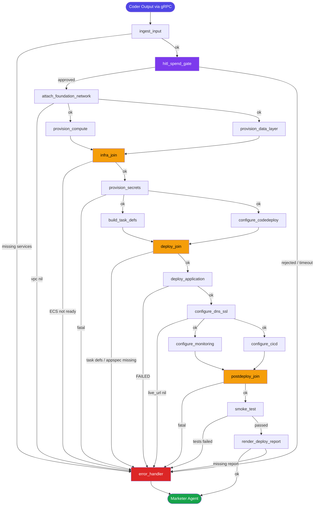
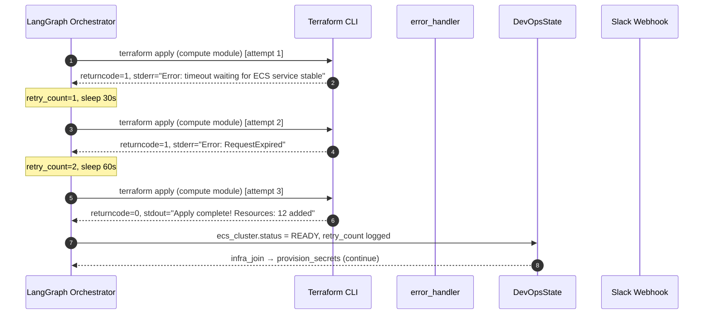
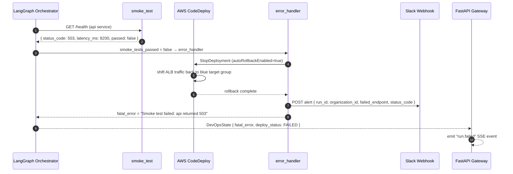
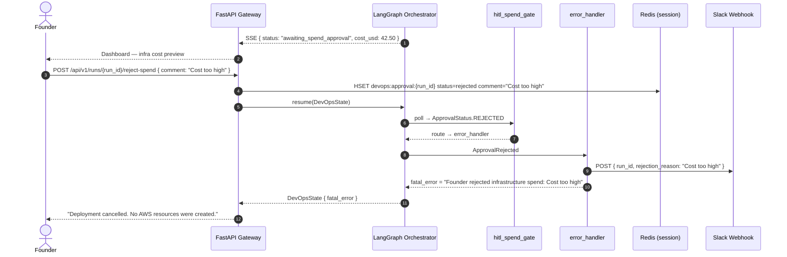
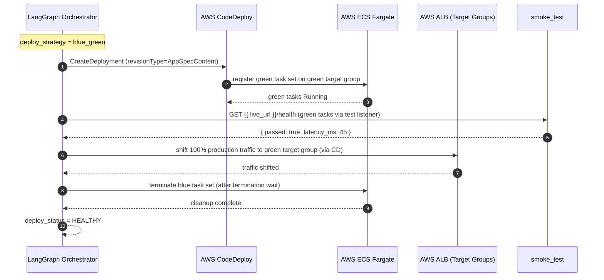

# Low-Level Design — DevOps Agent

> **Phase**: Phase 2 — MVP Builder (Upcoming) / Phase 4 — Enterprise Scale (Planned)
> **SLA**: < 10 minutes end-to-end (excluding async HITL spend gate)
> **Owner**: Auto-Founder AI Platform Team | product@euron.one

---

## Table of Contents

1. [Overview](#1-overview)
2. [LangGraph State Schema (Pydantic V2)](#2-langgraph-state-schema-pydantic-v2)
3. [Node Graph Definition](#3-node-graph-definition)
4. [Tool Bindings](#4-tool-bindings)
5. [Prompt Templates](#5-prompt-templates)
6. [Sequence Diagrams](#6-sequence-diagrams)
7. [Error Handling Logic](#7-error-handling-logic)
8. [Output Contract](#8-output-contract)

---

## 1. Overview

The DevOps Agent is the fifth stage of the Auto-Founder AI pipeline. It receives a tested, containerised `CoderOutput` via gRPC and autonomously provisions, deploys, and monitors a live production environment. Its output is a **fully operational live URL** with SSL, DNS, CI/CD, and observability configured.

The agent runs as a LangGraph stateful graph with a mandatory **Human-in-the-Loop (HITL) spend gate** before any AWS resource is created. All infrastructure is managed as code (Terraform); all deployments are driven by **AWS CodeDeploy blue/green to ECS Fargate** (per CLAUDE.md §17/§48 — Kubernetes/EKS/Helm/ArgoCD are not in scope for v1.0).

> **Runtime target**: ECS Fargate. The Next.js frontend (port 3000) and FastAPI backend (port 8000) deploy as separate ECS services in the same cluster behind a shared ALB with host/path-based routing. Relational storage for deployed tenant MVPs uses **Amazon RDS for PostgreSQL** (multi-AZ-capable, provisioned per tenant in the private subnets). Supabase is reserved for the internal AutoFounder control-plane only and is never provisioned for tenant MVPs. A future stack-agnostic dispatcher keyed off `ArchitectOutput.stack.target` may add EKS / Lambda+APIGW / S3+CloudFront targets — for now only `ecs_fargate` is implemented.

### Sub-tasks executed (with target SLA)

| Sub-task | Node | Target |
|---|---|---|
| Ingest + validate CoderOutput | `ingest_input` | < 15 s |
| HITL infrastructure spend approval | `hitl_spend_gate` | async (15 min timeout) |
| Attach shared foundation VPC + create product-tier overlays (SGs, ALB, target groups) | `attach_foundation_network` | < 1 min |
| ECS Fargate cluster + services (web + api) | `provision_compute` | < 4 min |
| RDS PostgreSQL + ElastiCache + S3 bucket | `provision_data_layer` | < 3 min |
| AWS Secrets Manager seeding | `provision_secrets` | < 30 s |
| ECS task definitions + service manifests | `build_task_defs` | < 2 min |
| CodeDeploy appspec + deployment group | `configure_codedeploy` | < 1 min |
| CodeDeploy blue/green to ECS | `deploy_application` | < 3 min |
| Route 53 alias → ALB + ACM cert | `configure_dns_ssl` | < 1 min |
| CloudWatch alarms + Prometheus + Grafana | `configure_monitoring` | < 1 min |
| GitHub Actions deploy workflow update | `configure_cicd` | < 1 min |
| Live health check smoke tests | `smoke_test` | < 30 s |
| Deploy report rendering | `render_deploy_report` | < 1 min |

---

## 2. LangGraph State Schema (Pydantic V2)

```python
# packages/agents/devops/schema.py

from __future__ import annotations

from datetime import datetime
from enum import StrEnum
from typing import Annotated, Any, Literal
from uuid import UUID, uuid4

from pydantic import BaseModel, Field, field_validator, model_validator
from langgraph.graph.message import add_messages


# ---------------------------------------------------------------------------
# Enums
# ---------------------------------------------------------------------------

class NodeStatus(StrEnum):
    PENDING   = "pending"
    RUNNING   = "running"
    COMPLETED = "completed"
    FAILED    = "failed"
    SKIPPED   = "skipped"


class ApprovalStatus(StrEnum):
    PENDING   = "pending"
    APPROVED  = "approved"
    REJECTED  = "rejected"
    TIMED_OUT = "timed_out"


class DeployStrategy(StrEnum):
    ROLLING      = "rolling"
    BLUE_GREEN   = "blue_green"
    CANARY       = "canary"


class TerraformAction(StrEnum):
    PLAN  = "plan"
    APPLY = "apply"
    DESTROY = "destroy"


class InfraStatus(StrEnum):
    NOT_STARTED = "not_started"
    PROVISIONING = "provisioning"
    READY        = "ready"
    FAILED       = "failed"


class DeployStatus(StrEnum):
    NOT_STARTED = "not_started"
    SYNCING     = "syncing"
    HEALTHY     = "healthy"
    DEGRADED    = "degraded"
    FAILED      = "failed"


# ---------------------------------------------------------------------------
# Sub-models: Input from Coder Agent
# ---------------------------------------------------------------------------

class ServiceManifest(BaseModel):
    name: str                    # e.g. "api-gateway", "ai-services", "web"
    image_uri: str               # ECR URI: {account}.dkr.ecr.{region}.amazonaws.com/{repo}:{tag}
    port: int
    replicas_baseline: int = 2
    health_check_path: str = "/health"
    env_secret_refs: list[str]   = Field(default_factory=list)  # Secrets Manager secret names
    resource_requests: dict[str, str] = Field(
        default_factory=lambda: {"cpu": "250m", "memory": "512Mi"}
    )
    resource_limits: dict[str, str] = Field(
        default_factory=lambda: {"cpu": "1000m", "memory": "2Gi"}
    )


# ---------------------------------------------------------------------------
# Sub-models: Networking
# ---------------------------------------------------------------------------

class VPCConfig(BaseModel):
    vpc_id: str | None       = None
    cidr_block: str          = "10.0.0.0/16"
    public_subnet_ids: list[str]  = Field(default_factory=list)
    private_subnet_ids: list[str] = Field(default_factory=list)
    availability_zones: list[str] = Field(default_factory=lambda: ["ap-south-1a", "ap-south-1b"])
    nat_gateway_id: str | None    = None
    internet_gateway_id: str | None = None
    security_group_ids: dict[str, str] = Field(
        default_factory=dict,
        description="Role → SG ID: 'alb', 'ecs_tasks', 'redis', 'rds' (RDS Postgres SG allows 5432 inbound from ecs_tasks SG only)"
    )
    alb_arn: str | None       = None
    alb_dns_name: str | None  = None


# ---------------------------------------------------------------------------
# Sub-models: Compute (ECS Fargate)
# ---------------------------------------------------------------------------

class ECSService(BaseModel):
    service_name: str                       # e.g. "web", "api", "worker"
    task_def_arn: str | None        = None
    desired_count: int              = 2
    cpu: int                        = 512           # Fargate CPU units (256 / 512 / 1024 / ...)
    memory_mb: int                  = 1024
    container_port: int                              # e.g. 3000 (Next.js) | 8000 (FastAPI)
    target_group_arn: str | None    = None           # ALB target group
    health_check_path: str          = "/health"
    status: InfraStatus             = InfraStatus.NOT_STARTED


class ECSCluster(BaseModel):
    cluster_name: str | None        = None
    cluster_arn: str | None         = None
    region: str                     = "ap-south-1"
    capacity_providers: list[str]   = Field(default_factory=lambda: ["FARGATE", "FARGATE_SPOT"])
    services: list[ECSService]      = Field(default_factory=list)
    status: InfraStatus             = InfraStatus.NOT_STARTED


# ---------------------------------------------------------------------------
# Sub-models: Data Layer (RDS PostgreSQL + ElastiCache + S3)
# ---------------------------------------------------------------------------

class RDSInstance(BaseModel):
    # v1.0 default for tenant MVPs. Supabase is NOT provisioned here — it is
    # reserved for the AutoFounder internal control-plane only.
    kind: Literal["rds"]            = "rds"
    db_instance_identifier: str | None = None     # autofounder-{organization_id[:8]}-{run_id[:8]}
    engine: str                     = "postgres"
    engine_version: str             = "16.3"
    instance_class: str             = "db.t4g.micro"
    allocated_storage_gb: int       = 20
    storage_type: str               = "gp3"
    storage_encrypted: bool         = True
    multi_az: bool                  = False              # flip to True for production tiers
    publicly_accessible: bool       = False
    db_subnet_group_name: str | None = None              # spans the VPC private subnets
    vpc_security_group_id: str | None = None             # SG that allows 5432 from ecs_tasks SG only
    endpoint: str | None            = None               # <id>.<hash>.<region>.rds.amazonaws.com
    port: int                       = 5432
    db_name: str                    = "app"
    master_username: str            = "app_admin"
    credentials_secret_name: str | None = None           # Secrets Manager: {organization_id}/{run_id}/rds (host, port, user, password, dbname)
    credentials_secret_arn: str | None = None            # consumed by ECS task definitions via `secrets[]`
    backup_retention_days: int      = 7
    deletion_protection: bool       = False              # True for production tiers
    status: InfraStatus             = InfraStatus.NOT_STARTED


class ElastiCacheCluster(BaseModel):
    cluster_id: str | None = None
    engine: str            = "redis"
    engine_version: str    = "7.1"
    node_type: str         = "cache.t3.micro"
    num_cache_nodes: int   = 1
    endpoint: str | None   = None
    port: int              = 6379
    status: InfraStatus    = InfraStatus.NOT_STARTED


class S3Bucket(BaseModel):
    bucket_name: str | None = None
    region: str             = "ap-south-1"
    versioning_enabled: bool = True
    encryption: str         = "AES256"
    public_access_blocked: bool = True


# ---------------------------------------------------------------------------
# Sub-models: Secrets
# ---------------------------------------------------------------------------

class SecretRef(BaseModel):
    secret_name: str        # AWS Secrets Manager secret name
    secret_arn: str | None  = None
    keys: list[str]         = Field(default_factory=list)


# ---------------------------------------------------------------------------
# Sub-models: ECS Task Definitions / CodeDeploy
# ---------------------------------------------------------------------------

class ECSTaskDef(BaseModel):
    service_name: str                       # matches ECSService.service_name
    family: str                             # task definition family (per-tenant prefixed)
    task_def_json: str                      # rendered ECS task definition JSON
    container_image: str                    # ECR URI from ServiceManifest.image_uri
    log_group: str                          # /ecs/{organization_id}/{run_id}/{service_name}
    execution_role_arn: str | None  = None
    task_role_arn: str | None       = None


class CodeDeployApp(BaseModel):
    app_name: str                           # CodeDeploy application name (per-tenant prefixed)
    deployment_group: str                   # deployment group name
    appspec_yaml: str                       # generated appspec.yaml content
    deployment_config: str          = "CodeDeployDefault.ECSAllAtOnce"   # or .ECSLinear10PercentEvery3Minutes
    compute_platform: str           = "ECS"
    health_status: str | None       = None


# ---------------------------------------------------------------------------
# Sub-models: DNS / TLS
# ---------------------------------------------------------------------------

class DNSRecord(BaseModel):
    hosted_zone_id: str | None = None
    record_name: str           # e.g. "app.euron.one"
    record_type: str           = "A"
    alb_dns_name: str | None   = None
    ttl: int                   = 300


class TLSCertificate(BaseModel):
    domain: str
    cert_arn: str | None       = None   # ACM cert ARN
    issuer: str                = "letsencrypt-prod"
    status: str | None         = None   # "Issued" | "Pending"


# ---------------------------------------------------------------------------
# Sub-models: Monitoring
# ---------------------------------------------------------------------------

class CloudWatchAlarm(BaseModel):
    alarm_name: str
    metric_name: str
    namespace: str
    threshold: float
    comparison: str           # "GreaterThanThreshold" | "LessThanThreshold"
    evaluation_periods: int   = 2
    period_seconds: int       = 60
    sns_topic_arn: str | None = None


class MonitoringConfig(BaseModel):
    cloudwatch_alarms: list[CloudWatchAlarm] = Field(default_factory=list)
    prometheus_scrape_configs: list[str]     = Field(default_factory=list)
    grafana_dashboard_url: str | None        = None
    log_group_name: str | None               = None
    log_retention_days: int                  = 90


# ---------------------------------------------------------------------------
# Sub-models: CI/CD
# ---------------------------------------------------------------------------

class CICDConfig(BaseModel):
    workflow_file_path: str     # e.g. ".github/workflows/deploy.yml"
    workflow_yaml: str          # generated workflow YAML content
    codedeploy_app_name: str | None = None
    ecr_registry: str | None    = None


# ---------------------------------------------------------------------------
# Sub-models: Smoke Test
# ---------------------------------------------------------------------------

class SmokeTestResult(BaseModel):
    endpoint: str
    status_code: int
    latency_ms: float
    passed: bool
    error: str | None = None


# ---------------------------------------------------------------------------
# Execution metadata helpers
# ---------------------------------------------------------------------------

class NodeTrace(BaseModel):
    node: str
    status: NodeStatus
    started_at: datetime | None   = None
    completed_at: datetime | None = None
    error: str | None             = None
    retry_count: int              = 0
    terraform_output: str | None  = None


class RetryPolicy(BaseModel):
    max_retries: int = 3
    backoff_seconds: list[int] = Field(default_factory=lambda: [10, 30, 60])


# ---------------------------------------------------------------------------
# Root Graph State
# ---------------------------------------------------------------------------

class DevOpsState(BaseModel):
    """
    Single source of truth threaded through every node in the DevOps graph.
    LangGraph merges updates via add_messages for the messages channel;
    all other fields are last-write-wins.
    """

    # Identity
    run_id: UUID            = Field(default_factory=uuid4)
    parent_run_id: UUID     = Field(..., description="Coder Agent run_id")
    grandparent_run_id: UUID = Field(..., description="Architect Agent run_id")
    organization_id: str          = Field(..., description="Validated from JWT claims")

    # Input from Coder Agent (deserialized from gRPC CoderOutput)
    idea_normalised: str
    domain: str
    repo_url: str                             # GitHub repo with generated code
    services: list[ServiceManifest]          = Field(default_factory=list)
    overall_pattern: str                     = "modular_monolith"
    aws_region: str                          = "ap-south-1"
    deploy_strategy: DeployStrategy          = DeployStrategy.ROLLING
    estimated_monthly_cost_usd: float        = 0.0

    # HITL spend gate
    approval_status: ApprovalStatus          = ApprovalStatus.PENDING
    approval_comment: str | None             = None
    approval_timeout_at: datetime | None     = None

    # Forward-compatible discriminator for future stack-agnostic dispatcher.
    # Currently always "ecs_fargate"; will widen to {ecs_fargate, eks, lambda_apigw, s3_cloudfront}.
    compute_target: str                      = "ecs_fargate"

    # Infrastructure outputs (populated by provision_* nodes)
    vpc_config: VPCConfig | None             = None
    ecs_cluster: ECSCluster | None           = None
    rds_instance: RDSInstance | None         = None
    elasticache_cluster: ElastiCacheCluster | None = None
    s3_bucket: S3Bucket | None               = None
    secrets: list[SecretRef]                 = Field(default_factory=list)

    # Deployment artefacts
    task_defs: list[ECSTaskDef]              = Field(default_factory=list)
    codedeploy_app: CodeDeployApp | None     = None
    deploy_status: DeployStatus              = DeployStatus.NOT_STARTED

    # Post-deploy configuration
    dns_record: DNSRecord | None             = None
    tls_certificate: TLSCertificate | None   = None
    live_url: str | None                     = None
    monitoring_config: MonitoringConfig | None = None
    cicd_config: CICDConfig | None           = None

    # Smoke test results
    smoke_test_results: list[SmokeTestResult] = Field(default_factory=list)
    smoke_tests_passed: bool                  = False

    # Final output
    deploy_report_markdown: str | None       = None

    # Terraform state
    terraform_plan_output: str | None        = None
    terraform_state_s3_key: str | None       = None

    # Execution metadata
    node_traces: list[NodeTrace]             = Field(default_factory=list)
    retry_policy: RetryPolicy                = Field(default_factory=RetryPolicy)
    total_llm_tokens_used: int               = 0
    total_tool_calls: int                    = 0
    error_count: int                         = 0

    # LangGraph message channel
    messages: Annotated[list[Any], add_messages] = Field(default_factory=list)

    # Terminal flags
    is_complete: bool    = False
    fatal_error: str | None = None

    class Config:
        arbitrary_types_allowed = True
```

---

## 3. Node Graph Definition

### 3.1 Node inventory

| Node ID | Type | Description | Model / Runtime |
|---|---|---|---|
| `ingest_input` | Sequential | Deserialise + validate CoderOutput from gRPC | — (validation only) |
| `hitl_spend_gate` | HITL / Async | Block until Founder approves AWS spend | — |
| `attach_foundation_network` | Sequential | Read shared foundation VPC / subnet / SG outputs from Asit's modules via `terraform_remote_state`; create only product-tier overlays for this MVP (ECS task SG, RDS SG, Redis SG, ALB + ALB SG, target groups, VPC endpoints). Does **not** create VPC / subnets / NAT / IGW. | Claude Sonnet (overlay HCL gen) |
| `provision_compute` | Sequential | Terraform: ECS Fargate cluster + services (web + api) + ALB target groups | Claude Sonnet |
| `provision_data_layer` | Parallel branch | Terraform: RDS PostgreSQL + ElastiCache + S3 | Claude Sonnet |
| `infra_join` | Barrier | Waits for compute + data layer | — |
| `provision_secrets` | Sequential | boto3: seed AWS Secrets Manager secrets | GPT-4o |
| `build_task_defs` | Parallel branch | Generate ECS task definition JSON per service | GPT-4o |
| `configure_codedeploy` | Parallel branch | Generate CodeDeploy appspec.yaml + deployment group | GPT-4o |
| `deploy_join` | Barrier | Waits for task defs + CodeDeploy config | — |
| `deploy_application` | Sequential | CodeDeploy blue/green to ECS Fargate | — (API call) |
| `configure_dns_ssl` | Sequential | Route53 A record + cert-manager TLS | GPT-4o |
| `configure_monitoring` | Parallel branch | CloudWatch alarms + Prometheus scrape | GPT-4o |
| `configure_cicd` | Parallel branch | GitHub Actions deploy workflow | GPT-4o |
| `postdeploy_join` | Barrier | Waits for monitoring + CI/CD config | — |
| `smoke_test` | Sequential | HTTP health checks on live URL | — (HTTP calls) |
| `render_deploy_report` | Sequential | Assemble final Markdown deploy report | GPT-4o |
| `error_handler` | Error sink | Classifies failure, tears down partial infra, alerts | — |

### 3.2 Graph definition

```python
# packages/agents/devops/graph.py

from langgraph.graph import StateGraph, END
from langgraph.checkpoint.postgres import PostgresSaver

from .schema import DevOpsState
from .nodes import (
    ingest_input,
    hitl_spend_gate,
    attach_foundation_network,
    provision_compute,
    provision_data_layer,
    infra_join,
    provision_secrets,
    build_task_defs,
    configure_codedeploy,
    deploy_join,
    deploy_application,
    configure_dns_ssl,
    configure_monitoring,
    configure_cicd,
    postdeploy_join,
    smoke_test,
    render_deploy_report,
    error_handler,
)
from .routers import (
    route_after_ingest,
    route_after_approval,
    route_after_network_attach,
    route_after_infra_join,
    route_after_secrets,
    route_after_deploy_join,
    route_after_deploy,
    route_after_dns,
    route_after_postdeploy_join,
    route_after_smoke,
    route_terminal,
)


def build_devops_graph(checkpointer: PostgresSaver) -> StateGraph:
    graph = StateGraph(DevOpsState)

    # -- Node registration --------------------------------------------------
    graph.add_node("ingest_input",                ingest_input)
    graph.add_node("hitl_spend_gate",             hitl_spend_gate)
    graph.add_node("attach_foundation_network",   attach_foundation_network)
    graph.add_node("provision_compute",           provision_compute)
    graph.add_node("provision_data_layer",  provision_data_layer)
    graph.add_node("infra_join",            infra_join)
    graph.add_node("provision_secrets",     provision_secrets)
    graph.add_node("build_task_defs",       build_task_defs)
    graph.add_node("configure_codedeploy",  configure_codedeploy)
    graph.add_node("deploy_join",           deploy_join)
    graph.add_node("deploy_application",    deploy_application)
    graph.add_node("configure_dns_ssl",     configure_dns_ssl)
    graph.add_node("configure_monitoring",  configure_monitoring)
    graph.add_node("configure_cicd",        configure_cicd)
    graph.add_node("postdeploy_join",       postdeploy_join)
    graph.add_node("smoke_test",            smoke_test)
    graph.add_node("render_deploy_report",  render_deploy_report)
    graph.add_node("error_handler",         error_handler)

    # -- Entry point --------------------------------------------------------
    graph.set_entry_point("ingest_input")

    # -- Ingest → HITL spend gate ------------------------------------------
    graph.add_conditional_edges(
        "ingest_input",
        route_after_ingest,
        {
            "hitl_spend_gate": "hitl_spend_gate",
            "error_handler":   "error_handler",
        },
    )

    # -- HITL spend gate → attach foundation network (sequential) ---------
    graph.add_conditional_edges(
        "hitl_spend_gate",
        route_after_approval,
        {
            "attach_foundation_network": "attach_foundation_network",
            "error_handler":             "error_handler",  # rejected or timed out
        },
    )

    # -- Network attach → compute + data layer (parallel) -----------------
    graph.add_conditional_edges(
        "attach_foundation_network",
        route_after_network_attach,
        {
            "parallel": ["provision_compute", "provision_data_layer"],
            "error_handler": "error_handler",
        },
    )

    # -- Compute + data layer converge at barrier --------------------------
    graph.add_edge("provision_compute",    "infra_join")
    graph.add_edge("provision_data_layer", "infra_join")

    # -- Post-infra sequential chain ----------------------------------------
    graph.add_conditional_edges(
        "infra_join",
        route_after_infra_join,
        {
            "provision_secrets": "provision_secrets",
            "error_handler":     "error_handler",
        },
    )

    # -- Secrets → fan-out: task defs + CodeDeploy config -------------------
    graph.add_conditional_edges(
        "provision_secrets",
        route_after_secrets,
        {
            "parallel":      ["build_task_defs", "configure_codedeploy"],
            "error_handler": "error_handler",
        },
    )

    graph.add_edge("build_task_defs",      "deploy_join")
    graph.add_edge("configure_codedeploy", "deploy_join")

    # -- Deploy join → application deploy ----------------------------------
    graph.add_conditional_edges(
        "deploy_join",
        route_after_deploy_join,
        {
            "deploy_application": "deploy_application",
            "error_handler":      "error_handler",
        },
    )

    # -- Deploy → DNS/SSL --------------------------------------------------
    graph.add_conditional_edges(
        "deploy_application",
        route_after_deploy,
        {
            "configure_dns_ssl": "configure_dns_ssl",
            "error_handler":     "error_handler",
        },
    )

    # -- DNS/SSL → parallel post-deploy config -----------------------------
    graph.add_conditional_edges(
        "configure_dns_ssl",
        route_after_dns,
        {
            "parallel":      ["configure_monitoring", "configure_cicd"],
            "error_handler": "error_handler",
        },
    )

    graph.add_edge("configure_monitoring", "postdeploy_join")
    graph.add_edge("configure_cicd",       "postdeploy_join")

    # -- Post-deploy join → smoke tests ------------------------------------
    graph.add_conditional_edges(
        "postdeploy_join",
        route_after_postdeploy_join,
        {
            "smoke_test":    "smoke_test",
            "error_handler": "error_handler",
        },
    )

    # -- Smoke → report ----------------------------------------------------
    graph.add_conditional_edges(
        "smoke_test",
        route_after_smoke,
        {
            "render_deploy_report": "render_deploy_report",
            "error_handler":        "error_handler",
        },
    )

    # -- Terminal routing --------------------------------------------------
    graph.add_conditional_edges(
        "render_deploy_report",
        route_terminal,
        {
            "end":           END,
            "error_handler": "error_handler",
        },
    )

    graph.add_edge("error_handler", END)

    return graph.compile(
        checkpointer=checkpointer,
        interrupt_before=["hitl_spend_gate"],   # LangGraph HITL interrupt before spend
    )


# ---------------------------------------------------------------------------
# Router implementations
# ---------------------------------------------------------------------------

# packages/agents/devops/routers.py

from .schema import DevOpsState, ApprovalStatus, DeployStatus, InfraStatus


def route_after_ingest(state: DevOpsState) -> str:
    if state.fatal_error or not state.services:
        return "error_handler"
    return "hitl_spend_gate"


def route_after_approval(state: DevOpsState) -> str:
    if state.approval_status == ApprovalStatus.APPROVED:
        return "attach_foundation_network"
    return "error_handler"


def route_after_network_attach(state: DevOpsState) -> str | list[str]:
    if state.fatal_error or state.vpc_config is None:
        return "error_handler"
    return "parallel"


def route_after_infra_join(state: DevOpsState) -> str:
    if state.error_count >= state.retry_policy.max_retries:
        return "error_handler"
    if state.ecs_cluster is None or state.ecs_cluster.status != InfraStatus.READY:
        return "error_handler"
    return "provision_secrets"


def route_after_secrets(state: DevOpsState) -> str | list[str]:
    if state.fatal_error:
        return "error_handler"
    return "parallel"


def route_after_deploy_join(state: DevOpsState) -> str:
    if not state.task_defs or state.codedeploy_app is None:
        return "error_handler"
    return "deploy_application"


def route_after_deploy(state: DevOpsState) -> str:
    if state.deploy_status == DeployStatus.FAILED:
        return "error_handler"
    return "configure_dns_ssl"


def route_after_dns(state: DevOpsState) -> str | list[str]:
    if state.fatal_error or state.live_url is None:
        return "error_handler"
    return "parallel"


def route_after_postdeploy_join(state: DevOpsState) -> str:
    if state.fatal_error:
        return "error_handler"
    return "smoke_test"


def route_after_smoke(state: DevOpsState) -> str:
    if not state.smoke_tests_passed:
        return "error_handler"
    return "render_deploy_report"


def route_terminal(state: DevOpsState) -> str:
    if state.fatal_error or not state.deploy_report_markdown:
        return "error_handler"
    return "end"
```

### 3.3 Visual graph (Mermaid)



---

## 4. Tool Bindings

### 4.1 Tool definitions (LangChain-compatible)

```python
# packages/agents/devops/tools.py

import os
import json
import subprocess
import tempfile
import logging
from typing import Any

import boto3
import httpx
from langchain.tools import StructuredTool
from pydantic import BaseModel, Field

logger = logging.getLogger("devops.tools")


# ---------------------------------------------------------------------------
# Terraform CLI
# ---------------------------------------------------------------------------

class TerraformInput(BaseModel):
    working_dir: str = Field(..., description="Path to the Terraform module directory")
    action: str      = Field(..., description="'plan' | 'apply' | 'destroy'")
    var_file: str | None = Field(None, description="Path to .tfvars file")
    extra_vars: dict[str, str] = Field(default_factory=dict)


def _terraform_run(working_dir: str, action: str,
                   var_file: str | None = None,
                   extra_vars: dict[str, str] | None = None) -> dict:
    cmd = ["terraform", action, "-no-color", "-input=false"]
    if action == "apply":
        cmd.append("-auto-approve")
    if var_file:
        cmd += [f"-var-file={var_file}"]
    for k, v in (extra_vars or {}).items():
        cmd += [f"-var={k}={v}"]

    result = subprocess.run(
        cmd,
        cwd=working_dir,
        capture_output=True,
        text=True,
        timeout=600,
        env={**os.environ, "TF_IN_AUTOMATION": "true"},
    )
    return {
        "returncode": result.returncode,
        "stdout":     result.stdout[-4000:],  # tail to avoid token bloat
        "stderr":     result.stderr[-2000:],
        "success":    result.returncode == 0,
    }


terraform_run = StructuredTool.from_function(
    func=_terraform_run,
    name="terraform_run",
    description="Run a Terraform plan, apply, or destroy in the given working directory.",
    args_schema=TerraformInput,
)


# ---------------------------------------------------------------------------
# ECS (Fargate)
# ---------------------------------------------------------------------------

class ECSRegisterTaskDefInput(BaseModel):
    family: str           = Field(..., description="Task definition family name (per-tenant prefix)")
    task_def_json: str    = Field(..., description="Full ECS task definition document as JSON string")
    region: str           = "ap-south-1"


def _ecs_register_task_def(family: str, task_def_json: str, region: str = "ap-south-1") -> dict:
    client = boto3.client("ecs", region_name=region)
    resp = client.register_task_definition(**json.loads(task_def_json))
    td = resp["taskDefinition"]
    return {"family": family, "task_def_arn": td["taskDefinitionArn"], "revision": td["revision"], "success": True}


ecs_register_task_def = StructuredTool.from_function(
    func=_ecs_register_task_def,
    name="ecs_register_task_def",
    description="Register a new ECS task definition revision from a JSON document.",
    args_schema=ECSRegisterTaskDefInput,
)


class ECSUpdateServiceInput(BaseModel):
    cluster: str          = Field(..., description="ECS cluster name or ARN")
    service: str          = Field(..., description="ECS service name")
    task_def_arn: str     = Field(..., description="Task definition ARN to roll out")
    desired_count: int | None = None
    region: str           = "ap-south-1"


def _ecs_update_service(cluster: str, service: str, task_def_arn: str,
                        desired_count: int | None = None,
                        region: str = "ap-south-1") -> dict:
    client = boto3.client("ecs", region_name=region)
    kwargs: dict[str, Any] = {"cluster": cluster, "service": service, "taskDefinition": task_def_arn}
    if desired_count is not None:
        kwargs["desiredCount"] = desired_count
    resp = client.update_service(**kwargs)
    return {"service_arn": resp["service"]["serviceArn"], "status": resp["service"]["status"], "success": True}


ecs_update_service = StructuredTool.from_function(
    func=_ecs_update_service,
    name="ecs_update_service",
    description="Update an ECS service to roll out a new task definition revision.",
    args_schema=ECSUpdateServiceInput,
)


# ---------------------------------------------------------------------------
# CodeDeploy (ECS blue/green)
# ---------------------------------------------------------------------------

class CodeDeployCreateDeploymentInput(BaseModel):
    app_name: str         = Field(..., description="CodeDeploy application name")
    deployment_group: str = Field(..., description="CodeDeploy deployment group name")
    appspec_yaml: str     = Field(..., description="Rendered appspec.yaml content")
    region: str           = "ap-south-1"


def _codedeploy_create_deployment(app_name: str, deployment_group: str,
                                  appspec_yaml: str, region: str = "ap-south-1") -> dict:
    client = boto3.client("codedeploy", region_name=region)
    resp = client.create_deployment(
        applicationName=app_name,
        deploymentGroupName=deployment_group,
        revision={
            "revisionType": "AppSpecContent",
            "appSpecContent": {"content": appspec_yaml},
        },
    )
    return {"deployment_id": resp["deploymentId"], "success": True}


codedeploy_create_deployment = StructuredTool.from_function(
    func=_codedeploy_create_deployment,
    name="codedeploy_create_deployment",
    description="Trigger an AWS CodeDeploy blue/green deployment to ECS Fargate.",
    args_schema=CodeDeployCreateDeploymentInput,
)


# ---------------------------------------------------------------------------
# ACM (TLS certificate)
# ---------------------------------------------------------------------------

class ACMRequestCertificateInput(BaseModel):
    domain_name: str      = Field(..., description="Primary domain, e.g. 'myapp.tenant.example.com'")
    subject_alternative_names: list[str] = Field(default_factory=list)
    validation_method: str = "DNS"
    region: str           = "us-east-1"          # CloudFront/ALB cert region (us-east-1 for CloudFront)


def _acm_request_certificate(domain_name: str, subject_alternative_names: list[str],
                             validation_method: str = "DNS",
                             region: str = "us-east-1") -> dict:
    client = boto3.client("acm", region_name=region)
    kwargs: dict[str, Any] = {"DomainName": domain_name, "ValidationMethod": validation_method}
    if subject_alternative_names:
        kwargs["SubjectAlternativeNames"] = subject_alternative_names
    resp = client.request_certificate(**kwargs)
    return {"certificate_arn": resp["CertificateArn"], "success": True}


acm_request_certificate = StructuredTool.from_function(
    func=_acm_request_certificate,
    name="acm_request_certificate",
    description="Request an ACM TLS certificate (DNS validation) for the deployed application.",
    args_schema=ACMRequestCertificateInput,
)


# ---------------------------------------------------------------------------
# AWS Route53
# ---------------------------------------------------------------------------

class Route53UpsertInput(BaseModel):
    hosted_zone_id: str  = Field(..., description="Route53 hosted zone ID")
    record_name: str     = Field(..., description="DNS record name, e.g. 'app.euron.one'")
    alb_dns_name: str    = Field(..., description="ALB DNS name to point to")
    alb_hosted_zone_id: str = Field(..., description="ALB canonical hosted zone ID for alias record")


def _route53_upsert(hosted_zone_id: str, record_name: str,
                    alb_dns_name: str, alb_hosted_zone_id: str) -> dict:
    client = boto3.client("route53", region_name="us-east-1")
    change_batch = {
        "Changes": [{
            "Action": "UPSERT",
            "ResourceRecordSet": {
                "Name": record_name,
                "Type": "A",
                "AliasTarget": {
                    "HostedZoneId":         alb_hosted_zone_id,
                    "DNSName":              alb_dns_name,
                    "EvaluateTargetHealth": True,
                },
            },
        }]
    }
    resp = client.change_resource_record_sets(
        HostedZoneId=hosted_zone_id,
        ChangeBatch=change_batch,
    )
    return {
        "change_id": resp["ChangeInfo"]["Id"],
        "status":    resp["ChangeInfo"]["Status"],
        "success":   True,
    }


route53_upsert = StructuredTool.from_function(
    func=_route53_upsert,
    name="route53_upsert",
    description="Create or update a Route53 A alias record pointing to an ALB.",
    args_schema=Route53UpsertInput,
)


# ---------------------------------------------------------------------------
# AWS Secrets Manager
# ---------------------------------------------------------------------------

class SecretsManagerCreateInput(BaseModel):
    secret_name: str  = Field(..., description="Secret name, e.g. '{organization_id}/{run_id}/db-password'")
    secret_value: str = Field(..., description="JSON string of key-value pairs")
    region: str       = Field("ap-south-1")


def _secrets_manager_create(secret_name: str, secret_value: str, region: str = "ap-south-1") -> dict:
    client = boto3.client("secretsmanager", region_name=region)
    try:
        resp = client.create_secret(Name=secret_name, SecretString=secret_value)
    except client.exceptions.ResourceExistsException:
        resp = client.update_secret(SecretId=secret_name, SecretString=secret_value)
    return {"secret_arn": resp["ARN"], "name": resp["Name"], "success": True}


secrets_manager_create = StructuredTool.from_function(
    func=_secrets_manager_create,
    name="secrets_manager_create",
    description="Create or update an AWS Secrets Manager secret for a tenant.",
    args_schema=SecretsManagerCreateInput,
)


# ---------------------------------------------------------------------------
# HTTP Health Check
# ---------------------------------------------------------------------------

class HealthCheckInput(BaseModel):
    url: str               = Field(..., description="Full URL to health check endpoint")
    expected_status: int   = Field(200)
    timeout_s: float       = Field(10.0)


async def _http_health_check(url: str, expected_status: int = 200, timeout_s: float = 10.0) -> dict:
    import time
    start = time.monotonic()
    try:
        async with httpx.AsyncClient(timeout=timeout_s, verify=True) as client:
            resp = await client.get(url)
        latency_ms = (time.monotonic() - start) * 1000
        return {
            "url":         url,
            "status_code": resp.status_code,
            "latency_ms":  round(latency_ms, 1),
            "passed":      resp.status_code == expected_status,
            "error":       None,
        }
    except Exception as exc:
        latency_ms = (time.monotonic() - start) * 1000
        return {"url": url, "status_code": 0, "latency_ms": round(latency_ms, 1),
                "passed": False, "error": str(exc)}


http_health_check = StructuredTool.from_function(
    coroutine=_http_health_check,
    name="http_health_check",
    description="Perform an HTTP GET health check against a URL and measure latency.",
    args_schema=HealthCheckInput,
)


# ---------------------------------------------------------------------------
# GitHub API (update workflow file)
# ---------------------------------------------------------------------------

class GitHubFileUpsertInput(BaseModel):
    repo_full_name: str  = Field(..., description="Owner/repo, e.g. 'euron-ai/tenant-abc-app'")
    file_path: str       = Field(..., description="File path in repo, e.g. '.github/workflows/deploy.yml'")
    content: str         = Field(..., description="File content (plaintext, will be base64-encoded)")
    commit_message: str  = Field("ci: add CodeDeploy ECS deploy workflow [AutoFounder AI]")
    branch: str          = Field("main")


async def _github_upsert_file(repo_full_name: str, file_path: str,
                               content: str, commit_message: str, branch: str) -> dict:
    import base64
    token = os.environ["GITHUB_TOKEN"]
    headers = {"Authorization": f"Bearer {token}", "Accept": "application/vnd.github+json"}
    api_url = f"https://api.github.com/repos/{repo_full_name}/contents/{file_path}"

    async with httpx.AsyncClient(timeout=20) as client:
        get_resp = await client.get(api_url, headers=headers, params={"ref": branch})
        sha = get_resp.json().get("sha") if get_resp.status_code == 200 else None

        payload: dict[str, Any] = {
            "message": commit_message,
            "content": base64.b64encode(content.encode()).decode(),
            "branch":  branch,
        }
        if sha:
            payload["sha"] = sha

        resp = await client.put(api_url, headers=headers, json=payload)
        resp.raise_for_status()
        return {"path": file_path, "sha": resp.json()["content"]["sha"], "success": True}


github_upsert_file = StructuredTool.from_function(
    coroutine=_github_upsert_file,
    name="github_upsert_file",
    description="Create or update a file in a GitHub repository via the Contents API.",
    args_schema=GitHubFileUpsertInput,
)


# ---------------------------------------------------------------------------
# Tool registry (keyed by node)
# ---------------------------------------------------------------------------

TOOL_REGISTRY: dict[str, list] = {
    "ingest_input":                  [],
    "hitl_spend_gate":               [],
    "attach_foundation_network":     [terraform_run],   # only product-tier overlays; foundation VPC read via terraform_remote_state
    "provision_compute":             [terraform_run],
    "provision_data_layer":          [terraform_run],
    "provision_secrets":             [secrets_manager_create],
    "build_task_defs":               [],                               # task def JSON generation only
    "configure_codedeploy":          [],                               # appspec generation only
    "deploy_application":            [codedeploy_create_deployment, ecs_update_service],
    "configure_dns_ssl":             [route53_upsert, acm_request_certificate],
    "configure_monitoring":          [],                               # CloudWatch via boto3 in node
    "configure_cicd":                [github_upsert_file],
    "smoke_test":                    [http_health_check],
    "render_deploy_report":          [],
}
```

### 4.2 Tool timeout and rate-limit policy

| Tool | Timeout | Rate limit guard | Fallback |
|---|---|---|---|
| `terraform_run` | 600 s (apply) | Serialised per-tenant; no concurrent applies | Retry with fresh `plan` |
| `ecs_register_task_def` | 30 s | AWS default (100 TPS) | Retry with exp. back-off |
| `ecs_update_service` | 30 s | AWS default (100 TPS) | Retry; if still failing surface to error_handler |
| `codedeploy_create_deployment` | 60 s | AWS default (50 TPS) | Re-register revision and retry once |
| `acm_request_certificate` | 30 s | AWS default (5 TPS) | Retry; on quota error escalate |
| `route53_upsert` | 10 s | AWS default (5 req/s) | Retry with exp. back-off |
| `secrets_manager_create` | 10 s | AWS default (100 TPS) | Retry |
| `http_health_check` | 10 s | 10 checks × 3 retries max | Mark failed, escalate |
| `github_upsert_file` | 20 s | 5000 req/hr per token | Retry once |

---

## 5. Prompt Templates

All prompts use **Claude Sonnet** (infrastructure reasoning, Terraform plan generation) or **GPT-4o** (manifest generation, structured YAML output) per the model routing policy.

### 5.1 `attach_foundation_network` — Terraform Foundation-VPC Attach + Product-Tier Overlays

> **Scope rule**: Networking is **not** a DevOps responsibility. This node never creates a VPC, subnets, NAT, IGW, or route tables. It reads the shared foundation VPC outputs from Asit's modules (AF-012–021) via a `terraform_remote_state` data source and creates only the product-tier overlays a single MVP needs.

```jinja2
{# packages/agents/devops/prompts/attach_foundation_network.j2 #}

SYSTEM:
You are a senior cloud infrastructure engineer generating Terraform for AWS.
You will produce the product-tier network overlay for ONE tenant MVP. The shared
foundation VPC, subnets, NAT, and IGW have already been provisioned by the platform's
foundation module (AF-012–021). DO NOT create VPC / subnet / NAT / IGW / route-table
resources — read them from the foundation `terraform_remote_state` data source.

Forbidden resources (build will fail if present):
  aws_vpc, aws_subnet, aws_nat_gateway, aws_internet_gateway,
  aws_route_table, aws_route_table_association, aws_eip (for NAT)

Mandatory constraints:
- Region: {{ aws_region }}
- Data source: `terraform_remote_state` "foundation":
    backend = "s3"
    config  = { bucket = "autofounder-tf-state", key = "foundation/network.tfstate", region = "{{ aws_region }}" }
  Consume: vpc_id, public_subnet_ids, private_subnet_ids, availability_zones,
           nat_gateway_id, internet_gateway_id.
- Create only these product-tier overlays for this run:
    * ALB security group (80, 443 inbound from 0.0.0.0/0)
    * ECS tasks security group (container ports 3000 / 8000 from ALB SG only)
    * Redis security group (6379 from ECS tasks SG only)
    * RDS Postgres security group (5432 from ECS tasks SG only — no public ingress)
    * Application Load Balancer in the foundation public subnets
    * One target group per service
    * VPC interface endpoints (only if this run requires them: ecr.api, ecr.dkr, logs, secretsmanager)
- Tag all resources: Tenant={{ organization_id }}, RunId={{ run_id }}, ManagedBy=terraform

Rules:
- Return ONLY the Terraform HCL (no markdown fences, no explanation).
- Output (Terraform `output` blocks): vpc_id (passthrough), public_subnet_ids, private_subnet_ids,
  security_group_ids (map: alb, ecs_tasks, redis, rds), alb_arn, alb_dns_name, target_group_arns (map).
- State: autofounder-tf-state/{{ organization_id }}/{{ run_id }}/network_overlays.tfstate

USER:
Tenant ID: {{ organization_id }}
Run ID: {{ run_id }}
Region: {{ aws_region }}
Domain: {{ domain }}
Services needing target groups: {{ services | map(attribute='name') | join(', ') }}

Generate main.tf, variables.tf, and outputs.tf as a single HCL block with file headers as comments.
```

### 5.2 `provision_compute` — Terraform ECS Fargate Plan

```jinja2
{# packages/agents/devops/prompts/provision_compute.j2 #}

SYSTEM:
You are a cloud infrastructure engineer generating Terraform for AWS ECS Fargate.

Mandatory constraints:
- ECS cluster (capacity providers: FARGATE primary, FARGATE_SPOT for non-prod)
- One ECS service per item in `services` (e.g. "web" on port 3000, "api" on port 8000)
- All tasks run in private subnets only; egress via NAT Gateway
- ALB target group per service; ALB listener rules use host or path routing to fan out
- Application Auto Scaling: min={{ service.replicas_baseline }}, max=10, target CPU 70%
- Container insights enabled on the cluster (CloudWatch)
- Task execution role: pulls from ECR + writes logs + reads Secrets Manager
- Task role: scoped to S3 bucket {{ organization_id }} prefix only
- Tag: Tenant={{ organization_id }}, RunId={{ run_id }}, ManagedBy=terraform

Security rules:
- No public IP on tasks (`assign_public_ip = false`)
- Container ports reachable only from the ALB security group
- Enable encryption for ephemeral storage

Rules:
- Return ONLY Terraform HCL. Use terraform-aws-modules/ecs/aws (version ~> 5.0)
  and terraform-aws-modules/alb/aws (~> 9.0).
- State bucket: autofounder-tf-state, key: {{ organization_id }}/{{ run_id }}/compute.tfstate
- Reference networking outputs via terraform_remote_state data source.

USER:
Tenant ID: {{ organization_id }}
Run ID: {{ run_id }}
Region: {{ aws_region }}
VPC state key: {{ organization_id }}/{{ run_id }}/networking.tfstate
Services: {{ services | map(attribute='name') | join(', ') }}

Generate main.tf, variables.tf, and outputs.tf.
```

### 5.3 `provision_data_layer` — Terraform RDS PostgreSQL + ElastiCache + S3

> **Scope rule**: tenant MVPs always use **Amazon RDS for PostgreSQL** (`DataLayerSpec.kind = "rds"`). **Supabase is never provisioned by this node** — it is reserved for the AutoFounder internal control-plane.

**Node pseudo-code** (idempotent, retry-safe — mirrors LLD §7.3 `with_retry`):

```python
# packages/agents/engineering/devops/nodes/provision_data_layer.py
async def provision_data_layer(state: DevOpsState) -> dict:
    organization_id, run_id = state.organization_id, state.run_id
    vpc = state.vpc_config  # populated by attach_foundation_network (from foundation outputs)
    assert vpc is not None, "attach_foundation_network must run first"

    # 1. Generate per-tenant RDS master password and stash in Secrets Manager
    #    BEFORE terraform apply (so the HCL references the secret ARN, not the
    #    plaintext). Idempotent: if secret already exists for this run_id, reuse.
    rds_secret_name = f"{organization_id}/{run_id}/rds"
    rds_secret_arn  = await secrets_manager_create.ainvoke({
        "name":        rds_secret_name,
        "description": f"RDS master credentials for tenant {organization_id} run {run_id}",
        "secret_dict": {
            "username": "app_admin",
            "password": _generate_strong_password(),
            "dbname":   "app",
            "port":     5432,
            # host is patched in post-apply once the endpoint is known
        },
        "tags": tagging.mandatory_tags(organization_id, run_id),
    })

    # 2. Render + apply the data-layer Terraform module (RDS + ElastiCache + S3)
    hcl = await llm.render_prompt(
        "provision_data_layer.j2",
        organization_id=organization_id,
        run_id=run_id,
        aws_region=state.aws_region,
        vpc_id=vpc.vpc_id,
        private_subnet_ids=vpc.private_subnet_ids,
        ecs_tasks_sg_id=vpc.security_group_ids["ecs_tasks"],
        rds_credentials_secret_arn=rds_secret_arn,
        rds_instance_class="db.t4g.micro",
        rds_engine_version="16.3",
        rds_allocated_storage_gb=20,
        rds_multi_az=False,
    )
    tf_outputs = await terraform_run.ainvoke({
        "module_path":   f"infra/terraform/tenants/{organization_id}/data-layer",
        "hcl":           hcl,
        "state_key":     f"{organization_id}/{run_id}/data-layer.tfstate",
        "action":        "apply",
    })

    # 3. Patch the secret with the resolved RDS endpoint (post-apply)
    await secrets_manager_update.ainvoke({
        "name":  rds_secret_name,
        "patch": {"host": tf_outputs["rds_endpoint"]},
    })

    rds = RDSInstance(
        kind="rds",
        db_instance_identifier=tf_outputs["rds_db_instance_identifier"],
        engine_version="16.3",
        instance_class="db.t4g.micro",
        allocated_storage_gb=20,
        multi_az=False,
        db_subnet_group_name=tf_outputs["rds_subnet_group_name"],
        vpc_security_group_id=tf_outputs["rds_sg_id"],
        endpoint=tf_outputs["rds_endpoint"],
        port=5432,
        db_name="app",
        master_username="app_admin",
        credentials_secret_name=rds_secret_name,
        credentials_secret_arn=rds_secret_arn,
        status=InfraStatus.READY,
    )
    return {
        "rds_instance":        rds,
        "elasticache_cluster": ElastiCacheCluster(**tf_outputs["elasticache"]),
        "s3_bucket":           S3Bucket(**tf_outputs["s3_bucket"]),
        "secrets":             state.secrets + [SecretRef(
            secret_name=rds_secret_name, secret_arn=rds_secret_arn,
            keys=["host", "port", "username", "password", "dbname"],
        )],
    }
```

**Jinja2 prompt** (Terraform HCL for the data-layer module):

```jinja2
{# packages/agents/devops/prompts/provision_data_layer.j2 #}

SYSTEM:
You are a database and storage infrastructure engineer generating Terraform for AWS.
The deployed tenant MVP uses AWS-native managed services only. DO NOT generate any
Supabase / third-party DB resources — Supabase is reserved for the AutoFounder internal
control-plane and is out of scope for this module.

Provision exactly three resources in one module:

1. Amazon RDS for PostgreSQL
   - engine = "postgres", engine_version = "{{ rds_engine_version }}"
   - instance_class = "{{ rds_instance_class }}"
   - allocated_storage = {{ rds_allocated_storage_gb }}, storage_type = "gp3", storage_encrypted = true
   - multi_az = {{ rds_multi_az | lower }}
   - publicly_accessible = false, deletion_protection = false
   - db_subnet_group across the VPC private subnets {{ private_subnet_ids | join(', ') }}
   - new VPC security group: inbound 5432 from ecs_tasks SG ({{ ecs_tasks_sg_id }}) ONLY; no 0.0.0.0/0 ingress
   - master credentials sourced from AWS Secrets Manager secret ARN: {{ rds_credentials_secret_arn }}
     via aws_secretsmanager_secret_version → jsondecode → username / password
   - db_name = "app", port = 5432, backup_retention_period = 7
   - identifier = "autofounder-{{ organization_id[:8] }}-{{ run_id[:8] }}"
   - apply_immediately = true; skip_final_snapshot = true (dev tier)
   - performance_insights_enabled = true; monitoring_interval = 60

2. ElastiCache Redis 7.1 (cache.t3.micro, 1 node, encryption in transit + at rest)
   - subnet group across private subnets, SG allowing 6379 from ecs_tasks SG only

3. S3 bucket autofounder-{{ organization_id }}-{{ run_id[:8] }}
   - versioning on, AES256 SSE, block all public access
   - lifecycle: IA @ 30d → Glacier @ 90d

Mandatory tags on every resource: Tenant={{ organization_id }}, RunId={{ run_id }}, ManagedBy=terraform.

Outputs (Terraform `output` blocks):
- rds_db_instance_identifier, rds_endpoint, rds_sg_id, rds_subnet_group_name
- elasticache (object: cluster_id, endpoint, port)
- s3_bucket (object: bucket_name, region)

Rules:
- Return ONLY the Terraform HCL (no markdown fences, no explanation).
- State: autofounder-tf-state/{{ organization_id }}/{{ run_id }}/data-layer.tfstate
- All three resources MUST live in the VPC private subnets {{ private_subnet_ids | join(', ') }}.
- No raw passwords in HCL — only secret ARN references.

USER:
Tenant ID: {{ organization_id }}
Run ID: {{ run_id }}
Region: {{ aws_region }}
VPC ID: {{ vpc_id }}
Private subnets: {{ private_subnet_ids | join(', ') }}
ECS tasks SG ID: {{ ecs_tasks_sg_id }}
RDS credentials secret ARN: {{ rds_credentials_secret_arn }}

Generate main.tf, variables.tf, and outputs.tf.
```

**Deployment-flow constraints for the data layer (enforced by downstream nodes):**

- Ensure `migration.sql` (from the Architect S3 artefact `supabase_migration_s3_uri`) executes against the new RDS instance **before** ECS services start — run it from a one-shot Fargate "migration" task (or a CodeDeploy `BeforeAllowTraffic` hook) gated on RDS `available` status; `deploy_application` must not flip traffic until this task exits 0.
- Inject DB credentials into every ECS task definition via `secrets[]` `valueFrom` against `{{ rds_credentials_secret_arn }}` only (see §5.4); never write `DB_PASSWORD` or any RDS field into `environment[]` or into the rendered deploy report.
- Account for RDS warm-up (≈ 2–5 min from `creating` → `available`): `provision_data_layer` must poll `DescribeDBInstances` until `DBInstanceStatus = "available"` (max 6 min, 15 s interval) before returning, and the migration task / `smoke_test` must not be scheduled until that poll succeeds.

### 5.4 `build_task_defs` — ECS Task Definition Generation

```jinja2
{# packages/agents/devops/prompts/build_task_defs.j2 #}

SYSTEM:
You are an ECS engineer generating an ECS task definition JSON for each service.

Rules per service:
- networkMode: "awsvpc"
- requiresCompatibilities: ["FARGATE"]
- cpu / memory: from ServiceManifest.resource_requests (translated to Fargate-valid pairs)
- One container per task; image = ServiceManifest.image_uri (ECR URI with digest)
- portMappings: containerPort = ServiceManifest.port
- healthCheck: CMD-SHELL curl -fsS http://localhost:{{ service.port }}{{ service.health_check_path }} || exit 1
- environment + secrets:
    * Plain values → environment[]
    * Sensitive values → secrets[] referencing Secrets Manager ARNs from ServiceManifest.env_secret_refs
    * DB credentials (always present, from provision_data_layer): inject the following
      `secrets[]` entries, each sourced from the RDS Secrets Manager secret ARN
      `{{ rds_credentials_secret_arn }}` using the `valueFrom` JSON-key suffix syntax
      (`<secret-arn>:<json-key>::`):
        - name: DB_HOST     valueFrom: "{{ rds_credentials_secret_arn }}:host::"
        - name: DB_PORT     valueFrom: "{{ rds_credentials_secret_arn }}:port::"
        - name: DB_NAME     valueFrom: "{{ rds_credentials_secret_arn }}:dbname::"
        - name: DB_USER     valueFrom: "{{ rds_credentials_secret_arn }}:username::"
        - name: DB_PASSWORD valueFrom: "{{ rds_credentials_secret_arn }}:password::"
      Do NOT inline DB credentials into environment[]. The ECS execution role must
      already grant secretsmanager:GetSecretValue on this ARN (granted by the compute module).
- logConfiguration: awslogs, group=/ecs/{{ organization_id }}/{{ run_id }}/{{ service.name }}, retention 90d
- executionRoleArn and taskRoleArn from compute Terraform outputs (per-tenant, least-privilege)
- family: "{{ organization_id }}-{{ service.name }}"
- stopTimeout: 30

Return ONLY a JSON object keyed by service name; each value is a complete ECS
RegisterTaskDefinition request body.

USER:

Service: {{ service.name }}
Image: {{ service.image_uri }}
Port: {{ service.port }}
Health check: {{ service.health_check_path }}
Replicas baseline: {{ service.replicas_baseline }}
Resource requests: {{ service.resource_requests | tojson }}
Resource limits: {{ service.resource_limits | tojson }}
Secret refs: {{ service.env_secret_refs | join(', ') }}
---

Tenant ID: {{ organization_id }}
Run ID: {{ run_id }}
Region: {{ aws_region }}
Execution role ARN: {{ ecs_execution_role_arn }}
Task role ARN: {{ ecs_task_role_arn }}
RDS credentials secret ARN: {{ rds_credentials_secret_arn }}
```

### 5.5 `configure_codedeploy` — CodeDeploy appspec + Deployment Group

```jinja2
{# packages/agents/devops/prompts/configure_codedeploy.j2 #}

SYSTEM:
You are an AWS deployment engineer generating an AWS CodeDeploy ECS blue/green
configuration. Produce two artefacts as a JSON object:

1. "deployment_group": Terraform HCL for an aws_codedeploy_app (compute_platform="ECS")
   and an aws_codedeploy_deployment_group with:
   - deployment_config_name: "CodeDeployDefault.ECSAllAtOnce" (web) /
     "CodeDeployDefault.ECSLinear10PercentEvery3Minutes" (api)
   - ecs_service block: cluster_name + service_name from compute outputs
   - load_balancer_info: prod ALB target group + test target group per service
   - blue_green_deployment_config: terminate blue tasks 10 minutes after success;
     deployment_ready_option = CONTINUE_DEPLOYMENT (no manual approval at the AWS layer
     — the HITL spend gate already approved earlier)
   - auto_rollback_configuration: enabled on DEPLOYMENT_FAILURE + DEPLOYMENT_STOP_ON_ALARM

2. "appspec_yaml": appspec.yaml content per service:
   version: 0.0
   Resources:
     - TargetService:
         Type: AWS::ECS::Service
         Properties:
           TaskDefinition: <REPLACED_AT_DEPLOY_TIME>
           LoadBalancerInfo: { ContainerName: "{{ service.name }}", ContainerPort: {{ service.port }} }

Return ONLY the JSON object (keys: deployment_group, appspec_yaml). No markdown fences.

USER:
Tenant ID: {{ organization_id }}
Run ID: {{ run_id }}
Region: {{ aws_region }}
ECS cluster: {{ ecs_cluster.cluster_name }}
Services:

- name: {{ service.name }}
  port: {{ service.port }}
  health_check_path: {{ service.health_check_path }}

ALB target groups (from compute outputs): {{ alb_target_group_arns | tojson }}
```

### 5.6 `configure_monitoring` — CloudWatch + Prometheus Rules

```jinja2
{# packages/agents/devops/prompts/configure_monitoring.j2 #}

SYSTEM:
You are a site reliability engineer configuring observability for a Kubernetes SaaS app.
Generate:
1. A list of CloudWatch alarms (boto3 put_metric_alarm parameters as JSON)
2. Prometheus scrape config additions (YAML)
3. Grafana dashboard provisioning config (JSON)

Mandatory alarms (CloudWatch):
- ECS service CPU > 80% for 5 min → SNS alert
- ECS service memory > 85% for 5 min → SNS alert
- ECS RunningTaskCount < DesiredTaskCount for 5 min → SNS alert (Critical)
- ALB 5XX rate > 1% for 2 min → SNS alert
- ALB P99 latency > 1000ms for 2 min → SNS alert
- ElastiCache cache hit rate < 80% for 10 min → SNS warning
- RDS CPU > 75% for 10 min → SNS warning; RDS FreeStorageSpace < 20% for 10 min → SNS critical; RDS DatabaseConnections > 80% of max for 5 min → SNS warning

Prometheus scrape: add a scrape_config for each ECS service (target via service discovery on
the ALB target groups, path: /metrics).
CloudWatch log group: /ecs/{{ organization_id }}/{{ run_id }}/<service>, retention: 90 days.

Return JSON with keys: "cloudwatch_alarms" (list), "prometheus_scrape_yaml" (string),
"log_group_name" (string), "grafana_dashboard_url" (null — will be set post-deploy).

USER:
Tenant ID: {{ organization_id }}
Run ID: {{ run_id }}
Region: {{ aws_region }}
Services: {{ services | map(attribute='name') | join(', ') }}
SNS topic ARN: {{ sns_topic_arn }}
ECS cluster name: {{ ecs_cluster.cluster_name }}
```

### 5.7 `configure_cicd` — GitHub Actions Workflow

```jinja2
{# packages/agents/devops/prompts/configure_cicd.j2 #}

SYSTEM:
You are a DevOps engineer generating a GitHub Actions workflow for continuous deployment.
The workflow must:
- Trigger on: push to main, and manual workflow_dispatch
- Jobs: lint → test → build-and-push → deploy
- Build: docker buildx, push to ECR, tag with git SHA
- ECR login via OIDC (no long-lived credentials — use aws-actions/configure-aws-credentials@v4)
- Deploy: build & push new container image to ECR (tag = git SHA), then call
  `aws deploy create-deployment` against the CodeDeploy application + deployment group
  for each service (blue/green to ECS Fargate).
- Notification: post to Slack on success and failure
- Cache: use GitHub Actions cache for Docker layers and pnpm/pip dependencies

Security requirements:
- Never hardcode secrets — use GitHub Secrets and OIDC role assumption
- Required secrets: AWS_ACCOUNT_ID, ECR_REPOSITORY, SLACK_WEBHOOK_URL
- IAM role: arn:aws:iam::{{ aws_account_id }}:role/autofounder-github-actions-{{ organization_id }}

Return ONLY valid GitHub Actions YAML (no markdown fences).

USER:
Tenant ID: {{ organization_id }}
Run ID: {{ run_id }}
AWS region: {{ aws_region }}
AWS account ID: {{ aws_account_id }}
ECR registry: {{ ecr_registry }}
Services: {{ services | map(attribute='name') | join(', ') }}
CodeDeploy application: {{ codedeploy_app.app_name }}
CodeDeploy deployment group: {{ codedeploy_app.deployment_group }}
Repo URL: {{ repo_url }}
Slack webhook secret name: SLACK_WEBHOOK_URL
```

### 5.8 `render_deploy_report` — Deployment Report

```jinja2
{# packages/agents/devops/prompts/render_deploy_report.j2 #}

SYSTEM:
You are a technical writer assembling a deployment completion report in Markdown.
Every claim must reference actual data from the deployment state — do not invent values.
Embed all relevant URLs. Use H2 sections. Target audience: Founder (non-technical summary)
and Marketer Agent (live URL + brand config for GTM).

USER:
Tenant: {{ organization_id }}
Run ID: {{ run_id }}
Idea: {{ idea_normalised }}
Domain: {{ domain }}
Deploy strategy: {{ deploy_strategy }}

Live URL: {{ live_url }}
TLS cert status: {{ tls_certificate.status }}

Infrastructure:
- ECS cluster: {{ ecs_cluster.cluster_name }} (region {{ ecs_cluster.region }})
- RDS PostgreSQL: {{ rds_instance.db_instance_identifier }} ({{ rds_instance.engine }} {{ rds_instance.engine_version }}, {{ rds_instance.instance_class }}, multi_az={{ rds_instance.multi_az }})
- ElastiCache endpoint: {{ elasticache_cluster.endpoint }}
- S3 bucket: {{ s3_bucket.bucket_name }}
- Region: {{ aws_region }}

Services deployed:

- {{ svc.service_name }}: desired={{ svc.desired_count }}, status={{ svc.status }}

CodeDeploy app: {{ codedeploy_app.app_name }} / group {{ codedeploy_app.deployment_group }} — {{ codedeploy_app.health_status }}

Smoke tests:

- {{ t.endpoint }}: HTTP {{ t.status_code }}, {{ t.latency_ms }}ms — {{ 'PASS' if t.passed else 'FAIL' }}


Monitoring:
- CloudWatch alarms: {{ monitoring_config.cloudwatch_alarms | length }} configured
- Log group: {{ monitoring_config.log_group_name }}
- Grafana: {{ monitoring_config.grafana_dashboard_url or 'pending' }}

CI/CD: {{ cicd_config.workflow_file_path }} pushed to {{ repo_url }}

Structure the report with exactly these sections:
## 1. Deployment Summary
## 2. Live Application
## 3. Infrastructure Inventory
## 4. Service Health
## 5. Observability & Alerts
## 6. CI/CD Configuration
## 7. Next Steps (hand-off to Marketer Agent)

End with a machine-readable block for the Marketer Agent:
```json
{
  "marketer_handoff": {
    "run_id": "{{ run_id }}",
    "organization_id": "{{ organization_id }}",
    "live_url": "{{ live_url }}",
    "idea_normalised": "{{ idea_normalised }}",
    "domain": "{{ domain }}"
  }
}
```
```

---

## 6. Sequence Diagrams

### 6.1 Happy-path — end-to-end deploy flow

```mermaid
sequenceDiagram
    autonumber
    actor Founder
    participant API    as FastAPI Gateway
    participant Graph  as LangGraph Orchestrator
    participant Ingest as ingest_input
    participant Gate   as hitl_spend_gate
    participant Redis  as Redis (session)
    participant TF     as Terraform CLI
    participant ECS    as AWS ECS Fargate
    participant RDS    as AWS RDS (PostgreSQL)
    participant Cache  as AWS ElastiCache
    participant SM     as AWS Secrets Manager
    participant ECR    as AWS ECR
    participant CD     as AWS CodeDeploy
    participant ALB    as AWS ALB
    participant R53    as AWS Route 53
    participant ACM    as AWS ACM
    participant CW     as AWS CloudWatch
    participant GH     as GitHub API
    participant Smoke  as HTTP Health Checks
    participant Mkt    as Marketer Agent

    Mkt ->> API: gRPC CoderOutput { run_id, organization_id, services[], repo_url }
    API ->> Graph: invoke(DevOpsState)
    Graph ->> Ingest: validate CoderOutput
    Ingest -->> Graph: { services[], deploy_strategy, estimated_monthly_cost_usd }

    Note over Graph,Gate: LangGraph interrupt_before="hitl_spend_gate"
    Graph -->> API: SSE { status: "awaiting_spend_approval", estimated_cost_usd }
    API -->> Founder: Dashboard shows cost estimate + Approve / Reject

    Founder ->> API: POST /api/v1/runs/{run_id}/approve-spend { comment }
    API ->> Redis: HSET devops:approval:{run_id} status=approved
    API ->> Graph: resume(DevOpsState)

    Graph ->> TF: terraform apply (network_overlays module)
    TF ->> TF: read foundation VPC outputs via terraform_remote_state; create product-tier SGs, ALB, target groups
    TF -->> Graph: vpc_config { vpc_id (foundation), subnet_ids (foundation), sg_ids, alb_arn }

    par Parallel infrastructure provisioning
        Graph ->> TF: terraform apply (compute module)
        TF ->> ECS: create Fargate cluster + services (web, api)
        TF ->> ALB: create target groups per service + listener rules
        ECS -->> TF: cluster_arn, service_arns[]
        TF -->> Graph: ecs_cluster (status=READY)

        Graph ->> SM: create_secret({organization_id}/{run_id}/rds) [pre-apply, password generated]
        Graph ->> TF: terraform apply (data-layer module)
        TF ->> RDS: create db.t4g.micro PostgreSQL 16.3 in private subnets, SG=ecs_tasks-only
        RDS -->> TF: endpoint, port, sg_id, subnet_group_name
        TF ->> Cache: create cache.t3.micro Redis 7.1
        Cache -->> TF: endpoint, port
        TF ->> TF: create S3 bucket with lifecycle policy
        TF -->> Graph: rds_instance, elasticache_cluster, s3_bucket
        Graph ->> SM: update_secret({organization_id}/{run_id}/rds) patch host=rds_endpoint
    end

    Graph ->> SM: create_secret({organization_id}/{run_id}/redis-url)
    SM -->> Graph: secret_arns[]

    par Parallel: task defs + CodeDeploy config
        Graph ->> Graph: render ECS task definition JSON per service
        Graph ->> ECS: RegisterTaskDefinition (each service)
        ECS -->> Graph: task_def_arns[]

        Graph ->> Graph: render appspec.yaml + Terraform for CodeDeploy app + deployment group
        Graph ->> TF: terraform apply (codedeploy module)
        TF -->> Graph: codedeploy_app { app_name, deployment_group }
    end

    Graph ->> CD: CreateDeployment (revisionType=AppSpecContent) per service
    CD ->> ECS: shift traffic blue → green on ALB target groups
    ECS -->> CD: green tasks healthy
    CD -->> Graph: { deployment_id, status: Succeeded }

    Graph ->> ACM: RequestCertificate (DNS validation) for {{ live_url }}
    ACM -->> Graph: certificate_arn (Pending validation)
    Graph ->> R53: upsert CNAME (ACM validation) + A alias → ALB DNS
    R53 -->> Graph: { change_id, status: INSYNC }
    ACM -->> Graph: certificate Issued

    Graph ->> Graph: live_url = "https://{{ record_name }}"

    par Parallel: monitoring + CI/CD
        Graph ->> CW: put_metric_alarm × 7 alarms
        CW -->> Graph: alarms_created

        Graph ->> GH: PUT .github/workflows/deploy.yml
        GH -->> Graph: { sha, success: true }
    end

    Graph ->> Smoke: GET {{ live_url }}/health × N services
    Smoke -->> Graph: smoke_test_results (all passed, P99 < 100ms)

    Graph ->> Graph: render_deploy_report
    Graph -->> API: DevOpsState (complete)
    API -->> Founder: 200 OK { run_id, live_url, deploy_report_url }
    API --)  Mkt: emit(DevOpsOutput) via gRPC
```

### 6.2 Terraform apply failure — rollback and retry



### 6.3 Smoke test failure — deploy rollback



### 6.4 HITL spend gate — rejection flow



### 6.5 Blue/green deploy flow (when `deploy_strategy = blue_green`)



---

## 7. Error Handling Logic

### 7.1 Error taxonomy

| Error class | Examples | Strategy |
|---|---|---|
| `ValidationError` | CoderOutput missing services[] | Reject with `fatal_error`, do not provision |
| `TerraformPlanError` | Syntax error in generated HCL | LLM self-corrects HCL once; if still invalid, escalate |
| `TerraformApplyError` | ECS service stable timeout, quota exceeded | Retry 3× with 30 s / 60 s back-off; destroy partial resources on final failure |
| `TaskDefValidationError` | Invalid ECS task definition JSON | LLM self-corrects task def; retry |
| `CodeDeployFailed` | Image pull error, task health check failed | CodeDeploy auto-rolls back to previous task set; Slack alert |
| `SmokeTestFailed` | Service returns 5xx after deploy | CodeDeploy auto-rollback; `fatal_error` set; no Marketer handoff |
| `DNSPropagationTimeout` | Route53 change not INSYNC in 60 s | Retry poll 5× at 15 s intervals; continue (DNS eventually consistent) |
| `TLSIssuanceTimeout` | cert-manager ACME challenge > 3 min | Log warning; continue with HTTP-only live URL; alert ops |
| `SpendApprovalRejected` | Founder clicks Reject | No AWS resources created; fatal_error + Slack |
| `SpendApprovalTimeout` | No decision in 15 min | Slack + email alert; fatal_error; no provisioning |
| `GitHubRateLimit` | 403 on workflow push | Wait 60 s; retry; if exhausted log warning and continue |
| `SLABreach` | End-to-end > 10 min (excl. HITL) | Emit CloudWatch SLA metric; continue; alert ops |

### 7.2 Error handler node

```python
# packages/agents/devops/nodes/error_handler.py

import asyncio
import logging
import os
import subprocess
from datetime import datetime, timezone

import httpx

from ..schema import DevOpsState, NodeStatus, ApprovalStatus, DeployStatus

logger = logging.getLogger("devops.error_handler")

SLACK_WEBHOOK = "SLACK_WEBHOOK_DEVOPS"


async def error_handler(state: DevOpsState) -> dict:
    """
    Central error sink for the DevOps Agent.
    On infrastructure failures, attempts Terraform destroy to avoid orphaned resources.
    Always sets fatal_error and alerts ops.
    """
    failed_nodes = [
        t for t in state.node_traces
        if t.status == NodeStatus.FAILED and t.retry_count >= state.retry_policy.max_retries
    ]

    rejection = state.approval_status == ApprovalStatus.REJECTED
    timeout   = state.approval_status == ApprovalStatus.TIMED_OUT

    if rejection:
        reason = f"Founder rejected infrastructure spend: {state.approval_comment or 'no comment'}"
    elif timeout:
        reason = "Infrastructure spend approval timed out after 15 minutes"
    elif failed_nodes:
        reason = "; ".join(f"{t.node}: {t.error}" for t in failed_nodes)
        if _infrastructure_partially_created(state):
            await _terraform_destroy_partial(state)
    else:
        reason = state.fatal_error or "Unknown error — check node_traces"

    logger.error("DevOps agent fatal error [run=%s tenant=%s]: %s",
                 state.run_id, state.organization_id, reason)
    await _post_slack_alert(state, reason)

    return {
        "fatal_error": reason,
        "is_complete": False,
        "deploy_status": DeployStatus.FAILED,
    }


def _infrastructure_partially_created(state: DevOpsState) -> bool:
    return (
        state.vpc_config is not None
        or state.ecs_cluster is not None
        or state.rds_instance is not None
        or state.elasticache_cluster is not None
        or state.codedeploy_app is not None
    )


async def _terraform_destroy_partial(state: DevOpsState) -> None:
    """Best-effort Terraform destroy for any provisioned modules."""
    modules = []
    if state.codedeploy_app is not None:
        modules.append(("codedeploy", f"infra/terraform/tenants/{state.organization_id}/codedeploy"))
    if state.ecs_cluster is not None:
        modules.append(("compute", f"infra/terraform/tenants/{state.organization_id}/compute"))
    if state.elasticache_cluster is not None or state.rds_instance is not None:
        modules.append(("data-layer", f"infra/terraform/tenants/{state.organization_id}/data-layer"))
    if state.vpc_config is not None:
        modules.append(("network_overlays", f"infra/terraform/tenants/{state.organization_id}/network_overlays"))

    for module_name, module_path in modules:
        logger.warning("Destroying partial infra module: %s", module_name)
        try:
            result = subprocess.run(
                ["terraform", "destroy", "-auto-approve", "-no-color", "-input=false"],
                cwd=module_path,
                capture_output=True, text=True, timeout=300,
                env={**os.environ, "TF_IN_AUTOMATION": "true"},
            )
            if result.returncode != 0:
                logger.error("Destroy failed for %s: %s", module_name, result.stderr[:500])
        except Exception as exc:
            logger.error("Destroy exception for %s: %s", module_name, exc)


async def _post_slack_alert(state: DevOpsState, reason: str) -> None:
    webhook_url = os.environ.get(SLACK_WEBHOOK)
    if not webhook_url:
        logger.warning("Slack webhook not configured — skipping DevOps alert")
        return

    payload = {
        "text": (
            f":rotating_light: *DevOps Agent Fatal Error*\n"
            f"*Run ID*: `{state.run_id}`\n"
            f"*Parent Run*: `{state.parent_run_id}`\n"
            f"*Tenant*: `{state.organization_id}`\n"
            f"*Idea*: {state.idea_normalised[:80]}\n"
            f"*Reason*: {reason}\n"
            f"*Partial infra created*: {_infrastructure_partially_created(state)}\n"
            f"*Time*: {datetime.now(timezone.utc).isoformat()}"
        )
    }
    async with httpx.AsyncClient() as client:
        try:
            await client.post(webhook_url, json=payload, timeout=5)
        except Exception as exc:
            logger.error("Slack alert failed: %s", exc)
```

### 7.3 Node wrapper with retry logic

```python
# packages/agents/devops/utils/retry.py

import asyncio
import functools
import logging
from datetime import datetime, timezone
from typing import Callable

from ..schema import DevOpsState, NodeStatus, NodeTrace

logger = logging.getLogger("devops.retry")


def with_retry(node_name: str):
    """
    Decorator that wraps a node function with the graph's retry policy.
    Updates NodeTrace in state on each attempt.
    For Terraform nodes, captures terraform_output from the result dict.
    """
    def decorator(fn: Callable):
        @functools.wraps(fn)
        async def wrapper(state: DevOpsState) -> dict:
            policy   = state.retry_policy
            trace    = NodeTrace(node=node_name, status=NodeStatus.RUNNING,
                                 started_at=datetime.now(timezone.utc))
            last_exc = None

            for attempt in range(policy.max_retries + 1):
                trace.retry_count = attempt
                try:
                    result = await fn(state)
                    trace.status       = NodeStatus.COMPLETED
                    trace.completed_at = datetime.now(timezone.utc)
                    if "terraform_output" in result:
                        trace.terraform_output = result.pop("terraform_output")
                    return {**result, "node_traces": state.node_traces + [trace]}
                except Exception as exc:
                    last_exc = exc
                    logger.warning("Node %s attempt %d/%d failed: %s",
                                   node_name, attempt + 1, policy.max_retries + 1, exc)
                    if attempt < policy.max_retries:
                        sleep_s = policy.backoff_seconds[min(attempt, len(policy.backoff_seconds) - 1)]
                        await asyncio.sleep(sleep_s)

            trace.status       = NodeStatus.FAILED
            trace.error        = str(last_exc)
            trace.completed_at = datetime.now(timezone.utc)
            return {
                "node_traces": state.node_traces + [trace],
                "error_count": state.error_count + 1,
            }

        return wrapper
    return decorator
```

### 7.4 HITL spend gate with timeout

```python
# packages/agents/devops/nodes/hitl_spend_gate.py

import asyncio
import logging
import os
from datetime import datetime, timedelta, timezone

import redis.asyncio as aioredis

from ..schema import DevOpsState, ApprovalStatus

logger = logging.getLogger("devops.spend_gate")

APPROVAL_POLL_INTERVAL_S = 60
APPROVAL_TIMEOUT_S       = 900   # 15 minutes


async def hitl_spend_gate(state: DevOpsState) -> dict:
    """
    Polls Redis for Founder approval of the infrastructure spend estimate.
    The FastAPI gateway writes the decision to Redis when the Founder clicks
    Approve or Reject in the dashboard. LangGraph interrupt_before fires
    before this node, surfacing the cost estimate in the UI.
    """
    redis_url    = os.environ["REDIS_URL"]
    approval_key = f"devops:approval:{state.run_id}"
    timeout_at   = datetime.now(timezone.utc) + timedelta(seconds=APPROVAL_TIMEOUT_S)

    client = await aioredis.from_url(redis_url, decode_responses=True)
    try:
        while datetime.now(timezone.utc) < timeout_at:
            decision = await client.hgetall(approval_key)
            if decision:
                status  = ApprovalStatus(decision.get("status", "pending"))
                comment = decision.get("comment")
                logger.info("Spend gate decision for run %s: %s", state.run_id, status)
                return {
                    "approval_status":    status,
                    "approval_comment":   comment,
                    "approval_timeout_at": timeout_at,
                }
            await asyncio.sleep(APPROVAL_POLL_INTERVAL_S)

        logger.warning("Spend gate timed out for run %s", state.run_id)
        return {"approval_status": ApprovalStatus.TIMED_OUT}
    finally:
        await client.aclose()
```

### 7.5 SLA breach monitoring

```python
# packages/agents/devops/utils/sla.py

import asyncio
import logging

logger = logging.getLogger("devops.sla")

NODE_SLA_SECONDS: dict[str, int] = {
    "ingest_input":               15,
    "attach_foundation_network":  60,
    "provision_compute":          240,
    "provision_data_layer":       180,
    "provision_secrets":          30,
    "build_task_defs":            120,
    "configure_codedeploy":       60,
    "deploy_application":         180,
    "configure_dns_ssl":          60,
    "configure_monitoring":       60,
    "configure_cicd":             60,
    "smoke_test":                 30,
    "render_deploy_report":       60,
}

TOTAL_SLA_SECONDS = 600   # 10 minutes (excludes async HITL gate)


async def enforce_node_sla(node_name: str, coro):
    """Wrap a node coroutine with a per-node SLA timeout."""
    sla = NODE_SLA_SECONDS.get(node_name, 120)
    try:
        return await asyncio.wait_for(coro, timeout=sla)
    except asyncio.TimeoutError:
        logger.error("SLA BREACH: node=%s exceeded %ds — returning partial state", node_name, sla)
        return {"error_count": 1}
```

### 7.6 Terraform state safety

All Terraform state files are stored in S3 with DynamoDB locking to prevent concurrent applies for the same tenant:

```hcl
# infra/terraform/tenants/_shared/backend.tf

terraform {
  backend "s3" {
    bucket         = "autofounder-tf-state"
    key            = "${var.organization_id}/${var.run_id}/${var.module_name}.tfstate"
    region         = "ap-south-1"
    encrypt        = true
    kms_key_id     = "alias/autofounder-tf-state"
    dynamodb_table = "autofounder-tf-locks"
  }
}
```

The DynamoDB lock prevents concurrent Terraform applies for the same tenant — a necessary guard when multiple agent retries or concurrent runs could otherwise corrupt state.

---

## 8. Output Contract

The DevOps Agent emits the following to the Marketer Agent via gRPC upon successful completion (smoke tests passed).

```protobuf
// proto/devops_output.proto

syntax = "proto3";
package autofounder.devops.v1;

message DevOpsOutput {
  string run_id                  = 1;
  string parent_run_id           = 2;    // Coder Agent run_id
  string organization_id               = 3;
  string idea_normalised         = 4;
  string domain                  = 5;

  // Live environment
  string live_url                = 6;    // e.g. "https://app.euron.one"
  string deploy_strategy         = 7;    // "rolling" | "blue_green" | "canary"

  // Infrastructure identifiers
  string ecs_cluster_arn         = 8;
  string rds_db_instance_identifier = 9;   // Amazon RDS PostgreSQL instance id (was: supabase_project_ref)
  string aws_region              = 10;
  string s3_bucket_name          = 11;

  // TLS
  string tls_cert_status         = 12;   // "Issued" | "Pending"

  // CI/CD
  string cicd_workflow_path      = 13;   // ".github/workflows/deploy.yml"
  string repo_url                = 14;

  // Smoke test summary
  int32  smoke_tests_total       = 15;
  int32  smoke_tests_passed      = 16;
  float  smoke_test_p99_latency_ms = 17;

  // Monitoring
  string cloudwatch_log_group    = 18;
  string grafana_dashboard_url   = 19;
  int32  cloudwatch_alarms_count = 20;

  // Deploy report
  string deploy_report_s3_uri    = 21;   // s3://autofounder-artefacts/{organization_id}/{run_id}/deploy-report.md

  int64  completed_at_unix_ms    = 22;
  int32  total_llm_tokens_used   = 23;

  // CodeDeploy application (blue/green to ECS)
  string codedeploy_app_name     = 24;

  // Forward-compatible discriminator for future stack-agnostic dispatcher.
  // Currently always "ecs_fargate"; will widen to {ecs_fargate, eks, lambda_apigw, s3_cloudfront}.
  string compute_target          = 25;
}
```

**S3 artefact path convention**: `s3://autofounder-artefacts/{organization_id}/{run_id}/` — never shared between tenants.

**Routing rules after output**:
- `tls_cert_status != "Issued"` → surface HTTP-only warning in Marketer Agent dashboard; do NOT block GTM
- `smoke_tests_passed < smoke_tests_total` → this state is never reached (error_handler blocks it); included for defence in depth
- `domain in ("FinTech", "HealthTech")` → Marketer Agent must cross-reference all generated copy against the compliance checklist before scheduling posts
- On success → Marketer Agent receives `live_url` as the canonical landing page URL for all GTM assets

---

*Auto-Founder AI — DevOps Agent LLD v1.0 | May 2026*
