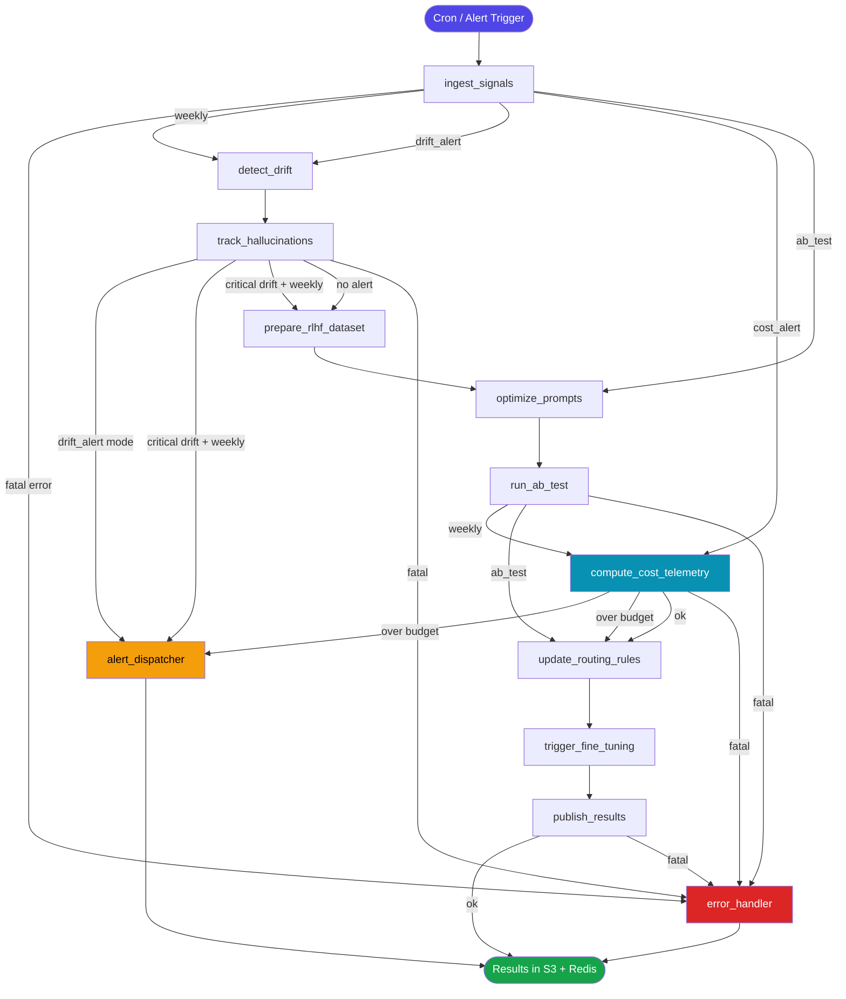
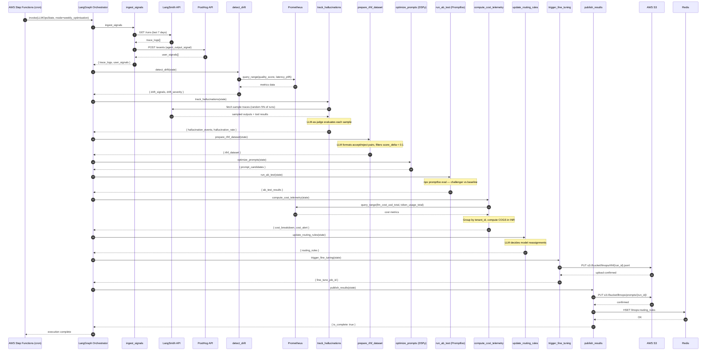
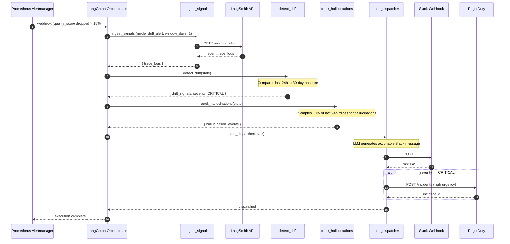
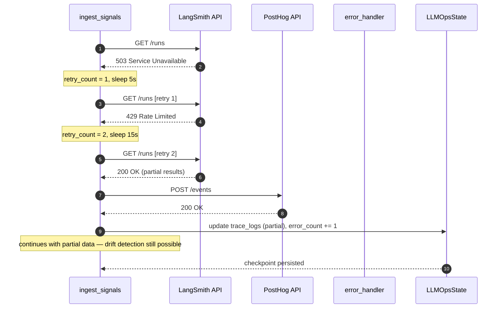

# Low-Level Design — LLMOps Agent

> **Phase**: Phase 4 — Enterprise Scale (Planned)
> **Cadence**: Weekly fine-tuning + prompt optimisation pipeline; real-time drift / cost alerts
> **Owner**: Auto-Founder AI Platform Team | product@euron.one

---

## Table of Contents

1. [Overview](#1-overview)
2. [LangGraph State Schema (Pydantic V2)](#2-langgraph-state-schema-pydantic-v2)
3. [Node Graph Definition](#3-node-graph-definition)
4. [Tool Bindings](#4-tool-bindings)
5. [Prompt Templates](#5-prompt-templates)
6. [Sequence Diagrams](#6-sequence-diagrams)
7. [Error Handling Logic](#7-error-handling-logic)
8. [Output Contract](#8-output-contract)

---

## 1. Overview

The LLMOps Agent is the **continuous learning and observability backbone** of the Auto-Founder AI platform. It operates in two modes:

| Mode | Trigger | SLA |
|---|---|---|
| **Weekly pipeline** | AWS Step Functions cron (Monday 02:00 IST) | Complete within 4 hours |
| **Real-time alert** | Drift threshold crossed or COGS spike > 20% | Alert within 5 minutes |

### Responsibilities

- **RLHF data preparation** — collect accept/reject signals from founders and format training pairs for fine-tuning
- **Prompt A/B testing** — generate challenger prompts via DSPy, evaluate via Promptfoo, promote winners
- **Hallucination tracking** — detect, log, and attribute hallucination events per agent per tenant
- **Drift detection** — alert when agent output quality degrades versus the rolling 30-day baseline
- **Per-user cost telemetry** — compute COGS per MVP build, flag tenants exceeding budget thresholds
- **Model routing rules** — update the routing table (Claude Sonnet / GPT-4o / GPT-4o-mini) based on quality-cost trade-offs

### Sub-tasks and target SLAs

| Sub-task | Node | Mode | Target |
|---|---|---|---|
| Signal ingestion | `ingest_signals` | Both | < 2 min |
| Drift detection | `detect_drift` | Both | < 3 min |
| Hallucination tracking | `track_hallucinations` | Weekly | < 5 min |
| RLHF dataset preparation | `prepare_rlhf_dataset` | Weekly | < 10 min |
| Prompt optimisation (DSPy) | `optimize_prompts` | Weekly | < 30 min |
| A/B test execution | `run_ab_test` | Weekly | < 20 min |
| Cost telemetry computation | `compute_cost_telemetry` | Both | < 5 min |
| Model routing rule update | `update_routing_rules` | Weekly | < 2 min |
| Fine-tuning job submission | `trigger_fine_tuning` | Weekly | < 2 min |
| Results publication | `publish_results` | Both | < 1 min |

---

## 2. LangGraph State Schema (Pydantic V2)

```python
# packages/agents/llmops/schema.py

from __future__ import annotations

from datetime import datetime
from enum import StrEnum
from typing import Annotated, Any, Literal
from uuid import UUID, uuid4

from pydantic import BaseModel, Field, field_validator, model_validator
from langgraph.graph.message import add_messages


# ---------------------------------------------------------------------------
# Enums
# ---------------------------------------------------------------------------

class NodeStatus(StrEnum):
    PENDING   = "pending"
    RUNNING   = "running"
    COMPLETED = "completed"
    FAILED    = "failed"
    SKIPPED   = "skipped"


class PipelineMode(StrEnum):
    WEEKLY_OPTIMISATION = "weekly_optimisation"
    DRIFT_ALERT         = "drift_alert"
    COST_ALERT          = "cost_alert"
    AB_TEST             = "ab_test"


class DriftSeverity(StrEnum):
    NONE     = "none"
    MINOR    = "minor"    # quality delta 5–10% below baseline
    MODERATE = "moderate" # quality delta 10–20% below baseline
    CRITICAL = "critical" # quality delta > 20% below baseline


class SignalType(StrEnum):
    ACCEPT  = "accept"    # founder approved agent output
    REJECT  = "reject"    # founder rejected / edited agent output
    PARTIAL = "partial"   # founder accepted with significant edits


class RoutingModel(StrEnum):
    CLAUDE_SONNET = "claude-sonnet-4-6"
    GPT4O         = "gpt-4o"
    GPT4O_MINI    = "gpt-4o-mini"


# ---------------------------------------------------------------------------
# Sub-models
# ---------------------------------------------------------------------------

class UserSignal(BaseModel):
    signal_id:   UUID
    tenant_id:   str
    run_id:      UUID
    agent_name:  str               # "strategist" | "architect" | "coder" | ...
    node_name:   str               # specific node within the agent
    signal_type: SignalType
    original_output: str = Field(..., max_length=8000)
    edited_output:   str | None = None
    latency_ms:  int | None = None
    created_at:  datetime


class TraceLog(BaseModel):
    trace_id:    str
    run_id:      UUID
    tenant_id:   str
    agent_name:  str
    node_name:   str
    model:       RoutingModel
    prompt_tokens:     int
    completion_tokens: int
    total_tokens:      int
    cost_usd:    float
    latency_ms:  int
    langsmith_url: str | None = None
    created_at:  datetime


class RLHFSample(BaseModel):
    sample_id:    UUID = Field(default_factory=uuid4)
    prompt:       str
    chosen:       str   # accepted / lightly-edited output
    rejected:     str   # original output that was rejected
    agent_name:   str
    node_name:    str
    score_delta:  float = Field(0.0, description="LLM-as-judge quality delta (chosen - rejected)")


class PromptCandidate(BaseModel):
    candidate_id: UUID = Field(default_factory=uuid4)
    agent_name:   str
    node_name:    str
    prompt_text:  str
    generated_by: Literal["dspy", "manual", "mutation"]
    dspy_score:   float | None = None    # DSPy optimiser metric


class ABTestResult(BaseModel):
    candidate_id:  UUID
    agent_name:    str
    node_name:     str
    promptfoo_score: float
    baseline_score:  float
    delta:           float
    win:             bool
    sample_count:    int
    p_value:         float | None = None


class HallucinationEvent(BaseModel):
    event_id:     UUID = Field(default_factory=uuid4)
    run_id:       UUID
    tenant_id:    str
    agent_name:   str
    node_name:    str
    claim:        str     # the hallucinated claim
    evidence_url: str | None = None
    severity:     Literal["low", "medium", "high"]
    detected_by:  Literal["llm_judge", "user_signal", "rule"]
    created_at:   datetime


class DriftSignal(BaseModel):
    agent_name:    str
    node_name:     str
    metric:        str                 # "quality_score" | "hallucination_rate" | "latency_p95"
    baseline_value: float
    current_value:  float
    delta_pct:     float
    severity:      DriftSeverity
    window_days:   int = 30


class CostBreakdown(BaseModel):
    tenant_id:          str
    period_start:       datetime
    period_end:         datetime
    total_cost_usd:     float
    cost_by_agent:      dict[str, float]   # agent_name -> total_usd
    cost_by_model:      dict[str, float]   # model -> total_usd
    total_tokens:       int
    cogs_per_mvp_inr:   float
    budget_limit_inr:   float = 500.0      # non-negotiable COGS target
    is_over_budget:     bool = False

    @model_validator(mode="after")
    def flag_over_budget(self) -> CostBreakdown:
        object.__setattr__(self, "is_over_budget", self.cogs_per_mvp_inr > self.budget_limit_inr)
        return self


class RoutingRule(BaseModel):
    agent_name:   str
    node_name:    str
    model:        RoutingModel
    reason:       str
    effective_at: datetime = Field(default_factory=lambda: datetime.utcnow())
    previous_model: RoutingModel | None = None


class NodeTrace(BaseModel):
    node:         str
    status:       NodeStatus
    started_at:   datetime | None = None
    completed_at: datetime | None = None
    error:        str | None = None
    retry_count:  int = 0


class RetryPolicy(BaseModel):
    max_retries:     int = 3
    backoff_seconds: list[int] = Field(default_factory=lambda: [5, 15, 45])


# ---------------------------------------------------------------------------
# Root Graph State
# ---------------------------------------------------------------------------

class LLMOpsState(BaseModel):
    """
    Single source of truth threaded through every node in the LLMOps graph.
    LangGraph merges updates via add_messages for the messages channel;
    all other fields are last-write-wins.
    """

    # Identity
    run_id:        UUID          = Field(default_factory=uuid4)
    pipeline_mode: PipelineMode  = PipelineMode.WEEKLY_OPTIMISATION

    # Input collections (populated by ingest_signals)
    user_signals:  list[UserSignal] = Field(default_factory=list)
    trace_logs:    list[TraceLog]   = Field(default_factory=list)
    window_days:   int = 7          # look-back window for weekly pipeline

    # Drift detection outputs
    drift_signals:   list[DriftSignal] = Field(default_factory=list)
    drift_severity:  DriftSeverity     = DriftSeverity.NONE
    drift_detected:  bool              = False

    # Hallucination tracking outputs
    hallucination_events: list[HallucinationEvent] = Field(default_factory=list)
    hallucination_rate:   float | None = None   # events / total_runs, 0.0–1.0

    # RLHF outputs
    rlhf_dataset:     list[RLHFSample] = Field(default_factory=list)
    rlhf_dataset_s3_uri: str | None   = None
    fine_tune_job_id: str | None       = None   # AWS Step Functions execution ARN

    # Prompt optimisation outputs
    prompt_candidates:  list[PromptCandidate] = Field(default_factory=list)
    ab_test_results:    list[ABTestResult]    = Field(default_factory=list)
    promoted_prompts:   dict[str, str]        = Field(
        default_factory=dict,
        description="node_name -> winning prompt text"
    )

    # Cost telemetry
    cost_breakdown: list[CostBreakdown] = Field(default_factory=list)
    cost_alert:     bool = False

    # Model routing
    routing_rules:     list[RoutingRule] = Field(default_factory=list)
    routing_updated:   bool = False

    # Execution metadata
    node_traces:           list[NodeTrace] = Field(default_factory=list)
    retry_policy:          RetryPolicy     = Field(default_factory=RetryPolicy)
    total_signals_ingested: int = 0
    total_traces_ingested:  int = 0
    error_count:            int = 0

    # LangGraph message channel
    messages: Annotated[list[Any], add_messages] = Field(default_factory=list)

    # Terminal state
    is_complete: bool      = False
    fatal_error: str | None = None

    class Config:
        arbitrary_types_allowed = True
```

---

## 3. Node Graph Definition

### 3.1 Node inventory

| Node ID | Type | Description | Model |
|---|---|---|---|
| `ingest_signals` | Sequential | Pull trace logs from LangSmith; pull user signals from PostHog | — (API calls) |
| `detect_drift` | Sequential | Compare current quality metrics to 30-day rolling baseline | Claude Sonnet |
| `track_hallucinations` | Sequential | Identify hallucination events via LLM-as-judge on trace samples | Claude Sonnet |
| `prepare_rlhf_dataset` | Sequential | Format accept/reject signal pairs into RLHF JSONL | GPT-4o |
| `optimize_prompts` | Sequential | Run DSPy optimiser over collected RLHF samples | Claude Sonnet |
| `run_ab_test` | Sequential | Evaluate prompt candidates with Promptfoo against production baseline | Claude Sonnet |
| `compute_cost_telemetry` | Sequential | Aggregate token usage, compute per-tenant COGS, flag overruns | — (computation) |
| `update_routing_rules` | Sequential | Revise model routing table based on A/B results and COGS | Claude Sonnet |
| `trigger_fine_tuning` | Sequential | Submit RLHF dataset to AWS Step Functions fine-tuning workflow | — (API call) |
| `publish_results` | Sequential | Write promoted prompts and routing rules to config store (S3 + Redis) | — (API calls) |
| `alert_dispatcher` | Sequential | Send drift / cost alerts via Slack and PagerDuty | — (API calls) |
| `error_handler` | Error sink | Retries or escalates failed nodes | — |

### 3.2 Mode-conditional subgraph

Not all nodes run in every pipeline mode. The `route_after_ingest` router selects the subgraph:

| Node | weekly_optimisation | drift_alert | cost_alert | ab_test |
|---|:---:|:---:|:---:|:---:|
| `ingest_signals` | ✓ | ✓ | ✓ | ✓ |
| `detect_drift` | ✓ | ✓ | — | — |
| `track_hallucinations` | ✓ | ✓ | — | — |
| `prepare_rlhf_dataset` | ✓ | — | — | — |
| `optimize_prompts` | ✓ | — | — | ✓ |
| `run_ab_test` | ✓ | — | — | ✓ |
| `compute_cost_telemetry` | ✓ | — | ✓ | — |
| `update_routing_rules` | ✓ | — | ✓ | ✓ |
| `trigger_fine_tuning` | ✓ | — | — | — |
| `publish_results` | ✓ | — | ✓ | ✓ |
| `alert_dispatcher` | ✓ | ✓ | ✓ | — |

### 3.3 Graph definition

```python
# packages/agents/llmops/graph.py

from langgraph.graph import StateGraph, END
from langgraph.checkpoint.postgres import PostgresSaver

from .schema import LLMOpsState
from .nodes import (
    ingest_signals,
    detect_drift,
    track_hallucinations,
    prepare_rlhf_dataset,
    optimize_prompts,
    run_ab_test,
    compute_cost_telemetry,
    update_routing_rules,
    trigger_fine_tuning,
    publish_results,
    alert_dispatcher,
    error_handler,
)
from .routers import (
    route_after_ingest,
    route_after_drift,
    route_after_cost,
    route_after_ab_test,
    route_terminal,
)


def build_llmops_graph(checkpointer: PostgresSaver) -> StateGraph:
    graph = StateGraph(LLMOpsState)

    # -- Node registration --------------------------------------------------
    graph.add_node("ingest_signals",        ingest_signals)
    graph.add_node("detect_drift",          detect_drift)
    graph.add_node("track_hallucinations",  track_hallucinations)
    graph.add_node("prepare_rlhf_dataset",  prepare_rlhf_dataset)
    graph.add_node("optimize_prompts",      optimize_prompts)
    graph.add_node("run_ab_test",           run_ab_test)
    graph.add_node("compute_cost_telemetry",compute_cost_telemetry)
    graph.add_node("update_routing_rules",  update_routing_rules)
    graph.add_node("trigger_fine_tuning",   trigger_fine_tuning)
    graph.add_node("publish_results",       publish_results)
    graph.add_node("alert_dispatcher",      alert_dispatcher)
    graph.add_node("error_handler",         error_handler)

    # -- Entry point --------------------------------------------------------
    graph.set_entry_point("ingest_signals")

    # -- Post-ingest mode routing -------------------------------------------
    graph.add_conditional_edges(
        "ingest_signals",
        route_after_ingest,
        {
            "weekly":        "detect_drift",
            "drift_alert":   "detect_drift",
            "cost_alert":    "compute_cost_telemetry",
            "ab_test":       "optimize_prompts",
            "error_handler": "error_handler",
        },
    )

    # -- Weekly / drift path -----------------------------------------------
    graph.add_edge("detect_drift", "track_hallucinations")

    graph.add_conditional_edges(
        "track_hallucinations",
        route_after_drift,
        {
            "alert_and_prepare": ["alert_dispatcher", "prepare_rlhf_dataset"],
            "prepare_only":      "prepare_rlhf_dataset",
            "alert_only":        "alert_dispatcher",     # drift_alert mode exits here
            "error_handler":     "error_handler",
        },
    )

    graph.add_edge("prepare_rlhf_dataset", "optimize_prompts")

    # -- Prompt optimisation path ------------------------------------------
    graph.add_edge("optimize_prompts", "run_ab_test")

    graph.add_conditional_edges(
        "run_ab_test",
        route_after_ab_test,
        {
            "with_cost":     "compute_cost_telemetry",
            "update_only":   "update_routing_rules",
            "error_handler": "error_handler",
        },
    )

    # -- Cost path ---------------------------------------------------------
    graph.add_conditional_edges(
        "compute_cost_telemetry",
        route_after_cost,
        {
            "alert_and_route":  ["alert_dispatcher", "update_routing_rules"],
            "route_only":       "update_routing_rules",
            "error_handler":    "error_handler",
        },
    )

    # -- Convergence to publish + fine-tuning ------------------------------
    graph.add_edge("update_routing_rules", "trigger_fine_tuning")
    graph.add_edge("trigger_fine_tuning",  "publish_results")

    # -- Terminal routing --------------------------------------------------
    graph.add_conditional_edges(
        "publish_results",
        route_terminal,
        {
            "end":           END,
            "error_handler": "error_handler",
        },
    )

    graph.add_edge("alert_dispatcher", END)
    graph.add_edge("error_handler",    END)

    return graph.compile(checkpointer=checkpointer)


# ---------------------------------------------------------------------------
# Router implementations
# ---------------------------------------------------------------------------

# packages/agents/llmops/routers.py

from .schema import LLMOpsState, PipelineMode, DriftSeverity


def route_after_ingest(state: LLMOpsState) -> str:
    if state.fatal_error:
        return "error_handler"
    mode_map = {
        PipelineMode.WEEKLY_OPTIMISATION: "weekly",
        PipelineMode.DRIFT_ALERT:         "drift_alert",
        PipelineMode.COST_ALERT:          "cost_alert",
        PipelineMode.AB_TEST:             "ab_test",
    }
    return mode_map[state.pipeline_mode]


def route_after_drift(state: LLMOpsState) -> str | list[str]:
    if state.fatal_error:
        return "error_handler"
    has_drift = state.drift_severity in (DriftSeverity.MODERATE, DriftSeverity.CRITICAL)
    is_weekly = state.pipeline_mode == PipelineMode.WEEKLY_OPTIMISATION

    if state.pipeline_mode == PipelineMode.DRIFT_ALERT:
        return "alert_only"
    if has_drift and is_weekly:
        return "alert_and_prepare"
    return "prepare_only"


def route_after_ab_test(state: LLMOpsState) -> str:
    if state.fatal_error:
        return "error_handler"
    if state.pipeline_mode == PipelineMode.WEEKLY_OPTIMISATION:
        return "with_cost"
    return "update_only"


def route_after_cost(state: LLMOpsState) -> str | list[str]:
    if state.fatal_error:
        return "error_handler"
    if state.cost_alert:
        return "alert_and_route"
    return "route_only"


def route_terminal(state: LLMOpsState) -> str:
    if state.fatal_error or not state.is_complete:
        return "error_handler"
    return "end"
```

### 3.4 Visual graph (Mermaid)



---

## 4. Tool Bindings

### 4.1 Tool definitions

```python
# packages/agents/llmops/tools.py

import os
from datetime import datetime, timedelta, timezone

import httpx
from langchain.tools import StructuredTool
from pydantic import BaseModel, Field


# -- LangSmith trace fetcher -----------------------------------------------

class LangSmithInput(BaseModel):
    project_name: str = Field(..., description="LangSmith project name")
    start_time:   str = Field(..., description="ISO 8601 start datetime")
    end_time:     str = Field(..., description="ISO 8601 end datetime")
    limit:        int = Field(500, ge=1, le=2000)

async def _fetch_langsmith_traces(
    project_name: str, start_time: str, end_time: str, limit: int = 500
) -> list[dict]:
    async with httpx.AsyncClient() as client:
        resp = await client.get(
            "https://api.smith.langchain.com/runs",
            headers={"x-api-key": os.environ["LANGSMITH_API_KEY"]},
            params={
                "project_name": project_name,
                "start_time":   start_time,
                "end_time":     end_time,
                "limit":        limit,
                "execution_order": 1,
            },
            timeout=30,
        )
        resp.raise_for_status()
        return resp.json()

langsmith_fetch = StructuredTool.from_function(
    coroutine=_fetch_langsmith_traces,
    name="langsmith_fetch",
    description="Fetch LLM trace runs from LangSmith for a given project and time window.",
    args_schema=LangSmithInput,
)


# -- PostHog user signal fetcher -------------------------------------------

class PostHogInput(BaseModel):
    event_name:  str = Field("agent_output_signal", description="PostHog event name")
    days_back:   int = Field(7, ge=1, le=90)
    limit:       int = Field(1000, ge=1, le=5000)

async def _fetch_posthog_signals(
    event_name: str = "agent_output_signal", days_back: int = 7, limit: int = 1000
) -> list[dict]:
    start = (datetime.now(timezone.utc) - timedelta(days=days_back)).isoformat()
    async with httpx.AsyncClient() as client:
        resp = await client.post(
            f"https://app.posthog.com/api/projects/{os.environ['POSTHOG_PROJECT_ID']}/events/",
            headers={"Authorization": f"Bearer {os.environ['POSTHOG_API_KEY']}"},
            json={"event": event_name, "after": start, "limit": limit},
            timeout=30,
        )
        resp.raise_for_status()
        return resp.json().get("results", [])

posthog_fetch = StructuredTool.from_function(
    coroutine=_fetch_posthog_signals,
    name="posthog_fetch",
    description="Fetch founder accept/reject signal events from PostHog.",
    args_schema=PostHogInput,
)


# -- Prometheus metrics query ----------------------------------------------

class PrometheusInput(BaseModel):
    query:    str = Field(..., description="PromQL query string")
    start:    str = Field(..., description="RFC3339 range start")
    end:      str = Field(..., description="RFC3339 range end")
    step:     str = Field("1h", description="Step resolution, e.g. '1h', '1d'")

async def _prometheus_range_query(query: str, start: str, end: str, step: str = "1h") -> dict:
    async with httpx.AsyncClient() as client:
        resp = await client.get(
            f"{os.environ['PROMETHEUS_URL']}/api/v1/query_range",
            params={"query": query, "start": start, "end": end, "step": step},
            timeout=20,
        )
        resp.raise_for_status()
        return resp.json()

prometheus_query = StructuredTool.from_function(
    coroutine=_prometheus_range_query,
    name="prometheus_query",
    description="Run a PromQL range query against Prometheus for latency, token usage, and cost metrics.",
    args_schema=PrometheusInput,
)


# -- DSPy prompt optimiser -------------------------------------------------

class DSPyOptimiseInput(BaseModel):
    agent_name:  str = Field(..., description="Target agent name")
    node_name:   str = Field(..., description="Target node name")
    rlhf_samples_json: str = Field(..., description="JSON-serialised list of RLHFSample objects")
    metric:      str = Field("quality_score", description="DSPy metric to optimise")

def _dspy_optimise(agent_name: str, node_name: str, rlhf_samples_json: str, metric: str) -> dict:
    import json
    import dspy
    from dspy.teleprompt import BootstrapFewShot

    samples = json.loads(rlhf_samples_json)

    class AgentSignature(dspy.Signature):
        """Generate high-quality agent output."""
        prompt = dspy.InputField()
        output = dspy.OutputField()

    class AgentModule(dspy.Module):
        def __init__(self):
            super().__init__()
            self.generate = dspy.ChainOfThought(AgentSignature)

        def forward(self, prompt):
            return self.generate(prompt=prompt)

    trainset = [
        dspy.Example(prompt=s["prompt"], output=s["chosen"]).with_inputs("prompt")
        for s in samples
    ]

    lm = dspy.LM("anthropic/claude-sonnet-4-6", api_key=os.environ["ANTHROPIC_API_KEY"])
    dspy.configure(lm=lm)

    teleprompter = BootstrapFewShot(metric=lambda pred, ex: 1.0 if pred.output == ex.output else 0.0)
    optimised = teleprompter.compile(AgentModule(), trainset=trainset)

    return {
        "agent_name":   agent_name,
        "node_name":    node_name,
        "optimised_prompt": optimised.generate.predict.signature.instructions,
        "few_shot_examples": len(trainset),
    }

dspy_optimise = StructuredTool.from_function(
    func=_dspy_optimise,
    name="dspy_optimise",
    description="Run DSPy BootstrapFewShot optimisation on RLHF samples to generate an improved prompt.",
    args_schema=DSPyOptimiseInput,
)


# -- Promptfoo evaluation --------------------------------------------------

class PromptfooInput(BaseModel):
    config_yaml: str = Field(..., description="Promptfoo YAML config as a string")
    output_path: str = Field("/tmp/promptfoo_results.json")

import subprocess, json as _json

def _promptfoo_eval(config_yaml: str, output_path: str = "/tmp/promptfoo_results.json") -> dict:
    config_path = "/tmp/promptfoo_config.yaml"
    with open(config_path, "w") as f:
        f.write(config_yaml)

    result = subprocess.run(
        ["npx", "promptfoo", "eval", "--config", config_path, "--output", output_path, "--no-cache"],
        capture_output=True, text=True, timeout=600,
    )
    if result.returncode != 0:
        raise RuntimeError(f"Promptfoo eval failed: {result.stderr}")

    with open(output_path) as f:
        return _json.load(f)

promptfoo_eval = StructuredTool.from_function(
    func=_promptfoo_eval,
    name="promptfoo_eval",
    description="Run a Promptfoo evaluation comparing challenger prompt against production baseline.",
    args_schema=PromptfooInput,
)


# -- AWS Step Functions (fine-tune trigger) --------------------------------

class StepFunctionsInput(BaseModel):
    state_machine_arn: str = Field(..., description="ARN of the fine-tuning Step Functions SM")
    input_json:        str = Field(..., description="JSON input for the execution")

import boto3

def _start_step_functions(state_machine_arn: str, input_json: str) -> dict:
    client = boto3.client("stepfunctions", region_name=os.environ.get("AWS_REGION", "ap-south-1"))
    resp = client.start_execution(
        stateMachineArn=state_machine_arn,
        input=input_json,
    )
    return {"execution_arn": resp["executionArn"], "start_date": resp["startDate"].isoformat()}

step_functions_trigger = StructuredTool.from_function(
    func=_start_step_functions,
    name="step_functions_trigger",
    description="Start an AWS Step Functions fine-tuning execution with the RLHF dataset as input.",
    args_schema=StepFunctionsInput,
)


# -- Slack alert notifier -------------------------------------------------

class SlackAlertInput(BaseModel):
    channel:  str = Field("#llmops-alerts", description="Slack channel name")
    severity: str = Field(..., description="'critical' | 'warning' | 'info'")
    title:    str
    body:     str

async def _post_slack_alert(channel: str, severity: str, title: str, body: str) -> dict:
    color_map = {"critical": "#dc2626", "warning": "#f59e0b", "info": "#0891b2"}
    payload = {
        "channel": channel,
        "attachments": [{
            "color":  color_map.get(severity, "#6b7280"),
            "title":  title,
            "text":   body,
            "footer": "Auto-Founder AI · LLMOps Agent",
        }],
    }
    async with httpx.AsyncClient() as client:
        resp = await client.post(
            os.environ["SLACK_WEBHOOK_LLMOPS"], json=payload, timeout=10
        )
        resp.raise_for_status()
    return {"ok": True}

slack_alert = StructuredTool.from_function(
    coroutine=_post_slack_alert,
    name="slack_alert",
    description="Post a structured alert to the #llmops-alerts Slack channel.",
    args_schema=SlackAlertInput,
)


# -- Tool registry (keyed by node) ----------------------------------------

TOOL_REGISTRY: dict[str, list] = {
    "ingest_signals":         [langsmith_fetch, posthog_fetch],
    "detect_drift":           [prometheus_query, langsmith_fetch],
    "track_hallucinations":   [langsmith_fetch],
    "prepare_rlhf_dataset":   [],                            # LLM-only, reads state
    "optimize_prompts":       [dspy_optimise],
    "run_ab_test":            [promptfoo_eval],
    "compute_cost_telemetry": [prometheus_query],
    "update_routing_rules":   [],                            # LLM-only, reads state
    "trigger_fine_tuning":    [step_functions_trigger],
    "publish_results":        [],                            # boto3 S3 writes + Redis
    "alert_dispatcher":       [slack_alert],
}
```

### 4.2 Tool timeout and rate-limit policy

| Tool | Timeout | Rate limit guard | Fallback |
|---|---|---|---|
| LangSmith | 30 s | 100 req/min per project | Reduce `limit`, retry |
| PostHog | 30 s | 240 req/hour | Reduce `limit`, retry |
| Prometheus | 20 s | Local — no external limit | Cached last-known metrics |
| DSPy optimiser | 30 min | Claude Sonnet concurrency limit | Reduce trainset size, retry |
| Promptfoo | 10 min | LLM API concurrency | Reduce sample count |
| Step Functions | 10 s (trigger only) | 1 execution per pipeline run | Log, skip (non-fatal) |
| Slack webhook | 10 s | Slack 1 req/s | Queue and retry once |

---

## 5. Prompt Templates

All prompts are stored as Jinja2 templates. Complex reasoning nodes use **Claude Sonnet**; classification and formatting nodes use **GPT-4o**.

### 5.1 `detect_drift` — Quality Drift Detection

```jinja2
{# packages/agents/llmops/prompts/detect_drift.j2 #}

SYSTEM:
You are an LLM quality monitoring system for Auto-Founder AI.
Your job is to detect statistically meaningful regressions in agent output quality.

Rules:
- A MINOR drift is a 5–10% drop in the rolling quality score versus the 30-day baseline.
- A MODERATE drift is a 10–20% drop.
- A CRITICAL drift is > 20% drop or any node with hallucination_rate > 0.15.
- Use only the metric data provided — do not hallucinate trends.
- Return ONLY valid JSON.

USER:
Prometheus metrics for the past {{ window_days }} days:
{{ prometheus_data | tojson }}

30-day baseline metrics (for comparison):
{{ baseline_metrics | tojson }}

For each agent/node pair showing meaningful change, return:
[{
  "agent_name": string,
  "node_name": string,
  "metric": "quality_score" | "hallucination_rate" | "latency_p95_ms" | "token_efficiency",
  "baseline_value": float,
  "current_value": float,
  "delta_pct": float,       // positive = improvement, negative = regression
  "severity": "none" | "minor" | "moderate" | "critical"
}]

Only include entries where abs(delta_pct) >= 5.
```

### 5.2 `track_hallucinations` — LLM-as-Judge Hallucination Detection

```jinja2
{# packages/agents/llmops/prompts/track_hallucinations.j2 #}

SYSTEM:
You are an LLM-as-judge evaluator. Your role is to identify hallucinations in
agent outputs sampled from production traces.

A hallucination is any claim in the agent's output that:
1. Cannot be verified by the provided tool results or system context.
2. Contradicts information in the tool results.
3. Invents specific entities (company names, URLs, funding figures, statistics).

Severity guide:
- HIGH: fabricated facts about competitors, market sizes, or regulatory claims.
- MEDIUM: plausible but unverifiable claims not grounded in tool results.
- LOW: minor overstatements or style exaggerations.

Return ONLY valid JSON. Never hallucinate hallucinations — if output is clean, say so.

USER:
Agent: {{ agent_name }} / Node: {{ node_name }}
Run ID: {{ run_id }}

Tool results available to the agent at inference time:
{{ tool_results | tojson }}

Agent output to evaluate:
"""
{{ agent_output }}
"""

Return:
{
  "has_hallucination": boolean,
  "events": [{
    "claim": string,
    "severity": "low" | "medium" | "high",
    "detected_by": "llm_judge",
    "evidence_url": string | null    // URL from tool_results that contradicts/lacks the claim
  }]
}
```

### 5.3 `prepare_rlhf_dataset` — RLHF Pair Formatting

```jinja2
{# packages/agents/llmops/prompts/prepare_rlhf_dataset.j2 #}

SYSTEM:
You are an RLHF dataset curator. Convert raw accept/reject user signals into
clean, training-ready preference pairs.

Rules:
- The "chosen" output should be the founder-edited or accepted version.
- The "rejected" output should be the original that was rejected.
- Normalise both outputs: strip markdown code fences around JSON, fix whitespace.
- Compute a score_delta: use the LLM-as-judge score for chosen minus rejected on a 0.0–1.0 scale.
- Only include pairs where score_delta > 0.1 — discard trivial edits.
- Do NOT include PII in output (tenant_id, founder names must be redacted).
- Return ONLY valid JSON.

USER:
Raw user signals ({{ signals | length }} signals):
{{ signals | tojson }}

Return a JSON array of RLHF samples:
[{
  "prompt":       string,      // the original prompt sent to the LLM
  "chosen":       string,      // accepted / founder-edited output
  "rejected":     string,      // the version that was rejected
  "agent_name":   string,
  "node_name":    string,
  "score_delta":  float        // 0.0–1.0
}]
```

### 5.4 `update_routing_rules` — Model Routing Decision

```jinja2
{# packages/agents/llmops/prompts/update_routing_rules.j2 #}

SYSTEM:
You are the model routing controller for Auto-Founder AI.
Your goal is to minimise COGS (target: < ₹500 per MVP) while maintaining
output quality above the per-node quality baseline.

Routing options:
- claude-sonnet-4-6: Best reasoning, highest cost. Use for complex reasoning nodes.
- gpt-4o: Good quality, moderate cost. Use for standard generation.
- gpt-4o-mini: Cheapest. Use ONLY for simple formatting, classification, templating.

NEVER downgrade a node to a cheaper model if its quality score is below baseline.
NEVER upgrade a node that is already meeting quality AND cost targets.

USER:
Current routing rules: {{ current_routing | tojson }}
A/B test winners: {{ ab_test_results | tojson }}
Cost breakdown (COGS per MVP): {{ cogs_per_mvp_inr }} INR (target: 500 INR)
Drift signals: {{ drift_signals | tojson }}

Return a JSON array of routing rule updates. Only include rules that CHANGE:
[{
  "agent_name":     string,
  "node_name":      string,
  "model":          "claude-sonnet-4-6" | "gpt-4o" | "gpt-4o-mini",
  "reason":         string,    // one sentence justifying the change
  "previous_model": string | null
}]
```

### 5.5 `alert_dispatcher` — Alert Content Generation

```jinja2
{# packages/agents/llmops/prompts/alert_dispatcher.j2 #}

SYSTEM:
You are an on-call alert formatter. Generate clear, actionable Slack alerts.
Include: what happened, which node/agent, severity, recommended action.
Keep it under 200 words. No filler. Engineers are reading this at 3am.

USER:
Alert type: {{ alert_type }}   // "drift" | "hallucination" | "cost_overrun"
Severity: {{ severity }}

Drift signals: {{ drift_signals | tojson if drift_signals else "[]" }}
Hallucination events: {{ hallucination_events | tojson if hallucination_events else "[]" }}
Cost overrun: {{ cost_breakdown | tojson if cost_alert else "null" }}

Return:
{
  "title": string,
  "body":  string,
  "severity": "critical" | "warning" | "info"
}
```

---

## 6. Sequence Diagrams

### 6.1 Weekly pipeline — happy path



### 6.2 Real-time drift alert path



### 6.3 Retry flow — LangSmith API failure



---

## 7. Error Handling Logic

### 7.1 Error taxonomy

| Error class | Examples | Strategy |
|---|---|---|
| `APITimeout` | LangSmith / PostHog > 30 s | Retry × 3 with exponential back-off |
| `APIRateLimit` | PostHog 429, Prometheus 503 | Back-off + continue with partial data |
| `DSPyOptimisationFailed` | DSPy training error | Skip optimisation, keep current prompts |
| `PromptfooEvalFailed` | npx subprocess non-zero exit | Skip A/B promotion, keep current routing |
| `StepFunctionsTriggerFailed` | AWS API error on fine-tune submission | Log, skip fine-tuning (non-fatal) |
| `S3UploadFailed` | RLHF dataset upload error | Retry × 3; escalate if still failing |
| `RedisWriteFailed` | Redis connection refused | Retry × 3; alert ops if routing rules lost |
| `CostAlertUnresolvable` | COGS > 2× budget limit after routing update | Escalate to human; freeze new builds |
| `HallucinationRateCritical` | Hallucination rate > 30% on any node | Alert + trigger manual prompt review |
| `FatalLLMError` | Anthropic / OpenAI API 5xx | Retry × 3 with 45 s gaps; then escalate |

### 7.2 Error handler node

```python
# packages/agents/llmops/nodes/error_handler.py

import logging
from datetime import datetime, timezone

import httpx

from ..schema import LLMOpsState, NodeStatus, NodeTrace

logger = logging.getLogger("llmops.error_handler")

PAGERDUTY_ROUTING_KEY = "PAGERDUTY_ROUTING_KEY_LLMOPS"


async def error_handler(state: LLMOpsState) -> dict:
    failed_nodes = [
        t for t in state.node_traces
        if t.status == NodeStatus.FAILED and t.retry_count >= state.retry_policy.max_retries
    ]

    if not failed_nodes:
        logger.warning("error_handler invoked with no fatally failed nodes. run_id=%s", state.run_id)
        return {}

    error_summary = "; ".join(f"{t.node}: {t.error}" for t in failed_nodes)
    is_critical = any(
        n.node in ("publish_results", "update_routing_rules", "compute_cost_telemetry")
        for n in failed_nodes
    )

    logger.error("LLMOps fatal errors in run %s: %s", state.run_id, error_summary)

    if is_critical:
        await _trigger_pagerduty(state, error_summary)

    return {
        "fatal_error": f"Unrecoverable errors: {error_summary}",
        "is_complete": False,
    }


async def _trigger_pagerduty(state: LLMOpsState, error_summary: str) -> None:
    import os
    routing_key = os.environ.get(PAGERDUTY_ROUTING_KEY)
    if not routing_key:
        logger.warning("PagerDuty routing key not configured — skipping page")
        return

    payload = {
        "routing_key": routing_key,
        "event_action": "trigger",
        "payload": {
            "summary":   f"LLMOps Agent critical failure: {error_summary[:200]}",
            "severity":  "critical",
            "source":    "auto-founder-ai-llmops",
            "custom_details": {
                "run_id":    str(state.run_id),
                "mode":      state.pipeline_mode,
                "error":     error_summary,
                "timestamp": datetime.now(timezone.utc).isoformat(),
            },
        },
    }
    async with httpx.AsyncClient() as client:
        try:
            await client.post(
                "https://events.pagerduty.com/v2/enqueue",
                json=payload, timeout=10,
            )
        except Exception as exc:
            logger.error("PagerDuty trigger failed: %s", exc)
```

### 7.3 Node wrapper with retry logic

```python
# packages/agents/llmops/utils/retry.py

import asyncio
import functools
import logging
from datetime import datetime, timezone
from typing import Callable

from ..schema import LLMOpsState, NodeStatus, NodeTrace

logger = logging.getLogger("llmops.retry")

# Nodes where failure is non-fatal — graph continues with partial state
NON_FATAL_NODES = {"trigger_fine_tuning", "alert_dispatcher", "optimize_prompts", "run_ab_test"}


def with_retry(node_name: str):
    def decorator(fn: Callable):
        @functools.wraps(fn)
        async def wrapper(state: LLMOpsState) -> dict:
            policy   = state.retry_policy
            trace    = NodeTrace(
                node=node_name, status=NodeStatus.RUNNING,
                started_at=datetime.now(timezone.utc),
            )
            last_exc = None

            for attempt in range(policy.max_retries + 1):
                trace.retry_count = attempt
                try:
                    result = await fn(state)
                    trace.status       = NodeStatus.COMPLETED
                    trace.completed_at = datetime.now(timezone.utc)
                    return {**result, "node_traces": state.node_traces + [trace]}
                except Exception as exc:
                    last_exc = exc
                    logger.warning(
                        "Node %s attempt %d/%d failed: %s",
                        node_name, attempt + 1, policy.max_retries + 1, exc,
                    )
                    if attempt < policy.max_retries:
                        sleep_s = policy.backoff_seconds[min(attempt, len(policy.backoff_seconds) - 1)]
                        await asyncio.sleep(sleep_s)

            trace.status       = NodeStatus.FAILED
            trace.error        = str(last_exc)
            trace.completed_at = datetime.now(timezone.utc)

            updates: dict = {
                "node_traces": state.node_traces + [trace],
                "error_count": state.error_count + 1,
            }

            if node_name not in NON_FATAL_NODES:
                updates["fatal_error"] = f"Node {node_name} failed after {policy.max_retries} retries: {last_exc}"

            return updates

        return wrapper
    return decorator
```

### 7.4 Hallucination rate circuit breaker

```python
# packages/agents/llmops/utils/circuit_breaker.py

import logging

from ..schema import LLMOpsState

logger = logging.getLogger("llmops.circuit_breaker")

HALLUCINATION_RATE_THRESHOLD = 0.15   # 15% of runs contain a hallucination
COST_MULTIPLIER_THRESHOLD    = 2.0    # COGS > 2× the ₹500 target


def check_circuit_breakers(state: LLMOpsState) -> list[str]:
    """
    Returns a list of active circuit breaker names.
    Caller decides whether to block new builds or escalate.
    """
    active: list[str] = []

    if (
        state.hallucination_rate is not None
        and state.hallucination_rate > HALLUCINATION_RATE_THRESHOLD
    ):
        logger.critical(
            "CIRCUIT BREAKER: hallucination_rate=%.2f > threshold=%.2f",
            state.hallucination_rate, HALLUCINATION_RATE_THRESHOLD,
        )
        active.append("hallucination_rate_exceeded")

    for cb in state.cost_breakdown:
        if cb.cogs_per_mvp_inr > cb.budget_limit_inr * COST_MULTIPLIER_THRESHOLD:
            logger.critical(
                "CIRCUIT BREAKER: tenant=%s COGS=₹%.0f > 2× budget",
                cb.tenant_id, cb.cogs_per_mvp_inr,
            )
            active.append(f"cost_overrun:{cb.tenant_id}")

    return active
```

### 7.5 SLA enforcement

```python
# packages/agents/llmops/utils/sla.py

import asyncio
import logging

logger = logging.getLogger("llmops.sla")

NODE_SLA_SECONDS: dict[str, int] = {
    "ingest_signals":         120,
    "detect_drift":           180,
    "track_hallucinations":   300,
    "prepare_rlhf_dataset":   600,
    "optimize_prompts":       1800,
    "run_ab_test":            1200,
    "compute_cost_telemetry": 300,
    "update_routing_rules":   120,
    "trigger_fine_tuning":    120,
    "publish_results":        60,
    "alert_dispatcher":       30,
}

TOTAL_PIPELINE_SLA_SECONDS = 14400  # 4 hours for weekly run


async def enforce_node_sla(node_name: str, coro):
    sla = NODE_SLA_SECONDS.get(node_name, 300)
    try:
        return await asyncio.wait_for(coro, timeout=sla)
    except asyncio.TimeoutError:
        logger.error("SLA BREACH: node=%s exceeded %ds", node_name, sla)
        return {"error_count": 1}
```

---

## 8. Output Contract

### 8.1 Results published to S3

```
s3://{bucket}/llmops/{run_id}/
├── promoted_prompts/
│   └── {agent_name}/{node_name}.j2    # winning Jinja2 prompt templates
├── routing_rules.json                 # updated model routing table
├── rlhf_dataset.jsonl                 # preference pairs (JSONL, one sample per line)
├── ab_test_results.json               # full Promptfoo evaluation output
├── cost_telemetry.json                # per-tenant COGS breakdown
└── run_summary.json                   # top-level execution metadata
```

All S3 paths are prefixed with the tenant `llmops/` namespace (multi-tenancy: platform-level, not per-tenant build).

### 8.2 Routing rules published to Redis

```redis
HSET llmops:routing_rules
  strategist:normalize_idea   "claude-sonnet-4-6"
  strategist:size_market      "claude-sonnet-4-6"
  strategist:mine_keywords    "gpt-4o"
  strategist:generate_personas "gpt-4o"
  architect:schema_design     "claude-sonnet-4-6"
  coder:generate_frontend     "gpt-4o"
  coder:generate_backend      "gpt-4o"
  reviewer:lint_check         "gpt-4o-mini"
  ...

EXPIRE llmops:routing_rules 604800   # 7 days — refreshed each weekly run
```

All other agents read routing rules from this Redis hash at invocation time.

### 8.3 gRPC output to platform event bus

```protobuf
// proto/llmops_output.proto

syntax = "proto3";
package autofounder.llmops.v1;

message LLMOpsRunSummary {
  string   run_id              = 1;
  string   pipeline_mode       = 2;   // "weekly_optimisation" | "drift_alert" | ...
  bool     drift_detected      = 3;
  string   drift_severity      = 4;   // "none" | "minor" | "moderate" | "critical"
  float    hallucination_rate  = 5;
  int32    rlhf_samples_count  = 6;
  int32    prompts_promoted    = 7;
  int32    routing_rules_updated = 8;
  float    avg_cogs_inr        = 9;
  bool     cost_alert          = 10;
  string   fine_tune_job_arn   = 11;
  string   results_s3_prefix   = 12;
  int64    completed_at_unix_ms = 13;
}
```

**Post-run actions triggered by platform event bus**:
- `drift_severity == "critical"` → pause new build acceptance until manual sign-off
- `cost_alert == true` → notify finance team; throttle Startup Founder tier builds
- `prompts_promoted > 0` → hot-reload prompt cache in all running agent pods (rolling restart via ArgoCD)
- `hallucination_rate > 0.15` → activate `check_circuit_breakers` and halt Marketer Agent until resolved

---

*Auto-Founder AI — LLMOps Agent LLD v1.0 | May 2026*
