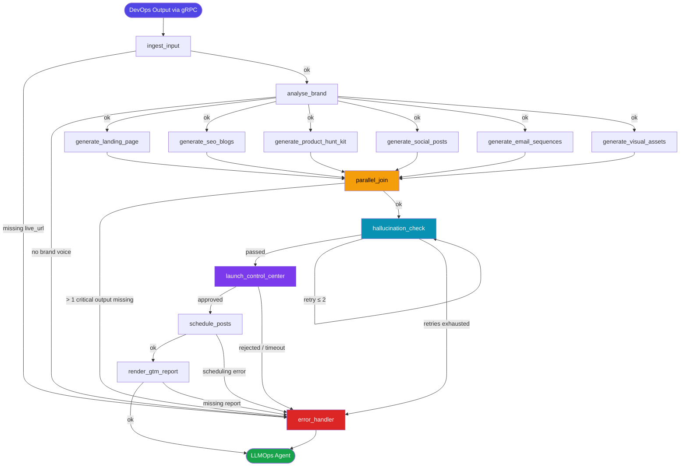
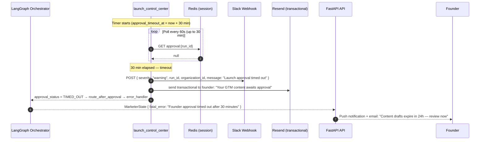

# Low-Level Design — Marketer Agent

> **Phase**: Phase 3 — Launch & GTM (Planned)
> **SLA**: < 45 minutes end-to-end (excluding async Founder Approval gate)
> **Owner**: Auto-Founder AI Platform Team | product@euron.one

---

## Table of Contents

1. [Overview](#1-overview)
2. [LangGraph State Schema (Pydantic V2)](#2-langgraph-state-schema-pydantic-v2)
3. [Node Graph Definition](#3-node-graph-definition)
4. [Tool Bindings](#4-tool-bindings)
5. [Prompt Templates](#5-prompt-templates)
6. [Sequence Diagrams](#6-sequence-diagrams)
7. [Error Handling Logic](#7-error-handling-logic)
8. [Output Contract](#8-output-contract)

---

## 1. Overview

The Marketer Agent is the sixth stage of the Auto-Founder AI pipeline. It receives a `DevOpsOutput` via gRPC (the live MVP URL + brand config) and autonomously produces a complete Go-To-Market (GTM) launch package:

- A **Landing Page** (hero copy, value props, CTA, FAQ, social proof)
- **3–5 SEO Blog Drafts** (long-form, keyword-targeted)
- A **Product Hunt Launch Kit** (tagline, description, first comment, maker note, gallery captions)
- **X / LinkedIn / HackerNews launch posts** (platform-native format per channel)
- **Email Drip Sequences** (5-email onboarding + 3-email reactivation)
- **Brand Visual Assets** (logo prompt, OG image, social card — generated via DALL-E 3)

All content passes a **Hallucination Check** (cross-referenced against the Architect Agent's actual feature list) before reaching the **Launch Control Center** — a mandatory HITL approval gate where the Founder reviews and approves every draft before any content is posted or scheduled.

### Sub-tasks executed (with target SLA)

| Sub-task | Node | Target |
|---|---|---|
| Ingest + validate DevOps output + brand config | `ingest_input` | < 15 s |
| Brand voice & positioning analysis | `analyse_brand` | < 2 min |
| Landing page copy generation | `generate_landing_page` | < 5 min |
| SEO blog drafts | `generate_seo_blogs` | < 8 min |
| Product Hunt launch kit | `generate_product_hunt_kit` | < 4 min |
| Social media posts (X / LinkedIn / HN) | `generate_social_posts` | < 4 min |
| Email drip sequences | `generate_email_sequences` | < 5 min |
| Brand visual asset prompts (DALL-E 3) | `generate_visual_assets` | < 3 min |
| Parallel join (all content branches) | `parallel_join` | — |
| Hallucination check (feature cross-reference) | `hallucination_check` | < 3 min |
| Launch Control Center (HITL approval) | `launch_control_center` | async (30 min timeout) |
| Post scheduling (Buffer / Typefully) | `schedule_posts` | < 2 min |
| GTM report rendering | `render_gtm_report` | < 2 min |

---

## 2. LangGraph State Schema (Pydantic V2)

```python
# backend/app/agents/marketer/schema.py

from __future__ import annotations

from datetime import datetime
from enum import StrEnum
from typing import Annotated, Any
from uuid import UUID, uuid4

from pydantic import BaseModel, Field, field_validator, model_validator
from langgraph.graph.message import add_messages


# ---------------------------------------------------------------------------
# Enums
# ---------------------------------------------------------------------------

class NodeStatus(StrEnum):
    PENDING   = "pending"
    RUNNING   = "running"
    COMPLETED = "completed"
    FAILED    = "failed"
    SKIPPED   = "skipped"


class ApprovalStatus(StrEnum):
    PENDING   = "pending"
    APPROVED  = "approved"
    REJECTED  = "rejected"
    TIMED_OUT = "timed_out"


class SocialChannel(StrEnum):
    X          = "x"
    LINKEDIN   = "linkedin"
    HACKERNEWS = "hackernews"
    REDDIT     = "reddit"


class ContentStatus(StrEnum):
    DRAFT    = "draft"
    APPROVED = "approved"
    REJECTED = "rejected"
    SCHEDULED = "scheduled"
    POSTED   = "posted"


class HallucinationSeverity(StrEnum):
    NONE     = "none"
    WARNING  = "warning"   # claim is vague but not demonstrably false
    CRITICAL = "critical"  # claim contradicts the feature list


class BrandTone(StrEnum):
    PROFESSIONAL  = "professional"
    CASUAL        = "casual"
    PLAYFUL       = "playful"
    TECHNICAL     = "technical"
    INSPIRATIONAL = "inspirational"


# ---------------------------------------------------------------------------
# Sub-models: Input / Brand Config
# ---------------------------------------------------------------------------

class BrandConfig(BaseModel):
    product_name: str
    tagline: str | None                  = None
    primary_color_hex: str | None        = None
    secondary_color_hex: str | None      = None
    logo_url: str | None                 = None
    tone: BrandTone                      = BrandTone.PROFESSIONAL
    target_audience: str | None          = None
    usp: str | None                      = None   # Unique Selling Proposition
    competitor_names: list[str]          = Field(default_factory=list)


class FeatureList(BaseModel):
    """Canonical feature list from Architect Agent — used for hallucination guard."""
    features: list[str]   = Field(..., min_length=1)
    integrations: list[str] = Field(default_factory=list)
    pricing_tiers: list[dict[str, Any]] = Field(default_factory=list)


# ---------------------------------------------------------------------------
# Sub-models: Landing Page
# ---------------------------------------------------------------------------

class CTAButton(BaseModel):
    text: str
    url: str
    variant: str = "primary"   # "primary" | "secondary"


class LandingPageSection(BaseModel):
    section: str      # "hero" | "features" | "social_proof" | "pricing" | "faq" | "cta_footer"
    headline: str
    subheadline: str | None = None
    body: str | None        = None
    cta_buttons: list[CTAButton] = Field(default_factory=list)
    bullet_points: list[str]     = Field(default_factory=list)


class LandingPageCopy(BaseModel):
    meta_title: str             = Field(..., max_length=60)
    meta_description: str       = Field(..., max_length=160)
    og_title: str               = Field(..., max_length=60)
    og_description: str         = Field(..., max_length=200)
    sections: list[LandingPageSection]
    status: ContentStatus       = ContentStatus.DRAFT


# ---------------------------------------------------------------------------
# Sub-models: SEO Blog
# ---------------------------------------------------------------------------

class SEOBlogDraft(BaseModel):
    title: str
    target_keyword: str
    secondary_keywords: list[str]       = Field(default_factory=list)
    word_count_target: int              = Field(1500, ge=800, le=4000)
    outline: list[str]                  # H2 section headings
    intro: str
    body_markdown: str
    conclusion: str
    meta_description: str               = Field(..., max_length=160)
    internal_link_suggestions: list[str] = Field(default_factory=list)
    status: ContentStatus               = ContentStatus.DRAFT


# ---------------------------------------------------------------------------
# Sub-models: Product Hunt Kit
# ---------------------------------------------------------------------------

class ProductHuntKit(BaseModel):
    name: str                           = Field(..., max_length=60)
    tagline: str                        = Field(..., max_length=60)
    description: str                    = Field(..., max_length=260)
    first_comment: str                  = Field(..., max_length=800)
    maker_note: str                     = Field(..., max_length=500)
    gallery_captions: list[str]         = Field(..., min_length=3, max_length=5)
    topics: list[str]                   = Field(..., min_length=1, max_length=5)
    launch_day: str | None              = None   # "Tuesday" or ISO date
    status: ContentStatus               = ContentStatus.DRAFT


# ---------------------------------------------------------------------------
# Sub-models: Social Posts
# ---------------------------------------------------------------------------

class SocialPost(BaseModel):
    channel: SocialChannel
    content: str
    hashtags: list[str]                 = Field(default_factory=list)
    media_prompt: str | None            = None   # prompt for DALL-E 3 if image needed
    scheduled_at: datetime | None       = None
    buffer_post_id: str | None          = None
    status: ContentStatus               = ContentStatus.DRAFT

    @field_validator("content")
    @classmethod
    def validate_length(cls, v: str, info) -> str:
        # values may not yet be populated in all contexts, skip gracefully
        return v


class SocialPostBundle(BaseModel):
    launch_thread_x: list[SocialPost]   = Field(default_factory=list)   # tweet thread
    launch_post_linkedin: SocialPost | None = None
    launch_post_hn: SocialPost | None       = None                       # Ask HN / Show HN


# ---------------------------------------------------------------------------
# Sub-models: Email Sequences
# ---------------------------------------------------------------------------

class EmailMessage(BaseModel):
    subject: str
    preview_text: str                   = Field(..., max_length=100)
    body_html: str
    body_text: str
    send_delay_days: int                = Field(0, ge=0)
    cta_url: str | None                 = None
    cta_text: str | None                = None


class EmailSequence(BaseModel):
    sequence_type: str                  # "onboarding" | "reactivation"
    emails: list[EmailMessage]          = Field(..., min_length=1)
    status: ContentStatus               = ContentStatus.DRAFT


# ---------------------------------------------------------------------------
# Sub-models: Visual Assets
# ---------------------------------------------------------------------------

class VisualAssetPrompt(BaseModel):
    asset_type: str       # "logo", "og_image", "social_card", "product_screenshot_mockup"
    dalle_prompt: str
    dimensions: str       # e.g. "1200x630" for OG image
    style_notes: str | None = None
    generated_url: str | None = None   # populated after DALL-E call


# ---------------------------------------------------------------------------
# Sub-models: Hallucination Check
# ---------------------------------------------------------------------------

class HallucinationFinding(BaseModel):
    content_type: str       # "landing_page" | "seo_blog" | "product_hunt" | "social" | "email"
    claim: str
    severity: HallucinationSeverity
    correction: str | None  = None


class HallucinationReport(BaseModel):
    findings: list[HallucinationFinding] = Field(default_factory=list)
    critical_count: int      = 0
    warning_count: int       = 0
    passed: bool             = False

    @model_validator(mode="after")
    def derive_counts_and_pass(self) -> HallucinationReport:
        critical = sum(1 for f in self.findings if f.severity == HallucinationSeverity.CRITICAL)
        warnings = sum(1 for f in self.findings if f.severity == HallucinationSeverity.WARNING)
        object.__setattr__(self, "critical_count", critical)
        object.__setattr__(self, "warning_count", warnings)
        object.__setattr__(self, "passed", critical == 0)
        return self


# ---------------------------------------------------------------------------
# Execution metadata helpers
# ---------------------------------------------------------------------------

class NodeTrace(BaseModel):
    node: str
    status: NodeStatus
    started_at: datetime | None   = None
    completed_at: datetime | None = None
    error: str | None             = None
    retry_count: int              = 0


class RetryPolicy(BaseModel):
    max_retries: int              = 3
    backoff_seconds: list[int]    = Field(default_factory=lambda: [5, 15, 45])


# ---------------------------------------------------------------------------
# Root Graph State
# ---------------------------------------------------------------------------

class MarketerState(BaseModel):
    """
    Single source of truth threaded through every node in the Marketer graph.
    LangGraph merges updates via add_messages for the messages channel;
    all other fields are last-write-wins.
    """

    # Identity
    run_id: UUID            = Field(default_factory=uuid4)
    parent_run_id: UUID     = Field(..., description="DevOps Agent run_id")
    organization_id: str    = Field(..., description="Validated from Supabase JWT claims")

    # Input from DevOps Agent
    live_url: str           = Field(..., description="Publicly accessible live MVP URL")
    idea_normalised: str
    domain: str
    viability_band: str
    lean_canvas_json: str

    # Brand config (supplied by Founder in UI or derived from idea)
    brand_config: BrandConfig
    feature_list: FeatureList   = Field(..., description="Canonical features from Architect Agent")

    # Brand analysis (sequential, pre-parallel)
    brand_voice_summary: str | None      = None
    positioning_statement: str | None    = None
    seo_keyword_targets: list[str]       = Field(default_factory=list)

    # Parallel content generation outputs
    landing_page: LandingPageCopy | None           = None
    seo_blogs: list[SEOBlogDraft]                  = Field(default_factory=list)
    product_hunt_kit: ProductHuntKit | None        = None
    social_post_bundle: SocialPostBundle | None    = None
    email_sequences: list[EmailSequence]           = Field(default_factory=list)
    visual_asset_prompts: list[VisualAssetPrompt]  = Field(default_factory=list)

    # Hallucination check (post-join)
    hallucination_report: HallucinationReport | None = None
    hallucination_retry_count: int                   = 0

    # Founder approval (HITL)
    approval_status: ApprovalStatus      = ApprovalStatus.PENDING
    approval_comment: str | None         = None
    approved_content_types: list[str]    = Field(default_factory=list)
    rejected_content_types: list[str]    = Field(default_factory=list)
    approval_timeout_at: datetime | None = None

    # Scheduling outputs (post-approval)
    scheduled_post_ids: dict[str, str]   = Field(
        default_factory=dict,
        description="channel → external scheduler post ID (Buffer / Typefully)"
    )

    # Final GTM report
    gtm_report_markdown: str | None      = None

    # Execution metadata
    node_traces: list[NodeTrace]         = Field(default_factory=list)
    retry_policy: RetryPolicy            = Field(default_factory=RetryPolicy)
    total_llm_tokens_used: int           = 0
    total_tool_calls: int                = 0
    error_count: int                     = 0

    # LangGraph message channel
    messages: Annotated[list[Any], add_messages] = Field(default_factory=list)

    # Terminal flags
    is_complete: bool        = False
    fatal_error: str | None  = None

    class Config:
        arbitrary_types_allowed = True
```

---

## 3. Node Graph Definition

### 3.1 Node inventory

| Node ID | Type | Description | Model |
|---|---|---|---|
| `ingest_input` | Sequential | Validate DevOps output, brand config, feature list | — (validation only) |
| `analyse_brand` | Sequential | Brand voice, positioning statement, SEO keyword targets | Gemini 3.5 Flash |
| `generate_landing_page` | Parallel branch | Full landing page copy (hero → FAQ → CTA) | Gemini 3.5 Flash |
| `generate_seo_blogs` | Parallel branch | 3–5 long-form SEO blog drafts | Gemini 3.5 Flash |
| `generate_product_hunt_kit` | Parallel branch | PH launch assets (tagline, description, first comment) | Gemini 3.5 Flash |
| `generate_social_posts` | Parallel branch | X thread, LinkedIn post, HN post | Gemini 3.5 Flash |
| `generate_email_sequences` | Parallel branch | Onboarding (5 emails) + reactivation (3 emails) | Gemini 3.5 Flash |
| `generate_visual_assets` | Parallel branch | DALL-E 3 prompts + image generation | DALL-E 3 |
| `parallel_join` | Barrier | Waits for all 6 parallel content nodes | — |
| `hallucination_check` | Sequential | Cross-reference all copy against canonical feature list | Gemini 3.5 Flash |
| `launch_control_center` | HITL / Async | Founder reviews and approves drafts; 30 min timeout | — |
| `schedule_posts` | Sequential | Push approved posts to Buffer / Typefully / Resend | — (API calls) |
| `render_gtm_report` | Sequential | Assembles final GTM Markdown report | Gemini 3.5 Flash |
| `error_handler` | Error sink | Retries or escalates failed nodes | — |

### 3.2 Graph definition

```python
# backend/app/agents/marketer/graph.py

from langgraph.graph import StateGraph, END
from langgraph.checkpoint.postgres import PostgresSaver

from .schema import MarketerState
from .nodes import (
    ingest_input,
    analyse_brand,
    generate_landing_page,
    generate_seo_blogs,
    generate_product_hunt_kit,
    generate_social_posts,
    generate_email_sequences,
    generate_visual_assets,
    parallel_join,
    hallucination_check,
    launch_control_center,
    schedule_posts,
    render_gtm_report,
    error_handler,
)
from .routers import (
    route_after_ingest,
    route_after_brand,
    route_after_join,
    route_after_hallucination,
    route_after_approval,
    route_after_schedule,
    route_terminal,
)


def build_marketer_graph(checkpointer: PostgresSaver) -> StateGraph:
    graph = StateGraph(MarketerState)

    # -- Node registration --------------------------------------------------
    graph.add_node("ingest_input",               ingest_input)
    graph.add_node("analyse_brand",              analyse_brand)
    graph.add_node("generate_landing_page",      generate_landing_page)
    graph.add_node("generate_seo_blogs",         generate_seo_blogs)
    graph.add_node("generate_product_hunt_kit",  generate_product_hunt_kit)
    graph.add_node("generate_social_posts",      generate_social_posts)
    graph.add_node("generate_email_sequences",   generate_email_sequences)
    graph.add_node("generate_visual_assets",     generate_visual_assets)
    graph.add_node("parallel_join",              parallel_join)
    graph.add_node("hallucination_check",        hallucination_check)
    graph.add_node("launch_control_center",      launch_control_center)
    graph.add_node("schedule_posts",             schedule_posts)
    graph.add_node("render_gtm_report",          render_gtm_report)
    graph.add_node("error_handler",              error_handler)

    # -- Entry point --------------------------------------------------------
    graph.set_entry_point("ingest_input")

    # -- Ingest → brand analysis (sequential) --------------------------------
    graph.add_conditional_edges(
        "ingest_input",
        route_after_ingest,
        {
            "analyse_brand": "analyse_brand",
            "error_handler": "error_handler",
        },
    )

    # -- Brand analysis → fan-out to parallel content branches ---------------
    graph.add_conditional_edges(
        "analyse_brand",
        route_after_brand,
        {
            "parallel":      [
                "generate_landing_page",
                "generate_seo_blogs",
                "generate_product_hunt_kit",
                "generate_social_posts",
                "generate_email_sequences",
                "generate_visual_assets",
            ],
            "error_handler": "error_handler",
        },
    )

    # -- All parallel branches converge at barrier --------------------------
    for node in (
        "generate_landing_page",
        "generate_seo_blogs",
        "generate_product_hunt_kit",
        "generate_social_posts",
        "generate_email_sequences",
        "generate_visual_assets",
    ):
        graph.add_edge(node, "parallel_join")

    # -- Post-join: hallucination check ------------------------------------
    graph.add_conditional_edges(
        "parallel_join",
        route_after_join,
        {
            "hallucination_check": "hallucination_check",
            "error_handler":       "error_handler",
        },
    )

    # -- Hallucination check → HITL gate or re-generate -------------------
    graph.add_conditional_edges(
        "hallucination_check",
        route_after_hallucination,
        {
            "launch_control_center": "launch_control_center",
            "hallucination_check":   "hallucination_check",   # re-enter after auto-correction
            "error_handler":         "error_handler",
        },
    )

    # -- Launch Control Center (HITL) → schedule or error ------------------
    graph.add_conditional_edges(
        "launch_control_center",
        route_after_approval,
        {
            "schedule_posts": "schedule_posts",
            "error_handler":  "error_handler",   # rejected or timed out
        },
    )

    # -- Schedule → render report -----------------------------------------
    graph.add_conditional_edges(
        "schedule_posts",
        route_after_schedule,
        {
            "render_gtm_report": "render_gtm_report",
            "error_handler":     "error_handler",
        },
    )

    # -- Terminal routing --------------------------------------------------
    graph.add_conditional_edges(
        "render_gtm_report",
        route_terminal,
        {
            "end":           END,
            "error_handler": "error_handler",
        },
    )

    graph.add_edge("error_handler", END)

    return graph.compile(
        checkpointer=checkpointer,
        interrupt_before=["launch_control_center"],   # LangGraph HITL interrupt
    )


# ---------------------------------------------------------------------------
# Router implementations
# ---------------------------------------------------------------------------

# backend/app/agents/marketer/routers.py

def route_after_ingest(state: MarketerState) -> str:
    if state.fatal_error or not state.live_url:
        return "error_handler"
    return "analyse_brand"


def route_after_brand(state: MarketerState) -> str | list[str]:
    if state.fatal_error or not state.brand_voice_summary:
        return "error_handler"
    return "parallel"


def route_after_join(state: MarketerState) -> str:
    if state.error_count >= state.retry_policy.max_retries:
        return "error_handler"
    missing = [
        f for f in ("landing_page", "product_hunt_kit", "social_post_bundle")
        if getattr(state, f) is None
    ]
    if len(missing) > 1:
        return "error_handler"
    return "hallucination_check"


def route_after_hallucination(state: MarketerState) -> str:
    report = state.hallucination_report
    if report is None:
        return "error_handler"
    if report.passed:
        return "launch_control_center"
    if state.hallucination_retry_count >= 2:
        return "error_handler"
    return "hallucination_check"   # re-enter for auto-correction pass


def route_after_approval(state: MarketerState) -> str:
    from .schema import ApprovalStatus
    if state.approval_status == ApprovalStatus.APPROVED and state.approved_content_types:
        return "schedule_posts"
    return "error_handler"


def route_after_schedule(state: MarketerState) -> str:
    if state.fatal_error:
        return "error_handler"
    return "render_gtm_report"


def route_terminal(state: MarketerState) -> str:
    if state.fatal_error or not state.gtm_report_markdown:
        return "error_handler"
    return "end"
```

### 3.3 Visual graph (Mermaid)



---

## 4. Tool Bindings

### 4.1 Tool definitions (LangChain-compatible)

```python
# backend/app/agents/marketer/tools.py

import os
import httpx
from langchain.tools import StructuredTool
from langchain_community.tools.tavily_search import TavilySearchResults
from pydantic import BaseModel, Field
from openai import AsyncOpenAI


# -- Tavily Search (SEO research, competitor copy benchmarking) ------------

tavily_search = TavilySearchResults(
    max_results=8,
    api_key=os.environ["TAVILY_API_KEY"],
    search_depth="advanced",
    include_answer=True,
    include_raw_content=False,
)


# -- Ahrefs Keyword Data ---------------------------------------------------

class AhrefsInput(BaseModel):
    keyword: str   = Field(..., description="Seed keyword to research")
    country: str   = Field("us", description="Two-letter country code")
    limit: int     = Field(20, ge=1, le=100)

async def _ahrefs_keywords(keyword: str, country: str = "us", limit: int = 20) -> dict:
    async with httpx.AsyncClient() as client:
        resp = await client.get(
            "https://apiv2.ahrefs.com",
            params={
                "token":   os.environ["AHREFS_API_KEY"],
                "from":    "keywords_explorer",
                "target":  keyword,
                "country": country,
                "limit":   limit,
                "output":  "json",
            },
            timeout=20,
        )
        resp.raise_for_status()
        return resp.json()

ahrefs_keywords = StructuredTool.from_function(
    coroutine=_ahrefs_keywords,
    name="ahrefs_keywords",
    description="Fetch keyword volume, difficulty, and CPC data from Ahrefs Keywords Explorer.",
    args_schema=AhrefsInput,
)


# -- DALL-E 3 Image Generation ---------------------------------------------

class DalleInput(BaseModel):
    prompt: str           = Field(..., description="Detailed DALL-E 3 image generation prompt")
    size: str             = Field("1792x1024", description="'1024x1024' | '1792x1024' | '1024x1792'")
    quality: str          = Field("hd", description="'standard' | 'hd'")
    style: str            = Field("natural", description="'vivid' | 'natural'")

async def _generate_image(prompt: str, size: str = "1792x1024",
                           quality: str = "hd", style: str = "natural") -> dict:
    client = AsyncOpenAI(api_key=os.environ["OPENAI_API_KEY"])
    response = await client.images.generate(
        model="dall-e-3",
        prompt=prompt,
        size=size,
        quality=quality,
        style=style,
        n=1,
    )
    return {"url": response.data[0].url, "revised_prompt": response.data[0].revised_prompt}

generate_image = StructuredTool.from_function(
    coroutine=_generate_image,
    name="generate_image",
    description="Generate a brand visual asset using DALL-E 3. Returns a CDN URL and revised prompt.",
    args_schema=DalleInput,
)


# -- Buffer Social Post Scheduling -----------------------------------------

class BufferInput(BaseModel):
    profile_id: str   = Field(..., description="Buffer profile ID for the social channel")
    text: str         = Field(..., description="Post content")
    scheduled_at: str = Field(..., description="ISO 8601 datetime to schedule the post")
    media_urls: list[str] = Field(default_factory=list)

async def _buffer_schedule(profile_id: str, text: str,
                            scheduled_at: str, media_urls: list[str] = None) -> dict:
    async with httpx.AsyncClient() as client:
        resp = await client.post(
            "https://api.bufferapp.com/1/updates/create.json",
            headers={"Authorization": f"Bearer {os.environ['BUFFER_ACCESS_TOKEN']}"},
            json={
                "profile_ids[]": [profile_id],
                "text":          text,
                "scheduled_at":  scheduled_at,
                "media":         {"link": media_urls[0]} if media_urls else {},
            },
            timeout=15,
        )
        resp.raise_for_status()
        data = resp.json()
        return {"update_id": data.get("updates", [{}])[0].get("id"), "status": "scheduled"}

buffer_schedule = StructuredTool.from_function(
    coroutine=_buffer_schedule,
    name="buffer_schedule",
    description="Schedule a social media post via Buffer. Returns the Buffer update ID.",
    args_schema=BufferInput,
)


# -- Typefully Thread Scheduling (X) ---------------------------------------

class TypefullyInput(BaseModel):
    tweets: list[str] = Field(..., description="List of tweet strings forming a thread")
    scheduled_at: str = Field(..., description="ISO 8601 datetime to schedule the thread")

async def _typefully_schedule(tweets: list[str], scheduled_at: str) -> dict:
    async with httpx.AsyncClient() as client:
        resp = await client.post(
            "https://api.typefully.com/v1/drafts/",
            headers={
                "X-API-KEY": f"Bearer {os.environ['TYPEFULLY_API_KEY']}",
                "Content-Type": "application/json",
            },
            json={
                "content":      "\n\n".join(tweets),
                "schedule-date": scheduled_at,
                "threadify":    False,
            },
            timeout=15,
        )
        resp.raise_for_status()
        data = resp.json()
        return {"draft_id": data.get("id"), "status": "scheduled"}

typefully_schedule = StructuredTool.from_function(
    coroutine=_typefully_schedule,
    name="typefully_schedule",
    description="Schedule a Twitter/X thread via Typefully. Returns the draft ID.",
    args_schema=TypefullyInput,
)


# -- Resend Email Broadcast ------------------------------------------------

class ResendBroadcastInput(BaseModel):
    audience_id: str  = Field(..., description="Resend audience ID")
    subject: str
    html: str
    from_address: str = Field(..., description="Sender address, e.g. 'hello@product.com'")
    schedule_at: str | None = Field(None, description="ISO 8601 datetime or null to send immediately")

async def _resend_broadcast(audience_id: str, subject: str, html: str,
                             from_address: str, schedule_at: str | None = None) -> dict:
    payload: dict = {
        "from":        from_address,
        "to":          [f"audience:{audience_id}"],
        "subject":     subject,
        "html":        html,
    }
    if schedule_at:
        payload["scheduled_at"] = schedule_at

    async with httpx.AsyncClient() as client:
        resp = await client.post(
            "https://api.resend.com/broadcasts",
            headers={"Authorization": f"Bearer {os.environ['RESEND_API_KEY']}"},
            json=payload,
            timeout=15,
        )
        resp.raise_for_status()
        return resp.json()

resend_broadcast = StructuredTool.from_function(
    coroutine=_resend_broadcast,
    name="resend_broadcast",
    description="Schedule or immediately send an email broadcast via Resend.",
    args_schema=ResendBroadcastInput,
)


# -- Tool registry (keyed by node) -----------------------------------------

TOOL_REGISTRY: dict[str, list] = {
    "ingest_input":              [],
    "analyse_brand":             [tavily_search, ahrefs_keywords],
    "generate_landing_page":     [tavily_search],
    "generate_seo_blogs":        [ahrefs_keywords, tavily_search],
    "generate_product_hunt_kit": [tavily_search],
    "generate_social_posts":     [],
    "generate_email_sequences":  [],
    "generate_visual_assets":    [generate_image],
    "hallucination_check":       [],   # LLM-only, reads state
    "launch_control_center":     [],   # HITL, no tools
    "schedule_posts":            [buffer_schedule, typefully_schedule, resend_broadcast],
    "render_gtm_report":         [],
}
```

### 4.2 Tool timeout and rate-limit policy

| Tool | Timeout | Rate limit guard | Fallback |
|---|---|---|---|
| Tavily | 20 s | 60 req/min via token bucket | Skip, LLM uses training knowledge |
| Ahrefs Keywords | 20 s | 500 req/day (plan-dependent) | Tavily keyword data |
| DALL-E 3 | 60 s | 5 img/min (tier-dependent) | Return prompt only, skip generation |
| Buffer | 15 s | 10 req/s | Typefully for X; log failure for others |
| Typefully | 15 s | 10 req/s | Buffer fallback |
| Resend | 15 s | 10 req/s | SendGrid fallback via env var override |

---

## 5. Prompt Templates

All prompts use **Gemini 3.5 Flash** (copy writing, long-form content, reasoning, hallucination checking) per the model routing policy; Claude Sonnet is available only as a fallback.

### 5.1 `analyse_brand` — Brand Voice & Positioning

```jinja2
{# backend/app/agents/marketer/prompts/analyse_brand.j2 #}

SYSTEM:
You are a brand strategist for a SaaS product launch. Analyse the idea, Lean Canvas,
and any competitor names to define a clear brand voice and positioning statement.
Do NOT invent product capabilities — only use what is in the feature list.

Rules:
- Return ONLY valid JSON, no markdown fences.
- Tone must be one of: professional, casual, playful, technical, inspirational.
- Positioning statement follows the format:
  "For [target customer] who [need], [product name] is a [category] that [key benefit],
   unlike [competitor], our product [differentiator]."

USER:
Idea: {{ idea_normalised }}
Domain: {{ domain }}
Viability band: {{ viability_band }}
Brand config: {{ brand_config | tojson }}
Feature list: {{ feature_list.features | join(', ') }}
Competitors: {{ brand_config.competitor_names | join(', ') or 'unknown' }}
Lean Canvas (UVP): {{ lean_canvas_json }}
Ahrefs / Tavily research results available in context.

Return:
{
  "brand_voice_summary": string,         // 2–3 sentences describing tone, vocabulary, persona
  "positioning_statement": string,        // follows the template above
  "seo_keyword_targets": [string],        // 5–10 high-intent keywords for content strategy
  "recommended_tone": "professional" | "casual" | "playful" | "technical" | "inspirational"
}
```

### 5.2 `generate_landing_page` — Landing Page Copy

```jinja2
{# backend/app/agents/marketer/prompts/generate_landing_page.j2 #}

SYSTEM:
You are a conversion copywriter writing a SaaS landing page. Every claim must be
grounded in the feature list — do not invent capabilities. Apply the brand voice
and positioning statement. Write for clarity and conversion, not cleverness.

Constraints:
- Meta title ≤ 60 characters; meta description ≤ 160 characters.
- Hero headline: benefit-led, ≤ 10 words.
- Return ONLY valid JSON, no markdown fences.
- Do NOT use placeholder text like [INSERT X] — every field must be populated.
- Use the live_url for all CTA button hrefs.

USER:
Product name: {{ brand_config.product_name }}
Live URL: {{ live_url }}
Positioning: {{ positioning_statement }}
Brand voice: {{ brand_voice_summary }}
Feature list: {{ feature_list.features | tojson }}
Integrations: {{ feature_list.integrations | join(', ') or 'none specified' }}
Pricing tiers: {{ feature_list.pricing_tiers | tojson }}
Personas (from Strategist): embedded in Lean Canvas below
Lean Canvas: {{ lean_canvas_json }}

Generate a full landing page with these exact sections:
["hero", "features", "social_proof", "pricing", "faq", "cta_footer"]

Return:
{
  "meta_title": string,
  "meta_description": string,
  "og_title": string,
  "og_description": string,
  "sections": [
    {
      "section": string,
      "headline": string,
      "subheadline": string | null,
      "body": string | null,
      "cta_buttons": [{"text": string, "url": string, "variant": "primary" | "secondary"}],
      "bullet_points": [string]
    }
  ]
}

For the "features" section: 3–6 feature blocks, each grounded in feature_list.features.
For the "faq" section: 4–6 Q&A pairs addressing common objections.
```

### 5.3 `generate_seo_blogs` — SEO Blog Drafts

```jinja2
{# backend/app/agents/marketer/prompts/generate_seo_blogs.j2 #}

SYSTEM:
You are an SEO content strategist and long-form writer. Write blog posts that rank
on Google and provide genuine value to readers. Every factual claim must be sourced
from the feature list, Lean Canvas, or Ahrefs/Tavily research in context.

Rules:
- Target word count: 1,500–2,500 words per post.
- Each post targets ONE primary keyword and 3–5 secondary keywords.
- Intro must hook the reader within the first 100 words; conclusion must have a CTA.
- Return ONLY valid JSON containing an array of blog draft objects.
- Do NOT fabricate statistics — if citing a stat, reference the source URL.

USER:
Product name: {{ brand_config.product_name }}
Live URL: {{ live_url }}
SEO keyword targets: {{ seo_keyword_targets | join(', ') }}
Feature list: {{ feature_list.features | tojson }}
Domain: {{ domain }}
Brand voice: {{ brand_voice_summary }}
Ahrefs keyword data and Tavily research available in context.

Generate 3 blog post drafts. Each draft:
{
  "title": string,
  "target_keyword": string,
  "secondary_keywords": [string],
  "word_count_target": int,
  "outline": [string],         // H2 section headings
  "intro": string,             // ≤ 150 words
  "body_markdown": string,     // full Markdown body with H2/H3 structure
  "conclusion": string,        // ≤ 100 words, ends with CTA linking to live_url
  "meta_description": string   // ≤ 160 characters
}

Post topics must cover: (1) problem-aware readers, (2) solution-aware readers,
(3) product comparison / "best [tool] for [use case]" searchers.
```

### 5.4 `generate_product_hunt_kit` — Product Hunt Launch Assets

```jinja2
{# backend/app/agents/marketer/prompts/generate_product_hunt_kit.j2 #}

SYSTEM:
You are a Product Hunt launch specialist. Write copy that is concise, benefit-focused,
and authentic — avoid startup jargon ("disrupting", "10x", "game-changer").
Every feature claim must exist in the feature list.

Product Hunt format constraints:
- name: ≤ 60 chars (usually just the product name)
- tagline: ≤ 60 chars, verb-led ("Turn ideas into deployed apps in 15 minutes")
- description: ≤ 260 chars, what it does and who it's for
- first_comment: 500–800 chars, maker story + key use cases + ask for feedback
- maker_note: 300–500 chars, personal note from the founder
- gallery_captions: 3–5 captions, one per screenshot/GIF

USER:
Product name: {{ brand_config.product_name }}
Live URL: {{ live_url }}
Positioning: {{ positioning_statement }}
Feature list: {{ feature_list.features | tojson }}
Domain: {{ domain }}
Brand voice: {{ brand_voice_summary }}

Return:
{
  "name": string,
  "tagline": string,
  "description": string,
  "first_comment": string,
  "maker_note": string,
  "gallery_captions": [string],
  "topics": [string],           // 3–5 PH topics e.g. ["SaaS", "Developer Tools", "Productivity"]
  "launch_day": "Tuesday"       // PH best practice: Tuesday or Wednesday
}
```

### 5.5 `generate_social_posts` — Social Media Copy

```jinja2
{# backend/app/agents/marketer/prompts/generate_social_posts.j2 #}

SYSTEM:
You are a social media copywriter. Write platform-native content — do NOT copy the
same text across channels. Every claim must be grounded in the feature list.

Platform conventions:
- X (Twitter): thread of 4–6 tweets, first tweet is the hook (≤ 280 chars each),
  use 2–3 relevant hashtags total (not per tweet), no thread numbering.
- LinkedIn: single long-form post, 800–1200 chars, professional tone, line breaks for
  readability, 3–5 hashtags at the end, ends with a question to drive comments.
- HackerNews: "Show HN:" post title (≤ 80 chars) + comment body (plain text, no markdown,
  500–800 chars), technical audience, no marketing language.

USER:
Product name: {{ brand_config.product_name }}
Live URL: {{ live_url }}
Positioning: {{ positioning_statement }}
Brand voice: {{ brand_voice_summary }}
Feature list: {{ feature_list.features | tojson }}
Domain: {{ domain }}

Return:
{
  "launch_thread_x": [
    {
      "channel": "x",
      "content": string,     // individual tweet text
      "hashtags": [string]
    }
  ],
  "launch_post_linkedin": {
    "channel": "linkedin",
    "content": string,
    "hashtags": [string]
  },
  "launch_post_hn": {
    "channel": "hackernews",
    "content": string,       // "Show HN: {title}\n\n{body}"
    "hashtags": []
  }
}
```

### 5.6 `generate_email_sequences` — Email Drip Campaigns

```jinja2
{# backend/app/agents/marketer/prompts/generate_email_sequences.j2 #}

SYSTEM:
You are an email marketing specialist writing high-deliverability drip sequences.
Use plain, conversational language. Every feature mentioned must exist in the feature list.
Avoid spam trigger words (free, guaranteed, urgent, act now).

Sequences to generate:
1. ONBOARDING (5 emails): Days 0, 1, 3, 7, 14
   - Day 0: Welcome + first action (single CTA)
   - Day 1: Key feature spotlight #1
   - Day 3: Key feature spotlight #2 + social proof
   - Day 7: "Are you getting value?" check-in + tip
   - Day 14: Upgrade prompt (if freemium) or upsell

2. REACTIVATION (3 emails): for inactive users after 30 days
   - Email 1: "We miss you" + what's new
   - Email 2: Value reminder + single use case
   - Email 3: Final nudge + opt-out gracefully

USER:
Product name: {{ brand_config.product_name }}
Live URL: {{ live_url }}
Feature list: {{ feature_list.features | tojson }}
Pricing tiers: {{ feature_list.pricing_tiers | tojson }}
Brand voice: {{ brand_voice_summary }}
Domain: {{ domain }}

Return a JSON array with two sequence objects:
[
  {
    "sequence_type": "onboarding",
    "emails": [
      {
        "subject": string,
        "preview_text": string,   // ≤ 100 chars
        "body_html": string,      // full HTML email body
        "body_text": string,      // plain-text fallback
        "send_delay_days": int,
        "cta_url": string,
        "cta_text": string
      }
    ]
  },
  {
    "sequence_type": "reactivation",
    "emails": [...]
  }
]
```

### 5.7 `generate_visual_assets` — DALL-E 3 Brand Visuals

```jinja2
{# backend/app/agents/marketer/prompts/generate_visual_assets.j2 #}

SYSTEM:
You are a brand designer writing DALL-E 3 prompts for SaaS product visuals.
Write prompts that produce professional, clean, and on-brand imagery.
Include style, composition, colour palette, and mood in every prompt.
After generating prompts, call the generate_image tool for each one.

USER:
Product name: {{ brand_config.product_name }}
Brand tone: {{ brand_config.tone }}
Primary colour: {{ brand_config.primary_color_hex or 'not specified — choose a professional palette' }}
Secondary colour: {{ brand_config.secondary_color_hex or 'complement primary' }}
Domain: {{ domain }}
Target audience: {{ brand_config.target_audience or 'SaaS founders and product managers' }}

Generate prompts and images for these 4 assets:
1. OG Image (1792x1024): product name + tagline on a branded background
2. Social Card (1024x1024): square card for X/LinkedIn profile link sharing
3. Product Hunt Gallery Image 1 (1270x952): hero screenshot mockup on device
4. Email Header Banner (600x200): minimal header for email sequences

For each asset call the generate_image tool and return:
[
  {
    "asset_type": string,
    "dalle_prompt": string,
    "dimensions": string,
    "style_notes": string,
    "generated_url": string   // populated from tool result
  }
]
```

### 5.8 `hallucination_check` — Feature Cross-Reference

```jinja2
{# backend/app/agents/marketer/prompts/hallucination_check.j2 #}

SYSTEM:
You are a content accuracy auditor for a SaaS marketing team. Your job is to find
claims in the generated marketing copy that are NOT supported by the canonical feature list.
Be strict: a vague claim that could be misinterpreted as a non-existent feature is a WARNING.
A claim that directly contradicts the feature list is CRITICAL.

Canonical feature list (ground truth from Architect Agent):
{{ feature_list.features | tojson }}

Canonical integrations:
{{ feature_list.integrations | tojson }}

Rules:
- Only flag claims about product capabilities — not tone, style, or general SaaS truisms.
- Return ONLY valid JSON.
- If passed == true: no critical findings. Warnings are acceptable.


Previous critical findings (auto-correct in this pass):
{{ previous_critical_findings | join('\n') }}


USER:
Landing page sections (hero + features):
{{ landing_page.sections | selectattr('section', 'in', ['hero', 'features']) | list | tojson }}

Product Hunt description + first comment:
{{ product_hunt_kit.description }} | {{ product_hunt_kit.first_comment }}

X thread (first 2 tweets):
{{ social_post_bundle.launch_thread_x[:2] | map(attribute='content') | join(' | ') }}

Email onboarding Day 0 subject + body excerpt:
{{ email_sequences[0].emails[0].subject }} | {{ email_sequences[0].emails[0].body_text[:300] }}

Return:
{
  "findings": [
    {
      "content_type": "landing_page" | "seo_blog" | "product_hunt" | "social" | "email",
      "claim": string,
      "severity": "warning" | "critical",
      "correction": string | null
    }
  ]
}
```

### 5.9 `render_gtm_report` — GTM Report

```jinja2
{# backend/app/agents/marketer/prompts/render_gtm_report.j2 #}

SYSTEM:
You are a technical writer assembling a Go-To-Market launch report in Markdown.
Summarise all generated assets, their approval status, and scheduled post times.
Do not add new content decisions — only report what was created and approved.

USER:
Organization: {{ organization_id }}
Product: {{ brand_config.product_name }}
Live URL: {{ live_url }}
Domain: {{ domain }}

Landing page: {{ 'generated' if landing_page else 'not generated' }}, status={{ landing_page.status if landing_page else 'N/A' }}
SEO blogs: {{ seo_blogs | length }} drafts
Product Hunt kit: {{ 'generated' if product_hunt_kit else 'not generated' }}, launch_day={{ product_hunt_kit.launch_day if product_hunt_kit else 'N/A' }}
Social posts: X thread={{ social_post_bundle.launch_thread_x | length if social_post_bundle else 0 }} tweets, LinkedIn={{ 'yes' if social_post_bundle and social_post_bundle.launch_post_linkedin else 'no' }}, HN={{ 'yes' if social_post_bundle and social_post_bundle.launch_post_hn else 'no' }}
Email sequences: {{ email_sequences | map(attribute='sequence_type') | join(', ') }}
Visual assets: {{ visual_asset_prompts | length }} assets generated
Hallucination check: passed={{ hallucination_report.passed if hallucination_report else false }}, criticals={{ hallucination_report.critical_count if hallucination_report else 'N/A' }}, warnings={{ hallucination_report.warning_count if hallucination_report else 'N/A' }}
Approved content types: {{ approved_content_types | join(', ') or 'none' }}
Rejected content types: {{ rejected_content_types | join(', ') or 'none' }}
Scheduled post IDs: {{ scheduled_post_ids | tojson }}
Founder approval comment: {{ approval_comment or 'None' }}

Structure the GTM report with exactly these sections:
## 1. Launch Overview
## 2. Brand Positioning & Voice
## 3. Landing Page Summary (meta tags + section headlines)
## 4. SEO Content Calendar (blog titles + target keywords)
## 5. Product Hunt Launch Plan (tagline + launch day)
## 6. Social Media Schedule (per-channel post previews)
## 7. Email Sequences Summary (sequence types + subject lines)
## 8. Visual Asset Inventory (asset types + URLs)
## 9. Hallucination Audit Results
## 10. Scheduled Posts & Next Actions

End with a machine-readable JSON block for the LLMOps Agent:
```json
{
  "llmops_handoff": {
    "run_id": "{{ run_id }}",
    "parent_run_id": "{{ parent_run_id }}",
    "organization_id": "{{ organization_id }}",
    "gtm_report_s3_uri": "s3://autofounder-artefacts/{{ organization_id }}/{{ run_id }}/gtm-report.md",
    "hallucination_critical_count": {{ hallucination_report.critical_count if hallucination_report else 0 }},
    "content_approved_count": {{ approved_content_types | length }},
    "content_rejected_count": {{ rejected_content_types | length }}
  }
}
```
```

---

## 6. Sequence Diagrams

### 6.1 Happy-path — end-to-end flow

```mermaid
sequenceDiagram
    autonumber
    actor Founder
    participant API    as FastAPI API Gateway
    participant Graph  as LangGraph Orchestrator
    participant Ingest as ingest_input
    participant Brand  as analyse_brand
    participant Par    as Parallel Content Nodes
    participant Tav    as Tavily
    participant AH     as Ahrefs
    participant DL     as DALL-E 3
    participant Join   as parallel_join
    participant Hall   as hallucination_check
    participant LCC    as launch_control_center
    participant Sched  as schedule_posts
    participant Buf    as Buffer
    participant Typ    as Typefully
    participant Res    as Resend
    participant S3     as AWS S3
    participant Rpt    as render_gtm_report
    participant LLMOps as LLMOps Agent

    Founder ->> API: POST /api/v1/runs { live_url, brand_config, organization_id }
    API ->> Graph: invoke(MarketerState)
    Graph ->> Ingest: validate DevOpsOutput + brand_config + feature_list
    Ingest -->> Graph: { live_url, idea_normalised, feature_list }

    Graph ->> Brand: analyse_brand(state)
    Brand ->> Tav: search("brand positioning {domain}")
    Tav -->> Brand: results
    Brand ->> AH: keywords("{domain} {idea}")
    AH -->> Brand: keyword volumes
    Brand -->> Graph: { brand_voice_summary, positioning_statement, seo_keyword_targets }

    par Parallel content generation (fan-out)
        Graph ->> Par: generate_landing_page
        Par ->> Tav: search("SaaS landing page conversion best practices")
        Tav -->> Par: results
        Par -->> Join: landing_page

        Graph ->> Par: generate_seo_blogs
        Par ->> AH: keywords(seo_keyword_targets[0..2])
        AH -->> Par: keyword data
        Par -->> Join: seo_blogs[]

        Graph ->> Par: generate_product_hunt_kit
        Par ->> Tav: search("top Product Hunt launches {domain}")
        Tav -->> Par: results
        Par -->> Join: product_hunt_kit

        Graph ->> Par: generate_social_posts
        Par -->> Join: social_post_bundle

        Graph ->> Par: generate_email_sequences
        Par -->> Join: email_sequences[]

        Graph ->> Par: generate_visual_assets
        Par ->> DL: generate_image(og_image_prompt)
        DL -->> Par: { url, revised_prompt }
        Par ->> DL: generate_image(social_card_prompt)
        DL -->> Par: { url, revised_prompt }
        Par -->> Join: visual_asset_prompts[]
    end

    Join -->> Graph: all content merged into state

    Graph ->> Hall: hallucination_check(state)
    Hall -->> Graph: { findings: [], critical_count: 0, passed: true }

    Note over Graph,LCC: LangGraph interrupt_before="launch_control_center"
    Graph -->> API: SSE { status: "awaiting_approval", run_id, content_preview_url }
    API -->> Founder: Dashboard — Launch Control Center with all drafts

    Founder ->> API: POST /api/v1/runs/{run_id}/approve { approved_types: ["landing_page","social","email","product_hunt"], comment }
    API ->> Graph: resume(MarketerState, approval_status=APPROVED)

    Graph ->> Sched: schedule_posts(state)
    Sched ->> Typ: schedule thread (X launch day)
    Typ -->> Sched: { draft_id }
    Sched ->> Buf: schedule(LinkedIn post)
    Buf -->> Sched: { update_id }
    Sched ->> Res: broadcast(onboarding email sequence)
    Res -->> Sched: { broadcast_id }
    Sched -->> Graph: scheduled_post_ids updated

    Graph ->> S3: PUT {organization_id}/{run_id}/gtm-report.md
    Graph ->> S3: PUT {organization_id}/{run_id}/landing-page-copy.json
    S3 -->> Graph: upload confirmed

    Graph ->> Rpt: render_gtm_report(state)
    Rpt -->> Graph: gtm_report_markdown

    Graph -->> API: MarketerState (complete)
    API -->> Founder: 200 OK { run_id, gtm_report_url, scheduled_post_count }
    API --)  LLMOps: emit(MarketerOutput) via gRPC
```

### 6.2 Hallucination check failure — auto-correction loop

```mermaid
sequenceDiagram
    autonumber
    participant Graph as LangGraph Orchestrator
    participant Hall  as hallucination_check
    participant State as MarketerState

    Graph ->> Hall: hallucination_check(state) [attempt 1]
    Hall -->> Graph: {
      findings: [
        { content_type: "landing_page", claim: "Supports 100+ integrations", severity: "critical" },
        { content_type: "product_hunt", claim: "AI-powered analytics dashboard", severity: "critical" }
      ],
      critical_count: 2,
      passed: false
    }

    Note over Graph: hallucination_retry_count = 1
    Graph ->> State: store critical findings, increment hallucination_retry_count

    Note over Graph: Re-enter hallucination_check with corrections in prompt context
    Graph ->> Hall: hallucination_check(state) [attempt 2, auto-correct]
    Hall -->> Graph: { findings: [{ severity: "warning" }], critical_count: 0, passed: true }

    Graph -->> State: hallucination_report updated, proceed to launch_control_center
```

### 6.3 Partial approval — founder rejects some content types

```mermaid
sequenceDiagram
    autonumber
    actor Founder
    participant API   as FastAPI API Gateway
    participant Graph as LangGraph Orchestrator
    participant LCC   as launch_control_center
    participant Sched as schedule_posts
    participant Redis as Redis (session)

    Graph -->> API: SSE { status: "awaiting_approval" }
    API -->> Founder: Launch Control Center — 6 content type cards

    Founder ->> API: POST /api/v1/runs/{run_id}/approve {
      approved_types: ["landing_page", "social", "email"],
      rejected_types: ["seo_blogs", "product_hunt_kit"],
      comment: "PH copy needs more personal story; blogs need legal review first"
    }
    API ->> Redis: HSET approval:{run_id} status=approved approved_types=[...] rejected_types=[...]
    API ->> Graph: resume(MarketerState)

    Graph ->> LCC: route_after_approval → "schedule_posts"
    Note over LCC,Sched: Only approved_content_types are scheduled
    Graph ->> Sched: schedule_posts (landing_page + social + email only)
    Sched -->> Graph: scheduled_post_ids { linkedin, x_thread, onboarding_email }

    Graph -->> API: MarketerState { approved: 3, rejected: 2, is_complete: true }
    API -->> Founder: 200 OK { note: "3 of 5 content types scheduled. 2 require revision." }
```

### 6.4 Fatal error — DALL-E 3 failure with Slack escalation

```mermaid
sequenceDiagram
    autonumber
    participant Par   as generate_visual_assets
    participant DL    as DALL-E 3
    participant State as MarketerState
    participant EH    as error_handler
    participant Slack as Slack Webhook
    participant API   as FastAPI API

    Par ->> DL: generate_image(og_image_prompt)
    DL -->> Par: 429 Rate Limited

    Note over Par: retry 1, sleep 5s
    Par ->> DL: generate_image [retry 1]
    DL -->> Par: 503 Service Unavailable

    Note over Par: retry 2, sleep 15s
    Par ->> DL: generate_image [retry 2]
    DL -->> Par: 503 Service Unavailable

    Note over Par: retry 3 exhausted — return partial state
    Par ->> State: visual_asset_prompts (prompts only, generated_url = null), error_count += 1
    Note over State: Node marked FAILED; pipeline continues to parallel_join with degraded state

    Note over State: At parallel_join: visual assets missing but not a critical blocker
    State -->> EH: soft error — log, continue to hallucination_check without images

    EH ->> Slack: POST { severity: "warning", node: "generate_visual_assets", run_id }
    Note over EH: Non-fatal: images can be generated manually; pipeline proceeds
```

### 6.5 Approval timeout — escalation



---

## 7. Error Handling Logic

### 7.1 Error taxonomy

| Error class | Examples | Strategy |
|---|---|---|
| `ValidationError` | DevOpsOutput missing live_url or feature_list empty | Reject with `fatal_error`, do not process |
| `ToolTimeout` | Ahrefs 20 s exceeded, Tavily 20 s exceeded | Retry → fallback tool → skip with log |
| `ToolRateLimit` | DALL-E 3 429, Buffer 429 | Exponential back-off (5 s → 15 s → 45 s) |
| `ImageGenFailed` | DALL-E 3 content policy rejection or repeated 503 | Return prompt only (`generated_url = null`); non-fatal |
| `ParseError` | LLM returns non-JSON | Re-prompt with format correction (max 1 retry) |
| `HallucinationCritical` | Critical claims after 2 self-correction cycles | Block pipeline; escalate to Slack; Founder notified |
| `ApprovalRejected` | Founder rejects ALL content types | Store rejection comment; Slack alert; end run |
| `PartialApproval` | Founder approves some, rejects others | Schedule approved only; log rejected with comment |
| `ApprovalTimeout` | No Founder action in 30 min | Slack + email alert; mark `fatal_error` |
| `SchedulingFailed` | Buffer / Typefully / Resend 5xx after retries | Mark post as `draft`; do not block GTM report |
| `FatalLLMError` | LLM API 5xx on any generation node | Retry 3× with 45 s gaps; then escalate |
| `SLABreach` | Node exceeds its per-node SLA | Mark partial; continue; emit SLA metric to CloudWatch |

### 7.2 Error handler node

```python
# backend/app/agents/marketer/nodes/error_handler.py

import logging
import os
from datetime import datetime, timezone

import httpx

from ..schema import MarketerState, NodeStatus, ApprovalStatus

logger = logging.getLogger("marketer.error_handler")

SLACK_WEBHOOK = "SLACK_WEBHOOK_MARKETER"


async def error_handler(state: MarketerState) -> dict:
    """
    Central error sink. Distinguishes between fatal errors, approval events,
    and soft scheduling failures. Only hard-fails the run when warranted.
    """
    failed_nodes = [
        t for t in state.node_traces
        if t.status == NodeStatus.FAILED and t.retry_count >= state.retry_policy.max_retries
    ]

    rejection = state.approval_status == ApprovalStatus.REJECTED
    timeout   = state.approval_status == ApprovalStatus.TIMED_OUT
    hallucination_block = (
        state.hallucination_report is not None
        and not state.hallucination_report.passed
        and state.hallucination_retry_count >= 2
    )

    if rejection:
        reason = f"Founder rejected all content: {state.approval_comment or 'no comment'}"
    elif timeout:
        reason = "Founder approval timed out after 30 minutes"
    elif hallucination_block:
        reason = (
            f"Hallucination check failed after {state.hallucination_retry_count} retries: "
            f"{state.hallucination_report.critical_count} critical findings remain"
        )
    elif failed_nodes:
        reason = "; ".join(f"{t.node}: {t.error}" for t in failed_nodes)
    else:
        reason = state.fatal_error or "Unknown error — check node_traces"

    logger.error("Marketer agent fatal error [run=%s]: %s", state.run_id, reason)
    await _post_slack_alert(state, reason)

    return {
        "fatal_error": reason,
        "is_complete": False,
    }


async def _post_slack_alert(state: MarketerState, reason: str) -> None:
    webhook_url = os.environ.get(SLACK_WEBHOOK)
    if not webhook_url:
        logger.warning("Slack webhook not configured — skipping alert")
        return

    payload = {
        "text": (
            f":large_yellow_circle: *Marketer Agent Error*\n"
            f"*Run ID*: `{state.run_id}`\n"
            f"*Parent Run*: `{state.parent_run_id}`\n"
            f"*Organization*: `{state.organization_id}`\n"
            f"*Product*: {state.brand_config.product_name}\n"
            f"*Live URL*: {state.live_url}\n"
            f"*Reason*: {reason}\n"
            f"*Time*: {datetime.now(timezone.utc).isoformat()}"
        )
    }
    async with httpx.AsyncClient() as client:
        try:
            await client.post(webhook_url, json=payload, timeout=5)
        except Exception as exc:
            logger.error("Slack alert failed: %s", exc)
```

### 7.3 Node wrapper with retry logic

```python
# backend/app/agents/marketer/utils/retry.py

import asyncio
import functools
import logging
from datetime import datetime, timezone
from typing import Callable

from ..schema import MarketerState, NodeStatus, NodeTrace

logger = logging.getLogger("marketer.retry")


def with_retry(node_name: str):
    """
    Decorator that wraps a node function with the graph's retry policy.
    Updates NodeTrace in state on each attempt.
    """
    def decorator(fn: Callable):
        @functools.wraps(fn)
        async def wrapper(state: MarketerState) -> dict:
            policy   = state.retry_policy
            trace    = NodeTrace(node=node_name, status=NodeStatus.RUNNING,
                                 started_at=datetime.now(timezone.utc))
            last_exc = None

            for attempt in range(policy.max_retries + 1):
                trace.retry_count = attempt
                try:
                    result = await fn(state)
                    trace.status       = NodeStatus.COMPLETED
                    trace.completed_at = datetime.now(timezone.utc)
                    return {**result, "node_traces": state.node_traces + [trace]}
                except Exception as exc:
                    last_exc = exc
                    logger.warning(
                        "Node %s attempt %d/%d failed: %s",
                        node_name, attempt + 1, policy.max_retries + 1, exc,
                    )
                    if attempt < policy.max_retries:
                        sleep_s = policy.backoff_seconds[min(attempt, len(policy.backoff_seconds) - 1)]
                        await asyncio.sleep(sleep_s)

            trace.status       = NodeStatus.FAILED
            trace.error        = str(last_exc)
            trace.completed_at = datetime.now(timezone.utc)
            return {
                "node_traces": state.node_traces + [trace],
                "error_count": state.error_count + 1,
            }

        return wrapper
    return decorator
```

### 7.4 LLM parse-error self-correction

```python
# backend/app/agents/marketer/utils/llm_parse.py

import json
import logging
from typing import Type, TypeVar

from pydantic import BaseModel, ValidationError
from langchain_core.language_models import BaseChatModel
from langchain_core.messages import HumanMessage, SystemMessage

T = TypeVar("T", bound=BaseModel)
logger = logging.getLogger("marketer.llm_parse")


async def parse_with_correction(
    llm: BaseChatModel,
    raw_output: str,
    schema: Type[T],
    original_prompt: str,
    max_corrections: int = 1,
) -> T:
    """
    Attempt to parse LLM output as schema T.
    On failure, ask the LLM to self-correct once before raising.
    """
    for attempt in range(max_corrections + 1):
        try:
            data = json.loads(raw_output)
            return schema.model_validate(data)
        except (json.JSONDecodeError, ValidationError) as exc:
            if attempt >= max_corrections:
                logger.error("LLM output failed validation after %d corrections: %s", attempt, exc)
                raise

            logger.warning("Parse error attempt %d, requesting self-correction: %s", attempt, exc)
            correction_prompt = (
                f"Your previous output failed JSON validation:\n"
                f"Error: {exc}\n"
                f"Previous output:\n{raw_output}\n\n"
                f"Return ONLY corrected JSON matching the required schema. No markdown, no explanation."
            )
            resp = await llm.ainvoke([
                SystemMessage(content=original_prompt),
                HumanMessage(content=correction_prompt),
            ])
            raw_output = resp.content
```

### 7.5 Launch Control Center with partial-approval support

```python
# backend/app/agents/marketer/nodes/launch_control_center.py

import asyncio
import logging
import os
from datetime import datetime, timedelta, timezone

import redis.asyncio as aioredis

from ..schema import MarketerState, ApprovalStatus

logger = logging.getLogger("marketer.launch_control_center")

APPROVAL_POLL_INTERVAL_S = 60
APPROVAL_TIMEOUT_S       = 1800   # 30 minutes


async def launch_control_center(state: MarketerState) -> dict:
    """
    Polls Redis for founder's content approval decision.
    Supports partial approval: individual content types can be approved / rejected independently.
    LangGraph interrupt_before fires before this node — the API sets approval in Redis
    and calls graph.invoke(resume=True).
    """
    redis_url    = os.environ["REDIS_URL"]
    approval_key = f"marketer:approval:{state.run_id}"
    timeout_at   = datetime.now(timezone.utc) + timedelta(seconds=APPROVAL_TIMEOUT_S)

    client = await aioredis.from_url(redis_url, decode_responses=True)
    try:
        while datetime.now(timezone.utc) < timeout_at:
            decision = await client.hgetall(approval_key)
            if decision:
                status           = ApprovalStatus(decision.get("status", "pending"))
                approved_types   = decision.get("approved_types", "").split(",") if decision.get("approved_types") else []
                rejected_types   = decision.get("rejected_types", "").split(",") if decision.get("rejected_types") else []
                comment          = decision.get("comment")

                logger.info(
                    "Approval for run %s: status=%s approved=%s rejected=%s",
                    state.run_id, status, approved_types, rejected_types,
                )
                return {
                    "approval_status":         status,
                    "approved_content_types":  [t for t in approved_types if t],
                    "rejected_content_types":  [t for t in rejected_types if t],
                    "approval_comment":        comment,
                }

            await asyncio.sleep(APPROVAL_POLL_INTERVAL_S)

        logger.warning("Approval timed out for run %s", state.run_id)
        return {"approval_status": ApprovalStatus.TIMED_OUT}
    finally:
        await client.aclose()
```

### 7.6 SLA breach monitoring

```python
# backend/app/agents/marketer/utils/sla.py

import asyncio
import logging

logger = logging.getLogger("marketer.sla")

NODE_SLA_SECONDS: dict[str, int] = {
    "ingest_input":              15,
    "analyse_brand":             120,
    "generate_landing_page":     300,
    "generate_seo_blogs":        480,
    "generate_product_hunt_kit": 240,
    "generate_social_posts":     240,
    "generate_email_sequences":  300,
    "generate_visual_assets":    180,
    "hallucination_check":       180,
    "schedule_posts":            120,
    "render_gtm_report":         120,
}

TOTAL_SLA_SECONDS = 2700   # 45 minutes (excludes async approval gate)


async def enforce_node_sla(node_name: str, coro):
    sla = NODE_SLA_SECONDS.get(node_name, 300)
    try:
        return await asyncio.wait_for(coro, timeout=sla)
    except asyncio.TimeoutError:
        logger.error("SLA BREACH: node=%s exceeded %ds", node_name, sla)
        return {"error_count": 1}
```

---

## 8. Output Contract

The Marketer Agent emits the following to the LLMOps Agent via gRPC upon successful completion (at least one content type approved and scheduled).

```protobuf
// proto/marketer_output.proto

syntax = "proto3";
package autofounder.marketer.v1;

message MarketerOutput {
  string run_id                        = 1;
  string parent_run_id                 = 2;   // DevOps Agent run_id
  string organization_id              = 3;
  string product_name                  = 4;
  string live_url                      = 5;

  // S3 URIs for all artefacts
  string gtm_report_s3_uri             = 6;   // s3://{bucket}/{organization_id}/{run_id}/gtm-report.md
  string landing_page_copy_s3_uri      = 7;   // s3://{bucket}/{organization_id}/{run_id}/landing-page-copy.json
  string seo_blogs_s3_uri              = 8;   // s3://{bucket}/{organization_id}/{run_id}/seo-blogs.json
  string email_sequences_s3_uri        = 9;   // s3://{bucket}/{organization_id}/{run_id}/email-sequences.json
  string product_hunt_kit_s3_uri       = 10;  // s3://{bucket}/{organization_id}/{run_id}/ph-kit.json
  string visual_assets_s3_uri          = 11;  // s3://{bucket}/{organization_id}/{run_id}/visual-assets.json

  // Content approval summary
  repeated string approved_content_types = 12;
  repeated string rejected_content_types = 13;
  string founder_approval_comment        = 14;

  // Scheduling summary
  map<string, string> scheduled_post_ids = 15;  // channel → external post ID

  // Hallucination audit results
  int32  hallucination_critical_count  = 16;
  int32  hallucination_warning_count   = 17;

  // Telemetry (consumed by LLMOps Agent)
  int64  completed_at_unix_ms          = 18;
  int32  total_llm_tokens_used         = 19;
  int32  total_tool_calls              = 20;
  int32  total_images_generated        = 21;
}
```

**S3 path convention**: All artefact paths use `s3://autofounder-artefacts/{organization_id}/{run_id}/` prefix — never share paths between tenants.

**Routing rules after output**:
- `hallucination_critical_count > 0` → LLMOps Agent flags run for RLHF logging; do NOT block pipeline
- `rejected_content_types` non-empty → Surface rejection reasons in Founder Portal with a "Revise & Resubmit" CTA; store as RLHF training signal
- `approved_content_types` empty → Set `fatal_error`; do NOT emit to LLMOps Agent; alert ops team via Slack
- All S3 assets are passed to LLMOps Agent for prompt telemetry and cost attribution

---

*Auto-Founder AI — Marketer Agent LLD v1.0 | May 2026*
