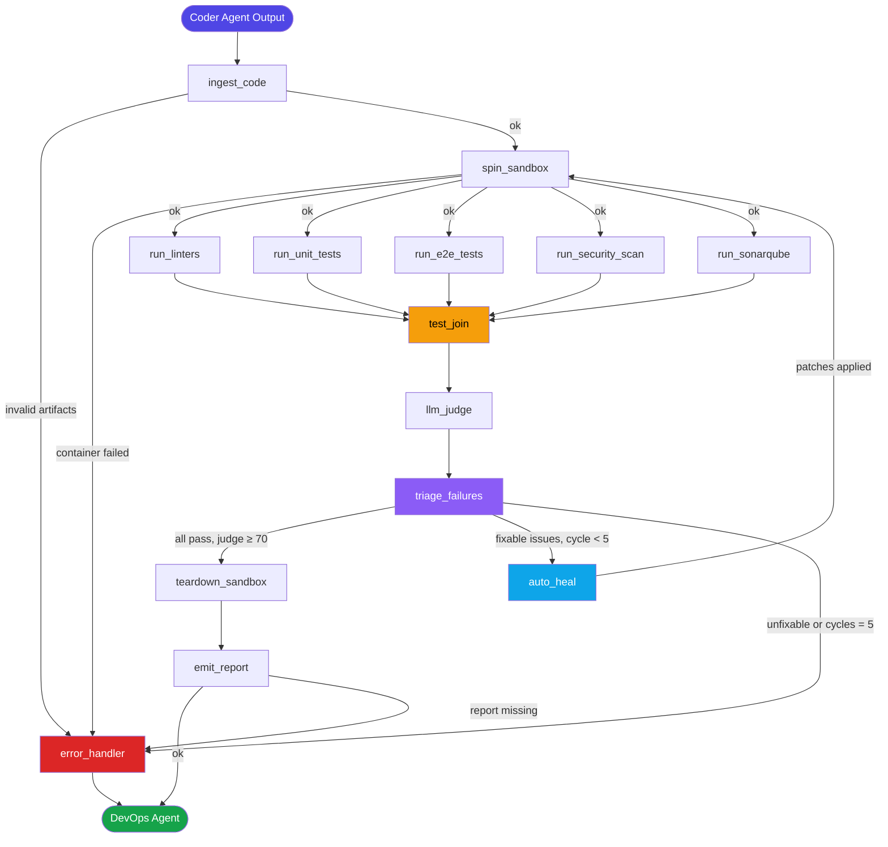
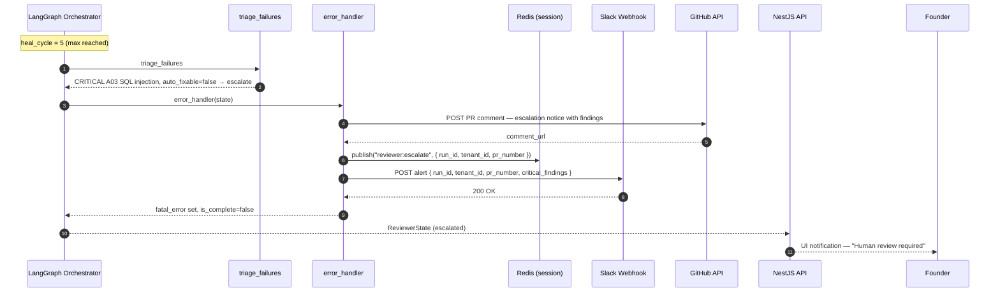

# Low-Level Design — Reviewer Agent

> **Phase**: Phase 2 — MVP Builder (Upcoming)
> **SLA**: Sandbox spin-up < 10 s | End-to-end review < 15 min | Auto-fix rate ≥ 90%
> **Owner**: Auto-Founder AI Platform Team | product@euron.one

---

## Table of Contents

1. [Overview](#1-overview)
2. [LangGraph State Schema (Pydantic V2)](#2-langgraph-state-schema-pydantic-v2)
3. [Node Graph Definition](#3-node-graph-definition)
4. [Tool Bindings](#4-tool-bindings)
5. [Prompt Templates](#5-prompt-templates)
6. [Sequence Diagrams](#6-sequence-diagrams)
7. [Error Handling Logic](#7-error-handling-logic)
8. [Output Contract](#8-output-contract)

---

## 1. Overview

The Reviewer Agent receives the generated code repository from the Coder Agent and autonomously runs a full quality-gate pipeline:

- **Linting** — ESLint + Prettier (TypeScript), Black + Ruff (Python)
- **Unit tests** — Jest (TypeScript), pytest (Python) with ≥ 80 % coverage requirement
- **End-to-end tests** — Playwright (UI flows)
- **Security scanning** — Trivy (container/IaC), Semgrep (SAST), Bandit (Python)
- **Code quality** — SonarQube (maintainability, duplication, tech debt)
- **LLM-as-judge** — Second LLM scores readability and maintainability before approving

When failures are detected the agent enters a **self-healing loop** (max 5 cycles): it triages failures, generates patches via Claude Sonnet, commits them to the branch, and re-runs the full suite. If the loop cannot resolve all blockers within 5 cycles the run is escalated to a human reviewer via the Launch Control Center.

### Sub-tasks executed (with target SLA)

| Sub-task | Node | Target |
|---|---|---|
| Code artifact ingestion & validation | `ingest_code` | < 30 s |
| Ephemeral Docker sandbox provisioning | `spin_sandbox` | < 10 s |
| Linting (all languages) | `run_linters` | < 60 s |
| Unit test suite + coverage | `run_unit_tests` | < 3 min |
| Playwright end-to-end tests | `run_e2e_tests` | < 5 min |
| Trivy + Semgrep + Bandit scan | `run_security_scan` | < 2 min |
| SonarQube quality analysis | `run_sonarqube` | < 2 min |
| Parallel test barrier | `test_join` | — |
| LLM-as-judge evaluation | `llm_judge` | < 1 min |
| Failure triage & classification | `triage_failures` | < 30 s |
| Self-heal patch generation & apply | `auto_heal` | < 3 min / cycle |
| Sandbox teardown | `teardown_sandbox` | < 10 s |
| Review report + PR comment | `emit_report` | < 1 min |

---

## 2. LangGraph State Schema (Pydantic V2)

```python
# packages/agents/reviewer/schema.py

from __future__ import annotations

from datetime import datetime
from enum import StrEnum
from typing import Annotated, Any
from uuid import UUID, uuid4

from pydantic import BaseModel, Field, field_validator, model_validator
from langgraph.graph.message import add_messages


# ---------------------------------------------------------------------------
# Enums
# ---------------------------------------------------------------------------

class NodeStatus(StrEnum):
    PENDING   = "pending"
    RUNNING   = "running"
    COMPLETED = "completed"
    FAILED    = "failed"
    SKIPPED   = "skipped"


class ReviewDecision(StrEnum):
    APPROVED  = "approved"   # all gates pass, LLM judge ≥ 70
    HEAL      = "heal"       # failures present, heal_cycle < MAX_HEAL_CYCLES
    ESCALATE  = "escalate"   # unresolvable or cycles exhausted


class SeverityLevel(StrEnum):
    CRITICAL = "CRITICAL"
    HIGH     = "HIGH"
    MEDIUM   = "MEDIUM"
    LOW      = "LOW"
    INFO     = "INFO"


class FailureCategory(StrEnum):
    LINT            = "lint"
    UNIT_TEST       = "unit_test"
    E2E_TEST        = "e2e_test"
    SECURITY        = "security"
    COVERAGE        = "coverage"
    QUALITY         = "quality"
    LLM_JUDGE       = "llm_judge"


class OWASPCategory(StrEnum):
    A01_BROKEN_ACCESS_CONTROL         = "A01:2021"
    A02_CRYPTOGRAPHIC_FAILURES        = "A02:2021"
    A03_INJECTION                     = "A03:2021"
    A04_INSECURE_DESIGN               = "A04:2021"
    A05_SECURITY_MISCONFIGURATION     = "A05:2021"
    A06_VULNERABLE_COMPONENTS         = "A06:2021"
    A07_AUTHENTICATION_FAILURES       = "A07:2021"
    A08_SOFTWARE_DATA_INTEGRITY       = "A08:2021"
    A09_LOGGING_MONITORING_FAILURES   = "A09:2021"
    A10_SSRF                          = "A10:2021"


# ---------------------------------------------------------------------------
# Sub-models
# ---------------------------------------------------------------------------

class CodeArtifact(BaseModel):
    file_path: str
    language: str          # "typescript" | "python" | "dockerfile" | "terraform" | "yaml"
    content: str
    size_bytes: int


class LintViolation(BaseModel):
    rule_id: str
    file_path: str
    line: int | None = None
    column: int | None = None
    severity: SeverityLevel
    message: str
    auto_fixable: bool = False


class LintResult(BaseModel):
    tool: str              # "eslint" | "prettier" | "black" | "ruff"
    language: str
    error_count: int
    warning_count: int
    violations: list[LintViolation] = Field(default_factory=list)
    duration_ms: int = 0

    @field_validator("error_count", "warning_count")
    @classmethod
    def non_negative(cls, v: int) -> int:
        if v < 0:
            raise ValueError("counts must be non-negative")
        return v


class TestFailure(BaseModel):
    test_name: str
    file_path: str
    error_message: str
    stack_trace: str | None = None
    auto_fixable: bool = False


class TestSuiteResult(BaseModel):
    runner: str            # "jest" | "pytest" | "playwright"
    total: int
    passed: int
    failed: int
    skipped: int
    coverage_pct: float | None = Field(None, ge=0, le=100)
    duration_ms: int = 0
    failures: list[TestFailure] = Field(default_factory=list)

    @model_validator(mode="after")
    def totals_consistent(self) -> TestSuiteResult:
        if self.passed + self.failed + self.skipped > self.total:
            raise ValueError("passed + failed + skipped must not exceed total")
        return self


class SecurityFinding(BaseModel):
    tool: str              # "trivy" | "semgrep" | "bandit"
    severity: SeverityLevel
    rule_id: str
    file_path: str
    line: int | None = None
    message: str
    owasp_category: OWASPCategory | None = None
    cwe: str | None = None                  # e.g. "CWE-89"
    auto_fixable: bool = False
    suppressed: bool = False


class SonarMetrics(BaseModel):
    bugs: int
    vulnerabilities: int
    code_smells: int
    coverage_pct: float | None = None
    duplicated_lines_pct: float
    technical_debt_minutes: int
    quality_gate_passed: bool


class LLMJudgeScore(BaseModel):
    readability: int       = Field(..., ge=0, le=100)
    maintainability: int   = Field(..., ge=0, le=100)
    security_posture: int  = Field(..., ge=0, le=100)
    overall: int           = Field(..., ge=0, le=100)
    feedback: list[str]    = Field(default_factory=list)
    approved: bool         = False

    @model_validator(mode="after")
    def derive_approved(self) -> LLMJudgeScore:
        approved = (
            self.readability >= 70
            and self.maintainability >= 70
            and self.security_posture >= 60
        )
        object.__setattr__(self, "approved", approved)
        return self


class FailureTriageItem(BaseModel):
    category: FailureCategory
    description: str
    file_path: str | None = None
    line: int | None = None
    severity: SeverityLevel
    auto_fixable: bool
    owasp_category: OWASPCategory | None = None
    fix_hint: str | None = None


class CodePatch(BaseModel):
    file_path: str
    original_snippet: str
    patched_snippet: str
    rationale: str


class HealAttempt(BaseModel):
    cycle: int
    issues_targeted: list[str]
    patches_applied: list[CodePatch] = Field(default_factory=list)
    success: bool = False
    error: str | None = None
    started_at: datetime | None = None
    completed_at: datetime | None = None


class NodeTrace(BaseModel):
    node: str
    status: NodeStatus
    started_at: datetime | None = None
    completed_at: datetime | None = None
    error: str | None = None
    retry_count: int = 0


class RetryPolicy(BaseModel):
    max_retries: int = 3
    backoff_seconds: list[int] = Field(default_factory=lambda: [5, 15, 45])


MAX_HEAL_CYCLES = 5


# ---------------------------------------------------------------------------
# Root Graph State
# ---------------------------------------------------------------------------

class ReviewerState(BaseModel):
    """
    Single source of truth threaded through every node in the Reviewer graph.
    heal_cycle drives the self-healing loop; once it reaches MAX_HEAL_CYCLES
    the router escalates rather than re-entering auto_heal.
    """

    # Identity
    run_id: UUID           = Field(default_factory=uuid4)
    tenant_id: str         = Field(..., description="Validated from JWT claims")
    coder_run_id: UUID     = Field(..., description="Run ID of the upstream Coder Agent")
    repo_url: str          = Field(..., description="GitHub repo URL with generated code")
    pr_number: int         = Field(..., description="Open PR number from Coder Agent")
    branch: str            = Field(..., description="Feature branch containing generated code")

    # Code artifacts (populated by ingest_code)
    code_artifacts: list[CodeArtifact]    = Field(default_factory=list)
    sandbox_container_id: str | None      = None
    sandbox_image_tag: str | None         = None

    # Parallel test results (populated by parallel nodes)
    lint_results: list[LintResult]              = Field(default_factory=list)
    unit_test_result: TestSuiteResult | None    = None
    e2e_test_result: TestSuiteResult | None     = None
    security_findings: list[SecurityFinding]    = Field(default_factory=list)
    sonarqube_metrics: SonarMetrics | None      = None

    # LLM judge output
    llm_judge_score: LLMJudgeScore | None       = None

    # Triage + self-healing
    heal_cycle: int                             = 0
    current_failures: list[FailureTriageItem]   = Field(default_factory=list)
    heal_history: list[HealAttempt]             = Field(default_factory=list)

    # Final outputs
    review_decision: ReviewDecision | None      = None
    review_report_markdown: str | None          = None
    github_pr_comment_url: str | None           = None
    is_approved: bool                           = False

    # Execution metadata
    node_traces: list[NodeTrace]    = Field(default_factory=list)
    retry_policy: RetryPolicy       = Field(default_factory=RetryPolicy)
    total_llm_tokens_used: int      = 0
    total_tool_calls: int           = 0
    error_count: int                = 0

    # LangGraph message channel
    messages: Annotated[list[Any], add_messages] = Field(default_factory=list)

    is_complete: bool   = False
    fatal_error: str | None = None

    class Config:
        arbitrary_types_allowed = True
```

---

## 3. Node Graph Definition

### 3.1 Node inventory

| Node ID | Type | Description | Model |
|---|---|---|---|
| `ingest_code` | Sequential | Clone repo, parse artifacts, validate structure | — |
| `spin_sandbox` | Sequential | Build Docker image, start ephemeral container | — |
| `run_linters` | Parallel branch | ESLint/Prettier + Black/Ruff via subprocess | — |
| `run_unit_tests` | Parallel branch | Jest + pytest, coverage enforcement | — |
| `run_e2e_tests` | Parallel branch | Playwright against sandbox URL | — |
| `run_security_scan` | Parallel branch | Trivy + Semgrep + Bandit | — |
| `run_sonarqube` | Parallel branch | SonarQube REST API quality gate | — |
| `test_join` | Barrier | Wait for all 5 parallel nodes | — |
| `llm_judge` | Sequential | Second LLM scores readability + maintainability | Claude Sonnet |
| `triage_failures` | Sequential | Classify failures, determine heal vs escalate | Claude Sonnet |
| `auto_heal` | Sequential | Generate & apply code patches (loop entry) | Claude Sonnet |
| `teardown_sandbox` | Sequential | Stop + remove Docker container | — |
| `emit_report` | Sequential | Build Markdown report, post GitHub PR comment | GPT-4o |
| `error_handler` | Error sink | Retries or escalates, Slack alert | — |

### 3.2 Graph definition

```python
# packages/agents/reviewer/graph.py

from langgraph.graph import StateGraph, END
from langgraph.checkpoint.postgres import PostgresSaver

from .schema import ReviewerState
from .nodes import (
    ingest_code,
    spin_sandbox,
    run_linters,
    run_unit_tests,
    run_e2e_tests,
    run_security_scan,
    run_sonarqube,
    test_join,
    llm_judge,
    triage_failures,
    auto_heal,
    teardown_sandbox,
    emit_report,
    error_handler,
)
from .routers import (
    route_after_ingest,
    route_after_spin,
    route_after_triage,
    route_terminal,
)


def build_reviewer_graph(checkpointer: PostgresSaver) -> StateGraph:
    graph = StateGraph(ReviewerState)

    # -- Node registration --------------------------------------------------
    graph.add_node("ingest_code",       ingest_code)
    graph.add_node("spin_sandbox",      spin_sandbox)
    graph.add_node("run_linters",       run_linters)
    graph.add_node("run_unit_tests",    run_unit_tests)
    graph.add_node("run_e2e_tests",     run_e2e_tests)
    graph.add_node("run_security_scan", run_security_scan)
    graph.add_node("run_sonarqube",     run_sonarqube)
    graph.add_node("test_join",         test_join)
    graph.add_node("llm_judge",         llm_judge)
    graph.add_node("triage_failures",   triage_failures)
    graph.add_node("auto_heal",         auto_heal)
    graph.add_node("teardown_sandbox",  teardown_sandbox)
    graph.add_node("emit_report",       emit_report)
    graph.add_node("error_handler",     error_handler)

    # -- Entry point --------------------------------------------------------
    graph.set_entry_point("ingest_code")

    # -- ingest → spin (conditional) ----------------------------------------
    graph.add_conditional_edges(
        "ingest_code",
        route_after_ingest,
        {
            "spin_sandbox":  "spin_sandbox",
            "error_handler": "error_handler",
        },
    )

    # -- spin → fan-out to parallel test nodes (conditional) ----------------
    graph.add_conditional_edges(
        "spin_sandbox",
        route_after_spin,
        {
            "parallel":      ["run_linters", "run_unit_tests", "run_e2e_tests",
                              "run_security_scan", "run_sonarqube"],
            "error_handler": "error_handler",
        },
    )

    # -- All parallel branches converge at the test barrier -----------------
    for node in ("run_linters", "run_unit_tests", "run_e2e_tests",
                 "run_security_scan", "run_sonarqube"):
        graph.add_edge(node, "test_join")

    # -- test_join → llm_judge → triage (sequential) ------------------------
    graph.add_edge("test_join",  "llm_judge")
    graph.add_edge("llm_judge",  "triage_failures")

    # -- triage → approved / heal / escalate --------------------------------
    graph.add_conditional_edges(
        "triage_failures",
        route_after_triage,
        {
            "approved":      "teardown_sandbox",
            "heal":          "auto_heal",
            "escalate":      "error_handler",
        },
    )

    # -- heal → spin (self-healing loop — cycles back through tests) --------
    graph.add_edge("auto_heal", "spin_sandbox")

    # -- approved path: teardown → emit ------------------------------------
    graph.add_edge("teardown_sandbox", "emit_report")

    # -- emit → terminal ----------------------------------------------------
    graph.add_conditional_edges(
        "emit_report",
        route_terminal,
        {
            "end":           END,
            "error_handler": "error_handler",
        },
    )

    # -- error sink → END ---------------------------------------------------
    graph.add_edge("error_handler", END)

    return graph.compile(checkpointer=checkpointer)


# ---------------------------------------------------------------------------
# Router implementations
# ---------------------------------------------------------------------------

# packages/agents/reviewer/routers.py

from .schema import ReviewerState, ReviewDecision, MAX_HEAL_CYCLES


def route_after_ingest(state: ReviewerState) -> str:
    if state.fatal_error or not state.code_artifacts:
        return "error_handler"
    return "spin_sandbox"


def route_after_spin(state: ReviewerState) -> str | list[str]:
    if state.fatal_error or not state.sandbox_container_id:
        return "error_handler"
    return "parallel"    # LangGraph fan-out


def route_after_triage(state: ReviewerState) -> str:
    has_owasp_critical = any(
        f.owasp_category is not None and f.severity.value in ("CRITICAL", "HIGH")
        for f in state.current_failures
    )
    all_auto_fixable = all(f.auto_fixable for f in state.current_failures)
    no_failures = len(state.current_failures) == 0
    judge_approved = state.llm_judge_score and state.llm_judge_score.approved

    if no_failures and judge_approved:
        return "approved"

    cycles_exhausted = state.heal_cycle >= MAX_HEAL_CYCLES
    has_unfixable = any(not f.auto_fixable for f in state.current_failures)

    if cycles_exhausted or (has_owasp_critical and not all_auto_fixable) or has_unfixable:
        return "escalate"

    return "heal"


def route_terminal(state: ReviewerState) -> str:
    if state.fatal_error or not state.review_report_markdown:
        return "error_handler"
    return "end"
```

### 3.3 Visual graph (Mermaid)



---

## 4. Tool Bindings

### 4.1 Tool definitions

```python
# packages/agents/reviewer/tools.py

import asyncio
import os
import subprocess
from pathlib import Path

import docker
import httpx
from github import Github
from langchain.tools import StructuredTool
from pydantic import BaseModel, Field


# -- Docker SDK (sandbox management) ----------------------------------------

_docker_client = docker.from_env()


class SpinSandboxInput(BaseModel):
    repo_path: str   = Field(..., description="Host path to cloned repository")
    image_tag: str   = Field(..., description="Unique tag for the sandbox image")
    tenant_id: str


def _spin_sandbox(repo_path: str, image_tag: str, tenant_id: str) -> dict:
    image, _ = _docker_client.images.build(
        path=repo_path,
        tag=image_tag,
        rm=True,
        buildargs={"TENANT_ID": tenant_id},
        timeout=30,
    )
    container = _docker_client.containers.run(
        image_tag,
        detach=True,
        remove=False,
        network_mode="bridge",
        mem_limit="512m",
        cpu_period=100_000,
        cpu_quota=50_000,     # 0.5 CPU
        # Egress restricted: only allow outbound to internal test services
        network_disabled=False,
        labels={"tenant_id": tenant_id, "sandbox": "true"},
    )
    return {"container_id": container.id, "image_tag": image_tag}

spin_sandbox_tool = StructuredTool.from_function(
    func=_spin_sandbox,
    name="spin_sandbox",
    description="Build Docker image and start an ephemeral sandbox container for test execution.",
    args_schema=SpinSandboxInput,
)


class ExecInSandboxInput(BaseModel):
    container_id: str
    command: list[str]
    workdir: str = "/app"
    timeout_s: int = Field(300, ge=1, le=600)


def _exec_in_sandbox(container_id: str, command: list[str],
                     workdir: str = "/app", timeout_s: int = 300) -> dict:
    container = _docker_client.containers.get(container_id)
    exit_code, output = container.exec_run(
        command,
        workdir=workdir,
        stream=False,
        demux=True,
        tty=False,
    )
    stdout, stderr = output
    return {
        "exit_code": exit_code,
        "stdout": (stdout or b"").decode("utf-8", errors="replace")[:50_000],
        "stderr": (stderr or b"").decode("utf-8", errors="replace")[:10_000],
    }

exec_in_sandbox = StructuredTool.from_function(
    func=_exec_in_sandbox,
    name="exec_in_sandbox",
    description="Execute a command inside a running sandbox container.",
    args_schema=ExecInSandboxInput,
)


# -- Linting runners --------------------------------------------------------

class LintInput(BaseModel):
    container_id: str
    language: str    # "typescript" | "python"


def _run_eslint(container_id: str, **_) -> dict:
    return _exec_in_sandbox(
        container_id,
        ["npx", "eslint", ".", "--ext", ".ts,.tsx", "--format", "json", "--max-warnings", "0"],
    )

def _run_black_ruff(container_id: str, **_) -> dict:
    black = _exec_in_sandbox(container_id, ["python", "-m", "black", "--check", "--diff", "."])
    ruff  = _exec_in_sandbox(container_id, ["python", "-m", "ruff", "check", ".", "--output-format", "json"])
    return {"black": black, "ruff": ruff}

eslint_runner = StructuredTool.from_function(
    func=_run_eslint,
    name="eslint_runner",
    description="Run ESLint with zero-warning policy on TypeScript/TSX files inside sandbox.",
    args_schema=LintInput,
)

python_linter = StructuredTool.from_function(
    func=_run_black_ruff,
    name="python_linter",
    description="Run Black (format check) and Ruff (lint) on Python files inside sandbox.",
    args_schema=LintInput,
)


# -- Test runners -----------------------------------------------------------

class TestInput(BaseModel):
    container_id: str
    coverage_threshold: float = Field(80.0, ge=0, le=100)


def _run_jest(container_id: str, coverage_threshold: float = 80.0) -> dict:
    return _exec_in_sandbox(
        container_id,
        ["npx", "jest", "--coverage", "--coverageThreshold",
         f'{{"global":{{"lines":{coverage_threshold}}}}}',
         "--json", "--outputFile=/tmp/jest-results.json"],
    )

def _run_pytest(container_id: str, coverage_threshold: float = 80.0) -> dict:
    return _exec_in_sandbox(
        container_id,
        ["python", "-m", "pytest", "--tb=short",
         f"--cov-fail-under={int(coverage_threshold)}",
         "--cov=.", "--cov-report=json:/tmp/coverage.json",
         "-v", "--json-report", "--json-report-file=/tmp/pytest-results.json"],
    )

jest_runner = StructuredTool.from_function(
    func=_run_jest,
    name="jest_runner",
    description="Run Jest unit tests with coverage enforcement inside sandbox.",
    args_schema=TestInput,
)

pytest_runner = StructuredTool.from_function(
    func=_run_pytest,
    name="pytest_runner",
    description="Run pytest with coverage enforcement inside sandbox.",
    args_schema=TestInput,
)


# -- Playwright E2E ---------------------------------------------------------

class PlaywrightInput(BaseModel):
    container_id: str
    base_url: str = Field(..., description="Sandbox app base URL for Playwright")


def _run_playwright(container_id: str, base_url: str) -> dict:
    return _exec_in_sandbox(
        container_id,
        ["npx", "playwright", "test", "--reporter=json",
         f"--project=chromium", f"--base-url={base_url}"],
    )

playwright_runner = StructuredTool.from_function(
    func=_run_playwright,
    name="playwright_runner",
    description="Run Playwright E2E tests against the sandbox application URL.",
    args_schema=PlaywrightInput,
)


# -- Trivy (container + IaC scan) ------------------------------------------

class TrivyInput(BaseModel):
    image_tag: str
    repo_path: str


def _run_trivy(image_tag: str, repo_path: str) -> dict:
    result = subprocess.run(
        ["trivy", "image", "--format", "json", "--exit-code", "0",
         "--severity", "CRITICAL,HIGH,MEDIUM", image_tag],
        capture_output=True, text=True, timeout=120,
    )
    iac_result = subprocess.run(
        ["trivy", "fs", "--format", "json", "--exit-code", "0",
         "--scanners", "misconfig,secret", repo_path],
        capture_output=True, text=True, timeout=60,
    )
    return {"image_scan": result.stdout, "iac_scan": iac_result.stdout}

trivy_scanner = StructuredTool.from_function(
    func=_run_trivy,
    name="trivy_scanner",
    description="Run Trivy to scan container image for CVEs and IaC for misconfigurations.",
    args_schema=TrivyInput,
)


# -- Semgrep SAST -----------------------------------------------------------

class SemgrepInput(BaseModel):
    repo_path: str
    config: str = Field("auto", description="Semgrep ruleset, e.g. 'auto', 'p/owasp-top-ten'")


async def _run_semgrep(repo_path: str, config: str = "auto") -> dict:
    async with httpx.AsyncClient() as client:
        resp = await client.post(
            "https://semgrep.dev/api/v1/scan",
            headers={"Authorization": f"Bearer {os.environ['SEMGREP_APP_TOKEN']}"},
            json={"repo_path": repo_path, "config": config, "output_format": "json"},
            timeout=120,
        )
        resp.raise_for_status()
        return resp.json()

semgrep_scanner = StructuredTool.from_function(
    coroutine=_run_semgrep,
    name="semgrep_scanner",
    description="Run Semgrep SAST analysis with OWASP Top 10 ruleset.",
    args_schema=SemgrepInput,
)


# -- Bandit (Python security) -----------------------------------------------

class BanditInput(BaseModel):
    container_id: str


def _run_bandit(container_id: str) -> dict:
    return _exec_in_sandbox(
        container_id,
        ["python", "-m", "bandit", "-r", ".", "-f", "json",
         "-ll",   # medium and above
         "-o", "/tmp/bandit-results.json"],
    )

bandit_scanner = StructuredTool.from_function(
    func=_run_bandit,
    name="bandit_scanner",
    description="Run Bandit to find security issues in Python source code.",
    args_schema=BanditInput,
)


# -- SonarQube REST API -----------------------------------------------------

class SonarInput(BaseModel):
    project_key: str
    branch: str


async def _run_sonarqube(project_key: str, branch: str) -> dict:
    base = os.environ["SONARQUBE_URL"]
    token = os.environ["SONARQUBE_TOKEN"]
    async with httpx.AsyncClient(auth=(token, "")) as client:
        resp = await client.get(
            f"{base}/api/measures/component",
            params={
                "component": project_key,
                "branch": branch,
                "metricKeys": "bugs,vulnerabilities,code_smells,coverage,"
                              "duplicated_lines_density,sqale_index",
            },
            timeout=30,
        )
        resp.raise_for_status()
        return resp.json()

sonarqube_tool = StructuredTool.from_function(
    coroutine=_run_sonarqube,
    name="sonarqube",
    description="Fetch SonarQube quality metrics and quality gate status for a project branch.",
    args_schema=SonarInput,
)


# -- GitHub API (PR comments + patch commits) --------------------------------

class GitHubPRCommentInput(BaseModel):
    repo_full_name: str   # "owner/repo"
    pr_number: int
    body: str


def _post_pr_comment(repo_full_name: str, pr_number: int, body: str) -> dict:
    gh = Github(os.environ["GITHUB_TOKEN"])
    repo = gh.get_repo(repo_full_name)
    pr = repo.get_pull(pr_number)
    comment = pr.create_issue_comment(body)
    return {"comment_id": comment.id, "html_url": comment.html_url}

github_pr_comment = StructuredTool.from_function(
    func=_post_pr_comment,
    name="github_pr_comment",
    description="Post a review comment on a GitHub pull request.",
    args_schema=GitHubPRCommentInput,
)


# -- Tool registry (keyed by node) ------------------------------------------

TOOL_REGISTRY: dict[str, list] = {
    "ingest_code":       [],
    "spin_sandbox":      [spin_sandbox_tool],
    "run_linters":       [exec_in_sandbox, eslint_runner, python_linter],
    "run_unit_tests":    [exec_in_sandbox, jest_runner, pytest_runner],
    "run_e2e_tests":     [exec_in_sandbox, playwright_runner],
    "run_security_scan": [trivy_scanner, semgrep_scanner, bandit_scanner],
    "run_sonarqube":     [sonarqube_tool],
    "test_join":         [],
    "llm_judge":         [],
    "triage_failures":   [],
    "auto_heal":         [exec_in_sandbox, github_pr_comment],
    "teardown_sandbox":  [],
    "emit_report":       [github_pr_comment],
}
```

### 4.2 Tool timeout and rate-limit policy

| Tool | Timeout | Rate limit guard | Fallback |
|---|---|---|---|
| Docker build | 30 s | Max 3 parallel builds per tenant | Fail fast → error_handler |
| Docker exec | 300 s max per command | — | Kill container, log SLA breach |
| Trivy image | 120 s | 10 req/min | Re-scan on retry |
| Trivy IaC | 60 s | 10 req/min | Skip, log warning |
| Semgrep API | 120 s | 60 req/hr (token bucket) | Local `semgrep` CLI fallback |
| Bandit | 60 s | subprocess (no external limit) | Skip for non-Python repos |
| SonarQube | 30 s | 20 req/min | Skip quality gate; set `quality_gate_passed = false` |
| GitHub API | 10 s | 5,000 req/hr (OAuth) | Retry with 60 s back-off |
| Jest | 180 s | — | Increase timeout flag, mark partial |
| pytest | 180 s | — | Increase timeout flag, mark partial |
| Playwright | 300 s | — | Skip E2E, add to `current_failures` |

---

## 5. Prompt Templates

All prompts follow the model routing policy. Templates are stored as Jinja2 files.

### 5.1 `llm_judge` — Readability & Maintainability Scoring

```jinja2
{# packages/agents/reviewer/prompts/llm_judge.j2 #}

SYSTEM:
You are a senior software engineer conducting a code review for an AI-generated
full-stack application. Your role is to score code quality objectively.
Do NOT pass code just because it runs — score against professional engineering standards.

Scoring rubric:
- readability (0–100): naming clarity, consistent style, appropriate abstraction,
  absence of magic numbers/strings, function length ≤ 40 lines.
- maintainability (0–100): separation of concerns, DRY principle, test coverage ≥ 80%,
  no deeply nested conditionals (max depth 3), no TODO/FIXME left in generated code.
- security_posture (0–100): no hardcoded credentials, no SQL concatenation,
  input validation at boundaries, auth checks on all protected routes,
  no OWASP Top 10 violations.
- overall = round((readability + maintainability + security_posture) / 3)

Approval threshold: readability ≥ 70 AND maintainability ≥ 70 AND security_posture ≥ 60.

USER:
Repository: {{ repo_url }}
Branch: {{ branch }}
Tenant: {{ tenant_id }}

Key files sampled ({{ code_artifacts | length }} total):

### {{ artifact.file_path }} ({{ artifact.language }})
```
{{ artifact.content[:2000] }}
```


Unit test coverage: {{ unit_test_result.coverage_pct | default('unknown') }}%
Security findings summary: {{ security_findings | length }} findings
  (CRITICAL: {{ security_findings | selectattr('severity', 'eq', 'CRITICAL') | list | length }},
   HIGH: {{ security_findings | selectattr('severity', 'eq', 'HIGH') | list | length }})

Return a JSON object:
{
  "readability": int,
  "maintainability": int,
  "security_posture": int,
  "overall": int,
  "feedback": [string]   // 3–5 specific, actionable observations
}
```

### 5.2 `triage_failures` — Failure Classification

```jinja2
{# packages/agents/reviewer/prompts/triage_failures.j2 #}

SYSTEM:
You are a senior QA engineer triaging automated test failures.
Classify each failure as auto-fixable or not, and provide a targeted fix hint.
Be precise: a fix hint must reference the specific file and the pattern to change.

Auto-fixable criteria:
- Lint formatting errors → always auto-fixable
- Import ordering, unused imports → auto-fixable
- Missing test mock → auto-fixable if pattern is clear
- Hardcoded config value → auto-fixable (move to env var)
- Simple null-check missing → auto-fixable
- OWASP A03 SQL injection (basic parameterisation) → auto-fixable
- Complex business logic bugs → NOT auto-fixable
- Missing architectural component → NOT auto-fixable
- OWASP Critical that requires redesign → NOT auto-fixable

USER:
Heal cycle: {{ heal_cycle }} / {{ max_heal_cycles }}

Lint failures:
{{ lint_results | tojson }}

Unit test failures:
{{ unit_test_result.failures | tojson if unit_test_result else '[]' }}

E2E failures:
{{ e2e_test_result.failures | tojson if e2e_test_result else '[]' }}

Security findings (CRITICAL + HIGH only):
{{ security_findings | selectattr('severity', 'in', ['CRITICAL', 'HIGH']) | list | tojson }}

SonarQube quality gate: {{ sonarqube_metrics.quality_gate_passed | default('unknown') }}

LLM judge feedback:
{{ llm_judge_score.feedback | tojson if llm_judge_score else '[]' }}

Return a JSON array of triage items:
[{
  "category": "lint" | "unit_test" | "e2e_test" | "security" | "coverage" | "quality" | "llm_judge",
  "description": string,
  "file_path": string | null,
  "line": int | null,
  "severity": "CRITICAL" | "HIGH" | "MEDIUM" | "LOW" | "INFO",
  "auto_fixable": bool,
  "owasp_category": string | null,
  "fix_hint": string | null   // specific instruction for the healer, or null
}]

Also return: { "overall_decision": "approved" | "heal" | "escalate" }
Escalate if: any CRITICAL security finding is not auto-fixable, OR cycles exhausted,
             OR there are failures with auto_fixable=false.
```

### 5.3 `auto_heal` — Patch Generation

```jinja2
{# packages/agents/reviewer/prompts/auto_heal.j2 #}

SYSTEM:
You are a senior software engineer tasked with patching auto-fixable code failures.
You MUST only fix the issues listed in the triage. Do NOT refactor unrelated code.
Each patch must be minimal, targeted, and safe — do not introduce new logic.

Rules:
- Return ONLY valid JSON, no markdown fences.
- Each patch specifies the exact original snippet and the replacement.
- original_snippet must match the file content exactly (including indentation).
- If a fix requires adding an import, include it as a separate patch for the same file.
- Never patch test files to make tests pass artificially — patch source files only.
- Do NOT suppress security warnings with comments; fix the root cause.

USER:
Heal cycle: {{ heal_cycle }} / {{ max_heal_cycles }}
Repository: {{ repo_url }}
Branch: {{ branch }}

Failures to fix (auto_fixable = true only):
{{ current_failures | selectattr('auto_fixable') | list | tojson }}

Relevant file contents:


### {{ failure.file_path }}
```
{{ get_file_content(failure.file_path) }}
```



Previous heal attempts (for context — do not repeat the same fix):
{{ heal_history | tojson }}

Return a JSON array of patches:
[{
  "file_path": string,
  "original_snippet": string,
  "patched_snippet": string,
  "rationale": string   // one sentence explaining the fix
}]
```

### 5.4 `emit_report` — Markdown Review Report

```jinja2
{# packages/agents/reviewer/prompts/emit_report.j2 #}

SYSTEM:
You are a senior engineer writing an automated code review report.
The report will be posted as a GitHub PR comment. Use GitHub-flavoured Markdown.
Be precise and actionable — developers will act on this report.

USER:
Tenant: {{ tenant_id }}
Repository: {{ repo_url }} (PR #{{ pr_number }})
Branch: {{ branch }}
Review decision: {{ review_decision | upper }}
Heal cycles used: {{ heal_cycle }} / {{ max_heal_cycles }}

Test results:
- Linting: {{ lint_results | sum(attribute='error_count') }} errors across {{ lint_results | length }} tools
- Unit tests: {{ unit_test_result.passed }}/{{ unit_test_result.total }} passed, coverage {{ unit_test_result.coverage_pct | round(1) }}%
- E2E tests: {{ e2e_test_result.passed }}/{{ e2e_test_result.total }} passed
- Security: {{ security_findings | length }} findings (CRITICAL: {{ security_findings | selectattr('severity', 'eq', 'CRITICAL') | list | length }})
- SonarQube quality gate: {{ "✅ passed" if sonarqube_metrics.quality_gate_passed else "❌ failed" }}

LLM judge scores: readability={{ llm_judge_score.readability }}, maintainability={{ llm_judge_score.maintainability }}, security={{ llm_judge_score.security_posture }}
LLM judge feedback: {{ llm_judge_score.feedback | join(' | ') }}

Remaining issues (not auto-fixed):
{{ current_failures | rejectattr('auto_fixable') | list | tojson }}

Structure the report with these sections:
## 🤖 Auto-Reviewer Report
## ✅ / ❌ Decision: {APPROVED / NEEDS HUMAN REVIEW}
## Test Suite Summary (table)
## Security Findings (table: severity | rule | file | OWASP | status)
## Code Quality Score
## Issues Requiring Human Attention (if any)
## Heal Cycle Summary (table: cycle | issues targeted | patches applied | outcome)
```

---

## 6. Sequence Diagrams

### 6.1 Happy path — clean code, no healing required

```mermaid
sequenceDiagram
    autonumber
    actor Coder   as Coder Agent
    participant API   as NestJS API Gateway
    participant Graph as LangGraph Orchestrator
    participant Ing   as ingest_code
    participant Sand  as spin_sandbox
    participant Par   as Parallel Test Nodes
    participant Dkr   as Docker Sandbox
    participant Sec   as Security Tools
    participant Sq    as SonarQube
    participant Join  as test_join
    participant Jdg   as llm_judge
    participant Tri   as triage_failures
    participant Tear  as teardown_sandbox
    participant Emit  as emit_report
    participant GH    as GitHub API
    participant DevOps as DevOps Agent

    Coder ->> API: gRPC CoderOutput { repo_url, pr_number, branch }
    API ->> Graph: invoke(ReviewerState)
    Graph ->> Ing: ingest_code(repo_url, branch)
    Ing -->> Graph: code_artifacts[]

    Graph ->> Sand: spin_sandbox(repo_path, image_tag)
    Sand ->> Dkr: docker build + run
    Dkr -->> Sand: container_id
    Sand -->> Graph: sandbox ready

    par Parallel test execution
        Graph ->> Par: run_linters
        Par ->> Dkr: exec eslint + black + ruff
        Dkr -->> Par: lint output
        Par -->> Join: lint_results

        Graph ->> Par: run_unit_tests
        Par ->> Dkr: exec jest + pytest --cov
        Dkr -->> Par: test results + coverage
        Par -->> Join: unit_test_result

        Graph ->> Par: run_e2e_tests
        Par ->> Dkr: exec playwright
        Dkr -->> Par: e2e results
        Par -->> Join: e2e_test_result

        Graph ->> Par: run_security_scan
        Par ->> Sec: trivy image + semgrep + bandit
        Sec -->> Par: findings[]
        Par -->> Join: security_findings

        Graph ->> Par: run_sonarqube
        Par ->> Sq: GET /api/measures/component
        Sq -->> Par: metrics
        Par -->> Join: sonarqube_metrics
    end

    Join -->> Graph: all results merged

    Graph ->> Jdg: llm_judge(code_artifacts, results)
    Jdg -->> Graph: { readability:85, maintainability:82, approved:true }

    Graph ->> Tri: triage_failures(state)
    Tri -->> Graph: { current_failures:[], overall_decision:"approved" }

    Graph ->> Tear: teardown_sandbox(container_id)
    Tear ->> Dkr: docker stop + rm
    Dkr -->> Tear: ok
    Tear -->> Graph: sandbox cleaned

    Graph ->> Emit: emit_report(state)
    Emit ->> GH: POST /issues/{pr}/comments (review report)
    GH -->> Emit: comment_url
    Emit -->> Graph: review_report_markdown, is_approved=true

    Graph -->> API: ReviewerState (complete, approved)
    API --)  DevOps: emit(ReviewerState) via gRPC
```

### 6.2 Self-healing loop — 2 cycles to resolve lint + unit test failures

```mermaid
sequenceDiagram
    autonumber
    participant Graph as LangGraph Orchestrator
    participant Sand  as spin_sandbox
    participant Par   as Parallel Test Nodes
    participant Join  as test_join
    participant Jdg   as llm_judge
    participant Tri   as triage_failures
    participant Heal  as auto_heal
    participant Dkr   as Docker Sandbox
    participant GH    as GitHub API

    Note over Graph: heal_cycle = 0

    Graph ->> Sand: spin_sandbox
    Sand -->> Graph: container running

    Graph ->> Par: run all 5 test nodes (parallel)
    Par -->> Join: lint: 4 errors, unit: 2 failures, coverage: 74%

    Join -->> Graph: test results merged
    Graph ->> Jdg: llm_judge → approved: false (maintainability=55)
    Graph ->> Tri: triage_failures
    Tri -->> Graph: 6 auto-fixable issues, decision=heal

    Graph ->> Heal: auto_heal(current_failures, heal_cycle=0)
    Heal ->> GH: commit patches to branch (6 files patched)
    GH -->> Heal: commit SHA
    Heal -->> Graph: heal_history[0] recorded, heal_cycle=1

    Note over Graph: heal_cycle = 1 — loop back to spin_sandbox

    Graph ->> Sand: spin_sandbox (rebuild with patches)
    Sand -->> Graph: new container running

    Graph ->> Par: run all 5 test nodes (parallel)
    Par -->> Join: lint: 0 errors, unit: all pass, coverage: 83%

    Join -->> Graph: test results merged
    Graph ->> Jdg: llm_judge → approved: true (all scores ≥ 70)
    Graph ->> Tri: triage_failures
    Tri -->> Graph: 0 failures, decision=approved

    Graph ->> Sand: teardown_sandbox
    Graph ->> Heal: emit_report → PR comment posted
```

### 6.3 Escalation path — max cycles exceeded with unresolvable OWASP finding



---

## 7. Error Handling Logic

### 7.1 Error taxonomy

| Error class | Examples | Strategy |
|---|---|---|
| `DockerBuildFailure` | Dockerfile syntax error, missing base image | Fail fast → `error_handler`; Coder Agent re-run needed |
| `DockerSandboxTimeout` | Container unresponsive after SLA | Kill container, mark partial results, continue |
| `ToolSubprocessError` | Jest/pytest non-zero exit (not test failures) | Retry tool once; if persistent, skip tool, log |
| `SonarQubeUnavailable` | 503 from SonarQube | Skip quality gate, set `quality_gate_passed = false` |
| `SemgrepAPIError` | 429 or 5xx from Semgrep cloud | Fall back to local `semgrep` CLI |
| `ParseError` | LLM returns non-JSON for judge/triage | Re-prompt with self-correction (max 1 attempt) |
| `CoverageGateFail` | Coverage < 80 % after 5 heal cycles | Escalate — Coder Agent must generate more tests |
| `OWASPHardBlock` | CRITICAL OWASP finding not auto-fixable | Immediate escalate; do not approve under any circumstance |
| `SLABreach` | Any parallel node exceeds its SLA | Mark partial, continue to test_join, log Prometheus metric |
| `FatalLLMError` | LLM API 5xx during judge/heal | Retry 3× with 45 s gaps, then escalate |
| `GitHubAPIError` | Patch commit or PR comment fails | Retry 3× with 60 s back-off; log and continue if non-critical |

### 7.2 Error handler node

```python
# packages/agents/reviewer/nodes/error_handler.py

import asyncio
import logging
import os
from datetime import datetime, timezone

import docker
import httpx
from github import Github

from ..schema import ReviewerState, NodeStatus, NodeTrace, ReviewDecision

logger = logging.getLogger("reviewer.error_handler")

SLACK_WEBHOOK = "SLACK_WEBHOOK_REVIEWER"


async def error_handler(state: ReviewerState) -> dict:
    """
    Central error sink. Tears down any live sandbox, posts escalation to GitHub PR,
    fires Slack alert, and sets fatal_error so the graph exits cleanly.
    """
    failed_nodes = [
        t for t in state.node_traces
        if t.status == NodeStatus.FAILED and t.retry_count >= state.retry_policy.max_retries
    ]

    owasp_critical = [
        f for f in state.current_failures
        if f.owasp_category is not None and f.severity.value in ("CRITICAL", "HIGH")
        and not f.auto_fixable
    ]

    error_reason = _derive_error_reason(state, failed_nodes, owasp_critical)
    logger.error("Reviewer escalation for run %s: %s", state.run_id, error_reason)

    # Guarantee sandbox cleanup even on error path
    if state.sandbox_container_id:
        await _force_teardown_sandbox(state.sandbox_container_id)

    # Post escalation comment to GitHub PR
    await _post_github_escalation(state, error_reason)

    # Alert ops
    await _post_slack_alert(state, error_reason)

    return {
        "fatal_error": error_reason,
        "review_decision": ReviewDecision.ESCALATE,
        "is_approved": False,
        "is_complete": False,
        "sandbox_container_id": None,
    }


def _derive_error_reason(state, failed_nodes, owasp_critical) -> str:
    if owasp_critical:
        cats = ", ".join(str(f.owasp_category) for f in owasp_critical)
        return f"Unresolvable OWASP findings after {state.heal_cycle} heal cycles: {cats}"
    if state.heal_cycle >= 5:
        return f"Self-healing loop exhausted ({state.heal_cycle} cycles) — failures remain"
    if failed_nodes:
        return "; ".join(f"{t.node}: {t.error}" for t in failed_nodes)
    return "Unknown escalation trigger"


async def _force_teardown_sandbox(container_id: str) -> None:
    try:
        client = docker.from_env()
        container = client.containers.get(container_id)
        container.stop(timeout=5)
        container.remove(force=True)
        logger.info("Sandbox %s force-removed during error handling", container_id)
    except Exception as exc:
        logger.warning("Could not remove sandbox %s: %s", container_id, exc)


async def _post_github_escalation(state: ReviewerState, reason: str) -> None:
    try:
        gh = Github(os.environ["GITHUB_TOKEN"])
        repo_name = state.repo_url.rstrip("/").split("github.com/")[-1]
        repo = gh.get_repo(repo_name)
        pr = repo.get_pull(state.pr_number)
        body = (
            f"## ⚠️ Auto-Reviewer Escalation\n\n"
            f"**Run ID**: `{state.run_id}`\n"
            f"**Reason**: {reason}\n"
            f"**Heal cycles used**: {state.heal_cycle} / 5\n\n"
            f"This PR requires human review before it can proceed to deployment.\n"
            f"Please address the issues listed above and re-trigger the review pipeline."
        )
        pr.create_issue_comment(body)
    except Exception as exc:
        logger.error("Failed to post GitHub escalation comment: %s", exc)


async def _post_slack_alert(state: ReviewerState, error_reason: str) -> None:
    webhook_url = os.environ.get(SLACK_WEBHOOK)
    if not webhook_url:
        return
    payload = {
        "text": (
            f":large_yellow_circle: *Reviewer Agent Escalation*\n"
            f"*Run ID*: `{state.run_id}`\n"
            f"*Tenant*: `{state.tenant_id}`\n"
            f"*PR*: {state.repo_url}/pull/{state.pr_number}\n"
            f"*Reason*: {error_reason}\n"
            f"*Time*: {datetime.now(timezone.utc).isoformat()}"
        )
    }
    async with httpx.AsyncClient() as client:
        try:
            await client.post(webhook_url, json=payload, timeout=5)
        except Exception as exc:
            logger.error("Slack alert failed: %s", exc)
```

### 7.3 Node wrapper with retry logic

```python
# packages/agents/reviewer/utils/retry.py

import asyncio
import functools
import logging
from datetime import datetime, timezone
from typing import Callable

from ..schema import ReviewerState, NodeStatus, NodeTrace

logger = logging.getLogger("reviewer.retry")


def with_retry(node_name: str):
    """
    Decorator that wraps a reviewer node with the graph's retry policy.
    Parallel test nodes (run_linters etc.) are wrapped here so infrastructure
    errors (e.g. Docker exec timeout) are retried without re-running the whole graph.
    """
    def decorator(fn: Callable):
        @functools.wraps(fn)
        async def wrapper(state: ReviewerState) -> dict:
            policy   = state.retry_policy
            trace    = NodeTrace(node=node_name, status=NodeStatus.RUNNING,
                                 started_at=datetime.now(timezone.utc))
            last_exc = None

            for attempt in range(policy.max_retries + 1):
                trace.retry_count = attempt
                try:
                    result = await fn(state)
                    trace.status       = NodeStatus.COMPLETED
                    trace.completed_at = datetime.now(timezone.utc)
                    return {**result, "node_traces": state.node_traces + [trace]}
                except Exception as exc:
                    last_exc = exc
                    logger.warning(
                        "Node %s attempt %d/%d failed: %s",
                        node_name, attempt + 1, policy.max_retries + 1, exc,
                    )
                    if attempt < policy.max_retries:
                        sleep_s = policy.backoff_seconds[min(attempt, len(policy.backoff_seconds) - 1)]
                        await asyncio.sleep(sleep_s)

            trace.status       = NodeStatus.FAILED
            trace.error        = str(last_exc)
            trace.completed_at = datetime.now(timezone.utc)
            return {
                "node_traces": state.node_traces + [trace],
                "error_count": state.error_count + 1,
            }

        return wrapper
    return decorator
```

### 7.4 OWASP hard-block logic

```python
# packages/agents/reviewer/utils/owasp.py

from ..schema import ReviewerState, SecurityFinding, SeverityLevel


OWASP_HARD_BLOCK_SEVERITIES = {SeverityLevel.CRITICAL, SeverityLevel.HIGH}


def has_unresolvable_owasp_finding(state: ReviewerState) -> bool:
    """
    Returns True if any CRITICAL/HIGH OWASP finding is present and NOT auto-fixable.
    This triggers an immediate escalate decision regardless of heal_cycle.
    """
    return any(
        f.owasp_category is not None
        and f.severity in OWASP_HARD_BLOCK_SEVERITIES
        and not f.auto_fixable
        and not f.suppressed
        for f in state.current_failures
        if hasattr(f, "owasp_category")
    )


def coverage_gate_passed(state: ReviewerState, threshold: float = 80.0) -> bool:
    unit_ok = (
        state.unit_test_result is None
        or state.unit_test_result.coverage_pct is None
        or state.unit_test_result.coverage_pct >= threshold
    )
    return unit_ok
```

### 7.5 SLA breach monitoring

```python
# packages/agents/reviewer/utils/sla.py

import asyncio
import logging

logger = logging.getLogger("reviewer.sla")

NODE_SLA_SECONDS: dict[str, int] = {
    "ingest_code":       30,
    "spin_sandbox":      10,
    "run_linters":       60,
    "run_unit_tests":    180,
    "run_e2e_tests":     300,
    "run_security_scan": 120,
    "run_sonarqube":     120,
    "llm_judge":         60,
    "triage_failures":   30,
    "auto_heal":         180,
    "teardown_sandbox":  10,
    "emit_report":       60,
}

TOTAL_SLA_SECONDS = 900   # 15 minutes end-to-end


async def enforce_node_sla(node_name: str, coro):
    """Wrap a node coroutine with a per-node SLA timeout."""
    sla = NODE_SLA_SECONDS.get(node_name, 300)
    try:
        return await asyncio.wait_for(coro, timeout=sla)
    except asyncio.TimeoutError:
        logger.error("SLA BREACH: node=%s exceeded %ds", node_name, sla)
        return {"error_count": 1}
```

---

## 8. Output Contract

The Reviewer Agent emits the following to the DevOps Agent via gRPC upon successful approval. If the decision is `ESCALATE`, only the escalation fields are emitted; the DevOps Agent will not proceed.

```protobuf
// proto/reviewer_output.proto

syntax = "proto3";
package autofounder.reviewer.v1;

message ReviewerOutput {
  string  run_id              = 1;
  string  tenant_id           = 2;
  string  coder_run_id        = 3;
  string  repo_url            = 4;
  string  branch              = 5;
  int32   pr_number           = 6;
  string  review_decision     = 7;   // "approved" | "escalate"
  bool    is_approved         = 8;

  // Quality metrics (populated on approved)
  float   unit_test_coverage  = 9;
  int32   security_finding_count = 10;
  int32   critical_finding_count = 11;
  int32   llm_judge_overall   = 12;
  int32   heal_cycles_used    = 13;

  // Artifact references
  string  review_report_url   = 14;  // S3 URI: s3://{bucket}/{tenant_id}/reviews/{run_id}.md
  string  github_pr_comment_url = 15;

  // Escalation (populated on escalate)
  string  escalation_reason   = 16;
  repeated string owasp_violations = 17;

  int64   completed_at_unix_ms = 18;
  int32   total_llm_tokens_used = 19;
}
```

**Routing rules after output**:
- `review_decision == "approved"` → forward to DevOps Agent immediately
- `review_decision == "escalate"` → notify Founder via Launch Control Center; block DevOps Agent; require human resolution before pipeline resumes
- Any OWASP CRITICAL violation in `owasp_violations` → security team paged via PagerDuty in addition to Slack
- `heal_cycles_used >= 4` (even on approval) → log a `reviewer.high_heal_cycles` Prometheus counter; LLMOps Agent reviews the Coder Agent prompts that generated this code

---

*Auto-Founder AI — Reviewer Agent LLD v1.0 | May 2026*
