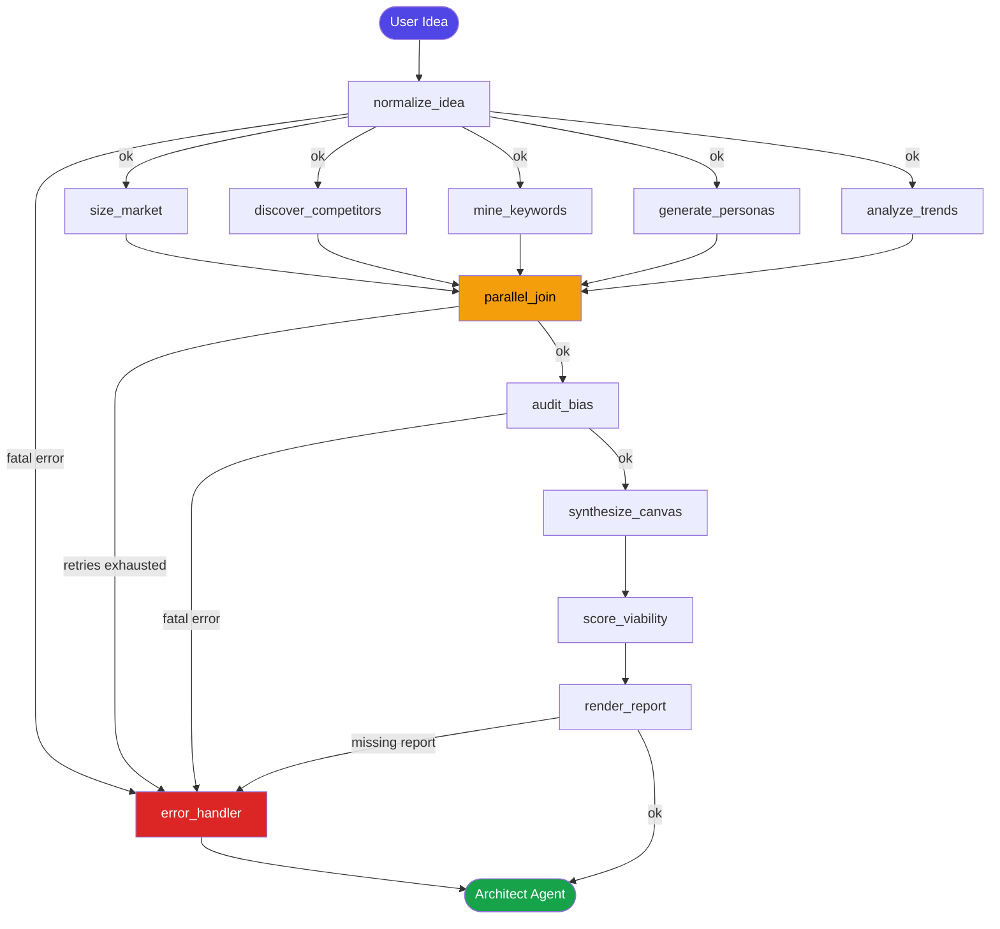
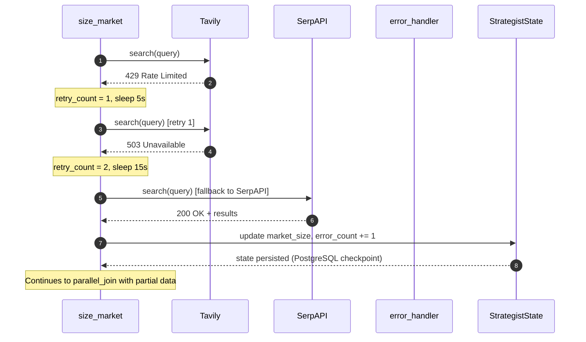
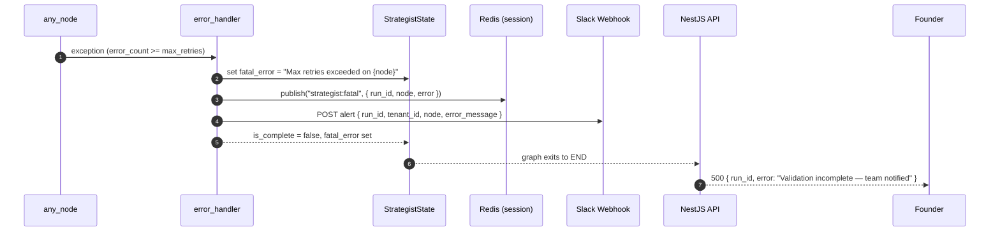

# Low-Level Design — Strategist Agent

> **Phase**: Phase 1 — Validation Engine (Active)
> **SLA**: < 30 minutes end-to-end
> **Owner**: Auto-Founder AI Platform Team | product@euron.one

---

## Table of Contents

1. [Overview](#1-overview)
2. [LangGraph State Schema (Pydantic V2)](#2-langgraph-state-schema-pydantic-v2)
3. [Node Graph Definition](#3-node-graph-definition)
4. [Tool Bindings](#4-tool-bindings)
5. [Prompt Templates](#5-prompt-templates)
6. [Sequence Diagrams](#6-sequence-diagrams)
7. [Error Handling Logic](#7-error-handling-logic)
8. [Output Contract](#8-output-contract)

---

## 1. Overview

The Strategist Agent is the entry point of the Auto-Founder AI pipeline. It receives a raw text idea from a founder and autonomously produces:

- A **5-page Market Analysis Report**
- A **Lean Canvas**
- A **Viability Score** (0–100)

The agent runs as a LangGraph stateful graph, parallelises independent research sub-tasks, self-heals on tool failures, and enforces a **bias audit** on all outputs before emitting results to the Architect Agent.

### Sub-tasks executed (with target SLA)

| Sub-task | Node | Target |
|---|---|---|
| Idea normalisation + intent extraction | `normalize_idea` | < 30 s |
| TAM / SAM / SOM sizing | `size_market` | < 5 min |
| Competitor discovery & profiling | `discover_competitors` | < 5 min |
| SEO keyword mining | `mine_keywords` | < 3 min |
| Buyer persona generation | `generate_personas` | < 3 min |
| Trend & sentiment analysis | `analyze_trends` | < 5 min |
| Bias audit | `audit_bias` | < 2 min |
| Lean Canvas synthesis | `synthesize_canvas` | < 3 min |
| Viability scoring | `score_viability` | < 2 min |
| Report rendering | `render_report` | < 1 min |

---

## 2. LangGraph State Schema (Pydantic V2)

```python
# AUTOFOUNDER-BACKEND/app/agents/strategist/schema.py

from __future__ import annotations

from datetime import datetime
from enum import StrEnum
from typing import Annotated, Any
from uuid import UUID, uuid4

from pydantic import BaseModel, Field, field_validator, model_validator
from langgraph.graph.message import add_messages


# ---------------------------------------------------------------------------
# Enums
# ---------------------------------------------------------------------------

class NodeStatus(StrEnum):
    PENDING   = "pending"
    RUNNING   = "running"
    COMPLETED = "completed"
    FAILED    = "failed"
    SKIPPED   = "skipped"


class ViabilityBand(StrEnum):
    STRONG   = "strong"    # 75–100
    MODERATE = "moderate"  # 50–74
    WEAK     = "weak"      # 25–49
    REJECT   = "reject"    # 0–24


class BiasFlag(StrEnum):
    WESTERN_CENTRIC   = "western_centric"
    RECENCY_BIAS      = "recency_bias"
    SURVIVORSHIP_BIAS = "survivorship_bias"
    CONFIRMATION_BIAS = "confirmation_bias"


# ---------------------------------------------------------------------------
# Sub-models
# ---------------------------------------------------------------------------

class MarketSize(BaseModel):
    tam_usd_bn: float = Field(..., description="Total Addressable Market, USD billions")
    sam_usd_bn: float = Field(..., description="Serviceable Addressable Market, USD billions")
    som_usd_bn: float = Field(..., description="Serviceable Obtainable Market, USD billions")
    cagr_pct: float   = Field(..., description="Projected CAGR %")
    sources: list[str] = Field(default_factory=list)

    @field_validator("tam_usd_bn", "sam_usd_bn", "som_usd_bn", "cagr_pct")
    @classmethod
    def non_negative(cls, v: float) -> float:
        if v < 0:
            raise ValueError("Market size values must be non-negative")
        return v

    @model_validator(mode="after")
    def market_hierarchy(self) -> MarketSize:
        if not (self.tam_usd_bn >= self.sam_usd_bn >= self.som_usd_bn):
            raise ValueError("TAM >= SAM >= SOM constraint violated")
        return self


class Competitor(BaseModel):
    name: str
    url: str
    funding_usd_mn: float | None = None
    employee_range: str | None = None
    key_features: list[str] = Field(default_factory=list)
    pricing_model: str | None = None
    g2_rating: float | None = Field(None, ge=0, le=5)
    weakness: str | None = None


class Keyword(BaseModel):
    term: str
    monthly_search_volume: int | None = None
    keyword_difficulty: int | None = Field(None, ge=0, le=100)
    cpc_usd: float | None = None
    intent: str | None = None  # "informational" | "commercial" | "transactional"


class BuyerPersona(BaseModel):
    name: str
    role: str
    company_size: str
    pain_points: list[str]
    goals: list[str]
    willingness_to_pay_inr: int | None = None
    preferred_channels: list[str] = Field(default_factory=list)


class TrendSignal(BaseModel):
    source: str       # "google_trends" | "reddit" | "hackernews" | "serpapi"
    signal: str
    sentiment: str    # "positive" | "neutral" | "negative"
    evidence_url: str | None = None


class LeanCanvas(BaseModel):
    problem: list[str]           = Field(..., min_length=1, max_length=3)
    customer_segments: list[str] = Field(..., min_length=1, max_length=3)
    unique_value_proposition: str
    solution: list[str]          = Field(..., min_length=1, max_length=3)
    channels: list[str]
    revenue_streams: list[str]
    cost_structure: list[str]
    key_metrics: list[str]
    unfair_advantage: str
    early_adopters: str


class ViabilityScore(BaseModel):
    total: int = Field(..., ge=0, le=100)
    band: ViabilityBand
    breakdown: dict[str, int] = Field(
        description="Component scores: market_size, competition, trend, monetisation, feasibility"
    )
    pivot_suggestions: list[str] = Field(default_factory=list)

    @model_validator(mode="after")
    def derive_band(self) -> ViabilityScore:
        if self.total >= 75:
            object.__setattr__(self, "band", ViabilityBand.STRONG)
        elif self.total >= 50:
            object.__setattr__(self, "band", ViabilityBand.MODERATE)
        elif self.total >= 25:
            object.__setattr__(self, "band", ViabilityBand.WEAK)
        else:
            object.__setattr__(self, "band", ViabilityBand.REJECT)
        return self


class NodeTrace(BaseModel):
    node: str
    status: NodeStatus
    started_at: datetime | None = None
    completed_at: datetime | None = None
    error: str | None = None
    retry_count: int = 0


class RetryPolicy(BaseModel):
    max_retries: int = 3
    backoff_seconds: list[int] = Field(default_factory=lambda: [5, 15, 45])


# ---------------------------------------------------------------------------
# Root Graph State
# ---------------------------------------------------------------------------

class StrategistState(BaseModel):
    """
    Single source of truth threaded through every node in the Strategist graph.
    LangGraph merges updates via add_messages for the messages channel;
    all other fields are last-write-wins.
    """

    # Identity
    run_id: UUID        = Field(default_factory=uuid4)
    tenant_id: str      = Field(..., description="Validated from JWT claims")
    idea_raw: str       = Field(..., min_length=10, max_length=4000)

    # Normalised inputs
    idea_normalised: str | None = None
    domain: str | None          = None  # e.g. "B2B SaaS", "Consumer App"
    geography_focus: str        = "global"

    # Research outputs (populated by parallel nodes)
    market_size: MarketSize | None          = None
    competitors: list[Competitor]           = Field(default_factory=list)
    keywords: list[Keyword]                 = Field(default_factory=list)
    personas: list[BuyerPersona]            = Field(default_factory=list)
    trend_signals: list[TrendSignal]        = Field(default_factory=list)

    # Synthesis outputs
    bias_flags: list[BiasFlag]              = Field(default_factory=list)
    lean_canvas: LeanCanvas | None          = None
    viability_score: ViabilityScore | None  = None
    report_markdown: str | None             = None

    # Execution metadata
    node_traces: list[NodeTrace]            = Field(default_factory=list)
    retry_policy: RetryPolicy               = Field(default_factory=RetryPolicy)
    total_llm_tokens_used: int              = 0
    total_tool_calls: int                   = 0
    error_count: int                        = 0

    # LangGraph message channel (tool call / observation pairs)
    messages: Annotated[list[Any], add_messages] = Field(default_factory=list)

    # Terminal flag — set by router to exit the graph
    is_complete: bool = False
    fatal_error: str | None = None

    class Config:
        arbitrary_types_allowed = True
```

---

## 3. Node Graph Definition

### 3.1 Node inventory

| Node ID | Type | Description | Model |
|---|---|---|---|
| `normalize_idea` | Sequential | Cleans raw input, extracts domain & geography | Claude Sonnet |
| `size_market` | Parallel branch | TAM/SAM/SOM via Tavily + SerpAPI | Claude Sonnet |
| `discover_competitors` | Parallel branch | Competitor profiling via Crunchbase + G2 | Claude Sonnet |
| `mine_keywords` | Parallel branch | SEO keyword research via SerpAPI | GPT-4o |
| `generate_personas` | Parallel branch | Buyer persona synthesis | GPT-4o |
| `analyze_trends` | Parallel branch | Google Trends + Reddit + HackerNews | GPT-4o |
| `parallel_join` | Barrier | Waits for all 5 parallel nodes | — |
| `audit_bias` | Sequential | Checks for Western-centric / recency bias | Claude Sonnet |
| `synthesize_canvas` | Sequential | Lean Canvas from aggregated research | Claude Sonnet |
| `score_viability` | Sequential | Weighted viability score + pivot suggestions | Claude Sonnet |
| `render_report` | Sequential | Assembles the 5-page Markdown report | GPT-4o |
| `error_handler` | Error sink | Retries or escalates failed nodes | — |

### 3.2 Graph definition

```python
# AUTOFOUNDER-BACKEND/app/agents/strategist/graph.py

from langgraph.graph import StateGraph, END
from langgraph.checkpoint.postgres import PostgresSaver

from .schema import StrategistState
from .nodes import (
    normalize_idea,
    size_market,
    discover_competitors,
    mine_keywords,
    generate_personas,
    analyze_trends,
    parallel_join,
    audit_bias,
    synthesize_canvas,
    score_viability,
    render_report,
    error_handler,
)
from .routers import (
    route_after_normalize,
    route_after_join,
    route_after_audit,
    route_terminal,
)


def build_strategist_graph(checkpointer: PostgresSaver) -> StateGraph:
    graph = StateGraph(StrategistState)

    # -- Node registration --------------------------------------------------
    graph.add_node("normalize_idea",       normalize_idea)
    graph.add_node("size_market",          size_market)
    graph.add_node("discover_competitors", discover_competitors)
    graph.add_node("mine_keywords",        mine_keywords)
    graph.add_node("generate_personas",    generate_personas)
    graph.add_node("analyze_trends",       analyze_trends)
    graph.add_node("parallel_join",        parallel_join)
    graph.add_node("audit_bias",           audit_bias)
    graph.add_node("synthesize_canvas",    synthesize_canvas)
    graph.add_node("score_viability",      score_viability)
    graph.add_node("render_report",        render_report)
    graph.add_node("error_handler",        error_handler)

    # -- Entry point --------------------------------------------------------
    graph.set_entry_point("normalize_idea")

    # -- Fan-out to parallel research branches (conditional) ----------------
    graph.add_conditional_edges(
        "normalize_idea",
        route_after_normalize,
        {
            "parallel":      ["size_market", "discover_competitors",
                              "mine_keywords", "generate_personas", "analyze_trends"],
            "error_handler": "error_handler",
        },
    )

    # -- All parallel branches converge at the barrier ----------------------
    for node in ("size_market", "discover_competitors",
                 "mine_keywords", "generate_personas", "analyze_trends"):
        graph.add_edge(node, "parallel_join")

    # -- Post-join routing --------------------------------------------------
    graph.add_conditional_edges(
        "parallel_join",
        route_after_join,
        {
            "audit_bias":    "audit_bias",
            "error_handler": "error_handler",
        },
    )

    # -- Sequential synthesis chain -----------------------------------------
    graph.add_conditional_edges(
        "audit_bias",
        route_after_audit,
        {
            "synthesize_canvas": "synthesize_canvas",
            "error_handler":     "error_handler",
        },
    )

    graph.add_edge("synthesize_canvas", "score_viability")
    graph.add_edge("score_viability",   "render_report")

    # -- Terminal routing ---------------------------------------------------
    graph.add_conditional_edges(
        "render_report",
        route_terminal,
        {
            "end":           END,
            "error_handler": "error_handler",
        },
    )

    # -- Error handler exits ------------------------------------------------
    graph.add_edge("error_handler", END)

    return graph.compile(checkpointer=checkpointer)


# ---------------------------------------------------------------------------
# Router implementations
# ---------------------------------------------------------------------------

# AUTOFOUNDER-BACKEND/app/agents/strategist/routers.py

def route_after_normalize(state: StrategistState) -> str | list[str]:
    if state.fatal_error:
        return "error_handler"
    return "parallel"   # LangGraph fan-out: returns list of next nodes


def route_after_join(state: StrategistState) -> str:
    if state.error_count >= state.retry_policy.max_retries:
        return "error_handler"
    return "audit_bias"


def route_after_audit(state: StrategistState) -> str:
    if state.fatal_error:
        return "error_handler"
    return "synthesize_canvas"


def route_terminal(state: StrategistState) -> str:
    if state.fatal_error or not state.report_markdown:
        return "error_handler"
    return "end"
```

### 3.3 Visual graph (Mermaid)



---

## 4. Tool Bindings

### 4.1 Tool definitions (LangChain-compatible)

```python
# AUTOFOUNDER-BACKEND/app/agents/strategist/tools.py

import os
from langchain_community.tools.tavily_search import TavilySearchResults
from langchain_community.utilities import SerpAPIWrapper
from langchain.tools import StructuredTool
from pydantic import BaseModel, Field
import httpx


# -- Tavily Search ----------------------------------------------------------

tavily_search = TavilySearchResults(
    max_results=10,
    api_key=os.environ["TAVILY_API_KEY"],
    search_depth="advanced",
    include_answer=True,
    include_raw_content=False,
)


# -- SerpAPI (Google Trends / SERP data) ------------------------------------

class SerpInput(BaseModel):
    query: str = Field(..., description="Search query string")
    num_results: int = Field(10, ge=1, le=50)

serp_wrapper = SerpAPIWrapper(serpapi_api_key=os.environ["SERPAPI_API_KEY"])

serp_search = StructuredTool.from_function(
    func=lambda query, num_results=10: serp_wrapper.run(query),
    name="serp_search",
    description="Search Google SERP data for market signals, competitor info, and keyword volumes.",
    args_schema=SerpInput,
)


# -- Crunchbase (competitor funding data) -----------------------------------

class CrunchbaseInput(BaseModel):
    company_name: str = Field(..., description="Company name to look up")

async def _crunchbase_lookup(company_name: str) -> dict:
    async with httpx.AsyncClient() as client:
        resp = await client.get(
            "https://api.crunchbase.com/api/v4/entities/organizations/" + company_name.lower().replace(" ", "-"),
            params={"user_key": os.environ["CRUNCHBASE_API_KEY"],
                    "field_ids": "short_description,funding_total,num_employees_enum,founded_on"},
            timeout=15,
        )
        resp.raise_for_status()
        return resp.json()

crunchbase_lookup = StructuredTool.from_function(
    coroutine=_crunchbase_lookup,
    name="crunchbase_lookup",
    description="Fetch funding rounds, employee count, and founding date for a company from Crunchbase.",
    args_schema=CrunchbaseInput,
)


# -- G2 Reviews -------------------------------------------------------------

class G2Input(BaseModel):
    product_name: str = Field(..., description="Product name on G2")

async def _g2_reviews(product_name: str) -> dict:
    async with httpx.AsyncClient() as client:
        resp = await client.get(
            "https://data.g2.com/api/v1/products",
            headers={"Authorization": f"Token token={os.environ['G2_API_KEY']}"},
            params={"filter[name]": product_name, "page[size]": 1},
            timeout=15,
        )
        resp.raise_for_status()
        return resp.json()

g2_reviews = StructuredTool.from_function(
    coroutine=_g2_reviews,
    name="g2_reviews",
    description="Fetch G2 star rating, review count, and category ranking for a software product.",
    args_schema=G2Input,
)


# -- Google Trends ----------------------------------------------------------

class TrendsInput(BaseModel):
    keyword: str  = Field(..., description="Keyword or topic to analyse")
    timeframe: str = Field("today 12-m", description="Timeframe string, e.g. 'today 5-y'")
    geo: str       = Field("", description="ISO country code or empty for worldwide")

from pytrends.request import TrendReq

def _google_trends(keyword: str, timeframe: str = "today 12-m", geo: str = "") -> dict:
    pytrends = TrendReq(hl="en-US", tz=330)
    pytrends.build_payload([keyword], timeframe=timeframe, geo=geo)
    interest = pytrends.interest_over_time()
    if interest.empty:
        return {"keyword": keyword, "trend": "no_data"}
    return {
        "keyword":  keyword,
        "avg_interest": float(interest[keyword].mean()),
        "peak_interest": int(interest[keyword].max()),
        "trend_direction": "up" if interest[keyword].iloc[-1] > interest[keyword].mean() else "down",
    }

google_trends = StructuredTool.from_function(
    func=_google_trends,
    name="google_trends",
    description="Get Google Trends interest-over-time data for a keyword.",
    args_schema=TrendsInput,
)


# -- Reddit Signals ---------------------------------------------------------

class RedditInput(BaseModel):
    subreddit: str = Field(..., description="Subreddit to search, e.g. 'entrepreneur'")
    query: str     = Field(..., description="Search terms")
    limit: int     = Field(25, ge=1, le=100)

import praw

def _reddit_search(subreddit: str, query: str, limit: int = 25) -> list[dict]:
    reddit = praw.Reddit(
        client_id=os.environ["REDDIT_CLIENT_ID"],
        client_secret=os.environ["REDDIT_CLIENT_SECRET"],
        user_agent="AutoFounderAI/1.0",
    )
    results = []
    for post in reddit.subreddit(subreddit).search(query, limit=limit, sort="relevance"):
        results.append({
            "title": post.title,
            "score": post.score,
            "url":   post.url,
            "body":  post.selftext[:500],
        })
    return results

reddit_search = StructuredTool.from_function(
    func=_reddit_search,
    name="reddit_search",
    description="Search Reddit posts in a subreddit for pain points, demand signals, and competitor mentions.",
    args_schema=RedditInput,
)


# -- HackerNews Signals -----------------------------------------------------

class HNInput(BaseModel):
    query: str = Field(..., description="Search query")
    tags: str  = Field("story", description="HN Algolia tags, e.g. 'story', 'ask_hn', 'show_hn'")

def _hn_search(query: str, tags: str = "story") -> list[dict]:
    resp = httpx.get(
        "https://hn.algolia.com/api/v1/search",
        params={"query": query, "tags": tags, "hitsPerPage": 20},
        timeout=10,
    )
    resp.raise_for_status()
    hits = resp.json().get("hits", [])
    return [{"title": h.get("title"), "points": h.get("points"), "url": h.get("url"),
             "num_comments": h.get("num_comments")} for h in hits]

hn_search = StructuredTool.from_function(
    func=_hn_search,
    name="hn_search",
    description="Search HackerNews for Show HN, Ask HN, and story posts related to a topic.",
    args_schema=HNInput,
)


# -- Tool registry (keyed by node) ------------------------------------------

TOOL_REGISTRY: dict[str, list] = {
    "normalize_idea":       [],   # LLM-only, no external tools
    "size_market":          [tavily_search, serp_search],
    "discover_competitors": [tavily_search, crunchbase_lookup, g2_reviews],
    "mine_keywords":        [serp_search, google_trends],
    "generate_personas":    [tavily_search, reddit_search],
    "analyze_trends":       [google_trends, reddit_search, hn_search],
    "audit_bias":           [],   # LLM-only
    "synthesize_canvas":    [],   # LLM-only, reads state
    "score_viability":      [],   # LLM-only, reads state
    "render_report":        [],   # LLM-only, reads state
}
```

### 4.2 Tool timeout and rate-limit policy

| Tool | Timeout | Rate limit guard | Fallback |
|---|---|---|---|
| Tavily | 20 s | 60 req/min via token bucket | SerpAPI |
| SerpAPI | 15 s | 100 req/hr | Tavily |
| Crunchbase | 15 s | 200 req/min | Skip (mark `None`) |
| G2 | 15 s | 10 req/s | Skip (mark `None`) |
| Google Trends | 10 s | Exponential back-off (pytrends) | Skip |
| Reddit | 10 s | 60 req/min (OAuth) | HN only |
| HackerNews | 8 s | Algolia public limits | Skip |

---

## 5. Prompt Templates

All prompts use **Claude Sonnet** (complex reasoning) or **GPT-4o** (copy / classification) per the model routing policy. Prompts are stored as Jinja2 templates.

### 5.1 `normalize_idea` — Idea Normalisation

```jinja2
{# AUTOFOUNDER-BACKEND/app/agents/strategist/prompts/normalize_idea.j2 #}

SYSTEM:
You are the Strategist Agent for Auto-Founder AI, a platform that turns ideas into
deployed software businesses. Your job here is ONLY idea normalisation — not evaluation.

Rules:
- Return ONLY valid JSON, no markdown fences.
- Do NOT hallucinate company names, markets, or statistics.
- Classify domain from: ["B2B SaaS", "B2C App", "Marketplace", "API/Developer Tool",
  "E-commerce", "FinTech", "HealthTech", "EdTech", "Other"].
- Default geography_focus to "global" unless a specific region is clearly stated.

USER:
Raw idea submitted by founder:
"""
{{ idea_raw }}
"""

Return a JSON object with keys:
- idea_normalised (string, ≤ 200 words, plain English)
- domain (string, one of the enum above)
- geography_focus (string, ISO region name or "global")
- core_problem (string, ≤ 50 words)
- target_user (string, ≤ 30 words)
```

### 5.2 `size_market` — TAM/SAM/SOM Sizing

```jinja2
{# AUTOFOUNDER-BACKEND/app/agents/strategist/prompts/size_market.j2 #}

SYSTEM:
You are a market research analyst. Use the tool results provided to estimate
market size. Cite every statistic to a source URL. Never fabricate data.
If data is unavailable, state "estimate" and provide a conservative range.

Bias guard: Use global or multi-regional data. Do NOT anchor only on US/EU markets
unless the idea is explicitly geo-restricted.

USER:
Idea: {{ idea_normalised }}
Domain: {{ domain }}
Geography focus: {{ geography_focus }}

Tool results available in context.

Produce a JSON object matching this schema:
{
  "tam_usd_bn": <float>,
  "sam_usd_bn": <float>,
  "som_usd_bn": <float>,
  "cagr_pct": <float>,
  "sources": [<url>, ...]
}

Constraints:
- TAM >= SAM >= SOM (hard requirement)
- SOM should represent a realistic 3-year target for a seed-stage startup
- CAGR must reflect the projected 5-year outlook for the primary market segment
```

### 5.3 `discover_competitors` — Competitor Profiling

```jinja2
{# AUTOFOUNDER-BACKEND/app/agents/strategist/prompts/discover_competitors.j2 #}

SYSTEM:
You are a competitive intelligence analyst. Find REAL, existing companies only.
Do not invent companies. If you cannot find a competitor with tool calls, say so.

USER:
Idea: {{ idea_normalised }}
Domain: {{ domain }}

Using the Crunchbase, G2, and Tavily tools, identify the top 5–8 direct competitors.

For each competitor return:
{
  "name": string,
  "url": string,
  "funding_usd_mn": float | null,
  "employee_range": string | null,
  "key_features": [string],
  "pricing_model": string | null,
  "g2_rating": float | null,
  "weakness": string | null   // one genuine differentiator gap, or null
}

After listing competitors, identify ONE clear whitespace opportunity this idea can exploit.
Return as: { "whitespace": string }
```

### 5.4 `mine_keywords` — SEO Keyword Mining

```jinja2
{# AUTOFOUNDER-BACKEND/app/agents/strategist/prompts/mine_keywords.j2 #}

SYSTEM:
You are an SEO strategist. Use SerpAPI and Google Trends data to identify high-value
keywords for this idea. Prioritise keywords with commercial or transactional intent.

USER:
Idea: {{ idea_normalised }}
Domain: {{ domain }}

Return a JSON array of keyword objects:
[{
  "term": string,
  "monthly_search_volume": int | null,
  "keyword_difficulty": int | null,  // 0–100
  "cpc_usd": float | null,
  "intent": "informational" | "commercial" | "transactional" | null
}]

Target: 10–20 keywords mixing head terms and long-tail variations.
Flag at least 2 "low-difficulty, high-intent" opportunities.
```

### 5.5 `generate_personas` — Buyer Persona Generation

```jinja2
{# AUTOFOUNDER-BACKEND/app/agents/strategist/prompts/generate_personas.j2 #}

SYSTEM:
You are a UX researcher and B2B sales strategist. Ground personas in real market
signals from Reddit and Tavily search results. Do not fabricate demographics.

Bias guard: Consider emerging market buyers (India, SEA, LatAm, Africa) in addition
to North American / European personas if the product is global.

USER:
Idea: {{ idea_normalised }}
Competitors found: {{ competitors | map(attribute='name') | join(', ') }}
Geography: {{ geography_focus }}
Reddit signals available in context.

Generate 2–3 buyer personas as a JSON array:
[{
  "name": string,             // fictional first name
  "role": string,
  "company_size": string,     // e.g. "1–10", "11–50", "50–200", "200+"
  "pain_points": [string],
  "goals": [string],
  "willingness_to_pay_inr": int | null,
  "preferred_channels": [string]
}]
```

### 5.6 `analyze_trends` — Trend & Sentiment Analysis

```jinja2
{# AUTOFOUNDER-BACKEND/app/agents/strategist/prompts/analyze_trends.j2 #}

SYSTEM:
You are a market trend analyst. Synthesise signals from Google Trends,
Reddit, and HackerNews into structured sentiment signals. Be conservative:
a single viral post is not a trend.

USER:
Idea: {{ idea_normalised }}
Google Trends data: {{ trend_data | tojson }}
Reddit posts: {{ reddit_posts | tojson }}
HackerNews posts: {{ hn_posts | tojson }}

Return a JSON array of trend signals:
[{
  "source": "google_trends" | "reddit" | "hackernews",
  "signal": string,          // one-sentence observation
  "sentiment": "positive" | "neutral" | "negative",
  "evidence_url": string | null
}]

Also return: { "overall_momentum": "accelerating" | "stable" | "declining" }
```

### 5.7 `audit_bias` — Bias Audit

```jinja2
{# AUTOFOUNDER-BACKEND/app/agents/strategist/prompts/audit_bias.j2 #}

SYSTEM:
You are a bias auditor for an AI market research system. Your role is to identify
systematic biases in the research outputs so they can be corrected before
synthesis. Be critical but constructive.

Known bias patterns to check:
1. WESTERN_CENTRIC — over-indexing on US/EU markets, ignoring global south
2. RECENCY_BIAS — treating the last 6 months as representative of long-term trends
3. SURVIVORSHIP_BIAS — only citing successful companies, ignoring failed attempts
4. CONFIRMATION_BIAS — research that only validates the idea, omits disconfirming signals

USER:
Research summary:
- Market size: {{ market_size | tojson }}
- Competitors sampled: {{ competitors | length }} companies
- Geography focus: {{ geography_focus }}
- Trend signals: {{ trend_signals | tojson }}

For each bias type detected, explain the specific instance.
Return a JSON object:
{
  "bias_flags": ["western_centric" | "recency_bias" | "survivorship_bias" | "confirmation_bias"],
  "bias_notes": { "<flag>": "<specific instance description>" },
  "corrections_applied": [string]   // describe any auto-corrections made
}
```

### 5.8 `synthesize_canvas` — Lean Canvas

```jinja2
{# AUTOFOUNDER-BACKEND/app/agents/strategist/prompts/synthesize_canvas.j2 #}

SYSTEM:
You are a startup strategist synthesising a Lean Canvas from validated research.
Every field must be grounded in the research data — no speculation.
Apply the bias corrections identified by the bias auditor.

USER:
Idea: {{ idea_normalised }}
Market: {{ market_size | tojson }}
Competitors: {{ competitors | tojson }}
Personas: {{ personas | tojson }}
Trends: {{ trend_signals | tojson }}
Bias corrections: {{ bias_corrections }}

Return a Lean Canvas as JSON:
{
  "problem": [string],               // top 3 problems solved (array)
  "customer_segments": [string],     // top 3 segments
  "unique_value_proposition": string,
  "solution": [string],              // top 3 features/solutions
  "channels": [string],
  "revenue_streams": [string],
  "cost_structure": [string],
  "key_metrics": [string],
  "unfair_advantage": string,
  "early_adopters": string
}
```

### 5.9 `score_viability` — Viability Scoring

```jinja2
{# AUTOFOUNDER-BACKEND/app/agents/strategist/prompts/score_viability.j2 #}

SYSTEM:
You are a venture analyst scoring startup viability. Use the scoring rubric below.
Be rigorous — inflate scores only when evidence is exceptional.

Scoring rubric (each component 0–20):
- market_size:    20 = TAM > $10B, SOM > $100M; 0 = TAM < $10M
- competition:    20 = fragmented, weak incumbents; 0 = 3+ well-funded leaders with network effects
- trend:          20 = accelerating, 3+ positive signals; 0 = declining market
- monetisation:   20 = clear revenue model, paying customers exist; 0 = no clear monetisation
- feasibility:    20 = can build MVP in < 3 months with ≤ 5 people; 0 = requires 10+ years R&D

USER:
Lean Canvas: {{ lean_canvas | tojson }}
Market: {{ market_size | tojson }}
Competitors: {{ competitors | tojson }}
Trend momentum: {{ overall_momentum }}
Bias flags: {{ bias_flags | join(', ') }}

Return:
{
  "total": int,               // sum of all components
  "breakdown": {
    "market_size": int,
    "competition": int,
    "trend": int,
    "monetisation": int,
    "feasibility": int
  },
  "pivot_suggestions": [string]   // 1–3 concrete pivots if score < 60
}
```

### 5.10 `render_report` — 5-Page Markdown Report

```jinja2
{# AUTOFOUNDER-BACKEND/app/agents/strategist/prompts/render_report.j2 #}

SYSTEM:
You are a professional business analyst. Render a clean, structured 5-page market
analysis report in Markdown. Do not invent facts — every claim must reference
data already in the research state. Keep language concise, avoid filler.

USER:
Tenant: {{ tenant_id }}
Idea: {{ idea_normalised }}
Domain: {{ domain }}
Market size: {{ market_size | tojson }}
Competitors: {{ competitors | tojson }}
Keywords (top 5): {{ keywords[:5] | tojson }}
Personas: {{ personas | tojson }}
Trend signals: {{ trend_signals | tojson }}
Lean Canvas: {{ lean_canvas | tojson }}
Viability Score: {{ viability_score | tojson }}
Bias flags: {{ bias_flags | join(', ') }}

Structure the report with exactly these 5 sections:
## Page 1 — Executive Summary
## Page 2 — Market Landscape (TAM/SAM/SOM, CAGR, trends)
## Page 3 — Competitive Intelligence (table + whitespace analysis)
## Page 4 — Customer & Keyword Insights (personas, top keywords)
## Page 5 — Lean Canvas & Viability Verdict

End with a prominent block:
> **Viability Score: {{ viability_score.total }}/100 ({{ viability_score.band | upper }})**
```

---

## 6. Sequence Diagrams

### 6.1 Happy-path — end-to-end flow

```mermaid
sequenceDiagram
    autonumber
    actor Founder
    participant API   as NestJS API Gateway
    participant Graph as LangGraph Orchestrator
    participant Norm  as normalize_idea
    participant Par   as Parallel Research Nodes
    participant Tav   as Tavily
    participant Serp  as SerpAPI
    participant CB    as Crunchbase
    participant G2    as G2
    participant GT    as Google Trends
    participant RDT   as Reddit
    participant HN    as HackerNews
    participant Join  as parallel_join
    participant Audit as audit_bias
    participant Canv  as synthesize_canvas
    participant Score as score_viability
    participant Rpt   as render_report
    participant Arch  as Architect Agent

    Founder ->> API: POST /api/v1/runs { idea_raw, tenant_id }
    API ->> Graph: invoke(StrategistState)
    Graph ->> Norm: normalize_idea(idea_raw)
    Norm -->> Graph: { idea_normalised, domain, geography_focus }

    par Parallel research (fan-out)
        Graph ->> Par: size_market
        Par ->> Tav: search("TAM {domain}")
        Tav -->> Par: results
        Par ->> Serp: search("{domain} market size")
        Serp -->> Par: results
        Par -->> Join: market_size

        Graph ->> Par: discover_competitors
        Par ->> Tav: search("alternatives to {idea}")
        Tav -->> Par: results
        Par ->> CB: lookup(competitor_name) x N
        CB -->> Par: funding data
        Par ->> G2: reviews(competitor_name) x N
        G2 -->> Par: ratings
        Par -->> Join: competitors[]

        Graph ->> Par: mine_keywords
        Par ->> Serp: keyword_data({idea})
        Serp -->> Par: keyword volumes
        Par ->> GT: trends({core_problem})
        GT -->> Par: interest_over_time
        Par -->> Join: keywords[]

        Graph ->> Par: generate_personas
        Par ->> RDT: search(subreddit=entrepreneur, {core_problem})
        RDT -->> Par: posts[]
        Par ->> Tav: search("buyer persona {domain}")
        Tav -->> Par: results
        Par -->> Join: personas[]

        Graph ->> Par: analyze_trends
        Par ->> GT: trends({idea_normalised})
        GT -->> Par: interest_data
        Par ->> RDT: search({idea_normalised})
        RDT -->> Par: posts[]
        Par ->> HN: search({idea_normalised})
        HN -->> Par: hits[]
        Par -->> Join: trend_signals[]
    end

    Join -->> Graph: all research merged into state
    Graph ->> Audit: audit_bias(state)
    Audit -->> Graph: { bias_flags, corrections }

    Graph ->> Canv: synthesize_canvas(state)
    Canv -->> Graph: lean_canvas

    Graph ->> Score: score_viability(state)
    Score -->> Graph: viability_score

    Graph ->> Rpt: render_report(state)
    Rpt -->> Graph: report_markdown

    Graph -->> API: StrategistState (complete)
    API -->> Founder: 200 OK { run_id, viability_score, report_url }
    API --)  Arch: emit(StrategistState) via gRPC
```

### 6.2 Retry flow — tool failure with back-off



### 6.3 Fatal error — escalation to human



---

## 7. Error Handling Logic

### 7.1 Error taxonomy

| Error class | Examples | Strategy |
|---|---|---|
| `ToolTimeout` | Tavily 20 s exceeded | Retry with fallback tool |
| `ToolRateLimit` | SerpAPI 429 | Exponential back-off → fallback |
| `ToolUnavailable` | Crunchbase 503 | Skip tool, mark field `null` |
| `ValidationError` | Pydantic constraint violation | LLM asked to self-correct once |
| `ParseError` | LLM returns non-JSON | Re-prompt with explicit format reminder |
| `BiasAuditHard` | All 4 bias flags triggered | Escalate to human, block synthesis |
| `FatalLLMError` | LLM API 5xx | Retry 3× with 45 s gaps, then escalate |
| `SLABreach` | Node exceeds 8 min | Mark partial, continue, log SLA event |

### 7.2 Error handler node

```python
# AUTOFOUNDER-BACKEND/app/agents/strategist/nodes/error_handler.py

import asyncio
import logging
from datetime import datetime, timezone

import httpx

from ..schema import StrategistState, NodeStatus, NodeTrace

logger = logging.getLogger("strategist.error_handler")

SLACK_WEBHOOK = "SLACK_WEBHOOK_STRATEGIST"  # resolved from AWS Secrets Manager


async def error_handler(state: StrategistState) -> dict:
    """
    Central error sink. Attempts graceful recovery where possible;
    sets fatal_error and triggers human escalation otherwise.
    """
    failed_nodes = [
        t for t in state.node_traces
        if t.status == NodeStatus.FAILED and t.retry_count >= state.retry_policy.max_retries
    ]

    if not failed_nodes:
        # Soft error — return partial state without escalation
        logger.warning("error_handler invoked but no fatally failed nodes found. run_id=%s", state.run_id)
        return {}

    error_summary = "; ".join(f"{t.node}: {t.error}" for t in failed_nodes)
    logger.error("Fatal errors in run %s: %s", state.run_id, error_summary)

    # Notify ops channel
    await _post_slack_alert(state, error_summary)

    return {
        "fatal_error": f"Unrecoverable errors after {state.retry_policy.max_retries} retries: {error_summary}",
        "is_complete": False,
    }


async def _post_slack_alert(state: StrategistState, error_summary: str) -> None:
    import os
    webhook_url = os.environ.get(SLACK_WEBHOOK)
    if not webhook_url:
        logger.warning("Slack webhook not configured — skipping alert")
        return

    payload = {
        "text": (
            f":red_circle: *Strategist Agent Fatal Error*\n"
            f"*Run ID*: `{state.run_id}`\n"
            f"*Tenant*: `{state.tenant_id}`\n"
            f"*Idea*: {state.idea_normalised or state.idea_raw[:80]}\n"
            f"*Error*: {error_summary}\n"
            f"*Time*: {datetime.now(timezone.utc).isoformat()}"
        )
    }
    async with httpx.AsyncClient() as client:
        try:
            await client.post(webhook_url, json=payload, timeout=5)
        except Exception as exc:
            logger.error("Failed to post Slack alert: %s", exc)
```

### 7.3 Node wrapper with retry logic

```python
# AUTOFOUNDER-BACKEND/app/agents/strategist/utils/retry.py

import asyncio
import functools
import logging
from datetime import datetime, timezone
from typing import Callable

from ..schema import StrategistState, NodeStatus, NodeTrace

logger = logging.getLogger("strategist.retry")


def with_retry(node_name: str):
    """
    Decorator that wraps a node function with the graph's retry policy.
    Updates NodeTrace in state on each attempt.
    """
    def decorator(fn: Callable):
        @functools.wraps(fn)
        async def wrapper(state: StrategistState) -> dict:
            policy    = state.retry_policy
            trace     = NodeTrace(node=node_name, status=NodeStatus.RUNNING,
                                  started_at=datetime.now(timezone.utc))
            last_exc  = None

            for attempt in range(policy.max_retries + 1):
                trace.retry_count = attempt
                try:
                    result = await fn(state)
                    trace.status       = NodeStatus.COMPLETED
                    trace.completed_at = datetime.now(timezone.utc)
                    return {**result, "node_traces": state.node_traces + [trace]}

                except Exception as exc:
                    last_exc = exc
                    logger.warning(
                        "Node %s attempt %d/%d failed: %s",
                        node_name, attempt + 1, policy.max_retries + 1, exc,
                    )
                    if attempt < policy.max_retries:
                        sleep_s = policy.backoff_seconds[min(attempt, len(policy.backoff_seconds) - 1)]
                        await asyncio.sleep(sleep_s)

            trace.status = NodeStatus.FAILED
            trace.error  = str(last_exc)
            trace.completed_at = datetime.now(timezone.utc)

            return {
                "node_traces": state.node_traces + [trace],
                "error_count": state.error_count + 1,
            }

        return wrapper
    return decorator
```

### 7.4 LLM parse-error self-correction

```python
# AUTOFOUNDER-BACKEND/app/agents/strategist/utils/llm_parse.py

import json
import logging
from typing import Type, TypeVar

from pydantic import BaseModel, ValidationError
from langchain_core.language_models import BaseChatModel
from langchain_core.messages import HumanMessage, SystemMessage

T = TypeVar("T", bound=BaseModel)
logger = logging.getLogger("strategist.llm_parse")


async def parse_with_correction(
    llm: BaseChatModel,
    raw_output: str,
    schema: Type[T],
    original_prompt: str,
    max_corrections: int = 1,
) -> T:
    """
    Attempt to parse LLM output as schema T.
    On failure, ask the LLM to self-correct once before raising.
    """
    for attempt in range(max_corrections + 1):
        try:
            data = json.loads(raw_output)
            return schema.model_validate(data)
        except (json.JSONDecodeError, ValidationError) as exc:
            if attempt >= max_corrections:
                logger.error("LLM output failed validation after %d corrections: %s", attempt, exc)
                raise

            logger.warning("Parse error on attempt %d, requesting self-correction: %s", attempt, exc)
            correction_prompt = (
                f"Your previous output failed JSON validation:\n"
                f"Error: {exc}\n"
                f"Previous output:\n{raw_output}\n\n"
                f"Return ONLY corrected JSON matching the required schema. No markdown, no explanation."
            )
            resp = await llm.ainvoke([
                SystemMessage(content=original_prompt),
                HumanMessage(content=correction_prompt),
            ])
            raw_output = resp.content
```

### 7.5 SLA breach monitoring

```python
# AUTOFOUNDER-BACKEND/app/agents/strategist/utils/sla.py

import asyncio
import logging
from datetime import datetime, timezone

logger = logging.getLogger("strategist.sla")

NODE_SLA_SECONDS: dict[str, int] = {
    "normalize_idea":       30,
    "size_market":          300,
    "discover_competitors": 300,
    "mine_keywords":        180,
    "generate_personas":    180,
    "analyze_trends":       300,
    "audit_bias":           120,
    "synthesize_canvas":    180,
    "score_viability":      120,
    "render_report":        60,
}

TOTAL_SLA_SECONDS = 1800  # 30 minutes


async def enforce_node_sla(node_name: str, coro):
    """Wrap a node coroutine with a per-node SLA timeout."""
    sla = NODE_SLA_SECONDS.get(node_name, 300)
    try:
        return await asyncio.wait_for(coro, timeout=sla)
    except asyncio.TimeoutError:
        logger.error("SLA BREACH: node=%s exceeded %ds", node_name, sla)
        # Return partial state — do not hard-fail the graph
        return {"error_count": 1}
```

---

## 8. Output Contract

The Strategist Agent emits the following to the Architect Agent via gRPC upon successful completion.

```protobuf
// proto/strategist_output.proto

syntax = "proto3";
package autofounder.strategist.v1;

message StrategistOutput {
  string  run_id         = 1;
  string  tenant_id      = 2;
  string  idea_normalised = 3;
  string  domain         = 4;
  int32   viability_score = 5;
  string  viability_band  = 6;   // "strong" | "moderate" | "weak" | "reject"
  string  report_url      = 7;   // S3 URI: s3://{bucket}/{tenant_id}/reports/{run_id}.md
  string  lean_canvas_json = 8;
  repeated string pivot_suggestions = 9;
  repeated string bias_flags        = 10;
  int64   completed_at_unix_ms      = 11;
  int32   total_llm_tokens_used     = 12;
}
```

**Routing rules after output**:
- `viability_band == "reject"` → notify Founder, do NOT forward to Architect Agent
- `viability_band == "weak"` → forward with `pivot_suggestions` prominently surfaced in UI
- `viability_band in ("moderate", "strong")` → forward to Architect Agent immediately

---

*Auto-Founder AI — Strategist Agent LLD v1.0 | May 2026*
