# AutoFounder AI — High-Level Design (HLD)

**Org**: Euron AutoFounder AI · **Contact**: product@euron.one  
**Version**: 1.0 · **Date**: 2026-05-19

---

## Table of Contents

1. [Purpose & Scope](#1-purpose--scope)
2. [System Context](#2-system-context)
3. [10-Layer Reference Architecture](#3-10-layer-reference-architecture)
4. [End-to-End Workflow](#4-end-to-end-workflow)
5. [Agent Architecture & Data Flow](#5-agent-architecture--data-flow)
6. [Multi-Agent Communication](#6-multi-agent-communication)
7. [Memory Architecture](#7-memory-architecture)
8. [Data Architecture](#8-data-architecture)
9. [API Layer](#9-api-layer)
10. [Guardrails Pipeline](#10-guardrails-pipeline)
11. [Multi-Tenant AWS Infrastructure](#11-multi-tenant-aws-infrastructure)
12. [Observability Stack](#12-observability-stack)
13. [CI/CD Pipeline](#13-cicd-pipeline)
14. [Security Architecture](#14-security-architecture)
15. [Performance & Scalability](#15-performance--scalability)
16. [Key Design Decisions](#16-key-design-decisions)

---

## 1. Purpose & Scope

AutoFounder AI converts a single text idea into a **fully validated, designed, built, tested, deployed, marketed, and continuously-improved software business — autonomously**.

| Metric | Traditional Path | AutoFounder AI |
|---|---|---|
| Idea → Validated | 3 weeks | 30 minutes |
| Validated → MVP Built | 3–6 months | 7 days |
| MVP → Deployed | 1 week | 10 minutes |
| Deployed → Marketed | 2–3 weeks | 2 hours |
| **Total Cost** | **$20K–$60K** | **$200–$700** |

**Four pillars of differentiation**: Multi-Agent Collaboration · Persistent Memory · Secure & Scalable · Multi-Tenant SaaS

---

## 2. System Context

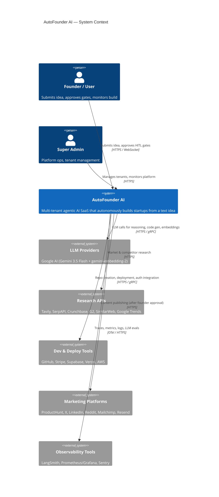

---

## 3. 10-Layer Reference Architecture

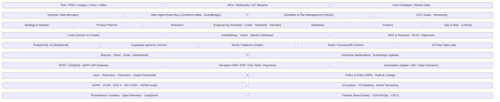

---

## 4. End-to-End Workflow

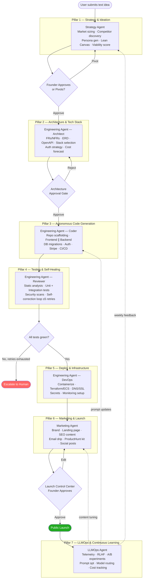

---

## 5. Agent Architecture & Data Flow

### 5.1 Agent Contract

Every agent exposes a standard interface:

```
┌─────────────────────────────────────────────────┐
│                    Agent<TInput, TOutput>        │
│  understand(input) → Intent                      │
│  plan(intent)      → DAG of Steps               │
│  execute(plan)     → AsyncIterable<StepEvent>   │
│  verify(output)    → VerifyResult                │
│  learn(trace)      → void   ──▶ LLMOps          │
└─────────────────────────────────────────────────┘
```

### 5.2 Pillar-to-Agent Mapping

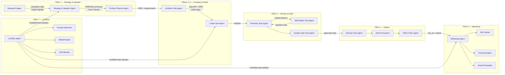

### 5.3 Inter-Pillar Data Flow

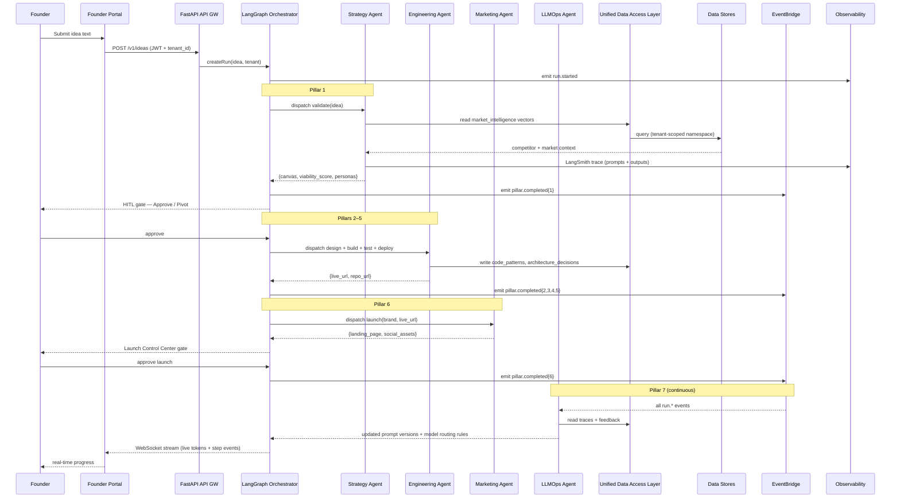

---

## 6. Multi-Agent Communication

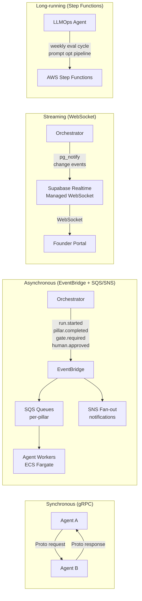

**Communication patterns by use case**:

| Pattern | Protocol | When |
|---|---|---|
| Agent → Agent (low latency) | gRPC (Protocol Buffers) | Synchronous request/response |
| Orchestrator → Agents | EventBridge → SQS | Async task dispatch |
| Run events (fan-out) | EventBridge → SNS | Notifications, webhooks |
| Live token/log stream | Supabase Realtime (WebSocket) | Founder Portal real-time updates |
| LLMOps weekly cycle | AWS Step Functions | Long-running multi-day pipelines |
| High-throughput telemetry | Confluent Kafka | LLMOps trace ingestion |

---

## 7. Memory Architecture

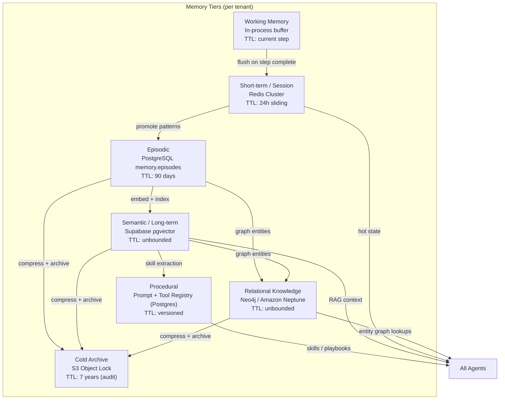

**Tenant isolation**: all keys prefixed `tenant_id/`; Postgres schema-per-tenant; vector store namespace-per-tenant.

---

## 8. Data Architecture

### 8.1 Polyglot Persistence

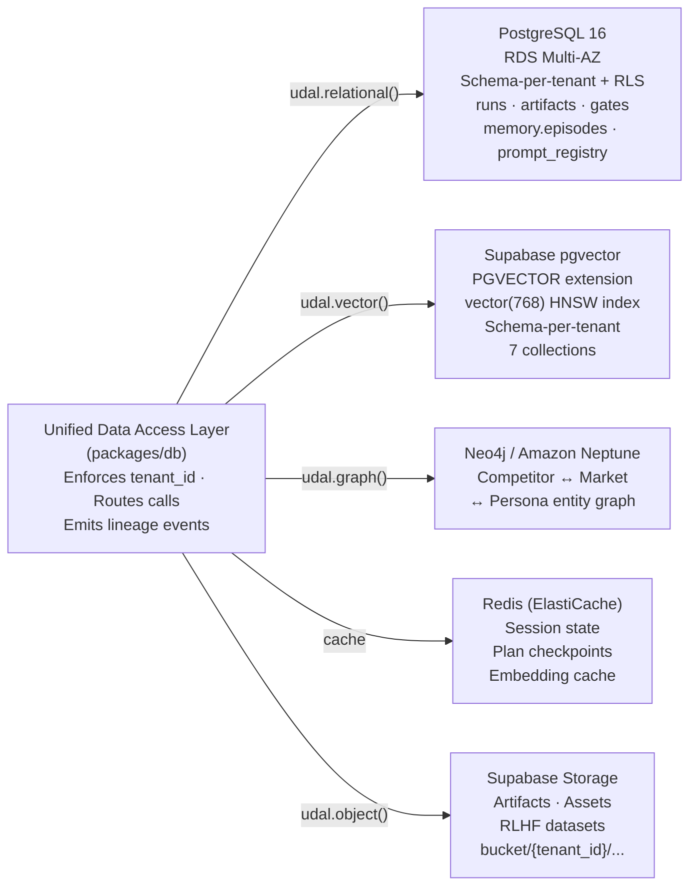

### 8.2 RAG Pipeline

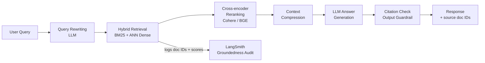

### 8.3 Core PostgreSQL Schemas

```
tenant_<uuid>.runs           — pillar, status, plan DAG (JSONB), created_at
tenant_<uuid>.artifacts      — run_id, kind, uri, metadata (JSONB)
tenant_<uuid>.gates          — run_id, kind, state, decided_by, decided_at
orchestrator.checkpoints     — LangGraph DAG checkpoints
orchestrator.runs            — serialized plan DAGs
memory.episodes              — per-run traces, decisions, gate outcomes
prompt_registry              — prompt versions (immutable, semver-tagged)
tool_registry                — MCP tool specs, auth scope, cost class
```

---

## 9. API Layer

### 9.1 Protocol Overview

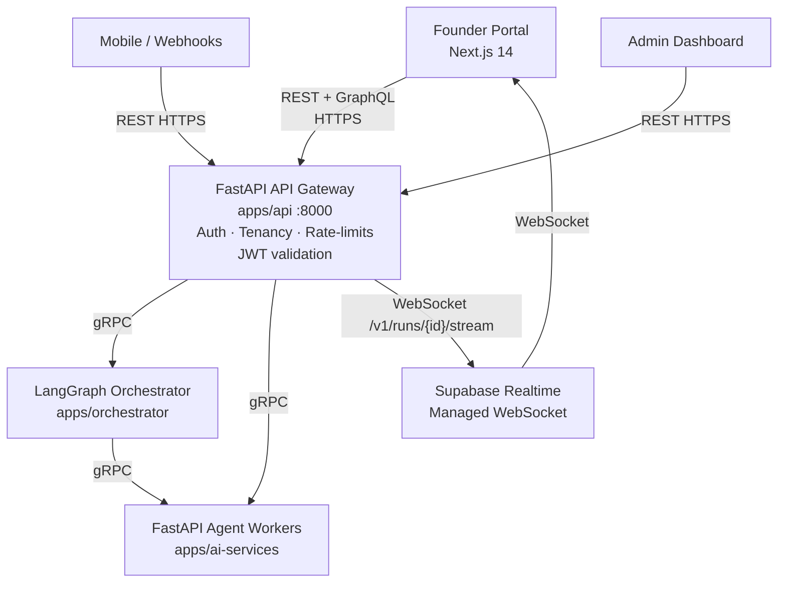

### 9.2 Key REST Endpoints

| Method | Path | Purpose |
|---|---|---|
| `POST` | `/v1/ideas` | Submit idea → returns `run_id` |
| `GET` | `/v1/runs/{id}` | Run state, active gates, artifacts |
| `POST` | `/v1/runs/{id}/gates/{gate_id}` | Approve / reject HITL gate |
| `GET` | `/v1/runs/{id}/artifacts` | List artifacts (canvas, repo, live URL…) |
| `GET` | `/v1/runs/{id}/stream` | WebSocket — live token + step events |
| `POST` | `/v1/tenants/{id}/keys` | Rotate tenant API keys |
| `GET` | `/v1/llmops/cost?tenant_id=…` | Per-tenant cost telemetry |
| `POST` | `/v1/feedback` | Accept/reject signal for RLHF |

All new endpoints require an OpenAPI 3.1 entry in `apps/api/openapi.yaml`. Breaking changes use `/v2/` namespacing.

---

## 10. Guardrails Pipeline

Every agent invocation passes through a 6-stage pipeline:

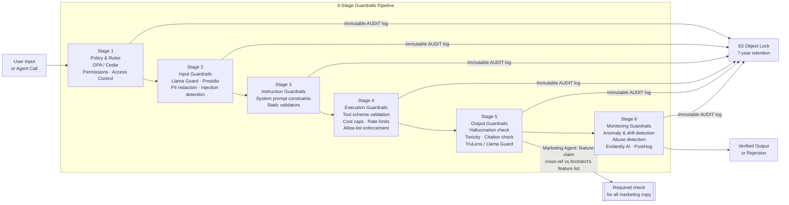

---

## 11. Multi-Tenant AWS Infrastructure

### 11.1 Network Topology

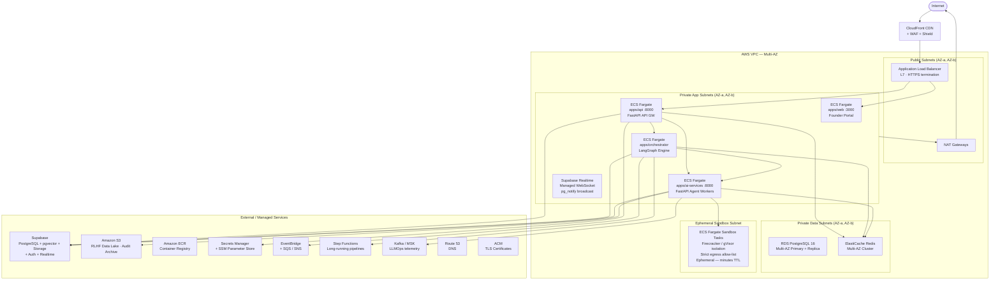

### 11.2 ECS Service Layout

| ECS Service | Image | Port | Scale Trigger |
|---|---|---|---|
| `web` | Next.js 14 | 3000 | CPU target 60% |
| `api` | FastAPI | 8000 | RPS target |
| `ai-services` | FastAPI | 8001 | SQS queue depth |
| `orchestrator` | Python / LangGraph | internal | SQS queue depth |
| `sandbox-runner` | Docker-in-Fargate | ephemeral | On-demand per build |

Note: Supabase Realtime is a managed service — no ECS task needed.

### 11.3 Tenant Isolation Model

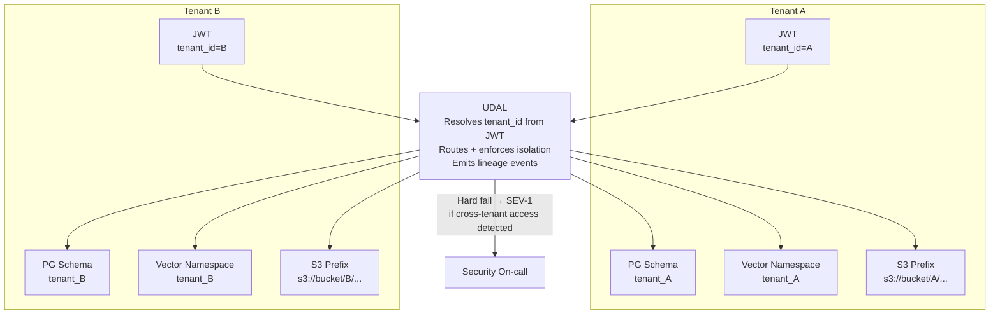

### 11.4 Deployment Strategy (Blue/Green)

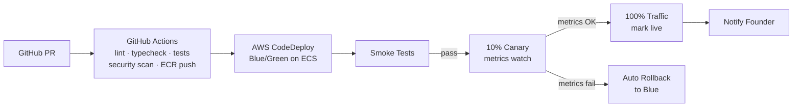

---

## 12. Observability Stack

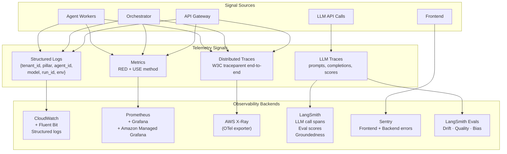

**Mandatory tags on every signal**: `tenant_id` · `pillar` · `agent_id` · `model` · `run_id` · `env`

---

## 13. CI/CD Pipeline

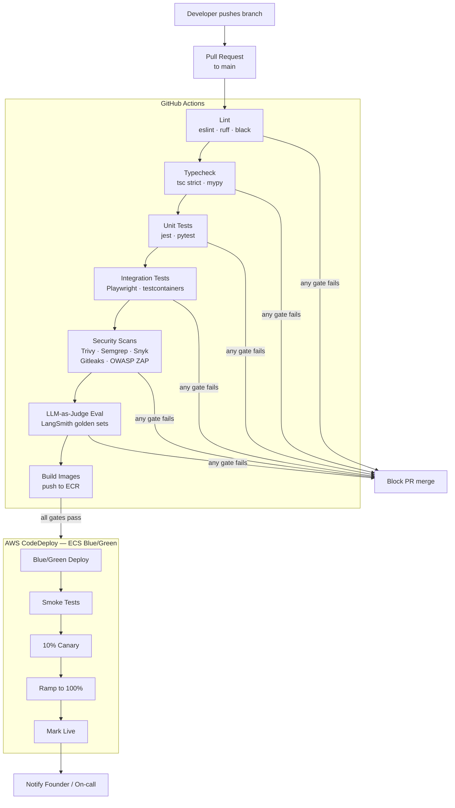

**PR gates** (all must pass before merge): lint · typecheck · unit tests · integration tests · security scan · LLM-judge score ≥ threshold. No direct push to `main`.

---

## 14. Security Architecture

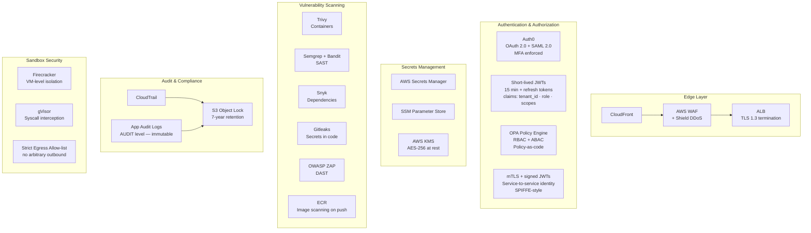

**Prompt injection defense**: all user-supplied text passes through Input Guardrail (PII redaction + injection classifier) before reaching any LLM call.

---

## 15. Performance & Scalability

### Non-Negotiable SLAs

| Metric | Target |
|---|---|
| UI response time (P95) | < 100 ms |
| Sandbox spin-up | < 10 s |
| Idea → Validated | < 30 min |
| End-to-end MVP build | ≤ 7 days |
| Deploy (code → live) | < 10 min |
| Self-heal auto-fix rate | ≥ 90% |
| First-run deploy success | ≥ 85% |
| Test coverage (generated code) | ≥ 80% |
| Platform uptime | 99.9% |
| Concurrent builds | 500 |
| COGS per MVP | < ₹500 |

### Scalability Design

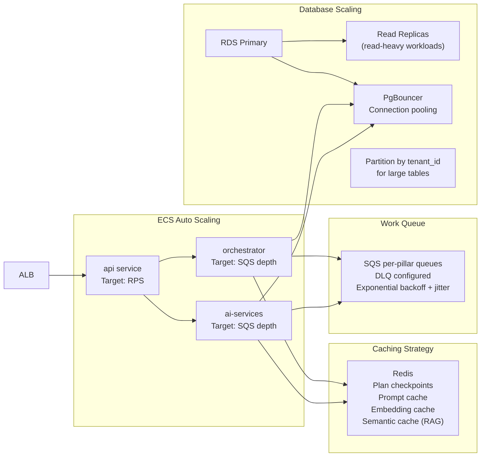

---

## 16. Key Design Decisions

| Decision | Choice | Rationale |
|---|---|---|
| **Orchestration** | LangGraph (primary) + AutoGen (fallback) | Stateful DAGs with deterministic checkpoints; AutoGen for free-form multi-agent patterns |
| **Compute** | Amazon ECS on Fargate | Serverless containers, no cluster management, per-task isolation; Kubernetes deferred to v2 |
| **Vector store** | Supabase pgvector | Eliminates separate vector DB; uses pgvector extension with vector(768) for gemini-embedding-2; HNSW index; schema-per-tenant |
| **Graph DB** | Neo4j / Amazon Neptune | TBD — pending benchmark on competitor ↔ market ↔ persona query patterns |
| **Agent isolation** | Tenant-scoped UDAL (mandatory) | Agents can never issue direct DB calls; prevents cross-tenant data leakage |
| **LLM routing** | Gemini 3.5 Flash via LiteLLM router | Unified model for all task classes; gemini-embedding-2 (768-dim) for all collections; cost optimized |
| **Prompt management** | Versioned in `prompt_registry` + S3; DSPy auto-tune | Immutable prompt artifacts + automated weekly optimization using RLHF data |
| **Sandbox isolation** | Firecracker + gVisor + strict egress allow-list | Defense-in-depth for code execution; VM-level + syscall-level isolation |
| **Deploy strategy** | Blue/green on ECS via AWS CodeDeploy | Zero-downtime; instant 1-click rollback; canary ramp before full traffic |
| **Tenant DB isolation** | Schema-per-tenant + RLS as defense-in-depth | Strong isolation with RLS as secondary safety net |
| **Human-in-the-loop** | Required gates at Pillars 1, 2, 5 (spend), 6 | Ensures founder oversight at critical decision points before irreversible actions |
| **Retry / self-heal** | Max 5 cycles in Pillar 4; then HITL escalation | Bounded autonomy — prevents infinite loops; degrades gracefully to human review |

---

*Generated from `CLAUDE.md` v1.0 — 2026-05-19*
