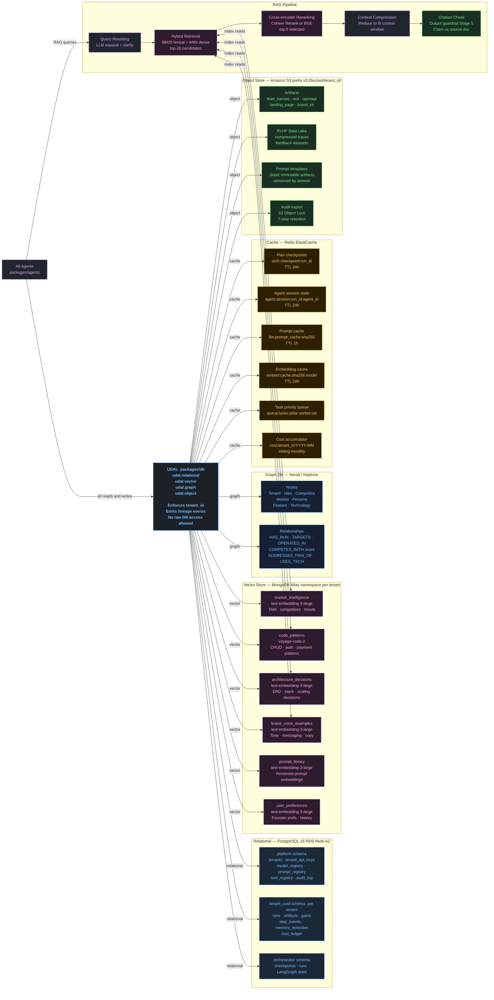

# AutoFounder AI — Architecture Diagram

**Version**: 1.0 · **Date**: 2026-05-19  
**See also**: [`docs/architecture/HLD.md`](architecture/HLD.md) · [`docs/architecture/lld.md`](architecture/lld.md)

---

## System Architecture

```mermaid
flowchart TD
    classDef actor     fill:#0d1117,stroke:#58a6ff,color:#cdd9e5,font-weight:bold
    classDef edge      fill:#161b22,stroke:#388bfd,color:#cdd9e5
    classDef app       fill:#1c2128,stroke:#388bfd,color:#79c0ff
    classDef orch      fill:#1c2128,stroke:#a371f7,color:#d2a8ff
    classDef agent     fill:#21262d,stroke:#a371f7,color:#d2a8ff
    classDef guard     fill:#1a2f23,stroke:#3fb950,color:#7ee787
    classDef model     fill:#2d1b2e,stroke:#bc8cff,color:#ffa8e0
    classDef data      fill:#1b2837,stroke:#388bfd,color:#79c0ff
    classDef async     fill:#2d2000,stroke:#e3b341,color:#f0c57a
    classDef obs       fill:#162032,stroke:#58a6ff,color:#79c0ff
    classDef infra     fill:#1c1c2e,stroke:#6e7681,color:#8b949e
    classDef ext       fill:#1c1c1c,stroke:#6e7681,color:#8b949e

    %% ── Actors ──────────────────────────────────────────────────────────────
    FOUNDER(["Founder / User"]):::actor
    ADMIN(["Super Admin"]):::actor

    %% ── Edge & Security ──────────────────────────────────────────────────────
    subgraph EDGE["Edge & Security"]
        CF["CloudFront CDN\nWAF + Shield DDoS"]:::edge
        ALB["Application Load Balancer\nL7 · TLS 1.3 termination"]:::edge
    end

    %% ── Application Layer ────────────────────────────────────────────────────
    subgraph APP["Application Layer  —  ECS Fargate  (private subnets)"]
        WEB["apps/web\nNext.js 14 · Founder Portal\nValidation · Architecture · Code · Deploy · Launch · LLMOps"]:::app
        API["apps/api\nNestJS API Gateway\nAuth · Tenancy · Rate-limits · OPA"]:::app
        RT["apps/realtime\nGo WebSocket Service\nToken stream · Step events · Live logs"]:::app
    end

    %% ── Orchestration Layer ───────────────────────────────────────────────────
    subgraph ORCH_LAYER["Agent Orchestration Layer  —  ECS Fargate"]
        ORCH["apps/orchestrator\nLangGraph Engine\nDAG execution · Checkpoints · HITL gates · AutoGen fallback"]:::orch
        AISVR["apps/ai-services\nFastAPI Agent Workers\nLLM clients · RAG pipeline · Sandbox launcher"]:::orch
    end

    %% ── AI Agents ────────────────────────────────────────────────────────────
    subgraph AGENTS["AI Agents Layer  —  packages/agents"]
        STR["Strategy & Ideation\nPillar 1\nMarket sizing · Lean Canvas\nViability score · Personas · Pivot options"]:::agent
        RES["Research\nPillar 1\nTavily · SerpAPI · Crunchbase\nG2 · SimilarWeb · Google Trends"]:::agent
        PPL["Product Planner\nPillar 1.5\nPRDs · Roadmaps\nUser stories · Requirements"]:::agent
        ARC["Architect\nPillar 2\nERD · OpenAPI · Stack selection\nMicroservice boundaries · Cost forecast"]:::agent
        COD["Coder\nPillar 3\nFrontend || Backend in parallel\nDB migrations · Auth · Stripe · CI/CD"]:::agent
        REV["Reviewer / Self-Healer\nPillar 4\nStatic analysis · Tests · Security scans\nAST patching · LLM-as-judge  max 5 retries"]:::agent
        DVO["DevOps\nPillar 5\nDockerize · Terraform · ECS Fargate\nDNS/SSL · Blue-green · Smoke tests"]:::agent
        MKT["Marketing\nPillar 6\nBrand · Landing page · SEO content\n10 blog drafts · Email drip · Social posts"]:::agent
        LMO["LLMOps\nPillar 7\nPrompt opt DSPy · Drift monitor\nA/B experiments · Model routing · FinOps"]:::agent
    end

    %% ── Guardrails ────────────────────────────────────────────────────────────
    subgraph GUARD["Guardrails & Governance Pipeline  —  packages/guardrails"]
        G12["Stage 1–2\nPolicy OPA/Cedar · Permissions\nInput Llama Guard · Presidio PII redaction\nInjection detection · Content filters"]:::guard
        G34["Stage 3–4\nInstruction validators · System prompt constraints\nExecution guard · Tool schema validation\nCost caps · Rate limits · Allow-list enforcement"]:::guard
        G56["Stage 5–6\nOutput guard · TruLens groundedness\nHallucination check · Citation cross-ref\nMonitoring · Anomaly · Drift · Abuse detection"]:::guard
        AUDITL[("Audit & Lineage\nImmutable append-only log\nS3 Object Lock · 7-year retention\nSOC 2 · ISO 27001 evidence")]:::guard
    end

    %% ── Model Layer ───────────────────────────────────────────────────────────
    subgraph MODELS["Model & Capability Layer  —  LiteLLM router"]
        CLAUDE["Claude Sonnet\nComplex reasoning\nArchitecture · Self-healing\nLLM-as-judge"]:::model
        GPT4O["GPT-4o\nCode generation\nMarketing copy\nStandard tasks"]:::model
        MINI["GPT-4o-mini\nCRUD · Formatting\nClassification\nIntent parsing"]:::model
        EMBED["Embeddings\ntext-embedding-3-large\nvoyage-code-2 for code"]:::model
        GENAI["Image & Speech\nDALL-E 3 · Midjourney\nWhisper · GPT-4o-vision"]:::model
        LGUARD["Safety Classifier\nLlama Guard 3\nAlignment · Toxicity"]:::model
    end

    %% ── Data Layer ────────────────────────────────────────────────────────────
    subgraph DATA["Data & Knowledge Layer  —  all access via UDAL"]
        UDAL["UDAL  packages/db\nudal.relational / vector / graph / object\nTenant-scoped · Lineage events · No raw DB access from agents"]:::data
        PG[("PostgreSQL 16\nRDS Multi-AZ\nSchema-per-tenant + RLS\nruns · artifacts · gates · episodes")]:::data
        VEC[("MongoDB Atlas\nVector Search\nNamespace per tenant\nmarket_intel · code_patterns · brand_voice")]:::data
        GDB[("Neo4j / Neptune\nEntity graph\nCompetitor to Market\nto Persona relationships")]:::data
        REDIS[("Redis ElastiCache\nSession state 24h TTL\nPlan checkpoints\nPrompt + embedding cache")]:::data
        S3[("Amazon S3\nArtifacts · RLHF data lake\nPrompt templates\nAudit export")]:::data
    end

    %% ── Async & Workflow ──────────────────────────────────────────────────────
    subgraph ASYNC["Async & Workflow Layer"]
        EB["EventBridge\nRouting · Schema registry\nrun.started · pillar.completed\ngate.required · agent.failed"]:::async
        SQSQ["SQS\nPer-pillar queues\nDLQs configured\nExponential backoff + jitter"]:::async
        SNSN["SNS\nFan-out notifications\nWebhooks · Founder alerts"]:::async
        STFN["Step Functions\nLLMOps weekly cycle\nPrompt opt pipeline\nMulti-day orchestration"]:::async
    end

    %% ── Observability ─────────────────────────────────────────────────────────
    subgraph OBS["Observability & MLOps Foundation  —  Layer 10"]
        LSMI["LangSmith\nLLM traces · Evals\nGroundedness audits\nPromptfoo regression"]:::obs
        OTEL["OpenTelemetry\nAWS X-Ray spans\nW3C traceparent end-to-end\nDist. tracing across all services"]:::obs
        ELK["ELK + CloudWatch\nFluent Bit structured logs\ntrace_id · tenant_id\nrun_id · agent_id · model"]:::obs
        PRMG["Prometheus + Grafana\nRED + USE dashboards\nPer-tenant cost attribution\nAmazon Managed Grafana"]:::obs
        FEATST["Feast / Tecton\nFeature store\nEngagement · COGS\nAccept-rate per tenant"]:::obs
    end

    %% ── AWS Infrastructure ────────────────────────────────────────────────────
    subgraph INFRA["AWS Infrastructure"]
        ECR["ECR\nContainer registry\nImage scanning on push\nSandbox task images"]:::infra
        SMGR["Secrets Manager\nSSM Parameter Store\nKMS AES-256 at rest\nNo .env files in repo"]:::infra
        R53ACM["Route 53 + ACM\nDNS management\nTLS certificates\nLet's Encrypt fallback"]:::infra
    end

    %% ── External Integrations ─────────────────────────────────────────────────
    subgraph EXT["External Integrations  —  strict egress allow-list per tool"]
        EXTRES["Research APIs\nTavily · SerpAPI · Crunchbase\nG2 · Capterra · SimilarWeb\nProductHunt · HN · LinkedIn"]:::ext
        EXTDEV["Dev & Deploy\nGitHub · Auth0 · Stripe\nTerraform · Vercel · Netlify\nAWS Pricing API"]:::ext
        EXTMKT["Marketing Platforms\nX · LinkedIn · Reddit\nResend · Mailchimp · Typefully\nAhrefs · Webflow · Framer"]:::ext
    end

    %% ── Connections ───────────────────────────────────────────────────────────

    %% User → Edge → App
    FOUNDER & ADMIN --> CF
    CF --> ALB
    ALB --> WEB & API & RT
    WEB <-->|"WebSocket  /v1/runs/id/stream"| RT
    WEB -->|"REST  GraphQL"| API

    %% App → Orchestration
    API -->|"gRPC  OrchestratorService"| ORCH
    ORCH -->|"gRPC stream  AgentWorkerService"| AISVR

    %% Orchestration → Agents
    AISVR --> STR & RES & PPL
    AISVR --> ARC & COD & REV & DVO
    AISVR --> MKT & LMO

    %% Agents → Guardrails → Models
    STR & RES & PPL --> G12
    ARC & COD & REV & DVO --> G12
    MKT & LMO --> G12
    G12 --> G34 --> G56
    G12 & G34 & G56 -.->|"immutable audit write"| AUDITL
    G56 -->|"LiteLLM router"| CLAUDE & GPT4O & MINI & EMBED & GENAI & LGUARD

    %% Services → Data (via UDAL only)
    AISVR -->|"via UDAL only"| UDAL
    ORCH -->|"checkpoints  runs  gates"| UDAL
    UDAL --> PG & VEC & GDB & REDIS & S3

    %% Orchestration → Async
    ORCH --> EB
    EB --> SQSQ --> AISVR
    EB --> SNSN --> RT
    LMO --> STFN

    %% Services → Observability
    AISVR & ORCH & API -->|"OTel spans"| OTEL
    AISVR & ORCH & API -->|"structured logs"| ELK
    AISVR & ORCH -->|"RED metrics"| PRMG
    CLAUDE & GPT4O -->|"LLM call traces"| LSMI
    LMO --> FEATST

    %% Services → AWS Infra
    AISVR -->|"sandbox task pull"| ECR
    API & AISVR & ORCH -->|"runtime secrets"| SMGR
    DVO -->|"DNS  TLS"| R53ACM

    %% Agents → External (scoped egress)
    RES --> EXTRES
    COD & DVO --> EXTDEV
    MKT --> EXTMKT
```

---

## 7-Pillar End-to-End Workflow

```mermaid
flowchart TD
    classDef pillar  fill:#21262d,stroke:#a371f7,color:#d2a8ff
    classDef gate    fill:#1a2f23,stroke:#3fb950,color:#7ee787,font-weight:bold
    classDef io      fill:#0d1117,stroke:#58a6ff,color:#cdd9e5
    classDef fail    fill:#3d1f1f,stroke:#f85149,color:#ffa198

    START(["Founder submits idea text\nor PDF / voice / URL"]):::io

    subgraph P1["Pillar 1  —  Strategy & Ideation  SLA: 30 min"]
        P1A["Research Agent\nTavily · SerpAPI · Crunchbase · G2\nSimilarWeb · Google Trends"]:::pillar
        P1B["Strategy Agent\nTAM/SAM/SOM · Competitor discovery\nKeyword mining · Persona generation"]:::pillar
        P1C["Product Planner Agent\nLean Canvas · Viability score 0–100\nBias audit · 3 pivot options · PRD"]:::pillar
    end

    G1{{"HITL Gate 1\nFounder approves\nor pivots"}}:::gate

    subgraph P2["Pillar 2  —  Architecture & Tech Stack"]
        P2A["Architect Agent\nFRs/NFRs extraction · ERD design\nOpenAPI contract · Stack selection\nMicroservice boundaries · Cost forecast"]:::pillar
    end

    G2{{"HITL Gate 2\nFounder approves\narchitecture"}}:::gate

    subgraph P3["Pillar 3  —  Autonomous Code Generation"]
        P3A["Coder Agent — Frontend Specialist\nNext.js 14 · Tailwind · shadcn/ui\nZustand · React Query"]:::pillar
        P3B["Coder Agent — Backend Specialist\nFastAPI or NestJS · Prisma/SQLAlchemy\nOAuth · JWT · RBAC · Stripe"]:::pillar
        P3C["Repo Manager\nGitHub repo scaffold · PR creation\nPrettier · ESLint · Black · Ruff"]:::pillar
    end

    subgraph P4["Pillar 4  —  Testing & Self-Healing  max 5 retries"]
        P4A["Reviewer Agent\nStatic analysis · Unit tests · Integration tests\nTrivy · Semgrep · Snyk · OWASP ZAP · Gitleaks"]:::pillar
        P4B["Self-Healer\nAST-aware patching · LLM-as-judge review\ncoverage ≥ 80% · judge score ≥ 0.85"]:::pillar
        P4C["Quality Gate Agent\nAll checks pass?\ncoverage · lint · security · judge"]:::pillar
    end

    ESCALATE(["Escalate to Human\ngate.required emitted"]):::fail

    subgraph P5["Pillar 5  —  Deploy & Infrastructure  SLA: 10 min"]
        P5A["DevOps Agent\nMulti-stage Dockerfile · docker-compose\nTerraform plan + apply · ECS Fargate\nRDS · ElastiCache · S3 provisioning"]:::pillar
        P5B["DNS & SSL Agent\nRoute 53 record · ACM cert\nLet's Encrypt · HTTPS enforced"]:::pillar
        P5C["Observability Agent\nCloudWatch · Prometheus · Grafana\nSentry DSN · Datadog APM"]:::pillar
    end

    G3{{"HITL Gate 3\nInfra spend threshold\nconfigurable"}}:::gate

    subgraph P6["Pillar 6  —  Marketing & Launch Automation"]
        P6A["Marketing Agent — Brand\nName · Logo DALL-E 3 · Color palette\nVoice · OG image · Landing page"]:::pillar
        P6B["SEO Content Engine\n10 blog drafts · target keywords\nInternal linking · meta tags"]:::pillar
        P6C["Social Scheduler\nProductHunt kit · HN post\nX thread 8–10 tweets · LinkedIn · Reddit\nEmail drip sequences via Resend"]:::pillar
    end

    G4{{"HITL Gate 4\nLaunch Control Center\nFounder approves all assets"}}:::gate

    LAUNCH(["Public Launch\nlive_url · repo_url · brand kit\nlanding page · social posts published"]):::io

    subgraph P7["Pillar 7  —  LLMOps & Continuous Learning  weekly cadence"]
        P7A["Feedback Loop Agent\nAccept/reject signals · Trace analysis\nLangSmith evals · RLHF dataset curation"]:::pillar
        P7B["Prompt Optimizer\nDSPy auto-tune · Promptfoo regression\nCanary 5% traffic · Promote on eval pass"]:::pillar
        P7C["Model Router + Drift Monitor\nLiteLLM routing rule updates\nTruLens + Evidently AI · A/B experiments\nPer-tenant cost attribution FinOps"]:::pillar
    end

    %% Flow
    START --> P1A & P1B
    P1A & P1B --> P1C
    P1C --> G1
    G1 -->|"Pivot"| P1A
    G1 -->|"Approve"| P2A
    P2A --> G2
    G2 -->|"Reject"| P2A
    G2 -->|"Approve"| P3A & P3B
    P3A & P3B --> P3C
    P3C --> P4A
    P4A --> P4B
    P4B -->|"patch → re-test"| P4A
    P4A & P4B --> P4C
    P4C -->|"retries exhausted"| ESCALATE
    P4C -->|"all green"| G3
    G3 -->|"approve spend"| P5A
    P5A --> P5B --> P5C
    P5C --> P6A
    P6A --> P6B --> P6C
    P6C --> G4
    G4 -->|"Edit"| P6A
    G4 -->|"Approve"| LAUNCH
    LAUNCH --> P7A --> P7B --> P7C
    P7C -.->|"updated prompts + model rules"| P1B
    P7C -.->|"code pattern learnings"| P3A & P3B
    P7C -.->|"marketing tuning"| P6A
```

---

## Data Architecture

---

## Component Interaction Summary

| Source | Target | Protocol | Purpose |
|---|---|---|---|
| Founder Portal | NestJS API | REST / GraphQL HTTPS | All API calls |
| Founder Portal | Go Realtime | WebSocket WSS | Live token stream + step events |
| NestJS API | LangGraph Orchestrator | gRPC `OrchestratorService` | Run creation, gate decisions, cancellation |
| LangGraph Orchestrator | FastAPI AI Services | gRPC stream `AgentWorkerService` | Dispatch steps, receive event stream |
| FastAPI AI Services | All Agents | In-process Python | Agent execution |
| All Agents | UDAL | In-process SDK call | All data reads and writes |
| All Agents | Guardrails Pipeline | In-process Python | Every agent invocation wrapped |
| Guardrails Stage 5–6 | LiteLLM Router | In-process | Route to cheapest-capable model |
| LangGraph Orchestrator | EventBridge | AWS SDK | `run.*`, `pillar.*`, `gate.*` events |
| EventBridge | SQS (per-pillar) | AWS routing rule | Task dispatch to AI Services |
| EventBridge | SNS | AWS routing rule | Fan-out notifications → Realtime service |
| LLMOps Agent | Step Functions | AWS SDK | Weekly prompt-opt + eval cycle |
| All Services | OpenTelemetry | OTel SDK | Distributed traces → X-Ray |
| LLM Calls | LangSmith | HTTP | LLM I/O traces + eval scores |

---

*Generated from CLAUDE.md v1.0 — 2026-05-19*
