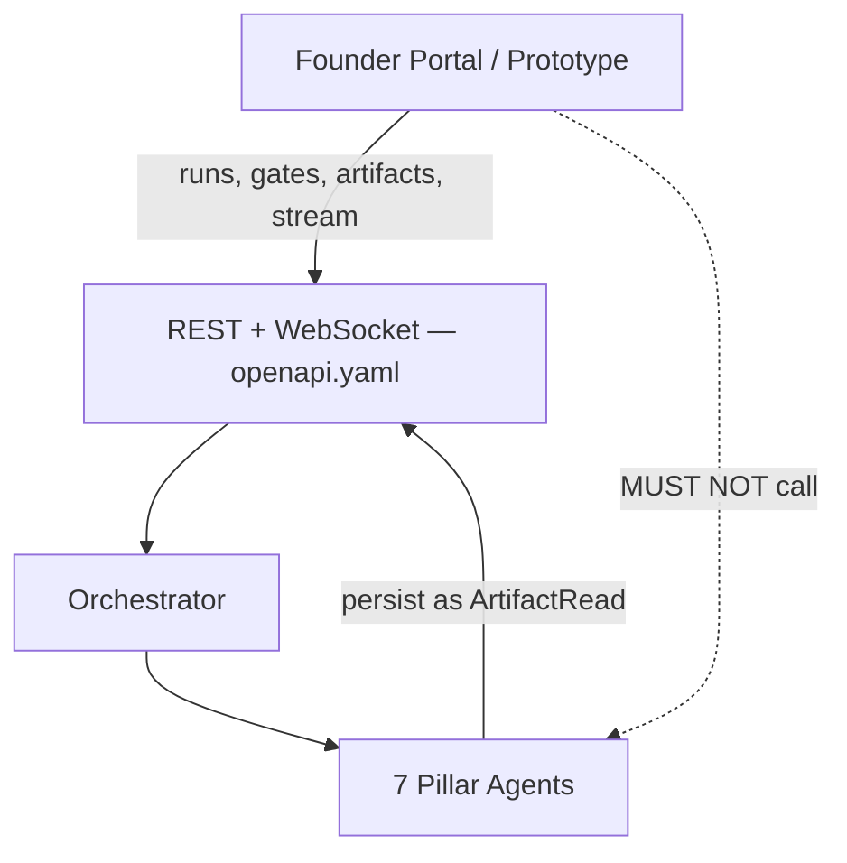
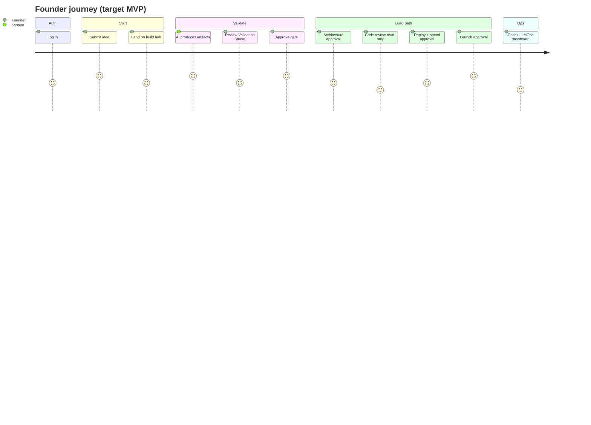
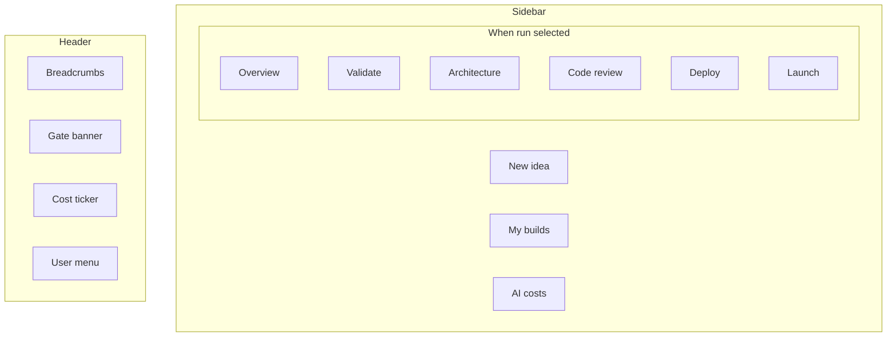
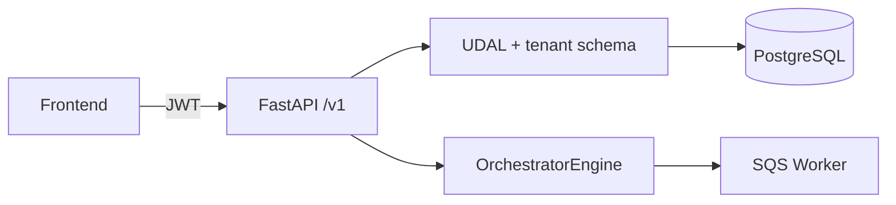
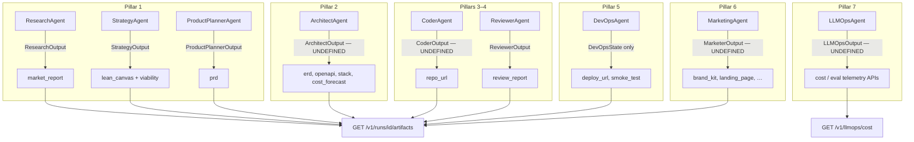
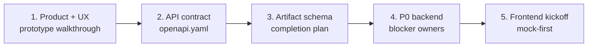

# AutoFounder AI — Review Package v1

> **Purpose:** Engineering sign-off package synthesizing product intent, UI specification, API contract, gap analysis, mock data, and static prototype.  
> **Audience:** Platform, backend, agent, and frontend leads  
> **Date:** June 2026  
> **Version:** 1.0  
> **Sources:** `raunak-docs/*`, `docs/openapi.yaml`, `mock-data/`, `prototype/`, `PROJECT-1-AutoFounder-AI/` (live code)

---

## Sign-off checklist (summary)

| Area | Artifact | Status | Sign-off owner |
|------|----------|--------|----------------|
| Product intent | `raunak-docs/project_understanding.md` | ✅ Draft complete | Product / Asit |
| UX specification | `raunak-docs/frontend_ux_spec.md` | ✅ Draft complete | Design / Raunak |
| API contract | `docs/openapi.yaml` | ✅ v1.0 contract-first | Somesh / Asit |
| Static prototype | `prototype/*.html` (10 pages) | ✅ Clickable demo | Raunak |
| Gap analysis | `raunak-docs/engineering_gap_analysis.md` | ✅ 92 features inventoried | Engineering leads |
| Production frontend | `PROJECT-1-AutoFounder-AI/frontend/` | ❌ Scaffold only | Raunak |
| E2E backend path | Ideas → orchestrator → artifacts | ❌ Not wired | Somesh |

---

## 1. Executive Summary

AutoFounder AI is a multi-agent platform that takes a founder's business idea through seven pipeline stages — validate, design, build, test, deploy, market, and improve — with human approval gates at critical decision points.

### Current state (June 2026)

| Dimension | Status | Evidence |
|-----------|--------|----------|
| **Platform foundation** | ~70% built | Terraform, UDAL, migrations, orchestrator graph, guardrails MVP |
| **Pillar 1 agents** | Built, partially wired | Research, Strategy, Product Planner have code + tests; orchestrator runs Strategy stub without full chain |
| **Pillars 2–7 agents** | Mostly missing | Reviewer built; Architect, Coder, DevOps, Marketing, LLMOps are LLD/skeleton |
| **Public REST API** | Partial | 8 route groups exist; `RunRead` schema lags contract; ideas endpoint does not kick orchestrator |
| **Founder Portal (Next.js)** | Not started | `frontend/src/placeholder.ts` only; AF-051→062 all pending |
| **Design & planning artifacts** | Complete for review | UX spec, API spec, static HTML prototype, mock data, gap analysis |

### Inventory roll-up (from gap analysis)

| Metric | Count |
|--------|------:|
| Features inventoried | 92 |
| Exists | 38 (41%) |
| Partial | 24 (26%) |
| Missing | 30 (33%) |
| P0 gap effort (estimate) | 95–125 person-days |

### Key architectural decision (approved for review)

**The Founder Portal MUST depend only on `docs/openapi.yaml`** — runs, gates, artifacts, and stream events. It MUST NOT import agent output types (`StrategyOutput`, `ReviewerOutput`, etc.). Agents persist deliverables as **typed artifacts**; the API is the integration boundary.

### What this package enables

Stakeholders can walk the full product flow via `prototype/index.html` while engineering signs off on:

1. Screen ↔ API ↔ artifact mapping  
2. P0 blockers before production frontend implementation  
3. Undefined agent outputs that must be specified before P1 pillars ship  

---

## 2. Product Flow Overview

```mermaid
flowchart LR
    subgraph Input
        I[Founder submits idea]
    end

    subgraph P1["Pillar 1 — Validate"]
        V[Research + Strategy + PRD]
        G1{validation_approve}
    end

    subgraph P2["Pillar 2 — Design"]
        A[Architecture blueprint]
        G2{architecture_approve}
    end

    subgraph P3P4["Pillars 3–4 — Build & Test"]
        C[Code generation]
        T[Review + self-heal]
    end

    subgraph P5["Pillar 5 — Deploy"]
        D[Cloud deploy]
        G3{infra_spend_approve}
    end

    subgraph P6["Pillar 6 — Market"]
        M[GTM content]
        G4{launch_approve}
    end

    subgraph P7["Pillar 7 — Improve"]
        L[LLMOps weekly cycle]
    end

    I --> V --> G1
    G1 -->|pivot| V
    G1 -->|approve| A --> G2
    G2 --> C --> T --> D --> G3
    G3 --> M --> G4
    G4 --> Launch[Public launch]
    Launch --> L
```



### API abstraction layer (frontend view)



---

## 3. Complete User Journey

| Step | Founder action | Portal screen | Gate | Backend stage |
|------|----------------|---------------|------|---------------|
| 1 | Sign in | `index.html` / `/login` | — | Supabase Auth |
| 2 | Submit idea | `idea-intake.html` / `/idea` | — | `POST /v1/ideas` |
| 3 | View all builds | `dashboard.html` / `/runs` | — | `GET /v1/runs` |
| 4 | Watch one build | `run-detail.html` / `/runs/[id]` | — | `GET /v1/runs/{id}`, stream |
| 5 | Review validation | `validation-studio.html` | `validation_approve` | Pillar 1 artifacts |
| 6 | Review architecture | `architecture-studio.html` | `architecture_approve` | Pillar 2 artifacts |
| 7 | Review code quality | `code-review.html` | — | Pillar 3–4 artifacts |
| 8 | Approve deploy + URL | `deploy-console.html` | `infra_spend_approve` | Pillar 5 artifacts |
| 9 | Approve marketing | `launch-control.html` | `launch_approve` | Pillar 6 artifacts |
| 10 | Monitor AI spend | `llmops-dashboard.html` / `/llmops` | — | `GET /v1/llmops/cost` |



**Prototype walkthrough:** Open `prototype/index.html` → Dashboard → PawTrail → Validation → Architecture → Code Review → Deploy → Launch → LLMOps.

---

## 4. Navigation Structure

### Primary navigation (portal shell)

| Label | Route (target) | Prototype file | Phase |
|-------|----------------|----------------|-------|
| New idea | `/idea` | `idea-intake.html` | P0 |
| My builds | `/runs` | `dashboard.html` | P0 |
| AI costs | `/llmops` | `llmops-dashboard.html` | P1 |

### Per-build navigation (pillar studios)

| # | Label | Route (target) | Prototype file | Phase |
|---|-------|----------------|----------------|-------|
| — | Overview | `/runs/[id]` | `run-detail.html` | P0 |
| 1 | Validate | `/runs/[id]/validation` | `validation-studio.html` | P0 |
| 2 | Architecture | `/runs/[id]/architecture` | `architecture-studio.html` | P1 |
| 3 | Code review | `/runs/[id]/review` | `code-review.html` | P1 |
| 4 | Deploy | `/runs/[id]/deploy` | `deploy-console.html` | P1 |
| 5 | Launch | `/runs/[id]/launch` | `launch-control.html` | P1 |

### Header chrome (all authenticated pages)

| Element | Behavior |
|---------|----------|
| Breadcrumbs | `My builds › {idea} › {studio}` |
| Gate banner | Links to studio when `GateRead.state = pending` |
| Cost ticker | `GET /v1/llmops/cost` → links to LLMOps |
| User menu | Sign out (Supabase) |



---

## 5. Screen Inventory

Per-screen specification for engineering sign-off. **Agent outputs** are listed as backend producers of artifacts — the production UI reads artifacts via API only.

### 5.1 Login

| Field | Value |
|-------|-------|
| **Route** | `/login` |
| **Prototype** | `prototype/index.html` |
| **Purpose** | Authenticate founders before portal access |
| **Required APIs** | Supabase Auth (client SDK); optional `GET /health` |
| **Required artifacts** | None |
| **Required agent outputs** | None |
| **AF-ID** | AF-051 |
| **Build status** | ❌ Next.js missing · ✅ Prototype |

### 5.2 Auth callback

| Field | Value |
|-------|-------|
| **Route** | `/auth/callback` |
| **Prototype** | _(not in static prototype; handled by login CTA)_ |
| **Purpose** | Complete OAuth / magic-link session exchange |
| **Required APIs** | Supabase Auth token exchange |
| **Required artifacts** | None |
| **Required agent outputs** | None |
| **Build status** | ❌ Missing |

### 5.3 Idea Intake

| Field | Value |
|-------|-------|
| **Route** | `/idea` |
| **Prototype** | `prototype/idea-intake.html` |
| **Purpose** | Submit startup idea; create a new run |
| **Required APIs** | `POST /v1/ideas` → `RunEnvelope`; planned `GET /v1/workspaces` |
| **Required artifacts** | None (creates run) |
| **Required agent outputs** | Triggers orchestrator Pillar 1 (Research → Strategy → …) |
| **AF-ID** | AF-054 |
| **Backend gap** | 🔴 `POST /v1/ideas` does not persist `idea_text` or call `OrchestratorEngine.create_run()` |

### 5.4 Run List / Dashboard

| Field | Value |
|-------|-------|
| **Route** | `/runs` |
| **Prototype** | `prototype/dashboard.html` |
| **Purpose** | List all builds with status, stage, cost, date |
| **Required APIs** | `GET /v1/runs` (cursor pagination, status filter) |
| **Required artifacts** | None (summary fields on `RunRead`) |
| **Required agent outputs** | None (displays aggregate run metadata) |
| **AF-ID** | AF-061 |
| **Backend gap** | 🟡 `RunRead` returns only `id`, `pillar`, `status`, `created_at` today |

### 5.5 Run Detail (build hub)

| Field | Value |
|-------|-------|
| **Route** | `/runs/[id]` |
| **Prototype** | `prototype/run-detail.html` |
| **Purpose** | Live hub: pillar stepper, activity log, studio links, cancel |
| **Required APIs** | `GET /v1/runs/{id}`; `GET /v1/runs/{id}/artifacts`; `GET /v1/runs/{id}/stream` (WS); `DELETE /v1/runs/{id}` |
| **Required artifacts** | Any (for studio card summaries) |
| **Required agent outputs** | Stream reflects active pillar (opaque `step_key` + `pillar` in API) |
| **AF-ID** | AF-052, AF-053 |
| **Backend gap** | 🔴 WebSocket stream not implemented; 🟡 cancel exists but may not stop orchestrator |

### 5.6 Validation Studio

| Field | Value |
|-------|-------|
| **Route** | `/runs/[id]/validation` |
| **Prototype** | `prototype/validation-studio.html` |
| **Purpose** | Review Pillar 1 deliverables; approve, reject, or pivot |
| **Required APIs** | `GET /v1/runs/{id}`; `GET /v1/runs/{id}/artifacts?kind=…`; `POST /v1/runs/{id}/gates/{gate_id}`; stream (optional) |
| **Required artifacts** | `lean_canvas`, `market_report`, `viability`, `prd` |
| **Required agent outputs** | Research → `market_report`; Strategy → `lean_canvas`, `viability`; Product Planner → `prd` (post-gate) |
| **AF-ID** | AF-055 |
| **Backend gap** | 🟡 P1 chain not wired E2E; 🟡 artifacts not always persisted |

### 5.7 Architecture Studio

| Field | Value |
|-------|-------|
| **Route** | `/runs/[id]/architecture` |
| **Prototype** | `prototype/architecture-studio.html` |
| **Purpose** | Review technical blueprint; approve or reject before codegen |
| **Required APIs** | `GET /v1/runs/{id}`; `GET /v1/runs/{id}/artifacts?kind=…`; `POST /v1/runs/{id}/gates/{gate_id}` |
| **Required artifacts** | `erd`, `openapi`, `stack`, `cost_forecast` |
| **Required agent outputs** | Architect → maps to above artifact kinds |
| **AF-ID** | AF-056 |
| **Backend gap** | 🔴 Architect Agent not built; 🔴 `ArtifactMeta` schemas partial in OpenAPI |

### 5.8 Code Review Studio

| Field | Value |
|-------|-------|
| **Route** | `/runs/[id]/review` |
| **Prototype** | `prototype/code-review.html` |
| **Purpose** | Read-only code quality, scans, self-heal progress |
| **Required APIs** | `GET /v1/runs/{id}`; `GET /v1/runs/{id}/artifacts?kind=…`; stream (heal events) |
| **Required artifacts** | `review_report`, `repo_url` |
| **Required agent outputs** | Coder → `repo_url`; Reviewer → `review_report` |
| **AF-ID** | AF-057 |
| **Backend gap** | 🔴 Coder not built; 🟡 Reviewer built but orchestrator P4 is stub |

### 5.9 Deploy Console

| Field | Value |
|-------|-------|
| **Route** | `/runs/[id]/deploy` |
| **Prototype** | `prototype/deploy-console.html` |
| **Purpose** | Approve infra spend; watch deploy; obtain live URL |
| **Required APIs** | `GET /v1/runs/{id}`; artifacts; `POST /v1/runs/{id}/gates/{gate_id}`; stream |
| **Required artifacts** | `deploy_url`, `smoke_test` |
| **Required agent outputs** | DevOps → live URL, smoke results, infra cost in `meta` |
| **AF-ID** | AF-058 |
| **Backend gap** | 🔴 DevOps Agent skeleton only; no flat `DevOpsOutput` in backend |

### 5.10 Launch Control Center

| Field | Value |
|-------|-------|
| **Route** | `/runs/[id]/launch` |
| **Prototype** | `prototype/launch-control.html` |
| **Purpose** | Preview/edit marketing; approve before publish |
| **Required APIs** | `GET /v1/runs/{id}`; artifacts; `POST /v1/runs/{id}/gates/{gate_id}`; `POST /v1/feedback` |
| **Required artifacts** | `brand_kit`, `landing_page`, `social_posts`, `email_sequences`, `blog_drafts` |
| **Required agent outputs** | Marketing → maps to GTM artifact kinds |
| **AF-ID** | AF-059 |
| **Backend gap** | 🔴 Marketing Agent not built; several `ArtifactMeta*` schemas undefined |

### 5.11 LLMOps Dashboard

| Field | Value |
|-------|-------|
| **Route** | `/llmops` |
| **Prototype** | `prototype/llmops-dashboard.html` |
| **Purpose** | Org-wide AI cost, drift, eval history, prompt versions |
| **Required APIs** | `GET /v1/llmops/cost`; planned `GET /v1/llmops/cost/detail` |
| **Required artifacts** | None (platform telemetry; not per-run artifacts) |
| **Required agent outputs** | LLMOps weekly cycle (backend-only; no direct UI coupling) |
| **AF-ID** | AF-060 |
| **Backend gap** | 🟡 `cost_ledger` often empty; 🔴 cost detail endpoint missing |

### 5.12 Admin Dashboard

| Field | Value |
|-------|-------|
| **Route** | `/admin` |
| **Prototype** | _(not in static prototype)_ |
| **Purpose** | Super-admin: tenants, registries, audit log |
| **Required APIs** | `GET/POST/PATCH/DELETE /v1/admin/tenants`; registries; audit-log |
| **Required artifacts** | None |
| **Required agent outputs** | None |
| **AF-ID** | AF-062 |
| **Build status** | ❌ P2 |

### 5.13 Portal layout shell

| Field | Value |
|-------|-------|
| **Route** | `(portal)/layout` wrapper |
| **Purpose** | Sidebar, header, cost ticker, gate banner, error boundary |
| **Required APIs** | `GET /v1/llmops/cost`; active run gate from `GET /v1/runs/{id}` |
| **AF-ID** | AF-053 |

---

## 6. API Inventory

**Contract source of truth:** [`docs/openapi.yaml`](./openapi.yaml) (OpenAPI 3.1)

### 6.1 Endpoint matrix

| Endpoint | Method | Screen(s) | Implementation | Contract vs code |
|----------|--------|-----------|----------------|------------------|
| `/health` | GET | Login | ✅ | Aligned |
| `/v1/ideas` | POST | Idea Intake | 🟡 Partial | Target `RunRead` richer than code |
| `/v1/runs` | GET | Dashboard | 🟡 Partial | Missing `status` filter in code |
| `/v1/runs/{run_id}` | GET | Run Detail, all studios | 🟡 Partial | `RunRead` 4 fields vs 12+ in contract |
| `/v1/runs/{run_id}` | DELETE | Run Detail | 🟡 Partial | Deletes row; orchestrator cancel unclear |
| `/v1/runs/{run_id}/gates/{gate_id}` | POST | Validation, Architecture, Deploy, Launch | 🟡 Partial | Resumes engine in dev |
| `/v1/runs/{run_id}/artifacts` | GET | All studios | 🟡 Partial | Works if rows exist |
| `/v1/runs/{run_id}/stream` | GET (WS) | Run Detail, Review, Deploy | ❌ Missing | `x-implementation-status: planned` |
| `/v1/feedback` | POST | Launch Control | 🟡 Partial | No LLMOps consumer |
| `/v1/llmops/cost` | GET | Layout, LLMOps | 🟡 Partial | Reads empty `cost_ledger` often |
| `/v1/llmops/cost/detail` | GET | LLMOps | ❌ Missing | Planned |
| `/v1/workspaces` | GET, POST | Idea Intake (P1) | ❌ Missing | Planned |
| `/v1/workspaces/{id}/runs` | GET | Dashboard (P1) | ❌ Missing | Planned |
| `/v1/admin/tenants` | GET | Admin | ❌ Missing | Planned |
| `/v1/admin/audit-log` | GET | Admin | ❌ Missing | Planned |

### 6.2 Auth model

| Caller | Mechanism | Notes |
|--------|-----------|-------|
| Founder Portal | `Authorization: Bearer <Supabase JWT>` | Claims: `sub`, `organization_id`, `role`, `scope` |
| Machine (future) | `X-API-Key` | Not implemented |
| Public | `/health` only | No auth |

### 6.3 Response envelopes

All success responses: `{ data, meta }`. Paginated: `{ data, pagination, meta }`. Errors: `{ error: { code, message, details? }, meta }`.



---

## 7. Artifact Inventory

Artifacts are the **only** deliverable surface for the UI. Defined in `ArtifactKind` enum (`docs/openapi.yaml`).

### 7.1 Artifact catalog

| `kind` | Studio | Producer (backend) | `ArtifactMeta` in OpenAPI | Persisted today |
|--------|--------|-------------------|---------------------------|-----------------|
| `lean_canvas` | Validation | Strategy | ✅ `ArtifactMetaLeanCanvas` | 🟡 |
| `market_report` | Validation | Research | ❌ **Undefined** | 🟡 |
| `viability` | Validation | Strategy | ✅ `ArtifactMetaViability` | 🟡 |
| `prd` | Validation | Product Planner | ❌ **Undefined** | 🟡 |
| `erd` | Architecture | Architect | ✅ `ArtifactMetaErd` | ❌ |
| `openapi` | Architecture | Architect | ❌ **Undefined** | ❌ |
| `stack` | Architecture | Architect | ❌ **Undefined** | ❌ |
| `cost_forecast` | Architecture | Architect | Partial (in ERD meta) | ❌ |
| `review_report` | Code Review | Reviewer | ✅ `ArtifactMetaReviewReport` | ❌ |
| `repo_url` | Code Review | Coder | ❌ **Undefined** | ❌ |
| `deploy_url` | Deploy | DevOps | ✅ `ArtifactMetaDeployUrl` | ❌ |
| `smoke_test` | Deploy | DevOps | Partial (in deploy meta) | ❌ |
| `brand_kit` | Launch | Marketing | ✅ `ArtifactMetaBrandKit` | ❌ |
| `landing_page` | Launch | Marketing | ✅ `ArtifactMetaLandingPage` | ❌ |
| `social_posts` | Launch | Marketing | ✅ `ArtifactMetaSocialPosts` | ❌ |
| `email_sequences` | Launch | Marketing | ❌ **Undefined** | ❌ |
| `blog_drafts` | Launch | Marketing | ❌ **Undefined** | ❌ |

### 7.2 Artifact → API access pattern

```
GET /v1/runs/{run_id}/artifacts?kind=lean_canvas
→ ArtifactRead { id, run_id, kind, uri, meta, created_at }
```

Full payloads may be at `uri` (S3); `meta` carries inline UI payload per kind.

---

## 8. Agent Output Dependencies

Backend mapping from agent output types to API artifacts. **Production frontend must not import these types.**



### 8.1 Agent output schema status

| Agent | Pillar | Python schema | Wired to orchestrator | Maps to artifacts | Mock data |
|-------|--------|---------------|----------------------|-------------------|-----------|
| Research | 1 | ✅ `ResearchOutput` | ❌ Not in chain | `market_report` | — |
| Strategy | 1 | ✅ `StrategyOutput` | 🟡 Stub without API key | `lean_canvas`, `viability` | ✅ `mock-data/strategist/` |
| Product Planner | 1 | ✅ `ProductPlannerOutput` | ❌ Post-gate not wired | `prd` | — |
| Architect | 2 | ❌ **Undefined** | 🟡 Stub node | `erd`, `openapi`, `stack`, `cost_forecast` | ✅ `mock-data/architect/` |
| Coder | 3 | ❌ **Undefined** | 🟡 Stub node | `repo_url` | ✅ `mock-data/coder/` |
| Reviewer | 4 | ✅ `ReviewerOutput` | ❌ Stub node | `review_report` | ✅ `mock-data/reviewer/` |
| DevOps | 5 | 🟡 `DevOpsState` only (no flat output) | 🟡 Stub node | `deploy_url`, `smoke_test` | ✅ `mock-data/devops/` |
| Marketing | 6 | ❌ **Undefined** (`MarketerOutput` in LLD) | 🟡 Stub node | GTM artifact kinds | ✅ `mock-data/marketing/` |
| LLMOps | 7 | ❌ **Undefined** (`LLMOpsOutput` in LLD) | ❌ Not built | `/v1/llmops/*` | ✅ `mock-data/llmops/` |

### 8.2 Required adapter work (backend)

Each agent must implement an **artifact persistence adapter**:

```
AgentOutput → list[ArtifactWrite(kind, uri, meta)] → UDAL → GET /artifacts
```

Until adapters exist, frontend must use MSW/mock fixtures (see §9).

---

## 9. Mock Data Inventory

### 9.1 Agent mock outputs (`mock-data/`)

| Path | Agent | Schema | Scenario |
|------|-------|--------|----------|
| `mock-data/strategist/output.json` | Strategy | `schema.json` | PawTrail validation |
| `mock-data/architect/output.json` | Architect | `schema.json` | PawTrail tech blueprint |
| `mock-data/coder/output.json` | Coder | `schema.json` | PawTrail repo scaffold |
| `mock-data/reviewer/output.json` | Reviewer | `schema.json` | PR #14 approved |
| `mock-data/devops/output.json` | DevOps | `schema.json` | app.pawtrail.in live |
| `mock-data/marketing/output.json` | Marketing | `schema.json` | GTM package |
| `mock-data/llmops/output.json` | LLMOps | `schema.json` | Weekly cycle |

**Note:** These are for **backend/dev fixture reference**. Production UI should consume **API-shaped** fixtures derived from `ArtifactRead`, not import agent JSON directly.

### 9.2 Frontend fixtures (planned — not in repo)

From `frontend_inventory.md`; target path `frontend/tests/fixtures/`:

| Fixture | Endpoint / screen |
|---------|-------------------|
| `mock_runs_list.json` | `GET /v1/runs` |
| `mock_run_detail.json` | `GET /v1/runs/{id}` |
| `mock_lean_canvas.json` | `GET …/artifacts?kind=lean_canvas` |
| `mock_erd_openapi.json` | Architecture studio |
| `mock_review_report.json` | Code review |
| `mock_live_url.json` | Deploy console |
| `mock_launch_kit.json` | Launch control |
| `mock_llmops_cost.json` | LLMOps + cost ticker |
| `mock_step_events.json` | WebSocket stream |

**Status:** ❌ Not created in `PROJECT-1-AutoFounder-AI/frontend/` (F-136 pending).

### 9.3 Static prototype (`prototype/`)

| File | Maps to screen | Interactive |
|------|----------------|-------------|
| `index.html` | Login | ✅ → dashboard |
| `idea-intake.html` | Idea Intake | ✅ → run-detail |
| `dashboard.html` | Run List | ✅ |
| `run-detail.html` | Build hub | ✅ |
| `validation-studio.html` | Validation Studio | ✅ |
| `architecture-studio.html` | Architecture Studio | ✅ |
| `code-review.html` | Code Review | ✅ |
| `deploy-console.html` | Deploy Console | ✅ |
| `launch-control.html` | Launch Control | ✅ |
| `llmops-dashboard.html` | LLMOps | ✅ |

Pure HTML + Tailwind CDN; no backend. Suitable for **stakeholder sign-off** on UX before Next.js implementation.

---

## 10. Open Questions

| # | Question | Blocks | Owner |
|---|----------|--------|-------|
| OQ-1 | Should `POST /v1/ideas` return full `RunRead` synchronously or `202` + poll? | Idea Intake UX, error handling | Somesh + Raunak |
| OQ-2 | WebSocket vs Supabase Realtime for `step_events` — single transport? | Realtime hook (AF-052) | Somesh |
| OQ-3 | Are artifact full payloads always inline in `meta`, always at `uri`, or hybrid? | Studio loading states, caching | Somesh + Raunak |
| OQ-4 | Who defines canonical `ArtifactMeta` JSON Schema per kind — API team or agent owners? | OpenAPI completeness | Asit |
| OQ-5 | Does `DELETE /v1/runs/{id}` invoke `OrchestratorEngine.cancel()` or only DB delete? | Cancel button behavior | Somesh |
| OQ-6 | Workspace model required for MVP or P1? | Idea Intake, dashboard filters | Product |
| OQ-7 | Pivot on validation gate — `rejected` decision only, or separate `pivot` enum? | Validation Studio actions | Somesh (OpenAPI has `approved`/`rejected` only) |
| OQ-8 | LLMOps dashboard — per-org only or platform-wide for super-admin? | AF-060 vs AF-062 scope | Product |
| OQ-9 | Prototype routes (`/runs/[id]/validation`) vs any legacy `.next` routes in `frontend/` — confirm route SSoT | AF-051 migration | Raunak |
| OQ-10 | Cost cap (`402`) enforcement — which tier limits apply at MVP? | Idea submit errors | Product + Somesh |

---

## 11. Risks

| ID | Risk | Likelihood | Impact | Mitigation |
|----|------|------------|--------|------------|
| R-1 | **ORM mismatch** (`models/run.py` vs `org_*.runs`) breaks all run APIs in multi-tenant path | High | Critical | F-040 P0; integration test F-041 |
| R-2 | Frontend waits for backend; slips Phase 1 pilot | Medium | High | Mock-first plan (F-136, prototype approved); MSW parallel track |
| R-3 | Agent outputs diverge from `ArtifactKind` contract | High | High | Adapter layer + OpenAPI `ArtifactMeta*` completion; contract tests |
| R-4 | WebSocket delay blocks Run Detail and Deploy UX | Medium | Medium | Polling fallback in `useRun`; degrade gracefully |
| R-5 | Pillars 2–7 stubs demo fake data — stakeholder confusion vs prototype | Medium | Medium | Label prototype/staging; gate studios until artifacts real |
| R-6 | `cost_ledger` empty → cost ticker always $0 | High | Low (MVP) | F-038; seed demo data for pilots |
| R-7 | Prompt Registry / LLM Router not platform-wide (local Jinja) | High | Medium | F-095, F-096 before scale |
| R-8 | Two frontend codepaths: stale `.next` artifacts vs planned AF-051 routes | Medium | Medium | Delete or archive orphan build; single route SSoT |
| R-9 | OpenAPI drift from FastAPI auto-schema | Medium | Medium | F-065 `make api-spec-check` |
| R-10 | Marketing hallucination checks not built — launch gate safety | Medium | High | Pallavi plan; block auto-publish |

---

## 12. Assumptions

| ID | Assumption |
|----|------------|
| A-1 | Phase 1 MVP exit = idea → validated + PRD + founder approval UI (10 pilot clients per `PLAN_PHASE.md`). |
| A-2 | Supabase Auth is the sole human auth provider for MVP. |
| A-3 | Frontend integrates via `docs/openapi.yaml` only — no agent type imports. |
| A-4 | Single default workspace per org until `GET/POST /v1/workspaces` ships. |
| A-5 | Static prototype (`prototype/`) is UX reference, not production code. |
| A-6 | PawTrail scenario in mock-data/prototype is the canonical demo narrative. |
| A-7 | Gate decisions are REST-only (`POST …/gates/{id}`), not WebSocket. |
| A-8 | Artifact `kind` enum is stable; new kinds require OpenAPI version bump. |
| A-9 | Raunak owns AF-051→062; Somesh owns API/orchestrator wiring; agent owners own pillar delivery. |
| A-10 | VS Code extension and mobile app are out of scope for this review package (P1/P2). |

---

## 13. Required Team Approvals

### 13.1 Approval matrix

| Decision | Approver(s) | Evidence to review | Sign-off |
|----------|-------------|-------------------|----------|
| **Product scope (Phase 1 MVP)** | Asit / Product | §1–3, `PLAN_PHASE.md` | ☐ Approved ☐ Changes requested |
| **UX / screen flows** | Raunak + stakeholders | `prototype/`, `frontend_ux_spec.md` | ☐ Approved ☐ Changes requested |
| **API contract v1** | Somesh + Asit | `docs/openapi.yaml`, §6 | ☐ Approved ☐ Changes requested |
| **Artifact kind + meta schemas** | Somesh + agent leads | §7, OpenAPI `ArtifactMeta*` | ☐ Approved ☐ Changes requested |
| **Agent → artifact adapters** | Pillar owners | §8 | ☐ Approved ☐ Changes requested |
| **P0 backend critical path** | Somesh | §11 R-1–R-4, gap analysis §P0 | ☐ Approved ☐ Changes requested |
| **P0 frontend plan (mock-first)** | Raunak | §5, §9, AF-051→062 | ☐ Approved ☐ Changes requested |
| **Open questions resolution** | Engineering leads | §10 | ☐ Approved ☐ Changes requested |
| **Go-ahead for Next.js implementation** | Asit + Raunak | Full package v1 | ☐ Approved ☐ Blocked |

### 13.2 Recommended sign-off sequence



### 13.3 P0 blocker owners (must acknowledge before frontend API integration)

| Blocker | Owner | Target |
|---------|-------|--------|
| F-040 ORM ↔ tenant schema | Somesh | Week 1 |
| F-052 + F-067 Ideas → orchestrator | Somesh | Week 1–2 |
| F-078 P1 agent chain | Somesh | Week 2–3 |
| F-059 WebSocket stream | Somesh | Week 2–3 |
| F-039 Artifact persistence P1 | Somesh + P1 agents | Week 2–3 |
| F-120–136 Frontend scaffold + mocks | Raunak | Parallel week 1–2 |

---

## Appendix A — Screen × API × Artifact quick reference

| Screen | APIs | Artifacts | Agents (backend only) |
|--------|------|-----------|------------------------|
| Login | Supabase, `/health` | — | — |
| Idea Intake | `POST /v1/ideas` | — | Triggers P1 |
| Dashboard | `GET /v1/runs` | — | — |
| Run Detail | `GET/DELETE run`, artifacts, stream | all | any active |
| Validation | run, artifacts, gate POST | lean_canvas, market_report, viability, prd | Research, Strategy, Product Planner |
| Architecture | run, artifacts, gate POST | erd, openapi, stack, cost_forecast | Architect |
| Code Review | run, artifacts, stream | review_report, repo_url | Coder, Reviewer |
| Deploy | run, artifacts, gate POST, stream | deploy_url, smoke_test | DevOps |
| Launch | run, artifacts, gate POST, feedback | brand_kit, landing_page, social_posts, email_sequences, blog_drafts | Marketing |
| LLMOps | `GET /v1/llmops/cost`, cost/detail | — | LLMOps (telemetry) |

---

## Appendix B — Document index

| Document | Path |
|----------|------|
| Project understanding | `raunak-docs/project_understanding.md` |
| Engineering gap analysis | `raunak-docs/engineering_gap_analysis.md` |
| Frontend inventory | `raunak-docs/frontend_inventory.md` |
| API inventory | `raunak-docs/api_inventory.md` |
| UX specification | `raunak-docs/frontend_ux_spec.md` |
| OpenAPI contract | `docs/openapi.yaml` |
| Review package (this file) | `docs/review_package_v1.md` |
| Static prototype | `prototype/*.html` |
| Agent mock data | `mock-data/` |
| Task ownership SSoT | `PROJECT-1-AutoFounder-AI/.claude/task_assigned.md` |

---

*Review Package v1.0 — generated for engineering sign-off, June 2026.*
