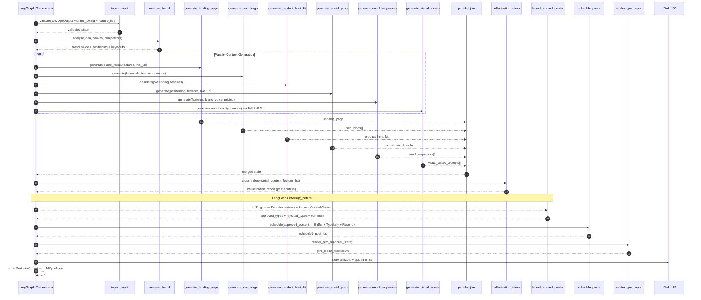

# Pillar 6 — Marketing & Launch Automation: Technical Implementation Plan

> **Owner**: Pallavi Anil Sindkar  
> **Task ID**: AF-044 · **Branch**: `feature/marketing-agent`  
> **Status**: 🟡 Partially startable (offline work)  
> **Date**: 2026-06-02 · **Version**: 1.0.0  
> **Depends on**: AF-036 (BaseAgent), AF-040 (Architect Agent feature list)  
> **SLA**: < 45 minutes end-to-end (excluding async Founder Approval gate)

---

## Table of Contents

1. [Pillar Objective](#1-pillar-objective)
2. [Dependencies](#2-dependencies)
3. [Agent Architecture](#3-agent-architecture)
4. [Workflow Design](#4-workflow-design)
5. [Sub-Agent Recommendations](#5-sub-agent-recommendations)
6. [Tools & Integrations](#6-tools--integrations)
7. [Data Models](#7-data-models)
8. [Development Roadmap](#8-development-roadmap)
9. [Testing Strategy](#9-testing-strategy)
10. [Deliverables](#10-deliverables)

---

## 1. Pillar Objective

### 1.1 What Pillar 6 Achieves

Pillar 6 is the **Go-To-Market (GTM) automation engine** of the Auto-Founder AI pipeline. It receives a deployed, live product (with a URL, brand configuration, and validated feature list) and autonomously produces a complete launch package — then schedules it for publication after explicit Founder approval.

**Core mission**: Transform a deployed MVP into a market-ready product with professional marketing collateral, SEO content, social presence, email campaigns, and launch assets — all fact-checked against the actual product capabilities to prevent hallucinated marketing claims.

### 1.2 Specific Outputs Produced

| Output Category | Deliverable | Volume |
|---|---|---|
| **Brand Identity** | Logo prompt + generation (DALL-E 3), OG image, social card, email header banner | 4 visual assets |
| **Landing Page** | Full conversion-optimized copy (hero, features, social proof, pricing, FAQ, CTA) with meta tags | 6 sections |
| **SEO Content** | Long-form keyword-targeted blog drafts | 3–5 articles (1,500–2,500 words each) |
| **Product Hunt Kit** | Tagline, description, first comment, maker note, gallery captions, topics, launch day | 1 complete kit |
| **Social Media Posts** | X/Twitter thread (4–6 tweets), LinkedIn long-form post, HackerNews "Show HN" post | 3 platform-native posts |
| **Email Sequences** | Onboarding drip (5 emails: Day 0, 1, 3, 7, 14), Reactivation drip (3 emails) | 8 emails total |
| **GTM Report** | Consolidated Markdown report with approval status, scheduled post IDs, hallucination audit | 1 report |

### 1.3 Inputs Received from Previous Pillars

| Source Pillar | Data Consumed | Required / Optional | Used For |
|---|---|---|---|
| **Pillar 1** — Strategy & Ideation (AF-037) | `idea_normalised`, `lean_canvas_json`, `viability_band`, personas, competitor names | **Required** | Brand positioning, audience targeting, competitive differentiation |
| **Pillar 2** — Architecture & Tech Stack (AF-040) | `FeatureList` (features[], integrations[], pricing_tiers[]) | **Required (critical)** | Hallucination cross-reference guard — every marketing claim must be grounded in this list |
| **Pillar 2** — Architecture & Tech Stack (AF-040) | `domain`, stack selection details | **Required** | SEO keyword strategy, technical positioning |
| **Pillar 5** — Deployment & Infrastructure (AF-043) | `live_url`, deploy status, DNS records | **Required** | CTA links, landing page URLs, social post links |
| **Pillar 3** — Code Generation (AF-041) | Repository URL, README | Optional | Technical blog content, GitHub links in launch posts |
| **Pillar 7** — LLMOps (AF-045) | Marketing content tuning feedback (post-launch) | Optional (feedback loop) | Iterative copy improvement based on engagement metrics |

### 1.4 Outputs Produced for Downstream Consumers

| Consumer | Data Emitted | Format |
|---|---|---|
| **LLMOps Agent** (Pillar 7) | `MarketerOutput` protobuf with S3 URIs, token counts, hallucination audit results | gRPC / Protocol Buffers |
| **Founder Portal** (Frontend AF-059) | All draft content for Launch Control Center HITL review | JSON via REST API + Supabase Realtime |
| **Mobile App** (AF-068/069) | Launch preview artifacts for mobile gate approval | REST API |
| **UDAL** — Artifacts table | All generated assets stored as run artifacts | `tenant_uuid.artifacts` + S3 |
| **Observability** | LangSmith traces, Prometheus metrics, structured logs | OTel spans + CloudWatch |

---

## 2. Dependencies

### 2.1 Mandatory Dependencies (Hard Blockers)

These must be completed before Pillar 6 can operate in production:

| Dependency | Task ID | Owner | Why It's Mandatory | Current Status |
|---|---|---|---|---|
| **BaseAgent ABC** | AF-036 | Asit / shared | Pillar 6's `MarketingAgent` must subclass `BaseAgent` with `understand()`, `plan()`, `execute()`, `verify()`, `learn()` lifecycle methods | 🔴 Blocked |
| **UDAL (Unified Data Access Layer)** | AF-027 | Asit | All data reads/writes must go through UDAL — no direct DB access from agents | 🔴 Blocked |
| **FastAPI App Bootstrap** | AF-028 | Asit | REST API endpoints needed for HITL gate interactions and artifact retrieval | 🔴 Blocked |
| **Architect Agent Feature List** | AF-040 | Kaushlendra | The canonical `FeatureList` is the ground truth for the hallucination cross-reference check — without it, we cannot validate marketing claims | 🟡 Offline work started |
| **Tool Registry (shell)** | AF-047 | Asit (shell) | Marketing tools (DALL-E 3, Buffer, Typefully, Resend, Tavily, Ahrefs) must be registered | 🟡 Offline work started |
| **LLM Router** | AF-049 | Purnima | Task-class → model routing for content generation (Gemini 3.5 Flash) | 🟡 Offline work started |

### 2.2 Soft Dependencies (Optional but Beneficial)

| Dependency | Task ID | Owner | Fallback If Unavailable |
|---|---|---|---|
| **Strategy Agent output** | AF-037 | Somesh | Use `idea_normalised` + mock Lean Canvas; derive personas from idea text via LLM |
| **Deployed live URL** | AF-043 | Prasenjit | Use placeholder URL (`https://app.example.com`); marketing copy still generated, CTA links marked `[PENDING_DEPLOY]` |
| **Prompt Registry** | AF-048 | Purnima | Load Jinja2 templates directly from filesystem (`prompts/templates/marketing/`); bypass versioned registry |
| **Guardrails Pipeline** | AF-046 | Unassigned | Use built-in hallucination check node instead of platform-wide guardrails; add PII regex check locally |
| **Redis** | AF-032 | Asit | Use in-memory caching with TTL dict; degrade approval polling to Postgres-based instead of Redis HGETALL |

### 2.3 Fallback Behavior Matrix

```
┌─────────────────────────────────┬──────────────────────────────────────────────┐
│ Missing Input                    │ Fallback Strategy                            │
├─────────────────────────────────┼──────────────────────────────────────────────┤
│ live_url                        │ Generate all copy with placeholder URL;      │
│                                  │ mark assets as "pre-deployment drafts"       │
├─────────────────────────────────┼──────────────────────────────────────────────┤
│ feature_list                    │ FATAL — refuse to generate marketing copy    │
│                                  │ without feature list (hallucination risk)    │
├─────────────────────────────────┼──────────────────────────────────────────────┤
│ lean_canvas_json                │ Derive positioning from idea_normalised +    │
│                                  │ LLM inference; log warning for review        │
├─────────────────────────────────┼──────────────────────────────────────────────┤
│ brand_config (colors, tone)     │ Auto-generate brand identity using LLM       │
│                                  │ based on domain + idea; default tone =       │
│                                  │ "professional"                               │
├─────────────────────────────────┼──────────────────────────────────────────────┤
│ DALL-E 3 API unavailable        │ Return prompts only (generated_url = null);  │
│                                  │ non-fatal — pipeline continues               │
├─────────────────────────────────┼──────────────────────────────────────────────┤
│ Buffer / Typefully API down     │ Cross-fallback between platforms; if both     │
│                                  │ fail, mark posts as "draft" for manual post  │
├─────────────────────────────────┼──────────────────────────────────────────────┤
│ Resend API unavailable          │ Queue emails for retry; fallback to          │
│                                  │ SendGrid if SENDGRID_API_KEY configured      │
├─────────────────────────────────┼──────────────────────────────────────────────┤
│ Ahrefs API exhausted (500/day)  │ Use Tavily keyword search as fallback        │
│                                  │ with reduced keyword volume data             │
├─────────────────────────────────┼──────────────────────────────────────────────┤
│ Founder approval timeout        │ After 30 min: Slack + email alert;           │
│                                  │ mark run as TIMED_OUT; content preserved     │
│                                  │ for 24h for delayed approval                 │
└─────────────────────────────────┴──────────────────────────────────────────────┘
```

### 2.4 Dependency Chain Visualization

```
Phase 1 ✅ DONE
   │
   ▼
Asit ──► AF-027 UDAL ──► AF-028 FastAPI ──► AF-036 BaseAgent
                                                    │
                              ┌─────────────────────┤
                              ▼                     ▼
               Kaushlendra AF-040             Purnima AF-048/049
               (Architect Agent)              (Prompt Reg / Router)
               feature_list output                  │
                       │                            │
                       ▼                            ▼
              ┌────────────────────────────────────────┐
              │   PALLAVI — AF-044 Marketing Agent     │
              │   Subclasses BaseAgent                 │
              │   Reads feature_list via UDAL          │
              │   Uses Prompt Registry for templates   │
              │   Routes LLM calls via LiteLLM         │
              └────────────────────────────────────────┘
                       │
                       ▼
              AF-059 Launch Control Center (Raunak — Frontend)
              AF-068 Mobile Gate Approval (Yogesh — Mobile)
```

---

## 3. Agent Architecture

### 3.1 Design Philosophy

Pillar 6 uses a **single orchestrating agent** (`MarketingAgent`) built as a LangGraph `StateGraph` with **13 specialized nodes**. This is a deliberate choice over multiple independent sub-agents because:

1. **Shared state**: All marketing nodes need the same brand voice, positioning statement, and feature list — a single graph state avoids redundant data passing.
2. **Parallel execution**: Six content generation nodes run concurrently after brand analysis, maximizing throughput.
3. **Hallucination guard**: A centralized post-join node can cross-reference ALL generated content against the feature list in one pass.
4. **HITL atomicity**: The Founder reviews all content types in a single Launch Control Center session.

### 3.2 MarketingAgent Class

```python
# backend/src/autofounder_ai/agents/marketing/agent.py

from autofounder_ai.agents.base import BaseAgent
from autofounder_ai.agents.marketing.graph import build_marketer_graph
from autofounder_ai.agents.marketing.schema import MarketerState
from autofounder_ai.core.udal import UDALClient


class MarketingAgent(BaseAgent[MarketerState, MarketerState]):
    """
    Pillar 6 — Marketing & Launch Automation.

    Receives DevOps output (live_url + brand_config + feature_list) and
    produces a complete GTM launch package:
    - Brand visual assets (DALL-E 3)
    - Landing page copy
    - SEO blog drafts
    - Product Hunt launch kit
    - Social media posts (X, LinkedIn, HN)
    - Email drip sequences
    - GTM report

    All content is hallucination-checked against the Architect Agent's
    canonical feature list before reaching the Launch Control Center
    (HITL approval gate).
    """

    PILLAR = 6
    AGENT_ID = "marketing"
    SLA_SECONDS = 2700  # 45 minutes excluding HITL gate

    async def understand(self, input_state: MarketerState) -> dict:
        """Validate inputs: live_url, feature_list, brand_config."""
        ...

    async def plan(self, intent: dict) -> dict:
        """Build execution DAG — sequential brand analysis, then parallel
        content generation, then hallucination check, then HITL gate."""
        ...

    async def execute(self, plan: dict) -> MarketerState:
        """Run the LangGraph StateGraph with checkpointing."""
        graph = build_marketer_graph(self.checkpointer)
        return await graph.ainvoke(self.state)

    async def verify(self, output: MarketerState) -> dict:
        """Check hallucination report passed, at least one content type approved."""
        ...

    async def learn(self, trace: dict) -> None:
        """Emit run telemetry to LLMOps Agent for RLHF + prompt optimization."""
        ...
```

### 3.3 Internal Node Architecture

The Marketing Agent contains 13 nodes organized in a sequential → parallel → sequential pipeline:

```
┌──────────────────────────────────────────────────────────────────────┐
│                    MarketingAgent (LangGraph StateGraph)            │
│                                                                     │
│  ┌─────────────┐   ┌─────────────┐                                 │
│  │ ingest_input│──►│analyse_brand│                                 │
│  └─────────────┘   └──────┬──────┘                                 │
│                           │                                         │
│              ┌────────────┼────────────────────┐                    │
│              ▼            ▼            ▼       ▼                    │
│  ┌──────────────┐ ┌────────────┐ ┌─────────┐ ┌──────────────┐     │
│  │landing_page  │ │seo_blogs   │ │PH_kit   │ │social_posts  │     │
│  └──────┬───────┘ └─────┬──────┘ └────┬────┘ └──────┬───────┘     │
│         │               │             │             │               │
│         │  ┌────────────┘     ┌───────┘             │               │
│         │  │  ┌───────────────┘                     │               │
│         ▼  ▼  ▼                                     ▼               │
│  ┌──────────────┐                          ┌──────────────┐        │
│  │email_sequences│                          │visual_assets │        │
│  └──────┬───────┘                          └──────┬───────┘        │
│         │                                         │                 │
│         └──────────────┬──────────────────────────┘                 │
│                        ▼                                            │
│              ┌──────────────────┐                                   │
│              │  parallel_join   │ (barrier — waits for all 6)       │
│              └────────┬─────────┘                                   │
│                       ▼                                             │
│          ┌──────────────────────┐                                   │
│          │ hallucination_check  │ (max 2 auto-correction retries)   │
│          └────────┬─────────────┘                                   │
│                   ▼                                                  │
│     ┌───────────────────────────┐                                   │
│     │ launch_control_center     │ (HITL gate — 30 min timeout)      │
│     └────────────┬──────────────┘                                   │
│                  ▼                                                   │
│         ┌────────────────┐                                          │
│         │ schedule_posts │ (Buffer / Typefully / Resend)            │
│         └───────┬────────┘                                          │
│                 ▼                                                    │
│        ┌─────────────────┐                                          │
│        │render_gtm_report│                                          │
│        └────────┬────────┘                                          │
│                 ▼                                                    │
│              [END] ──► LLMOps Agent (Pillar 7)                     │
│                                                                     │
│  ┌─────────────────┐                                                │
│  │  error_handler  │ (central error sink — Slack alerts)            │
│  └─────────────────┘                                                │
└──────────────────────────────────────────────────────────────────────┘
```

### 3.4 Node Responsibilities & I/O Contracts

| # | Node | Responsibility | Input (from state) | Output (state update) | LLM Model | Target SLA |
|---|---|---|---|---|---|---|
| 1 | `ingest_input` | Validate DevOps output, brand config, feature list. Reject if `feature_list` is missing. | `live_url`, `brand_config`, `feature_list`, `lean_canvas_json` | Validated state fields; `fatal_error` if validation fails | — (no LLM) | < 15 s |
| 2 | `analyse_brand` | Derive brand voice summary, positioning statement, SEO keyword targets | `idea_normalised`, `brand_config`, `feature_list`, `lean_canvas_json` | `brand_voice_summary`, `positioning_statement`, `seo_keyword_targets[]` | Gemini 3.5 Flash | < 2 min |
| 3 | `generate_landing_page` | Full landing page copy: hero, features, social proof, pricing, FAQ, CTA footer | `brand_voice_summary`, `positioning_statement`, `feature_list`, `live_url` | `landing_page: LandingPageCopy` | Gemini 3.5 Flash | < 5 min |
| 4 | `generate_seo_blogs` | 3–5 keyword-targeted long-form blog articles | `seo_keyword_targets`, `feature_list`, `brand_voice_summary`, `domain` | `seo_blogs: list[SEOBlogDraft]` | Gemini 3.5 Flash | < 8 min |
| 5 | `generate_product_hunt_kit` | Tagline, description, first comment, maker note, gallery captions | `positioning_statement`, `feature_list`, `brand_voice_summary` | `product_hunt_kit: ProductHuntKit` | Gemini 3.5 Flash | < 4 min |
| 6 | `generate_social_posts` | Platform-native posts for X (thread), LinkedIn (long-form), HN (Show HN) | `positioning_statement`, `feature_list`, `live_url` | `social_post_bundle: SocialPostBundle` | Gemini 3.5 Flash | < 4 min |
| 7 | `generate_email_sequences` | Onboarding (5 emails) + reactivation (3 emails) drip sequences | `feature_list`, `brand_voice_summary`, `live_url`, pricing tiers | `email_sequences: list[EmailSequence]` | Gemini 3.5 Flash | < 5 min |
| 8 | `generate_visual_assets` | DALL-E 3 prompts + image generation for OG image, social card, PH gallery, email banner | `brand_config`, `domain`, `product_name` | `visual_asset_prompts: list[VisualAssetPrompt]` | DALL-E 3 | < 3 min |
| 9 | `parallel_join` | Barrier node — waits for nodes 3–8 to complete; validates critical outputs exist | All parallel outputs | Merged state; error if > 1 critical output missing | — | — |
| 10 | `hallucination_check` | Cross-reference ALL generated copy against canonical `FeatureList`; flag critical/warning claims | All content fields + `feature_list` | `hallucination_report: HallucinationReport` | Gemini 3.5 Flash | < 3 min |
| 11 | `launch_control_center` | HITL gate — poll Redis for Founder's approval/rejection per content type | `approval_status`, `run_id` | `approval_status`, `approved_content_types[]`, `rejected_content_types[]` | — | 30 min timeout |
| 12 | `schedule_posts` | Push approved content to Buffer (LinkedIn), Typefully (X), Resend (email) | `approved_content_types`, social/email content | `scheduled_post_ids: dict[str, str]` | — | < 2 min |
| 13 | `render_gtm_report` | Assemble final GTM report in Markdown; include LLMOps handoff JSON block | All state fields | `gtm_report_markdown: str` | Gemini 3.5 Flash | < 2 min |
| E | `error_handler` | Central error sink — distinguishes fatal/soft errors; Slack alerts | Error context from any node | `fatal_error: str`, `is_complete: False` | — | — |

---

## 4. Workflow Design

### 4.1 End-to-End Workflow (Text Diagram)

```
Step 1: ORCHESTRATOR dispatches marketing step
        └─► MarketingAgent.execute(MarketerState) is invoked

Step 2: INGEST & VALIDATE (sequential)
        ├─► Validate live_url is present (or use placeholder)
        ├─► Validate feature_list.features has ≥ 1 entry (FATAL if empty)
        ├─► Validate brand_config has product_name
        └─► If validation fails → error_handler → END

Step 3: BRAND ANALYSIS (sequential)
        ├─► Call Tavily Search: "brand positioning {domain}"
        ├─► Call Ahrefs Keywords: "{domain} {idea}" → keyword volumes
        ├─► LLM call (Gemini 3.5 Flash): analyse_brand prompt
        │   └─► Returns: brand_voice_summary, positioning_statement, seo_keyword_targets[]
        └─► If brand analysis fails → error_handler → END

Step 4: PARALLEL CONTENT GENERATION (fan-out — 6 branches)
        ├─► Branch A: generate_landing_page (Gemini + Tavily for best practices)
        ├─► Branch B: generate_seo_blogs (Gemini + Ahrefs for keyword data)
        ├─► Branch C: generate_product_hunt_kit (Gemini + Tavily for PH benchmarks)
        ├─► Branch D: generate_social_posts (Gemini — platform-native copy)
        ├─► Branch E: generate_email_sequences (Gemini — drip campaigns)
        └─► Branch F: generate_visual_assets (DALL-E 3 — 4 brand visuals)
        
        All 6 branches run concurrently → converge at parallel_join barrier

Step 5: PARALLEL JOIN (barrier)
        ├─► Verify all 6 branches completed (or soft-failed gracefully)
        ├─► If > 1 critical output is null → error_handler
        └─► Merge all outputs into unified state

Step 6: HALLUCINATION CHECK (sequential, max 2 auto-correction retries)
        ├─► LLM call: cross-reference ALL marketing claims against feature_list
        ├─► Classify findings as NONE / WARNING / CRITICAL
        ├─► If critical_count == 0 → passed = true → proceed
        ├─► If critical_count > 0 AND retry_count < 2:
        │   └─► Auto-correct: re-prompt with critical findings → re-check
        └─► If retries exhausted AND critical_count > 0 → error_handler

Step 7: LAUNCH CONTROL CENTER (HITL gate — async)
        ├─► LangGraph interrupt_before fires → API sends SSE to Founder Portal
        ├─► Founder sees all drafts in Launch Control Center UI (AF-059)
        ├─► Founder can: APPROVE ALL, REJECT ALL, or PARTIAL APPROVE
        │   ├─► Partial: approved_types = ["landing_page", "social", "email"]
        │   │            rejected_types = ["seo_blogs", "product_hunt_kit"]
        │   └─► Rejection comment stored for RLHF training signal
        ├─► Poll Redis every 60s for decision (approval:{run_id} hash)
        └─► If 30 min timeout → Slack + email alert → TIMED_OUT → error_handler

Step 8: SCHEDULE POSTS (sequential — approved content only)
        ├─► X thread → Typefully API (schedule for launch day)
        ├─► LinkedIn post → Buffer API (schedule for launch day)
        ├─► Email sequences → Resend API (onboarding triggered on signup)
        ├─► Product Hunt → Assets prepared; manual post (PH has no scheduling API)
        └─► If scheduling fails → mark as "draft"; non-fatal

Step 9: RENDER GTM REPORT (sequential)
        ├─► Assemble Markdown report with 10 sections
        ├─► Include machine-readable JSON block for LLMOps Agent
        └─► Upload to S3: s3://autofounder-artefacts/{tenant_id}/{run_id}/gtm-report.md

Step 10: EMIT OUTPUT & COMPLETE
         ├─► Store all artifacts in UDAL (tenant_uuid.artifacts table)
         ├─► Emit MarketerOutput protobuf to LLMOps Agent via gRPC
         ├─► Emit pillar.completed{6} to EventBridge
         └─► MarketingAgent.learn(trace) → LangSmith telemetry
```

### 4.2 Agent Orchestration Sequence (Mermaid)



### 4.3 Data Passed Between Nodes

```
ingest_input
    │ live_url, idea_normalised, domain, viability_band, 
    │ lean_canvas_json, brand_config, feature_list
    ▼
analyse_brand
    │ + brand_voice_summary (str)
    │ + positioning_statement (str)
    │ + seo_keyword_targets (list[str])
    ▼
[fan-out to 6 parallel branches]
    │ All branches read: brand_voice_summary, positioning_statement,
    │                    feature_list, live_url, seo_keyword_targets
    │
    ├── generate_landing_page  → + landing_page (LandingPageCopy)
    ├── generate_seo_blogs     → + seo_blogs (list[SEOBlogDraft])
    ├── generate_product_hunt_kit → + product_hunt_kit (ProductHuntKit)
    ├── generate_social_posts  → + social_post_bundle (SocialPostBundle)
    ├── generate_email_sequences → + email_sequences (list[EmailSequence])
    └── generate_visual_assets → + visual_asset_prompts (list[VisualAssetPrompt])
    │
    ▼
parallel_join (merges all)
    │
    ▼
hallucination_check
    │ Reads: landing_page, seo_blogs, product_hunt_kit, 
    │        social_post_bundle, email_sequences, feature_list
    │ + hallucination_report (HallucinationReport)
    ▼
launch_control_center
    │ + approval_status (ApprovalStatus)
    │ + approved_content_types (list[str])
    │ + rejected_content_types (list[str])
    │ + approval_comment (str | None)
    ▼
schedule_posts
    │ Reads: approved_content_types, social/email content
    │ + scheduled_post_ids (dict[str, str])
    ▼
render_gtm_report
    │ Reads: all state fields
    │ + gtm_report_markdown (str)
    ▼
[END] → MarketerOutput protobuf → LLMOps Agent
```

---

## 5. Sub-Agent Recommendations

### 5.1 Evaluation Matrix

Below is the analysis of each proposed sub-agent — whether it should exist as a separate agent, be a node within the Marketing Agent graph, or be deferred:

| Proposed Sub-Agent | Recommendation | Rationale |
|---|---|---|
| **Marketing Strategy Agent** | ❌ **Not separate** — absorbed into `analyse_brand` node | Strategy is already handled by Pillar 1. The marketing agent only needs brand-specific analysis (voice, positioning, keywords) which is a single LLM call, not an agent. |
| **ICP / Audience Agent** | ❌ **Not separate** — data comes from Pillar 1 | ICPs (Ideal Customer Profiles) are generated by the Strategy Agent (AF-037). Marketing consumes them from the Lean Canvas. No separate agent needed. |
| **Positioning & Messaging Agent** | ✅ **Node** → `analyse_brand` | This is the `analyse_brand` node. It generates the positioning statement, brand voice, and keyword strategy that feeds all downstream content nodes. |
| **Landing Page Copy Agent** | ✅ **Node** → `generate_landing_page` | Generates full landing page with meta tags, hero, features, social proof, pricing, FAQ, CTA. Runs in parallel with other content nodes. |
| **SEO Content Agent** | ✅ **Node** → `generate_seo_blogs` | Generates 3–5 keyword-targeted blog drafts. Uses Ahrefs keyword data and Tavily research. Runs in parallel. |
| **Blog Generation Agent** | ❌ **Merged with SEO Content** | Blog generation is inseparable from SEO strategy — same node handles both keyword research and content writing. |
| **Social Media Agent** | ✅ **Node** → `generate_social_posts` | Generates platform-native posts (X thread, LinkedIn, HN). Each platform has distinct format constraints. Runs in parallel. |
| **Email Campaign Agent** | ✅ **Node** → `generate_email_sequences` | Generates onboarding (5 emails) + reactivation (3 emails) drip sequences with HTML + plain text variants. Runs in parallel. |
| **Product Hunt Launch Agent** | ✅ **Node** → `generate_product_hunt_kit` | Generates PH-specific copy (tagline ≤60 chars, description ≤260, first comment, maker note, gallery captions). Runs in parallel. |
| **Press Release Agent** | 🔶 **Deferred to Phase 2** | Press releases are lower priority than core launch assets. Can be added as an additional parallel branch later. |
| **Analytics & Tracking Agent** | 🔶 **Deferred to Phase 3** | Post-launch analytics (UTM tracking, conversion funnels, engagement metrics) requires live data. Not needed for MVP. |

### 5.2 Final Node Architecture (Recommended)

**Phase 1 (MVP) — 13 nodes:**
1. `ingest_input` — validation
2. `analyse_brand` — positioning & messaging
3. `generate_landing_page` — conversion copy
4. `generate_seo_blogs` — SEO + blog content
5. `generate_product_hunt_kit` — PH launch assets
6. `generate_social_posts` — X, LinkedIn, HN
7. `generate_email_sequences` — drip campaigns
8. `generate_visual_assets` — DALL-E 3 brand visuals
9. `parallel_join` — barrier
10. `hallucination_check` — feature cross-reference
11. `launch_control_center` — HITL approval
12. `schedule_posts` — publish via APIs
13. `render_gtm_report` — final report

**Phase 2 additions:**
- `generate_press_release` — press/media outreach copy
- `generate_reddit_posts` — subreddit-specific launch posts
- `generate_pitch_deck_copy` — investor-facing summary from GTM data

**Phase 3 additions:**
- `analytics_setup` — UTM parameter generation, GA4 event schema
- `ab_test_variants` — alternative headlines/CTAs for landing page A/B testing
- `engagement_tracker` — post-launch engagement monitoring and reporting

---

## 6. Tools & Integrations

### 6.1 Per-Node Tool Registry

| Node | Tool | API / Service | Purpose | Env Variable |
|---|---|---|---|---|
| `analyse_brand` | Tavily Search | `api.tavily.com` | Competitor brand research, positioning benchmarks | `TAVILY_API_KEY` |
| `analyse_brand` | Ahrefs Keywords | `apiv2.ahrefs.com` | SEO keyword volume, difficulty, CPC data | `AHREFS_API_KEY` |
| `generate_landing_page` | Tavily Search | `api.tavily.com` | Landing page best practices, conversion patterns | `TAVILY_API_KEY` |
| `generate_seo_blogs` | Ahrefs Keywords | `apiv2.ahrefs.com` | Per-blog keyword targeting | `AHREFS_API_KEY` |
| `generate_seo_blogs` | Tavily Search | `api.tavily.com` | Topic research, competitor content gap analysis | `TAVILY_API_KEY` |
| `generate_product_hunt_kit` | Tavily Search | `api.tavily.com` | Top PH launch benchmarks in domain | `TAVILY_API_KEY` |
| `generate_visual_assets` | DALL-E 3 | `api.openai.com` | Brand visual generation (OG image, social card, PH gallery, email header) | `OPENAI_API_KEY` |
| `schedule_posts` | Buffer | `api.bufferapp.com` | LinkedIn post scheduling | `BUFFER_ACCESS_TOKEN` |
| `schedule_posts` | Typefully | `api.typefully.com` | X/Twitter thread scheduling | `TYPEFULLY_API_KEY` |
| `schedule_posts` | Resend | `api.resend.com` | Email broadcast / drip sequence delivery | `RESEND_API_KEY` |
| `launch_control_center` | Redis | ElastiCache | Approval polling (`marketer:approval:{run_id}`) | `REDIS_URL` |
| `render_gtm_report` | S3 | AWS S3 | GTM report + asset uploads | `AWS_S3_ARTIFACTS_BUCKET` |
| `error_handler` | Slack Webhook | Slack API | Error / timeout / escalation alerts | `SLACK_WEBHOOK_MARKETER` |

### 6.2 LLM Requirements

| Node | Model | Provider | Reason | Est. Tokens/Call |
|---|---|---|---|---|
| `analyse_brand` | Gemini 3.5 Flash | Google AI via LiteLLM | Brand analysis requires reasoning + structured output | ~2,000 in / ~800 out |
| `generate_landing_page` | Gemini 3.5 Flash | Google AI via LiteLLM | Long-form conversion copywriting | ~1,500 in / ~3,000 out |
| `generate_seo_blogs` | Gemini 3.5 Flash | Google AI via LiteLLM | 3 × 2,000-word articles | ~2,000 in / ~15,000 out |
| `generate_product_hunt_kit` | Gemini 3.5 Flash | Google AI via LiteLLM | Concise, constraint-adherent copy | ~1,000 in / ~1,500 out |
| `generate_social_posts` | Gemini 3.5 Flash | Google AI via LiteLLM | Platform-native formatting | ~1,000 in / ~2,000 out |
| `generate_email_sequences` | Gemini 3.5 Flash | Google AI via LiteLLM | HTML + plain text email bodies | ~1,500 in / ~8,000 out |
| `generate_visual_assets` | DALL-E 3 | OpenAI | Image generation (4 assets) | 4 × image generation calls |
| `hallucination_check` | Gemini 3.5 Flash | Google AI via LiteLLM | Strict factual cross-referencing | ~5,000 in / ~500 out |
| `render_gtm_report` | Gemini 3.5 Flash | Google AI via LiteLLM | Report assembly | ~3,000 in / ~2,000 out |

**Estimated total per run**: ~18,000 input tokens + ~32,800 output tokens + 4 DALL-E 3 images

### 6.3 External Service Rate Limits & Fallbacks

| Service | Rate Limit | Timeout | Retry Policy | Fallback |
|---|---|---|---|---|
| Tavily Search | 60 req/min | 20 s | 3 retries, exponential backoff (5s → 15s → 45s) | Skip — LLM uses training knowledge |
| Ahrefs Keywords | 500 req/day | 20 s | 3 retries | Tavily keyword data (reduced volume info) |
| DALL-E 3 | 5 img/min (tier) | 60 s | 3 retries | Return prompt only (`generated_url = null`); non-fatal |
| Buffer | 10 req/s | 15 s | 3 retries | Typefully for X; log failure for LinkedIn |
| Typefully | 10 req/s | 15 s | 3 retries | Buffer as fallback for X |
| Resend | 10 req/s | 15 s | 3 retries | SendGrid via `SENDGRID_API_KEY` env override |
| Gemini 3.5 Flash | 1,000 RPM | 30 s | 3 retries, 45s gaps | Hard fail → error_handler |

### 6.4 Database & Storage Requirements

| Store | Usage | Path / Key Pattern |
|---|---|---|
| **PostgreSQL** (via UDAL `.relational()`) | Run state, artifacts metadata, gate decisions, step events, cost ledger | `tenant_uuid.artifacts`, `tenant_uuid.runs`, `tenant_uuid.gates` |
| **Supabase pgvector** (via UDAL `.vector()`) | Brand voice examples, marketing copy embeddings for future RAG | `brand_voice_examples` namespace (768-dim HNSW) |
| **Redis** (via UDAL cache) | Approval polling, prompt cache, session state | `marketer:approval:{run_id}`, `agent:session:{run_id}:marketing` |
| **S3** (via UDAL `.object()`) | GTM report, landing page JSON, SEO blogs JSON, email sequences JSON, visual assets, PH kit | `s3://autofounder-artefacts/{tenant_id}/{run_id}/` prefix |

---

## 7. Data Models

### 7.1 Product Metadata (Input)

```python
class BrandConfig(BaseModel):
    """Brand configuration supplied by Founder or derived from idea."""
    product_name: str                          # e.g., "ShipFast"
    tagline: str | None           = None       # e.g., "Ship your SaaS in days, not months"
    primary_color_hex: str | None = None       # e.g., "#4F46E5"
    secondary_color_hex: str | None = None     # e.g., "#10B981"
    logo_url: str | None          = None       # existing logo URL if any
    tone: BrandTone               = BrandTone.PROFESSIONAL  # professional|casual|playful|technical|inspirational
    target_audience: str | None   = None       # e.g., "Indie hackers and solo founders"
    usp: str | None               = None       # Unique Selling Proposition
    competitor_names: list[str]   = []         # e.g., ["Vercel", "Railway"]


class FeatureList(BaseModel):
    """Canonical feature list from Architect Agent — ground truth for hallucination guard."""
    features: list[str]                        # e.g., ["OAuth2 authentication", "Stripe billing"]
    integrations: list[str]       = []         # e.g., ["Slack", "GitHub", "Zapier"]
    pricing_tiers: list[dict[str, Any]] = []   # e.g., [{"name": "Free", "price": "$0"}]
```

### 7.2 Audience Profile (Derived)

```python
class AudienceProfile(BaseModel):
    """Derived from Pillar 1 personas + brand analysis."""
    primary_icp: str                           # "Technical founders building B2B SaaS"
    pain_points: list[str]                     # ["Slow iteration cycles", "High dev costs"]
    buying_triggers: list[str]                 # ["Launched MVP", "Seeking first 100 users"]
    preferred_channels: list[SocialChannel]    # [SocialChannel.X, SocialChannel.LINKEDIN]
    content_preferences: list[str]             # ["Technical deep-dives", "Case studies"]
    seo_intent_keywords: list[str]             # ["best saas builder", "no-code platform"]
```

### 7.3 Campaign Plan (Unified Output)

```python
class CampaignPlan(BaseModel):
    """Top-level marketing campaign plan — aggregates all content types."""
    run_id: UUID
    tenant_id: str
    product_name: str
    live_url: str
    domain: str

    # Brand Foundation
    brand_voice_summary: str
    positioning_statement: str
    seo_keyword_targets: list[str]

    # Content Assets
    landing_page: LandingPageCopy
    seo_blogs: list[SEOBlogDraft]
    product_hunt_kit: ProductHuntKit
    social_post_bundle: SocialPostBundle
    email_sequences: list[EmailSequence]
    visual_assets: list[VisualAssetPrompt]

    # Quality Assurance
    hallucination_report: HallucinationReport

    # Approval & Scheduling
    approval_status: ApprovalStatus
    approved_content_types: list[str]
    rejected_content_types: list[str]
    scheduled_post_ids: dict[str, str]

    # Final Report
    gtm_report_markdown: str
```

### 7.4 Social Post Schema

```python
class SocialPost(BaseModel):
    channel: SocialChannel                     # x | linkedin | hackernews | reddit
    content: str                               # Platform-native text
    hashtags: list[str]           = []         # ["#SaaS", "#BuildInPublic"]
    media_prompt: str | None      = None       # DALL-E 3 prompt if image needed
    scheduled_at: datetime | None = None       # ISO 8601 schedule time
    buffer_post_id: str | None    = None       # External scheduler ID
    status: ContentStatus         = ContentStatus.DRAFT  # draft|approved|scheduled|posted


class SocialPostBundle(BaseModel):
    launch_thread_x: list[SocialPost]       = []    # 4–6 tweet thread
    launch_post_linkedin: SocialPost | None = None   # Single long-form post
    launch_post_hn: SocialPost | None       = None   # Show HN post
```

### 7.5 SEO Article Schema

```python
class SEOBlogDraft(BaseModel):
    title: str                                 # "How to Build a SaaS MVP in 7 Days"
    target_keyword: str                        # "build saas mvp"
    secondary_keywords: list[str]    = []      # ["saas builder", "mvp development"]
    word_count_target: int           = 1500    # 800–4000
    outline: list[str]                         # H2 section headings
    intro: str                                 # ≤ 150 words, hooks reader
    body_markdown: str                         # Full Markdown with H2/H3
    conclusion: str                            # ≤ 100 words, CTA to live_url
    meta_description: str                      # ≤ 160 characters
    internal_link_suggestions: list[str] = []  # Suggested internal links
    status: ContentStatus            = ContentStatus.DRAFT
```

### 7.6 Launch Assets Schema (Comprehensive)

```python
class LaunchAssets(BaseModel):
    """Complete set of launch assets stored per run."""
    run_id: UUID
    tenant_id: str
    created_at: datetime

    # S3 URIs
    gtm_report_s3_uri: str             # s3://.../gtm-report.md
    landing_page_copy_s3_uri: str      # s3://.../landing-page-copy.json
    seo_blogs_s3_uri: str              # s3://.../seo-blogs.json
    email_sequences_s3_uri: str        # s3://.../email-sequences.json
    product_hunt_kit_s3_uri: str       # s3://.../ph-kit.json
    visual_assets_s3_uri: str          # s3://.../visual-assets.json
    social_posts_s3_uri: str           # s3://.../social-posts.json

    # Artifact metadata stored in UDAL
    artifact_records: list[dict] = []  # [{kind: "landing_page", uri: "s3://...", ...}]
```

### 7.7 Database Table: Artifact Records (via UDAL)

```sql
-- tenant_uuid.artifacts (managed by UDAL — agents never write directly)
INSERT INTO tenant_uuid.artifacts (
    id,               -- UUID, auto-generated
    run_id,           -- FK to runs
    kind,             -- 'landing_page' | 'seo_blog' | 'product_hunt_kit' | 'social_posts'
                      -- | 'email_sequence' | 'visual_asset' | 'gtm_report' | 'brand_analysis'
    uri,              -- S3 URI: s3://autofounder-artefacts/{tenant_id}/{run_id}/{kind}.json
    metadata,         -- JSONB: { "content_status": "approved", "word_count": 2400 }
    created_at        -- timestamptz
);
```

---

## 8. Development Roadmap

### Phase 1 — MVP (Weeks 1–3)

**Goal**: Core marketing pipeline works end-to-end with mock data. All content generation nodes produce valid output. Hallucination check catches fabricated claims. HITL gate flows work locally.

| Week | Task | Deliverable | Status |
|---|---|---|---|
| **Week 1** | **Schemas & Prompts** | | |
| | Define all Pydantic V2 schemas in `schema.py` | `MarketerState`, `BrandConfig`, `FeatureList`, `LandingPageCopy`, `SEOBlogDraft`, `ProductHuntKit`, `SocialPostBundle`, `EmailSequence`, `VisualAssetPrompt`, `HallucinationReport` | 🟢 Start now |
| | Write all 9 Jinja2 prompt templates | `analyse_brand.j2`, `generate_landing_page.j2`, `generate_seo_blogs.j2`, `generate_product_hunt_kit.j2`, `generate_social_posts.j2`, `generate_email_sequences.j2`, `generate_visual_assets.j2`, `hallucination_check.j2`, `render_gtm_report.j2` | 🟢 Start now |
| | Build tool wrappers as standalone modules | `tools/tavily.py`, `tools/ahrefs.py`, `tools/dalle.py`, `tools/buffer.py`, `tools/typefully.py`, `tools/resend.py` | 🟢 Start now |
| | Create golden eval datasets | 5 product scenarios with expected outputs (Promptfoo format) | 🟢 Start now |
| **Week 2** | **Graph & Nodes** | | |
| | Build LangGraph StateGraph in `graph.py` | Node registration, conditional edges, parallel fan-out, barrier join | 🟡 Needs BaseAgent |
| | Implement all 13 node functions | `ingest_input`, `analyse_brand`, 6 parallel generators, `parallel_join`, `hallucination_check`, `launch_control_center`, `schedule_posts`, `render_gtm_report`, `error_handler` | 🟡 Needs BaseAgent |
| | Implement router functions | `route_after_ingest`, `route_after_brand`, `route_after_join`, `route_after_hallucination`, `route_after_approval`, `route_after_schedule`, `route_terminal` | 🟡 Needs BaseAgent |
| | Implement retry wrapper + LLM parse correction | `utils/retry.py`, `utils/llm_parse.py` | 🟢 Start now |
| **Week 3** | **Integration & Testing** | | |
| | Implement `MarketingAgent` class subclassing `BaseAgent` | `agent.py` with full lifecycle methods | 🔴 Needs AF-036 |
| | Wire tool wrappers into Tool Registry (AF-047) | Register DALL-E 3, Buffer, Typefully, Resend, Tavily, Ahrefs | 🟡 Needs AF-047 shell |
| | End-to-end test with mock data | Run pipeline with 5 sample products → all outputs generated → hallucination check passes → report rendered | 🟡 Needs AF-028 |
| | Build feature-claim cross-reference validator | Standalone `hallucination_validator.py` that works without platform | 🟢 Start now |

### Phase 2 — Enhanced Automation (Weeks 4–6)

**Goal**: Production-hardened with real API integrations, HITL flow via UI, error recovery, SLA monitoring.

| Week | Task | Deliverable |
|---|---|---|
| **Week 4** | **Real API Integration** | |
| | Connect to real Tavily, Ahrefs APIs | Live keyword data in brand analysis + SEO blogs |
| | Connect to DALL-E 3 | Real image generation with S3 upload |
| | Connect to Buffer + Typefully + Resend | Live post scheduling + email delivery |
| | Implement approval polling via Redis | Real HITL gate with timeout handling |
| **Week 5** | **Frontend Integration** | |
| | Support Launch Control Center UI (AF-059) | REST endpoints for content preview + per-type approval |
| | Support Mobile Gate Approval (AF-068) | Same endpoints, responsive data format |
| | Supabase Realtime SSE for progress updates | `step_events` emission for real-time UI |
| | S3 artifact uploads via UDAL `.object()` | All content stored at tenant-scoped S3 paths |
| **Week 6** | **Hardening** | |
| | SLA enforcement (per-node timeouts) | `utils/sla.py` — 45 min total, per-node limits |
| | Prometheus metrics | `marketer_node_duration_seconds`, `marketer_hallucination_criticals_total`, `marketer_approval_timeout_total` |
| | Slack escalation for errors + timeouts | Structured Slack alerts with run context |
| | Partial approval support | Approved content types scheduled; rejected stored with comments for RLHF |

### Phase 3 — Advanced Growth Features (Weeks 7–10)

**Goal**: Post-launch analytics, A/B testing, additional channels, content optimization loop.

| Week | Task | Deliverable |
|---|---|---|
| **Week 7** | **Additional Content Nodes** | |
| | `generate_press_release` node | PR/media outreach copy (AP style) |
| | `generate_reddit_posts` node | Subreddit-specific launch posts (r/SaaS, r/startups, etc.) |
| | Webflow/Framer landing page export | HTML/CSS export ready for drag-and-drop deployment |
| **Week 8** | **Analytics & Tracking** | |
| | UTM parameter generation | Auto-generate UTM tags for all links across channels |
| | GA4 event schema suggestion | Recommended custom events for the launched product |
| | Post-launch engagement tracker | Poll Buffer/Typefully APIs for engagement metrics |
| **Week 9** | **A/B Testing & Optimization** | |
| | Landing page A/B variants | Generate 2–3 headline/CTA variants for split testing |
| | Email subject line variants | Multiple subject lines per email for A/B sends |
| | LLMOps feedback loop | Consume engagement data → fine-tune marketing prompts |
| **Week 10** | **Advanced Growth** | |
| | Referral program copy generation | Referral landing page + email templates |
| | Community launch kit | Discord/Slack community setup guide + welcome messages |
| | Investor pitch deck copy | One-pager from GTM data for fundraising context |

---

## 9. Testing Strategy

### 9.1 Testing Without the Full Platform

Pillar 6 can be developed and tested **independently** using:

1. **Mock UDAL**: A `MockUDALClient` that stores data in-memory dicts instead of Postgres/S3.
2. **Mock LLM**: A `FakeLLM` that returns pre-built JSON responses matching output schemas.
3. **Mock Tools**: HTTP mocks for Tavily, Ahrefs, DALL-E 3, Buffer, Typefully, Resend using `respx` or `httpx.MockTransport`.
4. **Mock BaseAgent**: A stub `BaseAgent` that provides the lifecycle skeleton without platform dependencies.
5. **Local LangGraph**: LangGraph's `MemorySaver` for checkpointing (no Postgres needed locally).

### 9.2 Test Architecture

```
tests/
├── unit/
│   ├── test_schema_validation.py       # Pydantic schema edge cases
│   ├── test_routers.py                 # Route decision logic
│   ├── test_hallucination_validator.py # Feature cross-reference logic
│   ├── test_llm_parse_correction.py    # JSON self-correction
│   ├── test_retry_wrapper.py           # Exponential backoff
│   └── test_sla_enforcement.py         # Timeout handling
│
├── integration/
│   ├── test_graph_happy_path.py        # Full graph with mock LLM
│   ├── test_graph_hallucination_retry.py # Auto-correction loop
│   ├── test_graph_partial_approval.py  # Partial content approval
│   ├── test_graph_timeout.py           # Approval timeout flow
│   ├── test_graph_tool_failure.py      # DALL-E 3 failure graceful degradation
│   └── test_graph_error_handler.py     # Error sink + Slack alert
│
├── golden/
│   ├── eval_brand_analysis.yaml        # Promptfoo golden set
│   ├── eval_landing_page.yaml          # Expected output structure
│   ├── eval_hallucination_check.yaml   # Known true/false positives
│   └── eval_seo_blogs.yaml             # Keyword targeting accuracy
│
└── fixtures/
    ├── mock_products/
    │   ├── shipfast.json               # Sample product 1
    │   ├── calmhq.json                 # Sample product 2
    │   ├── devpulse.json               # Sample product 3
    │   ├── greenledger.json            # Sample product 4
    │   └── petconnect.json             # Sample product 5
    └── mock_llm_responses/
        ├── brand_analysis_response.json
        ├── landing_page_response.json
        └── hallucination_report.json
```

### 9.3 Five Realistic Sample Products & Test Datasets

#### Product 1: **ShipFast** — SaaS Boilerplate Builder

```json
{
  "idea_normalised": "A platform that generates production-ready SaaS boilerplate code with authentication, payments, and deployment pre-configured",
  "domain": "developer-tools",
  "viability_band": "high",
  "live_url": "https://shipfast.demo.autofounder.ai",
  "brand_config": {
    "product_name": "ShipFast",
    "tagline": "Ship your SaaS in days, not months",
    "primary_color_hex": "#4F46E5",
    "secondary_color_hex": "#10B981",
    "tone": "technical",
    "target_audience": "Indie hackers, solo founders, and small dev teams",
    "usp": "AI-generated production-ready code with zero boilerplate setup",
    "competitor_names": ["create-t3-app", "SaaSBoilerplate.com", "Shipixen"]
  },
  "feature_list": {
    "features": [
      "Next.js 14 + TypeScript boilerplate",
      "Supabase Auth (OAuth + magic link)",
      "Stripe billing integration",
      "Tailwind CSS + shadcn/ui design system",
      "SEO-optimized landing page template",
      "Admin dashboard with RBAC",
      "PostgreSQL database with migrations",
      "CI/CD pipeline (GitHub Actions)",
      "Docker deployment setup",
      "Email notifications via Resend"
    ],
    "integrations": ["Stripe", "Supabase", "GitHub", "Resend", "Vercel"],
    "pricing_tiers": [
      {"name": "Starter", "price": "$0", "features": ["1 project", "Community support"]},
      {"name": "Pro", "price": "$29/mo", "features": ["Unlimited projects", "Priority support", "Custom domains"]},
      {"name": "Team", "price": "$79/mo", "features": ["Everything in Pro", "Team collaboration", "SSO"]}
    ]
  },
  "lean_canvas_json": "{\"problem\": \"Building SaaS from scratch takes months and costs thousands\", \"solution\": \"AI-generated production-ready boilerplate\", \"unique_value_prop\": \"Go from idea to deployed SaaS in under a week\", \"customer_segments\": \"Indie hackers, solo founders, small dev teams\", \"channels\": \"Product Hunt, Twitter/X, Indie Hacker forums\", \"revenue_streams\": \"Subscription plans: Starter/Pro/Team\"}"
}
```

#### Product 2: **CalmHQ** — Employee Wellness Platform

```json
{
  "idea_normalised": "A corporate wellness platform that provides personalized meditation sessions, mental health check-ins, and team wellness analytics for remote teams",
  "domain": "health-wellness",
  "viability_band": "medium-high",
  "live_url": "https://calmhq.demo.autofounder.ai",
  "brand_config": {
    "product_name": "CalmHQ",
    "tagline": "Wellness your team actually uses",
    "primary_color_hex": "#7C3AED",
    "secondary_color_hex": "#F59E0B",
    "tone": "inspirational",
    "target_audience": "HR leaders and people managers at remote-first companies (50-500 employees)",
    "usp": "Personalized wellness that adapts to each employee's needs with team-level insights",
    "competitor_names": ["Calm Business", "Headspace for Work", "Modern Health"]
  },
  "feature_list": {
    "features": [
      "Guided meditation library (200+ sessions)",
      "Daily mood check-in with sentiment tracking",
      "Team wellness dashboard for managers",
      "Anonymous pulse surveys",
      "Slack integration for daily wellness reminders",
      "1-on-1 coaching session booking",
      "Wellness challenge leaderboards",
      "Monthly wellness reports (PDF export)",
      "SSO via SAML 2.0",
      "GDPR-compliant data handling"
    ],
    "integrations": ["Slack", "Microsoft Teams", "Google Calendar", "BambooHR"],
    "pricing_tiers": [
      {"name": "Starter", "price": "$4/user/mo", "features": ["Meditation library", "Mood check-ins"]},
      {"name": "Growth", "price": "$8/user/mo", "features": ["Everything in Starter", "Team dashboard", "Surveys"]},
      {"name": "Enterprise", "price": "Custom", "features": ["Everything in Growth", "SSO", "Dedicated CSM", "API access"]}
    ]
  },
  "lean_canvas_json": "{\"problem\": \"Remote team burnout is rising; existing wellness tools have <10% engagement\", \"solution\": \"Personalized, data-driven wellness platform with team analytics\", \"unique_value_prop\": \"The only wellness platform where engagement exceeds 60%\", \"customer_segments\": \"HR leaders at remote-first companies (50-500 employees)\", \"channels\": \"LinkedIn, HR conferences, BambooHR marketplace\", \"revenue_streams\": \"Per-seat subscription\"}"
}
```

#### Product 3: **DevPulse** — Developer Experience Platform

```json
{
  "idea_normalised": "A developer experience platform that measures engineering team productivity through PR review times, deploy frequency, code quality metrics, and developer satisfaction surveys",
  "domain": "developer-tools",
  "viability_band": "high",
  "live_url": "https://devpulse.demo.autofounder.ai",
  "brand_config": {
    "product_name": "DevPulse",
    "tagline": "Know how your engineering team actually feels",
    "primary_color_hex": "#0EA5E9",
    "secondary_color_hex": "#F97316",
    "tone": "technical",
    "target_audience": "Engineering managers and VPs of Engineering at mid-size companies (100-2000 engineers)",
    "usp": "Combines DORA metrics with developer sentiment — quantitative meets qualitative",
    "competitor_names": ["LinearB", "Jellyfish", "Pluralsight Flow", "DX"]
  },
  "feature_list": {
    "features": [
      "DORA metrics dashboard (deploy frequency, lead time, MTTR, change failure rate)",
      "GitHub + GitLab integration for PR analytics",
      "Weekly developer satisfaction pulse surveys (eNPS)",
      "Code review bottleneck detection",
      "Sprint velocity tracking",
      "Team health heatmaps",
      "Custom metric definitions via SQL",
      "Slack alerts for metric anomalies",
      "CSV / API data export",
      "SOC 2 Type II compliant"
    ],
    "integrations": ["GitHub", "GitLab", "Jira", "Slack", "PagerDuty"],
    "pricing_tiers": [
      {"name": "Team", "price": "$12/dev/mo", "features": ["DORA metrics", "PR analytics", "Surveys"]},
      {"name": "Business", "price": "$24/dev/mo", "features": ["Everything in Team", "Custom metrics", "API access"]},
      {"name": "Enterprise", "price": "Custom", "features": ["Everything in Business", "SSO", "Dedicated support", "SLA"]}
    ]
  },
  "lean_canvas_json": "{\"problem\": \"Engineering leaders lack visibility into developer experience and productivity bottlenecks\", \"solution\": \"Unified platform combining DORA metrics with developer sentiment data\", \"unique_value_prop\": \"The only DevEx platform that correlates engineering metrics with developer happiness\", \"customer_segments\": \"Engineering managers at companies with 100-2000 engineers\", \"channels\": \"Developer conferences, HackerNews, engineering blogs\", \"revenue_streams\": \"Per-developer subscription\"}"
}
```

#### Product 4: **GreenLedger** — Carbon Accounting for SMBs

```json
{
  "idea_normalised": "An automated carbon accounting platform for small and medium businesses that calculates Scope 1, 2, and 3 emissions from financial data and generates compliance-ready ESG reports",
  "domain": "sustainability-fintech",
  "viability_band": "medium",
  "live_url": "https://greenledger.demo.autofounder.ai",
  "brand_config": {
    "product_name": "GreenLedger",
    "tagline": "Carbon accounting that runs itself",
    "primary_color_hex": "#059669",
    "secondary_color_hex": "#1E40AF",
    "tone": "professional",
    "target_audience": "CFOs and sustainability officers at SMBs (50-500 employees) in regulated industries",
    "usp": "Automated Scope 1-3 emissions calculation from existing accounting data — no manual data entry",
    "competitor_names": ["Watershed", "Persefoni", "Sweep", "Greenly"]
  },
  "feature_list": {
    "features": [
      "Automated Scope 1, 2, and 3 emissions calculation",
      "QuickBooks + Xero integration for financial data import",
      "GHG Protocol compliant reporting",
      "CDP and TCFD report generation",
      "Supplier emissions estimation (Scope 3)",
      "Carbon reduction goal tracking",
      "Audit trail for all calculations",
      "Multi-entity consolidation",
      "PDF and Excel report export",
      "Role-based access control"
    ],
    "integrations": ["QuickBooks", "Xero", "SAP", "Salesforce"],
    "pricing_tiers": [
      {"name": "Essential", "price": "$199/mo", "features": ["Scope 1 & 2", "Basic reports"]},
      {"name": "Professional", "price": "$499/mo", "features": ["Everything in Essential", "Scope 3", "CDP/TCFD reports"]},
      {"name": "Enterprise", "price": "Custom", "features": ["Everything in Professional", "Multi-entity", "API", "Dedicated CSM"]}
    ]
  },
  "lean_canvas_json": "{\"problem\": \"SMBs face increasing ESG reporting mandates but lack resources for carbon accounting\", \"solution\": \"Automated carbon accounting from existing financial data\", \"unique_value_prop\": \"The only carbon accounting platform that works from your existing QuickBooks/Xero data — zero manual entry\", \"customer_segments\": \"CFOs and sustainability officers at SMBs in regulated industries\", \"channels\": \"LinkedIn, accounting firm partnerships, sustainability conferences\", \"revenue_streams\": \"Monthly subscription by company size\"}"
}
```

#### Product 5: **PetConnect** — Veterinary Telehealth Platform

```json
{
  "idea_normalised": "A veterinary telehealth platform that connects pet owners with licensed veterinarians for video consultations, prescription management, and pet health records",
  "domain": "petcare-healthtech",
  "viability_band": "medium-high",
  "live_url": "https://petconnect.demo.autofounder.ai",
  "brand_config": {
    "product_name": "PetConnect",
    "tagline": "Your vet is a tap away",
    "primary_color_hex": "#F97316",
    "secondary_color_hex": "#8B5CF6",
    "tone": "casual",
    "target_audience": "Millennial and Gen Z pet owners (25-40) in urban areas with busy schedules",
    "usp": "24/7 access to licensed vets without leaving home — plus complete digital pet health records",
    "competitor_names": ["Pawp", "Vetster", "Dutch Pet"]
  },
  "feature_list": {
    "features": [
      "HD video consultations with licensed veterinarians",
      "24/7 availability (US timezone coverage)",
      "Digital pet health records",
      "Prescription ordering and delivery tracking",
      "Photo-based symptom assessment",
      "Appointment scheduling and reminders",
      "Multi-pet profiles",
      "Vaccination tracking with reminders",
      "In-app messaging with vet",
      "Insurance claim document generation"
    ],
    "integrations": ["Stripe", "Twilio Video", "Google Calendar"],
    "pricing_tiers": [
      {"name": "Pay-per-visit", "price": "$35/visit", "features": ["Single consultation", "Notes"]},
      {"name": "Wellness", "price": "$19/mo", "features": ["Unlimited messaging", "2 video visits/mo", "Health records"]},
      {"name": "Premium", "price": "$39/mo", "features": ["Everything in Wellness", "Unlimited video", "Rx discounts", "Priority scheduling"]}
    ]
  },
  "lean_canvas_json": "{\"problem\": \"Pet owners face long wait times, high costs, and limited hours at traditional vet clinics\", \"solution\": \"On-demand veterinary telehealth with digital health records\", \"unique_value_prop\": \"24/7 vet access from home with complete digital health records for all your pets\", \"customer_segments\": \"Millennial/Gen Z pet owners in urban areas\", \"channels\": \"Instagram, TikTok, pet influencers, Google Ads\", \"revenue_streams\": \"Pay-per-visit and monthly subscriptions\"}"
}
```

### 9.4 Test Execution Commands

```bash
# Unit tests (no external dependencies)
cd backend && uv run pytest tests/unit/agents/marketing/ -v --tb=short

# Integration tests with mock LLM (requires local Redis for HITL tests)
cd backend && uv run pytest tests/integration/agents/marketing/ -v --tb=short

# Golden eval tests via Promptfoo (requires GEMINI_API_KEY)
cd backend && npx promptfoo eval --config tests/golden/marketing/promptfoo.yaml

# Full end-to-end with sample product (requires all API keys)
cd backend && uv run python -m autofounder_ai.agents.marketing.e2e_test \
    --product fixtures/mock_products/shipfast.json \
    --mock-approval  # Auto-approve in HITL gate

# Hallucination validator standalone test
cd backend && uv run pytest tests/unit/agents/marketing/test_hallucination_validator.py -v
```

### 9.5 Key Test Scenarios

| # | Test Scenario | Type | Pass Criteria |
|---|---|---|---|
| T1 | Happy path — all content generated, hallucination check passes, approved, scheduled | Integration | All 6 content types exist; `hallucination_report.passed == True`; `is_complete == True` |
| T2 | Missing `live_url` — uses placeholder | Unit | Landing page CTA uses `https://app.example.com`; warning logged |
| T3 | Empty `feature_list` — fatal error | Unit | `fatal_error` is set; pipeline does not proceed past `ingest_input` |
| T4 | DALL-E 3 rate limit — graceful degradation | Integration | `visual_asset_prompts` have prompts but `generated_url == null`; pipeline continues |
| T5 | Hallucination detected — auto-correction | Integration | First check finds 2 CRITICAL; second check passes after correction; `hallucination_retry_count == 1` |
| T6 | Hallucination retries exhausted | Integration | After 2 retries with CRITICAL findings still present → `error_handler` → Slack alert |
| T7 | Founder approves partial content | Integration | Only `approved_content_types` are scheduled; rejected stored with comment |
| T8 | Founder rejects all content | Integration | `approval_status == REJECTED`; `error_handler` → Slack alert; nothing scheduled |
| T9 | Approval timeout (30 min) | Integration | `approval_status == TIMED_OUT`; Slack + email alert sent |
| T10 | Buffer + Typefully both fail | Integration | Posts marked `draft`; non-fatal; GTM report generated without scheduled IDs |
| T11 | LLM returns invalid JSON | Unit | `parse_with_correction` re-prompts once; if still invalid → raise |
| T12 | Node exceeds SLA | Unit | `enforce_node_sla` logs SLA BREACH; returns partial result; pipeline continues |
| T13 | Concurrent runs — tenant isolation | Integration | Two tenants running simultaneously; no cross-tenant data leakage |
| T14 | Large feature list (50+ features) | Unit | Hallucination check still runs within SLA; context window managed via compression |
| T15 | Brand config with all fields null (except product_name) | Integration | Auto-derives tone, colors, USP from idea text; logs warning |

---

## 10. Deliverables

### 10.1 File Structure for Repository

```
backend/src/autofounder_ai/agents/marketing/
├── __init__.py
├── agent.py                          # MarketingAgent class (subclasses BaseAgent)
├── graph.py                          # LangGraph StateGraph definition
├── schema.py                         # All Pydantic V2 schemas (MarketerState + sub-models)
├── routers.py                        # Conditional edge router functions
│
├── nodes/                            # One file per graph node
│   ├── __init__.py
│   ├── ingest_input.py               # Input validation
│   ├── analyse_brand.py              # Brand voice + positioning + keywords
│   ├── generate_landing_page.py      # Landing page copy
│   ├── generate_seo_blogs.py         # SEO blog drafts
│   ├── generate_product_hunt_kit.py  # Product Hunt launch assets
│   ├── generate_social_posts.py      # X thread + LinkedIn + HN
│   ├── generate_email_sequences.py   # Onboarding + reactivation drips
│   ├── generate_visual_assets.py     # DALL-E 3 brand visuals
│   ├── parallel_join.py              # Barrier node
│   ├── hallucination_check.py        # Feature cross-reference validator
│   ├── launch_control_center.py      # HITL approval gate (Redis polling)
│   ├── schedule_posts.py             # Buffer + Typefully + Resend scheduling
│   ├── render_gtm_report.py          # Final GTM report assembly
│   └── error_handler.py              # Central error sink + Slack alerts
│
├── tools/                            # Tool wrappers (registered in AF-047)
│   ├── __init__.py
│   ├── tavily_search.py              # Tavily web search
│   ├── ahrefs_keywords.py            # Ahrefs keyword research
│   ├── dalle_generate.py             # DALL-E 3 image generation
│   ├── buffer_schedule.py            # Buffer social scheduling
│   ├── typefully_schedule.py         # Typefully X thread scheduling
│   └── resend_broadcast.py           # Resend email broadcasts
│
├── prompts/                          # Jinja2 prompt templates
│   ├── analyse_brand.j2
│   ├── generate_landing_page.j2
│   ├── generate_seo_blogs.j2
│   ├── generate_product_hunt_kit.j2
│   ├── generate_social_posts.j2
│   ├── generate_email_sequences.j2
│   ├── generate_visual_assets.j2
│   ├── hallucination_check.j2
│   └── render_gtm_report.j2
│
├── utils/                            # Shared utilities
│   ├── __init__.py
│   ├── retry.py                      # Node retry decorator with exponential backoff
│   ├── llm_parse.py                  # JSON parse + LLM self-correction
│   └── sla.py                        # Per-node SLA enforcement
│
└── proto/                            # gRPC output contract
    └── marketer_output.proto         # MarketerOutput protobuf definition


tests/
├── unit/agents/marketing/
│   ├── test_schema_validation.py
│   ├── test_routers.py
│   ├── test_hallucination_validator.py
│   ├── test_llm_parse_correction.py
│   ├── test_retry_wrapper.py
│   └── test_sla_enforcement.py
│
├── integration/agents/marketing/
│   ├── test_graph_happy_path.py
│   ├── test_graph_hallucination_retry.py
│   ├── test_graph_partial_approval.py
│   ├── test_graph_timeout.py
│   ├── test_graph_tool_failure.py
│   └── test_graph_error_handler.py
│
├── golden/marketing/
│   ├── promptfoo.yaml                # Promptfoo eval config
│   ├── eval_brand_analysis.yaml
│   ├── eval_landing_page.yaml
│   ├── eval_hallucination_check.yaml
│   └── eval_seo_blogs.yaml
│
└── fixtures/mock_products/
    ├── shipfast.json
    ├── calmhq.json
    ├── devpulse.json
    ├── greenledger.json
    └── petconnect.json
```

### 10.2 Environment Variables Required (`.env.example` additions)

```bash
# ─── Marketing Agent (Pillar 6) ──────────────────────────────────────────────
# Ahrefs (SEO keyword research for brand analysis + blog generation)
AHREFS_API_KEY=

# Buffer (LinkedIn + social scheduling)
BUFFER_ACCESS_TOKEN=

# Typefully (X/Twitter thread scheduling)
TYPEFULLY_API_KEY=

# Slack webhook for marketing agent error alerts
SLACK_WEBHOOK_MARKETER=
```

> **Note**: `TAVILY_API_KEY`, `OPENAI_API_KEY`, `RESEND_API_KEY`, and all AWS/Redis variables are already defined in the existing `.env.example`.

### 10.3 Prompt Registry Entries (AF-048)

| Template Name | Version | Model Route | Variables |
|---|---|---|---|
| `marketing/analyse_brand` | 1.0.0 | Gemini 3.5 Flash | `idea_normalised`, `domain`, `viability_band`, `brand_config`, `feature_list`, `lean_canvas_json` |
| `marketing/generate_landing_page` | 1.0.0 | Gemini 3.5 Flash | `brand_config`, `live_url`, `positioning_statement`, `brand_voice_summary`, `feature_list`, `lean_canvas_json` |
| `marketing/generate_seo_blogs` | 1.0.0 | Gemini 3.5 Flash | `brand_config`, `live_url`, `seo_keyword_targets`, `feature_list`, `domain`, `brand_voice_summary` |
| `marketing/generate_product_hunt_kit` | 1.0.0 | Gemini 3.5 Flash | `brand_config`, `live_url`, `positioning_statement`, `feature_list`, `domain`, `brand_voice_summary` |
| `marketing/generate_social_posts` | 1.0.0 | Gemini 3.5 Flash | `brand_config`, `live_url`, `positioning_statement`, `brand_voice_summary`, `feature_list`, `domain` |
| `marketing/generate_email_sequences` | 1.0.0 | Gemini 3.5 Flash | `brand_config`, `live_url`, `feature_list`, `brand_voice_summary`, `domain` |
| `marketing/generate_visual_assets` | 1.0.0 | DALL-E 3 | `brand_config`, `domain` |
| `marketing/hallucination_check` | 1.0.0 | Gemini 3.5 Flash | `feature_list`, `landing_page`, `product_hunt_kit`, `social_post_bundle`, `email_sequences`, `hallucination_retry_count` |
| `marketing/render_gtm_report` | 1.0.0 | Gemini 3.5 Flash | All state fields |

### 10.4 Tool Registry Entries (AF-047)

| Tool Name | Scope | Auth | Cost Class | Rate Limit |
|---|---|---|---|---|
| `tavily_search` | Marketing + Research | API Key | Low ($0.01/search) | 60 req/min |
| `ahrefs_keywords` | Marketing | API Key | Medium ($0.10/query) | 500 req/day |
| `generate_image` | Marketing | API Key | High ($0.04–$0.12/image) | 5 img/min |
| `buffer_schedule` | Marketing | OAuth Bearer | Free (plan-dependent) | 10 req/s |
| `typefully_schedule` | Marketing | API Key | Free (plan-dependent) | 10 req/s |
| `resend_broadcast` | Marketing | API Key | Low ($0.001/email) | 10 req/s |

### 10.5 Prometheus Metrics

| Metric | Type | Labels | Description |
|---|---|---|---|
| `marketer_node_duration_seconds` | Histogram | `node`, `tenant_id`, `status` | Duration of each graph node execution |
| `marketer_total_duration_seconds` | Histogram | `tenant_id`, `status` | Total pipeline duration (excl. HITL) |
| `marketer_llm_tokens_total` | Counter | `model`, `direction` (in/out) | Total LLM tokens consumed per run |
| `marketer_tool_calls_total` | Counter | `tool`, `status` | Tool invocation count |
| `marketer_hallucination_findings_total` | Counter | `severity` (critical/warning) | Hallucination findings per severity |
| `marketer_approval_status_total` | Counter | `status` (approved/rejected/timed_out/partial) | HITL gate outcome distribution |
| `marketer_scheduled_posts_total` | Counter | `channel` | Successfully scheduled posts per channel |
| `marketer_sla_breaches_total` | Counter | `node` | Nodes that exceeded their SLA |
| `marketer_images_generated_total` | Counter | `status` (success/failed) | DALL-E 3 image generation outcomes |

### 10.6 Kafka / EventBridge Events Emitted

| Event | Bus | Payload |
|---|---|---|
| `pillar.started{6}` | EventBridge | `{ run_id, tenant_id, pillar: 6, started_at }` |
| `pillar.completed{6}` | EventBridge | `{ run_id, tenant_id, pillar: 6, completed_at, approval_status }` |
| `gate.required{launch_control}` | EventBridge → SQS → UI | `{ run_id, tenant_id, gate_type: "launch_control", content_types }` |
| `agent.failed{marketing}` | EventBridge → Slack | `{ run_id, tenant_id, agent: "marketing", error, node }` |
| `marketer.content_generated` | Kafka (LLMOps telemetry) | `{ run_id, content_types, token_counts, image_count }` |
| `marketer.hallucination_audit` | Kafka (LLMOps telemetry) | `{ run_id, critical_count, warning_count, passed }` |

### 10.7 gRPC Output Contract (MarketerOutput protobuf)

```protobuf
syntax = "proto3";
package autofounder.marketer.v1;

message MarketerOutput {
  string run_id                        = 1;
  string parent_run_id                 = 2;   // DevOps Agent run_id
  string tenant_id                     = 3;
  string product_name                  = 4;
  string live_url                      = 5;

  // S3 URIs for all artefacts
  string gtm_report_s3_uri             = 6;
  string landing_page_copy_s3_uri      = 7;
  string seo_blogs_s3_uri              = 8;
  string email_sequences_s3_uri        = 9;
  string product_hunt_kit_s3_uri       = 10;
  string visual_assets_s3_uri          = 11;

  // Content approval summary
  repeated string approved_content_types = 12;
  repeated string rejected_content_types = 13;
  string founder_approval_comment        = 14;

  // Scheduling summary
  map<string, string> scheduled_post_ids = 15;

  // Hallucination audit results
  int32  hallucination_critical_count  = 16;
  int32  hallucination_warning_count   = 17;

  // Telemetry (consumed by LLMOps Agent)
  int64  completed_at_unix_ms          = 18;
  int32  total_llm_tokens_used         = 19;
  int32  total_tool_calls              = 20;
  int32  total_images_generated        = 21;
}
```

### 10.8 Immediate Action Items (🟢 Start Today)

These tasks have **zero platform dependencies** and should be started immediately:

| # | Task | Priority | Est. Time | Output File |
|---|---|---|---|---|
| 1 | Define all Pydantic schemas | P0 | 4 hrs | `schema.py` |
| 2 | Write 9 Jinja2 prompt templates | P0 | 6 hrs | `prompts/*.j2` |
| 3 | Build hallucination cross-reference validator (standalone) | P0 | 3 hrs | `nodes/hallucination_check.py` |
| 4 | Build tool wrappers as standalone modules | P0 | 4 hrs | `tools/*.py` |
| 5 | Create 5 mock product fixtures | P1 | 2 hrs | `fixtures/mock_products/*.json` |
| 6 | Write unit tests (schema validation, routers, hallucination) | P1 | 4 hrs | `tests/unit/` |
| 7 | Build retry decorator + LLM parse correction utility | P1 | 2 hrs | `utils/retry.py`, `utils/llm_parse.py` |
| 8 | Build SLA enforcement utility | P2 | 1 hr | `utils/sla.py` |
| 9 | Create Promptfoo golden eval datasets | P2 | 3 hrs | `tests/golden/` |
| 10 | Coordinate `FeatureList` schema with Kaushlendra (Pillar 2) | P0 | 1 hr | Agreed Pydantic schema |

**Total offline work: ~30 hours — all doable before BaseAgent (AF-036) lands.**

---

## Appendix A: Key Decisions Log

| # | Decision | Choice | Rationale |
|---|---|---|---|
| D1 | Single agent vs. multiple sub-agents | Single `MarketingAgent` with 13 LangGraph nodes | Shared state avoids redundant data passing; parallel execution via graph fan-out; atomic HITL gate |
| D2 | LLM model for content generation | Gemini 3.5 Flash for all text; DALL-E 3 for images | Per platform architecture — Gemini is the primary model; DALL-E 3 is the only image gen option |
| D3 | Hallucination check approach | LLM-based cross-reference against canonical `FeatureList` | Static regex can't catch semantic hallucinations; LLM can understand claims in context |
| D4 | HITL approval granularity | Per-content-type (partial approval supported) | Founders may want to approve landing page but revise SEO blogs — blocking everything on one rejection is poor UX |
| D5 | Scheduling API strategy | Buffer (LinkedIn) + Typefully (X) + Resend (email) | Each platform has best-in-class API for its channel; cross-fallback between Buffer/Typefully for X |
| D6 | Feature list as hard dependency | FATAL if `feature_list` is empty — refuse to generate | Marketing without ground truth = hallucination factory; this is a non-negotiable safety guardrail |
| D7 | Blog count | 3 in MVP, configurable up to 10 | 3 provides problem-aware / solution-aware / comparison coverage; 10 is aspirational for Phase 2 |
| D8 | Approval timeout | 30 minutes with Slack + email escalation | Balance between urgency and reasonable Founder response time; content preserved 24h for delayed approval |

## Appendix B: Risk Register

| Risk | Probability | Impact | Mitigation |
|---|---|---|---|
| Hallucination check false negatives (misses fabricated claims) | Medium | High | Golden eval dataset with known hallucinations; LLM-as-judge in CI gate; strict prompting |
| Gemini output not valid JSON | Medium | Medium | `parse_with_correction` utility with 1 self-correction retry; structured output schema enforcement |
| DALL-E 3 rate limits during parallel generation | Medium | Low | Generate images sequentially within node; accept prompt-only output as fallback |
| Founder never approves (orphaned runs) | Low | Medium | 30 min timeout → Slack alert → 24h content preservation → auto-expire |
| Buffer/Typefully API breaking changes | Low | Medium | Versioned API clients; integration tests in CI; fallback between platforms |
| SEO keyword data stale (Ahrefs) | Low | Low | Tavily fallback; refresh keyword data weekly (Phase 3 cron) |
| Prompt injection via brand_config fields | Medium | High | All user-supplied text passes through Input Guardrail (AF-046) before LLM calls |
| Token budget exceeded on large feature lists | Low | Medium | Context compression; limit feature list to top 20 by priority; chunk if needed |

## Appendix C: Coordination Checklist

| Who | What | When | Status |
|---|---|---|---|
| **Kaushlendra** (Pillar 2) | Agree `FeatureList` Pydantic schema (`features[]`, `integrations[]`, `pricing_tiers[]`) | Immediately | ⬜ Pending |
| **Somesh** (Pillar 1) | Confirm `lean_canvas_json` structure + persona format | Immediately | ⬜ Pending |
| **Asit** (Platform) | Confirm `BaseAgent` ABC interface + UDAL client API | When AF-036 starts | ⬜ Pending |
| **Purnima** (Pillar 7) | Register marketing prompts in Prompt Registry (AF-048) | When AF-048 shell exists | ⬜ Pending |
| **Raunak** (Frontend) | Align Launch Control Center data contract (AF-059) | When mock data is ready | ⬜ Pending |
| **Asit** (Platform) | Register marketing tools in Tool Registry (AF-047) | When AF-047 shell exists | ⬜ Pending |

---

*Auto-Founder AI — Pillar 6: Marketing & Launch Automation Technical Plan v1.0.0 | June 2026*
*Owner: Pallavi Anil Sindkar | Reviewed by: [Pending team review]*
