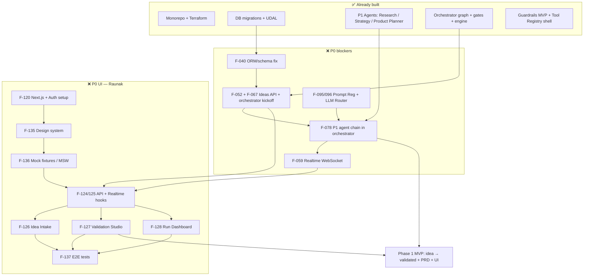

# AutoFounder AI — Engineering Gap Analysis

> **Date:** June 2026  
> **Sources:** PRD (`README.md`), `task_assigned.md`, `PLAN_PHASE.md`, `CURRENT-STATUS.md`, live code in `PROJECT-1-AutoFounder-AI/`  
> **Companion:** [project_understanding.md](./project_understanding.md)

---

## Executive summary

| Metric | Count |
|--------|------:|
| Features inventoried | **92** |
| Exists (production-ready or complete) | **38** (41%) |
| Partial (works but gaps / fallbacks / not wired) | **24** (26%) |
| Missing (not started or scaffold only) | **30** (33%) |

**MVP blockers (P0):** 18 features are missing or critically partial. The largest gaps are the **Founder Portal (0/12 screens)**, **API↔orchestrator wiring**, **REST/ORM alignment**, **realtime streaming**, and **end-to-end Pillar 1 orchestration** (Research → Strategy → gate → Product Planner).

**Effort roll-up to close all P0 gaps:** ~**95–125 person-days** (~4–6 months with 1 FTE; ~6–8 weeks with 4 parallel owners).

---

## MVP scope definition

Priority labels use **Phase 1 Validation MVP** (PLAN_PHASE exit criteria: 10 pilot clients, idea → validated + PRD) as the primary lens.

| Priority | Meaning |
|----------|---------|
| **P0** | Must have for Phase 1 Validation MVP (pilot clients) |
| **P1** | Must have for full PRD 7-pillar product MVP |
| **P2** | Nice to have / later phase (enterprise, mobile ship, extras) |

---

## Status legend

| Status | Symbol | Meaning |
|--------|--------|---------|
| **Exists** | ✅ | Implemented, tested, usable in target path |
| **Partial** | 🟡 | Code present but incomplete, stub fallback, not wired E2E, or known bugs |
| **Missing** | ❌ | Not implemented or placeholder only |

---

## Effort legend

Estimates are in **person-days (PD)** per dimension. Ranges reflect uncertainty.

| Size | PD range |
|------|----------|
| XS | 0.5–1 |
| S | 1–3 |
| M | 3–5 |
| L | 5–10 |
| XL | 10–20 |

Dimensions: **FE** (frontend), **BE** (backend/services/agents), **API**, **DB**, **Test** (unit + integration + e2e).

---

## 1. Platform & monorepo

| ID | Feature | Status | Priority | Notes |
|----|---------|--------|----------|-------|
| F-001 | pnpm + Turborepo workspace | ✅ | P0 | AF-001 |
| F-002 | Root scripts (lint, format, quality) | ✅ | P0 | AF-002 |
| F-003 | Docker Compose (Redis) | ✅ | P0 | AF-003; Supabase via CLI |
| F-004 | Cross-platform dev setup scripts | ✅ | P0 | AF-010 |
| F-005 | ESLint + Prettier shared config | ✅ | P0 | AF-008 |
| F-006 | `.env.example` + onboarding docs | 🟡 | P0 | Secrets scrubbed; rotation/history purge open |
| F-007 | Makefile task runner | ✅ | P1 | AF-009 |
| F-008 | Shared TypeScript types package | ❌ | P1 | `packages/shared` scaffold only |
| F-009 | OpenAPI-generated API client | 🟡 | P1 | Hand-written minimal client in `packages/api-client` |

---

## 2. Infrastructure & DevOps (platform)

| ID | Feature | Status | Priority | Notes |
|----|---------|--------|----------|-------|
| F-010 | Terraform VPC / networking | ✅ | P0 | AF-012 |
| F-011 | Terraform ECS Fargate | ✅ | P0 | AF-013 |
| F-012 | Terraform ElastiCache Redis | ✅ | P0 | AF-015 |
| F-013 | Terraform S3 (artifacts, audit) | ✅ | P1 | AF-016 |
| F-014 | Terraform messaging (EventBridge/SQS/SNS) | 🟡 | P0 | AF-017; Confluent Kafka deferred |
| F-015 | Terraform ALB + HTTPS | 🟡 | P0 | AF-018; CloudFront/Shield deferred |
| F-016 | Terraform IAM least-privilege | ✅ | P0 | AF-019 |
| F-017 | Terraform secrets (SM/SSM/KMS) | ✅ | P0 | AF-020 |
| F-018 | Terraform ECR | ✅ | P0 | AF-021 |
| F-019 | Supabase hosted project link | 🟡 | P0 | AF-014; schema via Alembic, hosted link TBD |
| F-020 | GitHub Actions CI (lint/test/security) | ✅ | P0 | AF-022 |
| F-021 | GitHub Actions CD (staging/prod) | 🟡 | P1 | Rolling deploy; CodeDeploy blue/green deferred |
| F-022 | OpenTelemetry + structured logs | 🟡 | P1 | AF-023; JSON logs done, FireLens sidecar deferred |
| F-023 | Prometheus `/metrics` + Grafana dashboards | 🟡 | P1 | AF-024; endpoint exists, live dashboards deferred |
| F-024 | CodeDeploy blue/green specs | ❌ | P2 | `infra/codedeploy/` empty |
| F-025 | Public marketing website (Vite) | ✅ | P2 | `website/` — separate from Founder Portal |

---

## 3. Database & data layer

| ID | Feature | Status | Priority | Notes |
|----|---------|--------|----------|-------|
| F-030 | Platform schema migrations | ✅ | P0 | AF-025 — orgs, registries, audit |
| F-031 | Per-tenant schema migrations | ✅ | P0 | AF-026 — runs, artifacts, gates, step_events |
| F-032 | Orchestrator checkpoints schema | ✅ | P0 | In AF-026 migration |
| F-033 | UDAL (relational/vector/object) | ✅ | P0 | AF-027 |
| F-034 | Redis cache + checkpoint hot layer | ✅ | P0 | AF-032 |
| F-035 | pgvector collections | 🟡 | P1 | Extension enabled; RAG pipeline not built |
| F-036 | Graph DB (Neo4j/Neptune) | ❌ | P2 | UDAL `graph()` raises NotImplementedError |
| F-037 | S3 object store (artifacts) | 🟡 | P1 | Client exists; agent persistence incomplete |
| F-038 | Cost ledger writes from agents | 🟡 | P0 | Table exists; not consistently populated |
| F-039 | Artifact persistence from agents | 🟡 | P0 | Table + API exist; agents don't always write |
| F-040 | ORM models aligned to tenant schema | ❌ | P0 | **P0 bug:** legacy `models/run.py` vs `org_*.runs` |
| F-041 | Tenant isolation integration test | ❌ | P0 | PLAN_PHASE exit criterion |

---

## 4. API layer

| ID | Feature | Status | Priority | Notes |
|----|---------|--------|----------|-------|
| F-050 | FastAPI bootstrap + error envelope | ✅ | P0 | AF-028 |
| F-051 | Supabase JWT auth middleware | 🟡 | P0 | AF-029; dev bypass in non-prod |
| F-052 | `POST /v1/ideas` | 🟡 | P0 | AF-030; **does not persist idea_text**, no orchestrator kickoff |
| F-053 | `GET /v1/runs/{id}` | 🟡 | P0 | AF-030; ORM mismatch risk |
| F-054 | `GET /v1/runs` (list + cursor pagination) | 🟡 | P0 | AF-030; same ORM issue |
| F-055 | `POST /v1/runs/{id}/gates/{gate_id}` | 🟡 | P0 | AF-030; resumes engine in dev, SQS in prod |
| F-056 | `GET /v1/runs/{id}/artifacts` | 🟡 | P0 | AF-030; works if artifacts exist |
| F-057 | `POST /v1/feedback` | 🟡 | P1 | AF-030; endpoint exists, LLMOps consumer missing |
| F-058 | `GET /v1/llmops/cost` | 🟡 | P0 | AF-030; reads `cost_ledger` (often empty) |
| F-059 | `GET /v1/runs/{id}/stream` (WebSocket) | ❌ | P0 | AF-031; pg_notify trigger only |
| F-060 | `DELETE /v1/runs/{id}` (cancel) | ❌ | P1 | Spec'd in api-design.md, not implemented |
| F-061 | Workspaces CRUD APIs | ❌ | P1 | `GET/POST /v1/workspaces` spec'd, not implemented |
| F-062 | API key rotation endpoints | ❌ | P2 | Enterprise tier |
| F-063 | Stripe webhook `POST /v1/webhooks/stripe` | ❌ | P2 | Billing not built |
| F-064 | Admin APIs (tenant/registry CRUD) | ❌ | P2 | AF-062 backend counterpart |
| F-065 | OpenAPI spec CI drift check | ❌ | P1 | `make api-spec-check` not wired |
| F-066 | Rate limiting (per-tier Redis) | ❌ | P1 | Spec'd, not implemented |
| F-067 | **Ideas → OrchestratorEngine wiring** | ❌ | P0 | Engine exists; `submit_idea` never calls `create_run()` |

---

## 5. Orchestration & messaging

| ID | Feature | Status | Priority | Notes |
|----|---------|--------|----------|-------|
| F-070 | LangGraph StateGraph (7 pillars + gates) | ✅ | P0 | AF-033 |
| F-071 | DualCheckpointer (Postgres + Redis) | ✅ | P0 | AF-033 |
| F-072 | OrchestratorEngine lifecycle | ✅ | P0 | AF-033; create/resume/cancel |
| F-073 | HITL gate state machine | ✅ | P0 | AF-034 |
| F-074 | SQS worker + DLQ backoff | ✅ | P1 | AF-035 |
| F-075 | EventBridge producer/consumer | 🟡 | P1 | AF-034; consumer blocking boto3 nit |
| F-076 | gRPC agent worker dispatch | 🟡 | P1 | Proto + stub; `grpcio` runtime dep gap |
| F-077 | Pillar 1 node → StrategyAgent | 🟡 | P0 | Wired; falls back to stub without Gemini key |
| F-078 | Pillar 1 → Research → Product Planner chain | ❌ | P0 | Only Strategy runs in orchestrator; PP after gate not wired |
| F-079 | Pillars 2–7 orchestrator nodes | 🟡 | P1 | Stubs return fake output (AF-040–045 not wired) |
| F-080 | ReviewerAgent wired to pillar 4 node | ❌ | P1 | Agent built; orchestrator still stub |
| F-081 | Artifact + step_event emission to DB | 🟡 | P0 | Partial; not all nodes persist |
| F-082 | Gate creation on interrupt | 🟡 | P0 | Gate rows may not align with graph interrupts E2E |

---

## 6. Shared agent plumbing

| ID | Feature | Status | Priority | Notes |
|----|---------|--------|----------|-------|
| F-090 | BaseAgent ABC | 🟡 | P0 | AF-036; missing typed error hierarchy + circuit breakers |
| F-091 | Guardrails 6-stage pipeline | 🟡 | P0 | AF-046; MVP regex/heuristic fallbacks |
| F-092 | Guardrails production services | ❌ | P1 | Presidio, Llama Guard, TruLens, Evidently, OPA sidecar |
| F-093 | Tool Registry shell | ✅ | P0 | AF-047 |
| F-094 | Pillar tool entries (Tavily, GitHub, etc.) | 🟡 | P0 | Research tools partial; engineering/marketing missing |
| F-095 | Prompt Registry (DB + S3 + canary) | ❌ | P0 | AF-048; agents use local `JinjaPromptRegistry` |
| F-096 | LiteLLM Router + task-class routing | ❌ | P0 | AF-049; local `GeminiRouter` only |
| F-097 | RAG pipeline (BM25 + pgvector + rerank) | ❌ | P1 | AF-049 |
| F-098 | Eval harness (Promptfoo + CI gate) | ❌ | P1 | AF-050 |
| F-099 | Guardrails wired into all agents | 🟡 | P0 | Opt-in on BaseAgent; existing agents not wrapped |

---

## 7. AI agents (by pillar)

| ID | Feature | Status | Priority | Notes |
|----|---------|--------|----------|-------|
| F-100 | Research Agent | ✅ | P0 | AF-038; full LangGraph + tests |
| F-101 | Strategy & Ideation Agent | ✅ | P0 | AF-037; wired in orchestrator P1 node |
| F-102 | Product Planner Agent | ✅ | P0 | AF-039; not in orchestrator post-gate flow |
| F-103 | Architect Agent | ❌ | P1 | AF-040; LLD only |
| F-104 | Coder Agent | ❌ | P1 | AF-041; LLD only |
| F-105 | Reviewer / Self-Healer Agent | ✅ | P1 | AF-042; 14-node graph, tests green |
| F-106 | DevOps Agent | ❌ | P1 | AF-043; `agent.py` skeleton only |
| F-107 | Marketing Agent | ❌ | P1 | AF-044; LLD only |
| F-108 | LLMOps Agent | ❌ | P1 | AF-045; LLD only |
| F-109 | Finance Agent | ❌ | P2 | Phase 4 deferred |
| F-110 | Ops & Risk Agent | ❌ | P2 | Phase 4 deferred |

---

## 8. Founder Portal (Next.js) — Raunak / AF-051–062

| ID | Feature | Status | Priority | Notes |
|----|---------|--------|----------|-------|
| F-120 | Next.js 14 + Tailwind + shadcn/ui setup | ❌ | P0 | AF-051; `placeholder.ts` only |
| F-121 | Supabase Auth (login/session) | ❌ | P0 | AF-051 |
| F-122 | Layout shell + cost ticker | ❌ | P0 | AF-053 |
| F-123 | Zustand + React Query config | ❌ | P0 | AF-053 |
| F-124 | Typed API client + hooks (`useRun`, `useGate`) | ❌ | P0 | AF-052 |
| F-125 | Realtime hook (Supabase / WS) | ❌ | P0 | AF-052; depends F-059 |
| F-126 | Idea Intake screen | ❌ | P0 | AF-054 |
| F-127 | Validation Studio | ❌ | P0 | AF-055 |
| F-128 | Run List / Dashboard | ❌ | P0 | AF-061 |
| F-129 | Architecture Studio | ❌ | P1 | AF-056 |
| F-130 | Code Review Studio | ❌ | P1 | AF-057 |
| F-131 | Deploy Console | ❌ | P1 | AF-058 |
| F-132 | Launch Control Center | ❌ | P1 | AF-059 |
| F-133 | LLMOps Dashboard | ❌ | P1 | AF-060 |
| F-134 | Admin Dashboard | ❌ | P2 | AF-062 |
| F-135 | Design system / component library | ❌ | P0 | Prerequisite for all surfaces |
| F-136 | Mock fixtures + MSW for dev | ❌ | P0 | Enables parallel UI work |
| F-137 | Playwright e2e (idea → gate flow) | ❌ | P0 | PLAN_PHASE exit criterion |
| F-138 | Sentry + error boundaries | ❌ | P1 | AF-051 |

---

## 9. Mobile app (Expo) — Yogesh / AF-063–071

| ID | Feature | Status | Priority | Notes |
|----|---------|--------|----------|-------|
| F-140 | Expo Router scaffold + auth | ❌ | P2 | AF-063 |
| F-141 | Idea Intake screen | ❌ | P2 | AF-065 |
| F-142 | Run Dashboard | ❌ | P2 | AF-066 |
| F-143 | Run Detail + live stream | ❌ | P2 | AF-067 |
| F-144 | HITL gate approval screens | ❌ | P2 | AF-068 |
| F-145 | Artifacts viewer | ❌ | P2 | AF-069 |
| F-146 | Push notifications (SNS → Expo) | ❌ | P2 | AF-064 |
| F-147 | LLMOps summary screen | ❌ | P2 | AF-070 |
| F-148 | EAS build + store submit | ❌ | P2 | AF-071 |

---

## 10. VS Code extension — AF-072–078

| ID | Feature | Status | Priority | Notes |
|----|---------|--------|----------|-------|
| F-150 | Extension core + PKCE auth | ✅ | P1 | AF-072 |
| F-151 | Sidebar run list | ✅ | P1 | AF-073 |
| F-152 | HITL gate banners | ✅ | P1 | AF-074 |
| F-153 | Code-gen commands | 🟡 | P1 | AF-075; placeholder until Coder Agent |
| F-154 | Live stream panel | 🟡 | P1 | AF-076; polls until WS live |
| F-155 | Artifact quick-open | ✅ | P1 | AF-077 |
| F-156 | Marketplace publish CI | ✅ | P2 | AF-078 |

---

## 11. Commercial & compliance

| ID | Feature | Status | Priority | Notes |
|----|---------|--------|----------|-------|
| F-160 | Stripe subscription billing | ❌ | P2 | Integrations spec defined |
| F-161 | Tier enforcement (build quotas) | ❌ | P2 | Solopreneur 1/mo, Startup 5/mo |
| F-162 | MFA enforcement | 🟡 | P1 | Supabase capability; not verified E2E |
| F-163 | Audit log immutability (S3 Object Lock) | 🟡 | P1 | Bucket spec'd; pipeline uses DB only |
| F-164 | GDPR schema drop (tenant erasure) | 🟡 | P1 | Pattern designed; no automation |

---

## Missing & partial items — effort estimates

Only **❌ Missing** and critical **🟡 Partial** items with remaining work are estimated below.

### P0 — Phase 1 Validation MVP

| ID | Feature | FE | BE | API | DB | Test | Total PD | Owner |
|----|---------|---:|---:|---:|---:|---:|---------:|-------|
| F-040 | ORM ↔ tenant schema alignment | 0 | 3 | 2 | 3 | 3 | **8–11** | Somesh |
| F-052 | Fix `POST /v1/ideas` (persist text, return full run) | 1 | 2 | 2 | 1 | 2 | **6–8** | Somesh |
| F-067 | Wire ideas endpoint → OrchestratorEngine | 0 | 3 | 2 | 1 | 3 | **7–9** | Somesh |
| F-059 | WebSocket / realtime stream endpoint | 2 | 5 | 4 | 1 | 3 | **12–15** | Somesh |
| F-078 | Orchestrator P1 chain: Research → Strategy → gate → Product Planner | 0 | 8 | 2 | 2 | 5 | **15–17** | Somesh |
| F-038 | Cost ledger population per agent call | 0 | 3 | 1 | 2 | 2 | **6–8** | Somesh/Purnima |
| F-039 | Artifact persistence from P1 agents | 1 | 4 | 1 | 2 | 2 | **8–10** | Somesh |
| F-041 | Two-org tenant isolation integration test | 0 | 2 | 1 | 2 | 4 | **7–9** | Somesh |
| F-095 | Prompt Registry (platform, not local Jinja) | 0 | 5 | 1 | 3 | 3 | **10–12** | Purnima |
| F-096 | LiteLLM Router (replace GeminiRouter) | 0 | 5 | 0 | 1 | 3 | **8–9** | Purnima |
| F-091 | Wire guardrails into P1 agents | 0 | 2 | 0 | 0 | 2 | **4** | Asit |
| F-120 | Next.js 14 + shadcn + Auth setup | 5 | 0 | 0 | 0 | 2 | **7** | Raunak |
| F-135 | Design system / components | 8 | 0 | 0 | 0 | 2 | **10** | Raunak |
| F-136 | Mock fixtures + MSW | 3 | 0 | 0 | 0 | 1 | **4** | Raunak |
| F-123 | State management (Zustand + RQ) | 3 | 0 | 0 | 0 | 1 | **4** | Raunak |
| F-124 | API client + `useRun` / `useGate` hooks | 4 | 0 | 1 | 0 | 2 | **7** | Raunak |
| F-125 | Realtime hook | 3 | 0 | 1 | 0 | 2 | **6** | Raunak |
| F-126 | Idea Intake screen | 4 | 0 | 1 | 0 | 2 | **7** | Raunak |
| F-127 | Validation Studio + gate UI | 8 | 0 | 1 | 0 | 3 | **12** | Raunak |
| F-128 | Run List / Dashboard | 4 | 0 | 1 | 0 | 2 | **7** | Raunak |
| F-137 | Playwright e2e (idea → validate → approve) | 3 | 0 | 0 | 0 | 5 | **8** | Raunak |
| | **P0 subtotal** | **33** | **37** | **18** | **18** | **44** | **~95–125** | |

### P1 — Full 7-pillar product MVP (additional work)

| ID | Feature | FE | BE | API | DB | Test | Total PD | Owner |
|----|---------|---:|---:|---:|---:|---:|---------:|-------|
| F-103 | Architect Agent | 0 | 15 | 0 | 2 | 5 | **20–22** | Kaushlendra |
| F-104 | Coder Agent | 0 | 20 | 0 | 2 | 8 | **28–30** | Kartik |
| F-106 | DevOps Agent | 0 | 15 | 0 | 1 | 5 | **20–21** | Prasenjit |
| F-107 | Marketing Agent | 0 | 12 | 0 | 1 | 4 | **16–17** | Pallavi |
| F-108 | LLMOps Agent | 0 | 12 | 2 | 2 | 4 | **18–20** | Purnima |
| F-079 | Wire pillars 2–7 in orchestrator | 0 | 8 | 1 | 1 | 5 | **13–15** | Somesh |
| F-080 | Wire Reviewer into pillar 4 node | 0 | 3 | 0 | 0 | 3 | **6** | Vishal |
| F-097 | RAG pipeline | 0 | 8 | 0 | 3 | 4 | **13–15** | Purnima |
| F-098 | Eval harness + CI gate | 0 | 6 | 0 | 1 | 4 | **10–11** | Purnima |
| F-092 | Production guardrails services | 0 | 10 | 0 | 1 | 5 | **14–16** | Asit |
| F-129 | Architecture Studio UI | 6 | 0 | 0 | 0 | 2 | **8** | Raunak |
| F-130 | Code Review Studio UI | 8 | 0 | 0 | 0 | 3 | **11** | Raunak |
| F-131 | Deploy Console UI | 5 | 0 | 0 | 0 | 2 | **7** | Raunak |
| F-132 | Launch Control Center UI | 8 | 0 | 0 | 0 | 3 | **11** | Raunak |
| F-133 | LLMOps Dashboard UI | 5 | 0 | 1 | 0 | 2 | **8** | Raunak |
| F-060 | Cancel run API | 1 | 2 | 2 | 0 | 2 | **6–7** | Somesh |
| F-061 | Workspaces APIs | 2 | 3 | 4 | 2 | 3 | **12–14** | Somesh |
| F-065 | OpenAPI CI drift check | 0 | 2 | 2 | 0 | 1 | **5** | Asit |
| F-066 | Rate limiting | 0 | 3 | 2 | 1 | 2 | **7–8** | Somesh |
| | **P1 subtotal (incremental)** | **35** | **114** | **14** | **17** | **64** | **~220–250** | |

### P2 — Nice to have / later phases

| ID | Feature | FE | BE | API | DB | Test | Total PD |
|----|---------|---:|---:|---:|---:|---:|---------:|
| F-134 | Admin Dashboard | 15 | 8 | 8 | 2 | 5 | **35–38** |
| F-140–F-148 | Mobile app (9 features) | 25 | 2 | 2 | 0 | 8 | **35–37** |
| F-160–F-161 | Stripe billing + tier quotas | 3 | 8 | 4 | 2 | 4 | **19–21** |
| F-109–F-110 | Finance + Ops/Risk agents | 0 | 20 | 2 | 2 | 6 | **28–30** |
| F-036 | Graph DB | 0 | 10 | 0 | 5 | 3 | **16–18** |
| F-024 | CodeDeploy blue/green | 0 | 8 | 0 | 0 | 3 | **10–11** |
| | **P2 subtotal** | **43** | **56** | **16** | **11** | **29** | **~143–155** | |

---

## Dependency graph

### Critical path to Phase 1 MVP

### Full product dependency graph (7 pillars)

```mermaid
flowchart LR
    subgraph Foundation
        F[UDAL + Auth + API fix]
        O[Orchestrator]
        PR[Prompt Reg + Router]
        GR[Guardrails]
    end

    subgraph P1["Pillar 1"]
        R[Research]
        S[Strategy]
        PP[Product Planner]
    end

    subgraph P2["Pillar 2"]
        A[Architect]
    end

    subgraph P3["Pillar 3"]
        C[Coder]
    end

    subgraph P4["Pillar 4"]
        REV[Reviewer]
    end

    subgraph P5["Pillar 5"]
        DEV[DevOps]
    end

    subgraph P6["Pillar 6"]
        MKT[Marketing]
    end

    subgraph P7["Pillar 7"]
        LMO[LLMOps]
    end

    subgraph UI["Founder Portal"]
        UI1[Validation Studio]
        UI2[Architecture Studio]
        UI3[Code Review]
        UI4[Deploy Console]
        UI5[Launch Control]
        UI6[LLMOps Dashboard]
    end

    F --> O
    PR --> R & S & PP & A & C & MKT
    GR --> R & S & PP & A & C & REV & MKT

    O --> R --> S --> PP --> A --> C --> REV --> DEV --> MKT --> LMO

    PP --> UI1
    A --> UI2
    REV --> UI3
    DEV --> UI4
    MKT --> UI5
    LMO --> UI6
```

### Cross-team dependency matrix

| Consumer | Depends on | Blocker until |
|----------|------------|---------------|
| Raunak (FE hooks) | F-040, F-052, F-059 | API + realtime stable |
| Raunak (Validation Studio) | F-078, artifact schemas | P1 chain + artifact shape frozen |
| Kaushlendra (Architect) | F-039 PRD output schema | Product Planner artifacts |
| Kartik (Coder) | F-103 Architect output | ERD + OpenAPI |
| Vishal (Reviewer wire) | F-104 Coder repo | Generated code exists |
| Prasenjit (DevOps) | F-105 Reviewer pass | Green repo |
| Pallavi (Marketing) | F-106 live URL + feature list | DevOps + Architect |
| Purnima (LLMOps) | All agents running | Live traces |
| Yogesh (Mobile) | AF-052 equivalent + F-059 | Same as web hooks |

---

## Gap summary by layer

| Layer | ✅ Exists | 🟡 Partial | ❌ Missing | P0 open PD |
|-------|----------:|-----------:|-----------:|------------:|
| Platform / monorepo | 7 | 2 | 2 | 0 |
| Infrastructure | 10 | 5 | 1 | 0 |
| Database | 6 | 4 | 2 | 18 |
| API | 1 | 9 | 8 | 18 |
| Orchestration | 6 | 5 | 2 | 15 |
| Agent plumbing | 1 | 4 | 4 | 22 |
| AI agents | 4 | 0 | 6 | 0 (agents exist for P1) |
| Founder Portal | 0 | 0 | 15 | 33 |
| Mobile | 0 | 0 | 9 | 0 |
| VS Code ext | 4 | 2 | 0 | 0 |
| Commercial | 0 | 2 | 2 | 0 |
| **Total** | **38** | **24** | **30** | **~95–125** |

---

## Recommended build order (engineering)

1. **Somesh — API + DB correctness (F-040, F-052, F-067)** — unblocks everyone; ~2 weeks  
2. **Purnima — Prompt Registry + LiteLLM Router (F-095, F-096)** — unblocks production agent calls; ~2 weeks  
3. **Somesh — P1 orchestrator chain + artifacts (F-078, F-039, F-038)** — ~2 weeks  
4. **Somesh — Realtime WebSocket (F-059)** — ~2 weeks (can parallel with #3)  
5. **Raunak — UI foundation on mocks (F-120, F-135, F-136, F-123)** — start immediately; ~2 weeks  
6. **Raunak — Wire hooks + P0 screens (F-124–128, F-137)** — after step 1 + 4; ~3 weeks  
7. **Somesh — Tenant isolation test (F-041)** — before pilot onboarding  
8. **Pillar owners — P1 agents (Architect → Coder → DevOps → Marketing)** — after P0 MVP ships  

---

## Risks affecting gap closure

| Risk | Impact on gaps | Mitigation |
|------|----------------|------------|
| API/ORM bug (F-040) | Green CI, broken prod DB | Testcontainers integration tests first |
| Ideas not starting orchestrator (F-067) | UI shows runs that never execute | Single `create_run` code path |
| Dual prompt/router (local vs platform) | Agent behavior diverges | Migrate to AF-048/049 before pilot |
| Frontend blocked on artifact schemas | Studio UIs built twice | Freeze Pydantic I/O contracts now |
| No E2E test (F-137) | Pilot failures in production | Playwright against staging with real backend |

---

## Document references

| Document | Path |
|----------|------|
| Task tracker (78 tasks) | `PROJECT-1-AutoFounder-AI/.claude/task_assigned.md` |
| Phase 1 exit criteria | `PROJECT-1-AutoFounder-AI/.claude/PLAN_PHASE.md` |
| Claim vs reality audit | `PROJECT-1-AutoFounder-AI/.claude/CURRENT-STATUS.md` |
| API spec | `PROJECT-1-AutoFounder-AI/.claude/specs/api-design.md` |
| Web frontend plan | `PROJECT-1-AutoFounder-AI/.claude/developer-plans/09-raunak-web-frontend-plan.md` |
| Plain-language overview | [project_understanding.md](./project_understanding.md) |

---

*Gap analysis v1.0 — June 2026. Effort estimates are planning ranges, not commitments. Re-baseline after F-040/F-067 land and first E2E run succeeds.*
