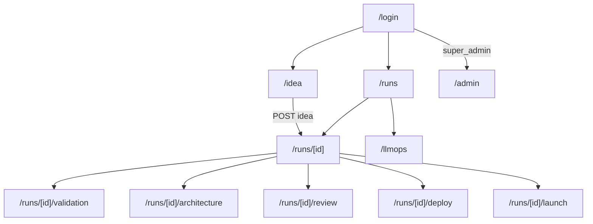

# AutoFounder AI — Founder Portal Frontend Inventory

> **App:** Next.js 14 Founder Portal (`frontend/`)  
> **Owner:** Raunak Ravi · **Tasks:** AF-051 → AF-062  
> **Status:** All screens **missing** (scaffold only as of June 2026)  
> **Companion:** [project_understanding.md](./project_understanding.md) · [engineering_gap_analysis.md](./engineering_gap_analysis.md)

---

## Screen index

| # | Screen | Route | AF-ID | Phase |
|---|--------|-------|-------|-------|
| 1 | Login | `/login` | AF-051 | P0 |
| 2 | Auth callback | `/auth/callback` | AF-051 | P0 |
| 3 | Portal layout shell | `(portal)/layout` | AF-053 | P0 |
| 4 | Idea Intake | `/idea` | AF-054 | P0 |
| 5 | Run List / Dashboard | `/runs` | AF-061 | P0 |
| 6 | Run Detail shell | `/runs/[id]` | AF-052, AF-053 | P0 |
| 7 | Validation Studio | `/runs/[id]/validation` | AF-055 | P0 |
| 8 | Architecture Studio | `/runs/[id]/architecture` | AF-056 | P1 |
| 9 | Code Review Studio | `/runs/[id]/review` | AF-057 | P1 |
| 10 | Deploy Console | `/runs/[id]/deploy` | AF-058 | P1 |
| 11 | Launch Control Center | `/runs/[id]/launch` | AF-059 | P1 |
| 12 | LLMOps Dashboard | `/llmops` | AF-060 | P1 |
| 13 | Admin Dashboard | `/admin` | AF-062 | P2 |
| 14 | Global not found | `/not-found` | AF-051 | P0 |

> **Note:** `website/` is the public marketing site (Vite), **not** part of this inventory.

---

## Full screen inventory

| Screen | Purpose | Route | Components | Data needed | API dependencies | Agent dependencies | Mock data required |
|--------|---------|-------|------------|-------------|------------------|--------------------|--------------------|
| **Login** | Let founders sign in securely before using the portal | `/login` | `LoginForm`, `OAuthButtons` (Google/GitHub), `MFAChallenge` (if required), `AuthErrorAlert`, `RedirectToPortal` | Supabase session; JWT claims (`sub`, `organization_id`, `role`, `scopes`); redirect target after login | Supabase Auth (`@supabase/ssr`) — no REST; optional `GET /health` for API reachability | None | `mock_session.json` (dev user + org + role claims) |
| **Auth callback** | Complete OAuth / magic-link flow and establish SSR session | `/auth/callback` | `AuthCallbackHandler`, `SessionLoader`, `ErrorFallback` | Auth code exchange result; session cookies; post-login redirect URL | Supabase Auth token exchange | None | N/A (MSW stub for callback route in e2e) |
| **Portal layout shell** | Shared chrome for all authenticated pages: nav, cost ticker, gate banners | `(portal)/layout` (wraps `/idea`, `/runs`, `/llmops`) | `AppSidebar`, `TopBar`, `CostTicker`, `GateBanner`, `UserMenu`, `ThemeToggle`, `ErrorBoundary`, `Toaster` | Org name; live run cost (`cost_usd`); pending gate summary; nav active state | `GET /v1/llmops/cost`; `GET /v1/runs/{id}` (active run); Supabase session | None (displays gate events from any agent) | `mock_cost_ticker.json`, `mock_pending_gate.json` |
| **Idea Intake** | Entry point — founder submits a new business idea and starts a run | `/idea` | `IdeaForm`, `TextAreaInput`, `LocaleSelector`, `FileUpload` (PDF), `VoiceRecorder`, `URLInput`, `SubmitButton`, `FormValidation` | `idea_text` (required); optional `locale`, `attachments[]`, `source_url`; workspace context | `POST /v1/ideas` → `{ run_id, status }`; optional `GET /v1/workspaces` (P1) | **Research**, **Strategy & Ideation** (triggered after submit) | `mock_idea_submit_response.json` (`run_id`, `status: queued`) |
| **Run List / Dashboard** | Overview of all builds: status, pillar, cost, date; search and filter | `/runs` | `RunTable`, `RunStatusBadge`, `PillarBadge`, `CostCell`, `FilterBar`, `SearchInput`, `CursorPagination`, `SkeletonRows`, `EmptyState` | Paginated runs: `id`, `status`, `current_pillar`, `idea_text` (truncated), `cost_usd`, `created_at`; filter by status/pillar | `GET /v1/runs?limit=&cursor=&order=`; optional `GET /v1/workspaces/{id}/runs` (P1) | None (displays output of all agents) | `mock_runs_list.json` (10+ runs, mixed statuses) |
| **Run Detail shell** | Live hub for one run: pillar progress, step log stream, links to pillar studios | `/runs/[id]` | `RunHeader`, `PillarStepper`, `StepLogStream`, `ActiveGateBanner`, `StudioNavTabs`, `CancelRunButton`, `RealtimeConnector` | `RunState`: `runId`, `status`, `current_pillar`, `gates[]`, `cost_usd`, `idea_text`; live `step_events[]`; pending `gate` if any | `GET /v1/runs/{id}`; `GET /v1/runs/{id}/artifacts`; `GET /v1/runs/{id}/stream` (WebSocket) or Supabase Realtime `step_events`; `DELETE /v1/runs/{id}` (P1) | All agents (stream reflects whichever is active) | `mock_run_detail.json`, `mock_step_events.json`, `mock_gates.json` |
| **Validation Studio** | Review Pillar 1 output; approve, reject, or pivot before architecture | `/runs/[id]/validation` | `LeanCanvasViewer`, `ViabilityGauge`, `ViabilityBandBadge`, `ICPCardGrid`, `CompetitorTable`, `PivotPicker`, `BiasAuditPanel`, `MarketReportViewer`, `PRDViewer` (Monaco read-only), `ValidationGateActions` (`Approve` / `Pivot` + notes) | Artifacts: `lean_canvas`, `viability_score` (0–100), `viability_band`, `icps[]`, `competitors[]`, `pivots[]`, `bias_audit`, `market_report`, `prd` (post-gate); gate: `kind=validation_approve`, `state`, `gate_id` | `GET /v1/runs/{id}`; `GET /v1/runs/{id}/artifacts` (filter `kind`); `POST /v1/runs/{id}/gates/{gate_id}`; `GET /v1/runs/{id}/stream` | **Research**, **Strategy & Ideation**, **Product Planner** (PRD after gate) | `mock_lean_canvas.json`, `mock_viability.json`, `mock_icps.json`, `mock_competitors.json`, `mock_prd.json`, `mock_gates.json` (validation) |
| **Architecture Studio** | Review technical blueprint; approve or reject before code generation | `/runs/[id]/architecture` | `MermaidERD`, `SwaggerUIOpenAPI`, `StackRecommendationCards`, `CostForecastCard`, `MicroserviceMap`, `AuthStrategySummary`, `ArchitectureGateActions` (`Approve` / `Reject`) | Artifacts: `erd` (Mermaid), `openapi` (3.1 spec), `stack[]`, `cost_forecast_usd`, `nfrs[]`, `feature_list[]`; gate: `kind=architecture_approve` | `GET /v1/runs/{id}`; `GET /v1/runs/{id}/artifacts`; `POST /v1/runs/{id}/gates/{gate_id}` | **Architect** (Pillar 2) | `mock_erd_openapi.json`, `mock_stack_cost.json`, `mock_gates.json` (architecture) |
| **Code Review Studio** | Read-only view of generated code quality, scans, and self-heal progress | `/runs/[id]/review` | `MonacoDiffViewer`, `ReviewerCommentsPanel`, `SelfHealProgress` (cycle 1–5), `SecurityScanTable`, `CoverageBadge`, `TestResultsSummary`, `RepoLinkButton` | Artifacts: `review_report`, `coverage_pct`, `scan_results[]`, `heal_cycles`, `repo_url`, `pr_url`; step events for heal loop | `GET /v1/runs/{id}`; `GET /v1/runs/{id}/artifacts`; `GET /v1/runs/{id}/stream` | **Coder** (Pillar 3), **Reviewer / Self-Healer** (Pillar 4) | `mock_review_report.json`, `mock_code_diff.json`, `mock_step_events.json` (heal cycles) |
| **Deploy Console** | Watch deployment; approve infra spend; see live URL; rollback | `/runs/[id]/deploy` | `DeployLogStream`, `InfraSpendGate`, `SmokeTestCard`, `LiveUrlBadge`, `RollbackButton`, `TerraformSummary`, `DeployTimeline` | Artifacts: `deploy_url`, `infra_cost_usd`, `smoke_test_result`; gate: `kind=infra_spend_approve`; live deploy log events | `GET /v1/runs/{id}`; `GET /v1/runs/{id}/artifacts`; `POST /v1/runs/{id}/gates/{gate_id}`; `GET /v1/runs/{id}/stream` | **DevOps** (Pillar 5) | `mock_deploy_stream.json`, `mock_live_url.json`, `mock_gates.json` (infra spend) |
| **Launch Control Center** | Preview and edit marketing assets; approve before anything publishes | `/runs/[id]/launch` | `BrandKitPreview`, `LandingPageIframe`, `SocialPostEditor` (X/LinkedIn/HN), `EmailSequencePreview`, `BlogDraftList`, `ProductHuntKit`, `LaunchGateActions` (`Approve` / `Edit` / `Reject`) | Artifacts: `brand_kit`, `landing_page_html`, `social_posts[]`, `email_sequences[]`, `blog_drafts[]`, `og_image_url`; gate: `kind=launch_approve` | `GET /v1/runs/{id}`; `GET /v1/runs/{id}/artifacts`; `POST /v1/runs/{id}/gates/{gate_id}`; `POST /v1/feedback` (optional thumbs on drafts) | **Marketing** (Pillar 6); cross-ref **Architect** feature list | `mock_launch_kit.json`, `mock_social_posts.json`, `mock_email_sequence.json`, `mock_gates.json` (launch) |
| **LLMOps Dashboard** | Org-wide AI cost, quality drift, eval history, prompt versions | `/llmops` | `CostByModelChart`, `CostByPillarChart`, `CostByRunTable`, `DriftScoreChart`, `EvalScoreHistory`, `PromptVersionTable`, `CanaryIndicator` | `total_cost_usd`; per-run/per-model/per-pillar breakdown; drift scores time-series; eval scores; prompt registry versions + canary % | `GET /v1/llmops/cost`; future admin/registry APIs (P2); `POST /v1/feedback` | **LLMOps** (Pillar 7) | `mock_llmops_cost.json`, `mock_drift_eval.json`, `mock_prompt_versions.json` |
| **Admin Dashboard** | Super-admin: tenants, registries, audit log, platform FinOps (role-guarded) | `/admin` | `AdminLayout`, `TenantCRUDTable`, `ModelRegistryPanel`, `PromptRegistryPanel`, `ToolRegistryPanel`, `AuditLogViewer`, `PlatformFinOpsPanel`, `RoleGuard` | Tenants: `id`, `name`, `tier`, `status`; registry entries; immutable audit rows; platform-wide cost | Admin REST (TBD — not in AF-030); `GET /v1/llmops/cost` (org-scoped vs platform); future `POST/DELETE /v1/organizations/{id}/keys` | None directly; manages config for all agents | `mock_admin_tenants.json`, `mock_registry_entries.json`, `mock_audit_log.json` |
| **Global not found** | Friendly 404 when route does not exist | `/not-found` (Next.js convention) | `NotFoundPage`, `BackToRunsLink` | None | None | None | N/A |

---

## Shared cross-cutting modules (not screens)

These support every screen but are not standalone routes.

| Module | AF-ID | Components | API / data |
|--------|-------|------------|------------|
| API client | AF-052 | `lib/api-client.ts`, envelope parser, error mapper | All `/v1/*` REST |
| Realtime hook | AF-052 | `lib/realtime-client.ts`, `useRun()`, `useGate()`, `useCost()` | WebSocket `/v1/runs/{id}/stream` or Supabase Realtime |
| State stores | AF-053 | `runStore`, `gateStore`, `uiStore` | Merges REST snapshot + live events |
| Design system | AF-051 | `components/ui/*` (shadcn), `Skeleton`, `EmptyState`, `ErrorState` | — |

---

## Mock fixture catalog

All fixtures live under `frontend/tests/fixtures/` (or `public/mocks/` for MSW).

| Fixture file | Used by screen(s) |
|--------------|-------------------|
| `mock_session.json` | Login |
| `mock_cost_ticker.json` | Portal layout shell |
| `mock_pending_gate.json` | Portal layout shell, Run Detail |
| `mock_idea_submit_response.json` | Idea Intake |
| `mock_runs_list.json` | Run List |
| `mock_run_detail.json` | Run Detail shell |
| `mock_step_events.json` | Run Detail, Code Review, Deploy Console |
| `mock_gates.json` | Run Detail, Validation, Architecture, Deploy, Launch |
| `mock_lean_canvas.json` | Validation Studio |
| `mock_viability.json` | Validation Studio |
| `mock_icps.json` | Validation Studio |
| `mock_competitors.json` | Validation Studio |
| `mock_prd.json` | Validation Studio (PRD tab) |
| `mock_erd_openapi.json` | Architecture Studio |
| `mock_stack_cost.json` | Architecture Studio |
| `mock_review_report.json` | Code Review Studio |
| `mock_code_diff.json` | Code Review Studio |
| `mock_deploy_stream.json` | Deploy Console |
| `mock_live_url.json` | Deploy Console |
| `mock_launch_kit.json` | Launch Control Center |
| `mock_social_posts.json` | Launch Control Center |
| `mock_email_sequence.json` | Launch Control Center |
| `mock_llmops_cost.json` | LLMOps Dashboard, layout CostTicker |
| `mock_drift_eval.json` | LLMOps Dashboard |
| `mock_prompt_versions.json` | LLMOps Dashboard |
| `mock_admin_tenants.json` | Admin Dashboard |
| `mock_registry_entries.json` | Admin Dashboard |
| `mock_audit_log.json` | Admin Dashboard |

---

## Route map

---

## Build priority (Raunak)

| Priority | Screens | Rationale |
|----------|---------|-----------|
| **P0 — build first on mocks** | Login, Layout shell, Idea Intake, Run List, Run Detail, Validation Studio | Phase 1 MVP exit criteria |
| **P1 — after P0 + backend wire-up** | Architecture, Code Review, Deploy, Launch, LLMOps | Full 7-pillar PRD journey |
| **P2 — last** | Admin Dashboard | Enterprise / ops; large scope (AF-062) |

---

*Inventory v1.0 — June 2026 · Ground truth: `developer-plans/09-raunak-web-frontend-plan.md` + `specs/api-design.md`*
