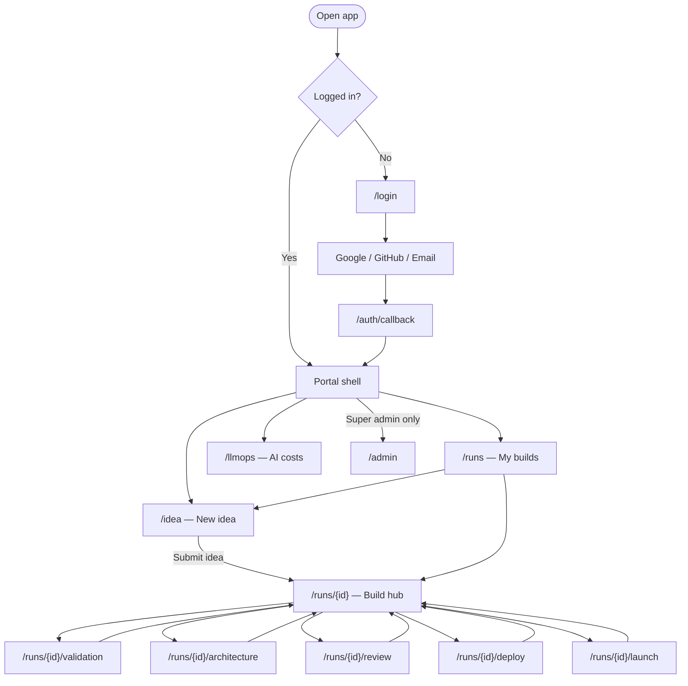
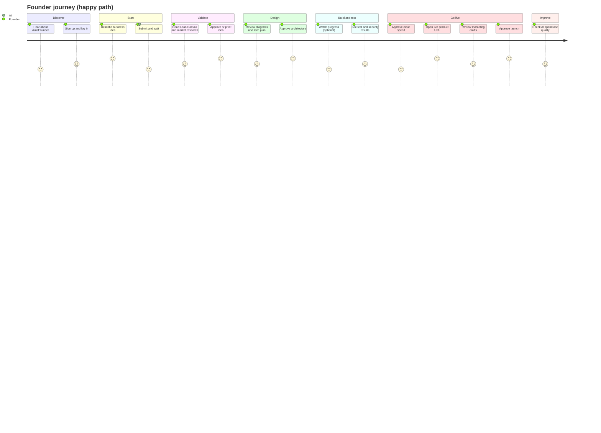
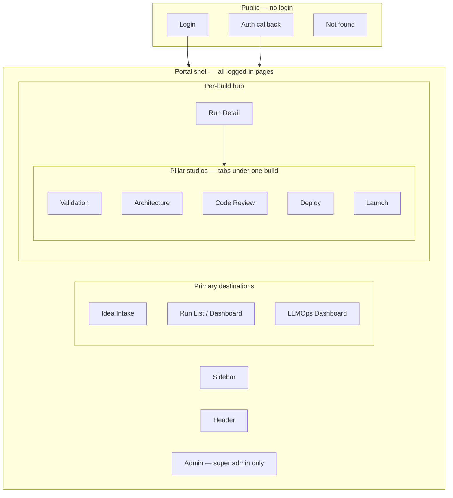
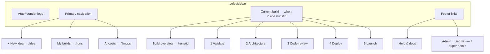
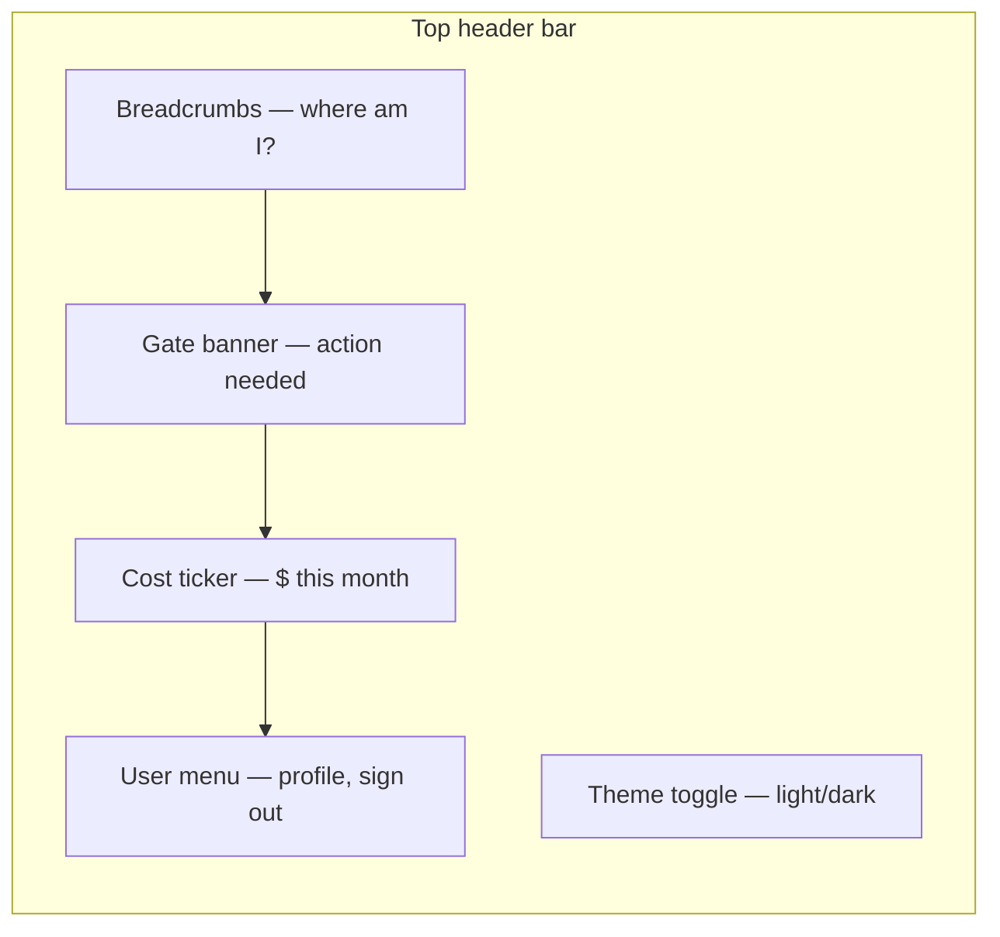

# AutoFounder AI — Founder Portal UX Specification

> **Audience:** Founders, designers, and anyone planning the product — no coding knowledge required  
> **Purpose:** Describe what the web app looks like, how people move through it, and what happens on each screen  
> **Companion docs:** [project_understanding.md](./project_understanding.md) · [frontend_inventory.md](./frontend_inventory.md) · [api_inventory.md](./api_inventory.md) · [docs/openapi.yaml](../docs/openapi.yaml)  
> **Important:** This document describes **experience and layout only**. The app talks to a standard API (`docs/openapi.yaml`). It does not depend on how individual AI agents are built inside the platform.

---

## What you are reading

The **Founder Portal** is the private web app where you log in, submit a business idea, watch the AI work, and approve key decisions before anything goes live or costs money.

Think of it like a **project dashboard for your startup build** — similar to tracking a package, except the “package” is a researched idea, working software, a live website, and marketing content.

---

## 1. Complete navigation flow

After login, you always land inside the **portal shell** (sidebar + header). From there you can reach every main area.



**Rules:**

- **Studios** (Validation, Architecture, etc.) are always reached **through a specific build** (`/runs/{id}/…`). You cannot open them without choosing a build first.
- **Gate banners** in the header can jump you straight to the studio that needs your decision.
- **Back** always returns to the build hub (`/runs/{id}`) or the build list (`/runs`).

---

## 2. User journey map

This is the founder’s story from first visit to launch.



| Stage | What the founder does | What the app shows | Typical time |
|-------|----------------------|-------------------|--------------|
| **Sign in** | Log in with email or Google/GitHub | Login screen | 1 min |
| **Submit idea** | Type idea in plain English | Idea Intake form | 2–5 min |
| **Validate** | Read research, approve or pivot | Validation Studio | ~30 min AI + 10 min review |
| **Design** | Review blueprint, approve or reject | Architecture Studio | ~45 min AI + 10 min review |
| **Build & test** | Mostly wait; can watch live log | Run Detail + Code Review Studio | Hours to days |
| **Deploy** | Approve monthly cloud cost | Deploy Console | ~10 min AI + 2 min approval |
| **Launch** | Edit or approve marketing | Launch Control Center | ~45 min AI + 15 min review |
| **Learn** | Check spend and quality over time | LLMOps Dashboard | Ongoing |

**Emotional beats to design for:**

- **Confidence** during validation (“Is this idea worth it?”)
- **Control** at gates (“Nothing expensive happens without me”)
- **Calm waiting** during long builds (clear progress, not a blank screen)
- **Celebration** at live URL and launch approval

---

## 3. Screen hierarchy

Screens are grouped into **layers**. Higher layers wrap lower ones.



| Layer | Screens | Who sees it |
|-------|---------|-------------|
| **Public** | Login, Auth callback, Not found | Everyone |
| **Portal shell** | Sidebar + header on every authenticated page | Logged-in founders |
| **Primary** | Idea Intake, Run List, LLMOps | All founders |
| **Run hub** | Run Detail + 5 studios | Founders with at least one build |
| **Admin** | Admin Dashboard | Super admins only |

---

## 4. Sidebar structure

The sidebar is **always visible on desktop**. On mobile it becomes a **hamburger menu** (see Mobile behavior).



| Item | Route | When shown | Visual state |
|------|-------|------------|----------------|
| **New idea** | `/idea` | Always | Default CTA style (stands out) |
| **My builds** | `/runs` | Always | Active on dashboard |
| **AI costs** | `/llmops` | Always | Active on LLMOps page |
| **Build overview** | `/runs/{id}` | Only when viewing a build | Shows truncated idea title |
| **Pillar tabs 1–5** | `/runs/{id}/validation` … `/launch` | Only when viewing a build | Locked/disabled until that stage is reached; checkmark when done |
| **Admin** | `/admin` | Super admin role only | Separated at bottom |

**Locked studio behavior:** If pillar 2 is not ready yet, “Architecture” appears greyed out with a tooltip: *“Available after you approve validation.”*

---

## 5. Header structure

The header sits **across the top** of the portal (right of the sidebar on desktop).



| Zone | Content | Behavior |
|------|---------|----------|
| **Breadcrumbs** | e.g. `My builds › Dog walker app › Validation` | Tappable segments; helps orientation |
| **Gate banner** | Amber bar: *“Your approval is needed — Validation”* + **Review now** button | Hidden when no pending gate; links to correct studio |
| **Cost ticker** | *“AI spend this month: $12.47”* | Pulled from API; tap opens `/llmops` |
| **User menu** | Name, org, Sign out | Shows organization name from login |
| **Theme toggle** | Sun/moon icon | Optional; remembers preference |

**Gate banner is the most important header element.** It is how founders learn the AI has paused for them — without reading a log file.

---

## 6. Dashboard layout (Run List — `/runs`)

The dashboard answers: **“What have I built, and what is happening right now?”**

### Wireframe (desktop)

```
┌──────────┬────────────────────────────────────────────────────────────┐
│ Sidebar  │  Breadcrumbs: My builds                                    │
│          ├────────────────────────────────────────────────────────────┤
│          │  [ Search builds... ]  [ Status ▼ ] [ Stage ▼ ]  [ + New ] │
│          ├────────────────────────────────────────────────────────────┤
│          │  ┌──────────────────────────────────────────────────────┐  │
│          │  │ Idea (truncated) │ Status │ Stage │ Cost │ Date      │  │
│          │  │ Dog walker app…  │ Running│ 1     │ $1.23│ Jun 9     │  │
│          │  │ Resume builder…  │ Done   │ 7     │ $8.92│ Jun 8     │  │
│          │  └──────────────────────────────────────────────────────┘  │
│          │  [ Load more ]                                             │
└──────────┴────────────────────────────────────────────────────────────┘
```

### Screen specification

| Field | Detail |
|-------|--------|
| **Purpose** | See all past and current builds in one table; jump into any build |
| **User actions** | Search by idea text; filter by status (running, waiting for you, done, failed); sort by date; open a row; start new idea; load more (pagination) |
| **Components** | `RunTable`, `RunStatusBadge`, `PillarBadge`, `CostCell`, `FilterBar`, `SearchInput`, `CursorPagination`, `EmptyState`, `SkeletonRows` |
| **API dependencies** | `GET /v1/runs` (list with cursor); optional future `GET /v1/workspaces/{id}/runs` |
| **Loading state** | 5–8 skeleton rows; sidebar and header still usable |
| **Empty state** | Illustration + *“No builds yet”* + primary button **Submit your first idea** → `/idea` |
| **Error state** | Banner: *“Could not load your builds”* + **Try again**; partial cache may show stale data with warning |
| **Mobile behavior** | Table becomes **card list** (one card per build); filters collapse into a sheet; search stays sticky at top |

---

## 7. Validation Studio layout (`/runs/{id}/validation`)

**Pillar 1 — Validate.** Review whether the idea is worth pursuing before any code is written.

### Wireframe (desktop)

```
┌──────────┬────────────────────────────────────────────────────────────┐
│ Sidebar  │  Build hub › Validation                    [Gate: Approve ▼] │
│ (pillar  ├───────────────────────────┬────────────────────────────────┤
│  tabs)   │  Viability score (gauge)  │  Tabs: Canvas | Market | PRD   │
│          │  72 — Moderate            ├────────────────────────────────┤
│          │                           │  Lean Canvas sections          │
│          │  ICP cards (personas)     │  Problem, Solution, UVP…     │
│          │                           │                                │
│          │  Competitor table         │  [ Approve ] [ Pivot + notes ] │
└──────────┴───────────────────────────┴────────────────────────────────┘
```

### Screen specification

| Field | Detail |
|-------|--------|
| **Purpose** | Understand market research and business case; decide to proceed, pivot, or stop |
| **User actions** | Read Lean Canvas; view viability score; browse personas and competitors; read market report; after gate opens — **Approve**, **Pivot** (reject with notes), or wait; switch tabs (Canvas / Market / PRD) |
| **Components** | `LeanCanvasViewer`, `ViabilityGauge`, `ViabilityBandBadge`, `ICPCardGrid`, `CompetitorTable`, `MarketReportViewer`, `PRDViewer`, `PivotPicker`, `BiasAuditPanel`, `ValidationGateActions`, `StudioNavTabs` |
| **API dependencies** | `GET /v1/runs/{id}`; `GET /v1/runs/{id}/artifacts?kind=lean_canvas` (and `market_report`, `viability`, `prd`); `POST /v1/runs/{id}/gates/{gate_id}`; optional live updates via `GET /v1/runs/{id}/stream` |
| **Loading state** | Gauge skeleton + canvas placeholder blocks; message: *“Researching your market…”* if run still in progress |
| **Empty state** | *“Validation results aren’t ready yet”* + link back to build hub to watch live progress |
| **Error state** | If gate submit fails: inline error on approve button; if artifacts missing: *“Something went wrong loading this report”* + retry |
| **Mobile behavior** | Single column: gauge on top, tabs become horizontal scroll; gate actions stick to **bottom bar** (thumb-friendly) |

---

## 8. Architecture Studio layout (`/runs/{id}/architecture`)

**Pillar 2 — Design.** Review the technical blueprint before code generation.

### Wireframe (desktop)

```
┌──────────┬────────────────────────────────────────────────────────────┐
│ Sidebar  │  Build hub › Architecture              [ Approve ] [Reject]│
│          ├───────────────────────────┬────────────────────────────────┤
│          │  Tabs: Diagram | API |    │  Cost forecast card            │
│          │        Stack | Features   │  Est. $85/mo cloud             │
│          ├───────────────────────────┴────────────────────────────────┤
│          │  [ Mermaid ERD diagram — zoom/pan ]                        │
│          │  or OpenAPI viewer / stack recommendation cards            │
└──────────┴────────────────────────────────────────────────────────────┘
```

### Screen specification

| Field | Detail |
|-------|--------|
| **Purpose** | See how the product will be built — database shape, APIs, tech choices, and estimated hosting cost |
| **User actions** | Pan/zoom diagram; read API documentation preview; compare stack options; review feature list; **Approve** or **Reject** architecture (with optional notes) |
| **Components** | `MermaidERD`, `SwaggerUIOpenAPI`, `StackRecommendationCards`, `CostForecastCard`, `MicroserviceMap`, `AuthStrategySummary`, `ArchitectureGateActions` |
| **API dependencies** | `GET /v1/runs/{id}`; `GET /v1/runs/{id}/artifacts?kind=erd` (and `openapi`, `stack`, `cost_forecast`); `POST /v1/runs/{id}/gates/{gate_id}` |
| **Loading state** | Diagram skeleton; tab labels visible but content shimmer |
| **Empty state** | *“Architecture is being designed”* — show pillar stepper progress |
| **Error state** | If diagram fails to render: fallback *“Download diagram”* link from artifact URI |
| **Mobile behavior** | Diagram full-width with pinch-zoom; tabs stacked; approve/reject in sticky footer |

---

## 9. Code Review Studio layout (`/runs/{id}/review`)

**Pillars 3 & 4 — Build and test.** Read-only view of code quality; founder does not edit code here.

### Wireframe (desktop)

```
┌──────────┬────────────────────────────────────────────────────────────┐
│ Sidebar  │  Build hub › Code review                                   │
│          ├───────────────────────────┬────────────────────────────────┤
│          │  Coverage badge  84%      │  Self-heal progress (1–5)      │
│          │  Status: Passed           │  ●●○○○  cycle 2 of 5           │
│          ├───────────────────────────┴────────────────────────────────┤
│          │  Security scans table    │  Code diff viewer (read-only)  │
│          │  [ Open repo ] [ Open PR ]│                               │
└──────────┴────────────────────────────────────────────────────────────┘
```

### Screen specification

| Field | Detail |
|-------|--------|
| **Purpose** | Trust that generated software was tested and scanned; see if auto-fix ran |
| **User actions** | View coverage and scan results; watch heal cycles update live; open GitHub repo/PR in new tab; read reviewer comments (no code editing) |
| **Components** | `CoverageBadge`, `TestResultsSummary`, `SecurityScanTable`, `SelfHealProgress`, `MonacoDiffViewer`, `ReviewerCommentsPanel`, `RepoLinkButton` |
| **API dependencies** | `GET /v1/runs/{id}`; `GET /v1/runs/{id}/artifacts?kind=review_report` (and `repo_url`); `GET /v1/runs/{id}/stream` for live heal updates |
| **Loading state** | Progress bar for active review; *“Running tests and security scans…”* |
| **Empty state** | *“Code hasn’t been generated yet”* — link to build hub |
| **Error state** | If review failed: red status banner with summary; escalated items show *“Needs human review”* |
| **Mobile behavior** | Summary cards stack vertically; diff viewer collapses to *“View on GitHub”* only (small screens) |

---

## 10. Deploy Console layout (`/runs/{id}/deploy`)

**Pillar 5 — Go live.** Watch deployment and approve cloud spending.

### Wireframe (desktop)

```
┌──────────┬────────────────────────────────────────────────────────────┐
│ Sidebar  │  Build hub › Deploy                                        │
│          ├────────────────────────────────────────────────────────────┤
│          │  ⚠ Infra spend gate: ~$42/mo — [ Approve spend ]           │
│          ├───────────────────────────┬────────────────────────────────┤
│          │  Live deploy log (stream) │  Live URL badge (when ready)   │
│          │  > Provisioning RDS…      │  https://your-app.example    │
│          │  > Smoke test passed      │  Smoke: ✓ 210ms                │
│          ├───────────────────────────┴────────────────────────────────┤
│          │  Deploy timeline · Terraform summary · [ Rollback ]        │
└──────────┴────────────────────────────────────────────────────────────┘
```

### Screen specification

| Field | Detail |
|-------|--------|
| **Purpose** | Approve hosting cost; watch deployment; get the live product URL |
| **User actions** | **Approve infra spend** (gate); watch log stream; copy live URL; view smoke test result; request rollback (when available) |
| **Components** | `InfraSpendGate`, `DeployLogStream`, `LiveUrlBadge`, `SmokeTestCard`, `DeployTimeline`, `TerraformSummary`, `RollbackButton` |
| **API dependencies** | `GET /v1/runs/{id}`; `GET /v1/runs/{id}/artifacts?kind=deploy_url` (and `smoke_test`); `POST /v1/runs/{id}/gates/{gate_id}`; `GET /v1/runs/{id}/stream` |
| **Loading state** | Terminal-style log with spinner; spend gate shows *“Estimating cost…”* until artifact arrives |
| **Empty state** | *“Deploy hasn’t started — complete code review first”* |
| **Error state** | Deploy failed: red log lines + *“Deployment failed”* summary; smoke test failure shows details |
| **Mobile behavior** | Live URL prominent at top (large tap target); log scrolls in fixed-height panel; approve button sticky |

---

## 11. Launch Control Center layout (`/runs/{id}/launch`)

**Pillar 6 — Market.** Preview and approve marketing before anything publishes.

### Wireframe (desktop)

```
┌──────────┬────────────────────────────────────────────────────────────┐
│ Sidebar  │  Build hub › Launch              [ Approve launch ]        │
│          ├──────────────┬─────────────────────────────────────────────┤
│          │  Brand kit   │  Landing page preview (iframe)              │
│          │  colors/logo │                                             │
│          ├──────────────┴─────────────────────────────────────────────┤
│          │  Tabs: Social | Email | Blogs | Product Hunt               │
│          │  Editable drafts + thumbs up/down feedback                 │
└──────────┴────────────────────────────────────────────────────────────┘
```

### Screen specification

| Field | Detail |
|-------|--------|
| **Purpose** | Review brand, landing page, and launch content; nothing goes public until you approve |
| **User actions** | Preview landing page; edit social post drafts; read email sequences; skim blog drafts; give quick feedback (rating + comment); **Approve launch**, **Request edits**, or **Reject** |
| **Components** | `BrandKitPreview`, `LandingPageIframe`, `SocialPostEditor`, `EmailSequencePreview`, `BlogDraftList`, `ProductHuntKit`, `LaunchGateActions` |
| **API dependencies** | `GET /v1/runs/{id}`; `GET /v1/runs/{id}/artifacts?kind=brand_kit` (and `landing_page`, `social_posts`, `email_sequences`, `blog_drafts`); `POST /v1/runs/{id}/gates/{gate_id}`; `POST /v1/feedback` (optional per draft) |
| **Loading state** | Brand kit skeleton; iframe shows *“Generating your landing page…”* |
| **Empty state** | *“Marketing content will appear after your app is live”* |
| **Error state** | Hallucination warnings (if surfaced in artifact meta): yellow callout — *“Some claims need your review”* |
| **Mobile behavior** | Preview full-width; editors one tab at a time; approve in sticky footer |

---

## 12. LLMOps Dashboard layout (`/llmops`)

Org-wide view of **AI spending and quality** — not tied to one build.

### Wireframe (desktop)

```
┌──────────┬────────────────────────────────────────────────────────────┐
│ Sidebar  │  AI costs & quality                                        │
│          ├───────────────────────────┬────────────────────────────────┤
│          │  Total this month         │  Cost by model (chart)         │
│          │  $12.47                   │                                │
│          ├───────────────────────────┴────────────────────────────────┤
│          │  Cost by build stage (chart) │  Drift / eval history       │
│          │  Prompt versions table       │  Canary indicators          │
└──────────┴────────────────────────────────────────────────────────────┘
```

### Screen specification

| Field | Detail |
|-------|--------|
| **Purpose** | Understand how much AI is costing your organization and whether quality is stable |
| **User actions** | View total spend; drill into by model, stage, or build; browse prompt versions; see drift alerts (when available) |
| **Components** | `CostByModelChart`, `CostByPillarChart`, `CostByRunTable`, `DriftScoreChart`, `EvalScoreHistory`, `PromptVersionTable`, `CanaryIndicator` |
| **API dependencies** | `GET /v1/llmops/cost`; planned `GET /v1/llmops/cost/detail?group_by=model|pillar|run` |
| **Loading state** | Chart skeletons; total shows `—` until loaded |
| **Empty state** | *“No AI usage recorded yet — submit an idea to get started”* |
| **Error state** | *“Cost data unavailable”* + retry; charts hidden |
| **Mobile behavior** | Charts stack vertically; tables become scrollable cards |

---

## Supporting screens (full coverage)

Every portal screen follows the same state pattern: **loading → content → empty → error**.

### Login (`/login`)

| Field | Detail |
|-------|--------|
| **Purpose** | Secure sign-in before accessing builds |
| **User actions** | Sign in with Google, GitHub, or email; complete MFA if prompted |
| **Components** | `LoginForm`, `OAuthButtons`, `MFAChallenge`, `AuthErrorAlert` |
| **API dependencies** | Supabase Auth only; optional `GET /health` to confirm API is up |
| **Loading state** | Button spinner during OAuth redirect |
| **Empty state** | N/A |
| **Error state** | Inline alert: wrong password, MFA failed, network error |
| **Mobile behavior** | Full-screen centered card; large tap targets for OAuth |

### Auth callback (`/auth/callback`)

| Field | Detail |
|-------|--------|
| **Purpose** | Finish login after Google/GitHub redirect |
| **User actions** | None — automatic |
| **Components** | `SessionLoader`, `ErrorFallback` |
| **API dependencies** | Supabase token exchange |
| **Loading state** | Spinner + *“Signing you in…”* |
| **Empty state** | N/A |
| **Error state** | *“Sign-in failed”* + link back to `/login` |
| **Mobile behavior** | Same as desktop |

### Idea Intake (`/idea`)

| Field | Detail |
|-------|--------|
| **Purpose** | Start a new build by describing your business idea |
| **User actions** | Type idea (required); optional locale, URL, file upload, voice (future); submit |
| **Components** | `IdeaForm`, `TextAreaInput`, `LocaleSelector`, `SubmitButton`, `FormValidation` |
| **API dependencies** | `POST /v1/ideas` → redirects to `/runs/{id}` |
| **Loading state** | Submit button shows spinner; form disabled |
| **Empty state** | N/A (form is always the content) |
| **Error state** | Validation errors under field; cost cap or rate limit shows top banner |
| **Mobile behavior** | Full-width textarea; submit fixed at bottom |

### Run Detail shell (`/runs/{id}`)

| Field | Detail |
|-------|--------|
| **Purpose** | Central hub for one build — progress, live log, links to studios |
| **User actions** | Watch live step log; jump to studios; cancel build; respond to gate from banner |
| **Components** | `RunHeader`, `PillarStepper`, `StepLogStream`, `ActiveGateBanner`, `StudioNavTabs`, `CancelRunButton`, `RealtimeConnector` |
| **API dependencies** | `GET /v1/runs/{id}`; `GET /v1/runs/{id}/artifacts`; `GET /v1/runs/{id}/stream`; `DELETE /v1/runs/{id}` |
| **Loading state** | Stepper skeleton + log placeholder lines |
| **Empty state** | Rare — new run shows *“Queued — starting soon”* |
| **Error state** | Run failed: red header with error message; cancel shows confirmation modal |
| **Mobile behavior** | Stepper becomes horizontal scroll; log below fold; studio links as chips |

### Admin Dashboard (`/admin`) — super admin only

| Field | Detail |
|-------|--------|
| **Purpose** | Manage tenants, AI registries, and audit log (internal ops) |
| **User actions** | CRUD tenants; view/edit model and prompt registries; search audit log |
| **Components** | `TenantCRUDTable`, `ModelRegistryPanel`, `PromptRegistryPanel`, `AuditLogViewer`, `RoleGuard` |
| **API dependencies** | Planned `GET /v1/admin/tenants`, registries, audit-log |
| **Loading state** | Table skeletons |
| **Empty state** | Per-section empty messages |
| **Error state** | 403 → redirect to `/runs` with *“You don’t have access”* |
| **Mobile behavior** | Read-only friendly; complex tables horizontal scroll |

### Not found (`/not-found`)

| Field | Detail |
|-------|--------|
| **Purpose** | Friendly message when URL does not exist |
| **User actions** | Go back to My builds |
| **Components** | `NotFoundPage`, `BackToRunsLink` |
| **API dependencies** | None |
| **Loading state** | N/A |
| **Empty state** | N/A |
| **Error state** | N/A (this *is* the error UX) |
| **Mobile behavior** | Centered message + single CTA |

---

## Global UX rules

### Gates (approvals)

When the AI needs you, the app must make it obvious:

1. **Header gate banner** (amber) on every page  
2. **Studio primary button** (Approve / Pivot / Reject)  
3. **Email/push** (future) — not in MVP UI  

Nothing publishes and no cloud resources are bought until you tap approve on the right gate.

### Cost visibility

- **Header ticker** — organization total this month  
- **Run row** — cost per build on dashboard  
- **Studios** — stage-specific forecasts (architecture, deploy)  

### Live updates

Long-running steps show a **live activity log** (like a status feed). The app uses a WebSocket stream when available; otherwise it polls run status every few seconds.

### Accessibility (baseline)

- All actions reachable by keyboard  
- Status not conveyed by color alone (icons + text)  
- Minimum touch target 44×44 px on mobile  

---

## API contract reference (for designers)

The UI never calls “agent APIs.” It only uses:

| Need | API | Returns |
|------|-----|---------|
| Start build | `POST /v1/ideas` | New run |
| Build status | `GET /v1/runs/{id}` | Status, stage, gates, cost |
| List builds | `GET /v1/runs` | Paginated runs |
| Deliverables | `GET /v1/runs/{id}/artifacts?kind=…` | Typed content (canvas, diagram, etc.) |
| Your decision | `POST /v1/runs/{id}/gates/{gate_id}` | Updated gate |
| Live feed | `GET /v1/runs/{id}/stream` | Progress events |
| AI spend | `GET /v1/llmops/cost` | Monthly total |
| Feedback | `POST /v1/feedback` | Thumbs on drafts |

Full specification: [docs/openapi.yaml](../docs/openapi.yaml)

---

## Build order (recommended)

| Phase | Screens | Why |
|-------|---------|-----|
| **P0** | Login, shell, Idea Intake, Run List, Run Detail, Validation Studio | Minimum demo: idea → research → approve |
| **P1** | Architecture, Code Review, Deploy, Launch, LLMOps | Full seven-stage journey |
| **P2** | Admin | Internal / enterprise only |

---

## Document history

| Version | Date | Notes |
|---------|------|-------|
| 1.0 | June 2026 | Initial UX spec from project_understanding, frontend_inventory, api_inventory, openapi.yaml |
