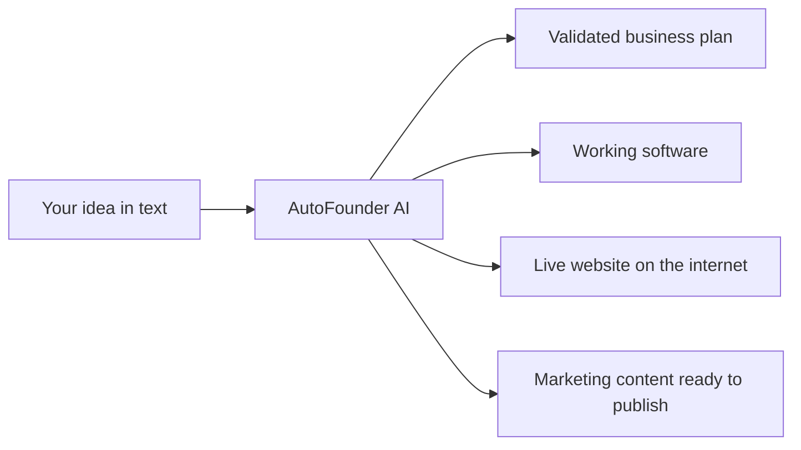
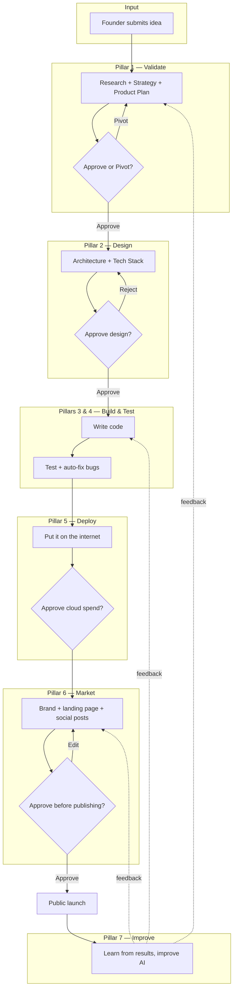
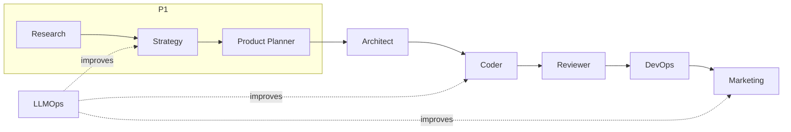
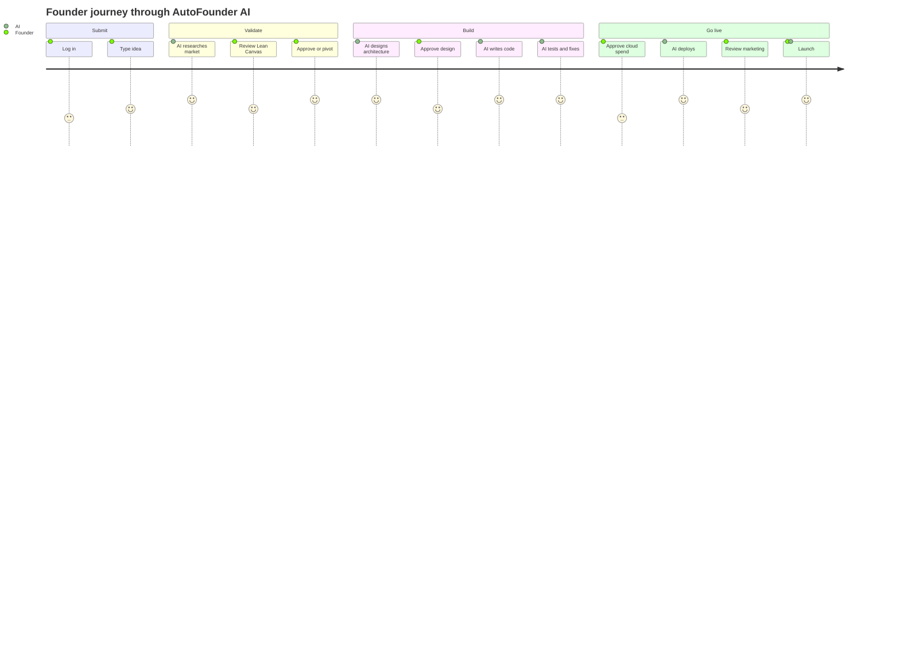
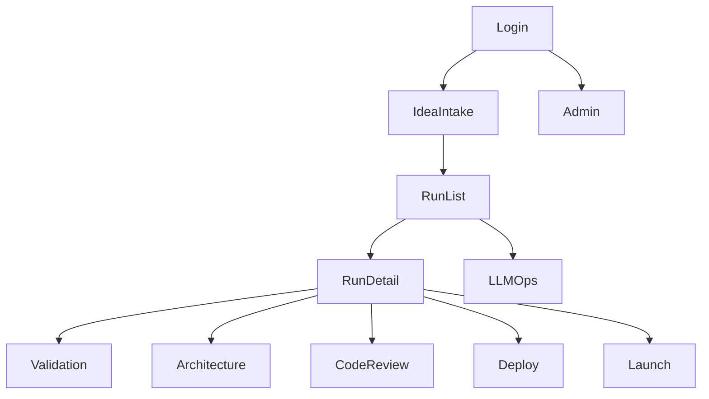
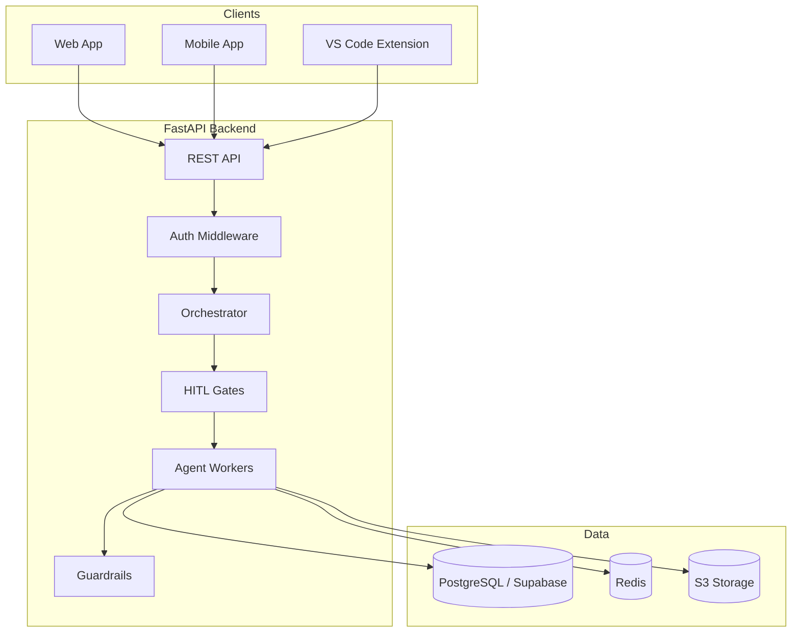
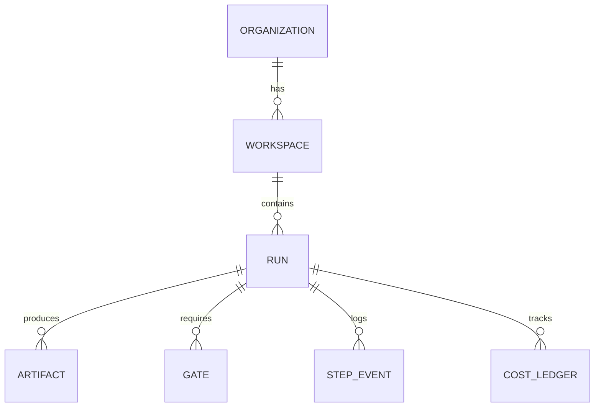
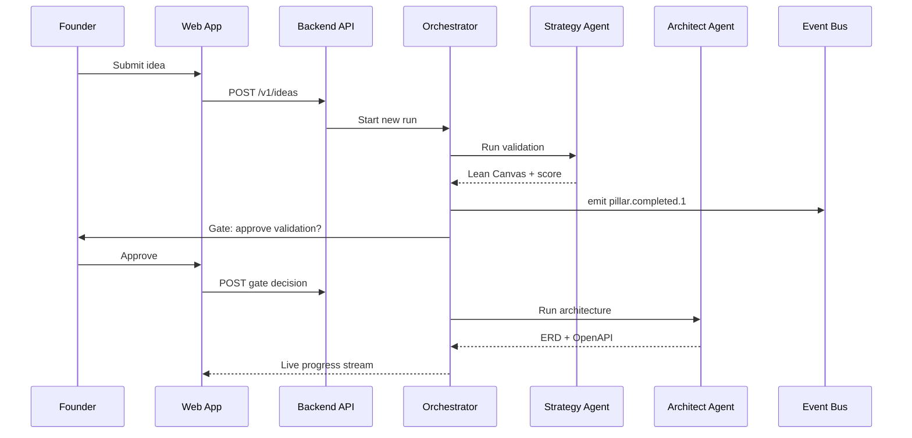
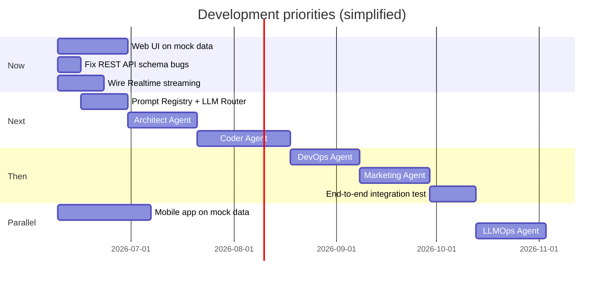

# AutoFounder AI — Project Understanding

> **Audience:** Non-technical founders and business stakeholders  
> **Purpose:** Plain-English explanation of what we are building, how it works, and where we stand today  
> **Last updated:** June 2026  
> **Sources reviewed:** PRD (`README.md`), task assignments, architecture docs, API/database specs, agent designs, and live source code in `PROJECT-1-AutoFounder-AI/`

> **Note:** A document titled "Runner Work Required" was not found in the repository. The closest equivalents are `task_assigned.md` (who owns what), `PLAN_PHASE.md` (current phase plan), and `CURRENT-STATUS.md` (what is actually built vs. planned).

---

## 1. What is this product?

**AutoFounder AI is an AI co-founder in software form.**

You type a business idea in plain English. The platform then runs a team of specialized AI agents that work together to:

- Research whether the idea makes sense
- Design the technical blueprint
- Write the actual software
- Test and fix the code
- Deploy it to the cloud
- Create marketing materials
- Keep learning and improving over time

The goal is to go from **idea → live, marketed product in about 7 days**, instead of the traditional **4–7 months** and **$20,000–$60,000** in cost.

Think of it like hiring an entire startup team (researcher, architect, developer, QA engineer, DevOps engineer, marketer, and data scientist) that never sleeps — but you stay in control at key decision points.



**Business model (planned pricing):**

| Tier | Price | Builds per month |
|------|-------|------------------|
| Solopreneur / Researcher | ₹10,000/month | 1 |
| Startup Founder | ₹50,000/month | 5 |
| Enterprise / Agency | Custom | Unlimited |

---

## 2. What problem does it solve?

Most startups fail for predictable, expensive reasons:

| Problem | What happens today | What AutoFounder AI does |
|---------|-------------------|--------------------------|
| Building something nobody wants | Weeks of guessing, ₹5L+ on validation | Market research + Lean Canvas in ~30 minutes |
| Picking the wrong technology | Weeks of debate among engineers | Architect agent recommends a stack in minutes |
| MVP costs too much / takes too long | 3–6 months, $15K–$50K | Target: 7 days, $200–$700 |
| Launch gets no traffic | 2–3 extra weeks of marketing work | Marketing agent drafts launch content in ~2 hours |

**The core insight:** ChatGPT and no-code tools give you *pieces* (snippets, prototypes). AutoFounder AI aims to deliver a *complete, deployable business* — validated, built, hosted, and ready to market.

---

## 3. Who are the users?

| User type | Example persona | What they need |
|-----------|-----------------|----------------|
| **Solopreneur** | Sudhanshu | Speed, low cost, one-click deploy |
| **Non-technical founder** | Santosh | Simple interface, no coding required |
| **AI researcher** | Asit | Trace logs, model metrics, benchmarking |
| **Agency / studio** | AutoFounder team | Multiple clients, white-labeling, code export |

**How they interact with the product:**

- **Web app (Founder Portal)** — main dashboard on a computer browser
- **Mobile app** — submit ideas and approve decisions on the go
- **VS Code extension** — for technical founders who want to watch builds inside their code editor

---

## 4. What are the major workflows?

The product is organized around **7 pillars** — seven big steps that mirror how a real startup gets built.



**Human-in-the-loop (HITL) gates:** At important moments, the AI pauses and asks the founder to approve, reject, or pivot. Nothing expensive or public happens without your sign-off.

| Gate | When it fires | Founder choice |
|------|---------------|----------------|
| Validation gate | After market research | Approve idea or pivot to a new angle |
| Architecture gate | After technical design | Approve or reject the blueprint |
| Infra spend gate | Before cloud resources are bought | Approve estimated monthly cost |
| Launch gate | Before anything goes public | Approve or edit marketing content |

---

## 5. Explain all 7 agents

The platform uses **7 specialized AI agents** — one per pillar. Each agent follows the same life cycle: **Understand → Plan → Execute → Verify → Learn**.

> Pillar 1 actually uses **three cooperating agents** (Research, Strategy, Product Planner). For simplicity, we describe all seven pillar-level agents below.

---

### Agent 1 — Strategy & Ideation (Pillar 1)

**Purpose:** Turn a raw idea into a validated business case. Answers: *"Should I build this?"*

| | Detail |
|---|--------|
| **Inputs** | Founder's text idea (also PDF, voice, or URL in future) |
| **Outputs** | Lean Canvas, viability score (0–100), 3–5 customer personas, competitor analysis, market size (TAM/SAM/SOM), bias audit, 3 pivot suggestions, 5-page market report |
| **Dependencies** | Platform foundation (database, auth, orchestrator), research tools (Tavily, SerpAPI, etc.), Prompt Registry, LLM Router |
| **Time target** | Under 30 minutes |
| **Status** | Built |

**Supporting agents in Pillar 1:**

- **Research Agent** — gathers live market data from the web (competitors, trends, citations)
- **Product Planner Agent** — writes the PRD (product requirements document), user stories, and roadmap *after* the founder approves validation

---

### Agent 2 — Architect (Pillar 2)

**Purpose:** Design how the software should be built before any code is written. Answers: *"What exactly are we building and with what tools?"*

| | Detail |
|---|--------|
| **Inputs** | Lean Canvas, personas, PRD, and feature list from Pillar 1 |
| **Outputs** | Database diagram (ERD), API contract (OpenAPI spec), recommended tech stack, microservice boundaries, auth plan, AWS cost forecast, scaling plan |
| **Dependencies** | Strategy/Product Planner outputs, BaseAgent framework, AWS Pricing API |
| **Time target** | Under 45 minutes (+ founder approval wait) |
| **Status** | Not built yet |

---

### Agent 3 — Coder (Pillar 3)

**Purpose:** Write the actual software — frontend, backend, database, payments, and CI/CD scaffolding. Answers: *"Build it."*

| | Detail |
|---|--------|
| **Inputs** | Architect's ERD, OpenAPI spec, stack choice, feature list |
| **Outputs** | Full GitHub repository (Next.js frontend + FastAPI backend), database migrations, Stripe billing, Supabase auth, test scaffolding, open Pull Request |
| **Dependencies** | Architect Agent output, GitHub integration, Tool Registry |
| **Time target** | Under 15–20 minutes |
| **Status** | Not built yet |

---

### Agent 4 — Reviewer / Self-Healer (Pillar 4)

**Purpose:** Quality-check the generated code and automatically fix problems. Answers: *"Is it safe and does it work?"*

| | Detail |
|---|--------|
| **Inputs** | Generated code repository from Coder Agent |
| **Outputs** | Test results, security scan report, fixed code (up to 5 repair cycles), coverage report (target ≥80%), pass/fail verdict for DevOps |
| **Dependencies** | Coder Agent output, security tools (Trivy, Semgrep, etc.), sandbox environment |
| **Time target** | Under 15 minutes |
| **Status** | Built |

**What it checks:** Linting, unit tests, end-to-end tests, security vulnerabilities, code quality. If something fails, it tries to fix it automatically (max 5 times) before escalating to a human.

---

### Agent 5 — DevOps (Pillar 5)

**Purpose:** Put the tested software on the internet with proper hosting, security, and monitoring. Answers: *"Make it live."*

| | Detail |
|---|--------|
| **Inputs** | Tested, green repository from Reviewer Agent |
| **Outputs** | Live URL with HTTPS, DNS configured, cloud infrastructure (Terraform), monitoring dashboards, smoke test results, rollback plan |
| **Dependencies** | Reviewer Agent output, AWS infrastructure (ECS Fargate, RDS, etc.), founder approval on cloud spend |
| **Time target** | Under 10 minutes (+ spend approval wait) |
| **Status** | Not built yet (skeleton file only) |

---

### Agent 6 — Marketing (Pillar 6)

**Purpose:** Create everything needed to announce and sell the product. Answers: *"How do we launch?"*

| | Detail |
|---|--------|
| **Inputs** | Live URL, brand info, feature list from Architect (for fact-checking) |
| **Outputs** | Brand kit (logo, colors), landing page copy, 10 SEO blog drafts, email drip sequences, Product Hunt kit, social posts (X, LinkedIn, Hacker News) |
| **Dependencies** | DevOps live URL, Architect feature list (anti-hallucination check), DALL-E for visuals |
| **Time target** | Under 45 minutes (+ founder launch approval) |
| **Status** | Not built yet |

**Safety rule:** Every marketing claim is cross-checked against the real feature list so the AI does not invent capabilities the product does not have.

---

### Agent 7 — LLMOps (Pillar 7)

**Purpose:** Continuously improve the AI system itself — like a data scientist watching all the other agents. Answers: *"How do we get better and cheaper over time?"*

| | Detail |
|---|--------|
| **Inputs** | Traces from all agent runs, founder feedback (thumbs up/down), cost data, quality scores |
| **Outputs** | Improved prompts, better model routing rules, drift alerts, A/B test results, weekly FinOps report |
| **Dependencies** | All other agents must be running to produce data; LangSmith, Promptfoo, DSPy |
| **Cadence** | Weekly optimization cycle + real-time cost/drift alerts |
| **Status** | Not built yet |

---

### Agent communication overview



---

## 6. Complete user journey

Here is the founder's experience from start to finish, in everyday language.

### Step 1 — Idea
The founder logs into the web app (or mobile app), types an idea like *"A subscription app that helps dog owners find trusted walkers in Bangalore"*, and hits Submit.

### Step 2 — Validation (~30 min)
The AI researches competitors, estimates market size, builds a Lean Canvas, scores viability 0–100, and suggests customer personas. The founder reviews everything in the **Validation Studio** and either approves, rejects, or pivots.

### Step 3 — Architecture (~2 hours)
If approved, the Architect agent designs the database, API, and tech stack with a cost estimate. The founder reviews diagrams and specs in the **Architecture Studio** and approves or sends it back.

### Step 4 — Coding (~7 days target)
The Coder agent writes the full application in parallel (website + server + database). The founder can watch progress in real time but does not need to code.

### Step 5 — Testing (automated)
The Reviewer agent runs tests and security scans, fixing bugs automatically. The founder sees results in the **Code Review Studio**.

### Step 6 — Deployment (~10 min)
The DevOps agent provisions cloud servers, sets up the domain and SSL certificate, and returns a live URL. The founder approves cloud spending first and can watch logs in the **Deploy Console**.

### Step 7 — Marketing (~2 hours)
The Marketing agent creates brand assets, landing page, blog posts, and social media drafts. The founder reviews everything in the **Launch Control Center** — nothing publishes until they approve.

### Step 8 — Launch & learn
After approval, content can be scheduled or published. The LLMOps agent tracks quality, cost, and user feedback to make the next build better.



---

## 7. All frontend screens required

The **Founder Portal** is a Next.js web application. These are the screens Raunak (web interface owner) must build:

| Screen | Route | What the founder sees |
|--------|-------|----------------------|
| **Login** | `/login` | Sign in with email/OAuth (Supabase Auth) |
| **Idea Intake** | `/idea` | Form to submit idea (text, PDF, voice, URL) |
| **Run List / Dashboard** | `/runs` | All past and current builds with status, cost, date |
| **Run Detail** | `/runs/[id]` | Live progress log for one build |
| **Validation Studio** | `/runs/[id]/validation` | Lean Canvas, viability gauge, personas, pivot picker, approve button |
| **Architecture Studio** | `/runs/[id]/architecture` | Database diagram, API docs viewer, cost forecast, approve/reject |
| **Code Review Studio** | `/runs/[id]/review` | Code diff viewer, test results, security scan table, heal progress |
| **Deploy Console** | `/runs/[id]/deploy` | Live deployment logs, spend approval, live URL, rollback button |
| **Launch Control Center** | `/runs/[id]/launch` | Brand preview, landing page preview, social drafts, email preview, approve/edit |
| **LLMOps Dashboard** | `/llmops` | Cost charts, quality drift, prompt versions |
| **Admin Dashboard** | `/admin` | Tenant management, model registry, audit logs (super-admin only) |

**Layout features across all screens:**
- Navigation sidebar
- Live cost ticker (how much this build is spending)
- Gate approval banners when the AI needs a decision
- Loading, error, and empty states on every screen



**Current status:** Only a placeholder file exists. No real screens built yet. The plan is to build all screens on **mock (fake) data first**, then connect to the real backend.

> **Important:** There is a separate `website/` folder — that is the public marketing landing page (like a brochure), **not** the Founder Portal.

---

## 8. All backend services required

The backend is one Python (FastAPI) application that acts as the brain of the platform.

| Service | What it does |
|---------|-------------|
| **API Gateway** | Receives requests from web, mobile, and VS Code extension |
| **Auth Service** | Validates login tokens (Supabase JWT), enforces permissions |
| **Run Service** | Creates and tracks each "build" from idea to launch |
| **Orchestrator (LangGraph)** | Coordinates which agent runs when, saves progress, handles retries |
| **HITL Gate Manager** | Pauses the pipeline and waits for founder approval |
| **SQS Worker** | Background job processor that runs agent steps |
| **UDAL (Unified Data Access Layer)** | Safe, tenant-isolated access to all databases |
| **Guardrails Pipeline** | Security filters on every AI call (PII, injection, toxicity) |
| **Tool Registry** | Approved list of external APIs agents can call |
| **Prompt Registry** | Version-controlled AI instruction templates |
| **LLM Router** | Picks the right AI model for each task |
| **Agent Workers** | The 7 pillar agents (strategy, architect, coder, etc.) |
| **Realtime / WebSocket** | Streams live progress to the UI |
| **Cost Tracker** | Records AI and API spending per tenant |
| **Notification Service** | Email and push alerts when gates need attention |



---

## 9. All APIs required

These are the main REST API endpoints the frontend calls. All require authentication unless noted.

| Method | Endpoint | Purpose |
|--------|----------|---------|
| `POST` | `/v1/ideas` | Submit a new idea → returns a run ID |
| `GET` | `/v1/runs/{id}` | Get status of one build |
| `GET` | `/v1/runs/{id}/artifacts` | Download outputs (canvas, diagrams, code, etc.) |
| `POST` | `/v1/runs/{id}/gates/{gate_id}` | Approve or reject a decision gate |
| `GET` | `/v1/runs/{id}/stream` | WebSocket for live progress updates |
| `DELETE` | `/v1/runs/{id}` | Cancel a running build |
| `GET` | `/v1/workspaces` | List project workspaces |
| `POST` | `/v1/workspaces` | Create a new workspace |
| `GET` | `/v1/workspaces/{id}/runs` | List builds in a workspace |
| `POST` | `/v1/feedback` | Send thumbs up/down for AI learning |
| `GET` | `/v1/llmops/cost` | View AI spending for your account |
| `POST` | `/v1/organizations/{id}/keys` | Rotate API keys |
| `POST` | `/v1/webhooks/stripe` | Handle payment events (internal) |
| `GET` | `/health` | Health check (no auth) |

**Response format:** Every response is wrapped in a standard envelope with `data`, `meta` (request ID, timestamp), and structured error codes like `AF_ERR_NOT_FOUND`.

**Rate limits (planned):**

| Tier | Requests per minute |
|------|---------------------|
| Solopreneur | 30 |
| Startup | 120 |
| Enterprise | 600 |

---

## 10. Database entities

Think of the database as a filing cabinet with strict rules so one customer's files can never mix with another's.

### Hierarchy

```
Organization (your company account)
  └── Workspace (one project)
        └── Run (one full idea-to-launch attempt)
              ├── Artifacts (outputs: canvas, code, URLs)
              ├── Gates (approval checkpoints)
              ├── Step Events (activity log)
              └── Cost Ledger (spending record)
```

### Main tables

| Entity | Plain English | Key fields |
|--------|---------------|------------|
| **Organization** | Your billing account | name, subscription tier, status |
| **Workspace** | A project folder | name, settings |
| **Run** | One build attempt | idea text, status, current pillar, total cost |
| **Artifact** | Something the AI produced | type (canvas, ERD, code repo URL), file location |
| **Gate** | A pause for your approval | kind (validation, architecture, launch), state (pending/approved/rejected) |
| **Step Event** | A line in the activity log | which agent, what happened, timestamp |
| **Memory Episode** | What the AI learned from this run | stored for future runs |
| **Cost Ledger** | Bill for AI usage | model used, tokens, dollars |
| **Prompt Registry** | Versioned AI instructions | template name, version, active/canary |
| **Tool Registry** | Approved external APIs | tool name, rate limits |
| **Audit Log** | Compliance record (7-year retention) | who did what, when |

### Security model

- Each customer gets their own **database schema** (like a separate locked room)
- **Row-level security** as a backup lock
- Redis cache keys are also prefixed by organization ID
- Deleting a customer = drop their entire schema (GDPR right to erasure)



---

## 11. External integrations

The platform talks to many outside services. Founders do not configure these — agents use them behind the scenes.

| Category | Services | Used for |
|----------|----------|----------|
| **Authentication** | Supabase Auth | Login, MFA, organization management |
| **Payments** | Stripe | Subscriptions, billing |
| **AI / LLM** | Google Gemini (primary), Claude (fallback) | All reasoning and code generation |
| **Embeddings** | gemini-embedding-2 | Search and memory |
| **Image generation** | DALL-E 3 | Brand logos and marketing visuals |
| **Speech** | OpenAI Whisper | Voice note transcription |
| **Research** | Tavily, SerpAPI, Crunchbase, G2, SimilarWeb | Market and competitor data |
| **Code hosting** | GitHub | Store generated code, open PRs |
| **Cloud hosting** | AWS (ECS Fargate, S3, ElastiCache, Route 53) | Run the platform and deployed apps |
| **Database** | Supabase (PostgreSQL + pgvector) | Data + vector search |
| **Cache** | Redis | Speed, session state, checkpoints |
| **Messaging** | AWS EventBridge, SQS, SNS | Agent coordination, notifications |
| **Email** | Resend | Gate alerts, receipts |
| **Push notifications** | Expo Push + SNS | Mobile alerts |
| **Marketing platforms** | X, LinkedIn, Reddit, ProductHunt | Launch content (after approval) |
| **Observability** | LangSmith, Sentry, Prometheus, Grafana, OpenTelemetry | Monitoring and debugging |
| **Security** | OPA, Presidio, Llama Guard (planned) | Policy and content safety |

**Golden rule:** Agents never call external APIs directly. Every call goes through the Tool Registry and Guardrails pipeline first.

---

## 12. How agents communicate

Agents do not chat like humans in a group message. They pass structured outputs through a central **orchestrator** (conductor).

### Three communication channels

| Channel | Speed | Used for |
|---------|-------|----------|
| **Orchestrator state** | Synchronous | Passing outputs from Agent A → Agent B in order |
| **Event bus (EventBridge + SQS)** | Asynchronous | "Pillar 1 complete", "gate required", "run failed" |
| **gRPC** | Fast internal calls | Agent-to-agent handoffs with typed contracts |
| **Supabase Realtime / WebSocket** | Streaming to UI | Live logs and token streams for the founder |



### Data handoff chain (what each agent gives the next)

| From | Gives | To |
|------|-------|-----|
| Research + Strategy + Product Planner | Lean Canvas, PRD, feature list | Architect |
| Architect | ERD, OpenAPI, stack, cost forecast | Coder **and** Marketing (for fact-checking) |
| Coder | GitHub repository | Reviewer |
| Reviewer | Tested, green repository | DevOps |
| DevOps | Live URL | Marketing |
| All agents | Traces and feedback | LLMOps |

---

## 13. What is already implemented

As of June 2026, the project has made strong progress on the **engine** but the **founder-facing UI** is still mostly unbuilt.

### Done (49 of 78 tasks per task tracker)

| Area | What exists |
|------|-------------|
| **Monorepo setup** | pnpm workspace, Docker, linting, dev scripts |
| **Cloud infrastructure (Terraform)** | VPC, ECS, Redis, S3, messaging, load balancer, IAM, secrets, ECR, CI/CD workflows |
| **Database** | Migrations for platform + per-tenant schemas, pgvector |
| **UDAL** | Tenant-safe database access layer |
| **FastAPI backend** | App bootstrap, auth middleware, REST endpoints |
| **Orchestrator** | LangGraph state graph, HITL gates, SQS worker, checkpoints |
| **Pillar 1 agents** | Strategy, Research, Product Planner — full LangGraph implementations |
| **Pillar 4 agent** | Reviewer / Self-Healer — 14-node pipeline with tests |
| **Platform plumbing** | BaseAgent framework, Tool Registry, Guardrails pipeline (MVP) |
| **VS Code extension** | Run monitoring, gate approvals, artifact viewer, code-gen commands |
| **Marketing website** | Public landing page (`website/`) on Vercel |
| **API client package** | Hand-written TypeScript client (minimal) |

### Partially done

| Area | Gap |
|------|-----|
| REST API | Some schema mismatches between code and database (idea text may not persist correctly) |
| Realtime streaming | Database trigger exists; full WebSocket consumer not wired |
| Guardrails | MVP fallbacks (regex/heuristics) — production services (Presidio, Llama Guard) not deployed |
| Prompt Registry / LLM Router / Eval harness | Database tables exist; logic not built |
| DevOps agent | Skeleton file only |

---

## 14. What is missing

### Critical path (blocks end-to-end demo)

| Missing piece | Owner | Impact |
|---------------|-------|--------|
| **Founder Portal (all 12 screens)** | Raunak | Founders cannot use the product |
| **Architect Agent** | Kaushlendra | Cannot design software after validation |
| **Coder Agent** | Kartik | Cannot generate code |
| **DevOps Agent** | Prasenjit | Cannot deploy to live URL |
| **Marketing Agent** | Pallavi | Cannot create launch materials |
| **LLMOps Agent + shared plumbing** | Purnima | No prompt versioning, model routing, or continuous improvement |
| **Mobile app (9 screens)** | Yogesh | No on-the-go experience |
| **End-to-end integration test** | Team | No proof the full pipeline works together |

### Known bugs / technical debt

- REST API database model mismatch (tests pass with mocks but real DB may fail)
- Realtime is scaffold-only — UI must poll instead of streaming live
- Some infrastructure follow-ups: CodeDeploy blue/green, CloudFront, live Grafana/LangSmith
- Finance & Ops/Risk agents deferred to Phase 4

### Task count summary

| Phase | Status |
|-------|--------|
| Phase 1 — Monorepo | 11/11 done |
| Phase 2 — Infrastructure | 13/13 done |
| Phase 3 — Backend + Agents | 18/26 done |
| Phase 4 — Web Frontend | 0/12 done |
| Phase 5 — Mobile | 0/9 done |
| Phase 6 — VS Code Extension | 7/7 done |
| **Total** | **49/78 done, 29 pending** |

---

## 15. Sample / mock data required

Before real agent outputs exist, the frontend team needs realistic fake data to design and test every screen.

| Mock file / dataset | Used on screen | What it should contain |
|---------------------|----------------|------------------------|
| `mock_lean_canvas.json` | Validation Studio | Problem, solution, channels, revenue streams, etc. |
| `mock_viability.json` | Validation Studio | Score 0–100, band (strong/moderate/weak), 3 pivot options |
| `mock_icps.json` | Validation Studio | 3–5 customer persona cards with demographics and pain points |
| `mock_competitors.json` | Validation Studio | Competitor names, strengths, weaknesses, pricing |
| `mock_prd.json` | Validation Studio | Product requirements, user stories, MoSCoW feature list |
| `mock_erd_openapi.json` | Architecture Studio | Mermaid ERD diagram + OpenAPI 3.1 spec |
| `mock_stack_cost.json` | Architecture Studio | Recommended stack cards + monthly AWS cost estimate |
| `mock_code_diff.json` | Code Review Studio | Before/after code snippets for Monaco diff viewer |
| `mock_review_report.json` | Code Review Studio | Test coverage %, security findings, heal cycle count |
| `mock_deploy_stream.json` | Deploy Console | Timestamped deployment log lines |
| `mock_live_url.json` | Deploy Console | `https://my-app.autofounder.ai` badge + smoke test pass/fail |
| `mock_launch_kit.json` | Launch Control Center | Brand colors, logo URL, landing page HTML, social drafts |
| `mock_social_posts.json` | Launch Control Center | X thread, LinkedIn post, Hacker News post (editable) |
| `mock_email_sequence.json` | Launch Control Center | 5-email onboarding drip preview |
| `mock_llmops_cost.json` | LLMOps Dashboard | Cost by model, pillar, and run over time |
| `mock_runs_list.json` | Run Dashboard | 10+ sample runs with mixed statuses and costs |
| `mock_gates.json` | All gate UIs | Pending validation, architecture, spend, and launch gates |
| `mock_step_events.json` | Run detail / Deploy Console | Stream of agent activity messages |
| `mock_admin_tenants.json` | Admin Dashboard | Sample organizations, tiers, statuses |

**Rule from the design plan:** Mock data is for development only. In production, screens show **"No data yet"** — never fake data presented as real.

---

## 16. Development priorities

Recommended build order based on the critical path and who is unblocked:



### Priority list (plain English)

1. **Raunak: Build the Founder Portal on mock data** — unblocks demos, design review, and investor conversations without waiting for backend agents.
2. **Somesh/Asit: Fix API + Realtime bugs** — so the UI can connect to real data when ready.
3. **Purnima: Prompt Registry + LLM Router + Eval harness** — every agent needs this plumbing.
4. **Kaushlendra: Architect Agent** — unlocks the build pipeline after validation.
5. **Kartik: Coder Agent** — the core "it writes software" capability.
6. **Prasenjit: DevOps Agent** — makes products reachable on the internet.
7. **Pallavi: Marketing Agent** — completes the go-to-market story.
8. **Integration testing** — one full idea-to-launch run with two isolated tenants.
9. **Yogesh: Mobile app** — parallel track, not blocking web MVP.
10. **Purnima: LLMOps Agent** — last, because it needs live agent data to learn from.

**Phase 1 milestone (current focus):** 10 pilot clients complete idea → validated (Lean Canvas + PRD + approval gate) through the UI.

---

## 17. Risks, assumptions, and open questions

### Risks

| Risk | Why it matters | Mitigation |
|------|----------------|------------|
| AI hallucinates in code or marketing | Broken product or false claims | Guardrails, fact-check against feature list, ≥80% test coverage gate |
| Prompt injection via idea text | Security breach | Input guardrails (PII redaction, injection detection) |
| One tenant sees another's data | Existential trust failure | Schema-per-tenant, row-level security, audit on breach |
| Runaway AI costs | Unprofitable unit economics | Per-tenant caps, circuit breakers, cheapest-capable model routing |
| Single person owns too much (Asit) | Bus factor of 1, delays everyone | Delegate orchestrator, extension, or guardrails |
| Gemini latency exceeds 30-min SLA | Bad founder experience | Stream partial results, cache similar ideas |
| Generated code fails review after 5 retries | Pipeline stalls | Escalate to human, show clear error in UI |
| Infrastructure not fully production-hardened | Deploy failures | Blue/green deploy, smoke tests, 1-click rollback |

### Assumptions

- Founders will approve/reject at gates within reasonable time (15–30 min timeouts configured)
- Google Gemini remains the primary LLM with acceptable cost and quality
- AWS ECS Fargate is the deployment target (not Kubernetes/EKS)
- Supabase handles auth, PostgreSQL, pgvector, and realtime for the control plane
- Each MVP build should cost under ₹500 in AI/API fees
- Non-technical founders are the primary audience for the web UI
- Phase 1 proves validation (Pillar 1) before building Pillars 2–7

### Open questions

| # | Question | Who should decide |
|---|----------|-------------------|
| 1 | How does AWS account ownership transfer work when a founder "ejects" their code? | Product + Legal |
| 2 | Will we support multi-cloud (GCP/Azure) for Enterprise tier? | Architecture |
| 3 | Neo4j vs Amazon Neptune for graph database — which wins benchmarks? | Purnima / Asit |
| 4 | Should Research or Product Planner move off Somesh to balance load? | Asit (lead) |
| 5 | Is the Admin Dashboard (AF-062) too large for one person? Split it? | Raunak + Asit |
| 6 | When do Finance & Ops/Risk agents get designed? (Phase 4 deferred) | Asit |
| 7 | Native mobile apps — Phase 2 or later? | Product |
| 8 | On-prem LLM for regulated Enterprise customers — ops playbook? | Purnima |
| 9 | Has the `.env.example` secrets leak been fully rotated and purged from git history? | Security |
| 10 | What is the exact artifact JSON schema for each pillar? (Needed for UI mock → real swap) | Each pillar owner |

---

## Quick reference — who owns what

| Person | Area |
|--------|------|
| **Asit Piri** | Platform lead, infrastructure, guardrails, VS Code extension |
| **Somesh Chitranshi** | Pillar 1 agents + orchestrator + core API |
| **Kaushlendra Kumar Gupta** | Architect Agent (Pillar 2) |
| **Kartik Mogalapalli** | Coder Agent (Pillar 3) |
| **Vishal Prasad** | Reviewer Agent (Pillar 4) + infra execution |
| **Prasenjit Roy** | DevOps Agent (Pillar 5) |
| **Pallavi Anil Sindkar** | Marketing Agent (Pillar 6) |
| **Purnima** | LLMOps + Prompt Registry + LLM Router + Evals |
| **Raunak Ravi** | Web Founder Portal (12 screens) |
| **Yogesh Raut** | Mobile app (9 screens) |

---

## Document map — where to learn more

| Topic | File in repository |
|-------|-------------------|
| Product requirements | `PROJECT-1-AutoFounder-AI/README.md` |
| Task ownership & status | `PROJECT-1-AutoFounder-AI/.claude/task_assigned.md` |
| What is actually built | `PROJECT-1-AutoFounder-AI/.claude/CURRENT-STATUS.md` |
| Current phase plan | `PROJECT-1-AutoFounder-AI/.claude/PLAN_PHASE.md` |
| Architecture (10 layers) | `PROJECT-1-AutoFounder-AI/docs/architecture/HLD.md` |
| API specification | `PROJECT-1-AutoFounder-AI/.claude/specs/api-design.md` |
| Database design | `PROJECT-1-AutoFounder-AI/.claude/specs/database.md` |
| Agent details | `PROJECT-1-AutoFounder-AI/docs/architecture/Agents-Architecture/` |
| Web frontend plan | `PROJECT-1-AutoFounder-AI/.claude/developer-plans/09-raunak-web-frontend-plan.md` |

---

*This document was prepared to give founders a single, readable map of AutoFounder AI — what it is, how it works, what exists today, and what comes next.*
